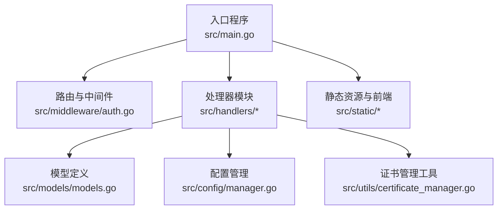
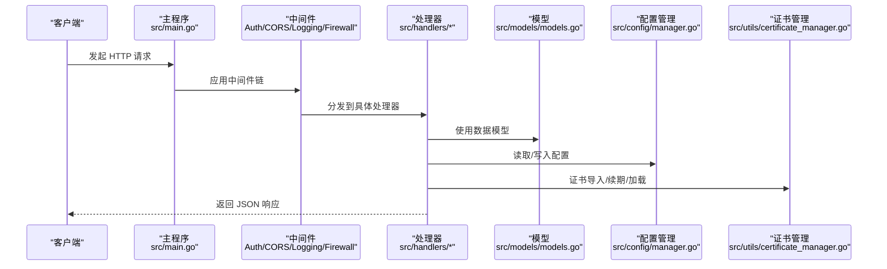
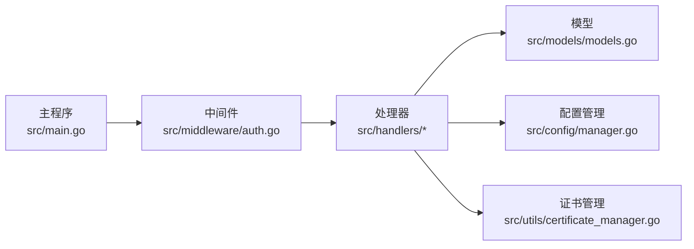

# API 接口文档

<cite>
**本文档引用的文件**
- [src/main.go](file://src/main.go)
- [src/handlers/api.go](file://src/handlers/api.go)
- [src/handlers/auth.go](file://src/handlers/auth.go)
- [src/handlers/certificates.go](file://src/handlers/certificates.go)
- [src/handlers/metrics.go](file://src/handlers/metrics.go)
- [src/handlers/security_logs.go](file://src/handlers/security_logs.go)
- [src/handlers/terminal.go](file://src/handlers/terminal.go)
- [src/handlers/firewall.go](file://src/handlers/firewall.go)
- [src/middleware/auth.go](file://src/middleware/auth.go)
- [src/models/models.go](file://src/models/models.go)
- [src/config/manager.go](file://src/config/manager.go)
- [src/utils/certificate_manager.go](file://src/utils/certificate_manager.go)
- [README.md](file://README.md)
</cite>

## 目录
1. [简介](#简介)
2. [项目结构](#项目结构)
3. [核心组件](#核心组件)
4. [架构总览](#架构总览)
5. [详细组件分析](#详细组件分析)
6. [依赖关系分析](#依赖关系分析)
7. [性能考虑](#性能考虑)
8. [故障排除指南](#故障排除指南)
9. [结论](#结论)
10. [附录](#附录)

## 简介
本文件为 Caddy Panel 的完整 API 接口文档，覆盖认证、配置管理、监听器与服务管理、用户管理、证书管理、SSH 管理、监控、日志与安全、防火墙以及 WebSocket 终端等模块。文档提供每个 RESTful 端点的 HTTP 方法、URL 模式、请求参数、响应格式、状态码、请求示例、响应示例与错误处理说明，并包含 API 版本管理与向后兼容性信息。

## 项目结构
Caddy Panel 采用 Go 语言开发，采用分层架构：入口程序负责路由注册与中间件装配，处理器模块负责具体业务逻辑，模型定义数据结构，配置与工具模块提供运行时配置与辅助能力。

图表来源
- [src/main.go:112-430](file://src/main.go#L112-L430)
- [src/middleware/auth.go:14-119](file://src/middleware/auth.go#L14-L119)

章节来源
- [src/main.go:112-430](file://src/main.go#L112-L430)
- [README.md:20-42](file://README.md#L20-L42)

## 核心组件
- 路由与中间件：负责认证、CORS、日志与防火墙等横切关注点。
- 处理器：实现各业务域的 API，如认证、配置、监听器、服务、用户、证书、SSH、监控、日志、安全与防火墙。
- 模型：定义请求/响应数据结构，如监听器、服务、用户、证书、防火墙规则等。
- 配置管理：负责持久化配置的读取、保存与规范化。
- 证书管理：负责证书的导入、ACME 申请与续期、运行时加载与回退证书。

章节来源
- [src/handlers/api.go:20-115](file://src/handlers/api.go#L20-L115)
- [src/models/models.go:72-394](file://src/models/models.go#L72-L394)
- [src/config/manager.go:35-107](file://src/config/manager.go#L35-L107)
- [src/utils/certificate_manager.go:126-166](file://src/utils/certificate_manager.go#L126-L166)

## 架构总览
Caddy Panel 的 HTTP 服务通过主程序注册路由，挂载认证、CORS、日志与防火墙中间件，然后将 API 请求分发至相应处理器。WebSocket 终端通过独立路由接入。

图表来源
- [src/main.go:421-427](file://src/main.go#L421-L427)
- [src/middleware/auth.go:14-119](file://src/middleware/auth.go#L14-L119)
- [src/handlers/api.go:95-115](file://src/handlers/api.go#L95-L115)

## 详细组件分析

### 通用响应格式
所有 API 均采用统一响应结构，包含 success、data、error、message 字段。成功时返回 200，失败时返回对应状态码并包含错误信息。

- 成功响应：{"success": true, "data": {...}, "message": "..."}
- 失败响应：{"success": false, "error": "错误信息"}

章节来源
- [src/handlers/api.go:20-26](file://src/handlers/api.go#L20-L26)
- [src/handlers/api.go:95-115](file://src/handlers/api.go#L95-L115)

### 认证接口
- 登录
  - 方法：POST
  - URL：/api/login
  - 请求体：{"username": "string", "password": "string"}
  - 响应：{"success": true, "data": {"token": "string", "user": {"username": "string", "role": "string"}}}
  - 状态码：200 成功，400 请求无效，401 凭证无效，403 用户被禁用
  - 错误：无效凭证、用户被禁用
- 登出
  - 方法：POST
  - URL：/api/logout
  - 响应：{"success": true, "data": {"message": "Logged out successfully"}}
  - 状态码：200
- 当前用户
  - 方法：GET
  - URL：/api/me
  - 响应：{"success": true, "data": {"username": "string", "email": "string", "enabled": true, "role": "string"}}
  - 状态码：200，401 未授权
- 公钥
  - 方法：GET
  - URL：/api/auth/public-key
  - 响应：{"success": true, "data": {"public_key": "string"}}

章节来源
- [src/handlers/auth.go:37-76](file://src/handlers/auth.go#L37-L76)
- [src/handlers/auth.go:84-110](file://src/handlers/auth.go#L84-L110)
- [src/handlers/auth.go:78-82](file://src/handlers/auth.go#L78-L82)

### 配置管理接口
- 获取配置
  - 方法：GET
  - URL：/api/config
  - 响应：{"success": true, "data": { "admin_port": int, "default_auth": bool, "log_level": "string", "log_file": "string", "log_retention_days": int, "max_access_log_entries": int, "certificate_config_path": "string", "certificate_sync_interval_seconds": int, "effective_paths": {...} }}
  - 状态码：200
- 更新配置
  - 方法：PUT
  - URL：/api/config
  - 请求体：GlobalConfig 对象
  - 响应：更新后的 GlobalConfig
  - 状态码：200，400 请求无效，500 保存失败

章节来源
- [src/handlers/api.go:732-775](file://src/handlers/api.go#L732-L775)
- [src/models/models.go:299-310](file://src/models/models.go#L299-L310)

### 监听器管理接口
- 列表
  - 方法：GET
  - URL：/api/listeners
  - 响应：数组，元素包含 PortListener 与 running 字段
  - 状态码：200
- 新增
  - 方法：POST
  - URL：/api/listeners
  - 请求体：PortListener + 可选 default_service
  - 响应：新增的 PortListener
  - 状态码：200，400 参数无效或端口冲突，500 保存失败
- 更新
  - 方法：PUT
  - URL：/api/listeners/{id}
  - 请求体：PortListener
  - 响应：更新后的 PortListener
  - 状态码：200，400 端口冲突，404 未找到，500 保存失败
- 删除
  - 方法：DELETE
  - URL：/api/listeners/{id}
  - 响应：null
  - 状态码：200，404 未找到，500 删除失败
- 启停
  - 方法：POST
  - URL：/api/listeners/{id}/toggle
  - 响应：切换后的 PortListener
  - 状态码：200，404 未找到，500 操作失败
- 重载
  - 方法：POST
  - URL：/api/listeners/{id}/reload
  - 响应：重载后的 PortListener
  - 状态码：200，400 未启用，404 未找到，500 重载失败

章节来源
- [src/handlers/api.go:139-375](file://src/handlers/api.go#L139-L375)
- [src/models/models.go:72-80](file://src/models/models.go#L72-L80)

### 服务管理接口
- 列表
  - 方法：GET
  - URL：/api/services?port_id={id}
  - 响应：数组，元素为 ServiceConfig
  - 状态码：200
- 新增
  - 方法：POST
  - URL：/api/services
  - 请求体：ServiceConfig
  - 响应：新增的 ServiceConfig
  - 状态码：200，400 请求无效，500 保存失败
- 更新
  - 方法：PUT
  - URL：/api/services/{id}
  - 请求体：ServiceConfig
  - 响应：更新后的 ServiceConfig
  - 状态码：200，404 未找到，500 保存失败
- 删除
  - 方法：DELETE
  - URL：/api/services/{id}
  - 响应：null
  - 状态码：200，404 未找到，500 删除失败
- 启停
  - 方法：POST
  - URL：/api/services/{id}/toggle
  - 响应：切换后的 ServiceConfig
  - 状态码：200，404 未找到，500 操作失败
- 重排
  - 方法：POST
  - URL：/api/services/reorder
  - 请求体：{"port_id": "string", "ordered_ids": ["string"]}
  - 响应：重排后的服务列表
  - 状态码：200，400 缺少 port_id，500 保存失败

章节来源
- [src/handlers/api.go:377-529](file://src/handlers/api.go#L377-L529)
- [src/models/models.go:93-107](file://src/models/models.go#L93-L107)

### 用户管理接口
- 列表
  - 方法：GET
  - URL：/api/users
  - 响应：数组，元素为 User（密码字段为空）
  - 状态码：200
- 新增
  - 方法：POST
  - URL：/api/users
  - 请求体：User（密码可为加密前或加密后，内部自动解密与哈希）
  - 响应：新增的 User（密码字段为空）
  - 状态码：200，400 请求无效或 token 冲突，500 保存失败
- 更新
  - 方法：PUT
  - URL：/api/users/{id}
  - 请求体：User（可选字段）
  - 响应：更新后的 User（密码字段为空）
  - 状态码：200，400 token 冲突，404 未找到，500 保存失败
- 启停
  - 方法：POST
  - URL：/api/users/{id}/toggle
  - 响应：切换后的 User（密码字段为空）
  - 状态码：200，400 至少保留一个启用用户，404 未找到，500 操作失败
- 删除
  - 方法：DELETE
  - URL：/api/users/{id}
  - 响应：null
  - 状态码：200，400 至少保留一个启用用户，404 未找到，500 删除失败

章节来源
- [src/handlers/api.go:531-730](file://src/handlers/api.go#L531-L730)
- [src/models/models.go:256-267](file://src/models/models.go#L256-L267)

### 证书管理接口
- 列表
  - 方法：GET
  - URL：/api/certificates
  - 响应：数组，元素为 CertificateConfig（敏感字段掩码）
  - 状态码：200
- 新增
  - 方法：POST
  - URL：/api/certificates
  - 请求体：JSON 或 multipart/form-data
    - JSON：{"name": "string", "domains": ["string"], "source": "acme|import|file_sync", "challenge_type": "http01|dns01", "dns_provider": "tencentcloud|alidns|cloudflare", "dns_config": {...}, "account_email": "string", "auto_renew": true, "renew_before_days": int, "cert_pem": "string", "key_pem": "string"}
    - multipart/form-data：name、domains、source、challenge_type、dns_provider、account_email、auto_renew、renew_before_days、cert_file、key_file
  - 响应：新增的 CertificateConfig（敏感字段掩码）
  - 状态码：200，400 请求无效或证书来源不支持，500 保存失败
- 更新
  - 方法：PUT
  - URL：/api/certificates/{id}
  - 请求体：同上
  - 响应：更新后的 CertificateConfig（敏感字段掩码）
  - 状态码：200，400 请求无效，404 未找到，500 保存失败
- 删除
  - 方法：DELETE
  - URL：/api/certificates/{id}
  - 响应：null
  - 状态码：200，404 未找到，500 删除失败
- 续期
  - 方法：POST
  - URL：/api/certificates/{id}/renew
  - 响应：续期后的 CertificateConfig（敏感字段掩码）
  - 状态码：200，400 请求无效，404 未找到，500 续期失败

章节来源
- [src/handlers/certificates.go:32-149](file://src/handlers/certificates.go#L32-L149)
- [src/models/models.go:221-254](file://src/models/models.go#L221-L254)

### SSH 管理接口
- 列表
  - 方法：GET
  - URL：/api/ssh-connections
  - 响应：数组，元素为 SSHConnection（密码字段为空）
  - 状态码：200
- 新增
  - 方法：POST
  - URL：/api/ssh-connections
  - 请求体：SSHConnection（密码可加密提交，服务端加密存储）
  - 响应：新增的 SSHConnection（密码字段为空）
  - 状态码：200，400 请求无效，500 保存失败
- 更新
  - 方法：PUT
  - URL：/api/ssh-connections/{id}
  - 请求体：SSHConnection（可选字段）
  - 响应：更新后的 SSHConnection（密码字段为空）
  - 状态码：200，400 请求无效，404 未找到，500 保存失败
- 删除
  - 方法：DELETE
  - URL：/api/ssh-connections/{id}
  - 响应：null
  - 状态码：200，404 未找到，500 删除失败
- 测试
  - 方法：POST
  - URL：/api/ssh-connections/{id}/test
  - 响应：{"success": true, "data": null, "message": "SSH 连接测试成功"}
  - 状态码：200，404 未找到，400 测试失败，500 本机终端不可用

章节来源
- [src/handlers/terminal.go:69-275](file://src/handlers/terminal.go#L69-L275)
- [src/models/models.go:269-281](file://src/models/models.go#L269-L281)

### 终端会话接口
- 列表
  - 方法：GET
  - URL：/api/terminal-sessions
  - 响应：数组，元素为 TerminalManagedSession
  - 状态码：200
- 新增
  - 方法：POST
  - URL：/api/terminal-sessions
  - 请求体：{"connection_id": "string"}
  - 响应：创建的 TerminalManagedSession
  - 状态码：200，400 缺少 connection_id，404 未找到连接，500 创建失败
- 删除
  - 方法：DELETE
  - URL：/api/terminal-sessions/{id}
  - 响应：null
  - 状态码：200，404 未找到会话，500 关闭失败
- 心跳
  - 方法：POST
  - URL：/api/terminal-sessions/{id}/heartbeat
  - 响应：更新后的 TerminalManagedSession
  - 状态码：200，404 未找到会话，500 心跳失败

章节来源
- [src/handlers/terminal.go:277-351](file://src/handlers/terminal.go#L277-L351)
- [src/models/models.go:283-297](file://src/models/models.go#L283-L297)

### WebSocket 终端
- 连接
  - 方法：GET
  - URL：/ws/terminal?session_id={id}
  - 响应：升级为 WebSocket，后续为实时消息
  - 状态码：101 切换协议，400 缺少 session_id，404 未找到会话，500 协议升级失败
- 消息格式
  - 输入：{"type": "input", "data": "字符串"}
  - 调整窗口：{"type": "resize", "cols": 数字, "rows": 数字}
  - 心跳：{"type": "ping"}
  - 关闭：{"type": "close"}
  - 输出：{"type": "stdout"|"stderr", "data": "字符串"}

章节来源
- [src/handlers/terminal.go:353-377](file://src/handlers/terminal.go#L353-L377)
- [src/handlers/terminal.go:512-552](file://src/handlers/terminal.go#L512-L552)

### 监控与日志接口
- 服务器状态
  - 方法：GET
  - URL：/api/status
  - 响应：ServerStatus
  - 状态码：200，500 获取状态失败
- 24小时网络历史
  - 方法：GET
  - URL：/api/metrics/network-history
  - 响应：NetworkSample 数组
  - 状态码：200
- 监听统计
  - 方法：GET
  - URL：/api/metrics/listeners
  - 响应：ListenerRuntimeStats 数组
  - 状态码：200
- 服务统计
  - 方法：GET
  - URL：/api/metrics/services?port_id={id}
  - 响应：ServiceRuntimeStats 数组
  - 状态码：200，400 缺少 port_id
- 监听访问日志
  - 方法：GET
  - URL：/api/logs/listeners/{id}?limit={n}
  - 响应：AccessLogEntry 数组
  - 状态码：200，limit 默认 100，最大 500
- 服务访问日志
  - 方法：GET
  - URL：/api/logs/services/{id}?limit={n}
  - 响应：AccessLogEntry 数组
  - 状态码：200，limit 默认 100，最大 500

章节来源
- [src/handlers/metrics.go:11-52](file://src/handlers/metrics.go#L11-L52)
- [src/models/models.go:7-70](file://src/models/models.go#L7-L70)

### 安全日志接口
- 获取安全日志
  - 方法：GET
  - URL：/api/security-logs?type={type}&level={level}&keyword={keyword}&page={page}&page_size={size}
  - 响应：{"logs": [...], "total": int, "page": int, "page_size": int}
  - 状态码：200，page 默认 1，page_size 默认 50，最大 200
- 安全日志统计
  - 方法：GET
  - URL：/api/security-logs/stats
  - 响应：{"total": int, "by_type": {"oauth_login": int, "proxy_error": int, "ssh_connect": int, "system_operate": int}}
  - 状态码：200
- 清空安全日志
  - 方法：DELETE
  - URL：/api/security-logs
  - 响应：null
  - 状态码：200，405 方法不允许

章节来源
- [src/handlers/security_logs.go:10-64](file://src/handlers/security_logs.go#L10-L64)
- [src/models/models.go:331-344](file://src/models/models.go#L331-L344)

### 防火墙接口
- 获取配置
  - 方法：GET
  - URL：/api/firewall
  - 响应：FirewallConfig
  - 状态码：200
- 更新配置
  - 方法：POST
  - URL：/api/firewall
  - 请求体：FirewallConfig
  - 响应：更新后的 FirewallConfig
  - 状态码：200，400 请求无效，500 保存失败
- 添加规则
  - 方法：POST
  - URL：/api/firewall/rules
  - 请求体：FirewallRule
  - 响应：新增的 FirewallRule
  - 状态码：200，400 缺少 name，500 保存失败
- 更新规则
  - 方法：PUT
  - URL：/api/firewall/rules/{id}
  - 请求体：FirewallRule
  - 响应：更新后的 FirewallRule
  - 状态码：200，400 请求无效，500 保存失败
- 删除规则
  - 方法：DELETE
  - URL：/api/firewall/rules/{id}
  - 响应：null
  - 状态码：200，500 删除失败

章节来源
- [src/handlers/firewall.go:13-155](file://src/handlers/firewall.go#L13-L155)
- [src/models/models.go:362-382](file://src/models/models.go#L362-L382)

### 服务器重启接口
- 重启代理服务器
  - 方法：POST
  - URL：/api/restart
  - 响应：{"success": true, "data": {"message": "Server restarted successfully"}}
  - 状态码：200，500 重启失败

章节来源
- [src/handlers/api.go:777-784](file://src/handlers/api.go#L777-L784)

## 依赖关系分析
- 路由注册：主程序集中注册所有 API 路由，并挂载中间件。
- 中间件链：认证中间件优先检查公开路径，随后验证 Bearer Token；CORS 允许跨域；日志中间件记录请求耗时。
- 处理器依赖：处理器依赖配置管理器进行持久化读写，依赖模型定义数据结构，依赖证书管理器进行证书操作。
- 数据一致性：处理器在保存配置后可能触发代理服务器的热更新或重启，确保配置生效。

图表来源
- [src/main.go:421-427](file://src/main.go#L421-L427)
- [src/middleware/auth.go:14-119](file://src/middleware/auth.go#L14-L119)

章节来源
- [src/main.go:421-427](file://src/main.go#L421-L427)
- [src/middleware/auth.go:14-119](file://src/middleware/auth.go#L14-L119)

## 性能考虑
- 监控数据：网络历史、监听与服务统计采用内存缓存，避免频繁 IO；日志查询限制每页最大 200 条，防止高并发下的内存压力。
- 证书管理：ACME 续签采用定时任务，避免每次请求都触发；证书文件写入前确保目录存在，减少失败重试。
- 终端会话：会话缓冲区限制为 256KB，过期会话定期清理，避免内存泄漏。

## 故障排除指南
- 认证失败
  - 检查 Authorization 头格式是否为 Bearer Token，或用户 Token 是否正确。
  - 确认用户状态为启用。
- 端口冲突
  - 新增/更新监听器时，端口必须在 1-65535 且未被占用；若占用，系统会保存为未启用状态并返回提示。
- 证书导入失败
  - 确认 PEM 文件格式正确，ACME 配置的 DNS 提供商凭据有效。
- SSH 连接测试失败
  - 检查主机、端口、用户名与密码；本机连接需确认 shell 可用且工作目录存在。
- WebSocket 连接
  - 确保 session_id 正确，会话未过期；客户端需按消息格式发送输入、调整窗口、心跳与关闭指令。

章节来源
- [src/handlers/api.go:64-93](file://src/handlers/api.go#L64-L93)
- [src/handlers/certificates.go:70-82](file://src/handlers/certificates.go#L70-L82)
- [src/handlers/terminal.go:238-275](file://src/handlers/terminal.go#L238-L275)
- [src/handlers/terminal.go:512-552](file://src/handlers/terminal.go#L512-L552)

## 结论
Caddy Panel 提供了完善的 RESTful API 体系，覆盖认证、配置、监听器与服务、用户、证书、SSH、监控、日志、安全与防火墙等核心功能。API 设计遵循统一响应格式与中间件链，具备良好的扩展性与安全性。建议在生产环境中显式设置安全参数与运行目录，并定期维护证书与日志。

## 附录

### API 版本管理与向后兼容性
- 版本策略：当前 API 未显式标注版本号，建议在 URL 中加入版本前缀（如 /api/v1/...），以便未来演进。
- 向后兼容：新增字段建议保持可选，避免破坏既有客户端；删除字段时保留兼容映射并在文档中标注废弃时间线。
- 兼容性建议：对响应字段增加注释说明其生命周期与替代方案，逐步淘汰旧字段。

### 请求与响应示例（路径引用）
- 登录请求示例：[src/handlers/auth.go:39-43](file://src/handlers/auth.go#L39-L43)
- 登录响应示例：[src/handlers/auth.go:69-75](file://src/handlers/auth.go#L69-L75)
- 获取配置请求示例：[src/handlers/api.go:761-766](file://src/handlers/api.go#L761-L766)
- 获取配置响应示例：[src/handlers/api.go:739-758](file://src/handlers/api.go#L739-L758)
- 新增监听器请求示例：[src/handlers/api.go:156-164](file://src/handlers/api.go#L156-L164)
- 新增监听器响应示例：[src/handlers/api.go:209-217](file://src/handlers/api.go#L209-L217)
- 新增证书请求示例（JSON）：[src/handlers/certificates.go:55-60](file://src/handlers/certificates.go#L55-L60)
- 新增证书请求示例（multipart）：[src/handlers/certificates.go:204-234](file://src/handlers/certificates.go#L204-L234)
- 新增证书响应示例：[src/handlers/certificates.go:93](file://src/handlers/certificates.go#L93)
- WebSocket 输入消息示例：[src/handlers/terminal.go:530-537](file://src/handlers/terminal.go#L530-L537)
- WebSocket 输出消息示例：[src/handlers/terminal.go:594-598](file://src/handlers/terminal.go#L594-L598)