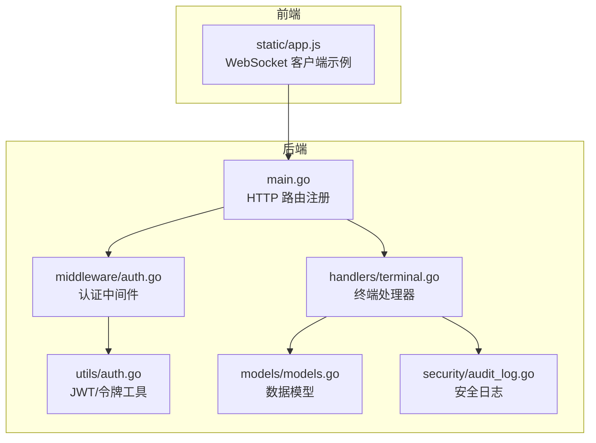
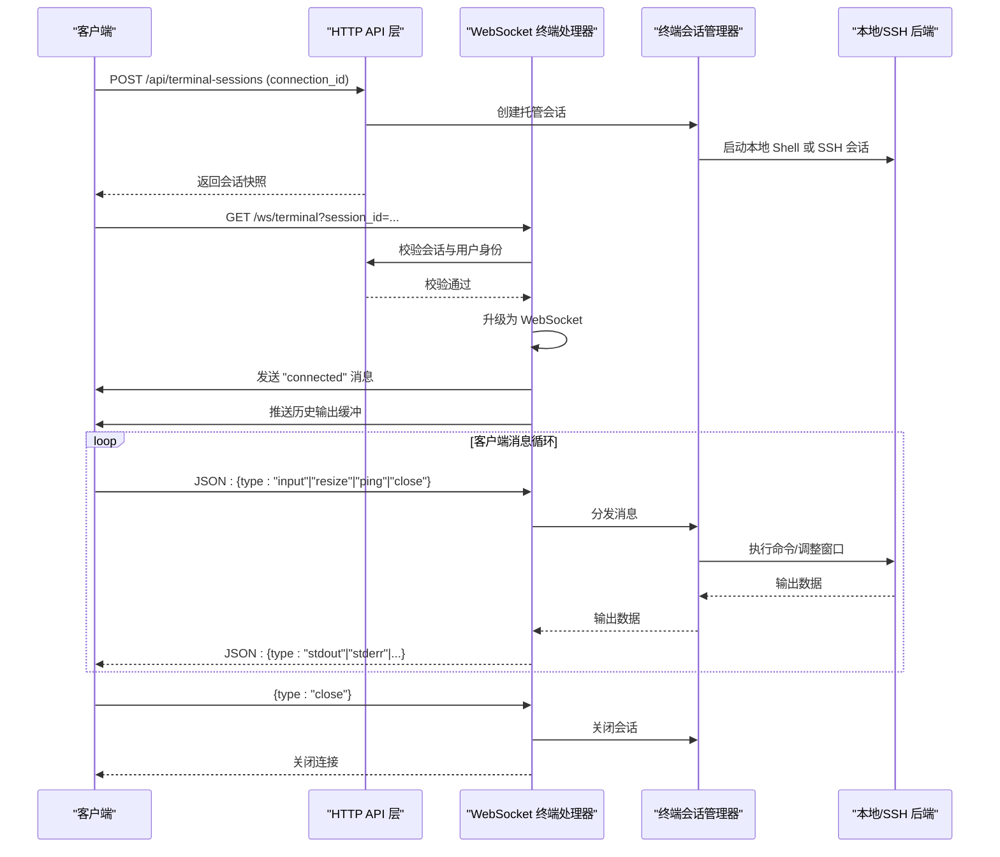
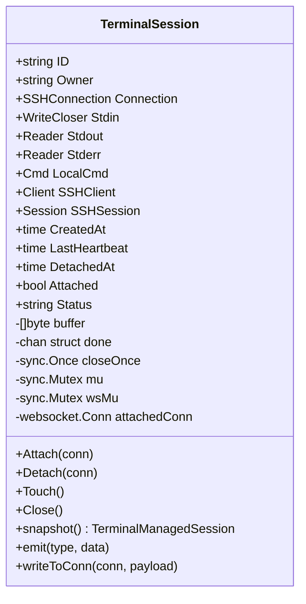
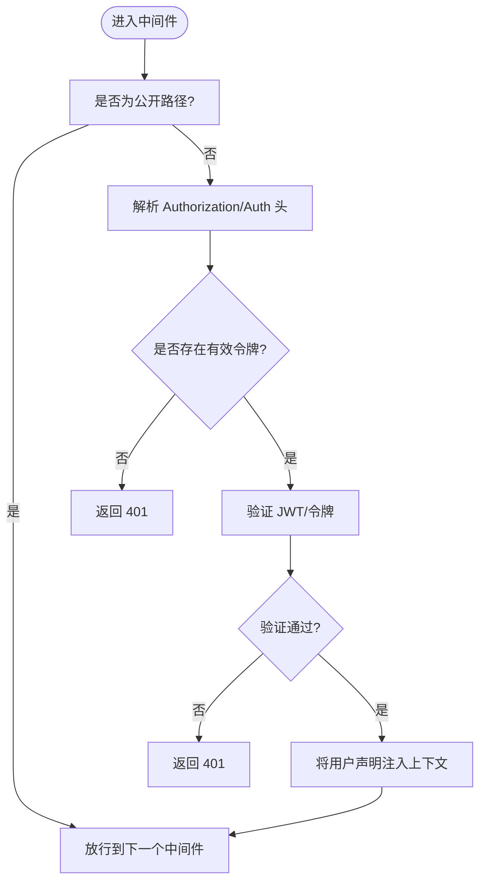
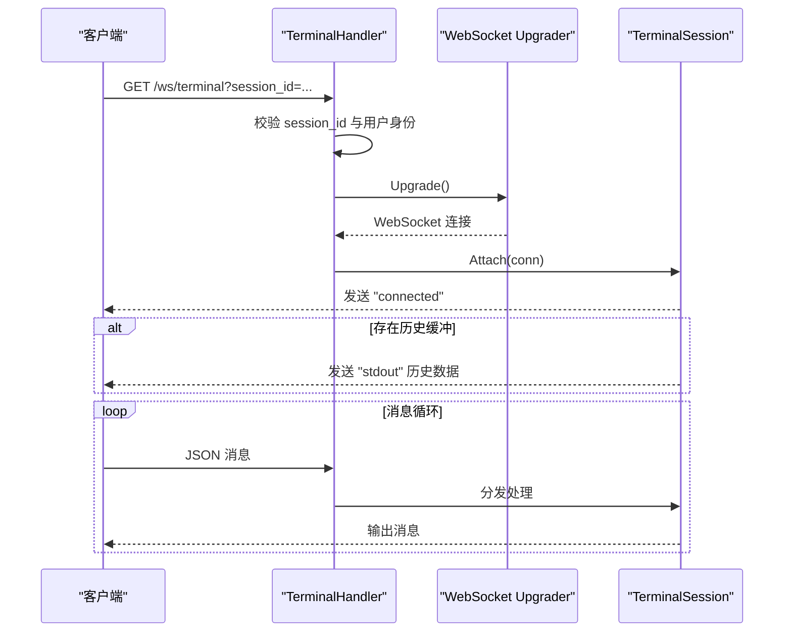
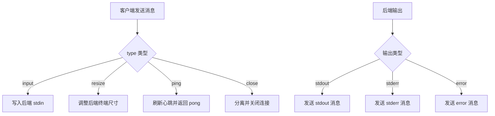
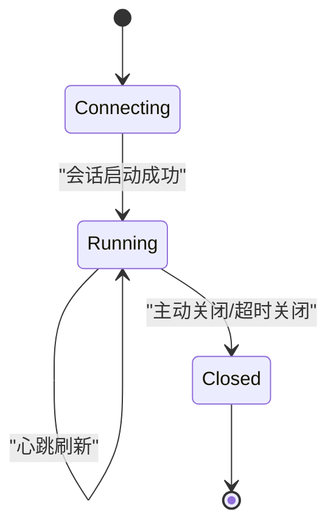
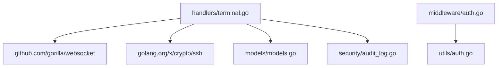

# WebSocket 终端接口

<cite>
**本文档引用的文件**
- [src/handlers/terminal.go](file://src/handlers/terminal.go)
- [src/main.go](file://src/main.go)
- [src/middleware/auth.go](file://src/middleware/auth.go)
- [src/utils/auth.go](file://src/utils/auth.go)
- [src/models/models.go](file://src/models/models.go)
- [src/security/audit_log.go](file://src/security/audit_log.go)
- [src/static/app.js](file://src/static/app.js)
</cite>

## 目录
1. [简介](#简介)
2. [项目结构](#项目结构)
3. [核心组件](#核心组件)
4. [架构概览](#架构概览)
5. [详细组件分析](#详细组件分析)
6. [依赖关系分析](#依赖关系分析)
7. [性能考量](#性能考量)
8. [故障排查指南](#故障排查指南)
9. [结论](#结论)
10. [附录](#附录)

## 简介
本文件为 WebSocket 终端接口的详细 API 文档，覆盖以下主题：
- /ws/terminal WebSocket 连接建立流程，包括认证验证与连接参数
- 终端会话管理，包括本地终端与远程 SSH 连接的建立与维护
- 消息格式与协议规范，包括命令发送、输出接收与会话控制消息
- 会话生命周期管理，包括连接建立、数据传输与连接关闭
- 错误处理与异常情况处理机制
- 安全考虑与会话超时管理
- 客户端连接示例与消息交互模式

## 项目结构
该系统采用 Go 语言开发，主要模块如下：
- handlers：HTTP 与 WebSocket 处理逻辑，包含终端接口实现
- middleware：认证、CORS、防火墙等中间件
- utils：认证工具（JWT、Cookie、令牌解析）
- models：数据模型（SSH 连接、终端会话、安全日志等）
- security：安全审计日志记录
- static：前端静态资源与示例客户端脚本

**图表来源**
- [src/main.go:418-420](file://src/main.go#L418-L420)
- [src/handlers/terminal.go:353-377](file://src/handlers/terminal.go#L353-L377)
- [src/middleware/auth.go:14-55](file://src/middleware/auth.go#L14-L55)
- [src/utils/auth.go:24-53](file://src/utils/auth.go#L24-L53)
- [src/models/models.go:269-297](file://src/models/models.go#L269-L297)
- [src/security/audit_log.go:115-147](file://src/security/audit_log.go#L115-L147)
- [src/static/app.js:3000-3051](file://src/static/app.js#L3000-L3051)

**章节来源**
- [src/main.go:418-420](file://src/main.go#L418-L420)
- [src/handlers/terminal.go:353-377](file://src/handlers/terminal.go#L353-L377)

## 核心组件
- 终端会话管理器：负责创建、维护与清理终端会话，支持本地 Shell 与 SSH 远程会话
- WebSocket 终端处理器：负责 WebSocket 握手、消息收发与心跳刷新
- 认证中间件：统一处理 Bearer Token 与 Cookie 认证
- 数据模型：定义 SSH 连接与终端会话的数据结构
- 安全审计：记录 SSH 连接、断开与系统操作日志

**章节来源**
- [src/handlers/terminal.go:39-61](file://src/handlers/terminal.go#L39-L61)
- [src/handlers/terminal.go:353-377](file://src/handlers/terminal.go#L353-L377)
- [src/middleware/auth.go:14-55](file://src/middleware/auth.go#L14-L55)
- [src/models/models.go:269-297](file://src/models/models.go#L269-L297)
- [src/security/audit_log.go:115-147](file://src/security/audit_log.go#L115-L147)

## 架构概览
WebSocket 终端接口的整体交互流程如下：
- 客户端通过 /api/terminal-sessions 创建会话，返回会话 ID
- 客户端使用会话 ID 作为查询参数连接 /ws/terminal
- 服务器进行认证与会话存在性校验后，完成 WebSocket 升级
- 服务器向客户端发送连接确认消息，并推送历史输出缓冲
- 客户端通过 JSON 消息与服务器交互，包括输入、调整窗口大小、心跳与关闭

**图表来源**
- [src/main.go:418-420](file://src/main.go#L418-L420)
- [src/handlers/terminal.go:282-319](file://src/handlers/terminal.go#L282-L319)
- [src/handlers/terminal.go:353-377](file://src/handlers/terminal.go#L353-L377)
- [src/handlers/terminal.go:512-552](file://src/handlers/terminal.go#L512-L552)
- [src/handlers/terminal.go:554-580](file://src/handlers/terminal.go#L554-L580)
- [src/static/app.js:3000-3051](file://src/static/app.js#L3000-L3051)

## 详细组件分析

### 终端会话模型与生命周期
- 终端会话结构包含会话标识、所有者、SSH 连接配置、标准输入输出管道、本地命令与 SSH 客户端/会话、创建时间、最后心跳、分离时间、附加状态、会话状态、缓冲区、完成通道、互斥锁等
- 会话状态包括 connecting、running、closed
- 会话生命周期管理包括创建、附加、输出处理、心跳刷新、分离与关闭
- 会话超时清理：附加状态下超过 TTL 未心跳则自动关闭；分离状态下超过保留期未心跳则自动关闭

**图表来源**
- [src/handlers/terminal.go:39-61](file://src/handlers/terminal.go#L39-L61)
- [src/handlers/terminal.go:614-663](file://src/handlers/terminal.go#L614-L663)

**章节来源**
- [src/handlers/terminal.go:39-61](file://src/handlers/terminal.go#L39-L61)
- [src/handlers/terminal.go:688-698](file://src/handlers/terminal.go#L688-L698)

### 认证与授权
- 认证中间件支持 Authorization Bearer Token 与自定义 Auth 头，以及 Cookie 中的令牌
- 会话创建与操作均基于请求上下文中的用户身份
- 公开路径包括登录、公钥获取与登出接口

**图表来源**
- [src/middleware/auth.go:14-55](file://src/middleware/auth.go#L14-L55)
- [src/utils/auth.go:24-53](file://src/utils/auth.go#L24-L53)

**章节来源**
- [src/middleware/auth.go:14-55](file://src/middleware/auth.go#L14-L55)
- [src/utils/auth.go:86-139](file://src/utils/auth.go#L86-L139)

### WebSocket 终端处理器
- 路由注册：/ws/terminal
- 连接参数：session_id（查询参数），必须提供
- 握手流程：校验 session_id 与用户身份，升级为 WebSocket
- 输入处理：支持 input、resize、ping、close 类型的消息
- 输出处理：将后端输出以 stdout/stderr 形式推送给客户端
- 连接确认：首次连接发送 connected 消息，并推送历史输出缓冲

**图表来源**
- [src/main.go:418-420](file://src/main.go#L418-L420)
- [src/handlers/terminal.go:353-377](file://src/handlers/terminal.go#L353-L377)
- [src/handlers/terminal.go:614-644](file://src/handlers/terminal.go#L614-L644)

**章节来源**
- [src/handlers/terminal.go:353-377](file://src/handlers/terminal.go#L353-L377)
- [src/handlers/terminal.go:512-552](file://src/handlers/terminal.go#L512-L552)
- [src/handlers/terminal.go:554-580](file://src/handlers/terminal.go#L554-L580)

### 消息格式与协议规范
- 客户端发送消息：
  - input：发送命令或字符到后端
  - resize：调整终端行列数
  - ping：心跳保活
  - close：请求关闭会话
- 服务器发送消息：
  - connected：连接建立确认，包含会话信息与状态
  - stdout/stderr：后端输出
  - error：错误通知
  - pong：心跳响应（由服务器内部触发）

**图表来源**
- [src/handlers/terminal.go:512-552](file://src/handlers/terminal.go#L512-L552)
- [src/handlers/terminal.go:554-580](file://src/handlers/terminal.go#L554-L580)
- [src/static/app.js:3012-3031](file://src/static/app.js#L3012-L3031)

**章节来源**
- [src/handlers/terminal.go:512-552](file://src/handlers/terminal.go#L512-L552)
- [src/handlers/terminal.go:554-580](file://src/handlers/terminal.go#L554-L580)
- [src/static/app.js:3069-3081](file://src/static/app.js#L3069-L3081)

### 会话生命周期管理
- 创建：POST /api/terminal-sessions，携带 connection_id
- 列表：GET /api/terminal-sessions
- 心跳：POST /api/terminal-sessions/{id}/heartbeat
- 关闭：DELETE /api/terminal-sessions/{id}

**图表来源**
- [src/handlers/terminal.go:282-319](file://src/handlers/terminal.go#L282-L319)
- [src/handlers/terminal.go:341-351](file://src/handlers/terminal.go#L341-L351)
- [src/handlers/terminal.go:321-339](file://src/handlers/terminal.go#L321-L339)

**章节来源**
- [src/handlers/terminal.go:277-280](file://src/handlers/terminal.go#L277-L280)
- [src/handlers/terminal.go:341-351](file://src/handlers/terminal.go#L341-L351)
- [src/handlers/terminal.go:321-339](file://src/handlers/terminal.go#L321-L339)

### 安全考虑与会话超时
- 认证：中间件强制要求有效令牌
- 审计：记录 SSH 连接、断开与系统操作
- 超时：附加会话超过 TTL 未心跳自动关闭；分离会话超过保留期未心跳自动关闭
- 缓冲限制：输出缓冲最大限制，防止内存膨胀

**章节来源**
- [src/middleware/auth.go:14-55](file://src/middleware/auth.go#L14-L55)
- [src/security/audit_log.go:115-147](file://src/security/audit_log.go#L115-L147)
- [src/handlers/terminal.go:26-31](file://src/handlers/terminal.go#L26-L31)
- [src/handlers/terminal.go:582-599](file://src/handlers/terminal.go#L582-L599)

## 依赖关系分析
- 终端处理器依赖 gorilla/websocket 进行 WebSocket 升级与消息收发
- 终端处理器依赖 golang.org/x/crypto/ssh 进行 SSH 连接与会话管理
- 认证中间件依赖 JWT 工具进行令牌验证
- 安全审计依赖 UUID 生成日志 ID 并持久化存储

**图表来源**
- [src/handlers/terminal.go:3-24](file://src/handlers/terminal.go#L3-L24)
- [src/middleware/auth.go:14-55](file://src/middleware/auth.go#L14-L55)
- [src/utils/auth.go:24-53](file://src/utils/auth.go#L24-L53)
- [src/models/models.go:269-297](file://src/models/models.go#L269-L297)
- [src/security/audit_log.go:115-147](file://src/security/audit_log.go#L115-L147)

**章节来源**
- [src/handlers/terminal.go:3-24](file://src/handlers/terminal.go#L3-L24)
- [src/middleware/auth.go:14-55](file://src/middleware/auth.go#L14-L55)
- [src/utils/auth.go:24-53](file://src/utils/auth.go#L24-L53)

## 性能考量
- 输出缓冲限制：避免长时间会话导致内存占用过高
- 会话清理：定时器定期扫描并关闭超时会话，释放资源
- 并发安全：使用互斥锁保护会话状态与 WebSocket 写入
- SSH 连接超时：设置合理的 SSH 连接与会话超时，避免阻塞

**章节来源**
- [src/handlers/terminal.go:26-31](file://src/handlers/terminal.go#L26-L31)
- [src/handlers/terminal.go:738-759](file://src/handlers/terminal.go#L738-L759)
- [src/handlers/terminal.go:601-612](file://src/handlers/terminal.go#L601-L612)
- [src/handlers/terminal.go:446-510](file://src/handlers/terminal.go#L446-L510)

## 故障排查指南
- 连接失败：检查 session_id 是否正确、用户是否有权限访问该会话
- 无法升级：确认请求头与子协议兼容，检查服务器日志
- 输出异常：查看后端命令执行结果与权限，确认 SSH 密钥或凭据正确
- 心跳超时：客户端需定期发送 ping，确保会话保持活跃
- 审计日志：通过安全日志接口查看 SSH 连接与断开记录

**章节来源**
- [src/handlers/terminal.go:357-377](file://src/handlers/terminal.go#L357-L377)
- [src/security/audit_log.go:115-147](file://src/security/audit_log.go#L115-L147)

## 结论
WebSocket 终端接口提供了完整的会话管理、认证与消息协议支持，具备良好的安全性与可维护性。通过明确的生命周期管理与超时控制，能够稳定地支持本地与远程终端访问场景。

## 附录

### API 定义与使用示例

- 创建会话
  - 方法：POST
  - 路径：/api/terminal-sessions
  - 请求体：{ connection_id: string }
  - 响应：会话快照对象

- 获取会话列表
  - 方法：GET
  - 路径：/api/terminal-sessions

- 刷新心跳
  - 方法：POST
  - 路径：/api/terminal-sessions/{id}/heartbeat

- 关闭会话
  - 方法：DELETE
  - 路径：/api/terminal-sessions/{id}

- 建立 WebSocket 连接
  - 方法：GET
  - 路径：/ws/terminal?session_id={id}
  - 认证：Authorization: Bearer <token> 或 Cookie: fnproxy_auth=<token>

- 客户端消息交互示例
  - 发送输入：{ type: "input", data: "ls -la\n" }
  - 调整窗口：{ type: "resize", cols: 120, rows: 32 }
  - 心跳保活：{ type: "ping" }
  - 主动关闭：{ type: "close" }

**章节来源**
- [src/main.go:343-371](file://src/main.go#L343-L371)
- [src/handlers/terminal.go:353-377](file://src/handlers/terminal.go#L353-L377)
- [src/static/app.js:3069-3081](file://src/static/app.js#L3069-L3081)