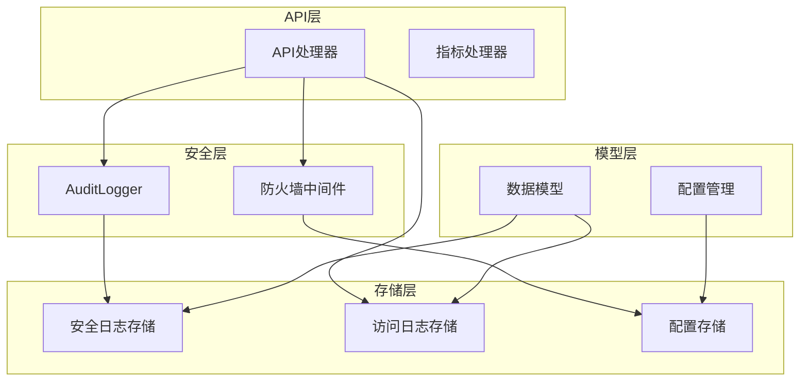
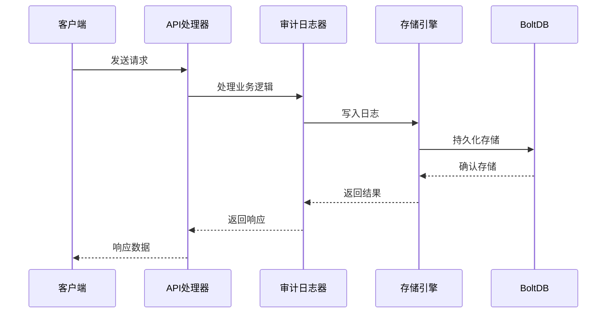
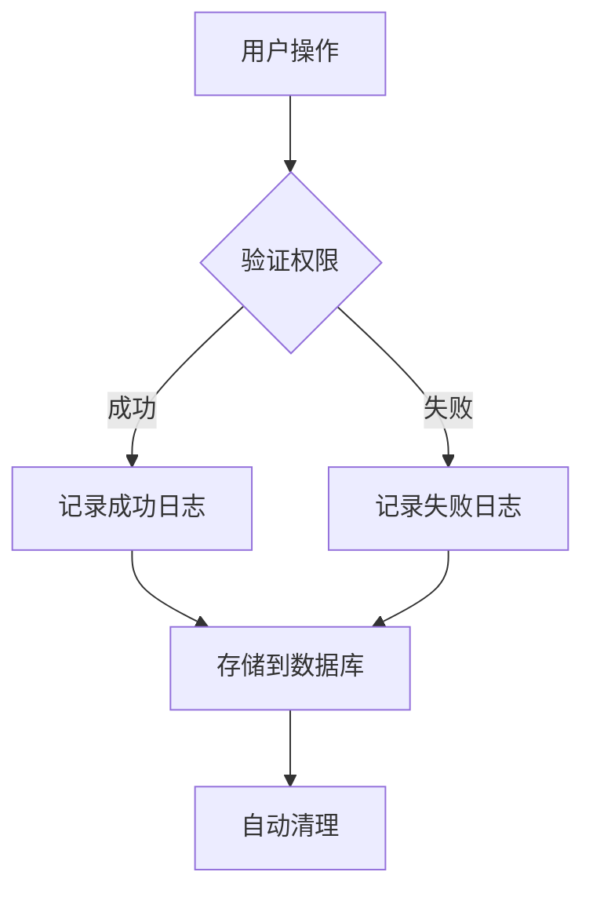
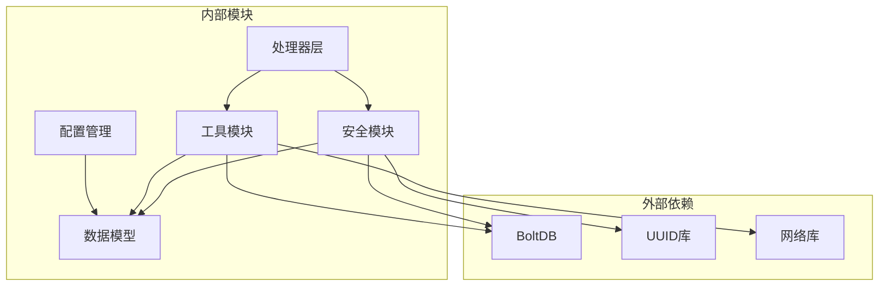

# 日志与安全接口

<cite>
**本文档引用的文件**
- [security_logs.go](file://src/handlers/security_logs.go)
- [firewall.go](file://src/handlers/firewall.go)
- [audit_log.go](file://src/security/audit_log.go)
- [audit_store.go](file://src/security/audit_store.go)
- [models.go](file://src/models/models.go)
- [api.go](file://src/handlers/api.go)
- [firewall.go](file://src/middleware/firewall.go)
- [manager.go](file://src/config/manager.go)
- [monitor.go](file://src/utils/monitor.go)
- [monitor_store.go](file://src/utils/monitor_store.go)
- [main.go](file://src/main.go)
</cite>

## 目录
1. [简介](#简介)
2. [项目结构](#项目结构)
3. [核心组件](#核心组件)
4. [架构概览](#架构概览)
5. [详细组件分析](#详细组件分析)
6. [依赖关系分析](#依赖关系分析)
7. [性能考虑](#性能考虑)
8. [故障排除指南](#故障排除指南)
9. [结论](#结论)

## 简介

本文档详细介绍了 Caddy Panel 项目中的日志与安全接口，包括安全日志管理、访问日志处理和防火墙规则管理功能。该系统提供了完整的日志查询、过滤、统计和管理能力，支持安全事件追踪和系统审计。

## 项目结构

项目采用模块化架构设计，主要包含以下核心模块：



**图表来源**
- [main.go:373-413](file://src/main.go#L373-L413)
- [audit_log.go:15-31](file://src/security/audit_log.go#L15-L31)
- [firewall.go:13-50](file://src/middleware/firewall.go#L13-L50)

**章节来源**
- [main.go:111-429](file://src/main.go#L111-L429)
- [models.go:1-50](file://src/models/models.go#L1-L50)

## 核心组件

### 安全日志管理系统

安全日志管理系统是整个日志体系的核心，负责记录和管理所有安全相关的操作和事件。

#### AuditLogger 核心功能
- **日志记录**：支持多种安全日志类型的统一记录
- **查询过滤**：提供按类型、级别、关键词的多维度过滤
- **统计分析**：实时统计各类安全事件的数量分布
- **存储管理**：自动清理超限日志，维护存储空间

#### 安全日志类型
系统支持四种主要的安全日志类型：
- OAuth 登录日志
- 代理错误日志  
- SSH 连接日志
- 系统操作日志

**章节来源**
- [audit_log.go:15-80](file://src/security/audit_log.go#L15-L80)
- [models.go:312-344](file://src/models/models.go#L312-L344)

### 访问日志系统

访问日志系统专门记录 HTTP 请求的详细信息，为系统监控和分析提供数据支撑。

#### 访问日志字段
- 请求时间戳和持续时间
- 监听器和端口信息
- 服务标识和域名
- HTTP 方法和状态码
- 请求和响应字节数
- 客户端 IP 地址
- 用户认证信息

#### 存储策略
- **时间保留**：默认保留7天的历史数据
- **容量限制**：最多存储10,000条访问日志
- **自动清理**：基于时间和数量的双重清理机制

**章节来源**
- [models.go:53-70](file://src/models/models.go#L53-L70)
- [monitor_store.go:16-24](file://src/utils/monitor_store.go#L16-L24)

### 防火墙管理系统

防火墙系统提供基于 IP 和地理位置的访问控制功能。

#### 规则类型
- **IP/IP段规则**：支持 CIDR 格式的精确匹配
- **国家规则**：基于地理位置的批量控制
- **优先级机制**：支持多规则的优先级排序

#### 执行策略
- **默认拒绝**：未匹配规则时的默认行为
- **动态匹配**：实时计算客户端 IP 和地理位置
- **性能优化**：规则预排序，快速匹配算法

**章节来源**
- [models.go:346-382](file://src/models/models.go#L346-L382)
- [firewall.go:138-174](file://src/middleware/firewall.go#L138-L174)

## 架构概览

系统采用分层架构设计，确保各组件职责清晰、耦合度低：



**图表来源**
- [audit_store.go:47-67](file://src/security/audit_store.go#L47-L67)
- [monitor_store.go:102-125](file://src/utils/monitor_store.go#L102-L125)

**章节来源**
- [main.go:96-108](file://src/main.go#L96-L108)
- [api.go:95-115](file://src/handlers/api.go#L95-L115)

## 详细组件分析

### 安全日志接口

#### 接口定义

| 接口 | 方法 | 功能描述 |
|------|------|----------|
| `/api/security-logs` | GET | 获取安全日志列表，支持分页和过滤 |
| `/api/security-logs` | DELETE | 清空所有安全日志 |
| `/api/security-logs/stats` | GET | 获取安全日志统计信息 |

#### 查询参数

| 参数名 | 类型 | 必需 | 默认值 | 说明 |
|--------|------|------|--------|------|
| type | string | 否 | 无 | 日志类型过滤 |
| level | string | 否 | 无 | 日志级别过滤 |
| keyword | string | 否 | 无 | 关键词搜索 |
| page | number | 否 | 1 | 页码 |
| page_size | number | 否 | 50 | 每页条数（最大200） |

#### 响应格式

```json
{
  "success": true,
  "data": {
    "logs": [
      {
        "id": "string",
        "timestamp": "2024-01-01T00:00:00Z",
        "type": "oauth_login",
        "level": "info",
        "username": "string",
        "remote_addr": "string",
        "target": "string",
        "action": "string",
        "message": "string",
        "success": true,
        "extra": {}
      }
    ],
    "total": 0,
    "page": 1,
    "page_size": 50
  }
}
```

**章节来源**
- [security_logs.go:10-40](file://src/handlers/security_logs.go#L10-L40)
- [audit_log.go:168-183](file://src/security/audit_log.go#L168-L183)

### 访问日志接口

#### 接口定义

| 接口 | 方法 | 功能描述 |
|------|------|----------|
| `/api/logs/listeners/{listener_id}` | GET | 获取监听器访问日志 |
| `/api/logs/services/{service_id}` | GET | 获取服务访问日志 |

#### 查询参数

| 参数名 | 类型 | 必需 | 默认值 | 说明 |
|--------|------|------|--------|------|
| limit | number | 否 | 100 | 返回条数限制（最大500） |

#### 响应格式

```json
{
  "success": true,
  "data": [
    {
      "id": "string",
      "timestamp": "2024-01-01T00:00:00Z",
      "listener_id": "string",
      "listener_port": 80,
      "service_id": "string",
      "service_name": "string",
      "host": "string",
      "method": "GET",
      "path": "string",
      "status_code": 200,
      "duration_ms": 0,
      "bytes_in": 0,
      "bytes_out": 0,
      "remote_addr": "string",
      "username": "string"
    }
  ]
}
```

**章节来源**
- [metrics.go:31-41](file://src/handlers/metrics.go#L31-L41)
- [monitor.go:357-380](file://src/utils/monitor.go#L357-L380)

### 防火墙接口

#### 接口定义

| 接口 | 方法 | 功能描述 |
|------|------|----------|
| `/api/firewall` | GET | 获取防火墙配置 |
| `/api/firewall` | POST | 更新防火墙配置 |
| `/api/firewall/rules` | POST | 添加防火墙规则 |
| `/api/firewall/rules/{rule_id}` | PUT | 更新防火墙规则 |
| `/api/firewall/rules/{rule_id}` | DELETE | 删除防火墙规则 |

#### 防火墙规则结构

```json
{
  "id": "string",
  "name": "string",
  "type": "ip|country",
  "ips": ["string"],
  "countries": ["string"],
  "action": "allow|deny",
  "enabled": true,
  "priority": 0,
  "description": "string"
}
```

**章节来源**
- [firewall.go:20-168](file://src/handlers/firewall.go#L20-L168)
- [models.go:362-382](file://src/models/models.go#L362-L382)

### 日志审计功能

#### 用户操作记录

系统自动记录所有用户相关的安全事件：



**图表来源**
- [audit_log.go:149-166](file://src/security/audit_log.go#L149-L166)
- [api.go:209-300](file://src/handlers/api.go#L209-L300)

#### 系统事件记录

系统关键事件的自动记录机制：

| 事件类型 | 触发条件 | 记录内容 |
|----------|----------|----------|
| 服务器启动 | 服务启动 | 版本信息、启动参数 |
| 配置变更 | 配置更新 | 操作人、变更详情 |
| 用户管理 | 用户增删改 | 用户名、操作类型 |
| 服务管理 | 服务启停 | 端口、状态变化 |

**章节来源**
- [audit_log.go:82-147](file://src/security/audit_log.go#L82-L147)
- [api.go:531-730](file://src/handlers/api.go#L531-L730)

## 依赖关系分析

系统各组件之间的依赖关系如下：



**图表来源**
- [audit_store.go:3-13](file://src/security/audit_store.go#L3-L13)
- [monitor_store.go:3-14](file://src/utils/monitor_store.go#L3-L14)

**章节来源**
- [main.go:3-22](file://src/main.go#L3-L22)
- [manager.go:1-14](file://src/config/manager.go#L1-L14)

## 性能考虑

### 存储优化

系统采用多种策略确保高性能：

1. **BoltDB 存储**：轻量级嵌入式数据库，适合高并发读写
2. **复合键设计**：时间戳+ID 的复合键确保有序存储和快速检索
3. **自动清理机制**：基于时间和数量的双重清理策略

### 内存管理

- **读写锁**：使用 RWMutex 确保并发安全
- **懒加载**：存储组件按需初始化
- **连接池**：数据库连接复用

### 网络优化

- **中间件链**：防火墙中间件在认证之前执行
- **异步处理**：日志写入采用异步模式
- **批量操作**：支持批量查询和清理

## 故障排除指南

### 常见问题及解决方案

#### 日志查询无结果

**可能原因**：
- 查询条件过于严格
- 数据已被自动清理
- 存储初始化失败

**解决步骤**：
1. 检查查询参数的有效性
2. 确认日志保留策略设置
3. 验证存储文件权限

#### 防火墙规则不生效

**可能原因**：
- 规则优先级设置错误
- IP 地址格式不正确
- 中间件未正确加载

**解决步骤**：
1. 检查规则优先级排序
2. 验证 IP 地址格式（支持 CIDR）
3. 确认中间件链顺序

#### 性能问题

**症状**：日志查询响应缓慢

**解决方案**：
1. 调整 page_size 参数
2. 优化查询条件
3. 检查磁盘空间和 I/O 性能

**章节来源**
- [audit_store.go:202-221](file://src/security/audit_store.go#L202-L221)
- [monitor_store.go:167-186](file://src/utils/monitor_store.go#L167-L186)

## 结论

本日志与安全接口系统提供了完整的企业级日志管理解决方案，具有以下特点：

1. **全面的日志覆盖**：涵盖安全事件、访问行为和系统状态
2. **灵活的查询能力**：支持多维度过滤和统计分析
3. **高效的存储机制**：基于 BoltDB 的高性能存储方案
4. **完善的审计功能**：自动记录所有重要操作和事件
5. **强大的扩展性**：模块化设计便于功能扩展和维护

系统通过合理的架构设计和优化策略，能够满足高并发场景下的日志处理需求，为企业级应用提供可靠的安全保障和运维支持。