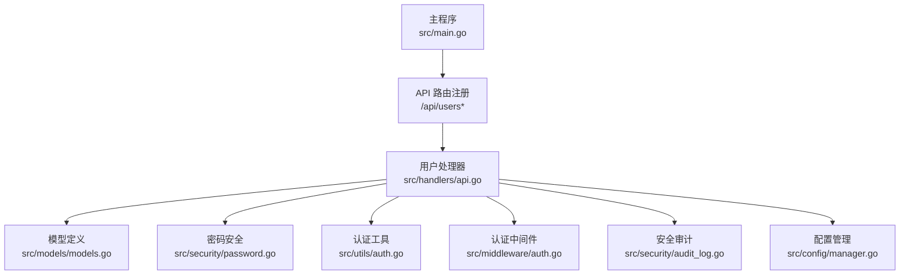
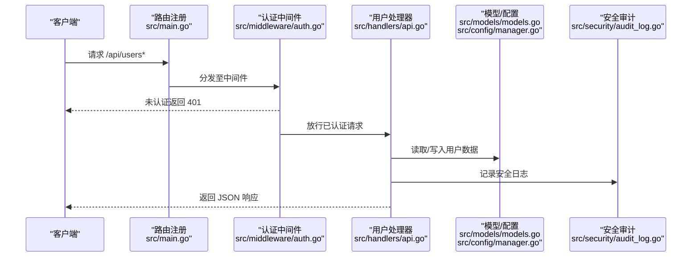
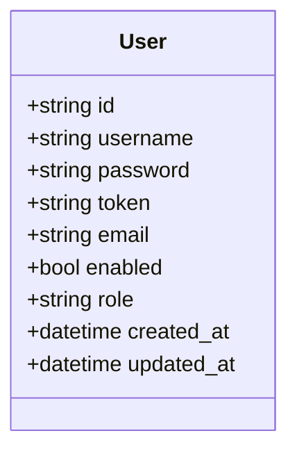
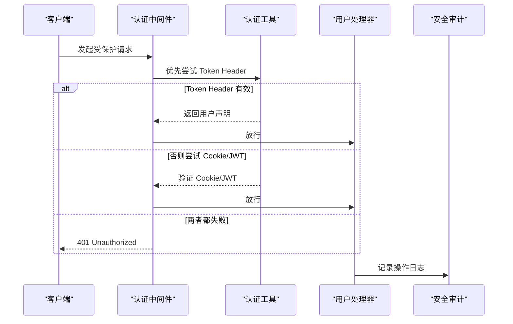
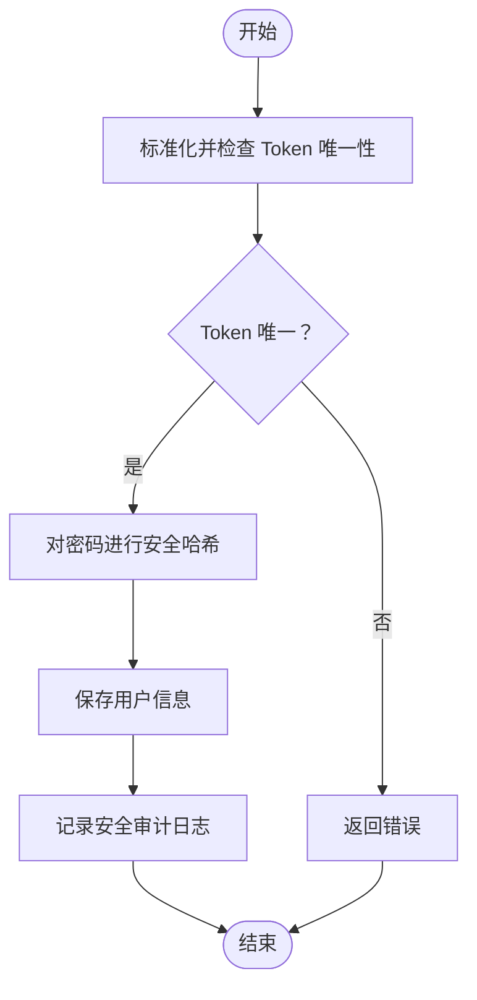
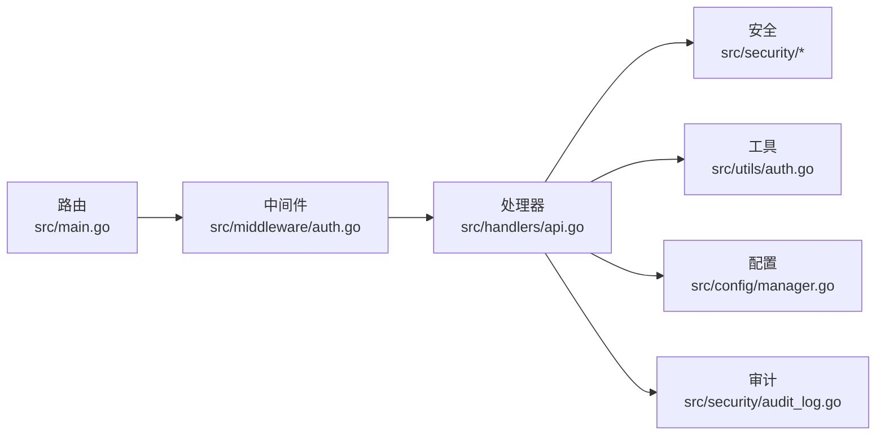

# 用户管理接口

<cite>
**本文引用的文件**
- [main.go](file://src/main.go)
- [api.go](file://src/handlers/api.go)
- [models.go](file://src/models/models.go)
- [password.go](file://src/security/password.go)
- [auth.go](file://src/utils/auth.go)
- [auth_middleware.go](file://src/middleware/auth.go)
- [audit_log.go](file://src/security/audit_log.go)
- [config_manager.go](file://src/config/manager.go)
</cite>

## 目录
1. [简介](#简介)
2. [项目结构](#项目结构)
3. [核心组件](#核心组件)
4. [架构总览](#架构总览)
5. [详细组件分析](#详细组件分析)
6. [依赖关系分析](#依赖关系分析)
7. [性能考虑](#性能考虑)
8. [故障排除指南](#故障排除指南)
9. [结论](#结论)

## 简介
本文件为用户管理接口的完整 API 文档，覆盖以下端点：
- GET /api/users：用户列表查询（含权限过滤）
- POST /api/users：创建用户（用户名、密码、角色、Token）
- PUT /api/users/{id}：更新用户（密码更新、角色变更、状态管理）
- POST /api/users/{id}/toggle：启停用户
- DELETE /api/users/{id}：删除用户

文档同时阐述用户权限控制、密码加密与安全审计机制、Token 管理与唯一性验证，并提供请求示例与响应格式说明。

## 项目结构
用户管理接口位于主程序路由注册处，通过统一的 API 路由器挂载，配合认证中间件与安全审计模块共同完成权限控制与行为记录。

图表来源
- [main.go:229-260](file://src/main.go#L229-L260)
- [api.go:531-730](file://src/handlers/api.go#L531-L730)

章节来源
- [main.go:229-260](file://src/main.go#L229-L260)

## 核心组件
- 用户模型：包含用户标识、用户名、加密密码、可选 Token、邮箱、启用状态、角色、创建/更新时间等字段。
- 用户处理器：实现用户列表、创建、更新、启停、删除等业务逻辑。
- 密码安全：基于 HMAC-SHA256 的安全哈希与常量时间比较，确保密码验证安全。
- 认证与授权：支持 Cookie/JWT 与 Token Header 的多通道认证，管理员权限中间件。
- 安全审计：对用户相关操作进行审计日志记录，便于追踪与合规。

章节来源
- [models.go:256-267](file://src/models/models.go#L256-L267)
- [api.go:531-730](file://src/handlers/api.go#L531-L730)
- [password.go:44-70](file://src/security/password.go#L44-L70)
- [auth.go:24-53](file://src/utils/auth.go#L24-L53)
- [auth_middleware.go:14-91](file://src/middleware/auth.go#L14-L91)
- [audit_log.go:149-166](file://src/security/audit_log.go#L149-L166)

## 架构总览
用户管理接口遵循“路由 -> 中间件 -> 处理器 -> 模型/存储 -> 审计”的调用链路，所有非公开接口均需通过认证中间件校验。

图表来源
- [main.go:229-260](file://src/main.go#L229-L260)
- [auth_middleware.go:14-55](file://src/middleware/auth.go#L14-L55)
- [api.go:531-730](file://src/handlers/api.go#L531-L730)
- [audit_log.go:149-166](file://src/security/audit_log.go#L149-L166)

## 详细组件分析

### 用户模型与数据结构
- 字段说明
  - id：用户唯一标识（UUID）
  - username：用户名（唯一性约束）
  - password：加密存储的密码
  - token：可选的用户级 Token（唯一性约束）
  - email：邮箱
  - enabled：启用状态（影响登录与操作）
  - role：用户角色（admin/user）
  - created_at/updated_at：创建与更新时间

图表来源
- [models.go:256-267](file://src/models/models.go#L256-L267)

章节来源
- [models.go:256-267](file://src/models/models.go#L256-L267)

### GET /api/users 用户列表
- 功能：返回所有用户列表，响应中隐藏密码字段。
- 权限：需通过认证中间件，管理员权限可访问。
- 响应：成功返回包含用户数组的 JSON 对象；失败返回错误对象。

请求示例
- 方法：GET
- 路径：/api/users
- 请求头：Authorization: Bearer <token> 或 Cookie: fnproxy_auth=<token>

响应示例
- 成功：200 OK
  - 数据结构：{"success": true, "data": [{...}]}
- 失败：401 Unauthorized 或 500 Internal Server Error

章节来源
- [main.go:229-239](file://src/main.go#L229-L239)
- [api.go:531-539](file://src/handlers/api.go#L531-L539)

### POST /api/users 创建用户
- 功能：创建新用户，支持设置用户名、密码、角色与 Token。
- 规则与限制
  - 角色默认为 user，若未提供则自动填充
  - 密码支持明文或前端加密传输（以特定前缀标识），处理器会解密后再加密存储
  - Token 必须全局唯一（忽略大小写与空白），否则返回错误
  - 密码采用安全哈希存储，不可逆
- 响应：成功返回新用户对象（密码字段为空）；失败返回错误对象。

请求示例
- 方法：POST
- 路径：/api/users
- 请求头：Authorization: Bearer <token>
- 请求体（示例）：
  - {"username":"alice","password":"明文或加密串","role":"user","token":"可选唯一Token","email":"alice@example.com"}

响应示例
- 成功：200 OK
  - {"success": true, "data": {"id":"...","username":"alice","role":"user","email":"alice@example.com","enabled":true,"token":"可选","created_at":"...","updated_at":"..."}}
- 失败：400 Bad Request（参数非法/Token冲突）、500 Internal Server Error

章节来源
- [main.go:229-239](file://src/main.go#L229-L239)
- [api.go:541-579](file://src/handlers/api.go#L541-L579)
- [password.go:44-70](file://src/security/password.go#L44-L70)

### PUT /api/users/{id} 更新用户
- 功能：更新指定用户的属性，支持密码更新、角色变更与状态管理。
- 规则与限制
  - 若提供新密码，先解密再加密存储；未提供则保持原密码
  - Token 必须全局唯一（忽略大小写与空白），否则返回错误
  - 角色若未提供则保持原值
  - 邮箱若未提供则保持原值
- 响应：成功返回更新后的用户对象（密码字段为空）；失败返回错误对象。

请求示例
- 方法：PUT
- 路径：/api/users/{id}
- 请求头：Authorization: Bearer <token>
- 请求体（示例）：
  - {"password":"新密码或加密串","role":"admin","token":"可选唯一Token","email":"alice@example.com"}

响应示例
- 成功：200 OK
  - {"success": true, "data": {...}}
- 失败：400 Bad Request（Token冲突/解密失败）、404 Not Found（用户不存在）、500 Internal Server Error

章节来源
- [main.go:241-260](file://src/main.go#L241-L260)
- [api.go:581-642](file://src/handlers/api.go#L581-L642)

### POST /api/users/{id}/toggle 启停用户
- 功能：切换指定用户的启用状态。
- 规则与限制
  - 禁用用户时，必须保证至少还有一个启用用户，否则返回错误
  - 启用/禁用操作会记录安全审计日志
- 响应：成功返回更新后的用户对象（密码字段为空）；失败返回错误对象。

请求示例
- 方法：POST
- 路径：/api/users/{id}/toggle
- 请求头：Authorization: Bearer <token>

响应示例
- 成功：200 OK
  - {"success": true, "data": {...}}
- 失败：400 Bad Request（最后启用用户保护）、404 Not Found、500 Internal Server Error

章节来源
- [main.go:241-260](file://src/main.go#L241-L260)
- [api.go:644-691](file://src/handlers/api.go#L644-L691)

### DELETE /api/users/{id} 删除用户
- 功能：删除指定用户。
- 规则与限制
  - 删除启用用户时，必须保证至少还有一个启用用户，否则返回错误
  - 删除操作会记录安全审计日志
- 响应：成功返回空数据；失败返回错误对象。

请求示例
- 方法：DELETE
- 路径：/api/users/{id}
- 请求头：Authorization: Bearer <token>

响应示例
- 成功：200 OK
  - {"success": true, "data": null}
- 失败：400 Bad Request（最后启用用户保护）、404 Not Found、500 Internal Server Error

章节来源
- [main.go:241-260](file://src/main.go#L241-L260)
- [api.go:693-730](file://src/handlers/api.go#L693-L730)

### 权限控制与认证流程
- 认证方式
  - Cookie：Cookie 名称为 fnproxy_auth，HttpOnly，支持 SameSite/Lax，过期时间可配置
  - Header：Authorization: Bearer <JWT> 或 Auth: <用户Token>
  - Token Header：支持 Auth/Bearer/Token 三种前缀规范化
- 授权策略
  - 非公开路径默认需要认证
  - 管理员中间件要求角色为 admin 才能访问
- 登录与登出
  - 登录成功后返回 JWT 并写入 Cookie
  - 登出为无状态操作，客户端清理本地 token 即可

图表来源
- [auth_middleware.go:14-55](file://src/middleware/auth.go#L14-L55)
- [auth.go:87-123](file://src/utils/auth.go#L87-L123)
- [api.go:573-576](file://src/handlers/api.go#L573-L576)

章节来源
- [auth_middleware.go:14-91](file://src/middleware/auth.go#L14-L91)
- [auth.go:24-53](file://src/utils/auth.go#L24-L53)
- [auth.go:87-123](file://src/utils/auth.go#L87-L123)

### 密码加密与安全审计
- 密码加密
  - 使用 HMAC-SHA256，带固定前缀的安全哈希
  - 比较采用常量时间算法，防止时序攻击
- Token 唯一性
  - Token 在写入前进行标准化（去空白、统一大小写）
  - 全局唯一性检查，避免重复
- 安全审计
  - 用户创建/更新/启停/删除均记录系统操作日志
  - 包含操作者、来源 IP、目标、结果与消息

图表来源
- [api.go:35-50](file://src/handlers/api.go#L35-L50)
- [api.go:560-564](file://src/handlers/api.go#L560-L564)
- [password.go:44-70](file://src/security/password.go#L44-L70)
- [audit_log.go:149-166](file://src/security/audit_log.go#L149-L166)

章节来源
- [password.go:44-70](file://src/security/password.go#L44-L70)
- [api.go:35-50](file://src/handlers/api.go#L35-L50)
- [audit_log.go:149-166](file://src/security/audit_log.go#L149-L166)

## 依赖关系分析
- 路由层：主程序集中注册 /api/users* 路由
- 处理层：用户处理器依赖模型、安全、配置与审计模块
- 中间件层：认证中间件负责鉴权，管理员中间件负责角色校验
- 存储层：配置管理器提供用户 CRUD 与查询能力

图表来源
- [main.go:229-260](file://src/main.go#L229-L260)
- [auth_middleware.go:14-91](file://src/middleware/auth.go#L14-L91)
- [api.go:531-730](file://src/handlers/api.go#L531-L730)

章节来源
- [main.go:229-260](file://src/main.go#L229-L260)
- [auth_middleware.go:14-91](file://src/middleware/auth.go#L14-L91)
- [api.go:531-730](file://src/handlers/api.go#L531-L730)

## 性能考虑
- 密码哈希与常量时间比较均为 O(n) 操作，开销极低
- Token 唯一性检查遍历用户集合，建议控制用户规模或引入索引优化
- 审计日志写入为异步追加，注意磁盘空间与日志轮转策略

## 故障排除指南
- 401 未认证
  - 检查 Authorization 头或 Cookie 是否正确
  - 确认用户 Token 未被禁用
- 403 禁止访问
  - 管理员中间件要求角色为 admin
- 400 参数错误
  - Token 重复、密码解密失败、最后启用用户保护
- 500 服务器内部错误
  - 配置保存失败、数据库/文件系统异常

章节来源
- [auth_middleware.go:75-91](file://src/middleware/auth.go#L75-L91)
- [api.go:660-672](file://src/handlers/api.go#L660-L672)
- [api.go:696-718](file://src/handlers/api.go#L696-L718)

## 结论
用户管理接口通过严格的认证与授权、安全的密码存储与 Token 唯一性校验、以及完善的审计日志，构建了高安全性与可追溯性的用户管理体系。建议在生产环境中：
- 显式设置安全密钥与 JWT 密钥
- 启用 HTTPS 并合理配置 Cookie Secure 属性
- 定期审查审计日志，监控关键用户操作