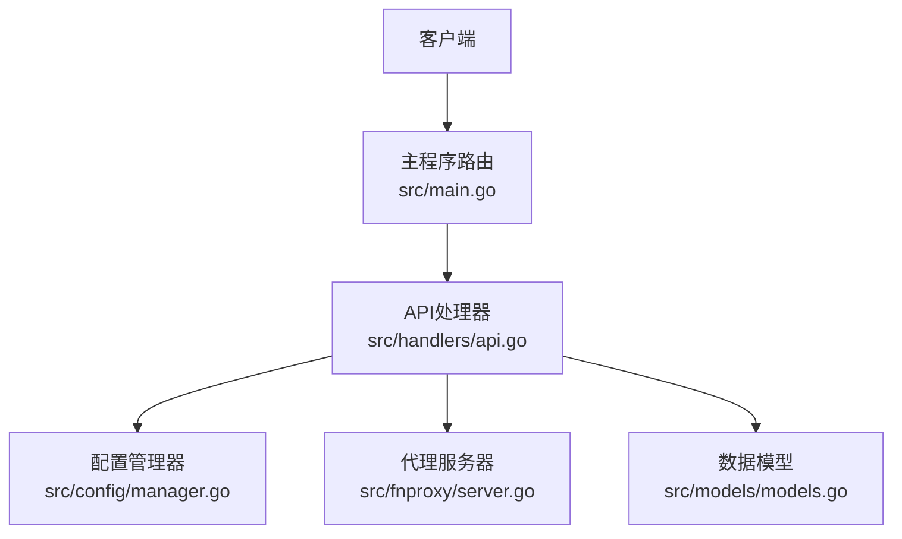
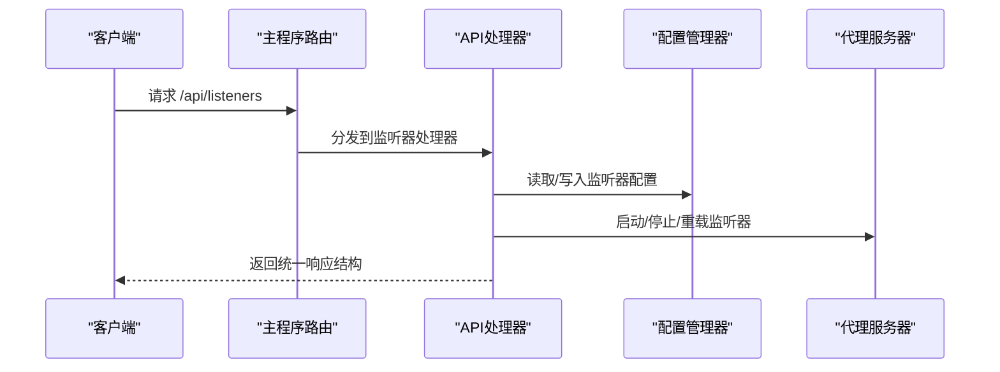
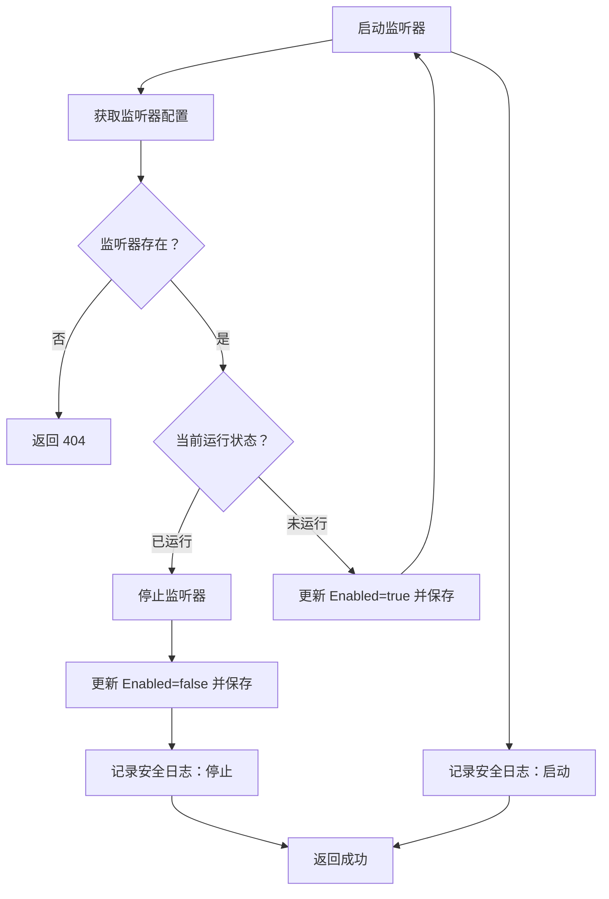
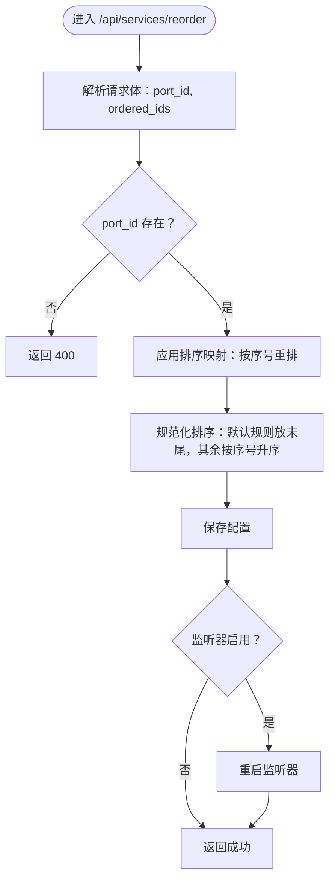
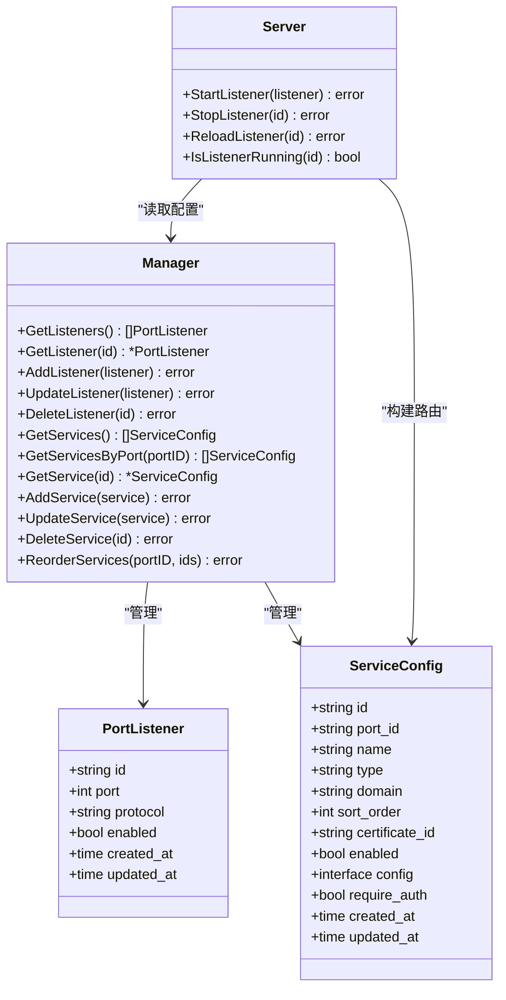

# 监听器与服务接口

<cite>
**本文引用的文件**
- [main.go](file://src/main.go)
- [api.go](file://src/handlers/api.go)
- [models.go](file://src/models/models.go)
- [manager.go](file://src/config/manager.go)
- [server.go](file://src/fnproxy/server.go)
</cite>

## 目录
1. [简介](#简介)
2. [项目结构](#项目结构)
3. [核心组件](#核心组件)
4. [架构总览](#架构总览)
5. [详细组件分析](#详细组件分析)
6. [依赖关系分析](#依赖关系分析)
7. [性能考量](#性能考量)
8. [故障排查指南](#故障排查指南)
9. [结论](#结论)
10. [附录](#附录)

## 简介
本文件面向“监听器与服务接口”的使用者与维护者，系统性梳理以下 API 的设计与实现：
- 监听器管理接口：/api/listeners 列表与增删改；/api/listeners/{id}/toggle 启停；/api/listeners/{id}/reload 重载
- 服务配置接口：/api/services 列表与增删改查；/api/services/{id}/toggle 服务启停；/api/services/reorder 服务排序

文档覆盖请求参数、响应格式、错误处理、以及服务类型、匹配规则与优先级设置等关键细节，并提供流程图与类图帮助理解。

## 项目结构
- 路由注册集中在主程序入口，按模块划分 API 路由组
- 监听器与服务的业务逻辑分别位于处理器层与配置管理层
- 代理服务器负责监听器的启动、停止与热更新

图表来源
- [main.go:140-227](file://src/main.go#L140-L227)
- [api.go:139-529](file://src/handlers/api.go#L139-L529)
- [manager.go:243-451](file://src/config/manager.go#L243-L451)
- [server.go:37-459](file://src/fnproxy/server.go#L37-L459)
- [models.go:72-107](file://src/models/models.go#L72-L107)

章节来源
- [main.go:140-227](file://src/main.go#L140-L227)

## 核心组件
- 监听器模型 PortListener：包含端口、协议、启用状态、时间戳等字段
- 服务模型 ServiceConfig：包含服务类型、域名匹配、排序、启用状态、配置对象、鉴权标记等
- 配置管理器 Manager：提供监听器与服务的增删改查、排序、持久化等能力
- 代理服务器 Server：负责监听器的启动/停止/重载、动态路由构建与热更新

章节来源
- [models.go:72-107](file://src/models/models.go#L72-L107)
- [models.go:93-163](file://src/models/models.go#L93-L163)
- [manager.go:243-451](file://src/config/manager.go#L243-L451)
- [server.go:37-459](file://src/fnproxy/server.go#L37-L459)

## 架构总览
- 路由层：主程序注册 /api/listeners 与 /api/services 下的所有子路由
- 处理器层：对监听器与服务进行 CRUD、启停、重载、排序等操作
- 配置层：负责数据持久化与一致性（含排序规范化）
- 代理层：负责监听器生命周期与热更新

图表来源
- [main.go:140-184](file://src/main.go#L140-L184)
- [api.go:139-375](file://src/handlers/api.go#L139-L375)
- [manager.go:243-304](file://src/config/manager.go#L243-L304)
- [server.go:183-433](file://src/fnproxy/server.go#L183-L433)

## 详细组件分析

### 监听器管理接口

- 列表与创建
  - 方法：GET /api/listeners、POST /api/listeners
  - GET 返回监听器列表，包含每个监听器的运行状态字段
  - POST 支持同时创建默认服务（可选），若启用则尝试启动监听器
  - 请求体：PortListener + 可选 DefaultService
  - 响应：统一响应结构，成功返回监听器或监听器+默认服务
  - 错误：端口范围校验、协议校验、管理员端口冲突、端口占用、保存失败、启动失败等

- 更新与删除
  - PUT /api/listeners/{id}：更新监听器；若启用状态变化则触发启动/停止
  - DELETE /api/listeners/{id}：删除监听器；若启用则先停止再删除
  - 响应：统一响应结构，成功返回监听器或空数据

- 启停与重载
  - POST /api/listeners/{id}/toggle：切换启用状态；若启用则尝试启动，否则停止
  - POST /api/listeners/{id}/reload：仅当启用时重载监听器（热更新）
  - 响应：统一响应结构，必要时返回消息提示

- 请求参数与响应格式
  - 统一响应结构：success、data、error、message
  - 监听器请求体字段：端口、协议、启用状态、创建/更新时间
  - 默认服务请求体字段：端口ID、名称、类型、域名、排序、证书ID、启用状态、配置对象、鉴权标记、创建/更新时间

- 错误处理
  - 端口范围：1-65535
  - 协议：仅支持 http/https
  - 管理端口冲突：禁止占用管理后台端口
  - 端口占用：若启用且被占用，保存为未启用并返回提示
  - 启停/重载失败：返回消息提示，不中断数据保存

- 安全审计
  - 新增/修改/删除监听器均记录安全日志

章节来源
- [main.go:140-184](file://src/main.go#L140-L184)
- [api.go:139-375](file://src/handlers/api.go#L139-L375)
- [models.go:72-80](file://src/models/models.go#L72-L80)
- [manager.go:243-304](file://src/config/manager.go#L243-L304)

#### 监听器启停流程图

图表来源
- [api.go:304-357](file://src/handlers/api.go#L304-L357)

### 服务配置接口

- 列表与创建
  - GET /api/services?port_id=xxx：按端口过滤；不带参数返回全部
  - POST /api/services：创建服务；若启用则尝试重载对应监听器
  - 请求体：服务配置对象（含端口ID、名称、类型、域名、排序、证书ID、启用状态、配置对象、鉴权标记、创建/更新时间）
  - 响应：统一响应结构

- 查询、更新、删除
  - GET /api/services/{id}：获取单个服务
  - PUT /api/services/{id}：更新服务；若监听器未启用则不重载
  - DELETE /api/services/{id}：删除服务；随后重载对应监听器
  - 响应：统一响应结构

- 启停与排序
  - POST /api/services/{id}/toggle：切换启用状态；随后重载对应监听器
  - POST /api/services/reorder：批量重排同端口下非默认规则的排序；随后按需重启监听器

- 请求参数与响应格式
  - 统一响应结构：success、data、error、message
  - 服务请求体字段：见模型定义
  - 排序请求体：port_id、ordered_ids 数组

- 错误处理
  - 端口ID缺失：返回 400
  - 监听器未启用：重载时返回提示（不中断删除/保存）
  - 服务类型不支持：返回错误
  - 保存/重载失败：返回消息提示

- 匹配规则与优先级
  - 域名匹配：支持通配符；默认规则（空或*）优先级最低
  - 排序：SortOrder 正数优先，数值越小优先；未设置时按创建时间次序排列
  - 默认规则始终在末尾，其余按排序值升序排列

章节来源
- [main.go:186-227](file://src/main.go#L186-L227)
- [api.go:377-529](file://src/handlers/api.go#L377-L529)
- [models.go:93-163](file://src/models/models.go#L93-L163)
- [manager.go:306-451](file://src/config/manager.go#L306-L451)

#### 服务排序流程图

图表来源
- [api.go:471-494](file://src/handlers/api.go#L471-L494)
- [manager.go:409-451](file://src/config/manager.go#L409-L451)

#### 服务类型与配置对象
- 反向代理（reverse_proxy）：上游地址、超时、OAuth、访问日志、健康检查、路径前缀处理、请求/响应头控制、缓冲请求、信任代理头等
- 静态文件（static）：根目录、索引文件、目录浏览、OAuth、访问日志
- 重定向（redirect）：目标地址、OAuth、访问日志
- URL跳转（url_jump）：目标URL、OAuth、访问日志、是否保留路径
- 文本输出（text_output）：Content-Type、响应体、状态码、OAuth、访问日志

章节来源
- [models.go:109-163](file://src/models/models.go#L109-L163)

## 依赖关系分析

图表来源
- [models.go:72-107](file://src/models/models.go#L72-L107)
- [models.go:93-163](file://src/models/models.go#L93-L163)
- [manager.go:243-451](file://src/config/manager.go#L243-L451)
- [server.go:37-459](file://src/fnproxy/server.go#L37-L459)

章节来源
- [models.go:72-163](file://src/models/models.go#L72-L163)
- [manager.go:243-451](file://src/config/manager.go#L243-L451)
- [server.go:37-459](file://src/fnproxy/server.go#L37-L459)

## 性能考量
- 热更新：监听器重载采用“重建路由表与代理实例”的方式，避免重启整个监听器，降低停机时间
- 连接复用：共享 HTTP Transport，提升上游连接复用效率
- 排序优化：服务排序在内存中稳定排序后一次性写入，减少多次 IO
- 端口占用检测：创建/更新前进行端口可用性测试，避免无效启动导致资源浪费

章节来源
- [server.go:370-425](file://src/fnproxy/server.go#L370-L425)
- [server.go:142-161](file://src/fnproxy/server.go#L142-L161)
- [manager.go:158-210](file://src/config/manager.go#L158-L210)

## 故障排查指南
- 监听器创建/更新返回“端口被占用”提示
  - 现象：启用状态下创建/更新监听器，若端口被占用则保存为未启用并返回提示
  - 处理：检查系统占用或其它监听器；确认端口可用后再启用
- 启停/重载失败
  - 现象：启停/重载监听器或服务时返回消息提示
  - 处理：查看代理服务器日志；确认配置合法；必要时回滚到上次正确快照
- 删除监听器后服务异常
  - 现象：删除监听器时会清理其关联服务
  - 处理：确保仍有有效服务或为监听器创建默认服务
- 服务排序无效
  - 现象：排序请求成功但未生效
  - 处理：确认端口ID正确；检查排序值是否为正数；监听器需处于启用状态才会重启

章节来源
- [api.go:171-180](file://src/handlers/api.go#L171-L180)
- [api.go:316-336](file://src/handlers/api.go#L316-L336)
- [api.go:366-374](file://src/handlers/api.go#L366-L374)
- [api.go:471-494](file://src/handlers/api.go#L471-L494)
- [manager.go:286-304](file://src/config/manager.go#L286-L304)

## 结论
本接口体系以统一响应结构、严格的参数校验与完善的错误提示为核心，结合配置管理器的持久化与排序规范化、代理服务器的热更新能力，实现了监听器与服务的高效管理。服务类型与匹配规则清晰，优先级与默认规则设计合理，便于在多域场景下灵活部署。

## 附录

### 统一响应结构
- 成功：success=true，data=实际数据，message=可选提示
- 失败：success=false，error=错误信息，message=可选提示

章节来源
- [api.go:20-26](file://src/handlers/api.go#L20-L26)

### 监听器接口清单
- GET /api/listeners：获取监听器列表（含运行状态）
- POST /api/listeners：创建监听器（可选创建默认服务）
- GET /api/listeners/{id}：获取单个监听器
- PUT /api/listeners/{id}：更新监听器
- DELETE /api/listeners/{id}：删除监听器
- POST /api/listeners/{id}/toggle：切换监听器启停
- POST /api/listeners/{id}/reload：重载监听器

章节来源
- [main.go:140-184](file://src/main.go#L140-L184)
- [api.go:139-375](file://src/handlers/api.go#L139-L375)

### 服务接口清单
- GET /api/services：获取服务列表（可按端口过滤）
- POST /api/services：创建服务
- GET /api/services/{id}：获取单个服务
- PUT /api/services/{id}：更新服务
- DELETE /api/services/{id}：删除服务
- POST /api/services/{id}/toggle：切换服务启停
- POST /api/services/reorder：批量重排服务排序

章节来源
- [main.go:186-227](file://src/main.go#L186-L227)
- [api.go:377-529](file://src/handlers/api.go#L377-L529)