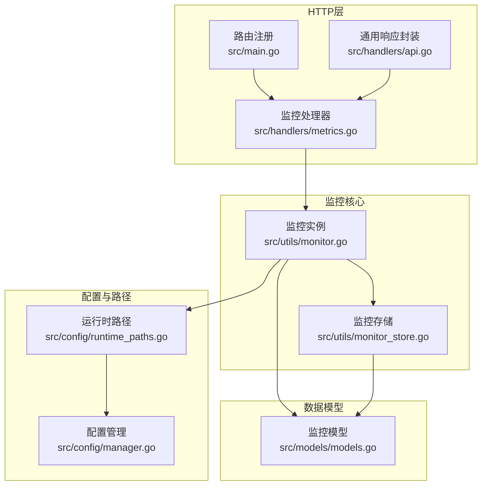
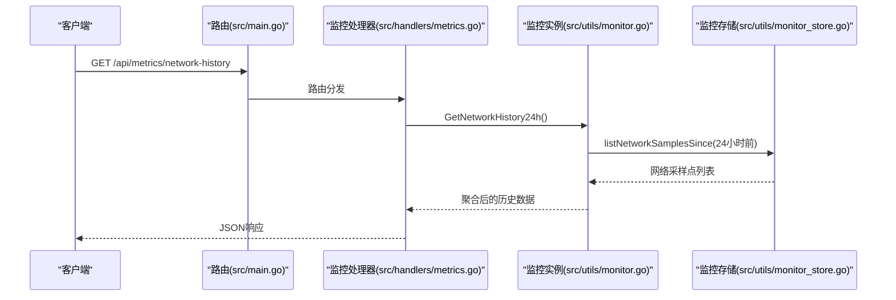
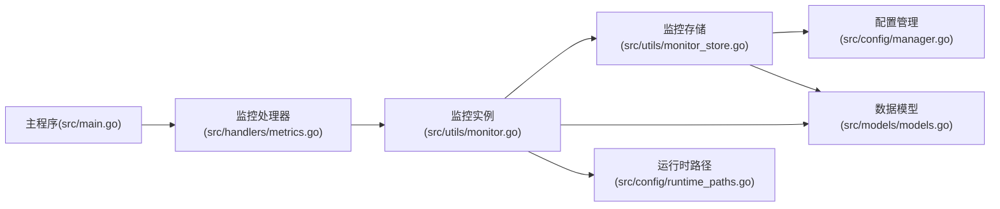

# 监控与指标接口

<cite>
**本文引用的文件**
- [src/main.go](file://src/main.go)
- [src/handlers/api.go](file://src/handlers/api.go)
- [src/handlers/metrics.go](file://src/handlers/metrics.go)
- [src/utils/monitor.go](file://src/utils/monitor.go)
- [src/utils/monitor_store.go](file://src/utils/monitor_store.go)
- [src/utils/system.go](file://src/utils/system.go)
- [src/models/models.go](file://src/models/models.go)
- [src/config/runtime_paths.go](file://src/config/runtime_paths.go)
- [src/config/manager.go](file://src/config/manager.go)
</cite>

## 目录
1. [简介](#简介)
2. [项目结构](#项目结构)
3. [核心组件](#核心组件)
4. [架构总览](#架构总览)
5. [详细组件分析](#详细组件分析)
6. [依赖关系分析](#依赖关系分析)
7. [性能考量](#性能考量)
8. [故障排查指南](#故障排查指南)
9. [结论](#结论)
10. [附录](#附录)

## 简介
本文件面向运维与开发人员，提供系统监控与指标接口的完整API文档。内容覆盖：
- 系统状态监控：CPU使用率、内存占用、磁盘空间、网络流量等
- 服务状态监控：监听器状态、服务运行状态、健康检查结果
- 业务指标采集：请求量、响应时间、错误率等
- 监控数据存储与查询：历史数据获取、趋势分析
- 监控告警配置与通知机制：当前实现与扩展建议
- 数据格式、时间范围查询与聚合计算
- 请求示例与响应格式

## 项目结构
监控相关能力由以下模块协同实现：
- HTTP路由与控制器：负责对外暴露监控API
- 监控核心：负责实时统计、采样与持久化
- 数据模型：统一监控数据结构
- 存储层：基于嵌入式数据库的监控数据持久化
- 配置与路径：运行时路径与全局配置

图表来源
- [src/main.go:112-139](file://src/main.go#L112-L139)
- [src/handlers/metrics.go:11-41](file://src/handlers/metrics.go#L11-L41)
- [src/utils/monitor.go:38-65](file://src/utils/monitor.go#L38-L65)
- [src/utils/monitor_store.go:26-54](file://src/utils/monitor_store.go#L26-L54)
- [src/models/models.go:7-70](file://src/models/models.go#L7-L70)
- [src/config/runtime_paths.go:12-21](file://src/config/runtime_paths.go#L12-L21)
- [src/config/manager.go:35-72](file://src/config/manager.go#L35-L72)

章节来源
- [src/main.go:112-139](file://src/main.go#L112-L139)
- [src/handlers/metrics.go:11-41](file://src/handlers/metrics.go#L11-L41)
- [src/utils/monitor.go:38-65](file://src/utils/monitor.go#L38-L65)
- [src/utils/monitor_store.go:26-54](file://src/utils/monitor_store.go#L26-L54)
- [src/models/models.go:7-70](file://src/models/models.go#L7-L70)
- [src/config/runtime_paths.go:12-21](file://src/config/runtime_paths.go#L12-L21)
- [src/config/manager.go:35-72](file://src/config/manager.go#L35-L72)

## 核心组件
- 监控实例（Monitor）：负责运行时统计、网络采样、访问日志记录与查询
- 监控存储（monitorStore）：基于嵌入式数据库持久化网络采样与访问日志
- 数据模型（models）：统一的监控数据结构，包括服务器状态、运行时统计、网络采样、访问日志等
- 路由与处理器：对外暴露监控API，包括系统状态、监听统计、服务统计、网络历史、访问日志等

章节来源
- [src/utils/monitor.go:38-65](file://src/utils/monitor.go#L38-L65)
- [src/utils/monitor_store.go:26-54](file://src/utils/monitor_store.go#L26-L54)
- [src/models/models.go:7-70](file://src/models/models.go#L7-L70)

## 架构总览
监控架构采用“实时统计 + 持久化存储”的设计：
- 实时统计：在内存中维护每个监听器与服务的运行时统计（请求量、活跃连接数、进出字节、速率等）
- 网络采样：定时采样系统网络IO，计算速率并持久化
- 访问日志：记录每次请求的关键信息，并持久化
- 查询接口：提供历史数据聚合查询与日志过滤

图表来源
- [src/main.go:133-138](file://src/main.go#L133-L138)
- [src/handlers/metrics.go:11-14](file://src/handlers/metrics.go#L11-L14)
- [src/utils/monitor.go:323-355](file://src/utils/monitor.go#L323-L355)
- [src/utils/monitor_store.go:77-100](file://src/utils/monitor_store.go#L77-L100)

## 详细组件分析

### 系统状态监控接口
- 接口：GET /api/status
- 功能：返回服务器基础状态，包括运行时长、内存使用、CPU使用率、网络进出总量与速率、主机信息等
- 数据来源：系统采集与gopsutil库
- 响应字段：
  - uptime：运行时长字符串
  - memory_used：当前程序使用的内存字节数
  - memory_total：系统总内存字节数
  - memory_percent：内存使用百分比（占位）
  - network_in：累计接收字节数
  - network_out：累计发送字节数
  - cpu_usage：CPU使用率百分比
  - hostname：主机名
  - os：操作系统
  - platform：平台信息

请求示例
- GET /api/status

响应示例
- 成功响应：包含上述字段的对象
- 错误响应：包含错误信息的统一结构

章节来源
- [src/handlers/api.go:129-137](file://src/handlers/api.go#L129-L137)
- [src/utils/system.go:19-82](file://src/utils/system.go#L19-L82)

### 监听器状态监控接口
- 接口：GET /api/metrics/listeners
- 功能：返回所有监听器的运行时统计，包括请求量、活跃连接数、进出字节、速率、最近活跃时间等
- 输入参数：无
- 输出：按监听器ID与端口组织的统计数组
- 响应字段：
  - listener_id：监听器ID
  - port：监听器端口
  - request_count：请求总数
  - active_connections：活跃连接数
  - bytes_in_total：累计输入字节
  - bytes_out_total：累计输出字节
  - bytes_in_rate：最近窗口内平均输入速率
  - bytes_out_rate：最近窗口内平均输出速率
  - last_seen_at：最近活跃时间

请求示例
- GET /api/metrics/listeners

响应示例
- 成功响应：包含监听器统计数组的对象
- 错误响应：包含错误信息的统一结构

章节来源
- [src/handlers/metrics.go:16-19](file://src/handlers/metrics.go#L16-L19)
- [src/utils/monitor.go:253-269](file://src/utils/monitor.go#L253-L269)
- [src/models/models.go:36-41](file://src/models/models.go#L36-L41)

### 服务状态监控接口
- 接口：GET /api/metrics/services?port_id={端口ID}
- 功能：返回指定端口下所有服务的运行时统计
- 输入参数：
  - port_id：端口ID（必填）
- 输出：按服务ID、名称、域名、类型组织的统计数组
- 响应字段：
  - service_id：服务ID
  - listener_id：所属监听器ID
  - service_name：服务名称
  - domain：域名
  - type：服务类型
  - request_count：请求总数
  - active_connections：活跃连接数
  - bytes_in_total：累计输入字节
  - bytes_out_total：累计输出字节
  - bytes_in_rate：最近窗口内平均输入速率
  - bytes_out_rate：最近窗口内平均输出速率
  - last_seen_at：最近活跃时间

请求示例
- GET /api/metrics/services?port_id=abc123

响应示例
- 成功响应：包含服务统计数组的对象
- 错误响应：包含错误信息的统一结构

章节来源
- [src/handlers/metrics.go:21-29](file://src/handlers/metrics.go#L21-L29)
- [src/utils/monitor.go:285-304](file://src/utils/monitor.go#L285-L304)
- [src/models/models.go:43-51](file://src/models/models.go#L43-L51)

### 网络流量历史接口
- 接口：GET /api/metrics/network-history
- 功能：返回过去24小时每10分钟聚合的网络入/出速率
- 输入参数：无
- 输出：按时间桶聚合的网络采样点数组
- 响应字段：
  - timestamp：时间桶起始时间
  - in_rate：该时间桶内平均入速率
  - out_rate：该时间桶内平均出速率

时间范围与聚合
- 时间范围：最近24小时
- 聚合粒度：每10分钟一个桶
- 聚合方式：桶内样本的算术平均

请求示例
- GET /api/metrics/network-history

响应示例
- 成功响应：包含网络采样点数组的对象
- 错误响应：包含错误信息的统一结构

章节来源
- [src/handlers/metrics.go:11-14](file://src/handlers/metrics.go#L11-L14)
- [src/utils/monitor.go:323-355](file://src/utils/monitor.go#L323-L355)
- [src/utils/monitor_store.go:77-100](file://src/utils/monitor_store.go#L77-L100)
- [src/models/models.go:18-23](file://src/models/models.go#L18-L23)

### 访问日志查询接口
- 监听器访问日志
  - 接口：GET /api/logs/listeners/{listener_id}?limit={数量}
  - 功能：返回指定监听器的访问日志
  - 输入参数：
    - listener_id：监听器ID（路径参数）
    - limit：返回日志条数上限，默认200，最大500
  - 输出：访问日志数组
  - 响应字段：
    - id：日志ID
    - timestamp：时间戳
    - listener_id：监听器ID
    - listener_port：监听器端口
    - service_id：服务ID
    - service_name：服务名称
    - host：请求Host
    - method：HTTP方法
    - path：请求路径
    - status_code：HTTP状态码
    - duration_ms：耗时毫秒数
    - bytes_in：输入字节
    - bytes_out：输出字节
    - remote_addr：客户端地址
    - username：用户名（若已认证）

- 服务访问日志
  - 接口：GET /api/logs/services/{service_id}?limit={数量}
  - 功能：返回指定服务的访问日志
  - 输入参数：
    - service_id：服务ID（路径参数）
    - limit：返回日志条数上限，默认200，最大500
  - 输出：访问日志数组
  - 响应字段：同上

请求示例
- GET /api/logs/listeners/abc123?limit=100
- GET /api/logs/services/xyz789?limit=50

响应示例
- 成功响应：包含访问日志数组的对象
- 错误响应：包含错误信息的统一结构

章节来源
- [src/handlers/metrics.go:31-41](file://src/handlers/metrics.go#L31-L41)
- [src/utils/monitor.go:357-380](file://src/utils/monitor.go#L357-L380)
- [src/utils/monitor_store.go:127-155](file://src/utils/monitor_store.go#L127-L155)
- [src/models/models.go:53-70](file://src/models/models.go#L53-L70)

### 监控数据存储与查询
- 存储介质：嵌入式数据库（键值存储），分别维护网络采样与访问日志两个桶
- 网络采样存储
  - 桶名：network_samples
  - 键：时间戳（纳秒级）
  - 值：网络采样对象（JSON）
  - 清理策略：保留最近24小时，过期自动清理
- 访问日志存储
  - 桶名：access_logs
  - 键：时间戳+日志ID（复合键）
  - 值：访问日志对象（JSON）
  - 清理策略：按全局配置的日志保留天数与最大条数限制进行清理
- 查询策略
  - 网络历史：按时间范围扫描桶并聚合
  - 访问日志：按时间倒序遍历桶，支持过滤与限制数量

章节来源
- [src/utils/monitor_store.go:16-24](file://src/utils/monitor_store.go#L16-L24)
- [src/utils/monitor_store.go:56-100](file://src/utils/monitor_store.go#L56-L100)
- [src/utils/monitor_store.go:102-155](file://src/utils/monitor_store.go#L102-L155)
- [src/utils/monitor.go:16-21](file://src/utils/monitor.go#L16-L21)
- [src/config/manager.go:234-241](file://src/config/manager.go#L234-L241)

### 监控数据格式与聚合
- 服务器状态
  - 字段：uptime、memory_used、memory_total、memory_percent、network_in、network_out、cpu_usage、hostname、os、platform
- 运行时统计
  - 字段：request_count、active_connections、bytes_in_total、bytes_out_total、bytes_in_rate、bytes_out_rate、last_seen_at
- 网络采样
  - 字段：timestamp、in_rate、out_rate
- 访问日志
  - 字段：id、timestamp、listener_id、listener_port、service_id、service_name、host、method、path、status_code、duration_ms、bytes_in、bytes_out、remote_addr、username

聚合计算
- 网络历史：按10分钟桶聚合，桶内样本取平均
- 运行时统计：最近1分钟窗口内的速率计算

章节来源
- [src/models/models.go:7-70](file://src/models/models.go#L7-L70)
- [src/utils/monitor.go:231-251](file://src/utils/monitor.go#L231-L251)
- [src/utils/monitor.go:323-355](file://src/utils/monitor.go#L323-L355)

### 监控告警配置与通知机制
- 当前实现：未提供内置告警配置与通知接口
- 建议扩展：
  - 新增告警规则：阈值、持续时间、触发条件
  - 新增告警通道：邮件、Webhook、IM等
  - 新增告警历史与恢复通知
  - 提供告警规则的增删改查与批量导入导出

[本节为概念性内容，不直接分析具体文件]

## 依赖关系分析
- 路由到处理器：主程序注册监控API路由，交由监控处理器处理
- 处理器到监控：监控处理器调用监控实例获取统计数据
- 监控到存储：监控实例通过监控存储进行数据持久化与查询
- 存储到配置：监控存储读取全局配置以确定清理策略与保留策略

图表来源
- [src/main.go:133-138](file://src/main.go#L133-L138)
- [src/handlers/metrics.go:11-14](file://src/handlers/metrics.go#L11-L14)
- [src/utils/monitor.go:38-65](file://src/utils/monitor.go#L38-L65)
- [src/utils/monitor_store.go:26-54](file://src/utils/monitor_store.go#L26-L54)
- [src/config/manager.go:234-241](file://src/config/manager.go#L234-L241)
- [src/config/runtime_paths.go:97-99](file://src/config/runtime_paths.go#L97-L99)
- [src/models/models.go:7-70](file://src/models/models.go#L7-L70)

章节来源
- [src/main.go:133-138](file://src/main.go#L133-L138)
- [src/handlers/metrics.go:11-14](file://src/handlers/metrics.go#L11-L14)
- [src/utils/monitor.go:38-65](file://src/utils/monitor.go#L38-L65)
- [src/utils/monitor_store.go:26-54](file://src/utils/monitor_store.go#L26-L54)
- [src/config/manager.go:234-241](file://src/config/manager.go#L234-L241)
- [src/config/runtime_paths.go:97-99](file://src/config/runtime_paths.go#L97-L99)
- [src/models/models.go:7-70](file://src/models/models.go#L7-L70)

## 性能考量
- 内存统计：运行时统计在内存中维护，避免频繁I/O
- 网络采样：每分钟采样一次，降低CPU与存储压力
- 日志清理：按保留天数与最大条数限制清理，防止无限增长
- 查询优化：网络历史按时间范围扫描，访问日志按时间倒序遍历，均使用索引键

[本节提供一般性指导，不直接分析具体文件]

## 故障排查指南
- 网络历史为空
  - 检查监控存储路径与权限
  - 确认网络采样是否正常运行
- 访问日志缺失
  - 检查全局配置的日志保留天数与最大条数
  - 确认服务是否启用了访问日志记录
- 状态接口异常
  - 检查系统采集权限与gopsutil库可用性
  - 查看系统资源是否受限

章节来源
- [src/utils/monitor_store.go:56-100](file://src/utils/monitor_store.go#L56-L100)
- [src/utils/monitor_store.go:102-155](file://src/utils/monitor_store.go#L102-L155)
- [src/utils/system.go:19-82](file://src/utils/system.go#L19-L82)
- [src/config/manager.go:234-241](file://src/config/manager.go#L234-L241)

## 结论
本监控体系通过“内存统计 + 嵌入式存储”的组合，实现了对系统状态、监听器与服务运行状态、网络流量历史以及访问日志的全面监控。接口设计简洁清晰，数据模型统一规范，具备良好的可扩展性。建议后续补充告警配置与通知机制，以满足更丰富的运维场景需求。

[本节为总结性内容，不直接分析具体文件]

## 附录

### API一览表
- GET /api/status：系统状态
- GET /api/metrics/network-history：网络历史（24小时，10分钟聚合）
- GET /api/metrics/listeners：监听统计
- GET /api/metrics/services?port_id={端口ID}：服务统计
- GET /api/logs/listeners/{listener_id}?limit={数量}：监听访问日志
- GET /api/logs/services/{service_id}?limit={数量}：服务访问日志

章节来源
- [src/main.go:133-138](file://src/main.go#L133-L138)
- [src/handlers/metrics.go:11-41](file://src/handlers/metrics.go#L11-L41)