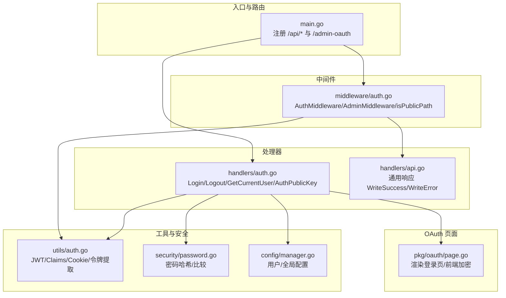
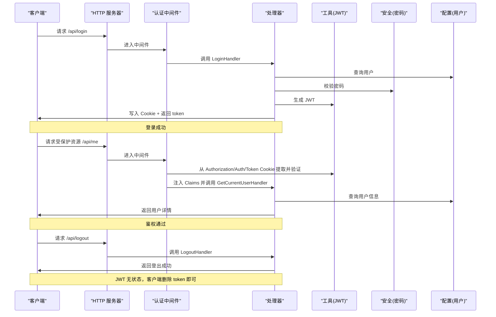
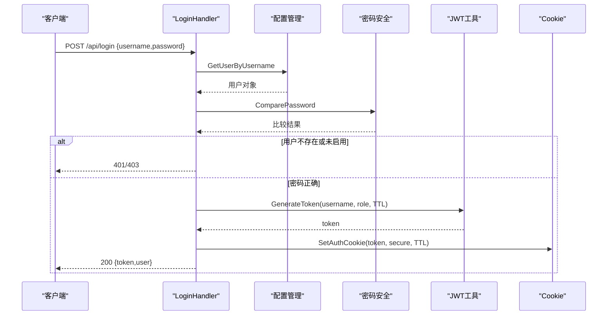
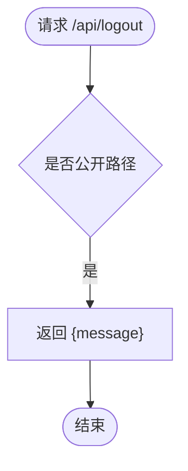
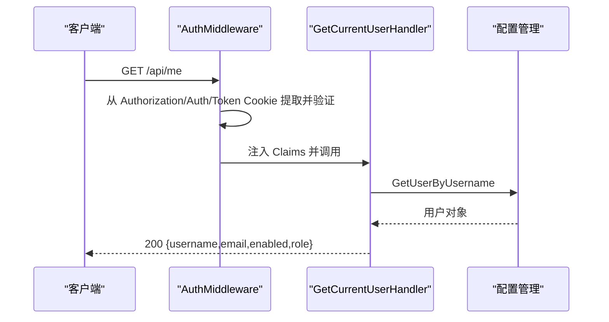
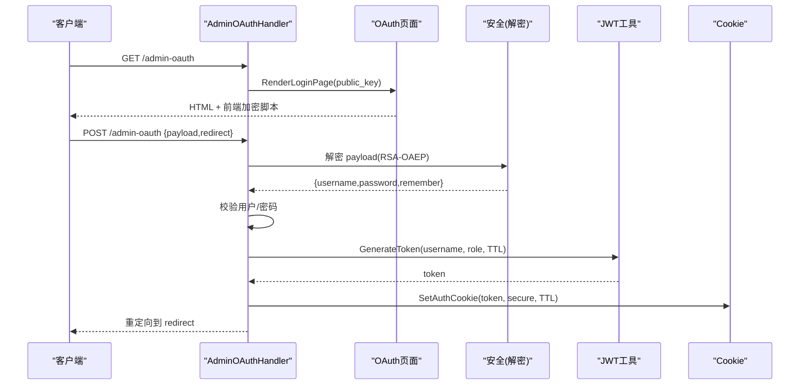
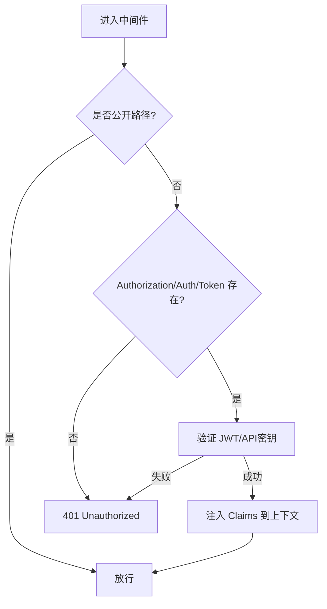
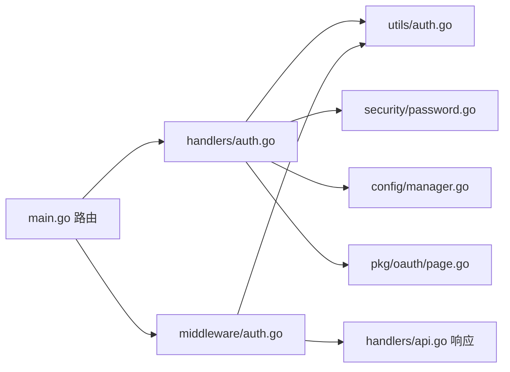

# 认证接口

<cite>
**本文引用的文件**
- [src/main.go](file://src/main.go)
- [src/handlers/auth.go](file://src/handlers/auth.go)
- [src/middleware/auth.go](file://src/middleware/auth.go)
- [src/utils/auth.go](file://src/utils/auth.go)
- [src/handlers/api.go](file://src/handlers/api.go)
- [src/pkg/oauth/page.go](file://src/pkg/oauth/page.go)
- [src/security/password.go](file://src/security/password.go)
- [src/config/manager.go](file://src/config/manager.go)
</cite>

## 目录
1. [简介](#简介)
2. [项目结构](#项目结构)
3. [核心组件](#核心组件)
4. [架构总览](#架构总览)
5. [详细组件分析](#详细组件分析)
6. [依赖分析](#依赖分析)
7. [性能考虑](#性能考虑)
8. [故障排查指南](#故障排查指南)
9. [结论](#结论)

## 简介
本文件为认证接口的详细 API 文档，覆盖以下接口：
- 登录接口：/api/login（用户名密码认证、JWT 令牌生成与返回）
- 登出路由：/api/logout（会话清理与令牌失效机制）
- 用户信息：/api/me（用户详情获取与权限验证）
- OAuth 登录页面与公钥接口：/api/auth/public-key、/admin-oauth
- 认证中间件工作原理与安全考虑
- API 密钥认证与 OAuth 集成方式

文档提供请求示例、响应格式、错误处理以及最佳实践，帮助开发者与运维人员正确集成与使用认证能力。

## 项目结构
认证相关代码主要分布在以下模块：
- 路由与入口：main.go 中注册 /api/login、/api/logout、/api/me、/api/auth/public-key、/admin-oauth
- 处理器：handlers/auth.go 实现登录、登出、用户信息、OAuth 登录页面渲染与公钥导出
- 中间件：middleware/auth.go 实现认证与管理员权限中间件
- 工具：utils/auth.go 实现 JWT 生成/验证、Cookie 设置/清理、令牌提取
- 安全：security/password.go 实现密码哈希与比较
- 配置：config/manager.go 提供用户与全局配置管理

**图表来源**
- [src/main.go:111-131](file://src/main.go#L111-L131)
- [src/handlers/auth.go:38-115](file://src/handlers/auth.go#L38-L115)
- [src/middleware/auth.go:14-91](file://src/middleware/auth.go#L14-L91)
- [src/utils/auth.go:24-139](file://src/utils/auth.go#L24-L139)
- [src/security/password.go:44-70](file://src/security/password.go#L44-L70)
- [src/config/manager.go:35-72](file://src/config/manager.go#L35-L72)
- [src/pkg/oauth/page.go:15-197](file://src/pkg/oauth/page.go#L15-L197)

**章节来源**
- [src/main.go:111-131](file://src/main.go#L111-L131)
- [src/handlers/auth.go:38-115](file://src/handlers/auth.go#L38-L115)
- [src/middleware/auth.go:14-91](file://src/middleware/auth.go#L14-L91)
- [src/utils/auth.go:24-139](file://src/utils/auth.go#L24-L139)
- [src/security/password.go:44-70](file://src/security/password.go#L44-L70)
- [src/config/manager.go:35-72](file://src/config/manager.go#L35-L72)
- [src/pkg/oauth/page.go:15-197](file://src/pkg/oauth/page.go#L15-L197)

## 核心组件
- 登录处理器 LoginHandler：接收用户名/密码，校验用户状态与密码，签发 JWT 并写入 Cookie，返回 token 与用户角色
- 登出处理器 LogoutHandler：返回登出成功消息（JWT 无状态，客户端删除 token 即可）
- 用户信息处理器 GetCurrentUserHandler：从上下文提取 Claims，查询用户并返回基础信息
- 认证中间件 AuthMiddleware：拦截非公开路径，优先从 Authorization/Auth/Token Cookie 中提取令牌，验证后注入上下文
- 管理员中间件 AdminMiddleware：校验 Claims 角色为 admin
- OAuth 登录页面：/admin-oauth 渲染登录页，前端使用公钥加密凭据，后端解密并完成登录
- 公钥接口：/api/auth/public-key 返回服务端 RSA 公钥，供前端加密

**章节来源**
- [src/handlers/auth.go:38-115](file://src/handlers/auth.go#L38-L115)
- [src/middleware/auth.go:14-91](file://src/middleware/auth.go#L14-L91)
- [src/pkg/oauth/page.go:15-197](file://src/pkg/oauth/page.go#L15-L197)

## 架构总览
认证流程概览如下：

**图表来源**
- [src/main.go:126-131](file://src/main.go#L126-L131)
- [src/middleware/auth.go:14-55](file://src/middleware/auth.go#L14-L55)
- [src/handlers/auth.go:38-115](file://src/handlers/auth.go#L38-L115)
- [src/utils/auth.go:24-139](file://src/utils/auth.go#L24-L139)
- [src/security/password.go:44-70](file://src/security/password.go#L44-L70)
- [src/config/manager.go:35-72](file://src/config/manager.go#L35-L72)

## 详细组件分析

### 登录接口 /api/login
- 方法与路径：POST /api/login
- 请求体字段
  - username: string，必填
  - password: string，必填
- 成功响应
  - data.token: string，JWT 令牌
  - data.user.username: string
  - data.user.role: string
- 错误响应
  - 400：请求体无效
  - 401：用户名或密码错误/未启用
  - 403：用户被禁用
  - 500：令牌生成失败
- 安全要点
  - 密码使用 HMAC-SHA256 哈希存储，比较采用常量时间算法
  - 登录成功后写入 HttpOnly Cookie，提升安全性
  - 支持 Authorization Header 与 Auth/Token Cookie 两种令牌传递方式

**图表来源**
- [src/handlers/auth.go:38-76](file://src/handlers/auth.go#L38-L76)
- [src/utils/auth.go:24-37](file://src/utils/auth.go#L24-L37)
- [src/utils/auth.go:55-70](file://src/utils/auth.go#L55-L70)
- [src/security/password.go:44-70](file://src/security/password.go#L44-L70)
- [src/config/manager.go:35-72](file://src/config/manager.go#L35-L72)

**章节来源**
- [src/handlers/auth.go:22-76](file://src/handlers/auth.go#L22-L76)
- [src/utils/auth.go:24-70](file://src/utils/auth.go#L24-L70)
- [src/security/password.go:44-70](file://src/security/password.go#L44-L70)
- [src/config/manager.go:35-72](file://src/config/manager.go#L35-L72)

### 登出路由 /api/logout
- 方法与路径：POST /api/logout
- 请求体：无
- 成功响应
  - data.message: string，登出成功提示
- 错误响应：无（该接口为公开路径）
- 机制说明
  - JWT 为无状态令牌，服务端不维护会话；登出即客户端删除 token 即可
  - 服务端返回成功消息，便于前端清理本地状态

**图表来源**
- [src/middleware/auth.go:57-73](file://src/middleware/auth.go#L57-L73)
- [src/handlers/auth.go:84-88](file://src/handlers/auth.go#L84-L88)

**章节来源**
- [src/handlers/auth.go:84-88](file://src/handlers/auth.go#L84-L88)
- [src/middleware/auth.go:57-73](file://src/middleware/auth.go#L57-L73)

### 用户信息接口 /api/me
- 方法与路径：GET /api/me
- 请求头
  - Authorization: Bearer <token>（推荐）
  - 或 Auth/Token: <token>
  - 或 Cookie: fnproxy_auth=<token>
- 成功响应
  - data.username: string
  - data.email: string
  - data.enabled: boolean
  - data.role: string
- 错误响应
  - 401：未授权
  - 404：用户不存在

**图表来源**
- [src/middleware/auth.go:14-55](file://src/middleware/auth.go#L14-L55)
- [src/handlers/auth.go:90-110](file://src/handlers/auth.go#L90-L110)
- [src/utils/auth.go:86-139](file://src/utils/auth.go#L86-L139)
- [src/config/manager.go:35-72](file://src/config/manager.go#L35-L72)

**章节来源**
- [src/handlers/auth.go:90-110](file://src/handlers/auth.go#L90-L110)
- [src/middleware/auth.go:14-55](file://src/middleware/auth.go#L14-L55)
- [src/utils/auth.go:86-139](file://src/utils/auth.go#L86-L139)
- [src/config/manager.go:35-72](file://src/config/manager.go#L35-L72)

### OAuth 登录与公钥接口
- 公钥接口：GET /api/auth/public-key
  - 返回服务端 RSA 公钥，供前端加密登录凭据
- 管理后台 OAuth 登录页面：GET /admin-oauth
  - 渲染登录页，前端使用公钥加密凭据后提交
- 后端解密与登录
  - 解析表单 payload，使用服务端私钥解密
  - 校验用户与密码，生成 JWT 并写入 Cookie

**图表来源**
- [src/handlers/auth.go:78-82](file://src/handlers/auth.go#L78-L82)
- [src/handlers/auth.go:124-198](file://src/handlers/auth.go#L124-L198)
- [src/pkg/oauth/page.go:15-197](file://src/pkg/oauth/page.go#L15-L197)
- [src/utils/auth.go:24-37](file://src/utils/auth.go#L24-L37)
- [src/utils/auth.go:55-70](file://src/utils/auth.go#L55-L70)

**章节来源**
- [src/handlers/auth.go:78-82](file://src/handlers/auth.go#L78-L82)
- [src/handlers/auth.go:124-198](file://src/handlers/auth.go#L124-L198)
- [src/pkg/oauth/page.go:15-197](file://src/pkg/oauth/page.go#L15-L197)
- [src/utils/auth.go:24-70](file://src/utils/auth.go#L24-L70)

### 认证中间件与安全考虑
- AuthMiddleware
  - 公开路径：/api/login、/api/auth/public-key、/api/logout
  - 非公开路径：优先从 Authorization/Auth/Token Cookie 提取令牌，验证后注入上下文
  - 未携带有效令牌：返回 401
- AdminMiddleware
  - 校验 Claims 角色为 admin，否则返回 403
- Cookie 安全
  - HttpOnly、SameSite=Lax、Secure（仅 HTTPS）、Max-Age 控制过期
- 令牌机制
  - HS256 签名的 JWT，Claims 包含 username、role、iat/exp
- 密码安全
  - HMAC-SHA256 哈希存储，常量时间比较防止时序攻击

**图表来源**
- [src/middleware/auth.go:14-91](file://src/middleware/auth.go#L14-L91)
- [src/utils/auth.go:24-53](file://src/utils/auth.go#L24-L53)
- [src/utils/auth.go:86-139](file://src/utils/auth.go#L86-L139)

**章节来源**
- [src/middleware/auth.go:14-91](file://src/middleware/auth.go#L14-L91)
- [src/utils/auth.go:24-53](file://src/utils/auth.go#L24-L53)
- [src/utils/auth.go:86-139](file://src/utils/auth.go#L86-L139)
- [src/security/password.go:44-70](file://src/security/password.go#L44-L70)

## 依赖分析
- 路由层依赖处理器层，处理器层依赖工具层与安全层，中间件贯穿请求链路
- OAuth 登录页面依赖前端加密脚本与服务端公钥导出
- 配置层提供用户与全局配置，影响用户状态与默认认证策略

**图表来源**
- [src/main.go:111-131](file://src/main.go#L111-L131)
- [src/handlers/auth.go:38-115](file://src/handlers/auth.go#L38-L115)
- [src/middleware/auth.go:14-91](file://src/middleware/auth.go#L14-L91)
- [src/utils/auth.go:24-139](file://src/utils/auth.go#L24-L139)
- [src/security/password.go:44-70](file://src/security/password.go#L44-L70)
- [src/config/manager.go:35-72](file://src/config/manager.go#L35-L72)
- [src/pkg/oauth/page.go:15-197](file://src/pkg/oauth/page.go#L15-L197)
- [src/handlers/api.go:95-114](file://src/handlers/api.go#L95-L114)

**章节来源**
- [src/main.go:111-131](file://src/main.go#L111-L131)
- [src/handlers/auth.go:38-115](file://src/handlers/auth.go#L38-L115)
- [src/middleware/auth.go:14-91](file://src/middleware/auth.go#L14-L91)
- [src/utils/auth.go:24-139](file://src/utils/auth.go#L24-L139)
- [src/security/password.go:44-70](file://src/security/password.go#L44-L70)
- [src/config/manager.go:35-72](file://src/config/manager.go#L35-L72)
- [src/pkg/oauth/page.go:15-197](file://src/pkg/oauth/page.go#L15-L197)
- [src/handlers/api.go:95-114](file://src/handlers/api.go#L95-L114)

## 性能考虑
- JWT 无状态验证避免服务端会话存储，降低内存压力
- 密码比较使用常量时间算法，避免时序侧信道
- Cookie 过期时间可配置，建议按需缩短以提升安全性
- OAuth 登录页面前端加密减少明文传输风险

## 故障排查指南
- 登录 401/403
  - 检查用户名是否存在、是否启用
  - 确认密码正确性（哈希比较）
- 令牌无效 401
  - 确认 Authorization 头格式为 Bearer <token>
  - 确认 token 未过期
- /api/me 401
  - 确认已携带有效令牌或 Cookie
- OAuth 登录失败
  - 检查 /api/auth/public-key 返回的公钥是否可用
  - 确认前端加密脚本正常工作
  - 检查服务端私钥是否配置

**章节来源**
- [src/handlers/auth.go:38-115](file://src/handlers/auth.go#L38-L115)
- [src/middleware/auth.go:14-55](file://src/middleware/auth.go#L14-L55)
- [src/utils/auth.go:24-53](file://src/utils/auth.go#L24-L53)
- [src/security/password.go:44-70](file://src/security/password.go#L44-L70)
- [src/pkg/oauth/page.go:15-197](file://src/pkg/oauth/page.go#L15-L197)

## 结论
本认证体系基于 JWT 无状态令牌与 HttpOnly Cookie，结合 HMAC-SHA256 密码哈希与常量时间比较，提供安全可靠的认证能力。OAuth 登录页面通过前端公钥加密进一步降低明文泄露风险。通过中间件统一拦截与权限校验，确保受保护资源的安全访问。建议在生产环境中：
- 更换默认 JWT 秘钥与安全参数
- 启用 HTTPS 并合理配置 Cookie Secure 属性
- 限制令牌 TTL 并定期轮换密钥
- 对关键操作增加审计日志