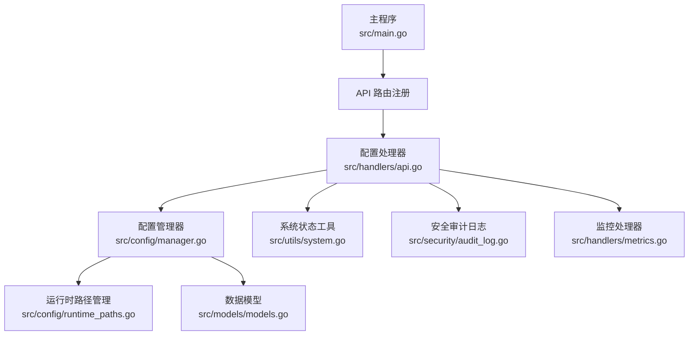
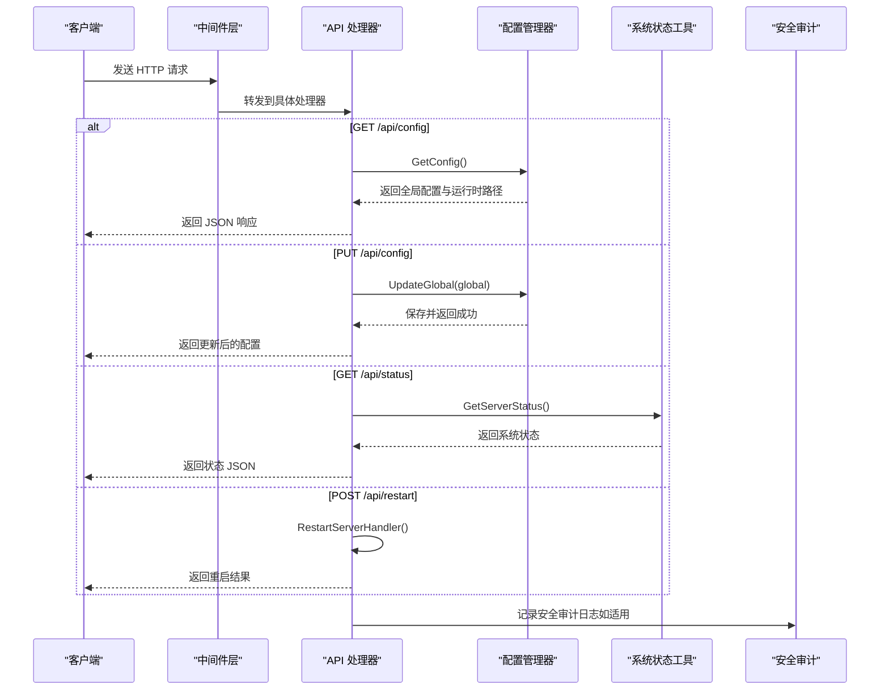
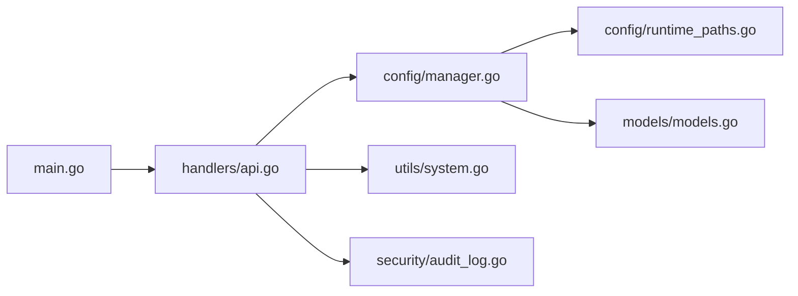

# 配置管理接口

<cite>
**本文档引用的文件**
- [main.go](file://src/main.go)
- [api.go](file://src/handlers/api.go)
- [manager.go](file://src/config/manager.go)
- [runtime_paths.go](file://src/config/runtime_paths.go)
- [models.go](file://src/models/models.go)
- [system.go](file://src/utils/system.go)
- [audit_log.go](file://src/security/audit_log.go)
- [metrics.go](file://src/handlers/metrics.go)
- [README.md](file://README.md)
</cite>

## 目录
1. [简介](#简介)
2. [项目结构](#项目结构)
3. [核心组件](#核心组件)
4. [架构总览](#架构总览)
5. [详细组件分析](#详细组件分析)
6. [依赖分析](#依赖分析)
7. [性能考虑](#性能考虑)
8. [故障排除指南](#故障排除指南)
9. [结论](#结论)

## 简介
本文件为配置管理接口的完整 API 文档，覆盖以下关键接口：
- GET /api/config：获取全局配置与运行时路径信息
- PUT /api/config：保存全局配置（管理员端口、日志级别、证书配置等）
- GET /api/status：服务器状态接口（系统状态、监听器状态、性能指标）
- POST /api/restart：重启服务器接口
同时包含配置验证规则、错误处理策略、安全审计记录以及完整的请求示例与响应格式说明。

## 项目结构
配置管理相关模块主要分布在以下文件：
- 路由注册与入口：src/main.go
- API 处理器：src/handlers/api.go
- 配置管理器：src/config/manager.go
- 运行时路径管理：src/config/runtime_paths.go
- 数据模型：src/models/models.go
- 系统状态与监控：src/utils/system.go、src/handlers/metrics.go
- 安全审计：src/security/audit_log.go

**图表来源**
- [main.go:112-429](file://src/main.go#L112-L429)
- [api.go:732-784](file://src/handlers/api.go#L732-L784)
- [manager.go:1-791](file://src/config/manager.go#L1-L791)
- [runtime_paths.go:1-160](file://src/config/runtime_paths.go#L1-L160)
- [system.go:19-82](file://src/utils/system.go#L19-L82)
- [audit_log.go:15-224](file://src/security/audit_log.go#L15-L224)
- [metrics.go:1-53](file://src/handlers/metrics.go#L1-L53)
- [models.go:299-310](file://src/models/models.go#L299-L310)

**章节来源**
- [main.go:112-429](file://src/main.go#L112-L429)
- [README.md:105-129](file://README.md#L105-L129)

## 核心组件
- 配置管理器（Manager）：负责全局配置的读取、更新、持久化与规范化，默认值填充与服务排序规范化。
- 运行时路径管理：根据运行目录动态计算配置文件、PID 文件、Socket 文件、缓存与证书目录等路径。
- API 处理器：提供 /api/config、/api/status、/api/restart 等接口的具体实现。
- 系统状态工具：采集 CPU、内存、网络 IO、主机信息等系统状态。
- 安全审计：记录系统操作、登录、代理错误、SSH 连接等安全事件。

**章节来源**
- [manager.go:35-72](file://src/config/manager.go#L35-L72)
- [runtime_paths.go:31-160](file://src/config/runtime_paths.go#L31-L160)
- [api.go:732-784](file://src/handlers/api.go#L732-L784)
- [system.go:19-82](file://src/utils/system.go#L19-L82)
- [audit_log.go:25-31](file://src/security/audit_log.go#L25-L31)

## 架构总览
配置管理接口的调用链路如下：
- 客户端请求到达 /api/config 或 /api/status 或 /api/restart
- 中间件进行认证、防火墙、CORS、日志等处理
- API 处理器根据请求方法调用相应处理函数
- 配置处理器通过配置管理器读取或更新全局配置
- 系统状态处理器通过系统状态工具采集运行时指标
- 安全审计记录关键操作

**图表来源**
- [main.go:422-427](file://src/main.go#L422-L427)
- [api.go:732-784](file://src/handlers/api.go#L732-L784)
- [manager.go:227-241](file://src/config/manager.go#L227-L241)
- [system.go:19-82](file://src/utils/system.go#L19-L82)
- [audit_log.go:149-166](file://src/security/audit_log.go#L149-L166)

## 详细组件分析

### /api/config 接口

#### GET /api/config
- 功能：获取全局配置与运行时路径信息
- 认证：需要管理员权限
- 响应字段：
  - admin_port：管理后台端口
  - default_auth：默认启用认证
  - log_level：日志级别
  - log_file：日志文件路径
  - log_retention_days：日志保留天数
  - max_access_log_entries：最大访问日志条数
  - certificate_config_path：外部证书配置文件路径
  - certificate_sync_interval_seconds：证书同步周期（秒）
  - effective_paths：运行时路径映射，包含：
    - pid_path：PID 文件路径
    - socket_path：Unix Socket 文件路径
    - cache_path：监控缓存数据库路径
    - security_logs_path：安全日志缓存数据库路径
    - managed_certs_dir：受管证书目录
    - account_certs_dir：账户证书目录
    - runtime_base_dir：运行时根目录
    - config_file_path：应用配置文件路径

- 成功响应示例（路径与数值仅为示意）：
  {
    "success": true,
    "data": {
      "admin_port": 8080,
      "default_auth": false,
      "log_level": "info",
      "log_file": "fnproxy.log",
      "log_retention_days": 7,
      "max_access_log_entries": 10000,
      "max_security_log_entries": 5000,
      "certificate_config_path": "/usr/trim/etc/network_gateway_cert.conf",
      "certificate_sync_interval_seconds": 3600,
      "effective_paths": {
        "pid_path": "/data/fnproxy-panel/fnproxy.pid",
        "socket_path": "/data/fnproxy-panel/fnproxy.sock",
        "cache_path": "/data/fnproxy-panel/cache/monitor-cache.db",
        "security_logs_path": "/data/fnproxy-panel/cache/security-logs.db",
        "managed_certs_dir": "/data/fnproxy-panel/certs/managed",
        "account_certs_dir": "/data/fnproxy-panel/certs/accounts",
        "runtime_base_dir": "/data/fnproxy-panel",
        "config_file_path": "/data/fnproxy-panel/fnproxy.json"
      }
    }
  }

- 错误响应：
  - 500 Internal Server Error：内部错误

- 请求示例：
  curl -H "Authorization: Bearer <token>" http://localhost:8080/api/config

- 响应示例：
  - 成功：HTTP 200，返回包含上述字段的 JSON
  - 失败：HTTP 500，返回错误信息

**章节来源**
- [api.go:732-759](file://src/handlers/api.go#L732-L759)
- [manager.go:227-232](file://src/config/manager.go#L227-L232)
- [runtime_paths.go:85-115](file://src/config/runtime_paths.go#L85-L115)

#### PUT /api/config
- 功能：保存全局配置（管理员端口、日志级别、证书配置等）
- 认证：需要管理员权限
- 请求体字段（与 GlobalConfig 结构一致）：
  - admin_port：管理后台端口
  - default_auth：默认启用认证
  - log_level：日志级别
  - log_file：日志文件路径
  - log_retention_days：日志保留天数
  - max_access_log_entries：最大访问日志条数
  - max_security_log_entries：最大安全日志条数
  - certificate_config_path：外部证书配置文件路径
  - certificate_sync_interval_seconds：证书同步周期（秒）

- 成功响应示例：
  {
    "success": true,
    "data": {
      "admin_port": 8080,
      "default_auth": false,
      "log_level": "info",
      "log_file": "fnproxy.log",
      "log_retention_days": 7,
      "max_access_log_entries": 10000,
      "max_security_log_entries": 5000,
      "certificate_config_path": "/usr/trim/etc/network_gateway_cert.conf",
      "certificate_sync_interval_seconds": 3600
    }
  }

- 错误响应：
  - 400 Bad Request：请求体无效
  - 500 Internal Server Error：保存失败或内部错误

- 请求示例：
  curl -X PUT -H "Authorization: Bearer <token>" -H "Content-Type: application/json" -d '{
    "admin_port": 8080,
    "default_auth": false,
    "log_level": "info",
    "log_file": "fnproxy.log",
    "log_retention_days": 7,
    "max_access_log_entries": 10000,
    "max_security_log_entries": 5000,
    "certificate_config_path": "/usr/trim/etc/network_gateway_cert.conf",
    "certificate_sync_interval_seconds": 3600
  }' http://localhost:8080/api/config

- 响应示例：
  - 成功：HTTP 200，返回更新后的配置
  - 失败：HTTP 400/500，返回错误信息

- 配置验证规则：
  - 端口范围：1-65535（由配置管理器规范化为默认值）
  - 日志级别：字符串（默认 "info"）
  - 日志文件：字符串（默认 "fnproxy.log"）
  - 日志保留天数：正整数（默认 7）
  - 最大访问/安全日志条数：正整数（默认 10000/5000）
  - 证书配置路径：字符串（默认 "/usr/trim/etc/network_gateway_cert.conf"）
  - 证书同步周期：正整数（默认 3600）

- 安全审计：
  - 更新配置成功后记录系统操作日志（类型：system_operate，动作：修改全局配置）

**章节来源**
- [api.go:761-775](file://src/handlers/api.go#L761-L775)
- [manager.go:234-241](file://src/config/manager.go#L234-L241)
- [models.go:299-310](file://src/models/models.go#L299-L310)
- [audit_log.go:149-166](file://src/security/audit_log.go#L149-L166)

### /api/status 接口
- 功能：获取服务器状态（系统状态、监听器状态、性能指标）
- 认证：需要管理员权限
- 响应字段：
  - uptime：运行时长（秒/分钟/小时/天）
  - memory_used：当前内存使用量（字节）
  - memory_total：系统总内存（字节）
  - memory_percent：内存使用百分比（占总内存）
  - network_in：累计接收字节数
  - network_out：累计发送字节数
  - network_in_rate：网络接收速率（字节/秒）
  - network_out_rate：网络发送速率（字节/秒）
  - hostname：主机名
  - os：操作系统
  - platform：平台信息

- 成功响应示例：
  {
    "success": true,
    "data": {
      "uptime": "12小时",
      "memory_used": 123456789,
      "memory_total": 1234567890,
      "memory_percent": 10.0,
      "network_in": 987654321,
      "network_out": 987654321,
      "network_in_rate": 12345,
      "network_out_rate": 12345,
      "hostname": "server01",
      "os": "linux",
      "platform": "amd64"
    }
  }

- 错误响应：
  - 500 Internal Server Error：采集状态失败

- 请求示例：
  curl -H "Authorization: Bearer <token>" http://localhost:8080/api/status

- 响应示例：
  - 成功：HTTP 200，返回状态 JSON
  - 失败：HTTP 500，返回错误信息

**章节来源**
- [api.go:129-137](file://src/handlers/api.go#L129-L137)
- [system.go:19-82](file://src/utils/system.go#L19-L82)

### /api/restart 接口
- 功能：重启代理服务器
- 认证：需要管理员权限
- 响应字段：
  - message：重启成功消息

- 成功响应示例：
  {
    "success": true,
    "data": {
      "message": "Server restarted successfully"
    }
  }

- 错误响应：
  - 500 Internal Server Error：重启失败

- 请求示例：
  curl -X POST -H "Authorization: Bearer <token>" http://localhost:8080/api/restart

- 响应示例：
  - 成功：HTTP 200，返回成功消息
  - 失败：HTTP 500，返回错误信息

- 安全审计：
  - 重启成功后记录系统操作日志（类型：system_operate，动作：重启服务器）

**章节来源**
- [api.go:777-784](file://src/handlers/api.go#L777-L784)
- [audit_log.go:149-166](file://src/security/audit_log.go#L149-L166)

## 依赖分析

**图表来源**
- [main.go:112-429](file://src/main.go#L112-L429)
- [api.go:732-784](file://src/handlers/api.go#L732-L784)
- [manager.go:18-30](file://src/config/manager.go#L18-L30)
- [runtime_paths.go:12-21](file://src/config/runtime_paths.go#L12-L21)
- [system.go:14-17](file://src/utils/system.go#L14-L17)
- [audit_log.go:15-21](file://src/security/audit_log.go#L15-L21)
- [models.go:384-393](file://src/models/models.go#L384-L393)

**章节来源**
- [main.go:112-429](file://src/main.go#L112-L429)
- [api.go:732-784](file://src/handlers/api.go#L732-L784)
- [manager.go:18-30](file://src/config/manager.go#L18-L30)

## 性能考虑
- 配置读取与写入：配置管理器采用读写锁保护，读多写少场景下性能良好；保存配置时进行规范化与序列化，建议批量更新减少磁盘写入次数。
- 系统状态采集：CPU、内存、网络 IO 采集为轻量级操作，但频繁调用仍需注意频率控制。
- 安全审计：日志写入采用异步追加，最大条数限制通过回调函数动态配置，避免无限增长。

[本节为通用性能建议，不直接分析具体文件]

## 故障排除指南
- /api/config 400 错误
  - 可能原因：请求体 JSON 格式错误或字段缺失
  - 处理建议：检查请求体结构与字段类型，确保符合 GlobalConfig 定义
- /api/config 500 错误
  - 可能原因：配置保存失败（磁盘权限、路径不可写）
  - 处理建议：确认运行目录权限与磁盘空间，检查配置文件路径
- /api/status 500 错误
  - 可能原因：系统状态采集失败（权限不足、系统资源异常）
  - 处理建议：检查运行权限与系统资源，重试请求
- /api/restart 500 错误
  - 可能原因：代理服务器重启失败
  - 处理建议：查看服务日志，确认代理服务器状态与依赖项

**章节来源**
- [api.go:761-775](file://src/handlers/api.go#L761-L775)
- [api.go:129-137](file://src/handlers/api.go#L129-L137)
- [api.go:777-784](file://src/handlers/api.go#L777-L784)

## 结论
配置管理接口提供了对全局配置的读取与更新能力，结合系统状态与重启接口，能够满足日常运维与监控需求。通过运行时路径管理与安全审计机制，保证了配置的一致性与可追溯性。建议在生产环境中显式设置安全参数与运行目录，并定期检查日志与证书配置。