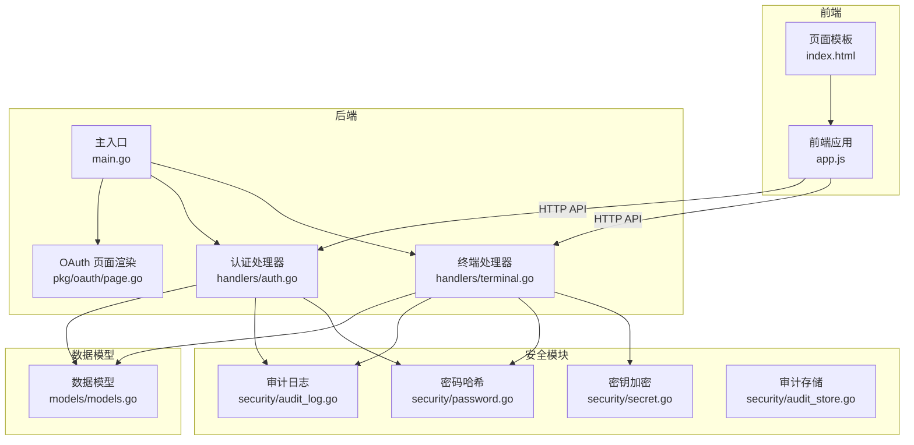
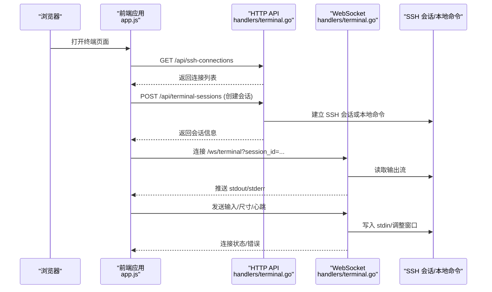
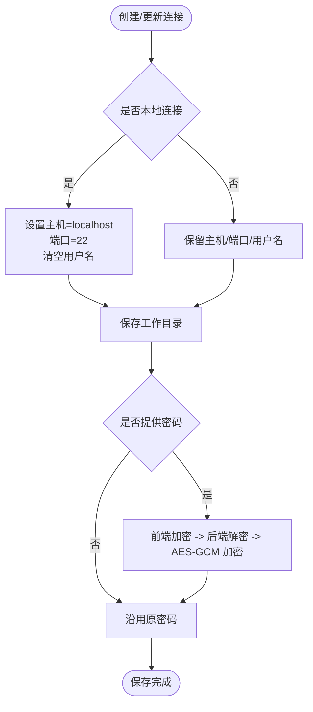
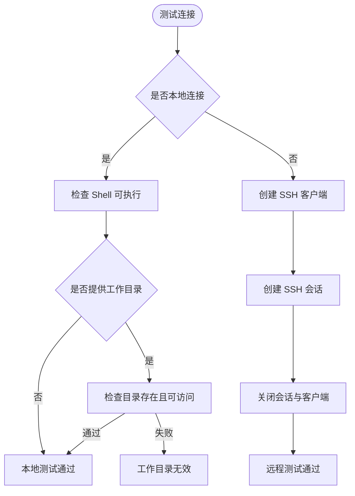
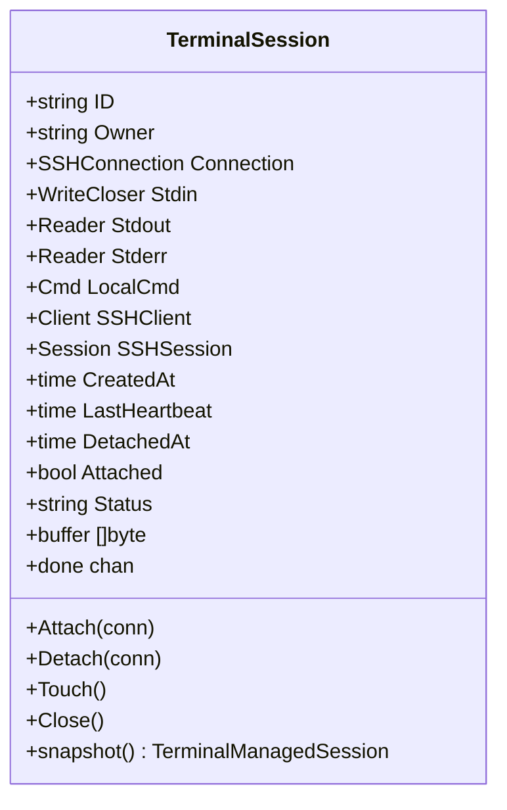
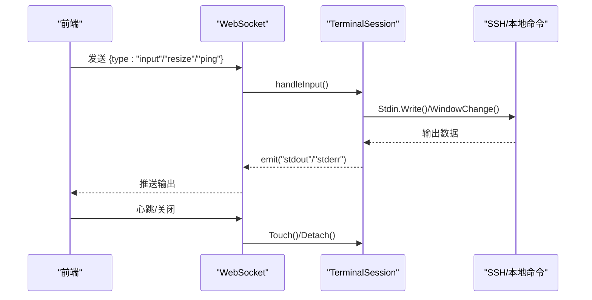
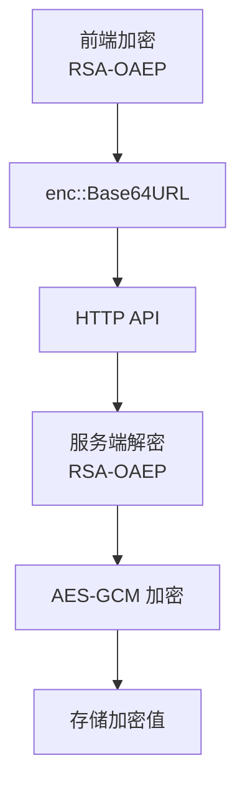
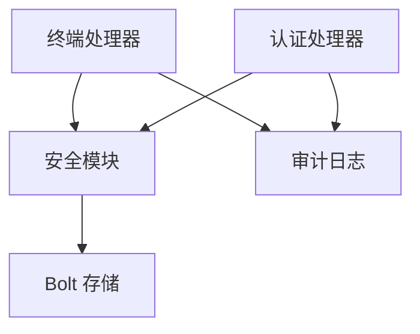

# SSH 终端管理

<cite>
**本文档引用的文件**
- [src/handlers/terminal.go](file://src/handlers/terminal.go)
- [src/static/app.js](file://src/static/app.js)
- [src/main.go](file://src/main.go)
- [src/models/models.go](file://src/models/models.go)
- [src/security/secret.go](file://src/security/secret.go)
- [src/security/password.go](file://src/security/password.go)
- [src/security/audit_log.go](file://src/security/audit_log.go)
- [src/security/audit_store.go](file://src/security/audit_store.go)
- [src/pkg/oauth/page.go](file://src/pkg/oauth/page.go)
- [src/handlers/auth.go](file://src/handlers/auth.go)
- [src/static/index.html](file://src/static/index.html)
</cite>

## 目录
1. [简介](#简介)
2. [项目结构](#项目结构)
3. [核心组件](#核心组件)
4. [架构总览](#架构总览)
5. [详细组件分析](#详细组件分析)
6. [依赖关系分析](#依赖关系分析)
7. [性能考虑](#性能考虑)
8. [故障排除指南](#故障排除指南)
9. [结论](#结论)
10. [附录](#附录)

## 简介
本文件面向 Caddy Panel 的 SSH 终端管理系统，系统支持本地终端与远程 SSH 连接两种模式，提供完整的会话生命周期管理、WebSocket 实时通信、连接测试、工作目录保存、密码安全处理以及 OAuth 集成。本文档从架构设计、组件实现、数据流、安全机制、性能特性等维度进行全面阐述，并提供使用示例、故障排除与安全最佳实践。

## 项目结构
项目采用 Go 语言后端与前端 JavaScript 协同的架构，核心模块包括：
- 后端处理器：负责 SSH 连接配置、会话管理、WebSocket 终端、安全审计与认证
- 前端应用：提供 SSH 连接配置界面、连接测试、终端会话交互与状态展示
- 安全模块：负责密码哈希、密钥加密、OAuth 公钥/私钥、审计日志持久化
- 数据模型：定义 SSH 连接、终端会话、安全日志等数据结构

**图示来源**
- [src/main.go:112-431](file://src/main.go#L112-L431)
- [src/handlers/terminal.go:1-858](file://src/handlers/terminal.go#L1-L858)
- [src/handlers/auth.go:1-266](file://src/handlers/auth.go#L1-L266)
- [src/pkg/oauth/page.go:1-197](file://src/pkg/oauth/page.go#L1-L197)
- [src/security/secret.go:1-82](file://src/security/secret.go#L1-L82)
- [src/security/password.go:1-71](file://src/security/password.go#L1-L71)
- [src/security/audit_log.go:1-224](file://src/security/audit_log.go#L1-L224)
- [src/security/audit_store.go:1-222](file://src/security/audit_store.go#L1-L222)
- [src/models/models.go:269-297](file://src/models/models.go#L269-L297)

**章节来源**
- [src/main.go:112-431](file://src/main.go#L112-L431)

## 核心组件
- SSH 连接配置管理：支持创建、更新、查询、删除 SSH 连接，包含本地与远程两种模式，支持工作目录保存
- 连接测试：对本地连接检查 Shell 可用性与工作目录有效性，对远程连接进行连通性与认证验证
- 会话管理：创建托管会话、心跳刷新、会话清理、并发连接处理
- WebSocket 终端：建立 WebSocket 连接，实现实时双向通信、窗口尺寸变更、输入输出处理
- 密码安全：前端加密与后端存储加密，兼容历史明文以保证平滑升级
- OAuth 集成：登录页面与凭据加密传输，统一认证体系
- 审计日志：记录 SSH 连接、断开、系统操作等安全事件

**章节来源**
- [src/handlers/terminal.go:69-236](file://src/handlers/terminal.go#L69-L236)
- [src/handlers/terminal.go:238-275](file://src/handlers/terminal.go#L238-L275)
- [src/handlers/terminal.go:277-377](file://src/handlers/terminal.go#L277-L377)
- [src/handlers/terminal.go:379-510](file://src/handlers/terminal.go#L379-L510)
- [src/handlers/terminal.go:512-612](file://src/handlers/terminal.go#L512-L612)
- [src/security/secret.go:16-81](file://src/security/secret.go#L16-L81)
- [src/security/password.go:44-70](file://src/security/password.go#L44-L70)
- [src/handlers/auth.go:124-198](file://src/handlers/auth.go#L124-L198)
- [src/security/audit_log.go:115-147](file://src/security/audit_log.go#L115-L147)

## 架构总览
系统通过 HTTP API 提供 SSH 连接配置与会话管理，WebSocket 提供实时终端通信。安全模块贯穿密码处理与审计日志，OAuth 提供统一认证入口。

**图示来源**
- [src/handlers/terminal.go:353-377](file://src/handlers/terminal.go#L353-L377)
- [src/handlers/terminal.go:512-580](file://src/handlers/terminal.go#L512-L580)
- [src/static/app.js:2993-3048](file://src/static/app.js#L2993-L3048)

## 详细组件分析

### SSH 连接配置管理
- 支持本地与远程两种模式：本地模式自动填充主机为 localhost，远程模式需提供主机、端口、用户名与密码
- 工作目录保存：支持保存并应用工作目录，远程连接在会话建立后执行 cd 切换
- 密码处理：前端使用公钥加密凭据，后端解密后进行 AES-GCM 加密存储，兼容历史明文

**图示来源**
- [src/handlers/terminal.go:78-130](file://src/handlers/terminal.go#L78-L130)
- [src/handlers/terminal.go:132-203](file://src/handlers/terminal.go#L132-L203)
- [src/handlers/terminal.go:446-510](file://src/handlers/terminal.go#L446-L510)
- [src/security/secret.go:16-81](file://src/security/secret.go#L16-L81)

**章节来源**
- [src/handlers/terminal.go:69-236](file://src/handlers/terminal.go#L69-L236)
- [src/handlers/terminal.go:446-510](file://src/handlers/terminal.go#L446-L510)
- [src/security/secret.go:16-81](file://src/security/secret.go#L16-L81)

### 连接测试功能
- 本地连接测试：检查系统 Shell 可用性与工作目录存在性
- 远程连接测试：建立 SSH 客户端连接与会话，验证认证与连通性，随后关闭会话与客户端

**图示来源**
- [src/handlers/terminal.go:238-275](file://src/handlers/terminal.go#L238-L275)
- [src/handlers/terminal.go:446-510](file://src/handlers/terminal.go#L446-L510)

**章节来源**
- [src/handlers/terminal.go:238-275](file://src/handlers/terminal.go#L238-L275)

### 会话管理机制
- 会话创建：根据连接类型创建本地命令或 SSH 会话，启动输出读取协程
- 心跳与清理：定时清理长时间未活跃的会话，支持附加/分离状态跟踪
- 并发与线程安全：使用互斥锁保护会话状态，通道用于关闭信号

**图示来源**
- [src/handlers/terminal.go:39-61](file://src/handlers/terminal.go#L39-L61)
- [src/handlers/terminal.go:614-663](file://src/handlers/terminal.go#L614-L663)
- [src/handlers/terminal.go:688-698](file://src/handlers/terminal.go#L688-L698)

**章节来源**
- [src/handlers/terminal.go:277-377](file://src/handlers/terminal.go#L277-L377)
- [src/handlers/terminal.go:379-444](file://src/handlers/terminal.go#L379-L444)
- [src/handlers/terminal.go:738-759](file://src/handlers/terminal.go#L738-L759)

### WebSocket 终端实现
- 输入处理：接收前端输入，写入 SSH/本地命令标准输入
- 输出处理：读取标准输出与错误输出，缓冲并推送至前端
- 窗口调整：根据前端尺寸调整远端伪终端大小
- 心跳与断开：定期发送 ping，断开时清理连接并关闭会话

**图示来源**
- [src/handlers/terminal.go:512-580](file://src/handlers/terminal.go#L512-L580)
- [src/handlers/terminal.go:593-612](file://src/handlers/terminal.go#L593-L612)
- [src/handlers/terminal.go:779-796](file://src/handlers/terminal.go#L779-L796)
- [src/static/app.js:2993-3048](file://src/static/app.js#L2993-L3048)

**章节来源**
- [src/handlers/terminal.go:353-377](file://src/handlers/terminal.go#L353-L377)
- [src/handlers/terminal.go:512-580](file://src/handlers/terminal.go#L512-L580)
- [src/handlers/terminal.go:779-796](file://src/handlers/terminal.go#L779-L796)
- [src/static/app.js:2993-3048](file://src/static/app.js#L2993-L3048)

### 工作目录保存功能
- 前端：在连接配置表单中输入工作目录，保存时写入连接对象
- 后端：在创建/更新连接时保存 work_dir 字段
- 远程连接：会话建立后通过 shell 命令切换工作目录

**章节来源**
- [src/handlers/terminal.go:167-169](file://src/handlers/terminal.go#L167-L169)
- [src/handlers/terminal.go:505-507](file://src/handlers/terminal.go#L505-L507)

### SSH 密码安全处理
- 前端加密：登录页面使用浏览器 Web Crypto 或备用库对凭据进行 RSA-OAEP 加密
- 后端解密：服务端使用私钥解密，再进行 AES-GCM 加密存储
- 兼容性：支持历史明文密码，避免升级导致连接失效

**图示来源**
- [src/pkg/oauth/page.go:16-197](file://src/pkg/oauth/page.go#L16-L197)
- [src/handlers/auth.go:212-242](file://src/handlers/auth.go#L212-L242)
- [src/security/secret.go:16-81](file://src/security/secret.go#L16-L81)
- [src/security/password.go:44-70](file://src/security/password.go#L44-L70)

**章节来源**
- [src/pkg/oauth/page.go:16-197](file://src/pkg/oauth/page.go#L16-L197)
- [src/handlers/auth.go:212-242](file://src/handlers/auth.go#L212-L242)
- [src/security/secret.go:16-81](file://src/security/secret.go#L16-L81)
- [src/security/password.go:44-70](file://src/security/password.go#L44-L70)

### OAuth 集成对 SSH 访问的影响
- 登录流程：统一认证入口，登录成功后颁发 JWT，后续 API 请求携带 Authorization 头
- 终端访问：前端通过认证中间件访问 SSH 相关 API，后端基于用户上下文限制会话归属
- 安全审计：记录 OAuth 登录、SSH 连接、断开等关键事件

**章节来源**
- [src/handlers/auth.go:124-198](file://src/handlers/auth.go#L124-L198)
- [src/security/audit_log.go:82-147](file://src/security/audit_log.go#L82-L147)
- [src/main.go:114-131](file://src/main.go#L114-L131)

## 依赖关系分析
- 组件耦合：终端处理器依赖安全模块与审计日志；认证处理器依赖安全模块与审计日志
- 外部依赖：WebSocket 库、SSH 客户端库、Bolt 存储（审计日志）

**图示来源**
- [src/handlers/terminal.go:1-24](file://src/handlers/terminal.go#L1-L24)
- [src/handlers/auth.go:1-20](file://src/handlers/auth.go#L1-L20)
- [src/security/audit_store.go:12-45](file://src/security/audit_store.go#L12-L45)

**章节来源**
- [src/handlers/terminal.go:1-24](file://src/handlers/terminal.go#L1-L24)
- [src/handlers/auth.go:1-20](file://src/handlers/auth.go#L1-L20)
- [src/security/audit_store.go:12-45](file://src/security/audit_store.go#L12-L45)

## 性能考虑
- 会话清理：定时器按分钟扫描并清理过期会话，避免内存泄漏
- 输出缓冲：限制终端输出缓冲上限，防止内存膨胀
- 连接池：远程连接复用 SSH 客户端与会话，减少频繁建立/销毁成本
- 前端渲染：终端输出采用增量写入，避免大规模 DOM 操作

[本节为通用指导，无需特定文件引用]

## 故障排除指南
- 连接测试失败
  - 本地：检查 Shell 是否安装、工作目录是否存在
  - 远程：检查网络连通性、SSH 服务状态、凭据正确性
- 终端无输出
  - 检查 WebSocket 连接状态、心跳是否正常、窗口尺寸是否合理
- 密码无法保存
  - 确认前端加密公钥可用、后端私钥配置正确、历史明文兼容逻辑生效
- 审计日志缺失
  - 检查审计存储初始化、最大条目限制、日志轮转策略

**章节来源**
- [src/handlers/terminal.go:238-275](file://src/handlers/terminal.go#L238-L275)
- [src/handlers/terminal.go:512-580](file://src/handlers/terminal.go#L512-L580)
- [src/security/audit_store.go:26-45](file://src/security/audit_store.go#L26-L45)

## 结论
Caddy Panel 的 SSH 终端管理系统通过清晰的模块划分与完善的安全机制，实现了本地与远程终端的统一管理。前后端协作的 WebSocket 实时通信提供了流畅的用户体验，而严格的安全审计与密码处理确保了系统的安全性与可维护性。结合 OAuth 统一认证，系统能够满足企业级运维场景的需求。

[本节为总结性内容，无需特定文件引用]

## 附录

### 使用示例
- 新增 SSH 连接
  - 选择连接方式（本地/远程），填写必要字段，保存后可在终端页面打开
- 测试连接
  - 在连接卡片上点击“测试连接”，查看测试结果
- 打开终端会话
  - 点击连接卡片打开会话，进入全屏终端交互界面
- 工作目录
  - 在连接配置中设置工作目录，远程连接会自动切换

**章节来源**
- [src/static/app.js:2453-2490](file://src/static/app.js#L2453-L2490)
- [src/static/app.js:2772-2788](file://src/static/app.js#L2772-L2788)
- [src/static/app.js:2790-2811](file://src/static/app.js#L2790-L2811)

### 安全最佳实践
- 使用强密码与最小权限原则
- 定期轮换 SSH 密码与服务端密钥
- 启用审计日志并监控异常行为
- 限制会话保留时间，及时清理过期会话
- 使用 HTTPS 与 OAuth 保障传输与认证安全

[本节为通用指导，无需特定文件引用]