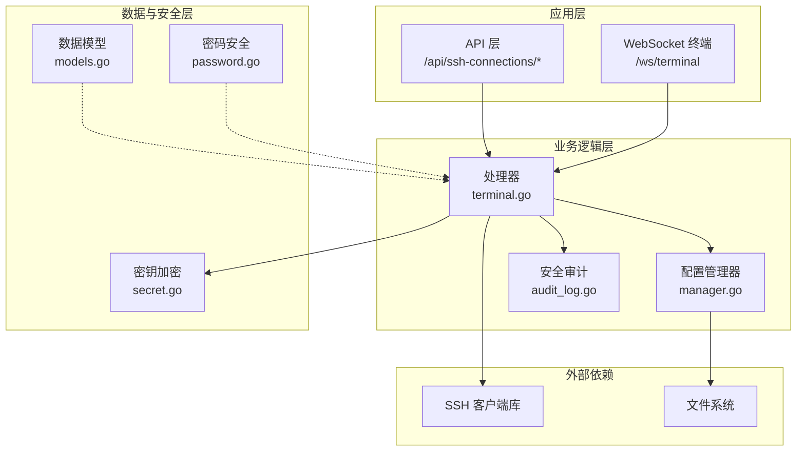
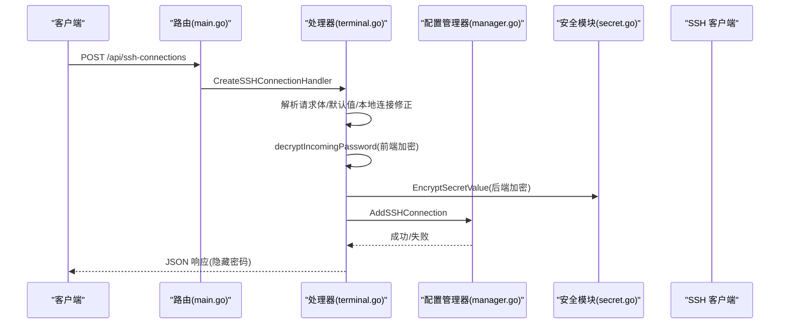
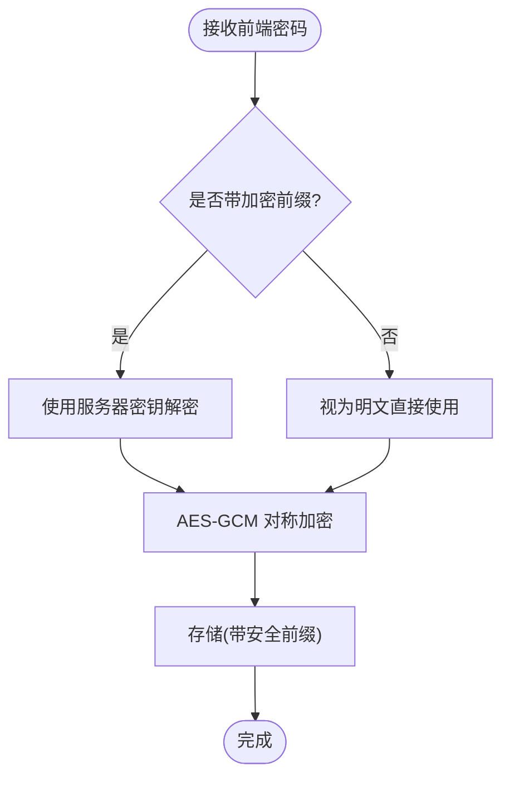
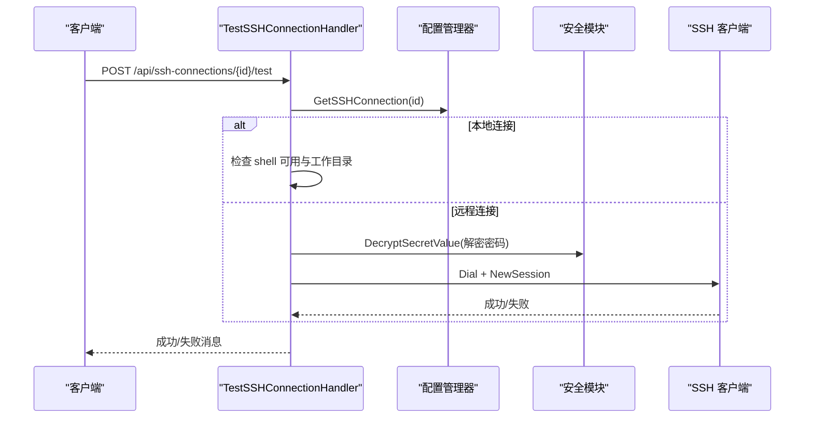
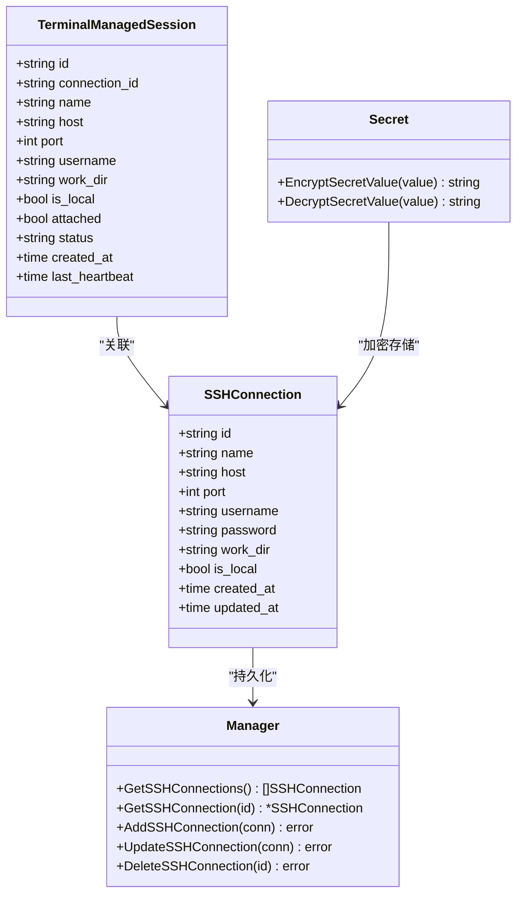

# SSH 连接配置管理

<cite>
**本文档引用的文件**
- [models.go](file://src/models/models.go)
- [terminal.go](file://src/handlers/terminal.go)
- [api.go](file://src/handlers/api.go)
- [manager.go](file://src/config/manager.go)
- [password.go](file://src/security/password.go)
- [secret.go](file://src/security/secret.go)
- [audit_log.go](file://src/security/audit_log.go)
- [main.go](file://src/main.go)
</cite>

## 目录
1. [简介](#简介)
2. [项目结构](#项目结构)
3. [核心组件](#核心组件)
4. [架构总览](#架构总览)
5. [详细组件分析](#详细组件分析)
6. [依赖关系分析](#依赖关系分析)
7. [性能考虑](#性能考虑)
8. [故障排除指南](#故障排除指南)
9. [结论](#结论)
10. [附录](#附录)

## 简介
本文件面向 SSH 连接配置管理功能，系统化阐述数据模型、接口设计、安全机制与实现细节，并提供连接测试、最佳实践与排障建议。该功能支持本地与远程 SSH 连接的统一管理，包含连接配置的增删改查、连接测试、安全存储与审计日志记录。

## 项目结构
围绕 SSH 连接配置管理的关键模块如下：
- 数据模型：定义 SSH 连接配置、终端托管会话等结构体
- 配置管理：负责持久化存储与内存缓存
- 安全模块：密码哈希、敏感值加解密
- API 层：暴露 REST 接口，处理请求与响应
- 终端会话：基于 WebSocket 的交互式终端
- 主入口：注册路由与中间件

图表来源
- [main.go:310-341](file://src/main.go#L310-L341)
- [terminal.go:69-275](file://src/handlers/terminal.go#L69-L275)
- [manager.go:583-637](file://src/config/manager.go#L583-L637)
- [models.go:269-297](file://src/models/models.go#L269-L297)
- [secret.go:16-81](file://src/security/secret.go#L16-L81)

章节来源
- [main.go:310-341](file://src/main.go#L310-L341)
- [terminal.go:69-275](file://src/handlers/terminal.go#L69-L275)
- [manager.go:583-637](file://src/config/manager.go#L583-L637)
- [models.go:269-297](file://src/models/models.go#L269-L297)
- [secret.go:16-81](file://src/security/secret.go#L16-L81)

## 核心组件
- SSH 连接配置模型：包含连接标识、名称、主机地址、端口、用户名、密码、是否本地连接、工作目录、创建/更新时间等字段
- 终端托管会话模型：用于记录会话状态、连接信息、附加状态与心跳
- 配置管理器：提供 SSH 连接的增删改查与持久化能力
- 安全模块：提供安全密钥管理、AES-GCM 对称加密、HMAC 密码哈希
- API 处理器：实现 SSH 连接的 CRUD 与测试接口，处理前端加密传输与后端安全存储
- 审计日志：记录 SSH 连接与系统操作事件

章节来源
- [models.go:269-297](file://src/models/models.go#L269-L297)
- [manager.go:583-637](file://src/config/manager.go#L583-L637)
- [password.go:44-70](file://src/security/password.go#L44-L70)
- [secret.go:16-81](file://src/security/secret.go#L16-L81)
- [audit_log.go:115-147](file://src/security/audit_log.go#L115-L147)

## 架构总览
SSH 连接配置管理采用“路由 -> 处理器 -> 配置管理器 -> 存储”的分层架构。处理器负责：
- 解析请求体与路径参数
- 执行业务规则（如本地连接自动修正、默认名称生成）
- 处理前端加密密码的解密与后端安全存储
- 触发连接测试（本地终端可用性与远程 SSH 连通性）
- 记录安全审计日志

图表来源
- [main.go:310-319](file://src/main.go#L310-L319)
- [terminal.go:79-130](file://src/handlers/terminal.go#L79-L130)
- [manager.go:602-610](file://src/config/manager.go#L602-L610)
- [secret.go:16-40](file://src/security/secret.go#L16-L40)

## 详细组件分析

### 数据模型与字段说明
- SSHConnection 字段
  - id: 连接唯一标识
  - name: 连接名称（可自动生成）
  - host: 远程主机地址；本地连接时强制为 localhost
  - port: 端口，默认 22
  - username: 用户名；本地连接时清空
  - password: 密码（后端以安全前缀存储）
  - work_dir: 默认工作目录；本地连接时生效
  - is_local: 是否本地连接
  - created_at/updated_at: 创建与更新时间

- TerminalManagedSession 字段
  - 用于记录托管会话状态，包含连接信息、附加状态、心跳与创建时间等

章节来源
- [models.go:269-281](file://src/models/models.go#L269-L281)
- [models.go:283-297](file://src/models/models.go#L283-L297)

### 本地连接与远程 SSH 连接的区别与配置
- 本地连接（is_local=true）
  - host 强制为 localhost
  - port 默认 22
  - username 清空（由系统 shell 决定）
  - 支持设置默认工作目录 work_dir
- 远程 SSH 连接
  - 必须提供 host、port、username、password
  - 通过 SSH 客户端库建立连接

章节来源
- [terminal.go:89-104](file://src/handlers/terminal.go#L89-L104)
- [terminal.go:151-157](file://src/handlers/terminal.go#L151-L157)

### SSH 密码安全处理机制
- 前端加密传输
  - 前端提交的密码以特定前缀标识，后端使用服务器内部密钥进行解密
- 后端存储加密
  - 使用 AES-GCM 对称加密，密钥来自安全密钥派生
  - 存储时带安全前缀，兼容历史明文以避免现有连接失效
- 密码比较与哈希
  - 用户密码使用 HMAC-SHA256 哈希存储，SSH 密码使用对称加密存储

图表来源
- [api.go:52-62](file://src/handlers/api.go#L52-L62)
- [secret.go:16-40](file://src/security/secret.go#L16-L40)
- [secret.go:42-81](file://src/security/secret.go#L42-L81)

章节来源
- [api.go:52-62](file://src/handlers/api.go#L52-L62)
- [secret.go:16-81](file://src/security/secret.go#L16-L81)
- [password.go:44-70](file://src/security/password.go#L44-L70)

### 连接测试功能实现
- 本地连接测试
  - 检查系统 shell 可用性
  - 校验默认工作目录是否存在且为目录
- 远程 SSH 连接测试
  - 建立 SSH 客户端连接并创建会话，随后关闭以验证连通性

图表来源
- [terminal.go:238-275](file://src/handlers/terminal.go#L238-L275)
- [secret.go:42-81](file://src/security/secret.go#L42-L81)

章节来源
- [terminal.go:238-275](file://src/handlers/terminal.go#L238-L275)
- [secret.go:42-81](file://src/security/secret.go#L42-L81)

### API 接口说明

- 获取连接列表
  - 方法: GET
  - 路径: /api/ssh-connections
  - 响应: 包含多个 SSH 连接对象，密码字段为空
- 创建连接
  - 方法: POST
  - 路径: /api/ssh-connections
  - 请求体: SSHConnection（可省略 id、created_at、updated_at）
  - 行为: 自动生成 id，本地连接自动修正 host/port/name，密码解密后加密存储
  - 响应: 新建连接对象（密码为空）
- 获取单个连接
  - 方法: GET
  - 路径: /api/ssh-connections/{id}
  - 响应: 连接对象（密码为空）
- 更新连接
  - 方法: PUT
  - 路径: /api/ssh-connections/{id}
  - 请求体: SSHConnection（部分字段可选）
  - 行为: 本地连接时清空 username 并修正 host/port；密码解密后加密存储
  - 响应: 更新后的连接对象（密码为空）
- 删除连接
  - 方法: DELETE
  - 路径: /api/ssh-connections/{id}
  - 响应: 空
- 连接测试
  - 方法: POST
  - 路径: /api/ssh-connections/{id}/test
  - 响应: 成功/失败消息

章节来源
- [main.go:310-341](file://src/main.go#L310-L341)
- [terminal.go:69-275](file://src/handlers/terminal.go#L69-L275)

### 审计日志与安全
- SSH 连接日志
  - 成功/失败均记录，包含用户名、来源 IP、连接名称、消息与成功标记
- 系统操作日志
  - 新增/修改/删除 SSH 连接均记录系统操作日志
- 安全日志查询与统计
  - 提供查询与统计接口，便于运维审计

章节来源
- [audit_log.go:115-147](file://src/security/audit_log.go#L115-L147)
- [terminal.go:124-127](file://src/handlers/terminal.go#L124-L127)
- [terminal.go:197-200](file://src/handlers/terminal.go#L197-L200)
- [terminal.go:214-221](file://src/handlers/terminal.go#L214-L221)

## 依赖关系分析

图表来源
- [models.go:269-297](file://src/models/models.go#L269-L297)
- [manager.go:583-637](file://src/config/manager.go#L583-L637)
- [secret.go:16-81](file://src/security/secret.go#L16-L81)

章节来源
- [models.go:269-297](file://src/models/models.go#L269-L297)
- [manager.go:583-637](file://src/config/manager.go#L583-L637)
- [secret.go:16-81](file://src/security/secret.go#L16-L81)

## 性能考虑
- 连接测试
  - 本地测试仅做 shell 可用性与目录检查，开销极低
  - 远程测试建立 SSH 会话后立即关闭，避免资源泄漏
- 会话清理
  - 终端会话维护定时清理器，根据附加/分离状态设定 TTL，防止僵尸会话
- 密码处理
  - 解密与加密发生在内存中，避免频繁 IO；AES-GCM 适合高吞吐场景

[本节为通用指导，无需具体文件分析]

## 故障排除指南
- “SSH 密码解密失败”
  - 检查前端是否正确使用加密前缀；确认服务器安全密钥一致
- “本机终端不可用”
  - 检查系统 shell 路径与权限；确保 shell 在 PATH 中可执行
- “默认工作目录不存在或不可访问”
  - 确认目录存在且具备读写权限
- “SSH 连接失败”
  - 校验主机、端口、用户名与密码；确认远端 SSH 服务可用
- “删除连接后无法登录”
  - 若删除了唯一启用用户，系统会阻止删除；请先启用其他用户

章节来源
- [terminal.go:105-117](file://src/handlers/terminal.go#L105-L117)
- [terminal.go:247-259](file://src/handlers/terminal.go#L247-L259)
- [terminal.go:263-274](file://src/handlers/terminal.go#L263-L274)

## 结论
该 SSH 连接配置管理功能以清晰的数据模型、严格的前后端安全机制与完善的审计日志为基础，实现了本地与远程 SSH 连接的统一管理。通过连接测试与会话清理机制，保障了可用性与稳定性。建议在生产环境中：
- 使用强安全密钥并定期轮换
- 限制管理员端口访问范围
- 定期审查安全日志
- 为远程连接配置最小权限账户

[本节为总结性内容，无需具体文件分析]

## 附录

### 配置示例与最佳实践
- 本地连接示例
  - is_local: true
  - host: 由系统自动修正为 localhost
  - port: 22
  - work_dir: 可选，默认工作目录
- 远程连接示例
  - is_local: false
  - host: 远程主机地址
  - port: 22
  - username: 远程用户名
  - password: 前端加密后提交
- 最佳实践
  - 优先使用非 root 用户与受限权限
  - 定期轮换密码并启用连接测试
  - 本地连接尽量使用系统默认 shell
  - 远程连接建议使用密钥认证（若扩展支持）

[本节为概念性内容，无需具体文件分析]