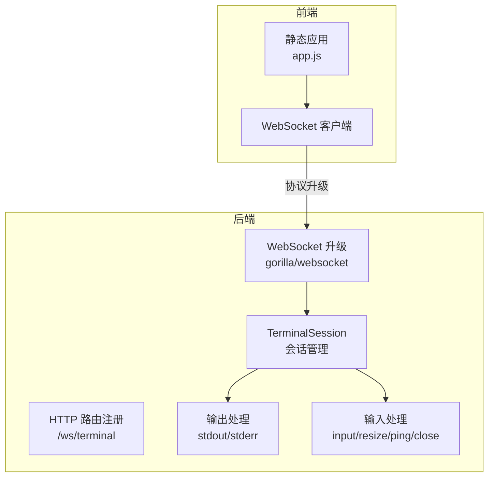
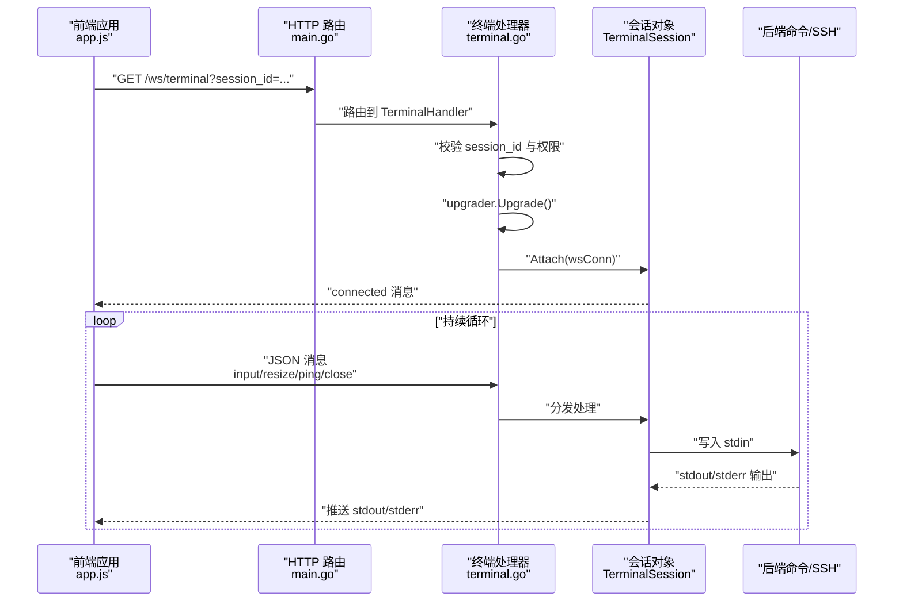
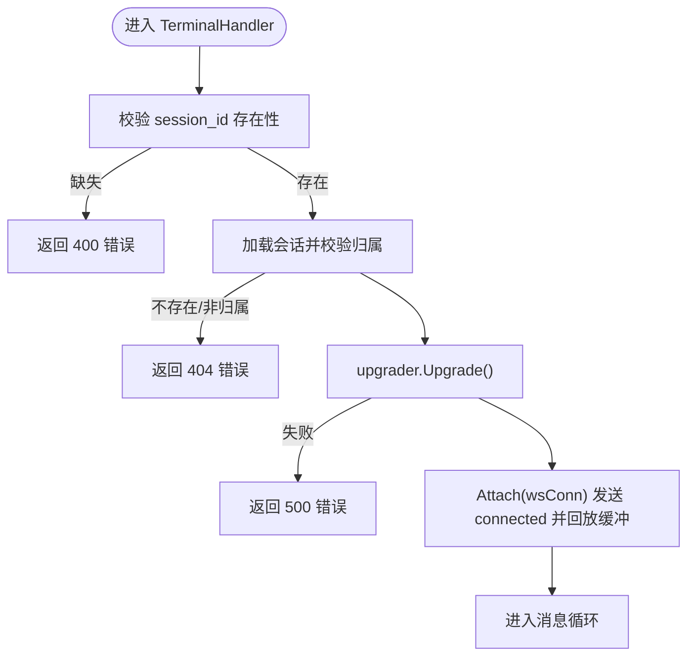
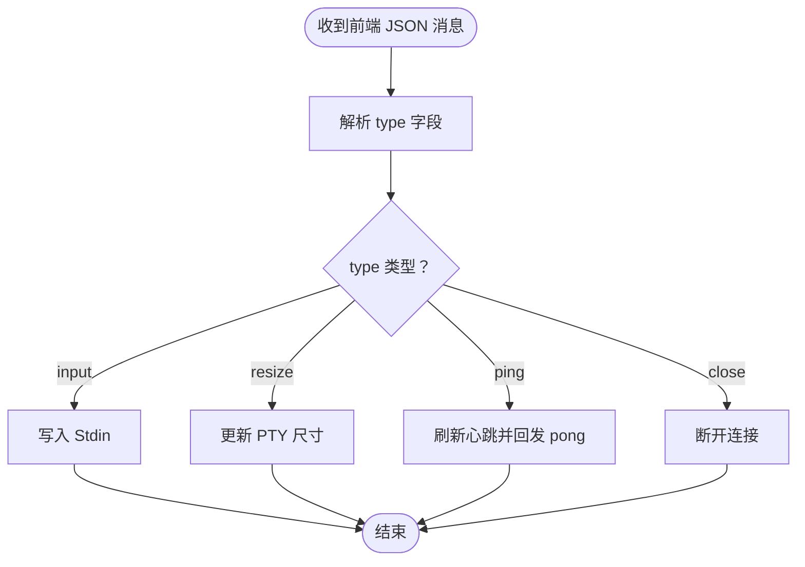
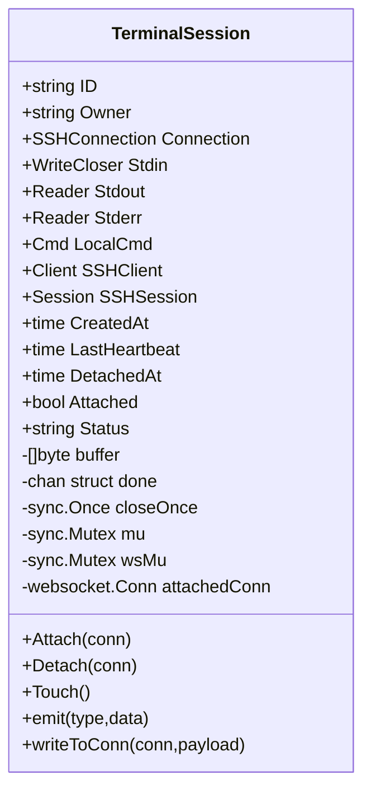
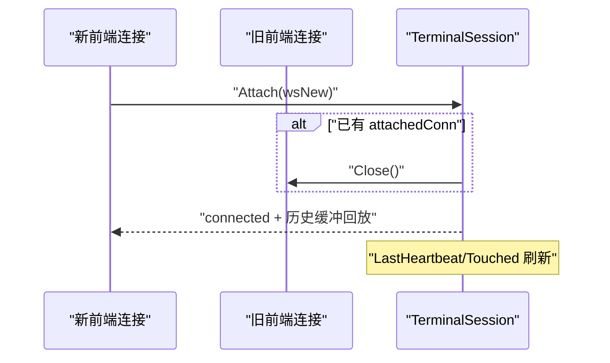
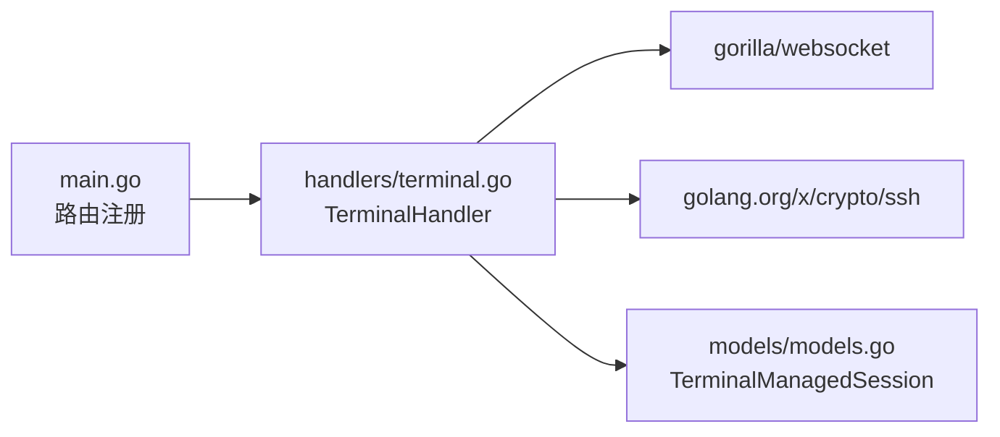

# WebSocket 终端通信

<cite>
**本文引用的文件**
- [src/handlers/terminal.go](file://src/handlers/terminal.go)
- [src/main.go](file://src/main.go)
- [src/models/models.go](file://src/models/models.go)
- [src/static/app.js](file://src/static/app.js)
</cite>

## 目录
1. [简介](#简介)
2. [项目结构](#项目结构)
3. [核心组件](#核心组件)
4. [架构总览](#架构总览)
5. [详细组件分析](#详细组件分析)
6. [依赖分析](#依赖分析)
7. [性能考虑](#性能考虑)
8. [故障排查指南](#故障排查指南)
9. [结论](#结论)

## 简介
本文件针对 WebSocket 终端通信功能进行系统化技术文档说明，覆盖协议升级与连接建立、跨域处理与连接验证、消息类型与格式、输入输出处理机制、会话附加与分离、消息格式规范、错误处理策略与连接异常恢复机制，以及性能优化建议（缓冲区限制、心跳检测、连接池管理）。文档同时提供可视化图示帮助理解端到端流程。

## 项目结构
终端相关的核心实现集中在后端处理器与前端交互脚本中：
- 后端：HTTP 路由注册、WebSocket 升级、会话生命周期管理、消息分发与缓冲、心跳与清理
- 前端：WebSocket 客户端、消息收发、心跳定时器、窗口尺寸变化通知

图表来源
- [src/main.go:418-420](file://src/main.go#L418-L420)
- [src/handlers/terminal.go:354-377](file://src/handlers/terminal.go#L354-L377)
- [src/static/app.js:3001-3051](file://src/static/app.js#L3001-L3051)

章节来源
- [src/main.go:418-420](file://src/main.go#L418-L420)
- [src/handlers/terminal.go:354-377](file://src/handlers/terminal.go#L354-L377)
- [src/static/app.js:3001-3051](file://src/static/app.js#L3001-L3051)

## 核心组件
- WebSocket 升级与连接建立：通过 gorilla/websocket 将 HTTP 请求升级为 WebSocket，完成握手与连接。
- 终端会话管理：TerminalSession 封装会话状态、输入输出管道、SSH/本地命令、心跳时间戳、缓冲区与并发安全。
- 消息处理：前端发送 input、resize、ping、close；后端解析并执行相应动作，同时将 stdout/stderr 推送回前端。
- 会话附加/分离：同一会话只允许一个前端连接，新连接接入时会断开旧连接；支持心跳刷新与超时清理。
- 数据模型：TerminalManagedSession 提供会话快照，用于 API 返回与前端渲染。

章节来源
- [src/handlers/terminal.go:39-61](file://src/handlers/terminal.go#L39-L61)
- [src/handlers/terminal.go:26-31](file://src/handlers/terminal.go#L26-L31)
- [src/models/models.go:283-297](file://src/models/models.go#L283-L297)

## 架构总览
WebSocket 终端通信的端到端流程如下：

图表来源
- [src/main.go:418-420](file://src/main.go#L418-L420)
- [src/handlers/terminal.go:354-377](file://src/handlers/terminal.go#L354-L377)
- [src/handlers/terminal.go:512-552](file://src/handlers/terminal.go#L512-L552)
- [src/handlers/terminal.go:554-580](file://src/handlers/terminal.go#L554-L580)

## 详细组件分析

### WebSocket 协议升级与连接建立
- 升级入口：/ws/terminal 路由调用 TerminalHandler，从查询参数获取 session_id 并校验归属。
- 协议升级：使用 upgrader.Upgrade 完成 HTTP 到 WebSocket 的握手。
- 连接验证：会话必须存在且属于当前用户，否则返回错误。
- 连接建立：Attach 将前端连接与会话关联，发送 connected 消息并回放缓冲区历史输出。

图表来源
- [src/handlers/terminal.go:354-377](file://src/handlers/terminal.go#L354-L377)
- [src/handlers/terminal.go:614-644](file://src/handlers/terminal.go#L614-L644)

章节来源
- [src/main.go:418-420](file://src/main.go#L418-L420)
- [src/handlers/terminal.go:354-377](file://src/handlers/terminal.go#L354-L377)
- [src/handlers/terminal.go:614-644](file://src/handlers/terminal.go#L614-L644)

### 跨域处理与连接验证
- 跨域策略：upgrader.CheckOrigin 返回 true，允许任意来源的 WebSocket 握手。
- 连接验证：会话归属校验通过 getTerminalOwner 与会话 Owner 字段比对，确保多租户隔离。
- 安全审计：连接/断开/错误均记录安全日志，便于追踪。

章节来源
- [src/handlers/terminal.go:33-37](file://src/handlers/terminal.go#L33-L37)
- [src/handlers/terminal.go:769-777](file://src/handlers/terminal.go#L769-L777)

### 消息类型与格式
后端期望的前端消息格式为 JSON 对象，包含 type 字段与 data/cols/rows 等可选字段。后端根据 type 分派处理逻辑。

- input
  - 用途：用户输入字符流
  - 格式：{"type":"input","data":"字符串"}
  - 处理：写入会话 Stdin，触发 Touch 刷新心跳
- resize
  - 用途：终端窗口尺寸变化
  - 格式：{"type":"resize","cols":数值,"rows":数值}
  - 处理：调用 resizeTerminal 更新远端 PTY 尺寸
- ping
  - 用途：心跳保活
  - 格式：{"type":"ping"}
  - 处理：Touch 刷新心跳并回发 pong
- close
  - 用途：主动断开
  - 格式：{"type":"close"}
  - 处理：Detach 当前连接并返回

前端对应行为：
- 打开连接后每 20 秒发送一次 ping
- 窗口变化时发送 resize
- 输入事件时发送 input
- 关闭时发送 close

图表来源
- [src/handlers/terminal.go:512-552](file://src/handlers/terminal.go#L512-L552)
- [src/static/app.js:3001-3051](file://src/static/app.js#L3001-L3051)
- [src/static/app.js:3069-3081](file://src/static/app.js#L3069-L3081)

章节来源
- [src/handlers/terminal.go:512-552](file://src/handlers/terminal.go#L512-L552)
- [src/static/app.js:3001-3051](file://src/static/app.js#L3001-L3051)
- [src/static/app.js:3069-3081](file://src/static/app.js#L3069-L3081)

### 输入输出处理机制
- 输入转发：handleInput 循环读取前端 JSON，将 data 写入会话 Stdin，保证并发安全。
- 命令输出：handleOutput 从 stdout/stderr 读取字节流，追加到会话缓冲区并实时推送给前端。
- 缓冲区管理：stdout/stderr 输出被追加到会话 buffer，超过上限（256KB）时采用滑动窗口保留最新数据。
- 并发安全：会话内部使用互斥锁保护 buffer、连接与状态字段；写 WebSocket 使用 wsMu 互斥。

图表来源
- [src/handlers/terminal.go:39-61](file://src/handlers/terminal.go#L39-L61)
- [src/handlers/terminal.go:554-580](file://src/handlers/terminal.go#L554-L580)
- [src/handlers/terminal.go:582-612](file://src/handlers/terminal.go#L582-L612)

章节来源
- [src/handlers/terminal.go:554-580](file://src/handlers/terminal.go#L554-L580)
- [src/handlers/terminal.go:582-612](file://src/handlers/terminal.go#L582-L612)
- [src/handlers/terminal.go:26-31](file://src/handlers/terminal.go#L26-L31)

### 会话附加与分离机制
- 附加：Attach 将当前连接设为 attachedConn，标记 Attached=true，刷新 LastHeartbeat，并回放 buffer 中的历史输出。
- 分离：Detach 清空 attachedConn、Attached=false、记录 DetachedAt；若传入连接存在则主动关闭。
- 多连接处理：若同一会话已有连接，新连接接入会先关闭旧连接，确保同一会话只有一个前端活跃连接。
- 心跳与超时：Touch 刷新心跳；isStale 根据 Attached 状态分别使用 Attached TTL 与 Detached Retention 判断是否过期。

图表来源
- [src/handlers/terminal.go:614-644](file://src/handlers/terminal.go#L614-L644)
- [src/handlers/terminal.go:646-657](file://src/handlers/terminal.go#L646-L657)
- [src/handlers/terminal.go:688-698](file://src/handlers/terminal.go#L688-L698)

章节来源
- [src/handlers/terminal.go:614-644](file://src/handlers/terminal.go#L614-L644)
- [src/handlers/terminal.go:646-657](file://src/handlers/terminal.go#L646-L657)
- [src/handlers/terminal.go:688-698](file://src/handlers/terminal.go#L688-L698)

### 消息格式规范
- 通用字段
  - type：消息类型（input/resize/ping/close/stdout/stderr/connected/pong/error/disconnected）
  - data：字符串负载（input/resize 时可能无此字段）
- input
  - type: "input"
  - data: "字符串"
- resize
  - type: "resize"
  - cols: 数值
  - rows: 数值
- ping
  - type: "ping"
- close
  - type: "close"
- stdout/stderr
  - type: "stdout"/"stderr"
  - data: "字符串"
- connected
  - type: "connected"
  - session_id: "会话ID"
  - connection: "连接名称"
  - is_local: true/false
  - working_dir: "工作目录"
  - attached: true/false
  - status: "状态"
- pong
  - type: "pong"
- error
  - type: "error"
  - data: "错误信息"
- disconnected
  - type: "disconnected"

章节来源
- [src/handlers/terminal.go:629-643](file://src/handlers/terminal.go#L629-L643)
- [src/handlers/terminal.go:594-597](file://src/handlers/terminal.go#L594-L597)
- [src/static/app.js:3012-3031](file://src/static/app.js#L3012-L3031)

### 错误处理策略与连接异常恢复
- 升级失败：返回 500 错误并终止
- 会话不存在/非归属：返回 404/400 错误
- 读取消息失败：自动 Detach 并返回
- 写入 WebSocket 失败：自动 Detach 并返回
- 输出读取错误：emit error 并 Close 会话
- 心跳异常：前端每 20 秒发送 ping，后端回发 pong；超时由会话清理器判定
- 异常恢复：会话清理器定期扫描过期会话并关闭；前端断线后可重新发起连接

章节来源
- [src/handlers/terminal.go:369-373](file://src/handlers/terminal.go#L369-L373)
- [src/handlers/terminal.go:519-523](file://src/handlers/terminal.go#L519-L523)
- [src/handlers/terminal.go:601-612](file://src/handlers/terminal.go#L601-L612)
- [src/handlers/terminal.go:568-572](file://src/handlers/terminal.go#L568-L572)

## 依赖分析
- 路由与中间件：/ws/terminal 注册在 /api/ 之下，经由认证、CORS、防火墙等中间件保护。
- 第三方库：gorilla/websocket 用于 WebSocket 协议升级与消息收发；golang.org/x/crypto/ssh 用于 SSH 会话管理。
- 数据模型：TerminalManagedSession 用于会话快照与 API 返回。

图表来源
- [src/main.go:418-420](file://src/main.go#L418-L420)
- [src/handlers/terminal.go:354-377](file://src/handlers/terminal.go#L354-L377)
- [src/models/models.go:283-297](file://src/models/models.go#L283-L297)

章节来源
- [src/main.go:418-420](file://src/main.go#L418-L420)
- [src/handlers/terminal.go:354-377](file://src/handlers/terminal.go#L354-L377)
- [src/models/models.go:283-297](file://src/models/models.go#L283-L297)

## 性能考虑
- 缓冲区限制
  - stdout/stderr 缓冲上限：256KB，超过后滑动窗口保留最新数据，避免内存无限增长。
  - 建议：前端可按需清屏或分页展示，减少一次性渲染压力。
- 心跳检测
  - 前端每 20 秒发送 ping，后端回发 pong 并刷新 LastHeartbeat。
  - 会话清理器按 Attached/Detached TTL 清理过期会话，默认 Attached TTL 90 秒，Detached 保留 30 分钟。
- 连接池管理
  - 后端不维护 WebSocket 连接池；同一会话仅允许一个前端连接，新连接接入即断开旧连接。
  - 建议：前端断线重连时避免频繁创建新会话，复用 session_id。
- 并发与锁
  - 会话内部使用互斥锁保护 buffer、连接与状态；写 WebSocket 使用 wsMu 互斥，降低竞争风险。
- I/O 读取
  - 输出读取采用固定大小缓冲（2KB），避免阻塞；输入写入采用即时写入，保持低延迟。

章节来源
- [src/handlers/terminal.go:26-31](file://src/handlers/terminal.go#L26-L31)
- [src/handlers/terminal.go:554-580](file://src/handlers/terminal.go#L554-L580)
- [src/handlers/terminal.go:614-644](file://src/handlers/terminal.go#L614-L644)
- [src/handlers/terminal.go:688-698](file://src/handlers/terminal.go#L688-L698)

## 故障排查指南
- 握手失败
  - 现象：返回 500 错误
  - 排查：确认 upgrader 配置、网络连通性、路由是否正确挂载
- 会话不存在/非归属
  - 现象：返回 404/400 错误
  - 排查：确认 session_id 正确、用户身份与会话 Owner 匹配
- 连接断开
  - 现象：前端显示未连接，后端日志记录断开
  - 排查：检查前端 ping 是否持续、后端是否频繁 Detach、是否存在写入失败
- 输出卡顿
  - 现象：终端输出延迟或不连续
  - 排查：检查缓冲区是否过大、I/O 读取是否阻塞、前端渲染性能
- 心跳超时
  - 现象：会话被清理关闭
  - 排查：确认前端 ping 是否正常、后端 isStale 判定逻辑、TTL 配置

章节来源
- [src/handlers/terminal.go:369-373](file://src/handlers/terminal.go#L369-L373)
- [src/handlers/terminal.go:519-523](file://src/handlers/terminal.go#L519-L523)
- [src/handlers/terminal.go:688-698](file://src/handlers/terminal.go#L688-L698)

## 结论
本 WebSocket 终端通信方案通过 gorilla/websocket 实现协议升级与消息收发，结合 TerminalSession 的会话管理、缓冲区与并发控制，提供了稳定可靠的终端交互能力。前端通过心跳保活与窗口尺寸通知提升用户体验，后端通过清理器与超时策略保障资源回收。建议在生产环境中谨慎评估跨域策略与安全审计，合理配置心跳与缓冲参数以平衡性能与稳定性。