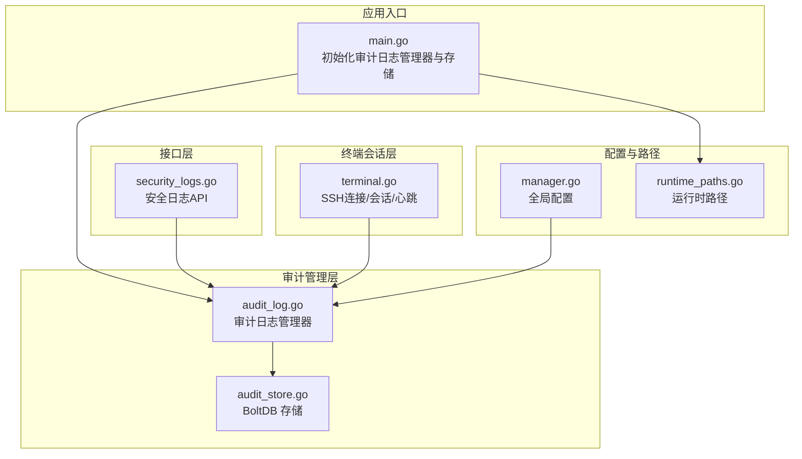
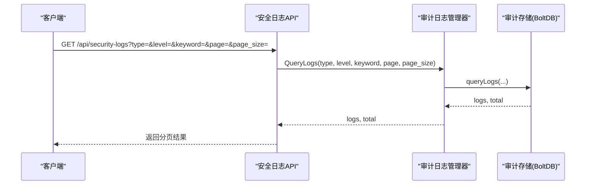
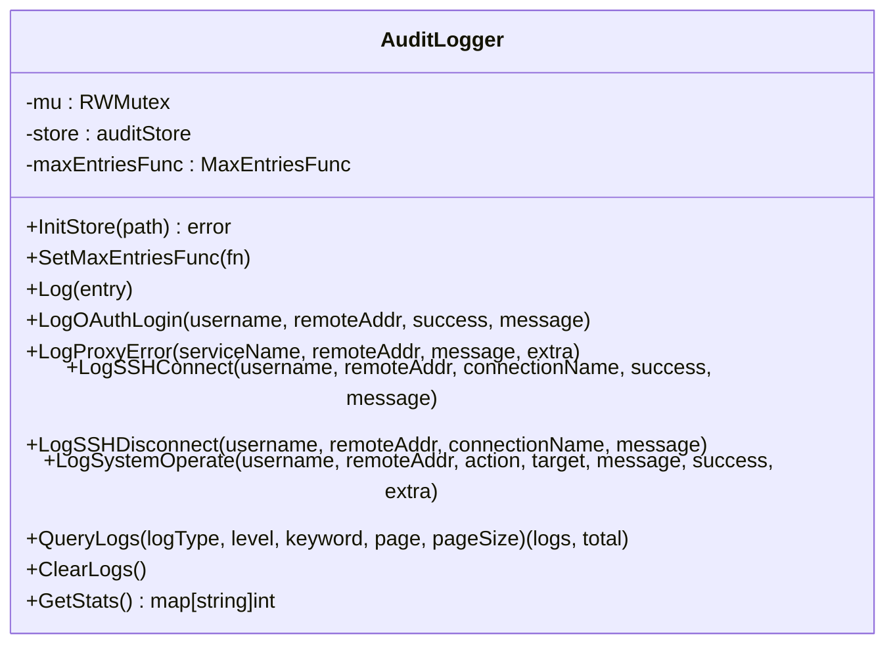
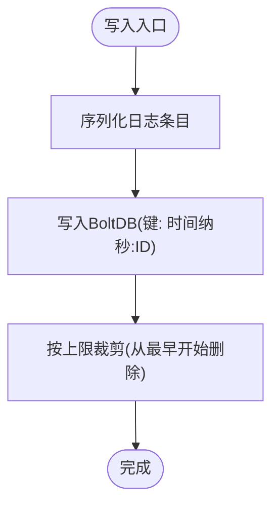
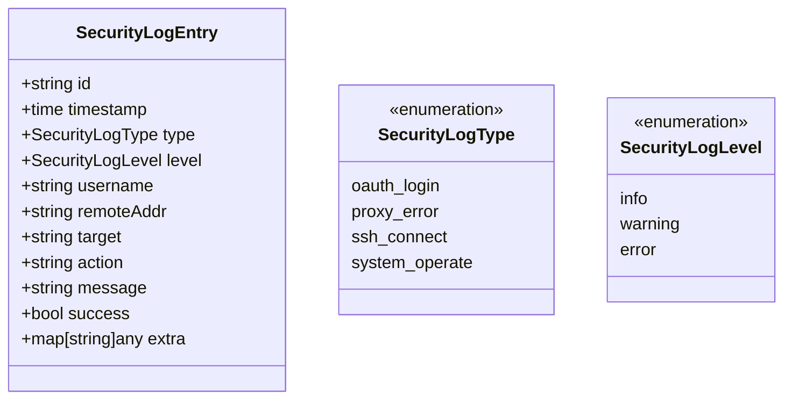
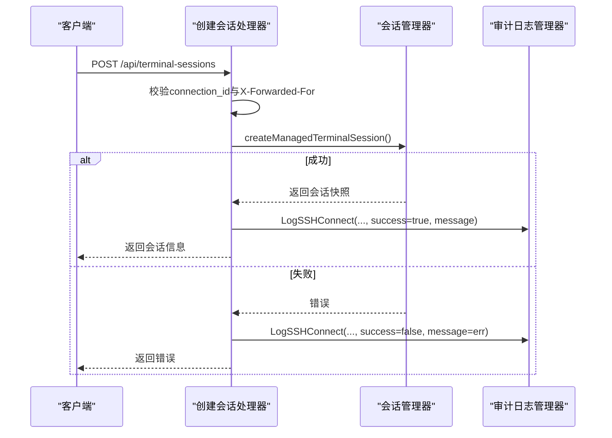
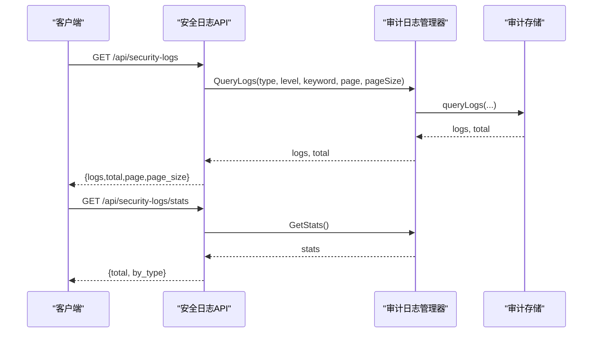
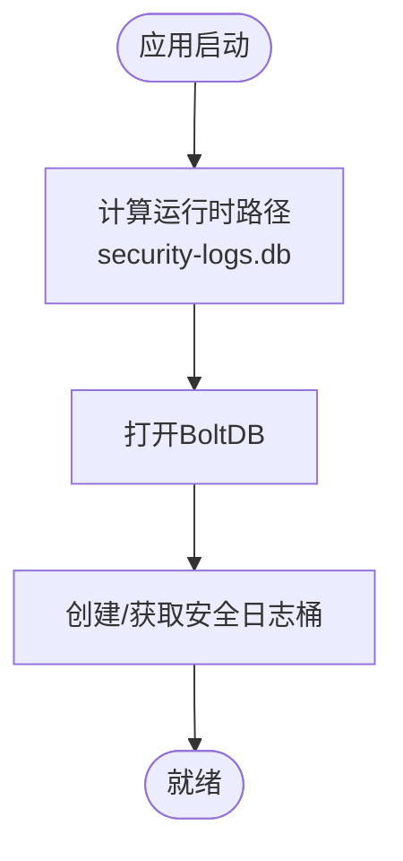
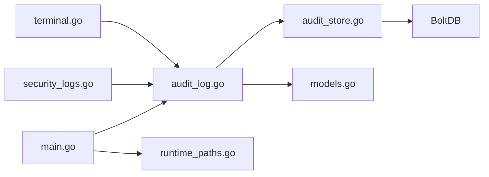

# 会话安全审计

<cite>
**本文档引用的文件**
- [audit_log.go](file://src/security/audit_log.go)
- [audit_store.go](file://src/security/audit_store.go)
- [security_logs.go](file://src/handlers/security_logs.go)
- [models.go](file://src/models/models.go)
- [terminal.go](file://src/handlers/terminal.go)
- [main.go](file://src/main.go)
- [manager.go](file://src/config/manager.go)
- [runtime_paths.go](file://src/config/runtime_paths.go)
</cite>

## 目录
1. [简介](#简介)
2. [项目结构](#项目结构)
3. [核心组件](#核心组件)
4. [架构总览](#架构总览)
5. [详细组件分析](#详细组件分析)
6. [依赖关系分析](#依赖关系分析)
7. [性能考量](#性能考量)
8. [故障排查指南](#故障排查指南)
9. [结论](#结论)
10. [附录](#附录)

## 简介
本文件面向会话安全审计功能，围绕 SSH 连接审计、会话操作审计、审计日志数据结构与存储、安全事件监控与告警、日志查询与分析以及安全最佳实践进行系统化说明。读者无需深入技术背景即可理解审计流程与使用方法。

## 项目结构
会话安全审计由以下模块协同完成：
- 审计日志管理器：负责日志记录、查询、统计与清理
- 审计存储层：基于 BoltDB 的持久化存储，支持按时间复合键排序与上限裁剪
- HTTP 接口层：提供审计日志查询、统计与清空接口
- 终端会话层：负责 SSH 连接、会话创建/关闭、心跳刷新，并在关键节点触发审计日志
- 配置与路径：提供运行时路径与全局配置，决定日志存储位置与容量限制

图表来源
- [main.go:96-103](file://src/main.go#L96-L103)
- [audit_log.go:34-44](file://src/security/audit_log.go#L34-L44)
- [audit_store.go:26-45](file://src/security/audit_store.go#L26-L45)
- [security_logs.go:10-40](file://src/handlers/security_logs.go#L10-L40)
- [terminal.go:282-318](file://src/handlers/terminal.go#L282-L318)
- [manager.go:234-241](file://src/config/manager.go#L234-L241)
- [runtime_paths.go:101-103](file://src/config/runtime_paths.go#L101-L103)

章节来源
- [main.go:96-103](file://src/main.go#L96-L103)
- [audit_log.go:34-44](file://src/security/audit_log.go#L34-L44)
- [audit_store.go:26-45](file://src/security/audit_store.go#L26-L45)
- [security_logs.go:10-40](file://src/handlers/security_logs.go#L10-L40)
- [terminal.go:282-318](file://src/handlers/terminal.go#L282-L318)
- [manager.go:234-241](file://src/config/manager.go#L234-L241)
- [runtime_paths.go:101-103](file://src/config/runtime_paths.go#L101-L103)

## 核心组件
- 审计日志管理器：提供日志记录、查询、统计、清空能力，支持最大条数回调以动态调整容量
- 审计存储：基于 BoltDB 的只增存储，使用时间+ID 复合键保证有序写入与高效裁剪
- 安全日志模型：统一的审计日志条目结构，包含类型、级别、用户、来源IP、目标、动作、消息、成功标志与扩展字段
- 终端会话审计：在 SSH 连接建立/失败/断开、会话心跳刷新等关键节点记录审计日志
- HTTP 接口：提供分页查询、关键词搜索、按类型/级别的过滤与统计、清空日志等管理能力

章节来源
- [audit_log.go:15-80](file://src/security/audit_log.go#L15-L80)
- [audit_store.go:22-67](file://src/security/audit_store.go#L22-L67)
- [models.go:331-344](file://src/models/models.go#L331-L344)
- [terminal.go:282-351](file://src/handlers/terminal.go#L282-L351)
- [security_logs.go:10-64](file://src/handlers/security_logs.go#L10-L64)

## 架构总览
审计系统采用“管理器-存储-接口-业务”的分层设计：
- 管理器负责并发安全、上限控制与调用转发
- 存储负责持久化与裁剪策略
- 接口负责对外暴露查询与统计能力
- 业务层（终端会话）在关键事件触发审计日志

图表来源
- [security_logs.go:10-40](file://src/handlers/security_logs.go#L10-L40)
- [audit_log.go:168-183](file://src/security/audit_log.go#L168-L183)
- [audit_store.go:69-129](file://src/security/audit_store.go#L69-L129)

## 详细组件分析

### 审计日志管理器
- 单例模式：全局唯一实例，避免重复初始化
- 并发安全：读写锁保护存储指针与上限回调
- 日志记录：自动补全 ID 与时间戳，写入存储并裁剪至上限
- 查询与统计：支持类型/级别/关键词过滤、分页、统计各类型数量
- 清空：重建桶以清空历史

图表来源
- [audit_log.go:15-80](file://src/security/audit_log.go#L15-L80)
- [audit_log.go:168-223](file://src/security/audit_log.go#L168-L223)

章节来源
- [audit_log.go:15-80](file://src/security/audit_log.go#L15-L80)
- [audit_log.go:168-223](file://src/security/audit_log.go#L168-L223)

### 审计存储（BoltDB）
- 存储结构：单桶存储，键为“时间纳秒:UUID”，值为 JSON 序列化的日志条目
- 写入策略：追加写入后按上限裁剪，确保容量可控
- 查询策略：反向游标遍历，先按类型/级别过滤，再按关键词匹配，最后分页返回
- 统计策略：遍历桶统计总数与各类型数量
- 清空策略：删除并重建桶

图表来源
- [audit_store.go:47-67](file://src/security/audit_store.go#L47-L67)
- [audit_store.go:202-221](file://src/security/audit_store.go#L202-L221)

章节来源
- [audit_store.go:22-67](file://src/security/audit_store.go#L22-L67)
- [audit_store.go:69-129](file://src/security/audit_store.go#L69-L129)
- [audit_store.go:131-176](file://src/security/audit_store.go#L131-L176)
- [audit_store.go:178-221](file://src/security/audit_store.go#L178-L221)

### 安全日志模型
- 字段覆盖：ID、时间戳、类型、级别、用户名、来源IP、目标、动作、消息、成功标志、扩展信息
- 类型枚举：OAuth 登录、代理错误、SSH 连接、系统操作
- 级别枚举：信息、警告、错误

图表来源
- [models.go:331-344](file://src/models/models.go#L331-L344)
- [models.go:312-329](file://src/models/models.go#L312-L329)

章节来源
- [models.go:331-344](file://src/models/models.go#L331-L344)
- [models.go:312-329](file://src/models/models.go#L312-L329)

### SSH 连接与会话审计
- 连接事件：创建会话前检查连接配置是否存在；创建成功/失败分别记录“连接成功/连接失败”日志
- 断开事件：关闭会话时记录“断开连接”日志
- 心跳事件：刷新会话心跳时更新 LastHeartbeat，便于后续会话超时判定与清理

图表来源
- [terminal.go:282-318](file://src/handlers/terminal.go#L282-L318)
- [audit_log.go:115-147](file://src/security/audit_log.go#L115-L147)

章节来源
- [terminal.go:282-351](file://src/handlers/terminal.go#L282-L351)
- [audit_log.go:115-147](file://src/security/audit_log.go#L115-L147)

### HTTP 接口与查询分析
- 查询接口：支持 type、level、keyword、page、page_size 参数，返回 logs、total、page、page_size
- 统计接口：返回总条数与按类型细分的数量
- 清空接口：删除并重建桶，清空历史

图表来源
- [security_logs.go:10-64](file://src/handlers/security_logs.go#L10-L64)
- [audit_log.go:168-223](file://src/security/audit_log.go#L168-L223)
- [audit_store.go:69-129](file://src/security/audit_store.go#L69-L129)
- [audit_store.go:131-176](file://src/security/audit_store.go#L131-L176)

章节来源
- [security_logs.go:10-64](file://src/handlers/security_logs.go#L10-L64)
- [audit_log.go:168-223](file://src/security/audit_log.go#L168-L223)

### 配置与存储路径
- 运行时路径：安全日志数据库默认位于运行时目录 cache/security-logs.db
- 全局配置：最大安全日志条数由全局配置提供，审计管理器通过回调读取

图表来源
- [main.go:96-103](file://src/main.go#L96-L103)
- [runtime_paths.go:101-103](file://src/config/runtime_paths.go#L101-L103)
- [audit_store.go:26-45](file://src/security/audit_store.go#L26-L45)

章节来源
- [main.go:96-103](file://src/main.go#L96-L103)
- [runtime_paths.go:101-103](file://src/config/runtime_paths.go#L101-L103)
- [audit_store.go:26-45](file://src/security/audit_store.go#L26-L45)

## 依赖关系分析
- 审计日志管理器依赖审计存储与全局配置回调
- 审计存储依赖 BoltDB 与时间复合键工具
- 终端会话处理逻辑在关键节点调用审计日志管理器
- HTTP 接口依赖审计日志管理器进行查询与统计

图表来源
- [terminal.go:282-351](file://src/handlers/terminal.go#L282-L351)
- [audit_log.go:15-80](file://src/security/audit_log.go#L15-L80)
- [audit_store.go:22-67](file://src/security/audit_store.go#L22-L67)
- [models.go:331-344](file://src/models/models.go#L331-L344)
- [security_logs.go:10-64](file://src/handlers/security_logs.go#L10-L64)
- [main.go:96-103](file://src/main.go#L96-L103)
- [runtime_paths.go:101-103](file://src/config/runtime_paths.go#L101-L103)

章节来源
- [terminal.go:282-351](file://src/handlers/terminal.go#L282-L351)
- [audit_log.go:15-80](file://src/security/audit_log.go#L15-L80)
- [audit_store.go:22-67](file://src/security/audit_store.go#L22-L67)
- [models.go:331-344](file://src/models/models.go#L331-L344)
- [security_logs.go:10-64](file://src/handlers/security_logs.go#L10-L64)
- [main.go:96-103](file://src/main.go#L96-L103)
- [runtime_paths.go:101-103](file://src/config/runtime_paths.go#L101-L103)

## 性能考量
- 存储选择：BoltDB 适合中小规模审计日志，写入为顺序追加，裁剪策略从最早键开始删除，避免全表扫描
- 查询复杂度：查询遍历桶，时间复杂度近似 O(n)，其中 n 为当前日志条数；分页与过滤减少传输量
- 并发控制：管理器使用读写锁，读多写少场景下读锁可并行，写锁仅在初始化与上限回调变更时持有
- 上限控制：通过回调读取全局配置的最大条数，避免内存与磁盘占用无限增长

[本节为通用性能讨论，不直接分析具体文件]

## 故障排查指南
- 审计日志无法写入：检查运行时目录权限与 BoltDB 打开选项；确认 InitStore 已在主程序中调用
- 查询无结果：确认查询参数（type、level、keyword）是否正确；检查分页参数 page/page_size
- 统计异常：确认桶存在且未被外部修改；必要时通过清空接口重建桶
- 会话审计缺失：确认终端会话处理器在连接成功/失败/断开时调用了审计日志管理器对应方法

章节来源
- [audit_store.go:31-45](file://src/security/audit_store.go#L31-L45)
- [security_logs.go:10-64](file://src/handlers/security_logs.go#L10-L64)
- [terminal.go:282-351](file://src/handlers/terminal.go#L282-L351)

## 结论
该审计系统以简洁可靠的方式实现了 SSH 连接与会话操作的全生命周期审计，结合 BoltDB 的高效裁剪与分页查询，满足中小规模部署的审计需求。通过统一的日志模型与清晰的接口，用户可以便捷地进行查询、统计与清空操作，并为后续的安全事件监控与告警提供基础数据支撑。

[本节为总结性内容，不直接分析具体文件]

## 附录

### 审计日志数据结构与字段说明
- 字段：ID、时间戳、类型、级别、用户名、来源IP、目标、动作、消息、成功标志、扩展信息
- 类型：OAuth 登录、代理错误、SSH 连接、系统操作
- 级别：信息、警告、错误

章节来源
- [models.go:331-344](file://src/models/models.go#L331-L344)
- [models.go:312-329](file://src/models/models.go#L312-L329)

### 审计日志查询与分析
- 支持维度：按类型、级别、关键词、分页
- 返回结构：logs、total、page、page_size
- 统计结构：total、按类型细分数量

章节来源
- [security_logs.go:10-64](file://src/handlers/security_logs.go#L10-L64)
- [audit_store.go:69-129](file://src/security/audit_store.go#L69-L129)
- [audit_store.go:131-176](file://src/security/audit_store.go#L131-L176)

### 安全最佳实践建议
- 会话超时设置：根据业务场景合理设置会话超时阈值，结合心跳刷新与清理器实现自动回收
- 访问控制：严格限制审计日志查询与清空接口的访问范围，配合认证与授权中间件
- 日志保留策略：依据合规要求设定最大条数与保留天数，定期评估容量与成本
- 异常检测：基于审计日志构建规则引擎，识别异常连接尝试、频繁断开等可疑行为并触发告警

[本节为通用安全建议，不直接分析具体文件]