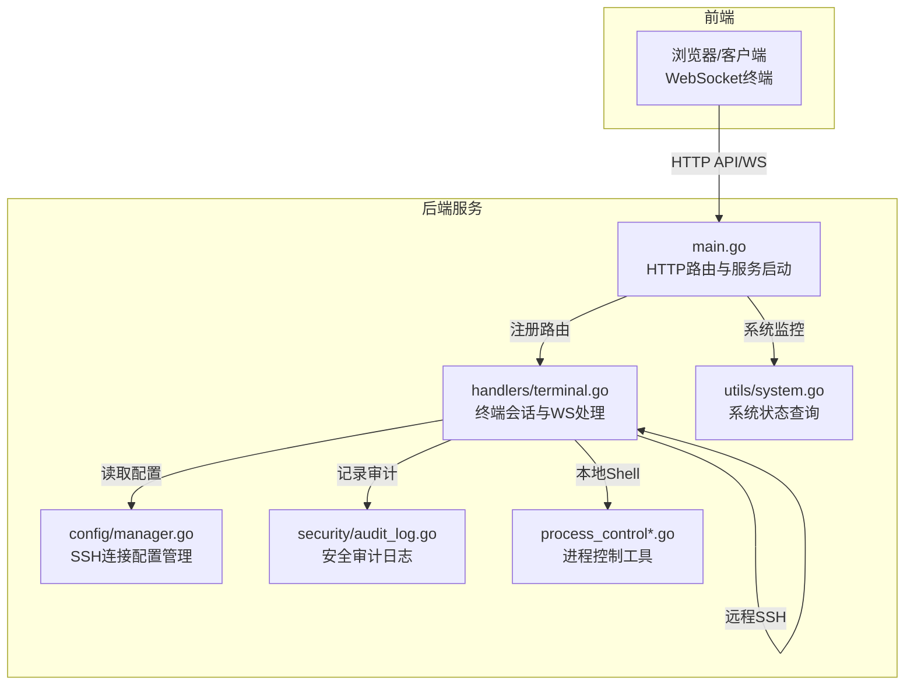
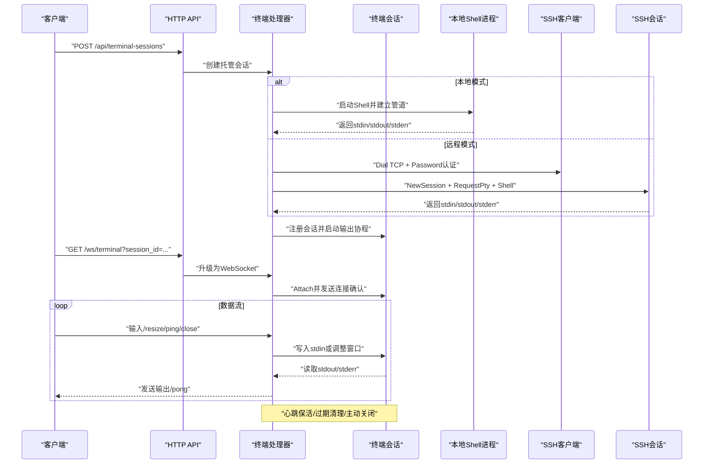
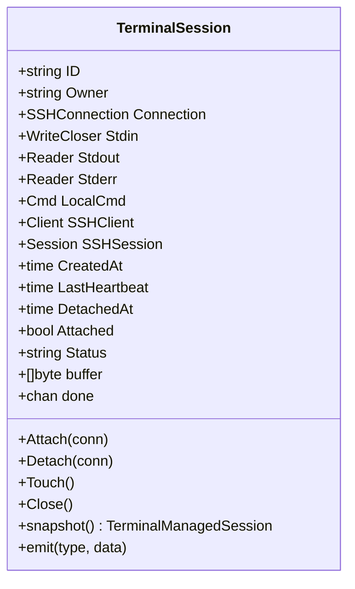
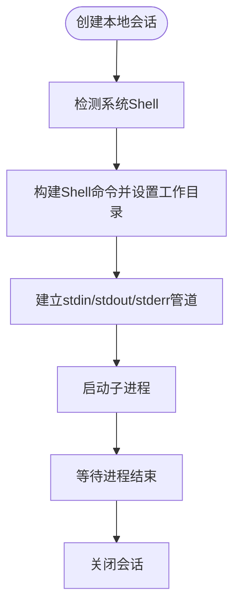
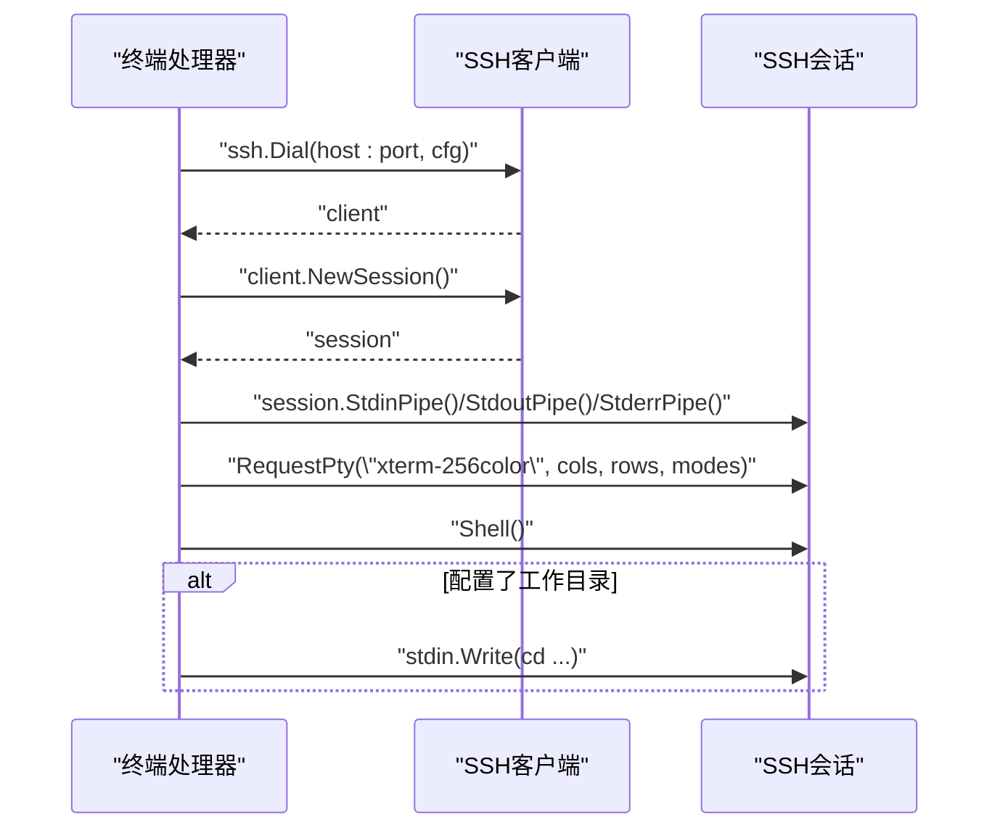
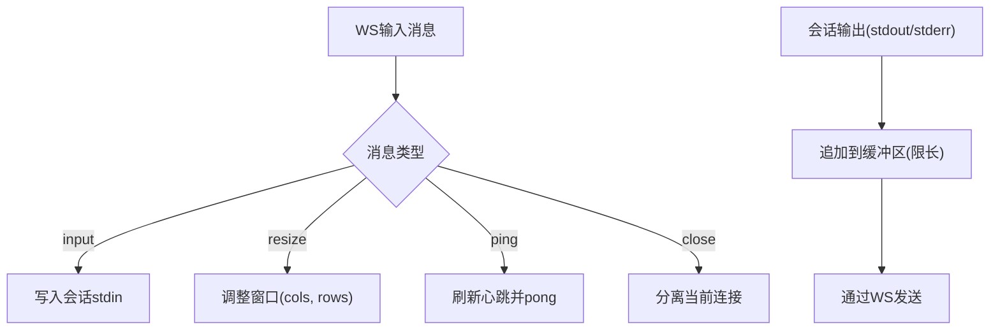
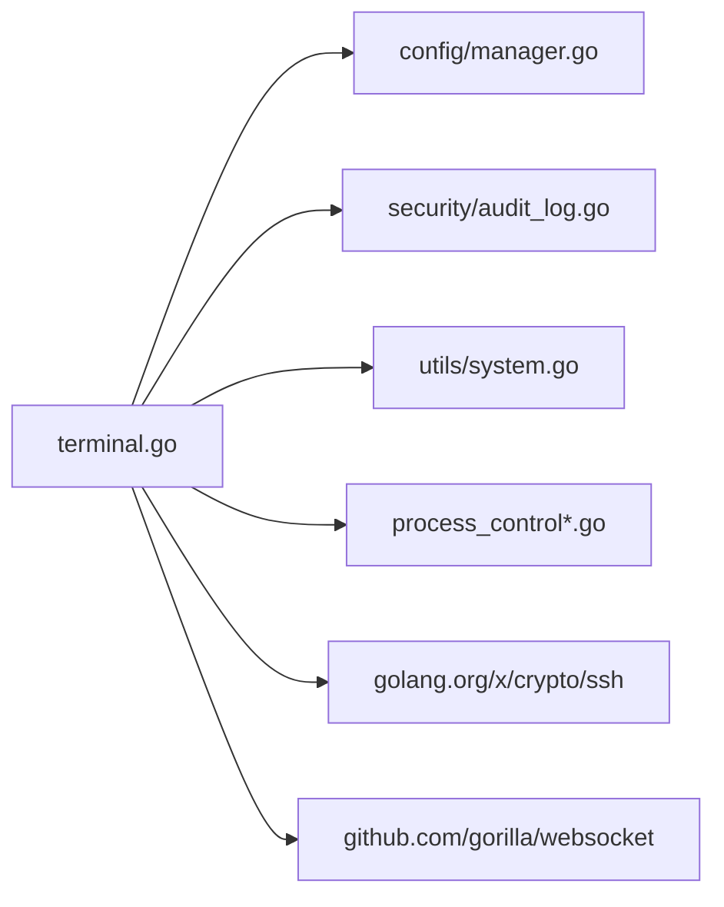

# 本地与远程终端支持

<cite>
**本文档引用的文件**
- [src/handlers/terminal.go](file://src/handlers/terminal.go)
- [src/models/models.go](file://src/models/models.go)
- [src/config/manager.go](file://src/config/manager.go)
- [src/security/audit_log.go](file://src/security/audit_log.go)
- [src/main.go](file://src/main.go)
- [src/process_control.go](file://src/process_control.go)
- [src/process_control_unix.go](file://src/process_control_unix.go)
- [src/process_control_windows.go](file://src/process_control_windows.go)
- [src/utils/system.go](file://src/utils/system.go)
</cite>

## 目录
1. [简介](#简介)
2. [项目结构](#项目结构)
3. [核心组件](#核心组件)
4. [架构总览](#架构总览)
5. [详细组件分析](#详细组件分析)
6. [依赖分析](#依赖分析)
7. [性能考虑](#性能考虑)
8. [故障排查指南](#故障排查指南)
9. [结论](#结论)

## 简介
本文件面向“本地与远程终端支持”功能，系统性阐述终端会话的实现原理、本地 Shell 检测与命令执行管道创建、远程 SSH 终端的连接建立流程、工作目录同步机制、Shell 类型检测与兼容性处理、以及错误处理与故障恢复策略。文档同时对比两种模式的差异与适用场景，并提供可视化图示帮助理解。

## 项目结构
终端能力由后端服务统一提供，前端通过 WebSocket 与后端交互，后端负责：
- 终端会话生命周期管理
- 本地 Shell 进程与远程 SSH 会话的双向数据通道
- 工作目录同步与窗口尺寸调整
- 心跳保活与过期清理
- 安全审计日志记录

图表来源
- [src/main.go:418-420](file://src/main.go#L418-L420)
- [src/handlers/terminal.go:354-377](file://src/handlers/terminal.go#L354-L377)
- [src/config/manager.go:583-637](file://src/config/manager.go#L583-L637)
- [src/security/audit_log.go:115-147](file://src/security/audit_log.go#L115-L147)

章节来源
- [src/main.go:418-420](file://src/main.go#L418-L420)
- [src/handlers/terminal.go:354-377](file://src/handlers/terminal.go#L354-L377)
- [src/config/manager.go:583-637](file://src/config/manager.go#L583-L637)
- [src/security/audit_log.go:115-147](file://src/security/audit_log.go#L115-L147)

## 核心组件
- 终端会话模型与管理
  - 终端会话对象封装本地命令或 SSH 会话、标准输入输出、连接状态、心跳与缓冲等。
  - 提供会话注册、注销、快照、心跳刷新、附件/分离、关闭等方法。
- SSH 连接配置
  - 支持本地与远程两类连接，远程连接包含主机、端口、用户名、密码、默认工作目录等字段。
- WebSocket 终端处理器
  - 升级连接、接收输入消息、转发到本地或远程会话、从会话读取输出并通过 WS 发送。
- SSH 客户端与会话创建
  - 构造 SSH 客户端配置、建立 TCP 连接、创建会话、申请 PTY、启动 Shell 并按需切换工作目录。
- 本地 Shell 执行
  - 检测系统 Shell、创建子进程、建立 stdin/stdout/stderr 管道、启动命令并等待结束。
- 工作目录同步
  - 本地：通过命令行设置工作目录；远程：在会话启动后发送 cd 命令。
- 错误处理与审计
  - 对连接失败、会话异常、读写错误进行捕获与记录，支持主动关闭与自动清理。

章节来源
- [src/handlers/terminal.go:39-61](file://src/handlers/terminal.go#L39-L61)
- [src/models/models.go:269-297](file://src/models/models.go#L269-L297)
- [src/handlers/terminal.go:379-444](file://src/handlers/terminal.go#L379-L444)
- [src/handlers/terminal.go:446-510](file://src/handlers/terminal.go#L446-L510)
- [src/handlers/terminal.go:798-811](file://src/handlers/terminal.go#L798-L811)

## 架构总览
下图展示终端会话在本地与远程两种模式下的关键流程与组件交互。

图表来源
- [src/handlers/terminal.go:282-319](file://src/handlers/terminal.go#L282-L319)
- [src/handlers/terminal.go:354-377](file://src/handlers/terminal.go#L354-L377)
- [src/handlers/terminal.go:379-444](file://src/handlers/terminal.go#L379-L444)
- [src/handlers/terminal.go:446-510](file://src/handlers/terminal.go#L446-L510)

## 详细组件分析

### 终端会话类与生命周期
- 关键属性
  - 会话标识、拥有者、连接配置、本地命令句柄、SSH 客户端与会话、创建时间、最后心跳、分离时间、附加状态、状态字符串、缓冲区、完成信号、互斥锁等。
- 生命周期
  - 创建：根据连接类型选择本地或远程分支，分别建立管道或会话。
  - 运行：注册会话，启动输出读取协程，处理输入消息与窗口调整。
  - 心跳：收到 ping 或业务活动时刷新 LastHeartbeat。
  - 分离/附加：同一会话可被多个 WS 连接附加，但仅一个活跃连接。
  - 关闭：清理本地进程/SSH 会话/WS 连接，注销会话，触发 done 信号。
- 过期清理
  - 附加状态下超过 TTL 未心跳则清理；分离状态下超过保留时长未心跳则清理。

图表来源
- [src/handlers/terminal.go:39-61](file://src/handlers/terminal.go#L39-L61)
- [src/handlers/terminal.go:614-657](file://src/handlers/terminal.go#L614-L657)
- [src/handlers/terminal.go:659-663](file://src/handlers/terminal.go#L659-L663)
- [src/handlers/terminal.go:818-843](file://src/handlers/terminal.go#L818-L843)

章节来源
- [src/handlers/terminal.go:39-61](file://src/handlers/terminal.go#L39-L61)
- [src/handlers/terminal.go:614-657](file://src/handlers/terminal.go#L614-L657)
- [src/handlers/terminal.go:659-663](file://src/handlers/terminal.go#L659-L663)
- [src/handlers/terminal.go:818-843](file://src/handlers/terminal.go#L818-L843)

### 本地终端实现
- Shell 检测与兼容性
  - Windows：优先 PowerShell，否则 cmd。
  - macOS：zsh。
  - Linux：bash。
- 命令执行与管道
  - 使用系统 Shell 启动子进程，建立 stdin/stdout/stderr 管道。
  - 若配置了工作目录，则设置进程工作目录。
  - 子进程结束后自动关闭会话。
- 适配与限制
  - Windows 不支持窗口尺寸调整（通过 stty 的本地实现不生效）。
  - 本地模式无需网络，延迟低，适合快速本地操作。

图表来源
- [src/handlers/terminal.go:798-811](file://src/handlers/terminal.go#L798-L811)
- [src/handlers/terminal.go:391-421](file://src/handlers/terminal.go#L391-L421)
- [src/handlers/terminal.go:798-811](file://src/handlers/terminal.go#L798-L811)

章节来源
- [src/handlers/terminal.go:798-811](file://src/handlers/terminal.go#L798-L811)
- [src/handlers/terminal.go:391-421](file://src/handlers/terminal.go#L391-L421)

### 远程 SSH 终端实现
- 客户端配置与认证
  - 使用用户名与密码认证，超时 8 秒。
  - 主机密钥验证采用不安全忽略策略（便于演示，生产环境建议更严格）。
- 会话创建与 PTY 申请
  - 新建会话，申请 xterm-256color 终端，设置波特率等模式。
  - 启动 Shell 后，若配置了工作目录，立即发送 cd 命令切换。
- 数据通道
  - 通过 stdin/stdout/stderr 管道与远端交互。
  - 输出读取协程持续从 stdout/stderr 读取并经 WS 推送。

图表来源
- [src/handlers/terminal.go:446-510](file://src/handlers/terminal.go#L446-L510)

章节来源
- [src/handlers/terminal.go:446-510](file://src/handlers/terminal.go#L446-L510)

### WebSocket 终端处理器
- 连接升级
  - 从查询参数获取 session_id，校验会话归属，升级为 WebSocket。
- 输入处理
  - 支持 input、resize、ping、close 四种消息类型：
    - input：写入会话 stdin。
    - resize：调用窗口调整逻辑（本地通过 stty，远程通过 SSH 会话）。
    - ping：刷新心跳并回发 pong。
    - close：分离当前连接。
- 输出处理
  - 从会话 stdout/stderr 读取数据，按类型推送至 WS；超出缓冲上限时截断保留最近数据。

图表来源
- [src/handlers/terminal.go:512-552](file://src/handlers/terminal.go#L512-L552)
- [src/handlers/terminal.go:554-580](file://src/handlers/terminal.go#L554-L580)
- [src/handlers/terminal.go:779-796](file://src/handlers/terminal.go#L779-L796)

章节来源
- [src/handlers/terminal.go:512-552](file://src/handlers/terminal.go#L512-L552)
- [src/handlers/terminal.go:554-580](file://src/handlers/terminal.go#L554-L580)
- [src/handlers/terminal.go:779-796](file://src/handlers/terminal.go#L779-L796)

### 工作目录同步机制
- 本地工作目录
  - 在创建本地 Shell 进程时设置工作目录，确保后续命令在正确路径执行。
- 远程工作目录
  - 在会话启动后立即发送 cd 命令，使远端 Shell 切换到指定目录。
- 目录有效性
  - 本地连接测试阶段会校验工作目录是否存在且可访问。

章节来源
- [src/handlers/terminal.go:393-395](file://src/handlers/terminal.go#L393-L395)
- [src/handlers/terminal.go:505-507](file://src/handlers/terminal.go#L505-L507)
- [src/handlers/terminal.go:253-257](file://src/handlers/terminal.go#L253-L257)

### Shell 类型检测与兼容性处理
- 检测策略
  - Windows：优先 PowerShell，否则 cmd。
  - macOS：zsh。
  - Linux：bash。
- 兼容性
  - 本地模式下，窗口尺寸调整通过 stty 实现；Windows 不支持该操作。
  - 远程模式下，窗口尺寸通过 SSH 会话的 WindowChange 接口调整。

章节来源
- [src/handlers/terminal.go:798-811](file://src/handlers/terminal.go#L798-L811)
- [src/handlers/terminal.go:780-796](file://src/handlers/terminal.go#L780-L796)

### 错误处理与故障恢复
- 连接断开与异常
  - 读取输出发生非 EOF 错误时，记录错误并关闭会话。
  - WS 连接断开时自动分离，保持会话继续运行（若仍有其他连接附加）。
- 会话异常终止
  - 本地子进程或 SSH 会话等待返回时触发关闭。
- 心跳与过期清理
  - 附加会话超过 TTL 未心跳则清理；分离会话超过保留时长未心跳则清理。
- 主动关闭
  - 用户可主动关闭会话，记录审计日志。

章节来源
- [src/handlers/terminal.go:566-572](file://src/handlers/terminal.go#L566-L572)
- [src/handlers/terminal.go:434-437](file://src/handlers/terminal.go#L434-L437)
- [src/handlers/terminal.go:688-698](file://src/handlers/terminal.go#L688-L698)
- [src/handlers/terminal.go:336-338](file://src/handlers/terminal.go#L336-L338)

## 依赖分析
- 组件耦合
  - 终端处理器依赖配置管理器获取 SSH 连接配置。
  - 终端处理器依赖安全审计模块记录连接与断开事件。
  - 终端处理器依赖系统工具模块进行 Shell 检测与窗口调整。
- 外部依赖
  - WebSocket 升级与消息编解码。
  - SSH 客户端库用于远程连接。
  - 进程控制工具用于本地进程状态判断与终止。

图表来源
- [src/handlers/terminal.go:16-24](file://src/handlers/terminal.go#L16-L24)
- [src/config/manager.go:1-14](file://src/config/manager.go#L1-L14)
- [src/security/audit_log.go:1-10](file://src/security/audit_log.go#L1-L10)

章节来源
- [src/handlers/terminal.go:16-24](file://src/handlers/terminal.go#L16-L24)
- [src/config/manager.go:1-14](file://src/config/manager.go#L1-L14)
- [src/security/audit_log.go:1-10](file://src/security/audit_log.go#L1-L10)

## 性能考虑
- 缓冲区限制
  - 输出缓冲区上限为固定值，避免内存无限增长。
- 心跳与清理
  - 定期清理过期会话，释放资源。
- 本地与远程差异
  - 本地模式无网络开销，延迟更低；远程模式受网络与远端 Shell 性能影响。
- 窗口尺寸调整
  - 本地通过系统命令调整，远程通过 SSH 会话接口，均需避免频繁调用导致抖动。

章节来源
- [src/handlers/terminal.go:26-31](file://src/handlers/terminal.go#L26-L31)
- [src/handlers/terminal.go:688-698](file://src/handlers/terminal.go#L688-L698)
- [src/handlers/terminal.go:779-796](file://src/handlers/terminal.go#L779-L796)

## 故障排查指南
- 本地连接不可用
  - 检查 Shell 可执行文件是否存在；检查工作目录是否有效。
- 远程连接失败
  - 检查主机可达性、端口开放情况、用户名与密码是否正确；确认超时设置是否合理。
- 会话异常退出
  - 查看输出读取错误日志；确认会话是否被主动关闭或过期清理。
- 窗口尺寸不更新
  - 本地模式在 Windows 下不支持；远程模式确认已发送 resize 消息。
- 审计日志
  - 使用安全日志接口查询 SSH 连接与断开记录，定位问题。

章节来源
- [src/handlers/terminal.go:247-274](file://src/handlers/terminal.go#L247-L274)
- [src/handlers/terminal.go:460-463](file://src/handlers/terminal.go#L460-L463)
- [src/handlers/terminal.go:566-572](file://src/handlers/terminal.go#L566-L572)
- [src/handlers/terminal.go:780-796](file://src/handlers/terminal.go#L780-L796)
- [src/security/audit_log.go:115-147](file://src/security/audit_log.go#L115-L147)

## 结论
本地与远程终端支持通过统一的会话模型与 WebSocket 通道实现了跨平台的终端体验。本地模式具备低延迟与高可用优势，适合日常开发与运维；远程模式提供了灵活的跨主机访问能力。通过完善的错误处理、心跳保活与过期清理机制，系统在复杂环境下仍能保持稳定运行。建议在生产环境中加强 SSH 主机密钥验证与权限控制，以提升安全性。