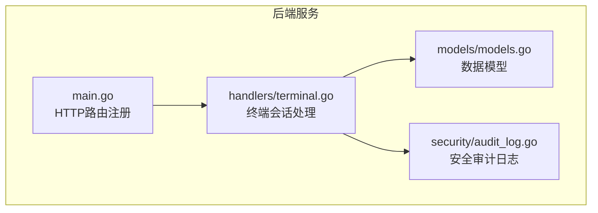
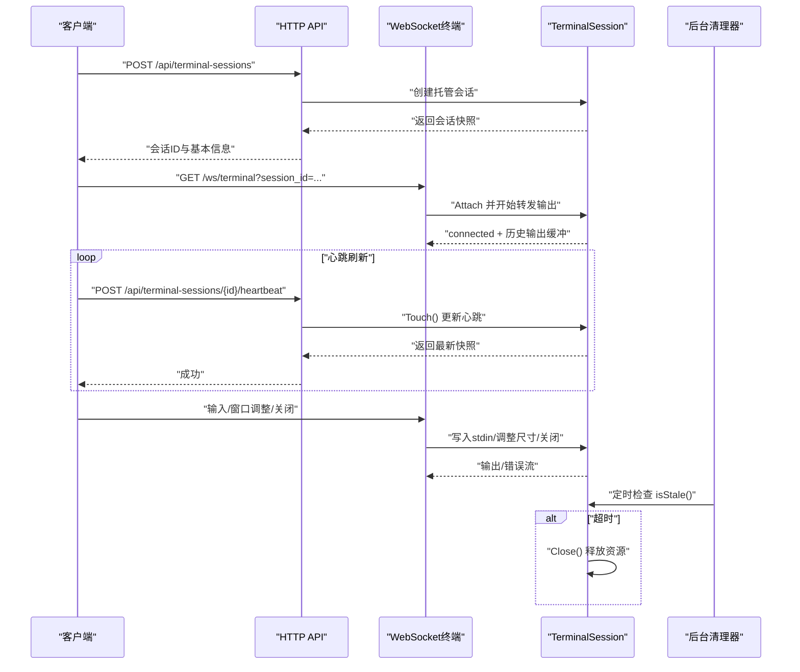
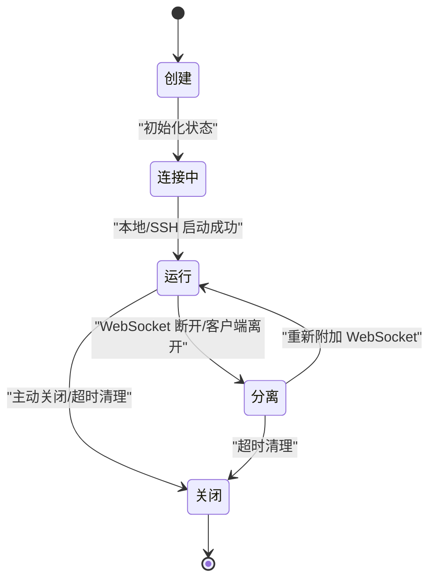
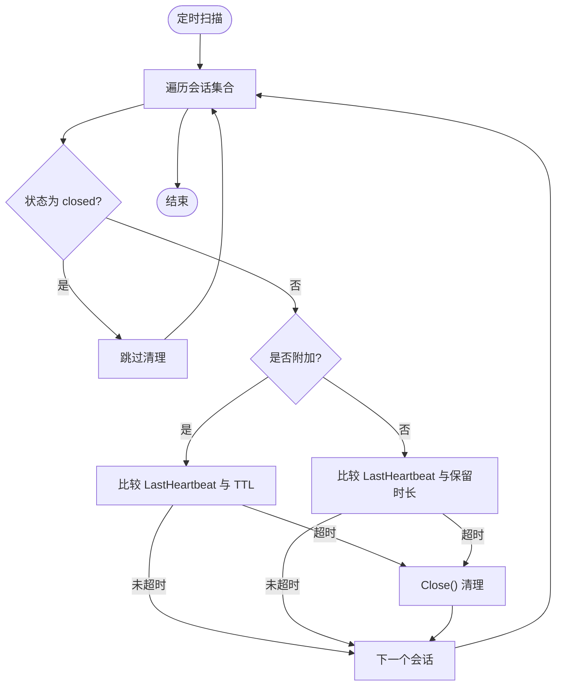
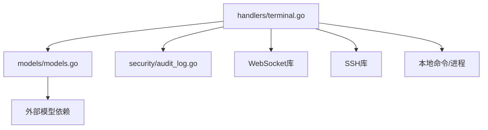

# 终端会话管理

<cite>
**本文引用的文件**
- [src/handlers/terminal.go](file://src/handlers/terminal.go)
- [src/models/models.go](file://src/models/models.go)
- [src/main.go](file://src/main.go)
- [src/security/audit_log.go](file://src/security/audit_log.go)
</cite>

## 目录
1. [简介](#简介)
2. [项目结构](#项目结构)
3. [核心组件](#核心组件)
4. [架构总览](#架构总览)
5. [详细组件分析](#详细组件分析)
6. [依赖分析](#依赖分析)
7. [性能考虑](#性能考虑)
8. [故障排查指南](#故障排查指南)
9. [结论](#结论)
10. [附录](#附录)

## 简介
本文档围绕终端会话管理功能进行深入解析，重点阐述 TerminalSession 结构体的设计与字段职责、会话生命周期管理（创建、启动、运行、挂起、恢复、销毁）、状态转换机制、清理策略（空闲超时、内存与资源释放）、API 接口设计（会话列表查询、会话详情获取、会话关闭、心跳刷新），以及心跳刷新与会话持久化实现细节。文档同时提供可视化图示帮助理解整体架构与关键流程。

## 项目结构
终端会话管理位于 handlers 包中，核心逻辑集中在终端处理器文件，数据模型在 models 中定义，HTTP 路由在主入口文件中注册，安全审计日志在 security 包中记录。



图表来源
- [src/main.go:418-420](file://src/main.go#L418-L420)
- [src/handlers/terminal.go:354-377](file://src/handlers/terminal.go#L354-L377)
- [src/security/audit_log.go:115-147](file://src/security/audit_log.go#L115-L147)
- [src/models/models.go:283-297](file://src/models/models.go#L283-L297)

章节来源
- [src/main.go:418-420](file://src/main.go#L418-L420)
- [src/handlers/terminal.go:354-377](file://src/handlers/terminal.go#L354-L377)
- [src/models/models.go:283-297](file://src/models/models.go#L283-L297)

## 核心组件
- TerminalSession：终端会话对象，封装会话标识、所有者、连接信息、进程句柄、创建与心跳时间、挂起时间、附加状态、状态字符串、缓冲区、完成信号、互斥锁等。
- 数据模型 TerminalManagedSession：对外暴露的会话快照，用于 API 返回。
- 审计日志：记录 SSH 连接、断开、系统操作等安全事件。
- HTTP 路由：提供会话列表、创建、关闭、心跳刷新、WebSocket 终端接入等接口。

章节来源
- [src/handlers/terminal.go:39-61](file://src/handlers/terminal.go#L39-L61)
- [src/models/models.go:283-297](file://src/models/models.go#L283-L297)
- [src/security/audit_log.go:115-147](file://src/security/audit_log.go#L115-L147)

## 架构总览
终端会话管理采用“HTTP API + WebSocket + 后台清理”的架构：
- HTTP API 负责会话生命周期管理与状态查询；
- WebSocket 提供实时双向通信，承载终端输入输出；
- 后台协程定期扫描会话，基于心跳时间与附加状态判定是否超时并清理；
- 审计日志贯穿连接建立、断开与系统操作，确保可追溯性。



图表来源
- [src/main.go:343-371](file://src/main.go#L343-L371)
- [src/handlers/terminal.go:354-377](file://src/handlers/terminal.go#L354-L377)
- [src/handlers/terminal.go:379-444](file://src/handlers/terminal.go#L379-L444)
- [src/handlers/terminal.go:688-698](file://src/handlers/terminal.go#L688-L698)
- [src/handlers/terminal.go:818-843](file://src/handlers/terminal.go#L818-L843)

## 详细组件分析

### TerminalSession 结构体设计与字段说明
TerminalSession 是会话的核心载体，包含以下关键字段：
- ID：会话唯一标识，生成策略见会话创建逻辑。
- Owner：会话归属用户，用于会话隔离与权限控制。
- Connection：关联的 SSH/本地连接配置。
- Stdin/stdout/stderr：本地命令或 SSH 会话的标准输入输出/错误管道。
- LocalCmd/SSHClient/SSHSession：本地命令句柄与 SSH 客户端/会话句柄，用于资源管理与关闭。
- CreatedAt/LastHeartbeat/DetachedAt：创建时间、最近心跳时间、最近分离时间。
- Attached：是否处于 WebSocket 附加状态。
- Status：会话状态字符串（如 connecting、running、closed）。
- buffer：输出缓冲，限制上限以避免内存膨胀。
- done/closeOnce/mu/wsMu：完成信号、一次性关闭保证、互斥锁、WebSocket 写入锁。
- attachedConn：当前附加的 WebSocket 连接。

```mermaid
classDiagram
class TerminalSession {
+string ID
+string Owner
+SSHConnection Connection
+WriteCloser Stdin
+Reader Stdout
+Reader Stderr
+Cmd LocalCmd
+Client SSHClient
+Session SSHSession
+Time CreatedAt
+Time LastHeartbeat
+Time DetachedAt
+bool Attached
+string Status
-[]byte buffer
-chan struct{} done
-sync.Once closeOnce
-sync.Mutex mu
-sync.Mutex wsMu
-websocket.Conn attachedConn
+Attach(conn)
+Detach(conn)
+Touch()
+Close()
+snapshot() TerminalManagedSession
+isStale(now) bool
}
```

图表来源
- [src/handlers/terminal.go:39-61](file://src/handlers/terminal.go#L39-L61)
- [src/handlers/terminal.go:614-657](file://src/handlers/terminal.go#L614-L657)
- [src/handlers/terminal.go:659-663](file://src/handlers/terminal.go#L659-L663)
- [src/handlers/terminal.go:818-843](file://src/handlers/terminal.go#L818-L843)

章节来源
- [src/handlers/terminal.go:39-61](file://src/handlers/terminal.go#L39-L61)
- [src/handlers/terminal.go:614-657](file://src/handlers/terminal.go#L614-L657)
- [src/handlers/terminal.go:659-663](file://src/handlers/terminal.go#L659-L663)
- [src/handlers/terminal.go:818-843](file://src/handlers/terminal.go#L818-L843)

### 会话生命周期管理
- 创建：根据连接类型（本地或 SSH）分别启动本地 Shell 或建立 SSH 会话，并注册到全局会话表。
- 启动：本地模式下启动 Shell 进程；SSH 模式下建立 SSH 客户端并申请伪终端、启动 Shell。
- 运行：后台协程持续从 stdout/stderr 读取输出并转发至附加的 WebSocket 连接；处理输入消息并写入 stdin。
- 挂起：当 WebSocket 断开或客户端离开时，会话进入分离状态，更新 DetachedAt。
- 恢复：重新连接 WebSocket 时，会话重新附加，恢复输出缓冲与状态。
- 销毁：主动关闭或超时清理时，关闭底层资源（本地命令、SSH 会话/客户端、WebSocket），移除会话注册并通知完成。



图表来源
- [src/handlers/terminal.go:379-444](file://src/handlers/terminal.go#L379-L444)
- [src/handlers/terminal.go:614-657](file://src/handlers/terminal.go#L614-L657)
- [src/handlers/terminal.go:688-698](file://src/handlers/terminal.go#L688-L698)
- [src/handlers/terminal.go:818-843](file://src/handlers/terminal.go#L818-L843)

章节来源
- [src/handlers/terminal.go:379-444](file://src/handlers/terminal.go#L379-L444)
- [src/handlers/terminal.go:614-657](file://src/handlers/terminal.go#L614-L657)
- [src/handlers/terminal.go:688-698](file://src/handlers/terminal.go#L688-L698)
- [src/handlers/terminal.go:818-843](file://src/handlers/terminal.go#L818-L843)

### 会话状态管理机制
- 状态字符串：connecting（连接中）、running（运行中）、closed（已关闭）。
- 状态转换条件：
  - 创建时初始为 connecting；
  - 本地/SSH 成功启动后切换为 running；
  - 主动关闭或超时清理时切换为 closed；
  - 附加/分离不改变状态字符串，仅更新 Attached/DetachedAt。
- 心跳刷新：每次收到输入、窗口调整、ping 消息时调用 Touch() 更新 LastHeartbeat。

章节来源
- [src/handlers/terminal.go:379-444](file://src/handlers/terminal.go#L379-L444)
- [src/handlers/terminal.go:659-663](file://src/handlers/terminal.go#L659-L663)
- [src/handlers/terminal.go:512-552](file://src/handlers/terminal.go#L512-L552)

### 会话清理机制
- 空闲超时检测：
  - 附加会话：超过连接 TTL（默认约 90 秒）未心跳视为超时；
  - 分离会话：超过保留时长（默认约 30 分钟）未心跳视为超时。
- 内存清理：输出缓冲限制上限，超出时仅保留最近 N 字节。
- 资源释放：关闭本地命令、SSH 会话/客户端、WebSocket，移除会话注册，发送完成信号。
- 后台清理器：定时器每分钟扫描一次，对超时会话统一执行 Close()。



图表来源
- [src/handlers/terminal.go:26-31](file://src/handlers/terminal.go#L26-L31)
- [src/handlers/terminal.go:688-698](file://src/handlers/terminal.go#L688-L698)
- [src/handlers/terminal.go:738-759](file://src/handlers/terminal.go#L738-L759)
- [src/handlers/terminal.go:582-599](file://src/handlers/terminal.go#L582-L599)

章节来源
- [src/handlers/terminal.go:26-31](file://src/handlers/terminal.go#L26-L31)
- [src/handlers/terminal.go:688-698](file://src/handlers/terminal.go#L688-L698)
- [src/handlers/terminal.go:738-759](file://src/handlers/terminal.go#L738-L759)
- [src/handlers/terminal.go:582-599](file://src/handlers/terminal.go#L582-L599)

### API 接口说明
- 会话列表查询
  - 方法：GET /api/terminal-sessions
  - 功能：按当前用户返回其拥有的所有会话快照。
  - 实现：按创建时间升序排序。
- 创建托管会话
  - 方法：POST /api/terminal-sessions
  - 请求体：{ connection_id: string }
  - 功能：根据连接配置创建托管会话，返回会话快照。
  - 审计：成功/失败均记录 SSH 连接日志。
- 会话详情获取
  - 方法：GET /api/terminal-sessions/{id}
  - 功能：返回指定会话快照（内部实现通过列表查询过滤）。
- 会话关闭
  - 方法：DELETE /api/terminal-sessions/{id}
  - 功能：主动关闭指定会话，记录断开日志。
- 心跳刷新
  - 方法：POST /api/terminal-sessions/{id}/heartbeat
  - 功能：刷新会话心跳时间，返回最新快照。
- WebSocket 终端接入
  - 方法：GET /ws/terminal?session_id={id}
  - 功能：升级为 WebSocket，附加会话并开始转发输出；支持输入、窗口调整、ping、close 等消息类型。

章节来源
- [src/main.go:343-371](file://src/main.go#L343-L371)
- [src/handlers/terminal.go:277-280](file://src/handlers/terminal.go#L277-L280)
- [src/handlers/terminal.go:282-319](file://src/handlers/terminal.go#L282-L319)
- [src/handlers/terminal.go:321-339](file://src/handlers/terminal.go#L321-L339)
- [src/handlers/terminal.go:341-351](file://src/handlers/terminal.go#L341-L351)
- [src/handlers/terminal.go:353-377](file://src/handlers/terminal.go#L353-L377)

### 心跳刷新机制
- 触发时机：输入消息、窗口调整、ping 消息、心跳接口调用。
- 更新行为：Touch() 将 LastHeartbeat 设为当前时间，防止被后台清理器判定为超时。
- WebSocket ping/pong：客户端发送 ping，服务端返回 pong 并刷新心跳。

章节来源
- [src/handlers/terminal.go:512-552](file://src/handlers/terminal.go#L512-L552)
- [src/handlers/terminal.go:341-351](file://src/handlers/terminal.go#L341-L351)
- [src/handlers/terminal.go:659-663](file://src/handlers/terminal.go#L659-L663)

### 会话持久化实现细节
- 会话数据模型：TerminalManagedSession 作为对外快照，包含会话 ID、连接信息、附加状态、状态、创建与心跳时间等。
- 会话注册与注销：创建后注册到全局映射，关闭后从映射中移除。
- 输出缓冲：限制最大字节数，超出时仅保留尾部数据，兼顾历史输出展示与内存控制。
- 审计日志：连接建立/断开、系统操作均有审计记录，便于追踪与合规。

章节来源
- [src/models/models.go:283-297](file://src/models/models.go#L283-L297)
- [src/handlers/terminal.go:700-710](file://src/handlers/terminal.go#L700-L710)
- [src/handlers/terminal.go:582-599](file://src/handlers/terminal.go#L582-L599)
- [src/security/audit_log.go:115-147](file://src/security/audit_log.go#L115-L147)

## 依赖分析
- 组件耦合：
  - TerminalSession 依赖 models.SSHConnection 与 models.TerminalManagedSession；
  - 终端处理器依赖安全审计日志模块记录连接与断开事件；
  - HTTP 路由在主入口集中注册，终端相关路由位于 API 与 WebSocket 路径。
- 外部依赖：
  - WebSocket 升级与消息处理；
  - SSH 客户端库；
  - 本地命令执行与进程控制。



图表来源
- [src/handlers/terminal.go:3-24](file://src/handlers/terminal.go#L3-L24)
- [src/models/models.go:269-281](file://src/models/models.go#L269-L281)
- [src/security/audit_log.go:115-147](file://src/security/audit_log.go#L115-L147)

章节来源
- [src/handlers/terminal.go:3-24](file://src/handlers/terminal.go#L3-L24)
- [src/models/models.go:269-281](file://src/models/models.go#L269-L281)
- [src/security/audit_log.go:115-147](file://src/security/audit_log.go#L115-L147)

## 性能考虑
- 输出缓冲上限：限制内存占用，避免长时间会话导致内存膨胀。
- 定时清理间隔：每分钟扫描一次，平衡清理及时性与 CPU 开销。
- 附加/分离状态：分离状态下延长保留时长，减少误杀活跃会话。
- 并发安全：使用互斥锁保护会话状态与输出缓冲，WebSocket 写入单独加锁，降低竞争。
- 资源释放：关闭顺序合理，确保底层资源及时回收。

## 故障排查指南
- 无法创建会话
  - 检查连接配置是否存在且有效；
  - 查看 SSH 连接日志与审计日志，确认连接失败原因。
- 会话自动关闭
  - 确认客户端是否保持心跳（输入、窗口调整、ping）；
  - 检查后台清理器是否触发（超时阈值）。
- WebSocket 无法连接
  - 确认 session_id 参数正确；
  - 检查会话归属是否匹配当前用户。
- 输出异常或延迟
  - 检查输出缓冲是否被截断；
  - 确认 SSH/本地命令是否正常运行。

章节来源
- [src/handlers/terminal.go:282-319](file://src/handlers/terminal.go#L282-L319)
- [src/handlers/terminal.go:353-377](file://src/handlers/terminal.go#L353-L377)
- [src/handlers/terminal.go:688-698](file://src/handlers/terminal.go#L688-L698)
- [src/security/audit_log.go:115-147](file://src/security/audit_log.go#L115-L147)

## 结论
终端会话管理通过清晰的结构体设计、严格的生命周期控制、完善的清理策略与审计日志，实现了稳定可靠的远程/本地终端访问能力。API 与 WebSocket 的结合提供了良好的用户体验，后台清理器保障了资源的高效利用。建议在生产环境中合理配置超时阈值与缓冲上限，并结合审计日志进行监控与排障。

## 附录
- 关键常量与阈值
  - 连接 TTL：约 90 秒
  - 分离保留时长：约 30 分钟
  - 清理轮询间隔：1 分钟
  - 输出缓冲上限：256KB
- 会话 ID 生成策略：基于纳秒级时间戳拼接前缀。

章节来源
- [src/handlers/terminal.go:26-31](file://src/handlers/terminal.go#L26-L31)
- [src/handlers/terminal.go:813-816](file://src/handlers/terminal.go#L813-L816)