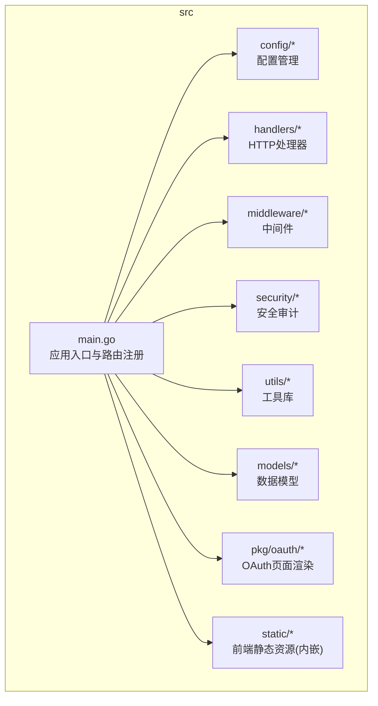
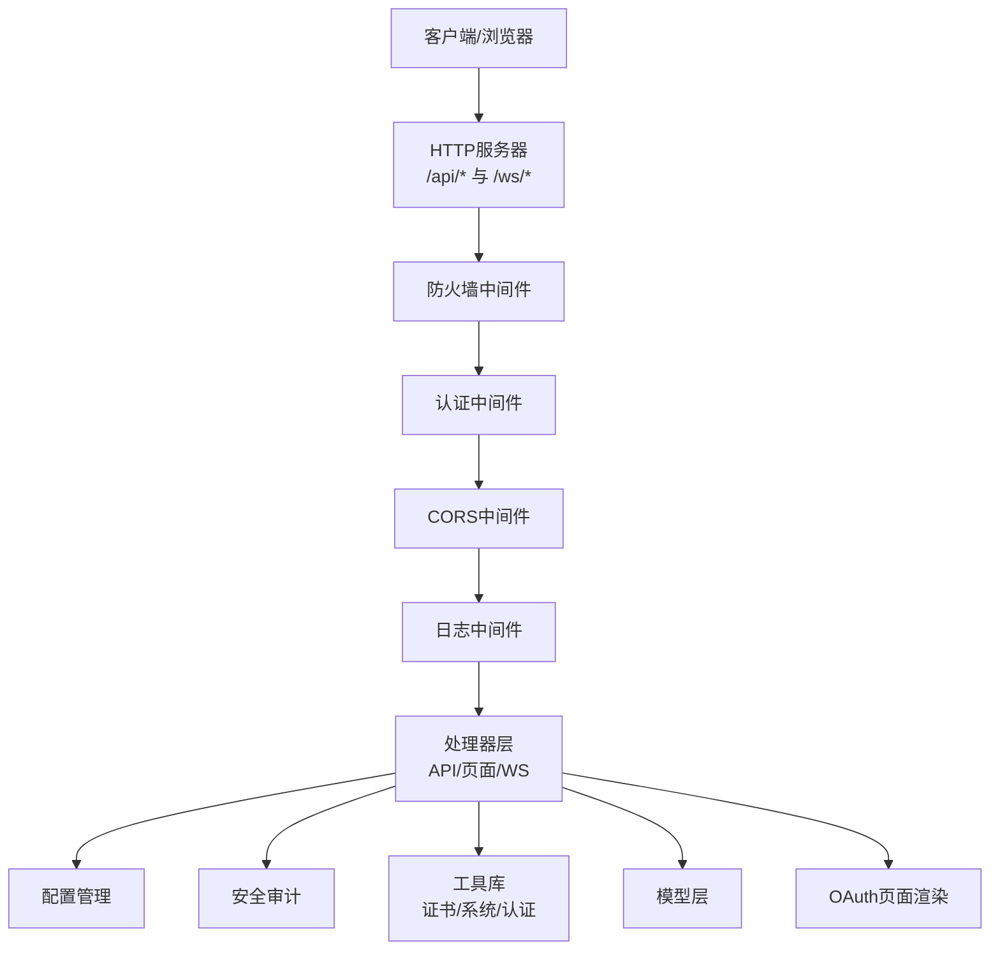
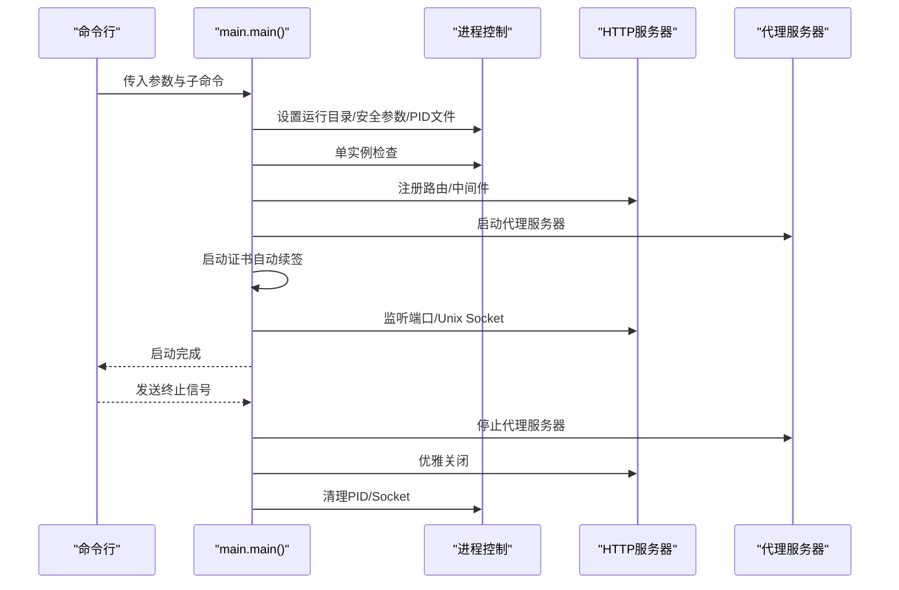
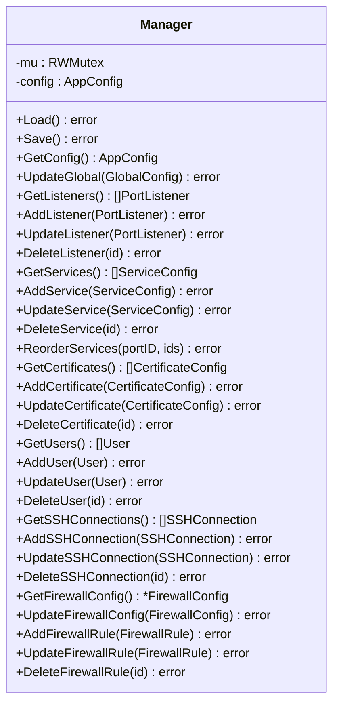
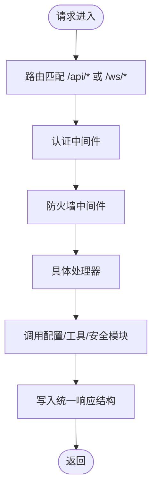
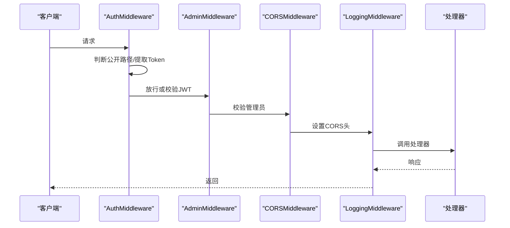
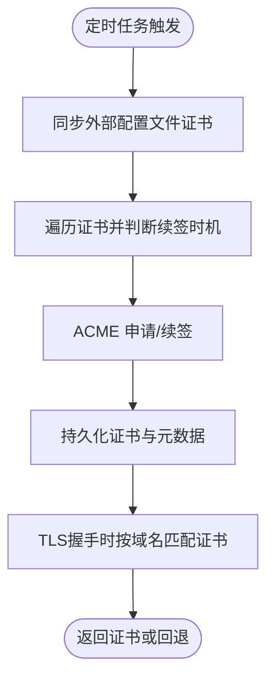
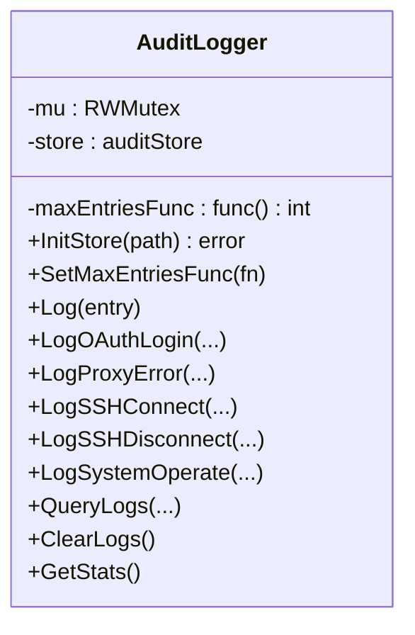
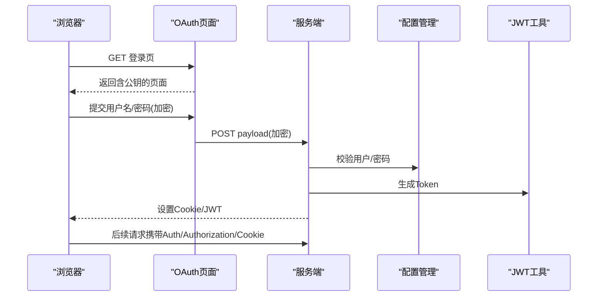
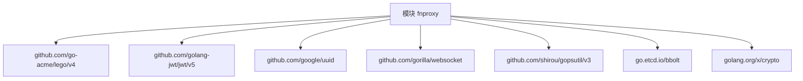

# 开发指南

<cite>
**本文引用的文件**
- [README.md](file://README.md)
- [go.mod](file://src/go.mod)
- [main.go](file://src/main.go)
- [process_control.go](file://src/process_control.go)
- [static_embed.go](file://src/static_embed.go)
- [config/manager.go](file://src/config/manager.go)
- [handlers/api.go](file://src/handlers/api.go)
- [handlers/auth.go](file://src/handlers/auth.go)
- [middleware/auth.go](file://src/middleware/auth.go)
- [utils/certificate_manager.go](file://src/utils/certificate_manager.go)
- [utils/system.go](file://src/utils/system.go)
- [utils/auth.go](file://src/utils/auth.go)
- [security/audit_log.go](file://src/security/audit_log.go)
- [models/models.go](file://src/models/models.go)
- [pkg/oauth/page.go](file://src/pkg/oauth/page.go)
- [build.linux.sh](file://build.linux.sh)
- [build.windows.bat](file://build.windows.bat)
- [debug.bat](file://debug.bat)
</cite>

## 目录
1. [简介](#简介)
2. [项目结构](#项目结构)
3. [核心组件](#核心组件)
4. [架构总览](#架构总览)
5. [详细组件分析](#详细组件分析)
6. [依赖分析](#依赖分析)
7. [性能考虑](#性能考虑)
8. [故障排除指南](#故障排除指南)
9. [结论](#结论)
10. [附录](#附录)

## 简介
Caddy Panel 是一个基于 Go 的轻量级服务管理面板，提供统一的网站管理、反向代理、静态站点、跳转规则、证书管理、OAuth 访问控制、用户与 SSH 终端管理、运行状态监控以及进程控制能力。前端静态资源内嵌至可执行文件，运行时配置、缓存、证书与 PID 文件可统一落盘到指定目录，便于部署与备份。

## 项目结构
项目采用模块化与包设计分离职责，主要目录与职责如下：
- src：Go 模块根目录，包含应用入口、配置、处理器、中间件、安全、工具与模型等
- documents：设计与变更文档
- build.linux.sh/build.windows.bat/debug.bat：构建与调试脚本

图表来源
- [main.go:1-516](file://src/main.go#L1-L516)
- [config/manager.go:1-791](file://src/config/manager.go#L1-L791)
- [handlers/api.go:1-785](file://src/handlers/api.go#L1-L785)
- [middleware/auth.go:1-119](file://src/middleware/auth.go#L1-L119)
- [utils/certificate_manager.go:1-800](file://src/utils/certificate_manager.go#L1-L800)
- [security/audit_log.go:1-224](file://src/security/audit_log.go#L1-L224)
- [models/models.go:1-394](file://src/models/models.go#L1-L394)
- [pkg/oauth/page.go:1-197](file://src/pkg/oauth/page.go#L1-L197)

章节来源
- [README.md:20-42](file://README.md#L20-L42)
- [go.mod:1-48](file://src/go.mod#L1-L48)

## 核心组件
- 应用入口与生命周期：负责参数解析、单实例保护、PID 文件、HTTP 服务器启动、代理服务器启动与优雅关闭
- 配置管理：集中管理全局配置、监听器、服务、证书、用户、SSH 连接与防火墙配置
- 处理器层：提供 API 与静态页面服务，封装统一响应结构与错误处理
- 中间件层：认证、CORS、日志与防火墙控制
- 安全审计：记录 OAuth 登录、代理错误、SSH 连接、系统操作等日志
- 工具库：系统状态采集、证书管理（含 ACME）、认证与 Cookie 管理
- 模型层：定义应用配置、运行时统计、访问日志、证书、用户、SSH、防火墙等数据结构
- OAuth 页面：内嵌前端加密脚本，支持浏览器端 RSA-OAEP 加密提交凭据

章节来源
- [main.go:24-516](file://src/main.go#L24-L516)
- [config/manager.go:35-72](file://src/config/manager.go#L35-L72)
- [handlers/api.go:20-114](file://src/handlers/api.go#L20-L114)
- [middleware/auth.go:14-119](file://src/middleware/auth.go#L14-L119)
- [security/audit_log.go:15-80](file://src/security/audit_log.go#L15-L80)
- [utils/system.go:19-82](file://src/utils/system.go#L19-L82)
- [utils/certificate_manager.go:126-151](file://src/utils/certificate_manager.go#L126-L151)
- [utils/auth.go:13-53](file://src/utils/auth.go#L13-L53)
- [models/models.go:72-394](file://src/models/models.go#L72-L394)
- [pkg/oauth/page.go:15-197](file://src/pkg/oauth/page.go#L15-L197)

## 架构总览
应用采用“入口 -> 路由 -> 中间件 -> 处理器 -> 业务模块”的分层架构，静态资源内嵌，动态 API 与 WebSocket 通过中间件链路统一处理。

图表来源
- [main.go:111-431](file://src/main.go#L111-L431)
- [middleware/auth.go:14-119](file://src/middleware/auth.go#L14-L119)
- [handlers/api.go:1-785](file://src/handlers/api.go#L1-L785)
- [handlers/auth.go:37-198](file://src/handlers/auth.go#L37-L198)
- [utils/certificate_manager.go:126-151](file://src/utils/certificate_manager.go#L126-L151)
- [utils/auth.go:24-99](file://src/utils/auth.go#L24-L99)
- [security/audit_log.go:62-80](file://src/security/audit_log.go#L62-L80)
- [models/models.go:384-394](file://src/models/models.go#L384-L394)
- [pkg/oauth/page.go:15-197](file://src/pkg/oauth/page.go#L15-L197)

## 详细组件分析

### 应用入口与进程控制
- 参数解析与运行目录设置、安全参数加载、PID 文件与单实例保护
- 管理后台监听（TCP 或 Unix Socket）、代理服务器启动、证书自动续签任务
- 优雅关闭：信号处理、终端会话关闭、代理与 HTTP 服务器关闭、清理 PID 与 Socket 文件

图表来源
- [main.go:24-100](file://src/main.go#L24-L100)
- [process_control.go:17-139](file://src/process_control.go#L17-L139)

章节来源
- [main.go:24-516](file://src/main.go#L24-L516)
- [process_control.go:17-139](file://src/process_control.go#L17-L139)

### 配置管理（单例与并发安全）
- 单例模式与延迟初始化，保证配置唯一性
- 并发读写锁保护，提供全局配置、监听器、服务、证书、用户、SSH、防火墙等 CRUD 接口
- 配置归一化与排序逻辑，确保服务顺序与默认规则一致性

图表来源
- [config/manager.go:18-791](file://src/config/manager.go#L18-L791)

章节来源
- [config/manager.go:35-107](file://src/config/manager.go#L35-L107)

### 处理器层（API 与页面）
- 统一响应结构与错误/成功写入方法
- 监听器、服务、用户、配置、证书、SSH、终端、安全日志、防火墙等 API 实现
- OAuth 登录页面渲染与加密提交流程

图表来源
- [handlers/api.go:20-114](file://src/handlers/api.go#L20-L114)
- [handlers/auth.go:37-198](file://src/handlers/auth.go#L37-L198)
- [main.go:111-431](file://src/main.go#L111-L431)

章节来源
- [handlers/api.go:1-785](file://src/handlers/api.go#L1-L785)
- [handlers/auth.go:1-266](file://src/handlers/auth.go#L1-L266)

### 中间件层
- 认证中间件：支持 Header Token 与 Cookie/JWT，公开路径白名单
- 管理员中间件：角色校验
- CORS 中间件：跨域与预检处理
- 日志中间件：简单请求耗时日志

图表来源
- [middleware/auth.go:14-119](file://src/middleware/auth.go#L14-L119)

章节来源
- [middleware/auth.go:14-119](file://src/middleware/auth.go#L14-L119)

### 证书管理（含 ACME）
- 支持导入 PEM 证书、外部配置文件同步、ACME 自动申请与续签
- HTTP-01/DNS-01 校验，多云 DNS 适配
- 内存挑战记录与 TLS 证书按域名匹配，未命中使用默认回退证书

图表来源
- [utils/certificate_manager.go:153-251](file://src/utils/certificate_manager.go#L153-L251)
- [utils/certificate_manager.go:440-533](file://src/utils/certificate_manager.go#L440-L533)
- [utils/certificate_manager.go:271-306](file://src/utils/certificate_manager.go#L271-L306)

章节来源
- [utils/certificate_manager.go:126-800](file://src/utils/certificate_manager.go#L126-L800)

### 安全审计
- 审计日志单例、存储初始化、最大条数回调
- 记录 OAuth 登录、代理错误、SSH 连接、系统操作等事件
- 支持查询、清空与统计

图表来源
- [security/audit_log.go:15-224](file://src/security/audit_log.go#L15-L224)

章节来源
- [security/audit_log.go:15-224](file://src/security/audit_log.go#L15-L224)

### 认证与 Cookie/JWT
- Header Token 与 Authorization Bearer 支持，兼容 JWT
- Cookie 名称、HttpOnly、SameSite、Secure 等策略
- OAuth 登录页面渲染与浏览器端 RSA-OAEP 加密

图表来源
- [handlers/auth.go:124-198](file://src/handlers/auth.go#L124-L198)
- [utils/auth.go:24-99](file://src/utils/auth.go#L24-L99)
- [pkg/oauth/page.go:15-197](file://src/pkg/oauth/page.go#L15-L197)

章节来源
- [handlers/auth.go:1-266](file://src/handlers/auth.go#L1-L266)
- [utils/auth.go:13-139](file://src/utils/auth.go#L13-L139)
- [pkg/oauth/page.go:15-197](file://src/pkg/oauth/page.go#L15-L197)

### 数据模型
- 应用配置、监听器、服务、证书、用户、SSH、防火墙、运行时统计、访问日志、安全日志等
- 服务类型枚举与配置结构体，证书来源与状态枚举

章节来源
- [models/models.go:72-394](file://src/models/models.go#L72-L394)

## 依赖分析
- Go 版本：1.26.1
- 主要依赖：ACME 客户端、JWT、UUID、WebSocket、系统指标采集、BBolt 存储等
- 间接依赖：云 DNS SDK、网络与工具库等

图表来源
- [go.mod:5-47](file://src/go.mod#L5-L47)

章节来源
- [go.mod:1-48](file://src/go.mod#L1-L48)

## 性能考虑
- 证书自动续签采用定时器轮询，结合配置项控制同步间隔
- 系统状态采集使用 gopsutil，计算网络速率时进行差分
- 中间件链路短、无阻塞 IO，日志中间件仅输出耗时信息
- 建议：对高频 API 增加缓存与限流；证书续签与外部配置同步避免频繁 IO

## 故障排除指南
- 启动失败（端口占用/权限不足）
  - 检查管理端口与监听器端口冲突，确认权限与 Socket 文件路径
  - 查看启动日志与错误输出
- 单实例保护冲突
  - 检查 PID 文件是否存在与进程是否仍在运行，必要时手动清理
- 证书申请失败
  - 校验 ACME DNS 配置与网络连通性；确认 HTTP-01 需要启用 80 端口监听
- OAuth 登录异常
  - 确认浏览器端加密脚本可用，服务端公钥/私钥配置正确
- 进程控制
  - 使用 status/stop/restart 子命令检查与控制进程

章节来源
- [main.go:46-77](file://src/main.go#L46-L77)
- [process_control.go:17-139](file://src/process_control.go#L17-L139)
- [utils/certificate_manager.go:440-533](file://src/utils/certificate_manager.go#L440-L533)
- [handlers/auth.go:124-198](file://src/handlers/auth.go#L124-L198)

## 结论
本项目采用清晰的分层架构与模块化设计，配合内嵌前端资源与完善的证书、认证与审计机制，能够满足中小型服务管理场景的需求。开发时建议严格遵循包职责边界、中间件链路与错误处理规范，持续完善测试与可观测性。

## 附录

### 开发环境搭建
- Go 版本：1.26.1 或更高
- 依赖安装：在 src 目录执行模块整理
- IDE 设置：启用 gofmt、golines、goimports 等格式化工具；配置 vet、unused、ineffassign 等静态检查
- 构建与调试：使用提供的构建脚本与 debug 脚本，或在 src 目录使用 go build/test

章节来源
- [README.md:44-96](file://README.md#L44-L96)
- [go.mod:3-3](file://src/go.mod#L3-L3)

### 代码结构与组织原则
- 包设计：按职责划分 config、handlers、middleware、security、utils、models、pkg/oauth 等
- 命名约定：结构体与字段采用驼峰，常量与枚举使用 UPPER_SNAKE 或常量名；文件名与包名一致
- 模块划分：入口 main.go 聚合各模块，处理器与中间件解耦，工具库提供复用能力

章节来源
- [README.md:20-42](file://README.md#L20-L42)
- [main.go:16-22](file://src/main.go#L16-L22)

### 代码规范与最佳实践
- 编码风格：遵循 gofmt/golines；长函数拆分、错误尽早返回
- 注释标准：包注释与导出类型/函数注释；复杂逻辑补充说明
- 错误处理：统一响应结构，错误码与消息明确；关键路径记录审计日志
- 并发安全：使用互斥锁保护共享状态；只在必要处加锁

章节来源
- [handlers/api.go:95-114](file://src/handlers/api.go#L95-L114)
- [config/manager.go:18-30](file://src/config/manager.go#L18-L30)
- [security/audit_log.go:62-80](file://src/security/audit_log.go#L62-L80)

### 测试策略与覆盖率
- 单元测试：覆盖处理器、工具库与配置管理的关键函数
- 集成测试：模拟 HTTP 请求、证书申请与续签、认证流程
- 覆盖率要求：建议核心模块达到 70%+，关键路径 90%+

章节来源
- [README.md:222-241](file://README.md#L222-L241)
- [utils/certificate_manager.go:1-800](file://src/utils/certificate_manager.go#L1-L800)

### 调试技巧与工具
- 断点调试：IDE 集成断点，关注中间件链路与处理器分支
- 日志分析：中间件日志输出请求耗时；安全日志记录关键操作
- 性能分析：pprof 与系统指标采集，定位 CPU/内存/网络瓶颈

章节来源
- [middleware/auth.go:110-118](file://src/middleware/auth.go#L110-L118)
- [utils/system.go:19-82](file://src/utils/system.go#L19-L82)

### 贡献指南
- 提交规范：主题清晰、变更粒度合理、附带测试
- Pull Request：描述变更动机与影响范围，确保 CI 通过
- 代码审查：关注安全性、可维护性与性能

章节来源
- [README.md:222-241](file://README.md#L222-L241)