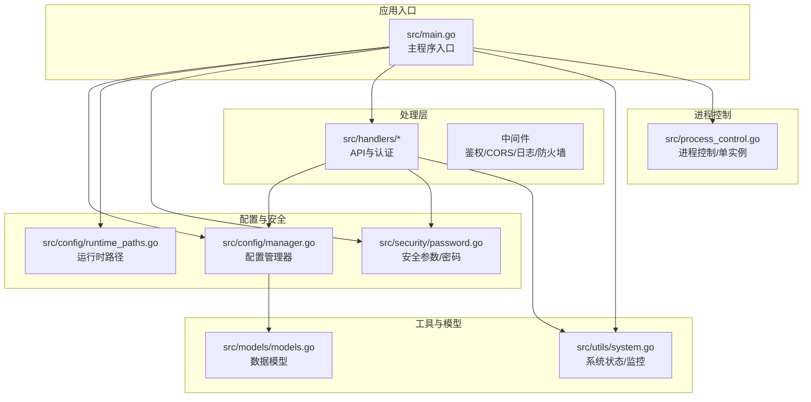
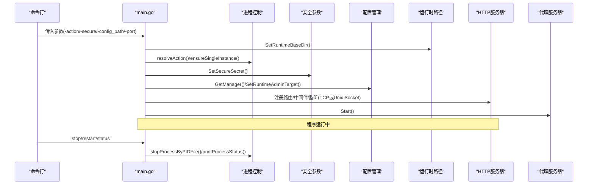
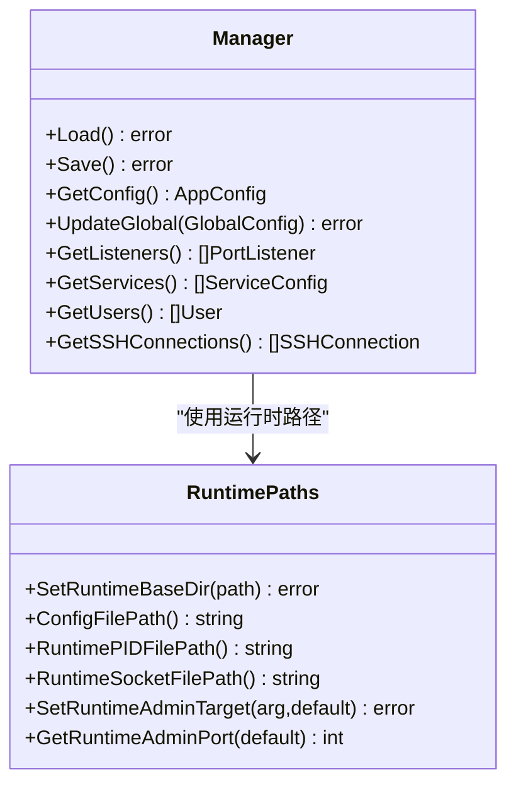
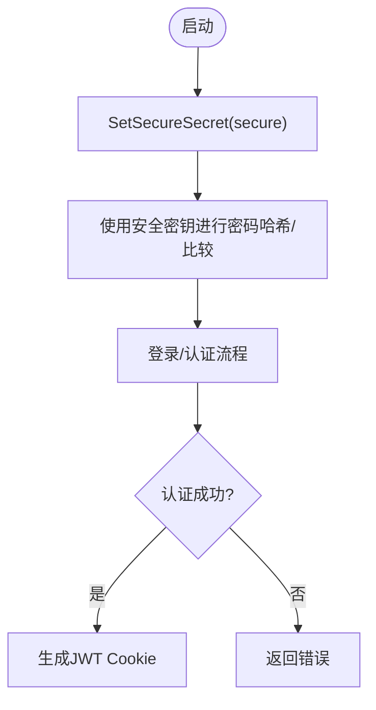
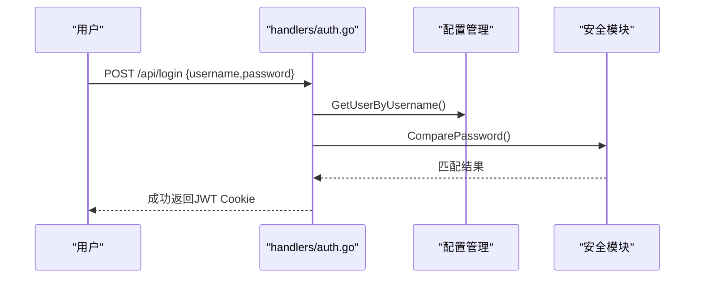
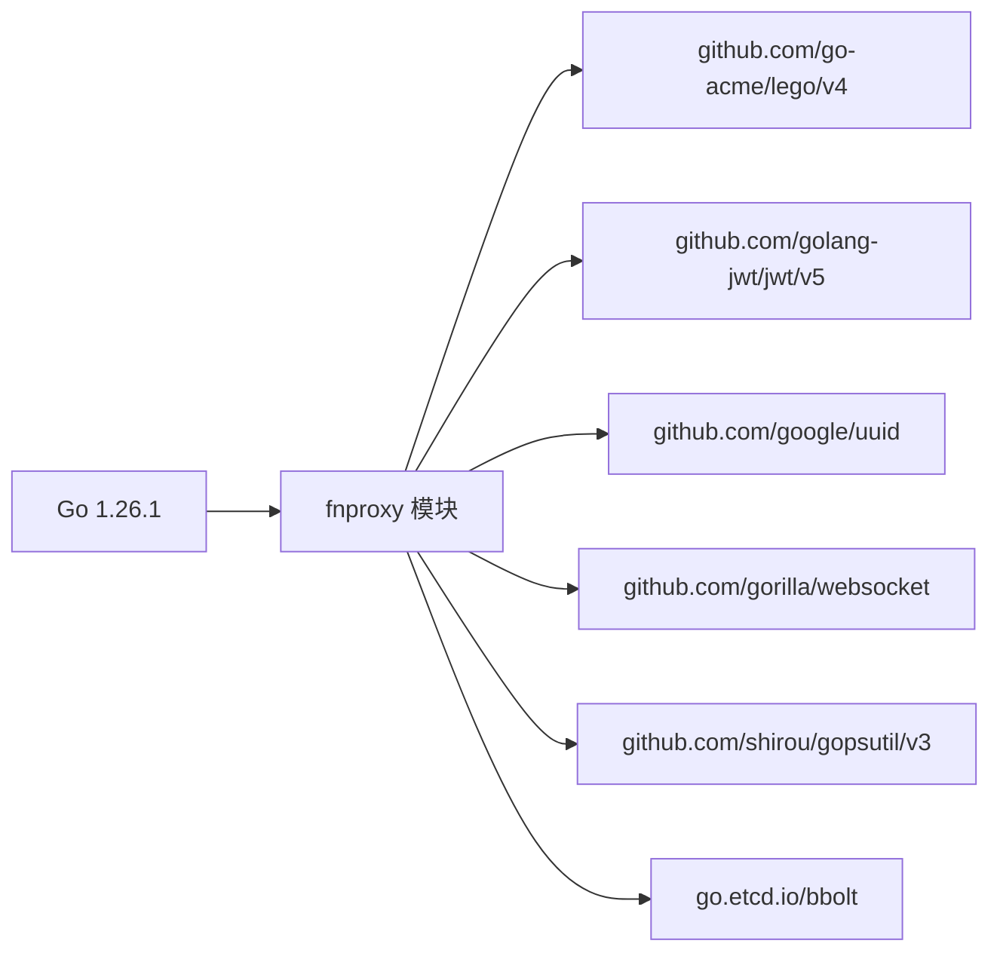

# 快速开始

<cite>
**本文引用的文件**
- [README.md](file://README.md)
- [src/main.go](file://src/main.go)
- [src/go.mod](file://src/go.mod)
- [src/config/manager.go](file://src/config/manager.go)
- [src/config/runtime_paths.go](file://src/config/runtime_paths.go)
- [src/security/password.go](file://src/security/password.go)
- [src/process_control.go](file://src/process_control.go)
- [src/handlers/auth.go](file://src/handlers/auth.go)
- [src/utils/system.go](file://src/utils/system.go)
- [src/models/models.go](file://src/models/models.go)
- [build.linux.sh](file://build.linux.sh)
- [build.windows.bat](file://build.windows.bat)
- [debug.bat](file://debug.bat)
</cite>

## 目录
1. [简介](#简介)
2. [项目结构](#项目结构)
3. [核心组件](#核心组件)
4. [架构总览](#架构总览)
5. [详细组件分析](#详细组件分析)
6. [依赖关系分析](#依赖关系分析)
7. [性能与并发特性](#性能与并发特性)
8. [安装与部署](#安装与部署)
9. [开发构建与交叉编译](#开发构建与交叉编译)
10. [本地调试与运行](#本地调试与运行)
11. [启动参数详解](#启动参数详解)
12. [首次部署最佳实践](#首次部署最佳实践)
13. [常见问题排查](#常见问题排查)
14. [结论](#结论)

## 简介
Caddy Panel 是一个基于 Go 的轻量级服务管理面板，提供统一的网站管理、反向代理、静态站点、跳转规则、证书管理、OAuth 访问控制、用户与 SSH 终端管理、运行状态监控等功能。前端静态资源已内嵌至可执行文件，运行时配置、缓存、证书与 PID 文件可统一落盘到由 -config_path 指定的目录，便于部署与备份。

## 项目结构
- 顶层目录包含构建脚本与文档，核心源码位于 src/，采用 Go Module 结构，go.mod 指明 Go 版本与依赖。
- 关键模块：
  - config：运行时路径解析、配置持久化与默认配置初始化
  - security：安全参数、密码哈希与比较
  - handlers：HTTP API 与认证处理
  - utils：系统状态采集、监控与证书管理
  - models：应用配置与运行时数据模型
  - process_control：进程控制与单实例保护
  - static：前端静态资源（内嵌）



图表来源
- [src/main.go:24-120](file://src/main.go#L24-L120)
- [src/config/manager.go:35-72](file://src/config/manager.go#L35-L72)
- [src/config/runtime_paths.go:31-59](file://src/config/runtime_paths.go#L31-L59)
- [src/security/password.go:30-42](file://src/security/password.go#L30-L42)
- [src/process_control.go:17-28](file://src/process_control.go#L17-L28)

章节来源
- [README.md:20-42](file://README.md#L20-L42)
- [src/go.mod:1-48](file://src/go.mod#L1-L48)

## 核心组件
- 进程控制与单实例保护：解析 action/status/stop/restart，确保同一时间只有一个实例运行。
- 配置管理：默认配置、持久化与归一化，含管理员端口、日志、证书同步等全局参数。
- 安全参数与密码：安全密钥用于密码摘要、OAuth 解密、SSH 密码加密等；默认安全密钥在未显式指定时使用。
- 认证与授权：JWT Cookie 登录、Header Token 鉴权、OAuth 登录页面与服务端公私钥。
- 监控与系统状态：CPU/内存/网络 IO/主机信息采集与格式化。
- 运行时路径：统一管理配置、缓存、证书、PID、Unix Socket 等文件位置。

章节来源
- [src/process_control.go:17-139](file://src/process_control.go#L17-L139)
- [src/config/manager.go:35-137](file://src/config/manager.go#L35-L137)
- [src/security/password.go:12-71](file://src/security/password.go#L12-L71)
- [src/handlers/auth.go:37-110](file://src/handlers/auth.go#L37-L110)
- [src/utils/system.go:19-82](file://src/utils/system.go#L19-L82)
- [src/config/runtime_paths.go:12-160](file://src/config/runtime_paths.go#L12-L160)

## 架构总览
应用启动流程概览：解析参数 -> 初始化运行目录与安全参数 -> 初始化配置与监听端口 -> 注册 API 与中间件 -> 启动代理与证书自动续期 -> 优雅关闭。



图表来源
- [src/main.go:24-120](file://src/main.go#L24-L120)
- [src/process_control.go:17-139](file://src/process_control.go#L17-L139)
- [src/security/password.go:30-42](file://src/security/password.go#L30-L42)
- [src/config/manager.go:35-72](file://src/config/manager.go#L35-L72)
- [src/config/runtime_paths.go:117-160](file://src/config/runtime_paths.go#L117-L160)

## 详细组件分析

### 进程控制与单实例保护
- 支持 status/stop/restart 动作解析与执行。
- 通过 PID 文件判断进程是否存在与运行状态，终止时等待退出并清理 PID 文件。
- 启动前检查 PID 文件，避免重复启动。

```mermaid
flowchart TD
Start(["启动"]) --> Parse["解析 action 参数"]
Parse --> Action{"status/stop/restart?"}
Action --> |status| CheckPID["读取PID文件"]
CheckPID --> Running{"进程运行中?"}
Running --> |是| PrintRun["打印运行信息"]
Running --> |否| PrintNotRun["打印未运行/清理失效PID"]
Action --> |stop| Stop["终止进程并清理PID"]
Action --> |restart| StopRestart["停止旧进程并准备重启"]
Action --> |""| Ensure["单实例保护"]
Ensure --> Run["进入运行阶段"]
```

图表来源
- [src/process_control.go:17-139](file://src/process_control.go#L17-L139)

章节来源
- [src/process_control.go:17-139](file://src/process_control.go#L17-L139)

### 配置管理与运行时路径
- 默认配置包含管理员端口、日志、最大日志条数、证书同步策略等。
- 运行时路径统一管理配置文件、缓存、证书、PID、Unix Socket 等。
- 管理端口支持 TCP 端口或 Unix Socket 模式。



图表来源
- [src/config/manager.go:35-137](file://src/config/manager.go#L35-L137)
- [src/config/runtime_paths.go:31-160](file://src/config/runtime_paths.go#L31-L160)

章节来源
- [src/config/manager.go:35-137](file://src/config/manager.go#L35-L137)
- [src/config/runtime_paths.go:31-160](file://src/config/runtime_paths.go#L31-L160)

### 安全参数与密码
- 安全密钥用于密码摘要、OAuth 解密、SSH 密码加密等。
- 默认安全密钥在未显式指定时使用，生产环境建议显式指定。



图表来源
- [src/security/password.go:30-71](file://src/security/password.go#L30-L71)
- [src/handlers/auth.go:37-76](file://src/handlers/auth.go#L37-L76)

章节来源
- [src/security/password.go:12-71](file://src/security/password.go#L12-L71)
- [src/handlers/auth.go:37-76](file://src/handlers/auth.go#L37-L76)

### 认证与授权
- 管理后台登录：用户名密码登录，成功后写入 JWT Cookie。
- Header Token 鉴权：支持 Authorization: Bearer 与 Auth 头，匹配用户 token 即视为已登录。
- OAuth 登录：服务级启用 OAuth 后，未登录访问会跳转到服务下的 /OAuth 页面。



图表来源
- [src/handlers/auth.go:37-76](file://src/handlers/auth.go#L37-L76)
- [src/config/manager.go:518-544](file://src/config/manager.go#L518-L544)
- [src/security/password.go:54-71](file://src/security/password.go#L54-L71)

章节来源
- [src/handlers/auth.go:37-198](file://src/handlers/auth.go#L37-L198)
- [src/config/manager.go:518-544](file://src/config/manager.go#L518-L544)
- [src/security/password.go:54-71](file://src/security/password.go#L54-L71)

### 监控与系统状态
- 采集 CPU 使用率、内存占用、网络 IO、主机信息等。
- 提供格式化函数与运行时统计结构。

```mermaid
classDiagram
class SystemUtils {
+GetServerStatus() map[string]interface{}
+FormatBytes(bytes) string
+GetHostname() string
+GetGoVersion() string
}
class Models {
+ServerStatus
+RuntimeStats
+NetworkSample
}
SystemUtils --> Models : "返回状态数据"
```

图表来源
- [src/utils/system.go:19-82](file://src/utils/system.go#L19-L82)
- [src/models/models.go:7-51](file://src/models/models.go#L7-L51)

章节来源
- [src/utils/system.go:19-82](file://src/utils/system.go#L19-L82)
- [src/models/models.go:7-51](file://src/models/models.go#L7-L51)

## 依赖关系分析
- Go 版本要求：1.26.1+
- 主要依赖：ACME 证书、JWT、UUID、WebSocket、系统指标采集、BoltDB 等。



图表来源
- [src/go.mod:3-47](file://src/go.mod#L3-L47)

章节来源
- [src/go.mod:3-47](file://src/go.mod#L3-L47)

## 性能与并发特性
- 单实例保护：通过 PID 文件避免重复启动。
- 优雅关闭：捕获信号，关闭代理、WebSocket 会话与 HTTP 服务器。
- 并发：配置管理器内部使用互斥锁保证读写一致性；系统状态采集使用 gopsutil 异步查询。

章节来源
- [src/process_control.go:129-139](file://src/process_control.go#L129-L139)
- [src/main.go:482-515](file://src/main.go#L482-L515)
- [src/config/manager.go:18-30](file://src/config/manager.go#L18-L30)

## 安装与部署
- 环境要求
  - Go 1.26.1 或更高版本
  - Windows / Linux
  - 现代浏览器
- 快速开始
  - 在项目根目录执行开发构建命令，或使用提供的构建脚本。
  - 直接运行生成的可执行文件，或使用 debug.bat 在 debug 目录启动以便隔离运行期配置。

章节来源
- [README.md:44-96](file://README.md#L44-L96)

## 开发构建与交叉编译
- 开发构建
  - 在 src 目录下执行 go build，输出到 build/ 目录。
- Windows 构建
  - 使用 build.windows.bat 一键构建 Windows 可执行文件。
- Linux 构建
  - 使用 build.linux.sh 一键构建 Linux 可执行文件。
- 交叉编译
  - Windows 下可使用 build.linux.bat 交叉编译 Linux 可执行文件。

章节来源
- [README.md:52-76](file://README.md#L52-L76)
- [build.linux.sh:1-13](file://build.linux.sh#L1-L13)
- [build.windows.bat:1-21](file://build.windows.bat#L1-L21)
- [debug.bat:1-27](file://debug.bat#L1-L27)

## 本地调试与运行
- 使用 debug.bat
  - 先编译调试版可执行文件，再从项目根目录下的 debug/ 目录启动程序，便于隔离运行期配置与证书文件。
- 直接运行
  - 在 Windows/Linux 分别运行对应平台的可执行文件。

章节来源
- [README.md:78-96](file://README.md#L78-L96)
- [debug.bat:13-26](file://debug.bat#L13-L26)

## 启动参数详解
- -secure
  - 用于密码摘要、OAuth 登录加解密、SSH 密码加密等安全相关逻辑。
  - 未指定时默认值为 123456。
- -config_path
  - 指定运行时根目录。配置文件、缓存、证书、PID 文件、Socket 文件都会落到该目录下。
- -port
  - 设置管理端监听方式。
  - 传数字表示 TCP 端口，例如 -port=8080。
  - 传 sock 表示使用 Unix Socket。
- status 或 -action=status
  - 根据 PID 文件判断程序是否运行。
- stop 或 -action=stop
  - 根据 PID 文件停止当前进程。
- restart 或 -action=restart
  - 先停止旧进程，再启动新进程。

章节来源
- [README.md:105-154](file://README.md#L105-L154)
- [src/main.go:24-34](file://src/main.go#L24-L34)
- [src/process_control.go:17-28](file://src/process_control.go#L17-L28)
- [src/config/runtime_paths.go:117-160](file://src/config/runtime_paths.go#L117-L160)
- [src/security/password.go:12-15](file://src/security/password.go#L12-L15)

## 首次部署最佳实践
- 修改默认密码
  - 默认用户名：admin，默认密码：admin。首次部署到生产环境后，务必立即修改密码。
- 生产环境安全配置
  - 显式指定 -secure 参数，避免使用默认安全密钥。
  - 将 -config_path 指向专用目录，集中管理配置、缓存、证书与 PID 文件。
  - 使用 -port=9090 或其他非 80/443 端口运行管理后台，避免与业务端口冲突。
- 运行期文件
  - 当设置 -config_path 后，主配置文件、监控缓存文件、证书目录、PID 文件、Unix Socket 文件都会统一放到该目录下，便于部署与备份。

章节来源
- [README.md:98-103](file://README.md#L98-L103)
- [README.md:156-166](file://README.md#L156-L166)
- [src/config/runtime_paths.go:85-115](file://src/config/runtime_paths.go#L85-L115)

## 常见问题排查
- 启动失败：检测到程序已在运行
  - 检查 PID 文件是否存在且指向的进程是否仍在运行；必要时手动清理失效 PID 文件。
- 管理后台无法访问
  - 检查 -port 参数是否正确，TCP 端口是否被占用；或使用 -port=sock 切换到 Unix Socket。
- 认证失败
  - 确认用户名与密码正确；若使用 Header Token 鉴权，请确认请求头格式与用户 token 一致。
- 证书问题
  - 若使用 ACME 申请证书，请检查 DNS 提供商配置与网络连通性；外部证书同步周期可在全局配置中调整。
- 进程控制
  - 使用 status 查看运行状态；使用 stop 停止；使用 restart 先停止再启动。

章节来源
- [src/process_control.go:111-139](file://src/process_control.go#L111-L139)
- [src/config/runtime_paths.go:117-160](file://src/config/runtime_paths.go#L117-L160)
- [src/handlers/auth.go:37-76](file://src/handlers/auth.go#L37-L76)
- [src/config/manager.go:109-137](file://src/config/manager.go#L109-L137)

## 结论
Caddy Panel 提供了完整的服务管理能力，具备良好的可移植性与安全性。通过明确的启动参数、统一的运行时路径与严格的单实例保护，能够在生产环境中稳定运行。建议在首次部署时修改默认密码并显式指定安全参数，结合 -config_path 实现集中化运维与备份。