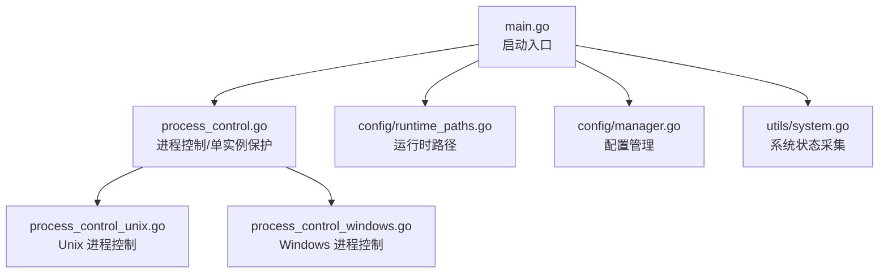
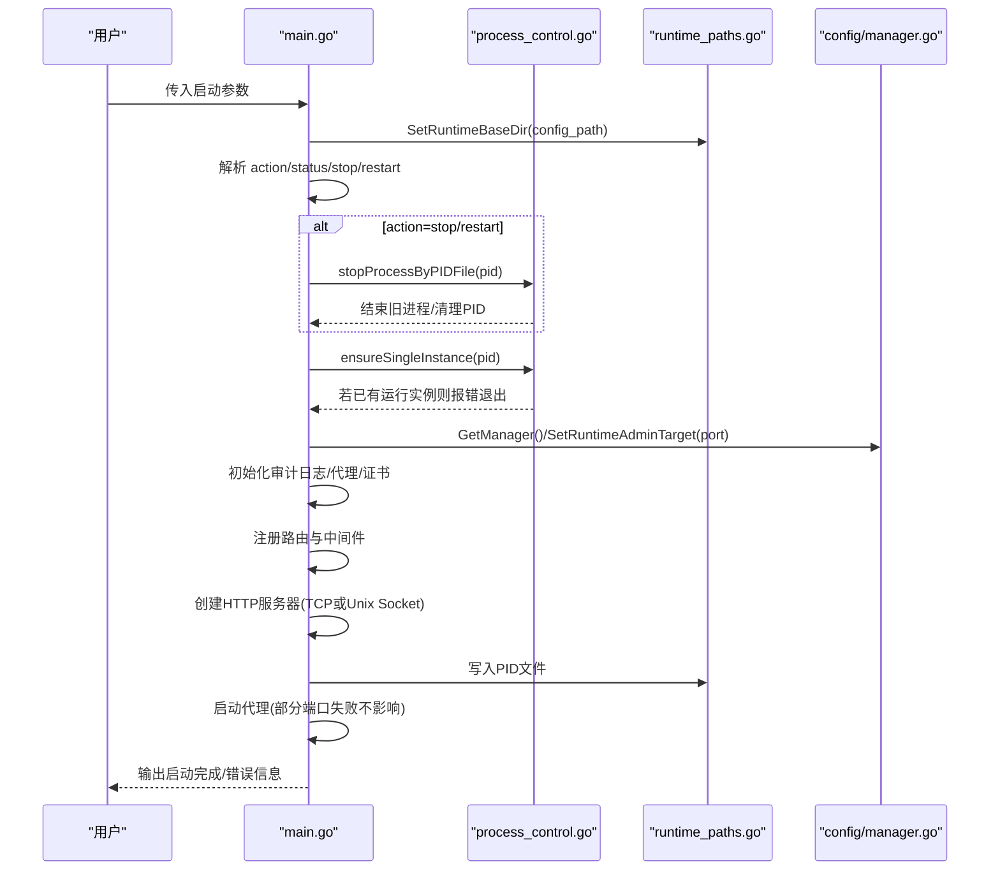
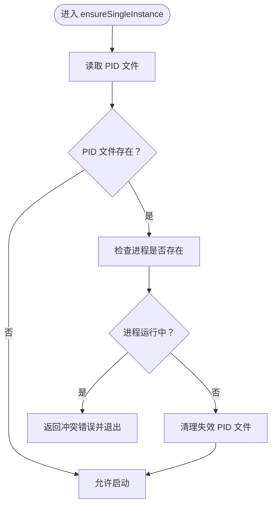
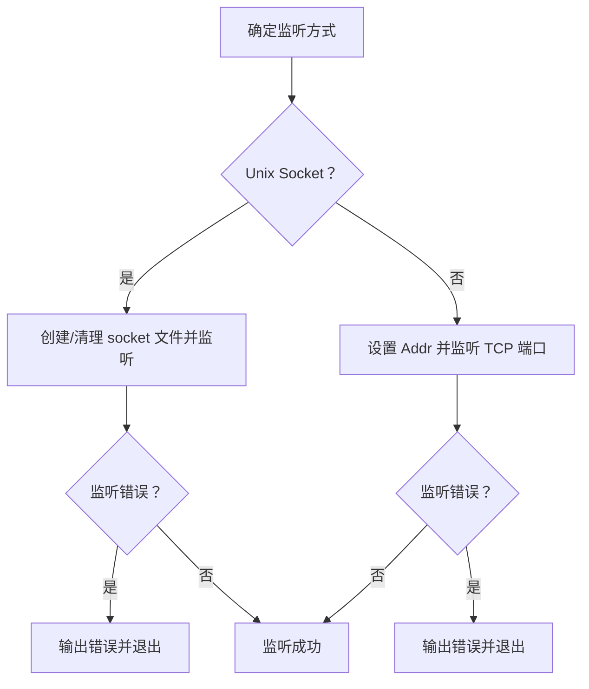
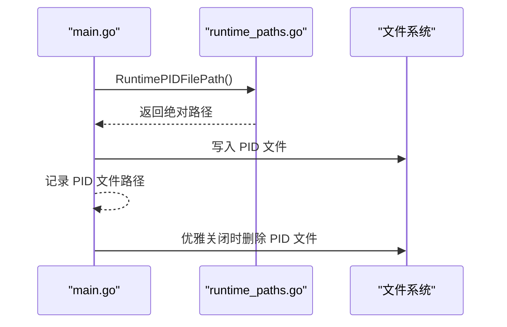
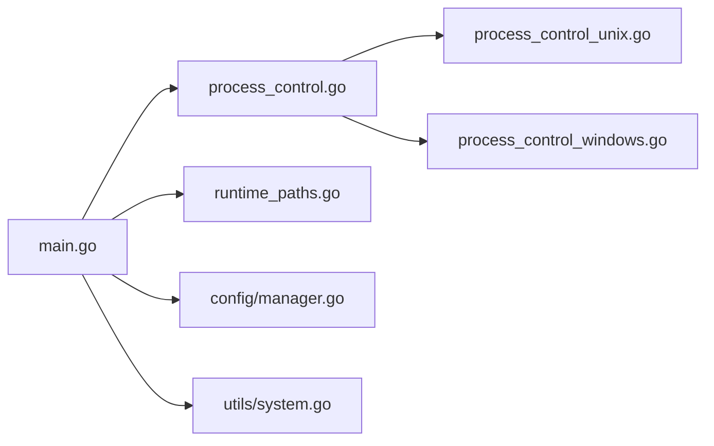

# 启动问题

<cite>
**本文引用的文件**
- [src/main.go](file://src/main.go)
- [src/process_control.go](file://src/process_control.go)
- [src/process_control_unix.go](file://src/process_control_unix.go)
- [src/process_control_windows.go](file://src/process_control_windows.go)
- [src/config/runtime_paths.go](file://src/config/runtime_paths.go)
- [src/config/manager.go](file://src/config/manager.go)
- [src/utils/system.go](file://src/utils/system.go)
- [src/go.mod](file://src/go.mod)
- [README.md](file://README.md)
- [build.windows.bat](file://build.windows.bat)
- [build.linux.sh](file://build.linux.sh)
- [debug.bat](file://debug.bat)
</cite>

## 目录
1. [简介](#简介)
2. [项目结构](#项目结构)
3. [核心组件](#核心组件)
4. [架构总览](#架构总览)
5. [详细组件分析](#详细组件分析)
6. [依赖分析](#依赖分析)
7. [性能考虑](#性能考虑)
8. [故障排除指南](#故障排除指南)
9. [结论](#结论)
10. [附录](#附录)

## 简介
本指南聚焦 Caddy Panel（项目中的 fnproxy 面板）启动失败的系统化排查方法，覆盖端口占用、权限不足、配置文件错误、单实例保护冲突等常见问题，并提供 PID 文件、进程状态、端口监听状态的检查步骤，以及 Linux 与 Windows 平台的差异化诊断要点。同时解释单实例保护机制、启动参数与环境变量验证、依赖项检查与启动日志分析技巧。

## 项目结构
- 启动入口位于主程序，负责解析启动参数、初始化运行目录、单实例保护、管理端监听、写入 PID 文件、启动代理与证书续期、优雅关闭。
- 进程控制模块提供 status/stop/restart 功能与单实例保护。
- 运行时路径模块统一管理配置、PID、Socket、缓存、证书等文件路径。
- 配置管理模块负责应用配置的加载、保存与规范化。
- 系统工具模块提供运行时状态采集（CPU、内存、网络 IO、主机信息）。

**图示来源**
- [src/main.go:24-138](file://src/main.go#L24-L138)
- [src/process_control.go:17-138](file://src/process_control.go#L17-L138)
- [src/config/runtime_paths.go:31-160](file://src/config/runtime_paths.go#L31-L160)
- [src/config/manager.go:35-72](file://src/config/manager.go#L35-L72)
- [src/utils/system.go:19-82](file://src/utils/system.go#L19-L82)

**章节来源**
- [src/main.go:24-138](file://src/main.go#L24-L138)
- [src/process_control.go:17-138](file://src/process_control.go#L17-L138)
- [src/config/runtime_paths.go:31-160](file://src/config/runtime_paths.go#L31-L160)
- [src/config/manager.go:35-72](file://src/config/manager.go#L35-L72)
- [src/utils/system.go:19-82](file://src/utils/system.go#L19-L82)

## 核心组件
- 启动参数与运行目录
  - -secure：安全参数，用于密码摘要、OAuth 解密、SSH 加密等；未指定时使用默认值，生产环境建议显式指定。
  - -config_path：运行时根目录，配置、缓存、证书、PID、Socket 文件均落于此目录。
  - -port：管理端监听方式，数字表示 TCP 端口，sock 表示 Unix Socket。
  - status/stop/restart：进程控制动作，配合 PID 文件执行。
- 单实例保护
  - 启动前读取 PID 文件，若目标 PID 存在且进程仍在运行，则拒绝启动。
- 管理端监听
  - 支持 TCP 端口与 Unix Socket；TCP 默认端口来自配置管理器的全局配置。
- PID 文件
  - 启动成功后写入 PID 文件；优雅关闭时删除。
- 代理与证书
  - 启动代理服务器，部分端口启动失败会记录错误但不影响整体运行。

**章节来源**
- [README.md:105-155](file://README.md#L105-L155)
- [src/main.go:24-94](file://src/main.go#L24-L94)
- [src/main.go:45-77](file://src/main.go#L45-L77)
- [src/main.go:467-473](file://src/main.go#L467-L473)
- [src/config/runtime_paths.go:89-95](file://src/config/runtime_paths.go#L89-L95)
- [src/config/manager.go:35-72](file://src/config/manager.go#L35-L72)

## 架构总览
启动流程的关键节点如下：
- 解析启动参数与运行目录
- 解析 action（status/stop/restart）
- 单实例保护（读取 PID 文件并检查进程）
- 设置安全参数与配置管理器
- 初始化审计日志、代理服务器、证书管理器
- 注册路由与中间件
- 创建 HTTP 服务器（TCP 或 Unix Socket）
- 写入 PID 文件
- 启动代理（部分端口失败不影响整体）
- 优雅关闭信号处理

**图示来源**
- [src/main.go:24-138](file://src/main.go#L24-L138)
- [src/process_control.go:84-138](file://src/process_control.go#L84-L138)
- [src/config/runtime_paths.go:31-160](file://src/config/runtime_paths.go#L31-L160)
- [src/config/manager.go:35-72](file://src/config/manager.go#L35-L72)

## 详细组件分析

### 单实例保护机制
- 读取 PID 文件，若文件不存在或内容为空/非法，视为无运行实例。
- 若 PID 文件存在，尝试探测进程是否存在：
  - Unix：发送信号 0 判断；无权限时按“存在”处理。
  - Windows：打开进程句柄并查询退出码；无效参数视为不存在；拒绝访问视为存在。
- 若进程存在，直接报错并退出，避免重复启动。
- 若进程不存在，清理失效 PID 文件后允许启动。

**图示来源**
- [src/process_control.go:129-138](file://src/process_control.go#L129-L138)
- [src/process_control_unix.go:11-23](file://src/process_control_unix.go#L11-L23)
- [src/process_control_windows.go:14-32](file://src/process_control_windows.go#L14-L32)

**章节来源**
- [src/process_control.go:129-138](file://src/process_control.go#L129-L138)
- [src/process_control_unix.go:11-23](file://src/process_control_unix.go#L11-L23)
- [src/process_control_windows.go:14-32](file://src/process_control_windows.go#L14-L32)

### 管理端监听与端口占用
- 管理端监听支持 TCP 端口与 Unix Socket：
  - TCP：默认端口来自配置管理器，可通过 -port 覆盖。
  - Unix Socket：在 -config_path 目录下创建 .sock 文件。
- 监听失败会直接报错并退出，常见原因为端口被占用或权限不足。
- 业务监听（代理）启动失败时会记录错误但不影响管理端运行。

**图示来源**
- [src/main.go:441-458](file://src/main.go#L441-L458)
- [src/config/runtime_paths.go:93-95](file://src/config/runtime_paths.go#L93-L95)

**章节来源**
- [src/main.go:441-458](file://src/main.go#L441-L458)
- [src/config/runtime_paths.go:93-95](file://src/config/runtime_paths.go#L93-L95)

### PID 文件与进程状态
- PID 文件路径由运行时路径模块统一管理，位于 -config_path 指定目录。
- 启动成功后写入 PID 文件；优雅关闭时删除。
- status/stop/restart 均依赖 PID 文件进行判断与操作。

**图示来源**
- [src/config/runtime_paths.go:89-91](file://src/config/runtime_paths.go#L89-L91)
- [src/main.go:467-473](file://src/main.go#L467-L473)
- [src/main.go:510-512](file://src/main.go#L510-L512)

**章节来源**
- [src/config/runtime_paths.go:89-91](file://src/config/runtime_paths.go#L89-L91)
- [src/main.go:467-473](file://src/main.go#L467-L473)
- [src/main.go:510-512](file://src/main.go#L510-L512)

### 启动参数与环境变量验证
- 启动参数
  - -secure：安全参数，未指定时使用默认值，生产环境必须显式指定。
  - -config_path：运行时根目录，需具备写权限。
  - -port：数字端口或 sock；sock 时需确保 -config_path 目录可写。
  - action：status/stop/restart。
- 环境变量
  - 构建时使用 CGO_ENABLED、GOOS、GOARCH；运行时建议确保 PATH 与工作目录正确。
- 依赖项
  - Go 版本要求与第三方库版本在 go.mod 中声明。

**章节来源**
- [README.md:105-155](file://README.md#L105-L155)
- [src/go.mod:3-47](file://src/go.mod#L3-L47)
- [build.windows.bat:8-13](file://build.windows.bat#L8-L13)
- [build.linux.sh:9-12](file://build.linux.sh#L9-L12)

## 依赖分析
- 启动入口依赖进程控制模块进行单实例保护，依赖运行时路径模块定位配置与 PID 文件，依赖配置管理器初始化全局配置与管理端口。
- 进程控制模块在不同平台使用不同的系统调用实现进程探测与终止。
- 系统工具模块提供运行时状态采集，辅助诊断资源使用情况。

**图示来源**
- [src/main.go:24-138](file://src/main.go#L24-L138)
- [src/process_control.go:17-138](file://src/process_control.go#L17-L138)
- [src/config/runtime_paths.go:31-160](file://src/config/runtime_paths.go#L31-L160)
- [src/config/manager.go:35-72](file://src/config/manager.go#L35-L72)
- [src/utils/system.go:19-82](file://src/utils/system.go#L19-L82)

**章节来源**
- [src/main.go:24-138](file://src/main.go#L24-L138)
- [src/process_control.go:17-138](file://src/process_control.go#L17-L138)
- [src/config/runtime_paths.go:31-160](file://src/config/runtime_paths.go#L31-L160)
- [src/config/manager.go:35-72](file://src/config/manager.go#L35-L72)
- [src/utils/system.go:19-82](file://src/utils/system.go#L19-L82)

## 性能考虑
- 启动阶段按端口逐个尝试加载业务监听，某端口启动失败不影响其他端口与管理端运行，有利于快速定位冲突端口。
- 管理端监听优先绑定成功，再启动业务监听，减少管理端可用性风险。
- 日志与监控缓存落盘，避免长期运行内存占用过高。

**章节来源**
- [src/main.go:475-477](file://src/main.go#L475-L477)
- [src/main.go:87-88](file://src/main.go#L87-L88)

## 故障排除指南

### 一、启动失败的常见原因与解决步骤
- 端口占用
  - 现象：管理端监听失败并退出。
  - 排查：检查 -port 指定的端口是否被其他程序占用；如为 Unix Socket，检查 -config_path 目录下 .sock 文件是否存在且可写。
  - 解决：更换端口或释放占用端口；确保 -config_path 目录具备写权限。
- 权限不足
  - 现象：写入 PID 文件失败、监听失败、无法创建目录。
  - 排查：确认运行账户对 -config_path 目录具有读写权限；Unix Socket 需要目录可写。
  - 解决：提升目录权限或将 -config_path 指向有权限的目录。
- 配置文件错误
  - 现象：配置加载失败或保存失败。
  - 排查：检查 -config_path 下的配置文件是否为合法 JSON；确认配置字段符合预期。
  - 解决：修正配置文件或删除后让程序重新生成默认配置。
- 单实例保护冲突
  - 现象：启动时报“检测到程序已在运行”。
  - 排查：检查 PID 文件是否存在且指向的进程是否仍在运行；若进程不存在，清理失效 PID 文件。
  - 解决：使用 stop 或 restart 清理旧进程；或手动删除 PID 文件后重启。

**章节来源**
- [src/main.go:453-456](file://src/main.go#L453-L456)
- [src/main.go:467-473](file://src/main.go#L467-L473)
- [src/config/manager.go:75-93](file://src/config/manager.go#L75-L93)
- [src/process_control.go:129-138](file://src/process_control.go#L129-L138)

### 二、检查 PID 文件、进程状态与端口监听状态
- 检查 PID 文件
  - 路径：通过 -config_path 指定目录下的 fnproxy.pid。
  - 方法：使用 status 动作查看状态；若进程不存在会提示清理失效 PID 文件。
- 检查进程状态
  - 使用 status 动作查看 PID 与运行状态；stop/restart 动作可停止或重启进程。
- 检查端口监听状态
  - TCP：使用系统工具（如 netstat/ss/lsof）查看端口占用；确认 -port 是否被占用。
  - Unix Socket：检查 -config_path 下 .sock 文件是否存在且可访问。

**章节来源**
- [src/process_control.go:111-127](file://src/process_control.go#L111-L127)
- [src/config/runtime_paths.go:89-95](file://src/config/runtime_paths.go#L89-L95)

### 三、不同操作系统下的启动诊断
- Linux
  - 使用 ss/netstat 查看端口占用；确认 -config_path 目录可写；必要时使用 sudo 提升权限。
  - 使用 status/stop/restart 动作进行进程控制。
- Windows
  - 使用 Get-NetTCPConnection（PowerShell）或 netstat 查看端口占用；确认 -config_path 目录权限。
  - 使用 stop/restart 动作清理旧进程；若进程长时间无响应，可手动结束对应 PID 进程。

**章节来源**
- [src/process_control_unix.go:11-34](file://src/process_control_unix.go#L11-L34)
- [src/process_control_windows.go:14-48](file://src/process_control_windows.go#L14-L48)

### 四、单实例保护机制详解与常见冲突场景
- 工作原理
  - 启动前读取 PID 文件；若进程存在则拒绝启动；若进程不存在则清理失效 PID 文件并允许启动。
- 常见冲突
  - 旧进程未正常退出导致 PID 文件残留；使用 stop/restart 清理。
  - 多实例同时启动；通过 ensureSingleInstance 防止。
- 处理建议
  - 使用 stop/restart 动作；若 PID 文件异常，手动删除后重启。

**章节来源**
- [src/process_control.go:129-138](file://src/process_control.go#L129-L138)

### 五、启动参数验证、环境变量检查与依赖项验证
- 启动参数
  - -secure：生产环境必须显式指定；未指定使用默认值仅适合开发。
  - -config_path：必须为绝对路径或相对路径转换后的绝对路径；需可写。
  - -port：数字端口范围 1-65535 或 sock；sock 需 -config_path 可写。
- 环境变量
  - 构建：CGO_ENABLED、GOOS、GOARCH；运行：PATH、工作目录。
- 依赖项
  - Go 版本与第三方库版本见 go.mod；确保依赖完整。

**章节来源**
- [README.md:105-155](file://README.md#L105-L155)
- [src/config/runtime_paths.go:31-59](file://src/config/runtime_paths.go#L31-L59)
- [src/config/runtime_paths.go:117-141](file://src/config/runtime_paths.go#L117-L141)
- [src/go.mod:3-47](file://src/go.mod#L3-L47)

### 六、启动日志分析与关键错误信息识别
- 管理端监听失败
  - 关键信息：启动管理后台失败；监听错误。
  - 排查：确认端口占用、权限、Unix Socket 文件。
- 写入 PID 文件失败
  - 关键信息：创建 PID 目录失败、写入 PID 文件失败。
  - 排查：检查 -config_path 目录权限与磁盘空间。
- 代理端口启动失败
  - 关键信息：部分端口启动失败，程序将继续运行。
  - 排查：逐个检查业务监听配置与端口占用。
- 单实例冲突
  - 关键信息：检测到程序已在运行，PID=...，PID 文件=...。
  - 排查：清理旧进程或 PID 文件后重启。

**章节来源**
- [src/main.go:446-448](file://src/main.go#L446-L448)
- [src/main.go:468-470](file://src/main.go#L468-L470)
- [src/main.go:475-477](file://src/main.go#L475-L477)
- [src/process_control.go:134-136](file://src/process_control.go#L134-L136)

## 结论
启动问题多源于端口占用、权限不足、配置错误与单实例保护冲突。通过规范的启动参数与运行目录设置、严格的权限管理、PID 文件与进程状态检查，以及针对不同平台的诊断手段，可高效定位并解决问题。生产环境务必显式指定安全参数与运行目录，避免默认值带来的安全与运维风险。

## 附录
- 快速检查清单
  - 确认 -port 未被占用；或改用 sock 并确保 -config_path 可写。
  - 确认 -config_path 目录具备读写权限。
  - 使用 status/stop/restart 动作检查与清理进程。
  - 如遇单实例冲突，清理 PID 文件后重启。
  - 生产环境显式指定 -secure，避免使用默认值。