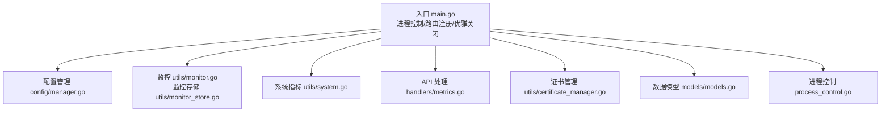
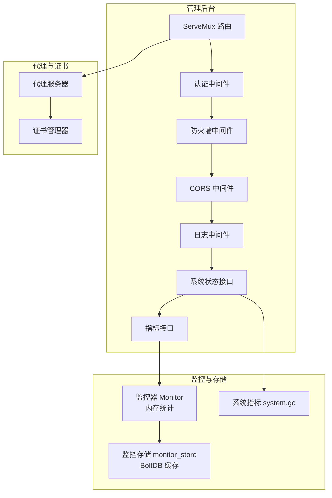
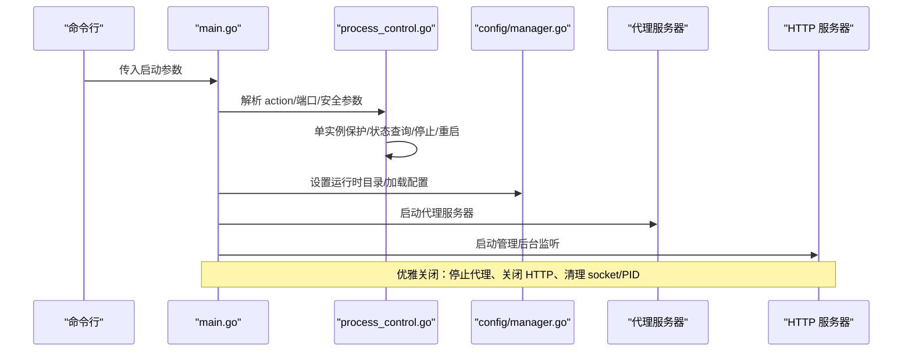
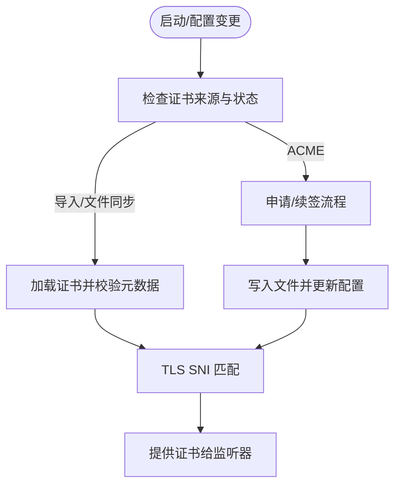
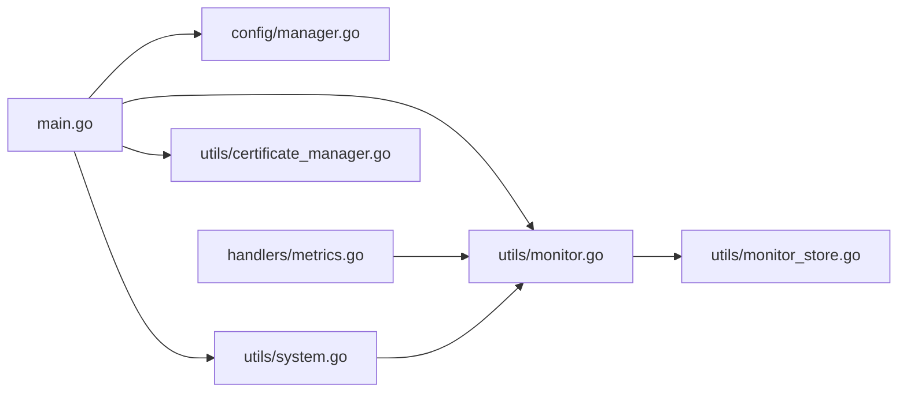

# 性能问题

<cite>
**本文引用的文件**
- [src/main.go](file://src/main.go)
- [src/utils/monitor.go](file://src/utils/monitor.go)
- [src/utils/monitor_store.go](file://src/utils/monitor_store.go)
- [src/handlers/metrics.go](file://src/handlers/metrics.go)
- [src/utils/system.go](file://src/utils/system.go)
- [src/config/manager.go](file://src/config/manager.go)
- [src/models/models.go](file://src/models/models.go)
- [src/process_control.go](file://src/process_control.go)
- [src/utils/certificate_manager.go](file://src/utils/certificate_manager.go)
- [README.md](file://README.md)
- [documents/ui-listener-fixes-20260311.md](file://documents/ui-listener-fixes-20260311.md)
</cite>

## 目录
1. [简介](#简介)
2. [项目结构](#项目结构)
3. [核心组件](#核心组件)
4. [架构总览](#架构总览)
5. [详细组件分析](#详细组件分析)
6. [依赖分析](#依赖分析)
7. [性能考量](#性能考量)
8. [故障排查指南](#故障排查指南)
9. [结论](#结论)
10. [附录](#附录)

## 简介
本指南面向 Caddy Panel 的运维与开发人员，聚焦于系统运行期间的性能问题诊断与优化。内容覆盖 CPU 使用率过高、内存泄漏、磁盘 I/O 瓶颈、网络带宽饱和等常见性能问题，结合系统监控指标采集与分析方法，解释性能监控工具的使用与关键指标解读，提供瓶颈识别与优化策略（配置调优、资源分配、并发控制），并给出负载测试与性能基准测试的实施建议，以及缓存策略与数据存储优化的最佳实践。

## 项目结构
Caddy Panel 是一个基于 Go 的服务管理面板，采用模块化组织，核心模块包括：
- 入口与进程控制：main.go、process_control.go
- 配置管理：config/manager.go
- 监控与指标：utils/monitor.go、utils/monitor_store.go、utils/system.go、handlers/metrics.go
- 数据模型：models/models.go
- 证书管理：utils/certificate_manager.go
- 文档与说明：README.md、documents/ui-listener-fixes-20260311.md



图示来源
- [src/main.go:24-516](file://src/main.go#L24-L516)
- [src/config/manager.go:1-791](file://src/config/manager.go#L1-L791)
- [src/utils/monitor.go:1-386](file://src/utils/monitor.go#L1-L386)
- [src/utils/monitor_store.go:1-208](file://src/utils/monitor_store.go#L1-L208)
- [src/utils/system.go:1-124](file://src/utils/system.go#L1-L124)
- [src/handlers/metrics.go:1-53](file://src/handlers/metrics.go#L1-L53)
- [src/utils/certificate_manager.go:1-800](file://src/utils/certificate_manager.go#L1-L800)
- [src/models/models.go:1-394](file://src/models/models.go#L1-L394)
- [src/process_control.go:1-139](file://src/process_control.go#L1-L139)

章节来源
- [src/main.go:24-516](file://src/main.go#L24-L516)
- [README.md:1-256](file://README.md#L1-L256)

## 核心组件
- 进程与启动控制：负责单实例保护、进程状态查询、优雅关闭、管理后台监听（TCP/Unix Socket）、代理服务器启动与停止。
- 配置管理：全局配置、监听器、服务、证书、用户、防火墙等配置的加载、保存与规范化。
- 运行时监控：实时统计监听器与服务的请求数、活跃连接数、总流量与速率，网络 IO 采样与落盘缓存。
- 系统指标采集：CPU 使用率、内存占用、网络收发总量与速率、主机信息。
- API 指标接口：对外暴露监听统计、服务统计、网络历史、访问日志等接口。
- 证书管理：导入、ACME 申请与自动续期、文件同步、运行时加载与 SNI 匹配。

章节来源
- [src/process_control.go:1-139](file://src/process_control.go#L1-L139)
- [src/config/manager.go:1-791](file://src/config/manager.go#L1-L791)
- [src/utils/monitor.go:1-386](file://src/utils/monitor.go#L1-L386)
- [src/utils/monitor_store.go:1-208](file://src/utils/monitor_store.go#L1-L208)
- [src/utils/system.go:1-124](file://src/utils/system.go#L1-L124)
- [src/handlers/metrics.go:1-53](file://src/handlers/metrics.go#L1-L53)
- [src/utils/certificate_manager.go:1-800](file://src/utils/certificate_manager.go#L1-L800)

## 架构总览
系统采用“HTTP 服务 + 代理服务 + 监控与存储”的架构。入口 main.go 注册管理后台 API 与静态资源，挂载认证、防火墙、CORS、日志等中间件，启动 HTTP 服务器与代理服务器。监控模块在内存中维护运行时统计，在后台定时采样网络 IO 并落盘到 BoltDB 缓存，API 层提供指标查询接口。



图示来源
- [src/main.go:112-431](file://src/main.go#L112-L431)
- [src/utils/monitor.go:38-117](file://src/utils/monitor.go#L38-L117)
- [src/utils/monitor_store.go:26-100](file://src/utils/monitor_store.go#L26-L100)
- [src/utils/system.go:19-82](file://src/utils/system.go#L19-L82)
- [src/utils/certificate_manager.go:126-166](file://src/utils/certificate_manager.go#L126-L166)

## 详细组件分析

### 监控与指标组件
- 监控器 Monitor：维护监听器与服务的运行时统计（请求数、活跃连接、总流量、速率），并定期采样系统网络 IO，生成网络采样点并写入监控存储。
- 监控存储 monitor_store：基于 BoltDB 的只增型存储，分别维护网络采样与访问日志，提供按时间范围查询与裁剪（按保留天数与最大条数）。
- 系统指标 system.go：采集 CPU 使用率、内存占用、网络收发总量与速率、主机信息。
- 指标 API handlers/metrics.go：提供网络历史、监听统计、服务统计、访问日志查询接口。

```mermaid
classDiagram
class Monitor {
+BeginRequest(listener, service)
+RecordRequest(listener, service, req, status, bytesOut, duration, username, writeLog)
+GetListenerStats() []ListenerRuntimeStats
+GetServiceStatsByPort(portID) []ServiceRuntimeStats
+GetNetworkHistory24h() []NetworkSample
+GetListenerLogs(listenerID, limit) []AccessLogEntry
+GetServiceLogs(serviceID, limit) []AccessLogEntry
}
class monitorStore {
+appendNetworkSample(sample)
+listNetworkSamplesSince(since) []NetworkSample
+appendAccessLog(entry)
+listAccessLogs(limit, match) []AccessLogEntry
}
class System {
+GetServerStatus() map[string]interface{}
}
Monitor --> monitorStore : "写入/读取"
System --> Monitor : "提供系统指标"
```

图示来源
- [src/utils/monitor.go:38-386](file://src/utils/monitor.go#L38-L386)
- [src/utils/monitor_store.go:26-208](file://src/utils/monitor_store.go#L26-L208)
- [src/utils/system.go:19-82](file://src/utils/system.go#L19-L82)

章节来源
- [src/utils/monitor.go:16-386](file://src/utils/monitor.go#L16-L386)
- [src/utils/monitor_store.go:16-208](file://src/utils/monitor_store.go#L16-L208)
- [src/utils/system.go:19-124](file://src/utils/system.go#L19-L124)
- [src/handlers/metrics.go:11-53](file://src/handlers/metrics.go#L11-L53)

### 配置与运行时控制
- 配置管理器 Manager：提供全局配置、监听器、服务、证书、用户、防火墙等的增删改查与规范化，支持持久化到 JSON 文件。
- 进程控制：解析启动参数（-action、-secure、-config_path、-port），单实例保护，状态查询、停止、重启，管理后台监听（TCP/Unix Socket），代理服务器启动/停止/重启，优雅关闭。



图示来源
- [src/main.go:24-516](file://src/main.go#L24-L516)
- [src/process_control.go:17-139](file://src/process_control.go#L17-L139)
- [src/config/manager.go:74-107](file://src/config/manager.go#L74-L107)

章节来源
- [src/config/manager.go:18-791](file://src/config/manager.go#L18-L791)
- [src/process_control.go:17-139](file://src/process_control.go#L17-L139)
- [src/main.go:24-516](file://src/main.go#L24-L516)

### 证书管理与性能关联
- 证书管理器 CertificateManager：支持导入证书、ACME 申请与自动续期、文件同步、运行时加载与 SNI 匹配。自动续签任务按配置周期执行，避免频繁 IO 与网络请求对系统造成瞬时压力。
- 与性能的关系：证书加载与匹配直接影响 TLS 握手耗时；自动续签与文件同步在后台异步执行，减少对主业务线程的影响。



图示来源
- [src/utils/certificate_manager.go:153-190](file://src/utils/certificate_manager.go#L153-L190)
- [src/utils/certificate_manager.go:218-251](file://src/utils/certificate_manager.go#L218-L251)
- [src/utils/certificate_manager.go:440-533](file://src/utils/certificate_manager.go#L440-L533)
- [src/utils/certificate_manager.go:595-629](file://src/utils/certificate_manager.go#L595-L629)

章节来源
- [src/utils/certificate_manager.go:126-800](file://src/utils/certificate_manager.go#L126-L800)

## 依赖分析
- 组件耦合
  - main.go 依赖配置管理器、监控器、证书管理器、代理服务器、进程控制模块，形成入口控制与数据流中心。
  - 监控器与监控存储通过 BoltDB 形成持久化依赖，API 层依赖监控器进行指标查询。
  - 系统指标采集与监控器相互独立，但共同服务于状态与指标展示。
- 外部依赖
  - gopsutil 用于 CPU、内存、网络 IO 采集。
  - BoltDB 用于监控数据的持久化缓存。
  - ACME lego 用于证书申请与续签。



图示来源
- [src/main.go:16-22](file://src/main.go#L16-L22)
- [src/utils/monitor.go:3-14](file://src/utils/monitor.go#L3-L14)
- [src/utils/monitor_store.go:3-14](file://src/utils/monitor_store.go#L3-L14)
- [src/utils/system.go:3-12](file://src/utils/system.go#L3-L12)
- [src/utils/certificate_manager.go:3-37](file://src/utils/certificate_manager.go#L3-L37)

章节来源
- [src/main.go:16-22](file://src/main.go#L16-L22)
- [src/utils/monitor.go:3-14](file://src/utils/monitor.go#L3-L14)
- [src/utils/monitor_store.go:3-14](file://src/utils/monitor_store.go#L3-L14)
- [src/utils/system.go:3-12](file://src/utils/system.go#L3-L12)
- [src/utils/certificate_manager.go:3-37](file://src/utils/certificate_manager.go#L3-L37)

## 性能考量

### CPU 使用率过高
- 可能原因
  - 监控采样频率过高或网络 IO 采样过于频繁。
  - 证书自动续签任务触发过于频繁。
  - 配置热更新导致代理服务器频繁重载。
- 优化建议
  - 调整监控采样间隔与速率窗口（当前采样间隔为分钟级，速率窗口为分钟级）。
  - 合理设置证书自动续签周期，避免短周期高频触发。
  - 对配置变更进行批处理与合并，减少不必要的代理重载。
  - 使用系统指标接口观察 CPU 百分比，定位热点函数与 goroutine。

章节来源
- [src/utils/monitor.go:16-21](file://src/utils/monitor.go#L16-L21)
- [src/utils/system.go:34-42](file://src/utils/system.go#L34-L42)
- [src/utils/certificate_manager.go:184-190](file://src/utils/certificate_manager.go#L184-L190)

### 内存泄漏
- 可能原因
  - 监控内存统计未及时清理，导致长期运行后内存增长。
  - BoltDB 事务未正确提交或游标遍历不当。
- 优化建议
  - 监控存储按保留天数与最大条数裁剪，避免无限增长。
  - 确保 BoltDB 事务在视图/更新回调中正确返回错误。
  - 使用系统指标接口观察内存占用与百分比，结合 GC 行为分析。

章节来源
- [src/utils/monitor_store.go:157-186](file://src/utils/monitor_store.go#L157-L186)
- [src/utils/system.go:26-31](file://src/utils/system.go#L26-L31)

### 磁盘 I/O 瓶颈
- 可能原因
  - 监控日志与网络采样频繁写入 BoltDB。
  - 证书文件频繁读写与校验。
- 优化建议
  - 合理设置日志保留天数与最大条数，避免过度写入。
  - 使用 SSD 存储监控缓存文件，降低写放大。
  - 对证书文件同步与续签进行去抖动与批量处理。

章节来源
- [src/utils/monitor_store.go:188-199](file://src/utils/monitor_store.go#L188-L199)
- [src/utils/certificate_manager.go:595-629](file://src/utils/certificate_manager.go#L595-L629)

### 网络带宽饱和
- 可能原因
  - 监听器与服务的流量统计未考虑压缩与缓冲。
  - 代理服务器转发链路存在大量小包或长尾延迟。
- 优化建议
  - 结合网络历史接口观察 24 小时每 10 分钟平均速率，识别峰值时段。
  - 对静态资源与反向代理启用合理的缓冲与压缩策略。
  - 使用系统指标接口观察网络收发速率，定位异常流量来源。

章节来源
- [src/utils/monitor.go:323-355](file://src/utils/monitor.go#L323-L355)
- [src/utils/system.go:44-70](file://src/utils/system.go#L44-L70)

### 性能监控工具与指标解读
- 工具
  - 系统层面：top/htop、iotop、netstat/ss、iftop、nethogs、sar、vmstat。
  - Go 特定：pprof（CPU/内存/阻塞分析）、go tool pprof、GODEBUG=gctrace=1。
  - 应用指标：通过 /api/status、/api/metrics/* 接口获取系统与业务指标。
- 关键指标
  - CPU 使用率：系统指标接口返回，结合业务负载评估。
  - 内存占用：当前进程内存与总内存，关注 GC 周期与分配速率。
  - 网络速率：系统接口的 in/out rate 与监控器的速率窗口统计。
  - 监听/服务统计：请求数、活跃连接、总流量、速率，辅助识别热点端口与服务。

章节来源
- [src/utils/system.go:19-82](file://src/utils/system.go#L19-L82)
- [src/handlers/metrics.go:11-29](file://src/handlers/metrics.go#L11-L29)
- [src/utils/monitor.go:253-321](file://src/utils/monitor.go#L253-L321)

### 瓶颈识别与优化策略
- 配置调优
  - 调整全局配置中的日志保留天数与最大访问日志条数，平衡可观测性与存储成本。
  - 合理设置证书同步周期，避免频繁 IO。
- 资源分配
  - 为监控缓存文件与证书目录分配独立磁盘分区，减少碎片与竞争。
  - 合理设置管理后台监听方式（TCP/Unix Socket），降低本地 IPC 成本。
- 并发控制
  - 代理服务器的热重载与配置变更需限流与合并，避免抖动。
  - 监控采样与证书任务采用后台协程与定时器，避免阻塞主请求处理。

章节来源
- [src/config/manager.go:300-310](file://src/config/manager.go#L300-L310)
- [src/utils/monitor_store.go:188-199](file://src/utils/monitor_store.go#L188-L199)
- [src/utils/certificate_manager.go:153-190](file://src/utils/certificate_manager.go#L153-L190)

### 负载测试与性能基准
- 方法
  - 使用压测工具（如 wrk、ab、vegeta）对管理后台 API 与代理服务进行并发与吞吐测试。
  - 通过 /api/status 与 /api/metrics/* 接口持续采集指标，绘制 CPU、内存、网络、连接数曲线。
  - 对证书续签与文件同步场景进行压力测试，评估后台任务对主业务的影响。
- 基准
  - 建立基线：在稳定环境下采集系统指标与业务指标，作为后续优化对比的参照。
  - 回归验证：每次优化后重复测试，确保改进有效且无回归。

章节来源
- [src/handlers/metrics.go:11-29](file://src/handlers/metrics.go#L11-L29)
- [src/utils/certificate_manager.go:153-190](file://src/utils/certificate_manager.go#L153-L190)

### 缓存策略与数据存储优化
- 缓存策略
  - 监控数据采用内存统计与 BoltDB 缓存相结合：内存中维护最近速率窗口，BoltDB 中按时间序列存储网络采样与访问日志。
  - 通过裁剪策略（按时间与条数）控制缓存规模，避免无限增长。
- 数据存储优化
  - BoltDB 使用只增写入与游标遍历，避免随机写放大。
  - 对证书文件与配置文件采用原子写入与校验，减少损坏风险。

章节来源
- [src/utils/monitor.go:67-117](file://src/utils/monitor.go#L67-L117)
- [src/utils/monitor_store.go:56-100](file://src/utils/monitor_store.go#L56-L100)
- [src/utils/monitor_store.go:157-186](file://src/utils/monitor_store.go#L157-L186)

## 故障排查指南
- 进程状态与 PID 文件
  - 使用 status/stop/restart 动作与 PID 文件进行进程状态判断与控制。
  - 若 PID 文件存在但进程不存在，清理失效 PID 文件。
- 管理后台监听
  - 支持 TCP 端口与 Unix Socket，注意端口占用与权限问题。
- 代理服务器
  - 启动失败时记录错误并继续运行其他端口，便于定位冲突。
- 监控与日志
  - 通过 /api/metrics/* 与 /api/status 获取实时指标，结合系统工具定位问题。
  - 检查监控缓存文件是否存在、权限是否正确。

章节来源
- [src/process_control.go:17-139](file://src/process_control.go#L17-L139)
- [src/main.go:432-465](file://src/main.go#L432-L465)
- [src/handlers/metrics.go:11-53](file://src/handlers/metrics.go#L11-L53)

## 结论
通过对 Caddy Panel 的监控、配置、进程控制与证书管理等核心组件的深入分析，可以建立一套完整的性能问题诊断与优化体系。建议在生产环境中：
- 合理设置监控与日志保留策略，平衡可观测性与资源消耗；
- 优化证书续签与文件同步的后台任务节奏；
- 使用系统与应用指标接口持续观测 CPU、内存、网络与连接数；
- 通过负载测试与基准测试验证优化效果，确保系统稳定高效运行。

## 附录
- 启动参数与运行期文件
  - -secure：安全参数，用于密码摘要与 OAuth 解密。
  - -config_path：运行时根目录，统一存放配置、缓存、证书、PID、Socket。
  - -port：管理后台监听方式（TCP 端口或 Unix Socket）。
  - status/stop/restart：进程控制动作。
- 文档与变更说明
  - UI 与监听修复文档中明确了监控与日志存储方式、OAuth 登录流程、端口启停逻辑等，有助于理解当前实现与潜在优化点。

章节来源
- [README.md:105-156](file://README.md#L105-L156)
- [documents/ui-listener-fixes-20260311.md:23-54](file://documents/ui-listener-fixes-20260311.md#L23-L54)