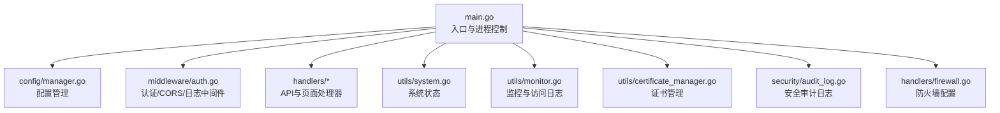
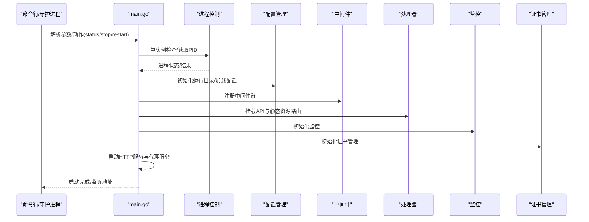
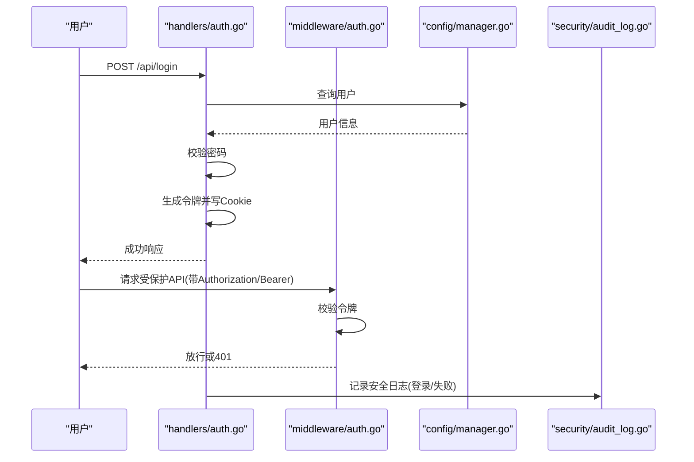
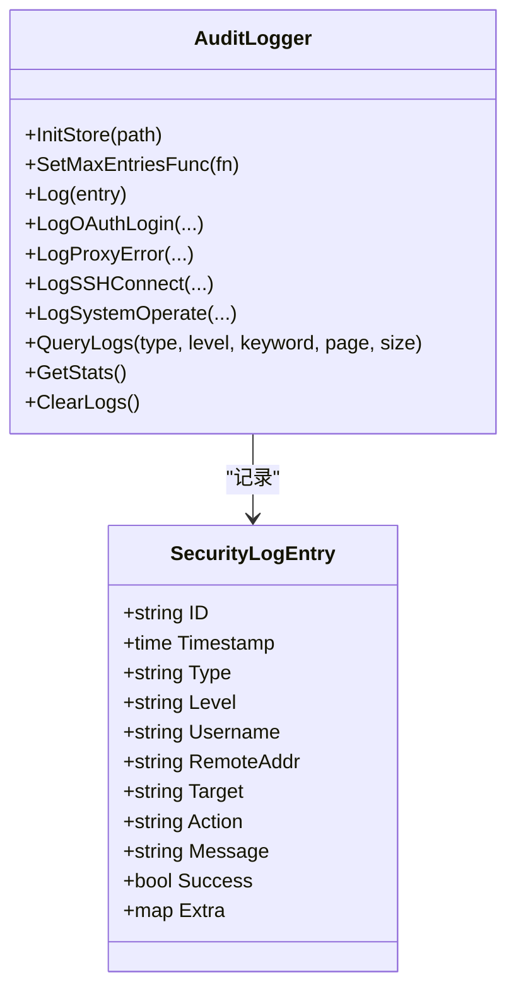
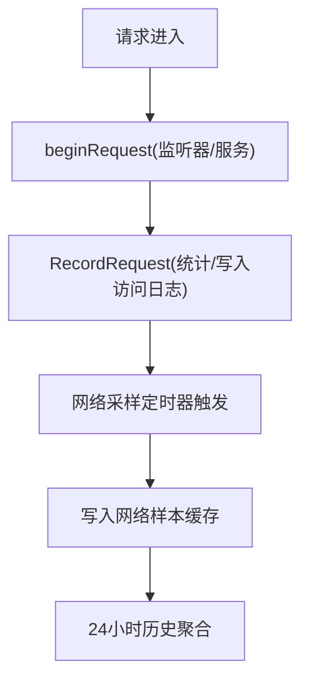
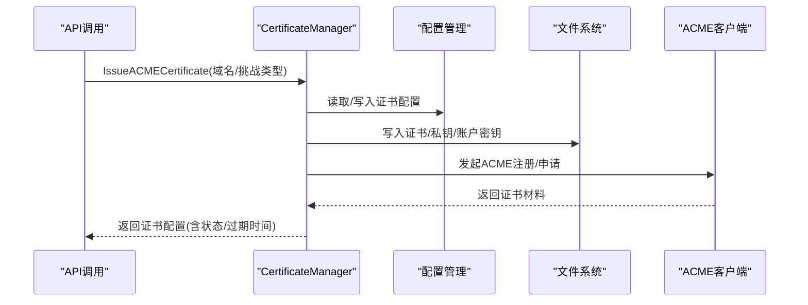
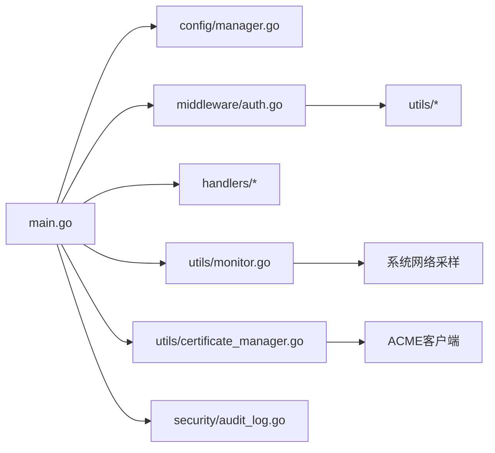

# 故障排除

<cite>
**本文引用的文件**
- [README.md](file://README.md)
- [main.go](file://src/main.go)
- [process_control.go](file://src/process_control.go)
- [manager.go](file://src/config/manager.go)
- [auth.go](file://src/middleware/auth.go)
- [handlers/auth.go](file://src/handlers/auth.go)
- [handlers/security_logs.go](file://src/handlers/security_logs.go)
- [security/audit_log.go](file://src/security/audit_log.go)
- [utils/system.go](file://src/utils/system.go)
- [utils/monitor.go](file://src/utils/monitor.go)
- [utils/certificate_manager.go](file://src/utils/certificate_manager.go)
- [handlers/firewall.go](file://src/handlers/firewall.go)
- [utils/certificate_manager_test.go](file://src/utils/certificate_manager_test.go)
</cite>

## 目录
1. [简介](#简介)
2. [项目结构](#项目结构)
3. [核心组件](#核心组件)
4. [架构总览](#架构总览)
5. [详细组件分析](#详细组件分析)
6. [依赖关系分析](#依赖关系分析)
7. [性能考虑](#性能考虑)
8. [故障排除指南](#故障排除指南)
9. [结论](#结论)
10. [附录](#附录)

## 简介
本指南面向运维与开发人员，聚焦 Caddy Panel 在实际运行中可能遇到的各类问题，提供系统化的诊断思路与解决方案，覆盖启动失败、配置错误、认证问题、证书申请失败、性能问题、网络连接问题、系统级问题以及紧急处置与数据恢复。文档结合源码中的关键实现，帮助快速定位与解决问题。

## 项目结构
- 二进制入口负责参数解析、进程控制、HTTP 服务启动、代理服务启动与优雅关闭。
- 配置管理器负责应用全局配置、监听器、服务、证书、用户、SSH、防火墙等的持久化与读取。
- 中间件层提供认证、CORS、日志等横切能力。
- 处理器层提供 API 与静态资源服务。
- 工具层提供系统状态、监控、证书管理等能力。
- 安全审计模块提供安全日志记录与查询。



**图表来源**
- [main.go:24-120](file://src/main.go#L24-L120)
- [manager.go:35-72](file://src/config/manager.go#L35-L72)
- [auth.go:14-55](file://src/middleware/auth.go#L14-L55)
- [handlers/auth.go:37-76](file://src/handlers/auth.go#L37-L76)
- [utils/system.go:19-82](file://src/utils/system.go#L19-L82)
- [utils/monitor.go:38-66](file://src/utils/monitor.go#L38-L66)
- [utils/certificate_manager.go:126-151](file://src/utils/certificate_manager.go#L126-L151)
- [security/audit_log.go:15-31](file://src/security/audit_log.go#L15-L31)
- [handlers/firewall.go:13-52](file://src/handlers/firewall.go#L13-L52)

**章节来源**
- [README.md:20-42](file://README.md#L20-L42)
- [main.go:24-120](file://src/main.go#L24-L120)

## 核心组件
- 进程控制与单实例保护：通过 PID 文件与信号处理实现状态查询、停止、重启与优雅退出。
- 配置管理：集中管理全局配置、监听器、服务、证书、用户、SSH、防火墙等，支持持久化与规范化。
- 认证与授权：支持用户令牌与 JWT Cookie，提供 OAuth 登录页面与中间件校验。
- 安全日志：记录 OAuth 登录、代理错误、SSH 连接、系统操作等事件，支持查询与统计。
- 监控与日志：记录访问日志、网络采样、连接数、吞吐量等，支持历史趋势查询。
- 证书管理：支持导入、ACME 申请与自动续签、外部配置同步、HTTP-01/DNS-01 等。
- 防火墙：支持规则增删改查与动态生效。

**章节来源**
- [process_control.go:17-139](file://src/process_control.go#L17-L139)
- [manager.go:35-137](file://src/config/manager.go#L35-L137)
- [auth.go:14-55](file://src/middleware/auth.go#L14-L55)
- [handlers/auth.go:37-76](file://src/handlers/auth.go#L37-L76)
- [security/audit_log.go:62-166](file://src/security/audit_log.go#L62-L166)
- [utils/monitor.go:119-189](file://src/utils/monitor.go#L119-L189)
- [utils/certificate_manager.go:126-151](file://src/utils/certificate_manager.go#L126-L151)
- [handlers/firewall.go:13-155](file://src/handlers/firewall.go#L13-L155)

## 架构总览
下图展示了启动流程、路由挂载、中间件链路与关键组件交互。



**图表来源**
- [main.go:24-120](file://src/main.go#L24-L120)
- [process_control.go:17-139](file://src/process_control.go#L17-L139)
- [manager.go:74-107](file://src/config/manager.go#L74-L107)
- [auth.go:14-55](file://src/middleware/auth.go#L14-L55)

## 详细组件分析

### 进程控制与单实例保护
- 支持 status、stop、restart 动作，解析参数与命令行参数。
- 通过 PID 文件判断运行状态，读取失败或进程不存在时清理无效文件。
- 停止流程包含终止进程、轮询退出、超时处理与 PID 文件清理。
- 启动前进行单实例保护，若检测到运行中则直接退出。

```mermaid
flowchart TD
Start(["启动"]) --> Parse["解析动作参数"]
Parse --> Action{"动作？"}
Action --> |status| ReadPID["读取PID文件"]
ReadPID --> Status["打印状态/退出码"]
Action --> |stop| Stop["终止进程并清理PID"]
Stop --> Done(["结束"])
Action --> |restart| Restart["先停止旧进程再启动"]
Restart --> Done
Action --> |""| Single["单实例检查"]
Single --> Running{"已运行？"}
Running --> |是| Exit["退出并提示PID"]
Running --> |否| Init["初始化配置/安全参数"]
```

**图表来源**
- [main.go:24-77](file://src/main.go#L24-L77)
- [process_control.go:17-139](file://src/process_control.go#L17-L139)

**章节来源**
- [process_control.go:17-139](file://src/process_control.go#L17-L139)
- [main.go:24-77](file://src/main.go#L24-L77)

### 认证与授权
- 管理后台登录：用户名密码校验，生成令牌并写入 Cookie。
- OAuth 登录：支持前端加密负载，服务端 RSA 解密后校验。
- API 认证中间件：优先支持 Authorization Bearer 令牌，否则拒绝。
- 公开路径：登录、登出、公钥接口无需认证。



**图表来源**
- [handlers/auth.go:37-76](file://src/handlers/auth.go#L37-L76)
- [handlers/auth.go:124-198](file://src/handlers/auth.go#L124-L198)
- [auth.go:14-55](file://src/middleware/auth.go#L14-L55)
- [manager.go:511-544](file://src/config/manager.go#L511-L544)
- [security/audit_log.go:82-99](file://src/security/audit_log.go#L82-L99)

**章节来源**
- [handlers/auth.go:37-76](file://src/handlers/auth.go#L37-L76)
- [handlers/auth.go:124-198](file://src/handlers/auth.go#L124-L198)
- [auth.go:14-55](file://src/middleware/auth.go#L14-L55)
- [manager.go:511-544](file://src/config/manager.go#L511-L544)
- [security/audit_log.go:82-99](file://src/security/audit_log.go#L82-L99)

### 安全日志与审计
- 提供 OAuth 登录、代理错误、SSH 连接、系统操作等日志记录。
- 支持按类型、级别、关键词分页查询，支持清空与统计。
- 最大条目数可由配置回调动态调整。



**图表来源**
- [security/audit_log.go:15-31](file://src/security/audit_log.go#L15-L31)
- [security/audit_log.go:62-166](file://src/security/audit_log.go#L62-L166)
- [handlers/security_logs.go:10-64](file://src/handlers/security_logs.go#L10-L64)

**章节来源**
- [security/audit_log.go:62-166](file://src/security/audit_log.go#L62-L166)
- [handlers/security_logs.go:10-64](file://src/handlers/security_logs.go#L10-L64)

### 监控与访问日志
- 记录每个监听器与服务的请求计数、活动连接、字节流入/流出、最近事件窗口速率。
- 24 小时网络采样，按 10 分钟窗口聚合。
- 支持按监听器/服务过滤访问日志。



**图表来源**
- [utils/monitor.go:119-189](file://src/utils/monitor.go#L119-L189)
- [utils/monitor.go:67-117](file://src/utils/monitor.go#L67-L117)
- [utils/monitor.go:323-355](file://src/utils/monitor.go#L323-L355)

**章节来源**
- [utils/monitor.go:119-189](file://src/utils/monitor.go#L119-L189)
- [utils/monitor.go:67-117](file://src/utils/monitor.go#L67-L117)
- [utils/monitor.go:323-355](file://src/utils/monitor.go#L323-L355)

### 证书管理
- 支持导入 PEM 证书、外部配置同步、ACME 自动申请与续签。
- HTTP-01 挑战通过内存 provider 存储 token，响应 /.well-known/acme-challenge/ 请求。
- 自动续签周期可配置，默认约 1 小时；到期前一定天数触发续签。
- 支持多种 DNS 供应商（阿里云、腾讯云、Cloudflare）。



**图表来源**
- [utils/certificate_manager.go:440-533](file://src/utils/certificate_manager.go#L440-L533)
- [utils/certificate_manager.go:153-182](file://src/utils/certificate_manager.go#L153-L182)
- [utils/certificate_manager.go:253-269](file://src/utils/certificate_manager.go#L253-L269)

**章节来源**
- [utils/certificate_manager.go:440-533](file://src/utils/certificate_manager.go#L440-L533)
- [utils/certificate_manager.go:153-182](file://src/utils/certificate_manager.go#L153-L182)
- [utils/certificate_manager.go:253-269](file://src/utils/certificate_manager.go#L253-L269)

### 防火墙
- 提供防火墙配置的增删改查与保存，支持默认策略与规则集。
- 规则持久化到运行时目录，支持动态加载与更新。

**章节来源**
- [handlers/firewall.go:13-155](file://src/handlers/firewall.go#L13-L155)
- [manager.go:639-791](file://src/config/manager.go#L639-L791)

## 依赖关系分析
- 入口依赖配置管理、中间件、处理器、监控、证书管理与安全审计。
- 认证中间件依赖令牌校验与公开路径判定。
- 证书管理依赖 ACME 客户端与 DNS 供应商适配。
- 监控依赖系统网络采样库。
- 安全日志依赖配置回调以限制日志规模。



**图表来源**
- [main.go:105-431](file://src/main.go#L105-L431)
- [auth.go:14-55](file://src/middleware/auth.go#L14-L55)
- [utils/monitor.go:67-117](file://src/utils/monitor.go#L67-L117)
- [utils/certificate_manager.go:30-37](file://src/utils/certificate_manager.go#L30-L37)

**章节来源**
- [main.go:105-431](file://src/main.go#L105-L431)
- [auth.go:14-55](file://src/middleware/auth.go#L14-L55)
- [utils/monitor.go:67-117](file://src/utils/monitor.go#L67-L117)
- [utils/certificate_manager.go:30-37](file://src/utils/certificate_manager.go#L30-L37)

## 性能考虑
- 系统资源：CPU 使用率、内存占用、网络 IO 速率与累计字节。
- 监控指标：每监听器/服务的请求计数、活动连接、速率、最近窗口吞吐。
- 建议：
  - 合理设置日志保留与条目上限，避免磁盘压力。
  - 对高并发场景关注代理层与证书 ACME 并发。
  - 使用 24 小时网络历史图评估峰值带宽与抖动。

**章节来源**
- [utils/system.go:19-82](file://src/utils/system.go#L19-L82)
- [utils/monitor.go:253-321](file://src/utils/monitor.go#L253-L321)
- [manager.go:109-137](file://src/config/manager.go#L109-L137)

## 故障排除指南

### 启动失败
- 症状：启动报错、端口占用、单实例保护导致退出。
- 排查步骤：
  - 使用 status 查看进程状态与 PID 文件位置。
  - 使用 stop 停止旧进程，确认端口释放后再启动。
  - 检查运行目录写权限与磁盘空间。
  - 若使用 Unix Socket，确认 socket 文件权限与残留文件。
- 关键实现参考：
  - [main.go:46-77](file://src/main.go#L46-L77)
  - [process_control.go:17-139](file://src/process_control.go#L17-L139)

**章节来源**
- [main.go:46-77](file://src/main.go#L46-L77)
- [process_control.go:17-139](file://src/process_control.go#L17-L139)

### 配置错误
- 症状：配置加载失败、字段缺失、默认值异常。
- 排查步骤：
  - 检查配置文件是否存在与格式正确。
  - 关注默认值归一化逻辑（如日志级别、端口、证书同步间隔等）。
  - 修改后保存并验证是否成功写入。
- 关键实现参考：
  - [manager.go:74-107](file://src/config/manager.go#L74-L107)
  - [manager.go:109-137](file://src/config/manager.go#L109-L137)

**章节来源**
- [manager.go:74-107](file://src/config/manager.go#L74-L107)
- [manager.go:109-137](file://src/config/manager.go#L109-L137)

### 认证问题
- 症状：登录失败、令牌无效、OAuth 登录页面无法访问。
- 排查步骤：
  - 确认用户存在且启用。
  - 检查密码哈希与比较逻辑。
  - 对 OAuth 登录，确认前端加密负载与服务端密钥配置。
  - 检查中间件对 Authorization Bearer 的处理与公开路径白名单。
  - 查看安全日志中的登录失败记录。
- 关键实现参考：
  - [handlers/auth.go:37-76](file://src/handlers/auth.go#L37-L76)
  - [handlers/auth.go:124-198](file://src/handlers/auth.go#L124-L198)
  - [auth.go:14-55](file://src/middleware/auth.go#L14-L55)
  - [security/audit_log.go:82-99](file://src/security/audit_log.go#L82-L99)

**章节来源**
- [handlers/auth.go:37-76](file://src/handlers/auth.go#L37-L76)
- [handlers/auth.go:124-198](file://src/handlers/auth.go#L124-L198)
- [auth.go:14-55](file://src/middleware/auth.go#L14-L55)
- [security/audit_log.go:82-99](file://src/security/audit_log.go#L82-L99)

### 证书相关问题
- 症状：ACME 申请失败、续签失败、证书过期、域名不匹配。
- 排查步骤：
  - 确认已启用 HTTP 80 监听（HTTP-01）或正确配置 DNS 供应商与凭据（DNS-01）。
  - 检查证书同步配置路径与文件权限。
  - 查看证书状态、过期时间与错误信息。
  - 对外部同步证书，确认文件变更与最后同步时间。
  - 如需手动续签，调用续签接口并观察错误日志。
- 关键实现参考：
  - [utils/certificate_manager.go:440-533](file://src/utils/certificate_manager.go#L440-L533)
  - [utils/certificate_manager.go:595-629](file://src/utils/certificate_manager.go#L595-L629)
  - [utils/certificate_manager.go:253-269](file://src/utils/certificate_manager.go#L253-L269)

**章节来源**
- [utils/certificate_manager.go:440-533](file://src/utils/certificate_manager.go#L440-L533)
- [utils/certificate_manager.go:595-629](file://src/utils/certificate_manager.go#L595-L629)
- [utils/certificate_manager.go:253-269](file://src/utils/certificate_manager.go#L253-L269)

### 性能问题
- 症状：CPU/内存占用高、网络吞吐低、延迟上升。
- 排查步骤：
  - 使用系统状态接口查看 CPU、内存、网络 IO。
  - 查看各监听器/服务的请求计数、活动连接与速率。
  - 结合 24 小时网络历史图定位峰值时段与异常波动。
  - 调整日志条目上限与保留天数，减少磁盘 IO。
- 关键实现参考：
  - [utils/system.go:19-82](file://src/utils/system.go#L19-L82)
  - [utils/monitor.go:253-321](file://src/utils/monitor.go#L253-L321)
  - [manager.go:109-137](file://src/config/manager.go#L109-L137)

**章节来源**
- [utils/system.go:19-82](file://src/utils/system.go#L19-L82)
- [utils/monitor.go:253-321](file://src/utils/monitor.go#L253-L321)
- [manager.go:109-137](file://src/config/manager.go#L109-L137)

### 网络连接问题
- 症状：端口占用、无法监听、Unix Socket 权限问题、防火墙拦截。
- 排查步骤：
  - 使用 status 与 stop 确认端口占用与 PID 文件。
  - 切换到 Unix Socket 时，检查 socket 文件是否存在与权限。
  - 检查防火墙配置与规则，确保放行管理端口与业务端口。
- 关键实现参考：
  - [main.go:441-458](file://src/main.go#L441-L458)
  - [handlers/firewall.go:13-52](file://src/handlers/firewall.go#L13-L52)

**章节来源**
- [main.go:441-458](file://src/main.go#L441-L458)
- [handlers/firewall.go:13-52](file://src/handlers/firewall.go#L13-L52)

### 系统级问题
- 症状：权限不足、文件被锁定、进程冲突。
- 排查步骤：
  - 确认运行目录权限（创建 PID 目录、写入 PID 文件）。
  - 检查 socket 文件与 PID 文件是否被意外删除或残留。
  - 单实例保护失败时，清理无效 PID 文件后重试。
- 关键实现参考：
  - [main.go:467-473](file://src/main.go#L467-L473)
  - [process_control.go:46-65](file://src/process_control.go#L46-L65)

**章节来源**
- [main.go:467-473](file://src/main.go#L467-L473)
- [process_control.go:46-65](file://src/process_control.go#L46-L65)

### 紧急情况与数据恢复
- 紧急停止：使用 stop 动作终止进程，确保清理 PID 文件。
- 数据恢复：配置与证书均持久化到运行目录，备份该目录即可恢复。
- 日志分析：利用安全日志与访问日志接口导出并分析异常模式。
- 关键实现参考：
  - [process_control.go:84-109](file://src/process_control.go#L84-L109)
  - [handlers/security_logs.go:10-64](file://src/handlers/security_logs.go#L10-L64)
  - [utils/monitor.go:357-380](file://src/utils/monitor.go#L357-L380)

**章节来源**
- [process_control.go:84-109](file://src/process_control.go#L84-L109)
- [handlers/security_logs.go:10-64](file://src/handlers/security_logs.go#L10-L64)
- [utils/monitor.go:357-380](file://src/utils/monitor.go#L357-L380)

## 结论
本指南基于源码实现总结了 Caddy Panel 的常见故障与排障路径，涵盖启动、配置、认证、证书、性能、网络与系统级问题。建议在生产环境中：
- 显式设置安全参数与运行目录；
- 启用并定期检查安全日志；
- 监控系统资源与网络历史；
- 正确配置证书与防火墙；
- 建立定期备份与演练机制。

## 附录
- 启动参数与行为参考：[README.md:105-156](file://README.md#L105-L156)
- 证书管理能力参考：[utils/certificate_manager.go:126-151](file://src/utils/certificate_manager.go#L126-L151)
- 测试用例参考（证书域匹配与回退证书）：[utils/certificate_manager_test.go:16-75](file://src/utils/certificate_manager_test.go#L16-L75)