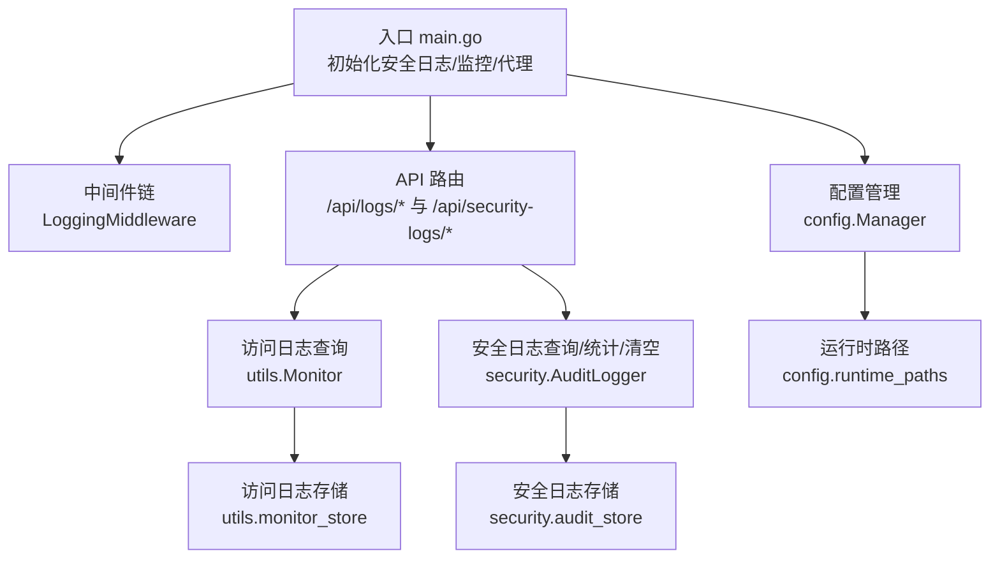
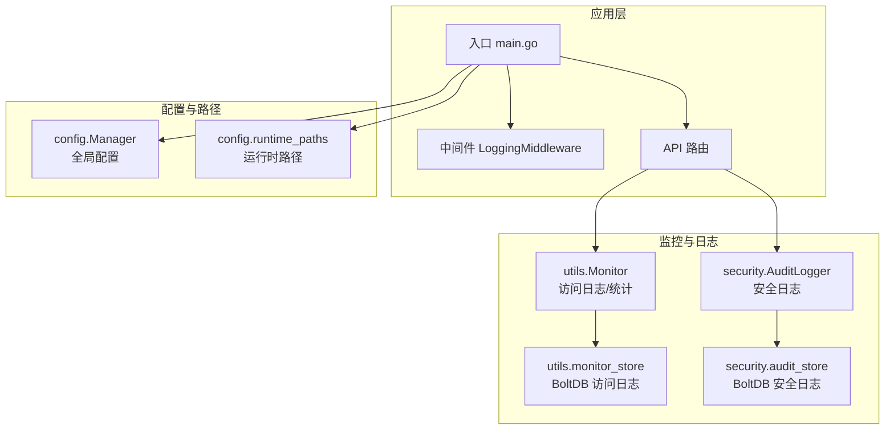
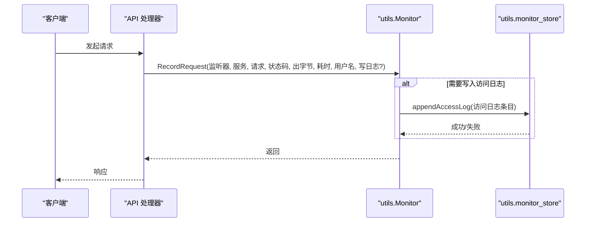
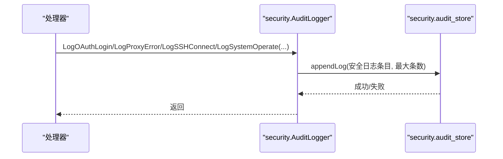
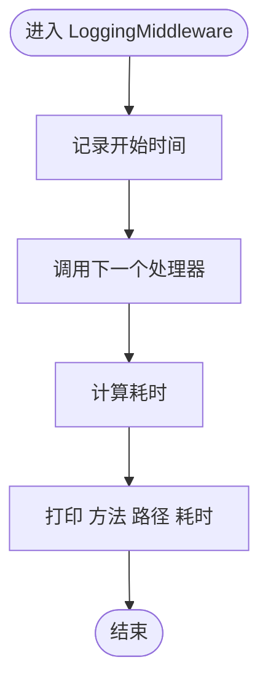
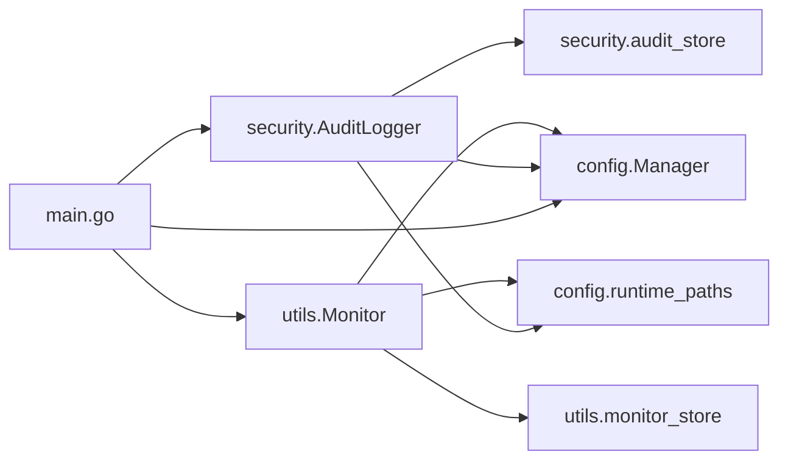

# 日志分析

<cite>
**本文引用的文件**   
- [src/main.go](file://src/main.go)
- [src/handlers/security_logs.go](file://src/handlers/security_logs.go)
- [src/security/audit_log.go](file://src/security/audit_log.go)
- [src/security/audit_store.go](file://src/security/audit_store.go)
- [src/utils/monitor.go](file://src/utils/monitor.go)
- [src/utils/monitor_store.go](file://src/utils/monitor_store.go)
- [src/middleware/auth.go](file://src/middleware/auth.go)
- [src/models/models.go](file://src/models/models.go)
- [src/config/manager.go](file://src/config/manager.go)
- [src/config/runtime_paths.go](file://src/config/runtime_paths.go)
- [README.md](file://README.md)
</cite>

## 目录
1. [简介](#简介)
2. [项目结构](#项目结构)
3. [核心组件](#核心组件)
4. [架构总览](#架构总览)
5. [详细组件分析](#详细组件分析)
6. [依赖分析](#依赖分析)
7. [性能考量](#性能考量)
8. [故障排查指南](#故障排查指南)
9. [结论](#结论)
10. [附录](#附录)

## 简介
本指南聚焦于 Caddy Panel 的日志体系与故障诊断实践，覆盖访问日志、安全审计日志、系统运行日志与中间件日志的采集、存储、查询与分析方法。文档同时提供日志级别与轮转策略配置、关键错误识别与关联分析、日志聚合与检索技巧、审计日志解读与合规检查要点，以及日志监控与告警最佳实践。

## 项目结构
围绕日志与监控的关键模块分布如下：
- 入口与路由：在入口处初始化安全日志存储、代理与监控，并挂载 API 路由与中间件链。
- 访问日志：由运行时监控模块记录访问指标与访问日志条目，持久化至 BoltDB。
- 安全日志：集中于安全审计模块，记录 OAuth 登录、代理错误、SSH 连接/断开、系统操作等事件。
- 中间件日志：HTTP 请求处理链中的简单日志输出，便于快速定位慢请求与异常路径。
- 配置与路径：全局日志保留与容量限制、运行时路径（含安全日志数据库）由配置与运行时路径模块统一管理。

**图示来源**
- [src/main.go:96-100](file://src/main.go#L96-L100)
- [src/main.go:421-427](file://src/main.go#L421-L427)
- [src/main.go:137-138](file://src/main.go#L137-L138)
- [src/main.go:373-384](file://src/main.go#L373-L384)
- [src/utils/monitor.go:53-65](file://src/utils/monitor.go#L53-L65)
- [src/security/audit_log.go:25-31](file://src/security/audit_log.go#L25-L31)
- [src/utils/monitor_store.go:30-54](file://src/utils/monitor_store.go#L30-L54)
- [src/security/audit_store.go:26-45](file://src/security/audit_store.go#L26-L45)
- [src/config/manager.go:35-72](file://src/config/manager.go#L35-L72)
- [src/config/runtime_paths.go:85-115](file://src/config/runtime_paths.go#L85-L115)

**章节来源**
- [src/main.go:96-100](file://src/main.go#L96-L100)
- [src/main.go:421-427](file://src/main.go#L421-L427)
- [src/main.go:137-138](file://src/main.go#L137-L138)
- [src/main.go:373-384](file://src/main.go#L373-L384)
- [src/utils/monitor.go:53-65](file://src/utils/monitor.go#L53-L65)
- [src/security/audit_log.go:25-31](file://src/security/audit_log.go#L25-L31)
- [src/utils/monitor_store.go:30-54](file://src/utils/monitor_store.go#L30-L54)
- [src/security/audit_store.go:26-45](file://src/security/audit_store.go#L26-L45)
- [src/config/manager.go:35-72](file://src/config/manager.go#L35-L72)
- [src/config/runtime_paths.go:85-115](file://src/config/runtime_paths.go#L85-L115)

## 核心组件
- 访问日志与运行时统计
  - 记录维度：监听器 ID/端口、服务 ID/名称、域名、方法、路径、状态码、耗时、入出字节数、远端地址、用户名等。
  - 存储：BoltDB，按时间复合键存储，支持按监听器/服务过滤与最近 N 条读取。
  - 保留策略：按全局配置的保留天数与最大条数裁剪。
- 安全日志
  - 类型：OAuth 登录、代理错误、SSH 连接/断开、系统操作。
  - 级别：info、warning、error。
  - 存储：BoltDB，按时间复合键存储，支持关键词搜索、分页查询、统计与清空。
  - 保留策略：默认保留 30 天，最大条数默认 5000，可由配置调整。
- 中间件日志
  - 在请求处理链末尾输出“方法、路径、耗时”的简单日志，便于快速定位慢请求与异常路径。
- 配置与路径
  - 全局日志级别、日志文件、日志保留天数、最大访问日志条数、最大安全日志条数等。
  - 运行时路径：主配置、PID、Unix Socket、监控缓存、安全日志缓存、证书目录等。

**章节来源**
- [src/models/models.go:53-70](file://src/models/models.go#L53-L70)
- [src/utils/monitor_store.go:102-125](file://src/utils/monitor_store.go#L102-L125)
- [src/utils/monitor_store.go:127-155](file://src/utils/monitor_store.go#L127-L155)
- [src/security/audit_log.go:62-80](file://src/security/audit_log.go#L62-L80)
- [src/security/audit_store.go:47-67](file://src/security/audit_store.go#L47-L67)
- [src/middleware/auth.go:109-118](file://src/middleware/auth.go#L109-L118)
- [src/config/manager.go:299-310](file://src/config/manager.go#L299-L310)
- [src/config/runtime_paths.go:85-115](file://src/config/runtime_paths.go#L85-L115)

## 架构总览
下图展示了日志与监控在系统中的位置与交互：

**图示来源**
- [src/main.go:421-427](file://src/main.go#L421-L427)
- [src/main.go:373-384](file://src/main.go#L373-L384)
- [src/utils/monitor.go:53-65](file://src/utils/monitor.go#L53-L65)
- [src/utils/monitor_store.go:30-54](file://src/utils/monitor_store.go#L30-L54)
- [src/security/audit_log.go:25-31](file://src/security/audit_log.go#L25-L31)
- [src/security/audit_store.go:26-45](file://src/security/audit_store.go#L26-L45)
- [src/config/manager.go:35-72](file://src/config/manager.go#L35-L72)
- [src/config/runtime_paths.go:85-115](file://src/config/runtime_paths.go#L85-L115)

## 详细组件分析

### 访问日志与运行时统计
- 记录时机：请求结束时，根据服务配置决定是否写入访问日志。
- 数据模型：包含监听器/服务标识、请求方法/路径、状态码、耗时、入出字节数、远端地址、用户名等。
- 存储与查询：
  - 存储：BoltDB，按“时间+ID”复合键写入，自动裁剪超出保留天数与最大条数的数据。
  - 查询：支持按监听器/服务过滤与最近 N 条读取。
- 保留策略：由全局配置决定保留天数与最大条数，具备默认值。

**图示来源**
- [src/utils/monitor.go:132-189](file://src/utils/monitor.go#L132-L189)
- [src/utils/monitor_store.go:102-125](file://src/utils/monitor_store.go#L102-L125)

**章节来源**
- [src/utils/monitor.go:132-189](file://src/utils/monitor.go#L132-L189)
- [src/utils/monitor_store.go:102-125](file://src/utils/monitor_store.go#L102-L125)
- [src/utils/monitor_store.go:127-155](file://src/utils/monitor_store.go#L127-L155)
- [src/models/models.go:53-70](file://src/models/models.go#L53-L70)

### 安全日志
- 记录场景：
  - OAuth 登录：成功/失败、来源 IP、消息。
  - 代理错误：来源 IP、目标服务、错误消息、附加信息。
  - SSH 连接/断开：用户名、来源 IP、连接名、结果与消息。
  - 系统操作：用户名、来源 IP、目标、动作、结果与消息。
- 存储与查询：
  - 存储：BoltDB，按“时间+ID”复合键写入，自动裁剪至最大条数。
  - 查询：支持按类型、级别、关键词过滤，分页返回；支持统计总数与按类型统计。
  - 清空：清空安全日志桶并重建。
- 保留策略：默认保留 30 天，最大条数默认 5000，可通过配置调整。

**图示来源**
- [src/security/audit_log.go:82-166](file://src/security/audit_log.go#L82-L166)
- [src/security/audit_store.go:47-67](file://src/security/audit_store.go#L47-L67)

**章节来源**
- [src/security/audit_log.go:82-166](file://src/security/audit_log.go#L82-L166)
- [src/security/audit_store.go:47-67](file://src/security/audit_store.go#L47-L67)
- [src/security/audit_store.go:69-129](file://src/security/audit_store.go#L69-L129)
- [src/security/audit_store.go:131-162](file://src/security/audit_store.go#L131-L162)
- [src/security/audit_store.go:164-176](file://src/security/audit_store.go#L164-L176)

### 中间件日志
- 作用：在请求处理链末尾输出“时间戳、方法、路径、耗时”，便于快速发现慢请求与异常路径。
- 适用场景：定位路由异常、慢接口、频繁失败的路径。

**图示来源**
- [src/middleware/auth.go:109-118](file://src/middleware/auth.go#L109-L118)

**章节来源**
- [src/middleware/auth.go:109-118](file://src/middleware/auth.go#L109-L118)

### 日志级别与轮转配置
- 全局配置项：
  - 日志级别：用于控制日志输出粒度（入口处的简单日志中间件会输出请求耗时）。
  - 日志文件：运行时路径下的日志文件（入口处的简单日志中间件会写入标准输出）。
  - 日志保留天数：访问日志与安全日志的保留天数。
  - 最大访问日志条数：访问日志最大条数。
  - 最大安全日志条数：安全日志最大条数。
- 默认值与归一化：配置管理器对缺失或非法值进行默认化处理。
- 运行时路径：统一管理配置文件、PID、Socket、监控缓存、安全日志缓存、证书目录等。

**章节来源**
- [src/config/manager.go:299-310](file://src/config/manager.go#L299-L310)
- [src/config/manager.go:109-137](file://src/config/manager.go#L109-L137)
- [src/config/runtime_paths.go:85-115](file://src/config/runtime_paths.go#L85-L115)

## 依赖分析
- 组件耦合
  - 入口对安全日志与监控的初始化存在强依赖，确保日志系统可用后再启动服务。
  - API 路由依赖监控与安全日志模块进行查询与统计。
  - 存储层依赖 BoltDB，采用“时间+ID”复合键保证有序与唯一性。
- 外部依赖
  - BoltDB：用于访问日志与安全日志的持久化。
  - gopsutil：用于系统资源与网络 IO 采样。
- 循环依赖
  - 未发现循环依赖迹象，模块职责清晰。

**图示来源**
- [src/main.go:96-100](file://src/main.go#L96-L100)
- [src/main.go:421-427](file://src/main.go#L421-L427)
- [src/security/audit_log.go:25-31](file://src/security/audit_log.go#L25-L31)
- [src/utils/monitor.go:53-65](file://src/utils/monitor.go#L53-L65)
- [src/utils/monitor_store.go:30-54](file://src/utils/monitor_store.go#L30-L54)
- [src/security/audit_store.go:26-45](file://src/security/audit_store.go#L26-L45)
- [src/config/manager.go:35-72](file://src/config/manager.go#L35-L72)
- [src/config/runtime_paths.go:85-115](file://src/config/runtime_paths.go#L85-L115)

**章节来源**
- [src/main.go:96-100](file://src/main.go#L96-L100)
- [src/main.go:421-427](file://src/main.go#L421-L427)
- [src/security/audit_log.go:25-31](file://src/security/audit_log.go#L25-L31)
- [src/utils/monitor.go:53-65](file://src/utils/monitor.go#L53-L65)
- [src/utils/monitor_store.go:30-54](file://src/utils/monitor_store.go#L30-L54)
- [src/security/audit_store.go:26-45](file://src/security/audit_store.go#L26-L45)
- [src/config/manager.go:35-72](file://src/config/manager.go#L35-L72)
- [src/config/runtime_paths.go:85-115](file://src/config/runtime_paths.go#L85-L115)

## 性能考量
- BoltDB 写入与裁剪
  - 访问日志与安全日志均采用“时间+ID”复合键，写入时先裁剪超出保留天数的数据，再裁剪至最大条数，避免无限增长。
  - 建议合理设置最大条数与保留天数，平衡存储与查询性能。
- 查询复杂度
  - 访问日志查询基于游标逆序遍历，按监听器/服务过滤，时间复杂度与返回条数线性相关。
  - 安全日志查询同样基于游标逆序遍历，支持类型、级别、关键词过滤，注意关键词匹配为线性子串匹配。
- 中间件日志
  - 输出为标准输出，成本极低，适合在生产环境保留以辅助快速定位问题。

**章节来源**
- [src/utils/monitor_store.go:102-125](file://src/utils/monitor_store.go#L102-L125)
- [src/utils/monitor_store.go:127-155](file://src/utils/monitor_store.go#L127-L155)
- [src/security/audit_store.go:69-129](file://src/security/audit_store.go#L69-L129)
- [src/middleware/auth.go:109-118](file://src/middleware/auth.go#L109-L118)

## 故障排查指南

### 日志级别与输出
- 入口处的简单日志中间件会输出“方法、路径、耗时”，可用于快速识别慢请求与异常路径。
- 全局日志级别与日志文件由配置管理器提供，入口处会打印运行目录与安全参数加载情况。

**章节来源**
- [src/middleware/auth.go:109-118](file://src/middleware/auth.go#L109-L118)
- [src/config/manager.go:299-310](file://src/config/manager.go#L299-L310)
- [src/main.go:87-94](file://src/main.go#L87-L94)

### 访问日志分析
- 常见问题定位
  - 高状态码占比：结合状态码分布与路径维度，定位异常服务或上游问题。
  - 高耗时请求：结合耗时字段，定位慢接口与慢上游。
  - 异常路径：通过路径过滤与关键词搜索，快速定位异常请求。
- 查询与过滤
  - 使用监听器/服务过滤，限定范围。
  - 使用最近 N 条读取，快速回溯问题时段。

**章节来源**
- [src/utils/monitor.go:357-380](file://src/utils/monitor.go#L357-L380)
- [src/utils/monitor_store.go:127-155](file://src/utils/monitor_store.go#L127-L155)

### 安全日志分析
- 关键事件识别
  - OAuth 登录失败：关注 warning/error 级别与失败消息，定位凭据或网络问题。
  - 代理错误：关注错误消息与目标服务，定位上游异常。
  - SSH 连接失败：关注失败消息与来源 IP，定位认证或网络问题。
  - 系统操作失败：关注失败消息与操作类型，定位权限或配置问题。
- 统计与清空
  - 使用统计接口了解各类事件占比。
  - 使用清空接口清理历史数据，避免干扰后续分析。

**章节来源**
- [src/handlers/security_logs.go:10-64](file://src/handlers/security_logs.go#L10-L64)
- [src/security/audit_log.go:82-166](file://src/security/audit_log.go#L82-L166)
- [src/security/audit_store.go:131-162](file://src/security/audit_store.go#L131-L162)
- [src/security/audit_store.go:164-176](file://src/security/audit_store.go#L164-L176)

### 审计日志解读与合规检查
- 审计范围
  - 登录行为：OAuth 登录成功/失败记录，便于审计登录成功率与异常登录尝试。
  - 代理行为：代理错误记录，便于审计上游连通性与稳定性。
  - SSH 行为：连接/断开记录，便于审计运维访问轨迹。
  - 系统操作：系统操作记录，便于审计管理员操作轨迹。
- 合规要点
  - 保留期限：默认 30 天，满足一般合规要求；可根据法规延长。
  - 访问控制：安全日志存储在受控目录，避免未授权访问。
  - 数据最小化：仅记录必要信息，避免敏感信息泄露。

**章节来源**
- [src/security/audit_log.go:82-166](file://src/security/audit_log.go#L82-L166)
- [src/security/audit_store.go:131-162](file://src/security/audit_store.go#L131-L162)
- [src/config/runtime_paths.go:85-115](file://src/config/runtime_paths.go#L85-L115)

### 日志聚合、搜索与过滤
- 聚合
  - 使用统计接口聚合各类事件数量，形成趋势图。
- 搜索与过滤
  - 安全日志支持按类型、级别、关键词过滤，关键词匹配包含用户名、来源 IP、目标、动作、消息等字段。
  - 访问日志支持按监听器/服务过滤与最近 N 条读取。

**章节来源**
- [src/handlers/security_logs.go:10-64](file://src/handlers/security_logs.go#L10-L64)
- [src/security/audit_store.go:69-129](file://src/security/audit_store.go#L69-L129)
- [src/utils/monitor.go:357-380](file://src/utils/monitor.go#L357-L380)

### 日志监控与告警最佳实践
- 监控指标
  - 访问日志：状态码分布、耗时分布、异常路径占比。
  - 安全日志：OAuth 登录失败率、代理错误率、SSH 连接失败率、系统操作失败率。
- 告警策略
  - 阈值告警：对异常比例或绝对数值设置阈值，触发告警。
  - 趋势告警：对异常比例或绝对数值的趋势变化设置阈值，触发告警。
  - 关键事件告警：对特定安全事件（如 OAuth 登录失败、代理错误、SSH 连接失败）设置即时告警。
- 建议
  - 结合访问日志与安全日志进行关联分析，定位根因。
  - 定期审查日志保留策略与最大条数，确保满足合规与性能需求。

**章节来源**
- [src/utils/monitor.go:357-380](file://src/utils/monitor.go#L357-L380)
- [src/handlers/security_logs.go:42-54](file://src/handlers/security_logs.go#L42-L54)
- [src/security/audit_store.go:131-162](file://src/security/audit_store.go#L131-L162)

## 结论
Caddy Panel 的日志体系以 BoltDB 为核心，提供了访问日志与安全日志的完整生命周期管理，配合中间件日志与配置管理，能够满足日常运维与安全审计的需求。通过合理的保留策略与最大条数配置，可在性能与合规之间取得平衡。建议在生产环境中结合访问日志与安全日志进行关联分析，并建立完善的监控与告警机制，以提升系统的可观测性与安全性。

## 附录
- 运行参数与路径
  - 运行参数：安全参数、运行目录、管理端口等。
  - 运行时路径：配置文件、PID、Socket、监控缓存、安全日志缓存、证书目录等。

**章节来源**
- [README.md:105-156](file://README.md#L105-L156)
- [src/config/runtime_paths.go:85-115](file://src/config/runtime_paths.go#L85-L115)