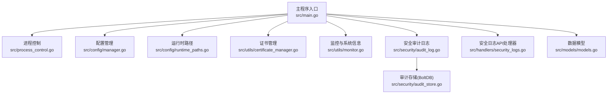
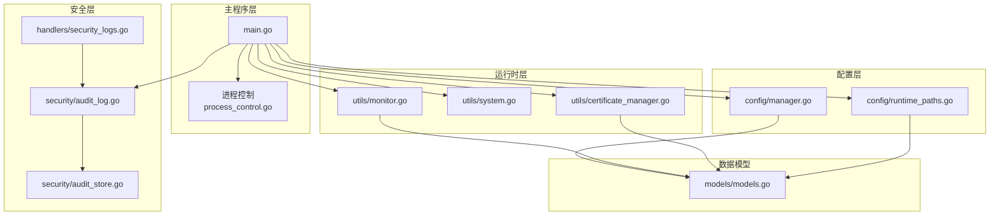
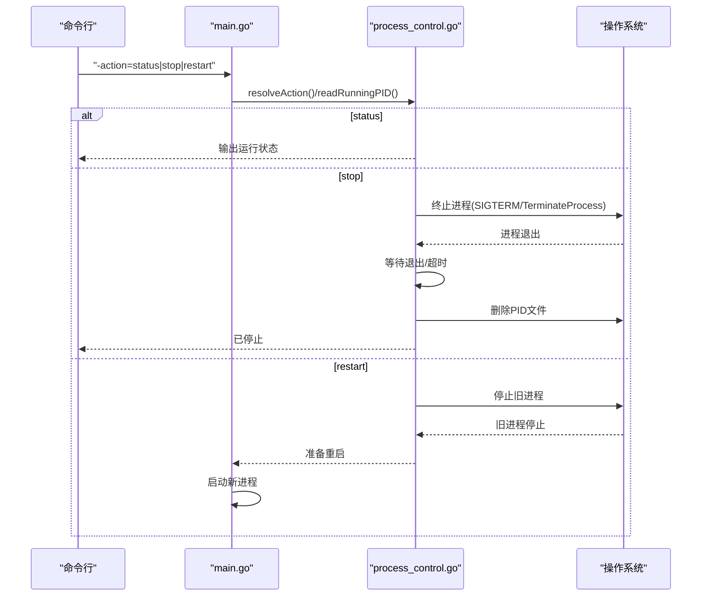
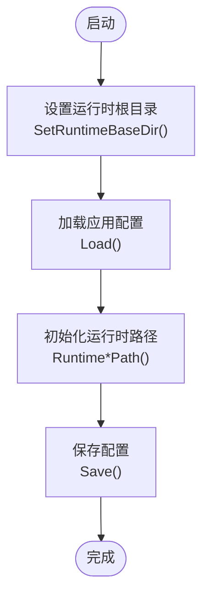
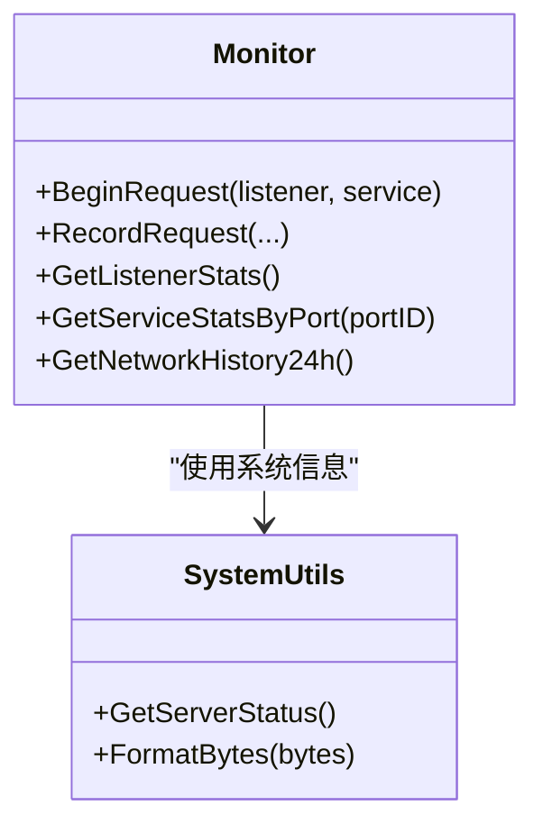
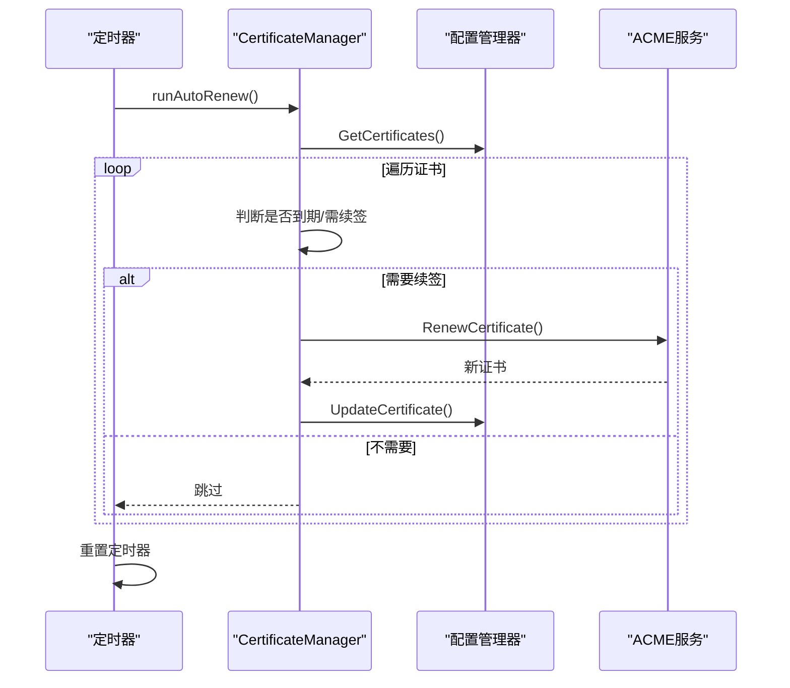
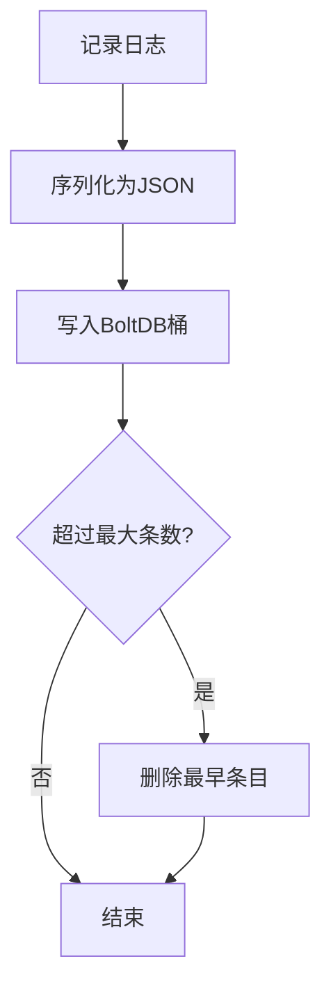
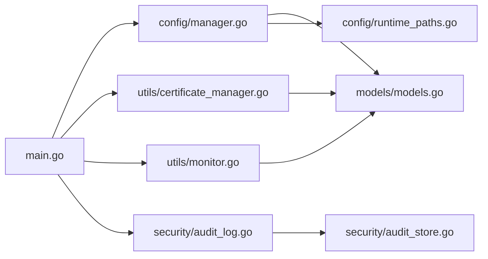

# 紧急处理程序

<cite>
**本文引用的文件**
- [src/main.go](file://src/main.go)
- [src/process_control.go](file://src/process_control.go)
- [src/process_control_unix.go](file://src/process_control_unix.go)
- [src/process_control_windows.go](file://src/process_control_windows.go)
- [src/config/manager.go](file://src/config/manager.go)
- [src/config/runtime_paths.go](file://src/config/runtime_paths.go)
- [src/utils/system.go](file://src/utils/system.go)
- [src/utils/certificate_manager.go](file://src/utils/certificate_manager.go)
- [src/utils/monitor.go](file://src/utils/monitor.go)
- [src/security/audit_log.go](file://src/security/audit_log.go)
- [src/security/audit_store.go](file://src/security/audit_store.go)
- [src/handlers/security_logs.go](file://src/handlers/security_logs.go)
- [src/models/models.go](file://src/models/models.go)
- [README.md](file://README.md)
</cite>

## 目录
1. [简介](#简介)
2. [项目结构](#项目结构)
3. [核心组件](#核心组件)
4. [架构总览](#架构总览)
5. [详细组件分析](#详细组件分析)
6. [依赖分析](#依赖分析)
7. [性能考虑](#性能考虑)
8. [故障排查指南](#故障排查指南)
9. [结论](#结论)
10. [附录](#附录)

## 简介
本指南面向 Caddy Panel 在生产环境中的紧急情况处理与数据恢复，覆盖系统崩溃、数据丢失、安全事件等场景的应急响应流程，提供紧急停止与安全重启步骤、备份与恢复操作、灾难恢复与业务连续性保障、安全事件响应与取证方法、系统修复与清理标准操作程序，以及紧急联系与支持渠道使用方法。文档基于仓库实际代码实现进行梳理，确保操作可执行、可验证。

## 项目结构
- 程序入口与进程控制：main.go、process_control.go、process_control_unix.go、process_control_windows.go
- 配置与运行时路径：config/manager.go、config/runtime_paths.go
- 运行时监控与系统信息：utils/system.go、utils/monitor.go
- 证书管理与自动续签：utils/certificate_manager.go
- 安全审计与日志：security/audit_log.go、security/audit_store.go、handlers/security_logs.go
- 数据模型：models/models.go
- 项目说明与启动参数：README.md

图表来源
- [src/main.go:24-516](file://src/main.go#L24-L516)
- [src/process_control.go:1-139](file://src/process_control.go#L1-L139)
- [src/config/manager.go:1-791](file://src/config/manager.go#L1-L791)
- [src/config/runtime_paths.go:1-160](file://src/config/runtime_paths.go#L1-L160)
- [src/utils/certificate_manager.go:1-800](file://src/utils/certificate_manager.go#L1-L800)
- [src/utils/monitor.go:1-386](file://src/utils/monitor.go#L1-L386)
- [src/security/audit_log.go:1-224](file://src/security/audit_log.go#L1-L224)
- [src/security/audit_store.go:1-222](file://src/security/audit_store.go#L1-L222)
- [src/handlers/security_logs.go:1-65](file://src/handlers/security_logs.go#L1-L65)
- [src/models/models.go:1-394](file://src/models/models.go#L1-L394)

章节来源
- [README.md:1-256](file://README.md#L1-L256)

## 核心组件
- 进程控制与单实例保护：支持 status、stop、restart 动作，PID 文件管理，跨平台信号处理。
- 配置管理：应用配置持久化、防火墙配置、证书配置、用户与服务配置。
- 运行时监控：网络流量采样、访问日志、服务/监听器统计。
- 证书管理：导入、ACME 申请与续签、外部配置同步、自动续签任务。
- 安全审计：安全日志记录、查询、统计、清空，持久化存储。
- 运行时路径：统一配置、缓存、证书、PID、Socket 文件存放位置。

章节来源
- [src/main.go:24-516](file://src/main.go#L24-L516)
- [src/process_control.go:17-139](file://src/process_control.go#L17-L139)
- [src/config/manager.go:35-791](file://src/config/manager.go#L35-L791)
- [src/utils/monitor.go:53-386](file://src/utils/monitor.go#L53-L386)
- [src/utils/certificate_manager.go:140-800](file://src/utils/certificate_manager.go#L140-L800)
- [src/security/audit_log.go:25-224](file://src/security/audit_log.go#L25-L224)
- [src/security/audit_store.go:26-222](file://src/security/audit_store.go#L26-L222)
- [src/config/runtime_paths.go:31-160](file://src/config/runtime_paths.go#L31-L160)

## 架构总览
系统采用“主程序 + 多子系统”的架构：
- 主程序负责启动、路由注册、中间件链、优雅关闭、进程控制。
- 配置子系统负责应用配置、防火墙配置、证书配置的持久化与加载。
- 监控子系统负责网络采样、访问日志、统计计算与持久化。
- 证书子系统负责证书生命周期管理与自动续签。
- 安全审计子系统负责安全日志的记录、查询、统计与清空。
- 运行时路径子系统负责统一管理运行期文件位置。

图表来源
- [src/main.go:24-516](file://src/main.go#L24-L516)
- [src/process_control.go:1-139](file://src/process_control.go#L1-L139)
- [src/config/manager.go:1-791](file://src/config/manager.go#L1-L791)
- [src/config/runtime_paths.go:1-160](file://src/config/runtime_paths.go#L1-L160)
- [src/utils/monitor.go:1-386](file://src/utils/monitor.go#L1-L386)
- [src/utils/system.go:1-124](file://src/utils/system.go#L1-L124)
- [src/utils/certificate_manager.go:1-800](file://src/utils/certificate_manager.go#L1-L800)
- [src/security/audit_log.go:1-224](file://src/security/audit_log.go#L1-L224)
- [src/security/audit_store.go:1-222](file://src/security/audit_store.go#L1-L222)
- [src/handlers/security_logs.go:1-65](file://src/handlers/security_logs.go#L1-L65)
- [src/models/models.go:1-394](file://src/models/models.go#L1-L394)

## 详细组件分析

### 进程控制与单实例保护
- 支持的动作：status、stop、restart；解析 action 参数，读取 PID 文件，判断进程是否存在，终止进程并等待退出，清理 PID 文件。
- 跨平台实现：Unix 使用 SIGTERM；Windows 使用 TerminateProcess。
- 单实例保护：启动前检查 PID 文件对应的进程是否仍在运行，避免重复启动。

图表来源
- [src/main.go:24-72](file://src/main.go#L24-L72)
- [src/process_control.go:17-139](file://src/process_control.go#L17-L139)
- [src/process_control_unix.go:11-35](file://src/process_control_unix.go#L11-L35)
- [src/process_control_windows.go:14-49](file://src/process_control_windows.go#L14-L49)

章节来源
- [src/main.go:24-72](file://src/main.go#L24-L72)
- [src/process_control.go:17-139](file://src/process_control.go#L17-L139)
- [src/process_control_unix.go:11-35](file://src/process_control_unix.go#L11-L35)
- [src/process_control_windows.go:14-49](file://src/process_control_windows.go#L14-L49)

### 配置管理与运行时路径
- 配置管理器：单例模式，负责加载/保存应用配置、防火墙配置、证书配置、用户与服务配置；提供规范化与排序逻辑。
- 运行时路径：统一管理配置文件、缓存、证书、PID、Socket 文件的绝对路径，支持自定义运行目录。

图表来源
- [src/config/manager.go:74-107](file://src/config/manager.go#L74-L107)
- [src/config/runtime_paths.go:31-160](file://src/config/runtime_paths.go#L31-L160)

章节来源
- [src/config/manager.go:74-107](file://src/config/manager.go#L74-L107)
- [src/config/runtime_paths.go:31-160](file://src/config/runtime_paths.go#L31-L160)

### 运行时监控与系统信息
- 监控器：网络采样定时器、访问日志记录、服务/监听器统计、24小时网络历史聚合。
- 系统信息：CPU、内存、网络 IO、主机信息采集与格式化。

图表来源
- [src/utils/monitor.go:53-386](file://src/utils/monitor.go#L53-L386)
- [src/utils/system.go:19-124](file://src/utils/system.go#L19-L124)

章节来源
- [src/utils/monitor.go:53-386](file://src/utils/monitor.go#L53-L386)
- [src/utils/system.go:19-124](file://src/utils/system.go#L19-L124)

### 证书管理与自动续签
- 证书管理器：导入证书、ACME 申请与续签、外部配置同步、自动续签任务、按 SNI 匹配证书。
- 自动续签：基于配置周期定时触发，检查到期时间并执行续签。

图表来源
- [src/utils/certificate_manager.go:153-216](file://src/utils/certificate_manager.go#L153-L216)
- [src/utils/certificate_manager.go:535-593](file://src/utils/certificate_manager.go#L535-L593)
- [src/config/manager.go:453-509](file://src/config/manager.go#L453-L509)

章节来源
- [src/utils/certificate_manager.go:153-216](file://src/utils/certificate_manager.go#L153-L216)
- [src/utils/certificate_manager.go:535-593](file://src/utils/certificate_manager.go#L535-L593)
- [src/config/manager.go:453-509](file://src/config/manager.go#L453-L509)

### 安全审计与日志
- 审计日志：记录 OAuth 登录、代理错误、SSH 连接、系统操作等；支持查询、统计、清空。
- 存储：基于 BoltDB 的持久化存储，按时间复合键存储，限制最大条数。

图表来源
- [src/security/audit_log.go:62-80](file://src/security/audit_log.go#L62-L80)
- [src/security/audit_store.go:47-67](file://src/security/audit_store.go#L47-L67)
- [src/security/audit_store.go:202-221](file://src/security/audit_store.go#L202-L221)

章节来源
- [src/security/audit_log.go:62-80](file://src/security/audit_log.go#L62-L80)
- [src/security/audit_store.go:47-67](file://src/security/audit_store.go#L47-L67)
- [src/security/audit_store.go:202-221](file://src/security/audit_store.go#L202-L221)

## 依赖分析
- 主程序依赖配置、证书、监控、安全审计模块；通过中间件链整合认证、防火墙、CORS、日志。
- 配置管理器依赖模型定义与安全模块；运行时路径提供统一文件定位。
- 监控依赖系统信息与 BoltDB 存储；证书管理依赖 ACME SDK 与配置管理器。
- 安全审计依赖模型与 BoltDB；API 层调用审计日志管理器。

图表来源
- [src/main.go:24-516](file://src/main.go#L24-L516)
- [src/config/manager.go:1-791](file://src/config/manager.go#L1-L791)
- [src/utils/certificate_manager.go:1-800](file://src/utils/certificate_manager.go#L1-L800)
- [src/utils/monitor.go:1-386](file://src/utils/monitor.go#L1-L386)
- [src/security/audit_log.go:1-224](file://src/security/audit_log.go#L1-L224)
- [src/security/audit_store.go:1-222](file://src/security/audit_store.go#L1-L222)
- [src/models/models.go:1-394](file://src/models/models.go#L1-L394)
- [src/config/runtime_paths.go:1-160](file://src/config/runtime_paths.go#L1-L160)

章节来源
- [src/main.go:24-516](file://src/main.go#L24-L516)
- [src/config/manager.go:1-791](file://src/config/manager.go#L1-L791)
- [src/utils/certificate_manager.go:1-800](file://src/utils/certificate_manager.go#L1-L800)
- [src/utils/monitor.go:1-386](file://src/utils/monitor.go#L1-L386)
- [src/security/audit_log.go:1-224](file://src/security/audit_log.go#L1-L224)
- [src/security/audit_store.go:1-222](file://src/security/audit_store.go#L1-L222)
- [src/models/models.go:1-394](file://src/models/models.go#L1-L394)
- [src/config/runtime_paths.go:1-160](file://src/config/runtime_paths.go#L1-L160)

## 性能考虑
- 监控采样：网络采样周期与窗口大小影响内存与磁盘使用；建议根据机器资源调整采样间隔与保留窗口。
- 审计日志：最大条数限制与定期裁剪减少存储膨胀；注意查询分页与关键词过滤对性能的影响。
- 证书续签：定时器周期与并发续签策略需平衡成功率与资源消耗。
- 单实例保护：PID 文件读写与进程状态检查为轻量操作，避免频繁 I/O。

[本节为通用指导，不直接分析具体文件]

## 故障排查指南

### 系统崩溃与异常退出
- 现象：管理后台不可用、进程未响应、监听端口占用。
- 排查步骤：
  - 使用状态命令确认进程状态：status
  - 若进程未运行但 PID 文件存在，清理失效 PID 文件
  - 查看运行时路径下的日志与缓存文件
  - 检查监听端口或 Unix Socket 文件权限与占用
- 重启流程：
  - stop 停止旧进程，等待退出
  - 清理残留 Socket 文件（如使用 Unix Socket）
  - 重新启动，确保单实例保护生效

章节来源
- [src/process_control.go:111-127](file://src/process_control.go#L111-L127)
- [src/main.go:482-514](file://src/main.go#L482-L514)
- [src/config/runtime_paths.go:93-95](file://src/config/runtime_paths.go#L93-L95)

### 数据丢失与配置损坏
- 现象：配置文件缺失、监控缓存异常、证书丢失。
- 排查步骤：
  - 确认运行时根目录与各文件路径
  - 检查配置文件、监控缓存、安全日志数据库、证书目录
  - 通过配置管理器加载/保存接口验证 JSON 结构
- 恢复建议：
  - 从最近备份恢复配置文件
  - 重建监控缓存与安全日志数据库
  - 重新导入或申请证书

章节来源
- [src/config/runtime_paths.go:85-115](file://src/config/runtime_paths.go#L85-L115)
- [src/config/manager.go:74-107](file://src/config/manager.go#L74-L107)
- [src/utils/monitor.go:53-65](file://src/utils/monitor.go#L53-L65)
- [src/security/audit_store.go:26-45](file://src/security/audit_store.go#L26-L45)

### 安全事件与异常行为
- 现象：大量代理错误、异常登录尝试、SSH 连接失败。
- 排查步骤：
  - 通过安全日志 API 查询日志，按类型/级别/关键词过滤
  - 获取安全日志统计，识别异常峰值
  - 清理历史日志以释放空间（谨慎操作）
- 取证方法：
  - 导出安全日志与访问日志
  - 记录时间线、来源 IP、目标对象、结果
  - 保留证据链，配合防火墙规则调整

章节来源
- [src/handlers/security_logs.go:10-65](file://src/handlers/security_logs.go#L10-L65)
- [src/security/audit_log.go:168-194](file://src/security/audit_log.go#L168-L194)
- [src/security/audit_store.go:69-129](file://src/security/audit_store.go#L69-L129)

### 证书问题与 TLS 异常
- 现象：证书过期、续签失败、TLS 握手失败。
- 排查步骤：
  - 检查证书状态与到期时间
  - 触发手动续签或重新申请
  - 校验证书与私钥匹配、路径正确
- 处理建议：
  - 对于 ACME 证书，检查 DNS 提供商配置与网络连通性
  - 对于导入证书，确认 PEM 格式与域名匹配
  - 外部同步证书需确保文件可读且未被修改

章节来源
- [src/utils/certificate_manager.go:535-593](file://src/utils/certificate_manager.go#L535-L593)
- [src/utils/certificate_manager.go:797-800](file://src/utils/certificate_manager.go#L797-L800)
- [src/config/manager.go:453-509](file://src/config/manager.go#L453-L509)

### 系统资源与性能瓶颈
- 现象：CPU/内存/网络占用过高。
- 排查步骤：
  - 使用系统信息接口查看 CPU、内存、网络 IO
  - 检查活跃连接数与近期流量
  - 分析访问日志热点与慢请求
- 优化建议：
  - 调整监控采样周期与保留窗口
  - 优化服务匹配顺序与默认规则
  - 合理设置日志保留与审计条目上限

章节来源
- [src/utils/system.go:19-82](file://src/utils/system.go#L19-L82)
- [src/utils/monitor.go:119-189](file://src/utils/monitor.go#L119-L189)

## 结论
本指南基于 Caddy Panel 实际代码实现，提供了从进程控制、配置管理、监控审计到证书管理的全栈应急响应方案。通过规范化的操作流程与工具链，可在系统崩溃、数据丢失、安全事件等紧急情况下快速恢复服务、保障业务连续性，并为后续改进提供依据。

[本节为总结，不直接分析具体文件]

## 附录

### 紧急停止与安全重启流程
- 停止进程：使用 stop 动作，等待进程退出并清理 PID 文件
- 清理残留：删除 Unix Socket 文件（如使用 socket）
- 重启：使用 restart 动作，先停止旧进程再启动新进程
- 验证：使用 status 动作确认进程状态

章节来源
- [src/main.go:482-514](file://src/main.go#L482-L514)
- [src/process_control.go:84-109](file://src/process_control.go#L84-L109)

### 数据备份与恢复操作
- 备份范围：配置文件、监控缓存、安全日志数据库、证书目录、PID 文件、Unix Socket 文件
- 备份路径：运行时根目录下统一存放，可通过 -config_path 指定
- 恢复步骤：将备份文件还原至对应路径，重启服务验证

章节来源
- [src/config/runtime_paths.go:85-115](file://src/config/runtime_paths.go#L85-L115)
- [README.md:156-166](file://README.md#L156-L166)

### 灾难恢复与业务连续性
- 配置与证书：定期备份配置文件与证书目录，确保可快速恢复
- 日志与监控：定期导出安全日志与访问日志，保留证据链
- 自动续签：启用证书自动续签，降低人工干预风险
- 单实例保护：避免多实例冲突，提升稳定性

章节来源
- [src/utils/certificate_manager.go:153-216](file://src/utils/certificate_manager.go#L153-L216)
- [src/process_control.go:129-138](file://src/process_control.go#L129-L138)

### 安全事件响应与取证
- 响应流程：快速定位异常、暂停高风险操作、隔离受影响资源
- 取证要点：记录时间线、来源 IP、目标对象、结果、影响范围
- 工具使用：安全日志 API 查询、统计、清空；访问日志导出

章节来源
- [src/handlers/security_logs.go:10-65](file://src/handlers/security_logs.go#L10-L65)
- [src/security/audit_log.go:168-194](file://src/security/audit_log.go#L168-L194)

### 系统修复与清理标准操作
- 修复步骤：停止进程、清理 PID/Socket 文件、修复配置与证书、重启服务
- 清理策略：定期裁剪审计日志、清理过期证书、回收监控缓存
- 验证方法：检查服务状态、访问日志、安全日志与证书状态

章节来源
- [src/main.go:482-514](file://src/main.go#L482-L514)
- [src/security/audit_store.go:202-221](file://src/security/audit_store.go#L202-L221)
- [src/utils/certificate_manager.go:561-593](file://src/utils/certificate_manager.go#L561-L593)

### 紧急联系与支持渠道
- 项目说明与启动参数：参考 README.md 中的启动参数与示例
- 生产环境建议：显式指定 -secure 参数，首次部署后修改默认密码

章节来源
- [README.md:105-155](file://README.md#L105-L155)
- [README.md:98-104](file://README.md#L98-L104)