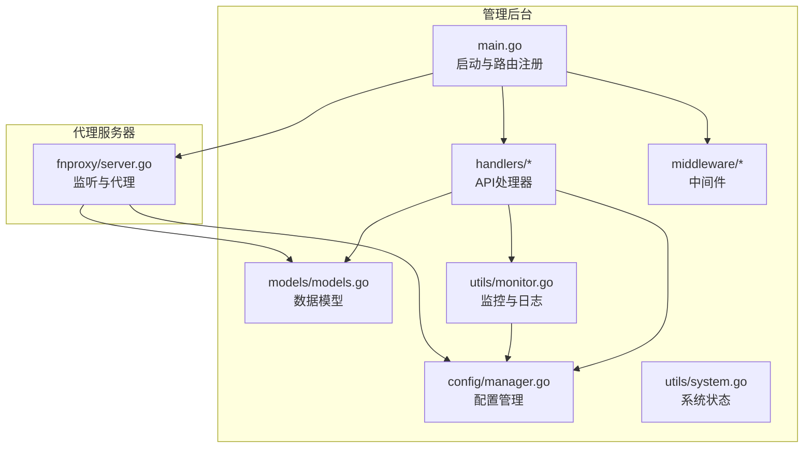
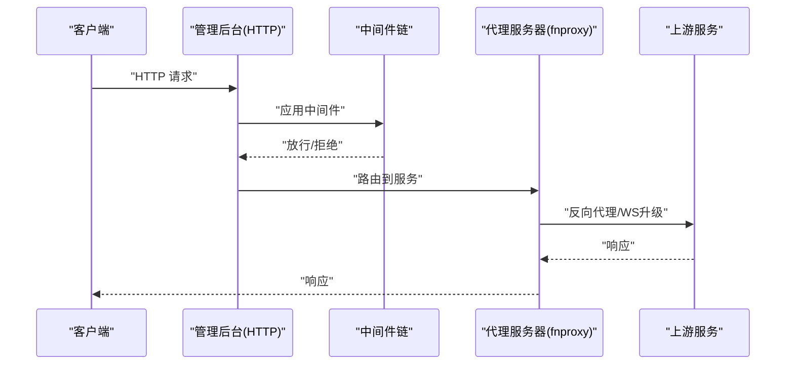
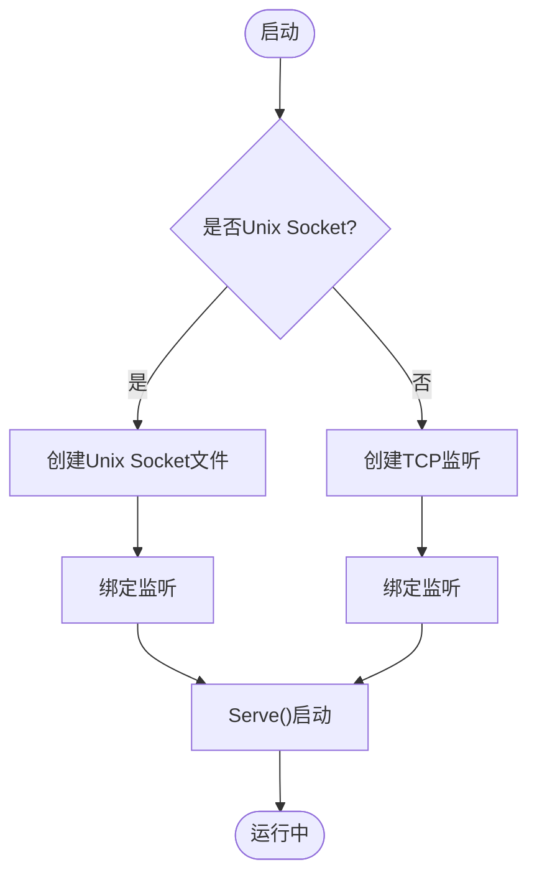
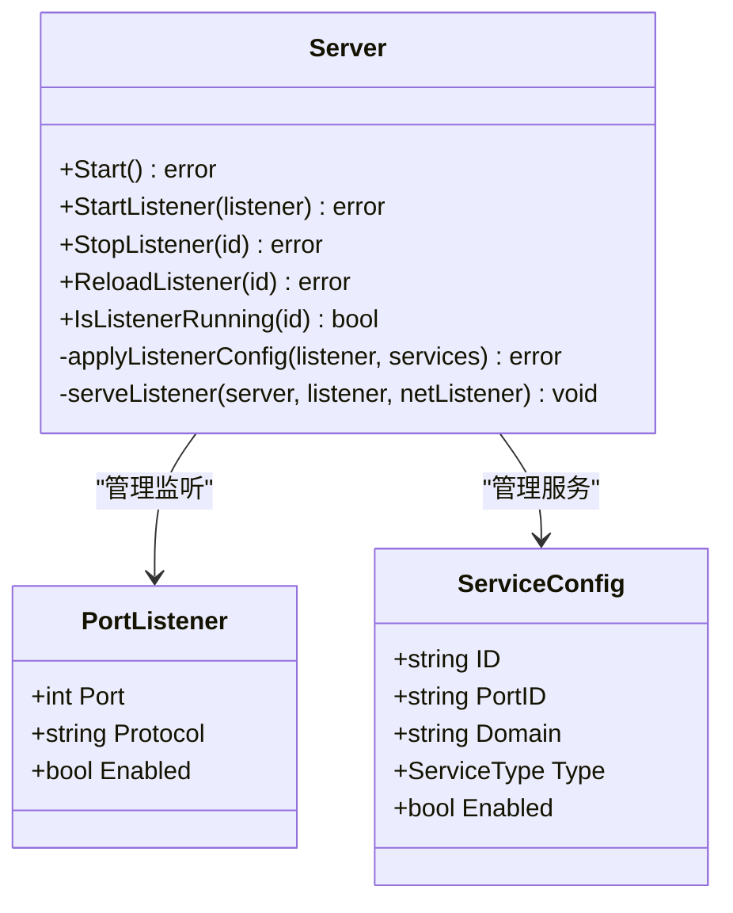
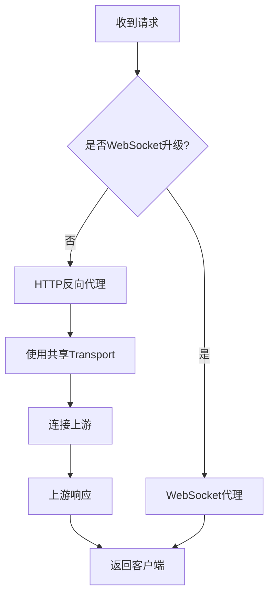
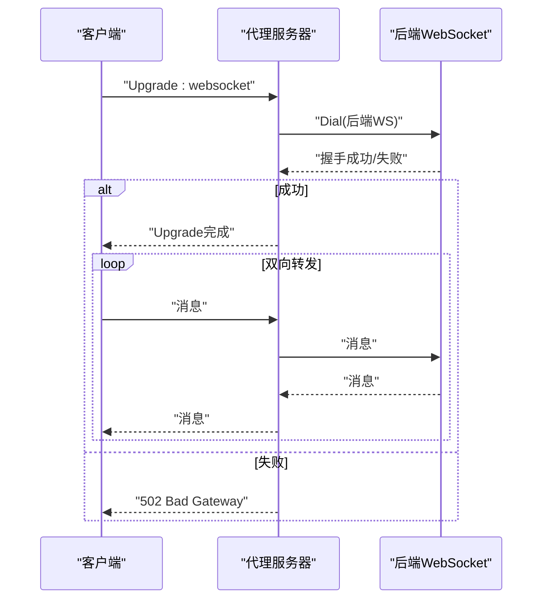
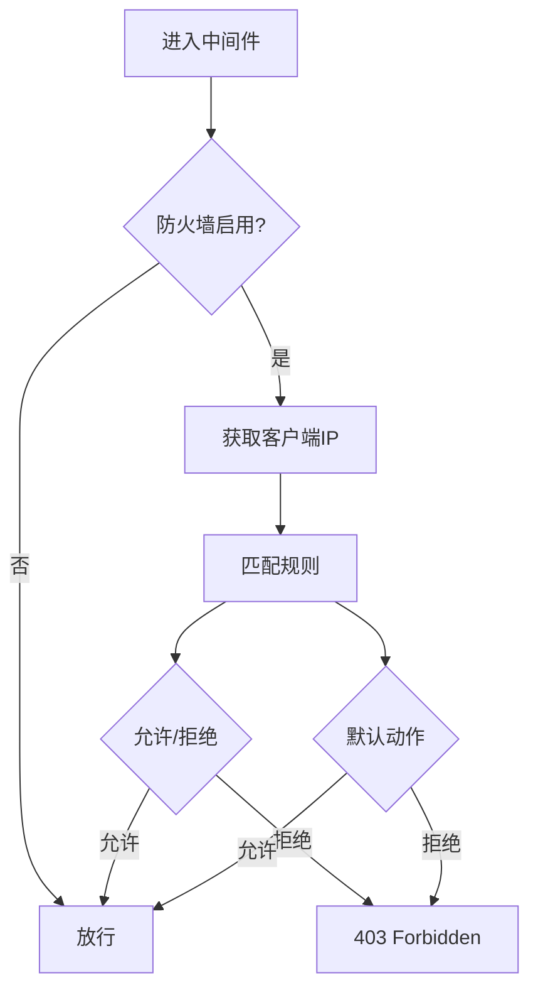
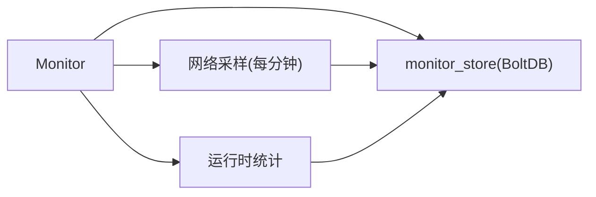
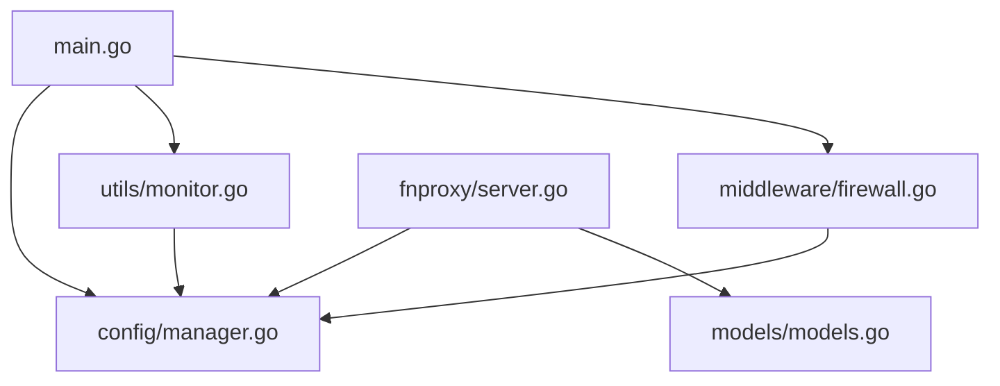

# 网络连接问题

<cite>
**本文档引用的文件**
- [src/main.go](file://src/main.go)
- [src/fnproxy/server.go](file://src/fnproxy/server.go)
- [src/middleware/firewall.go](file://src/middleware/firewall.go)
- [src/handlers/firewall.go](file://src/handlers/firewall.go)
- [src/config/manager.go](file://src/config/manager.go)
- [src/models/models.go](file://src/models/models.go)
- [src/utils/system.go](file://src/utils/system.go)
- [src/utils/monitor.go](file://src/utils/monitor.go)
- [src/utils/monitor_store.go](file://src/utils/monitor_store.go)
- [documents/ui-listener-fixes-20260311.md](file://documents/ui-listener-fixes-20260311.md)
</cite>

## 目录
1. [简介](#简介)
2. [项目结构](#项目结构)
3. [核心组件](#核心组件)
4. [架构总览](#架构总览)
5. [详细组件分析](#详细组件分析)
6. [依赖关系分析](#依赖关系分析)
7. [性能考量](#性能考量)
8. [故障排除指南](#故障排除指南)
9. [结论](#结论)
10. [附录](#附录)

## 简介
本指南面向 Caddy Panel 的网络连接问题，系统性覆盖端口监听失败、防火墙阻断、DNS 解析问题、代理连接超时、WebSocket 连接问题等常见故障，并提供网络中间件调试方法、连接状态检查、防火墙规则配置与 IP 白名单设置、网络连通性测试工具与命令行诊断方法、代理服务器网络配置验证与性能优化建议。文档以代码为依据，结合可视化图示帮助读者快速定位与解决问题。

## 项目结构
Caddy Panel 由管理后台与代理服务器两大部分组成：
- 管理后台：负责 UI、API、配置管理、安全审计与日志。
- 代理服务器：负责监听端口、路由服务、反向代理、静态文件、重定向、WebSocket 代理等。

**图表来源**
- [src/main.go:24-120](file://src/main.go#L24-L120)
- [src/fnproxy/server.go:37-50](file://src/fnproxy/server.go#L37-L50)
- [src/config/manager.go:35-72](file://src/config/manager.go#L35-L72)
- [src/models/models.go:72-107](file://src/models/models.go#L72-L107)
- [src/utils/system.go:19-82](file://src/utils/system.go#L19-L82)
- [src/utils/monitor.go:38-65](file://src/utils/monitor.go#L38-L65)

**章节来源**
- [src/main.go:24-120](file://src/main.go#L24-L120)
- [src/fnproxy/server.go:37-50](file://src/fnproxy/server.go#L37-L50)
- [src/config/manager.go:35-72](file://src/config/manager.go#L35-L72)
- [src/models/models.go:72-107](file://src/models/models.go#L72-L107)
- [src/utils/system.go:19-82](file://src/utils/system.go#L19-L82)
- [src/utils/monitor.go:38-65](file://src/utils/monitor.go#L38-L65)

## 核心组件
- 管理后台 HTTP 服务器：负责 UI、API、认证、日志与安全审计。
- 代理服务器：负责监听端口、动态路由、反向代理、静态文件、重定向、WebSocket 代理。
- 防火墙中间件：基于配置对请求进行允许/拒绝判定。
- 监控与日志：记录网络流量、连接数、请求量、访问日志并持久化。

**章节来源**
- [src/main.go:432-465](file://src/main.go#L432-L465)
- [src/fnproxy/server.go:183-227](file://src/fnproxy/server.go#L183-L227)
- [src/middleware/firewall.go:13-50](file://src/middleware/firewall.go#L13-L50)
- [src/utils/monitor.go:119-189](file://src/utils/monitor.go#L119-L189)

## 架构总览
管理后台启动后，挂载 API 路由与 WebSocket 路由，并应用中间件链（防火墙、认证、CORS、日志）。代理服务器按配置启动监听器，动态路由匹配服务规则，处理反向代理与 WebSocket 升级。

**图表来源**
- [src/main.go:421-431](file://src/main.go#L421-L431)
- [src/fnproxy/server.go:442-458](file://src/fnproxy/server.go#L442-L458)
- [src/fnproxy/server.go:576-583](file://src/fnproxy/server.go#L576-L583)

## 详细组件分析

### 管理后台监听与启动
- 管理后台支持 TCP 端口与 Unix Socket 两种监听方式，启动后输出监听地址。
- 端口占用冲突会导致启动失败，需检查端口占用与管理端口冲突。

**图表来源**
- [src/main.go:441-458](file://src/main.go#L441-L458)

**章节来源**
- [src/main.go:441-458](file://src/main.go#L441-L458)
- [documents/ui-listener-fixes-20260311.md:94-104](file://documents/ui-listener-fixes-20260311.md#L94-L104)

### 代理服务器监听与路由
- 代理服务器按配置启动监听器，支持 HTTP/HTTPS，HTTPS 使用证书管理器提供的证书。
- 动态路由基于 Host 匹配服务规则，支持通配符与默认规则。
- 热重载：更新服务配置时保留上次成功配置，避免启动失败导致服务中断。

**图表来源**
- [src/fnproxy/server.go:183-227](file://src/fnproxy/server.go#L183-L227)
- [src/fnproxy/server.go:370-425](file://src/fnproxy/server.go#L370-L425)
- [src/models/models.go:72-107](file://src/models/models.go#L72-L107)

**章节来源**
- [src/fnproxy/server.go:293-324](file://src/fnproxy/server.go#L293-L324)
- [src/fnproxy/server.go:326-339](file://src/fnproxy/server.go#L326-L339)
- [src/fnproxy/server.go:370-425](file://src/fnproxy/server.go#L370-L425)
- [src/models/models.go:72-107](file://src/models/models.go#L72-L107)

### 反向代理与超时配置
- 全局共享 Transport 启用连接复用，设置 Dial 超时、KeepAlive、空闲连接超时、TLS 握手超时、响应头超时等。
- 代理错误回调记录代理错误日志并返回 502。

**图表来源**
- [src/fnproxy/server.go:540-583](file://src/fnproxy/server.go#L540-L583)
- [src/fnproxy/server.go:142-161](file://src/fnproxy/server.go#L142-L161)

**章节来源**
- [src/fnproxy/server.go:540-583](file://src/fnproxy/server.go#L540-L583)
- [src/fnproxy/server.go:142-161](file://src/fnproxy/server.go#L142-L161)

### WebSocket 代理与握手
- WebSocket 升级请求通过 gorilla/websocket 处理，支持子协议透传。
- 代理时排除 hop-by-hop 头，必要时设置 X-Real-IP、X-Forwarded-* 等头。
- 后端连接超时与错误返回 502。

**图表来源**
- [src/fnproxy/server.go:586-589](file://src/fnproxy/server.go#L586-L589)
- [src/fnproxy/server.go:639-781](file://src/fnproxy/server.go#L639-L781)

**章节来源**
- [src/fnproxy/server.go:586-589](file://src/fnproxy/server.go#L586-L589)
- [src/fnproxy/server.go:639-781](file://src/fnproxy/server.go#L639-L781)

### 防火墙中间件与规则
- 中间件按配置启用/禁用，获取客户端真实 IP（优先 X-Forwarded-For/X-Real-IP/RemoteAddr）。
- 规则匹配优先级：IP 规则优先于国家规则，按优先级排序匹配。
- 默认动作：默认允许或默认拒绝，未匹配时按配置决定。

**图表来源**
- [src/middleware/firewall.go:14-50](file://src/middleware/firewall.go#L14-L50)
- [src/middleware/firewall.go:138-174](file://src/middleware/firewall.go#L138-L174)

**章节来源**
- [src/middleware/firewall.go:14-50](file://src/middleware/firewall.go#L14-L50)
- [src/middleware/firewall.go:138-174](file://src/middleware/firewall.go#L138-L174)
- [src/handlers/firewall.go:20-59](file://src/handlers/firewall.go#L20-L59)
- [src/handlers/firewall.go:61-106](file://src/handlers/firewall.go#L61-L106)
- [src/handlers/firewall.go:108-144](file://src/handlers/firewall.go#L108-L144)
- [src/handlers/firewall.go:146-167](file://src/handlers/firewall.go#L146-L167)

### 监控与日志
- 实时统计：请求计数、活动连接数、字节流入/流出、最近速率窗口。
- 网络历史：24 小时每 10 分钟平均速率，持久化到 BoltDB。
- 访问日志：按服务配置决定是否记录，支持按监听器/服务过滤。

**图表来源**
- [src/utils/monitor.go:78-117](file://src/utils/monitor.go#L78-L117)
- [src/utils/monitor.go:253-321](file://src/utils/monitor.go#L253-L321)
- [src/utils/monitor_store.go:30-54](file://src/utils/monitor_store.go#L30-L54)

**章节来源**
- [src/utils/monitor.go:78-117](file://src/utils/monitor.go#L78-L117)
- [src/utils/monitor.go:253-321](file://src/utils/monitor.go#L253-L321)
- [src/utils/monitor_store.go:30-54](file://src/utils/monitor_store.go#L30-L54)

## 依赖关系分析
- 管理后台依赖配置管理器获取全局与防火墙配置，依赖监控模块记录访问日志与网络历史。
- 代理服务器依赖配置管理器获取监听器与服务配置，依赖证书管理器提供 TLS 证书。
- 防火墙中间件依赖配置管理器获取防火墙配置与规则。

**图表来源**
- [src/main.go:82-110](file://src/main.go#L82-L110)
- [src/fnproxy/server.go:183-227](file://src/fnproxy/server.go#L183-L227)
- [src/config/manager.go:35-72](file://src/config/manager.go#L35-L72)
- [src/models/models.go:72-107](file://src/models/models.go#L72-L107)

**章节来源**
- [src/main.go:82-110](file://src/main.go#L82-L110)
- [src/fnproxy/server.go:183-227](file://src/fnproxy/server.go#L183-L227)
- [src/config/manager.go:35-72](file://src/config/manager.go#L35-L72)
- [src/models/models.go:72-107](file://src/models/models.go#L72-L107)

## 性能考量
- 连接复用：共享 Transport 提升上游连接复用效率，减少握手开销。
- 超时设置：合理设置 Dial、KeepAlive、TLS 握手、响应头超时，避免长时间占用连接。
- 空闲连接：控制 MaxIdleConns/MaxIdleConnsPerHost/IdleConnTimeout，平衡资源与性能。
- 日志与监控：访问日志与网络历史持久化到 BoltDB，避免内存膨胀；日志保留天数与最大条数可配置。

**章节来源**
- [src/fnproxy/server.go:142-161](file://src/fnproxy/server.go#L142-L161)
- [src/utils/monitor_store.go:188-199](file://src/utils/monitor_store.go#L188-L199)

## 故障排除指南

### 端口监听失败
- 症状：启动时报监听失败，控制台输出错误信息。
- 排查要点：
  - 管理后台端口被占用或与业务端口冲突。
  - 业务端口被其他程序占用，UI 已阻止保存并置为未启动状态。
  - Unix Socket 文件残留，需手动清理。
- 处理步骤：
  - 检查端口占用：使用系统工具查看端口占用情况。
  - 更改端口：通过启动参数覆盖管理端口或使用 Unix Socket。
  - 清理残留文件：删除 Unix Socket 文件后重试。

**章节来源**
- [src/main.go:441-458](file://src/main.go#L441-L458)
- [documents/ui-listener-fixes-20260311.md:73-85](file://documents/ui-listener-fixes-20260311.md#L73-L85)

### 防火墙阻断
- 症状：访问被拒绝，返回 403。
- 排查要点：
  - 防火墙是否启用，规则是否匹配。
  - 客户端 IP 是否在白名单，国家规则是否误判。
  - 默认动作是否为拒绝。
- 处理步骤：
  - 临时关闭防火墙验证问题来源。
  - 添加允许规则或调整默认动作。
  - 使用监控日志查看命中规则与来源 IP。

**章节来源**
- [src/middleware/firewall.go:14-50](file://src/middleware/firewall.go#L14-L50)
- [src/handlers/firewall.go:20-59](file://src/handlers/firewall.go#L20-L59)
- [src/utils/monitor.go:357-380](file://src/utils/monitor.go#L357-L380)

### DNS 解析问题
- 症状：上游服务无法解析域名，代理错误。
- 排查要点：
  - 上游地址是否为域名，解析是否正常。
  - 代理服务器所在主机 DNS 配置是否正确。
- 处理步骤：
  - 使用 nslookup/dig 检查域名解析。
  - 如需，将上游地址改为 IP 或配置本地 DNS。

**章节来源**
- [src/fnproxy/server.go:540-583](file://src/fnproxy/server.go#L540-L583)

### 代理连接超时
- 症状：代理返回 502，日志记录代理错误。
- 排查要点：
  - 上游服务可达性与健康状态。
  - 超时配置是否合理（Dial、TLS 握手、响应头）。
  - 连接池与空闲连接设置是否合适。
- 处理步骤：
  - 调整超时参数，观察效果。
  - 检查上游服务日志与健康检查。
  - 优化连接池参数，避免连接耗尽。

**章节来源**
- [src/fnproxy/server.go:557-572](file://src/fnproxy/server.go#L557-L572)
- [src/fnproxy/server.go:142-161](file://src/fnproxy/server.go#L142-L161)

### WebSocket 连接问题
- 症状：WebSocket 握手失败或连接中断。
- 排查要点：
  - Upgrade 头是否正确，子协议是否匹配。
  - 后端是否支持 WebSocket，是否需要特定头。
  - 代理是否排除了 hop-by-hop 头，是否设置了必要的转发头。
- 处理步骤：
  - 确认后端支持 WS/WSS。
  - 检查代理头设置与子协议透传。
  - 查看代理错误日志，定位握手失败原因。

**章节来源**
- [src/fnproxy/server.go:586-589](file://src/fnproxy/server.go#L586-L589)
- [src/fnproxy/server.go:639-781](file://src/fnproxy/server.go#L639-L781)

### 网络中间件调试方法
- 启用/禁用防火墙：通过 API 更新防火墙配置，观察访问结果。
- 查看命中规则：结合监控日志与访问日志，定位规则命中情况。
- 调整默认动作：从默认允许切换到默认拒绝，逐步收紧策略。

**章节来源**
- [src/handlers/firewall.go:20-59](file://src/handlers/firewall.go#L20-L59)
- [src/utils/monitor.go:357-380](file://src/utils/monitor.go#L357-L380)

### 连接状态检查
- 管理后台状态：通过系统状态接口查看运行时间、CPU、内存、网络 IO。
- 监听器与服务统计：查看每个监听器与服务的请求计数、活动连接数、速率。
- 访问日志：按监听器/服务过滤日志，定位异常请求。

**章节来源**
- [src/utils/system.go:19-82](file://src/utils/system.go#L19-L82)
- [src/utils/monitor.go:253-321](file://src/utils/monitor.go#L253-L321)
- [src/utils/monitor.go:357-380](file://src/utils/monitor.go#L357-L380)

### 防火墙规则配置与 IP 白名单
- 规则类型：IP/IP 段（CIDR）、国家。
- 优先级：数值越小优先级越高，按优先级排序匹配。
- 默认动作：允许或拒绝，未匹配时生效。
- IP 白名单：添加允许规则，优先级高于默认拒绝。

**章节来源**
- [src/models/models.go:346-382](file://src/models/models.go#L346-L382)
- [src/middleware/firewall.go:138-174](file://src/middleware/firewall.go#L138-L174)
- [src/handlers/firewall.go:61-106](file://src/handlers/firewall.go#L61-L106)

### 网络连通性测试与命令行诊断
- 端口连通性：使用 telnet/nc 测试端口可达性。
- DNS 解析：使用 nslookup/dig 检查域名解析。
- 超时与延迟：使用 curl -w/-m 测试响应时间与超时。
- 代理连通性：curl --proxy 检查代理链路。

**章节来源**
- [src/fnproxy/server.go:540-583](file://src/fnproxy/server.go#L540-L583)

### 代理服务器网络配置验证与性能优化
- 配置验证：
  - 确认监听端口与协议（HTTP/HTTPS）。
  - 校验服务域名规则与默认规则。
  - 重载监听器验证配置无误。
- 性能优化：
  - 合理设置超时参数，避免长时间占用连接。
  - 调整连接池参数，提升并发处理能力。
  - 启用连接复用，减少握手开销。

**章节来源**
- [src/fnproxy/server.go:370-425](file://src/fnproxy/server.go#L370-L425)
- [src/fnproxy/server.go:142-161](file://src/fnproxy/server.go#L142-L161)

## 结论
通过上述组件与流程的深入分析，可以系统性地定位与解决 Caddy Panel 的网络连接问题。建议在生产环境中：
- 启用并合理配置防火墙规则，优先允许可信来源。
- 使用监控与日志持续观察网络与服务状态。
- 调优代理超时与连接池参数，确保稳定性与性能。
- 对关键路径（管理后台、代理服务器）进行定期健康检查与压力测试。

## 附录
- 启动参数与动作：支持 status/stop/restart，以及 -config_path、-port 等参数。
- 默认证书：内置回退证书，未匹配到业务证书时提供基础 TLS 能力。

**章节来源**
- [documents/ui-listener-fixes-20260311.md:94-104](file://documents/ui-listener-fixes-20260311.md#L94-L104)
- [src/utils/default_fallback_certificate.go:1-24](file://src/utils/default_fallback_certificate.go#L1-L24)