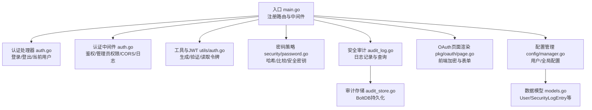
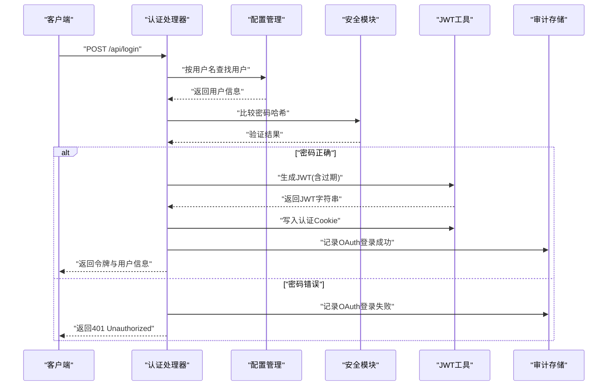
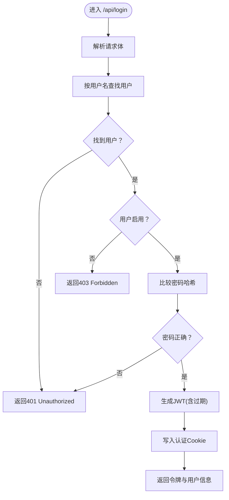
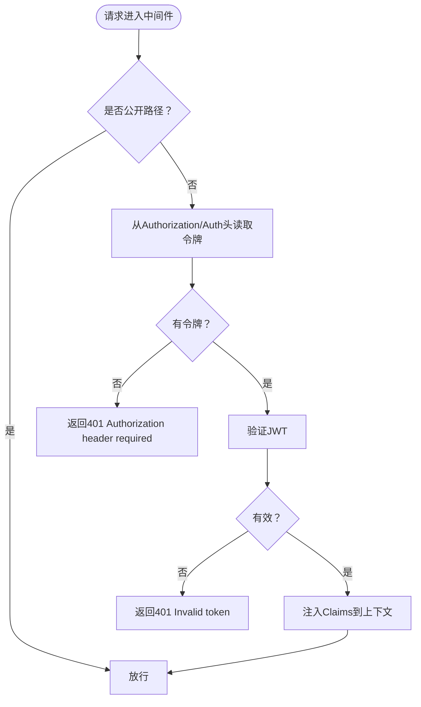
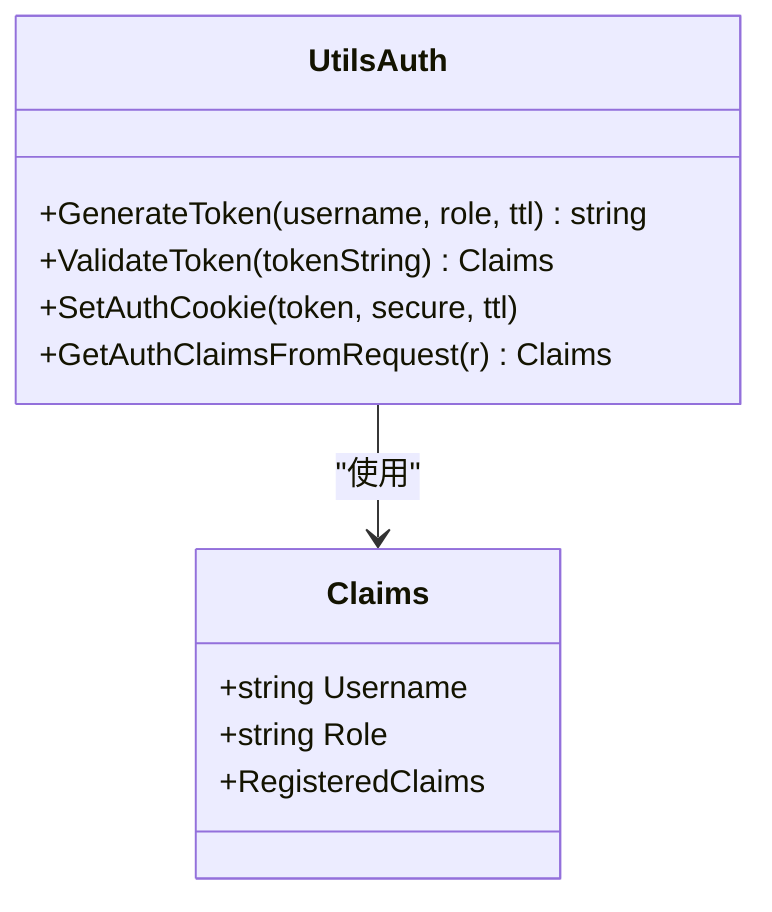
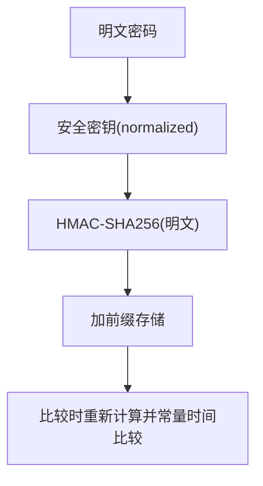
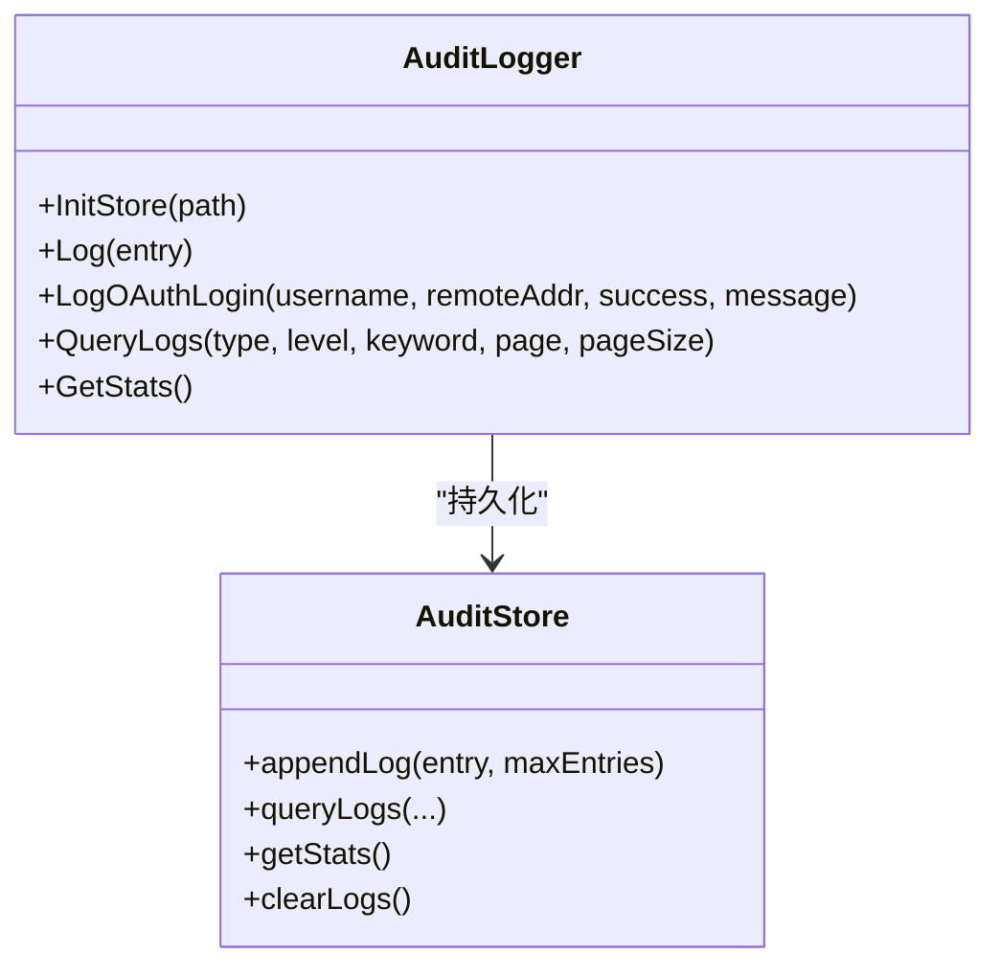
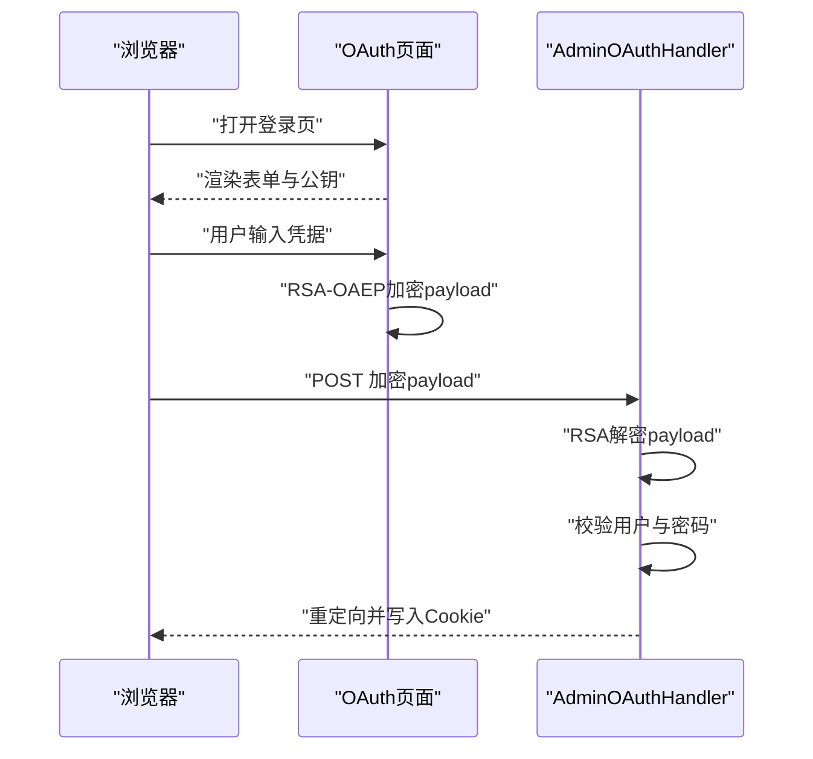
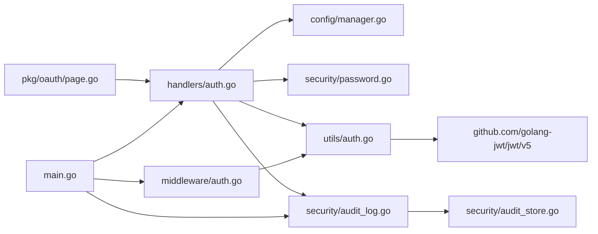

# 认证问题

<cite>
**本文引用的文件**
- [src/main.go](file://src/main.go)
- [src/handlers/auth.go](file://src/handlers/auth.go)
- [src/middleware/auth.go](file://src/middleware/auth.go)
- [src/utils/auth.go](file://src/utils/auth.go)
- [src/security/password.go](file://src/security/password.go)
- [src/security/audit_log.go](file://src/security/audit_log.go)
- [src/security/audit_store.go](file://src/security/audit_store.go)
- [src/handlers/security_logs.go](file://src/handlers/security_logs.go)
- [src/pkg/oauth/page.go](file://src/pkg/oauth/page.go)
- [src/config/manager.go](file://src/config/manager.go)
- [src/models/models.go](file://src/models/models.go)
</cite>

## 目录
1. [简介](#简介)
2. [项目结构](#项目结构)
3. [核心组件](#核心组件)
4. [架构总览](#架构总览)
5. [详细组件分析](#详细组件分析)
6. [依赖分析](#依赖分析)
7. [性能考虑](#性能考虑)
8. [故障排除指南](#故障排除指南)
9. [结论](#结论)
10. [附录](#附录)

## 简介
本指南聚焦于 Caddy Panel 的认证系统，覆盖 JWT 令牌生成失败、OAuth 登录异常、用户认证错误、密码验证问题等常见问题，并提供调试方法、常见错误处理、权限验证失败原因与解决方案、OAuth 配置检查清单、第三方认证服务连接测试方法、认证日志分析技巧与安全审计记录解读，以及密码策略与用户账户管理最佳实践。文档以实际源码为依据，配合可视化图示帮助快速定位与解决问题。

## 项目结构
认证相关模块主要分布在以下文件：
- 入口与路由：src/main.go
- 认证处理器：src/handlers/auth.go
- 认证中间件：src/middleware/auth.go
- 工具与 JWT：src/utils/auth.go
- 密码策略：src/security/password.go
- 安全审计日志：src/security/audit_log.go、src/security/audit_store.go、src/handlers/security_logs.go
- OAuth 页面渲染：src/pkg/oauth/page.go
- 配置与用户模型：src/config/manager.go、src/models/models.go

图表来源
- [src/main.go:112-429](file://src/main.go#L112-L429)
- [src/handlers/auth.go:38-198](file://src/handlers/auth.go#L38-L198)
- [src/middleware/auth.go:14-119](file://src/middleware/auth.go#L14-L119)
- [src/utils/auth.go:24-139](file://src/utils/auth.go#L24-L139)
- [src/security/password.go:44-71](file://src/security/password.go#L44-L71)
- [src/security/audit_log.go:62-224](file://src/security/audit_log.go#L62-L224)
- [src/security/audit_store.go:26-222](file://src/security/audit_store.go#L26-L222)
- [src/pkg/oauth/page.go:15-197](file://src/pkg/oauth/page.go#L15-L197)
- [src/config/manager.go:511-544](file://src/config/manager.go#L511-L544)
- [src/models/models.go:256-344](file://src/models/models.go#L256-L344)

章节来源
- [src/main.go:112-429](file://src/main.go#L112-L429)

## 核心组件
- 认证处理器：负责登录、登出、获取当前用户、OAuth 登录页面渲染与处理、JWT 生成与 Cookie 设置。
- 认证中间件：统一处理公开路径、Authorization/Bearer 令牌校验、上下文注入、管理员权限校验。
- 工具与 JWT：封装 JWT Claims 结构、HS256 签名、令牌生成与验证、Cookie 读写、头部令牌规范化。
- 密码策略：基于 HMAC-SHA256 的安全哈希，常量时间比较，安全密钥管理。
- 安全审计日志：记录 OAuth 登录、代理错误、SSH 连接、系统操作，支持查询、统计、清理。
- OAuth 页面：前端使用 WebCrypto 或 Forge 实现 RSA-OAEP 加密，提交加密后的凭据。
- 配置与用户模型：用户实体、角色、启用状态、令牌字段；全局配置含默认认证开关与日志上限。

章节来源
- [src/handlers/auth.go:22-115](file://src/handlers/auth.go#L22-L115)
- [src/middleware/auth.go:14-91](file://src/middleware/auth.go#L14-L91)
- [src/utils/auth.go:17-139](file://src/utils/auth.go#L17-L139)
- [src/security/password.go:12-71](file://src/security/password.go#L12-L71)
- [src/security/audit_log.go:15-224](file://src/security/audit_log.go#L15-L224)
- [src/pkg/oauth/page.go:15-197](file://src/pkg/oauth/page.go#L15-L197)
- [src/config/manager.go:511-544](file://src/config/manager.go#L511-L544)
- [src/models/models.go:256-344](file://src/models/models.go#L256-L344)

## 架构总览
认证流程概览：客户端发起登录请求，服务端验证用户与密码，生成 JWT 并写入 Cookie；后续请求由中间件从 Authorization 或 Cookie 中提取并验证令牌，注入上下文供业务使用；OAuth 登录页面通过前端加密提交凭据，服务端解密后进行认证。

图表来源
- [src/handlers/auth.go:38-76](file://src/handlers/auth.go#L38-L76)
- [src/config/manager.go:518-528](file://src/config/manager.go#L518-L528)
- [src/security/password.go:54-70](file://src/security/password.go#L54-L70)
- [src/utils/auth.go:24-70](file://src/utils/auth.go#L24-L70)
- [src/security/audit_log.go:82-99](file://src/security/audit_log.go#L82-L99)

## 详细组件分析

### 认证处理器（登录/登出/当前用户/OAuth）
- 登录流程：解析请求体 -> 查找用户 -> 校验启用状态 -> 密码比较 -> 生成 JWT -> 写入 Cookie -> 返回响应。
- OAuth 登录：若已登录则重定向；GET 渲染登录页；POST 解析表单 -> 解密 payload -> 校验用户与密码 -> 生成 JWT -> 写入 Cookie -> 重定向。
- 当前用户：从上下文读取 Claims -> 查询用户 -> 返回用户信息。
- 公钥接口：暴露 OAuth 公钥 PEM，供前端加密使用。

图表来源
- [src/handlers/auth.go:38-76](file://src/handlers/auth.go#L38-L76)
- [src/security/password.go:54-70](file://src/security/password.go#L54-L70)
- [src/utils/auth.go:24-70](file://src/utils/auth.go#L24-L70)

章节来源
- [src/handlers/auth.go:22-115](file://src/handlers/auth.go#L22-L115)
- [src/handlers/auth.go:124-198](file://src/handlers/auth.go#L124-L198)

### 认证中间件（鉴权/管理员权限/CORS/日志）
- 公开路径：/api/login、/api/auth/public-key、/api/logout 不需要认证。
- 令牌来源优先级：Authorization 头（Bearer）-> Cookie -> 自定义 Auth 头。
- 管理员权限：要求角色为 admin。
- CORS/日志：设置跨域头与简单日志输出。

图表来源
- [src/middleware/auth.go:14-55](file://src/middleware/auth.go#L14-L55)
- [src/utils/auth.go:86-139](file://src/utils/auth.go#L86-L139)

章节来源
- [src/middleware/auth.go:14-91](file://src/middleware/auth.go#L14-L91)

### 工具与 JWT（Claims/生成/验证/读取）
- Claims：包含用户名、角色与标准声明（过期/签发时间）。
- 生成：HS256 签名，使用全局密钥。
- 验证：解析并校验签名，返回 Claims。
- Cookie 读取：支持 Authorization、Auth 头与 Cookie 三种来源，优先级不同。
- 头部令牌规范化：自动去除 Bearer/Token/Auth 前缀。

图表来源
- [src/utils/auth.go:17-139](file://src/utils/auth.go#L17-L139)

章节来源
- [src/utils/auth.go:17-139](file://src/utils/auth.go#L17-L139)

### 密码策略（HMAC-SHA256/常量时间比较）
- 存储格式：以特定前缀标识的 HMAC-SHA256 哈希。
- 比较：使用常量时间比较，避免时序攻击。
- 安全密钥：运行时可设置，影响哈希计算。

图表来源
- [src/security/password.go:44-70](file://src/security/password.go#L44-L70)

章节来源
- [src/security/password.go:12-71](file://src/security/password.go#L12-L71)

### 安全审计日志（记录/查询/统计）
- 记录：OAuth 登录（成功/失败）、代理错误、SSH 连接、系统操作。
- 存储：BoltDB，按时间复合键存储，自动裁剪至最大条数。
- 查询：支持类型、级别、关键词过滤，分页。
- 统计：按类型统计总数。

图表来源
- [src/security/audit_log.go:15-224](file://src/security/audit_log.go#L15-L224)
- [src/security/audit_store.go:22-222](file://src/security/audit_store.go#L22-L222)

章节来源
- [src/security/audit_log.go:62-224](file://src/security/audit_log.go#L62-L224)
- [src/security/audit_store.go:47-222](file://src/security/audit_store.go#L47-L222)
- [src/handlers/security_logs.go:10-65](file://src/handlers/security_logs.go#L10-L65)

### OAuth 页面与加密（前端加密提交）
- 前端：优先使用 WebCrypto RSA-OAEP，失败回退到 Forge。
- 服务端：接收加密 payload，使用私钥解密，再进行用户认证与令牌生成。

图表来源
- [src/pkg/oauth/page.go:15-197](file://src/pkg/oauth/page.go#L15-L197)
- [src/handlers/auth.go:124-198](file://src/handlers/auth.go#L124-L198)

章节来源
- [src/pkg/oauth/page.go:15-197](file://src/pkg/oauth/page.go#L15-L197)
- [src/handlers/auth.go:200-242](file://src/handlers/auth.go#L200-L242)

## 依赖分析
- 认证处理器依赖配置管理（用户查找）、安全模块（密码比较）、工具模块（JWT 生成/验证/Cookie）、审计日志（登录记录）。
- 认证中间件依赖工具模块（令牌读取/验证）、处理器（错误响应）。
- 工具模块依赖 JWT 库、配置管理（令牌用户映射）。
- 审计日志依赖 BoltDB 存储与模型。
- OAuth 页面依赖前端库（Forge）与后端公钥。

图表来源
- [src/handlers/auth.go:3-20](file://src/handlers/auth.go#L3-L20)
- [src/middleware/auth.go:3-12](file://src/middleware/auth.go#L3-L12)
- [src/utils/auth.go:3-11](file://src/utils/auth.go#L3-L11)
- [src/security/audit_log.go:3-10](file://src/security/audit_log.go#L3-L10)
- [src/pkg/oauth/page.go:3-10](file://src/pkg/oauth/page.go#L3-L10)
- [src/main.go:16-22](file://src/main.go#L16-L22)

章节来源
- [src/main.go:112-429](file://src/main.go#L112-L429)

## 性能考虑
- JWT 生成/验证为轻量 CPU 操作，瓶颈通常在磁盘 I/O（审计日志）与网络延迟。
- 审计日志采用 BoltDB，写入时会裁剪至最大条数，避免无限增长。
- 建议合理设置日志上限与保留天数，避免磁盘压力。

[本节为通用指导，无需引用具体文件]

## 故障排除指南

### 一、JWT 令牌生成失败
- 症状：登录成功但返回“生成令牌失败”。
- 排查要点：
  - 检查 JWT 密钥是否被意外重置或未正确加载（工具模块使用全局密钥）。
  - 确认生成逻辑未抛出异常（HS256 签名与过期时间设置）。
  - 检查响应头与 Cookie 设置是否成功。
- 建议：
  - 在启动参数中显式设置安全参数，确保密钥稳定。
  - 查看审计日志中是否有“生成令牌失败”的记录。

章节来源
- [src/utils/auth.go:24-37](file://src/utils/auth.go#L24-L37)
- [src/handlers/auth.go:61-65](file://src/handlers/auth.go#L61-L65)

### 二、OAuth 登录异常
- 症状：登录页无法提交、加密失败、登录后未写入 Cookie。
- 排查要点：
  - 前端加密：确认公钥是否正确获取，浏览器是否支持 WebCrypto，否则回退到 Forge。
  - 服务端解密：检查私钥是否存在、Base64 字符串是否正确（替换字符与填充）。
  - 表单解析与负载解析：检查表单解析错误与负载解析错误。
  - 用户状态：用户存在且启用，密码正确。
- 建议：
  - 使用“获取当前用户”接口验证登录状态。
  - 查看审计日志中的 OAuth 登录记录，区分成功与失败场景。

章节来源
- [src/pkg/oauth/page.go:15-197](file://src/pkg/oauth/page.go#L15-L197)
- [src/handlers/auth.go:124-198](file://src/handlers/auth.go#L124-L198)
- [src/handlers/auth.go:200-242](file://src/handlers/auth.go#L200-L242)
- [src/security/audit_log.go:82-99](file://src/security/audit_log.go#L82-L99)

### 三、用户认证错误
- 症状：返回“无效凭据”或“用户不存在/被禁用”。
- 排查要点：
  - 用户名大小写与空白字符。
  - 用户启用状态。
  - 密码哈希比较是否通过（常量时间比较）。
- 建议：
  - 使用“获取当前用户”接口验证 Claims 注入是否成功。
  - 检查配置管理中的用户列表与角色。

章节来源
- [src/handlers/auth.go:45-59](file://src/handlers/auth.go#L45-L59)
- [src/config/manager.go:518-528](file://src/config/manager.go#L518-L528)
- [src/security/password.go:54-70](file://src/security/password.go#L54-L70)

### 四、密码验证问题
- 症状：密码正确仍提示错误。
- 排查要点：
  - 安全密钥是否一致（运行时设置与存储哈希使用的密钥）。
  - 存储格式是否为带前缀的 HMAC-SHA256。
  - 比较过程是否使用常量时间。
- 建议：
  - 更改密码时确保使用安全密钥一致。
  - 如需迁移，确保新旧密钥一致或批量更新哈希。

章节来源
- [src/security/password.go:44-70](file://src/security/password.go#L44-L70)

### 五、权限验证失败（管理员访问）
- 症状：返回“需要管理员权限”。
- 排查要点：
  - 请求是否携带有效 JWT 或自定义令牌。
  - Claims 中的角色是否为 admin。
  - 中间件是否正确注入上下文。
- 建议：
  - 使用“获取当前用户”接口确认角色。
  - 检查中间件链路与公开路径配置。

章节来源
- [src/middleware/auth.go:75-91](file://src/middleware/auth.go#L75-L91)
- [src/utils/auth.go:101-123](file://src/utils/auth.go#L101-L123)

### 六、认证中间件调试方法
- 打印请求路径与方法，确认是否命中公开路径。
- 检查 Authorization/Auth 头是否正确传递。
- 验证 JWT 格式（Bearer Token），确保签名有效。
- 使用“获取当前用户”接口验证上下文中的 Claims。

章节来源
- [src/middleware/auth.go:14-55](file://src/middleware/auth.go#L14-L55)
- [src/utils/auth.go:86-139](file://src/utils/auth.go#L86-L139)

### 七、OAuth 配置检查清单
- 公钥/私钥：服务端是否正确加载公钥与私钥。
- 前端加密：浏览器是否支持 WebCrypto，否则回退到 Forge。
- 表单与负载：表单解析、负载解析、Base64 字符串修正。
- 用户与密码：用户存在、启用、密码正确。
- Cookie：是否正确写入与读取。

章节来源
- [src/pkg/oauth/page.go:15-197](file://src/pkg/oauth/page.go#L15-L197)
- [src/handlers/auth.go:124-198](file://src/handlers/auth.go#L124-L198)

### 八、第三方认证服务连接测试
- 本项目使用本地 JWT 与 OAuth 页面加密机制，不直接对接第三方认证服务。
- 若需集成外部认证，应在现有中间件与处理器基础上扩展，遵循：
  - 令牌格式标准化（Bearer/自定义）。
  - Claims 注入与上下文传递。
  - 审计日志记录与错误处理。

[本节为概念性指导，无需引用具体文件]

### 九、认证日志分析技巧与安全审计记录解读
- 日志类型：OAuth 登录、代理错误、SSH 连接、系统操作。
- 查询与过滤：按类型、级别、关键词、分页查询。
- 统计：按类型统计总数，辅助识别异常峰值。
- 清理：定期清理过期日志，避免磁盘压力。

章节来源
- [src/security/audit_log.go:62-224](file://src/security/audit_log.go#L62-L224)
- [src/handlers/security_logs.go:10-65](file://src/handlers/security_logs.go#L10-L65)
- [src/security/audit_store.go:69-129](file://src/security/audit_store.go#L69-L129)

### 十、密码策略配置与用户账户管理最佳实践
- 密码策略：
  - 使用安全密钥，避免默认密钥用于生产。
  - 存储使用带前缀的 HMAC-SHA256 哈希。
  - 比较使用常量时间算法。
- 用户账户管理：
  - 启用状态与角色分离，严格限制管理员权限。
  - 定期轮换密码与密钥。
  - 通过配置管理维护用户列表与角色。

章节来源
- [src/security/password.go:12-71](file://src/security/password.go#L12-L71)
- [src/config/manager.go:511-544](file://src/config/manager.go#L511-L544)
- [src/models/models.go:256-267](file://src/models/models.go#L256-L267)

## 结论
Caddy Panel 的认证系统以 JWT 为核心，结合 OAuth 页面加密与安全审计日志，形成完整的认证闭环。通过本文提供的故障排除步骤、调试方法与最佳实践，可快速定位并解决 JWT 生成、OAuth 登录、权限验证与密码策略等问题，同时提升系统的安全性与可观测性。

[本节为总结，无需引用具体文件]

## 附录

### A. 常见错误码与含义
- 400：请求体无效（登录请求体解析失败）。
- 401：未授权/无效令牌/缺少 Authorization 头。
- 403：用户被禁用/需要管理员权限。
- 404：用户不存在。

章节来源
- [src/handlers/auth.go:40-59](file://src/handlers/auth.go#L40-L59)
- [src/middleware/auth.go:33-48](file://src/middleware/auth.go#L33-L48)

### B. 关键接口与路径
- 登录：POST /api/login
- 登出：POST /api/logout
- 当前用户：GET /api/me
- OAuth 公钥：GET /api/auth/public-key
- OAuth 登录页面：GET /admin-oauth

章节来源
- [src/main.go:127-130](file://src/main.go#L127-L130)
- [src/main.go:114-121](file://src/main.go#L114-L121)