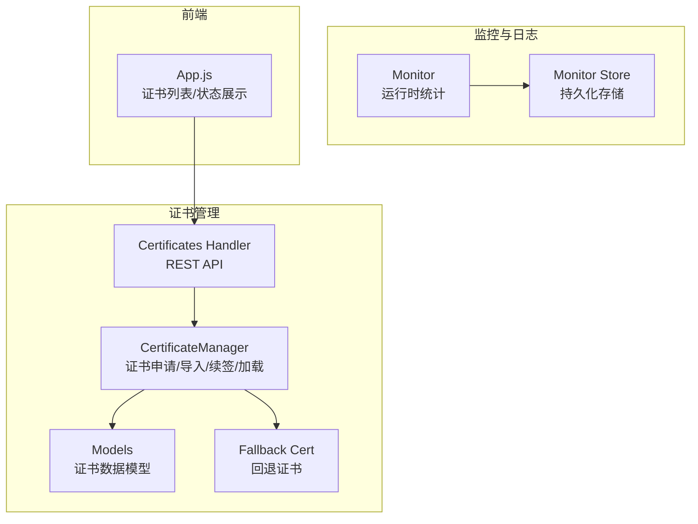
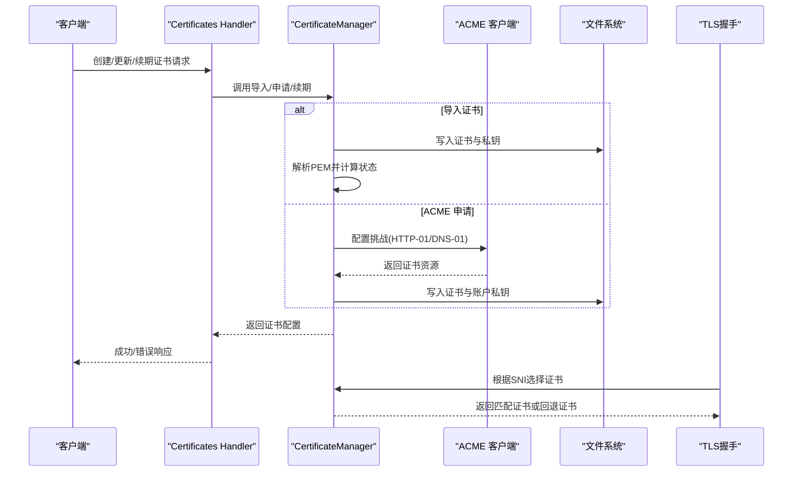
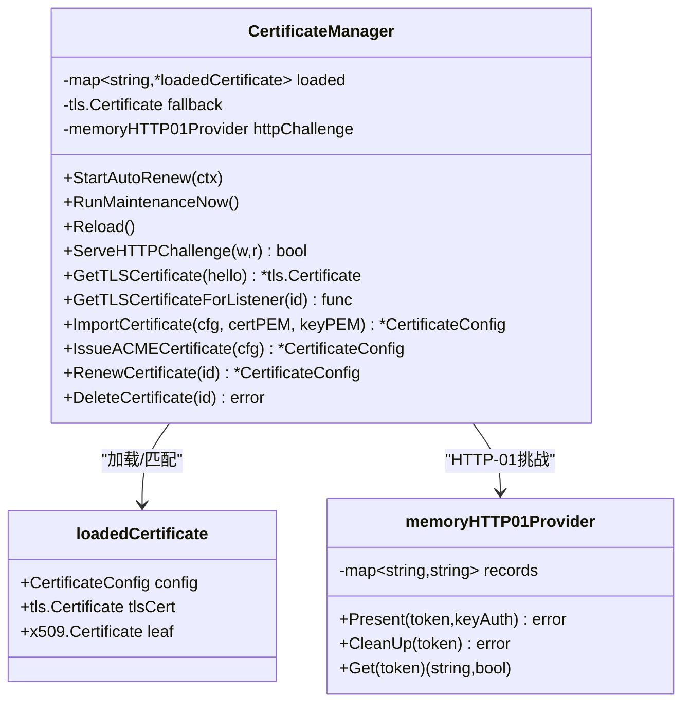
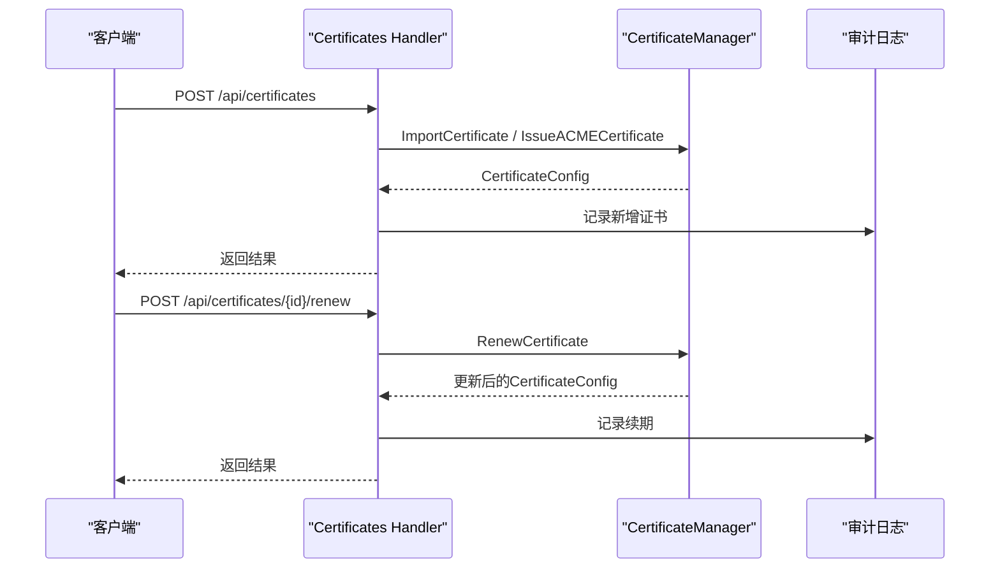
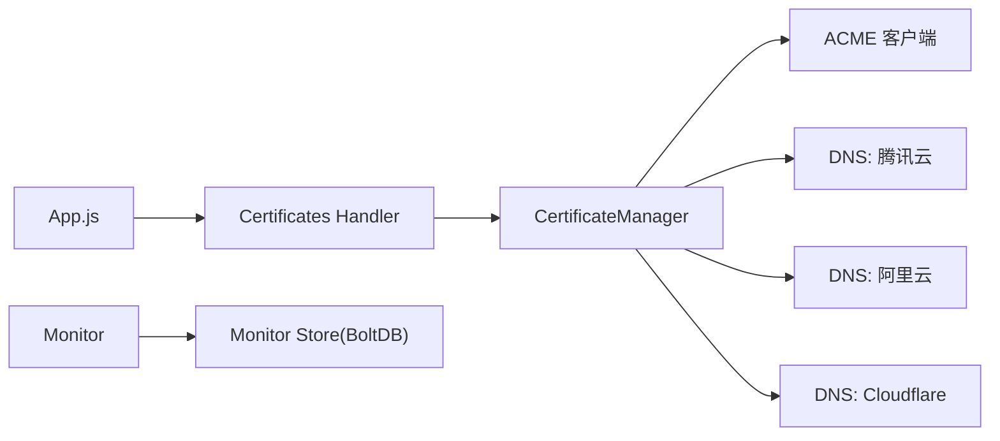

# 证书问题

<cite>
**本文引用的文件**
- [certificate_manager.go](file://src/utils/certificate_manager.go)
- [certificates.go](file://src/handlers/certificates.go)
- [models.go](file://src/models/models.go)
- [default_fallback_certificate.go](file://src/utils/default_fallback_certificate.go)
- [monitor.go](file://src/utils/monitor.go)
- [monitor_store.go](file://src/utils/monitor_store.go)
- [certificate_manager_test.go](file://src/utils/certificate_manager_test.go)
- [app.js](file://src/static/app.js)
</cite>

## 目录
1. [简介](#简介)
2. [项目结构](#项目结构)
3. [核心组件](#核心组件)
4. [架构总览](#架构总览)
5. [详细组件分析](#详细组件分析)
6. [依赖分析](#依赖分析)
7. [性能考虑](#性能考虑)
8. [故障排除指南](#故障排除指南)
9. [结论](#结论)
10. [附录](#附录)

## 简介
本指南聚焦于 Caddy Panel 的证书管理与故障排除，覆盖 ACME 证书申请失败、DNS 验证超时、证书过期、域名不匹配、证书导入错误、自动续期失败、证书链完整性与格式验证、DNS 提供商配置差异与常见陷阱、证书监控与告警、以及证书备份、恢复与手动更新操作。文档基于代码实现进行分析，并提供可视化图示帮助快速定位问题。

## 项目结构
与证书相关的代码主要分布在以下模块：
- 证书管理与运行时加载：src/utils/certificate_manager.go
- 证书 API 处理：src/handlers/certificates.go
- 数据模型与配置：src/models/models.go
- 回退证书与测试：src/utils/default_fallback_certificate.go、src/utils/certificate_manager_test.go
- 监控与日志：src/utils/monitor.go、src/utils/monitor_store.go
- 前端展示：src/static/app.js

图表来源
- [certificate_manager.go:126-151](file://src/utils/certificate_manager.go#L126-L151)
- [certificates.go:32-149](file://src/handlers/certificates.go#L32-L149)
- [models.go:221-254](file://src/models/models.go#L221-L254)
- [default_fallback_certificate.go:1-55](file://src/utils/default_fallback_certificate.go#L1-L55)
- [monitor.go:38-65](file://src/utils/monitor.go#L38-L65)
- [monitor_store.go:26-54](file://src/utils/monitor_store.go#L26-L54)
- [app.js:1970-2146](file://src/static/app.js#L1970-L2146)

章节来源
- [certificate_manager.go:126-151](file://src/utils/certificate_manager.go#L126-L151)
- [certificates.go:32-149](file://src/handlers/certificates.go#L32-L149)
- [models.go:221-254](file://src/models/models.go#L221-L254)
- [default_fallback_certificate.go:1-55](file://src/utils/default_fallback_certificate.go#L1-L55)
- [monitor.go:38-65](file://src/utils/monitor.go#L38-L65)
- [monitor_store.go:26-54](file://src/utils/monitor_store.go#L26-L54)
- [app.js:1970-2146](file://src/static/app.js#L1970-L2146)

## 核心组件
- 证书管理器（CertificateManager）
  - 单例管理证书生命周期：申请、导入、续签、运行时加载、回退证书、HTTP-01 挑战响应。
  - 支持 ACME 申请（HTTP-01/DNS-01）、导入证书、外部配置文件同步证书。
  - 自动续期任务按配置周期执行，记录错误与状态。
- 证书 API 处理器（Certificates Handler）
  - 提供证书列表、详情、创建（导入/ACME）、更新、删除、续期等接口。
  - 对敏感字段进行脱敏返回。
- 数据模型（Models）
  - 定义证书来源、挑战类型、DNS 提供商、证书状态、证书配置结构及全局配置项（含证书同步路径与周期）。
- 监控与日志（Monitor/Store）
  - 提供运行时统计、网络采样、访问日志持久化，便于排查证书相关问题（如 443/80 端口占用、证书加载失败等）。

章节来源
- [certificate_manager.go:126-151](file://src/utils/certificate_manager.go#L126-L151)
- [certificates.go:32-149](file://src/handlers/certificates.go#L32-L149)
- [models.go:165-254](file://src/models/models.go#L165-L254)
- [monitor.go:38-65](file://src/utils/monitor.go#L38-L65)
- [monitor_store.go:26-54](file://src/utils/monitor_store.go#L26-L54)

## 架构总览
证书工作流从 API 接收请求，进入证书管理器，根据来源与挑战类型调用相应逻辑；运行时通过 TLS 握手选择匹配证书，若无匹配则使用内置回退证书。

图表来源
- [certificates.go:55-94](file://src/handlers/certificates.go#L55-L94)
- [certificate_manager.go:309-373](file://src/utils/certificate_manager.go#L309-L373)
- [certificate_manager.go:441-533](file://src/utils/certificate_manager.go#L441-L533)
- [certificate_manager.go:271-306](file://src/utils/certificate_manager.go#L271-L306)

## 详细组件分析

### 证书管理器（CertificateManager）
- 单例初始化与回退证书
  - 初始化内存 HTTP-01 挑战提供者，确保回退证书可用。
- 自动续期
  - 后台定时器按全局配置周期执行，检查到期时间与下次续签时间，触发续签。
- 运行时证书选择
  - 优先按监听器绑定的证书匹配，其次按域名精确匹配或通配符匹配，最后回退。
- ACME 申请流程
  - 生成/加载账户私钥，注册 ACME 账户，配置挑战提供者（HTTP-01 或 DNS-01），发起证书申请，保存证书与账户密钥。
- 证书导入
  - 校验 PEM 格式与域名，写入文件，更新配置与内存缓存。
- 外部配置文件同步
  - 读取 JSON 配置文件，同步证书与私钥路径，自动更新状态与到期时间。

图表来源
- [certificate_manager.go:126-151](file://src/utils/certificate_manager.go#L126-L151)
- [certificate_manager.go:88-124](file://src/utils/certificate_manager.go#L88-L124)
- [certificate_manager.go:218-251](file://src/utils/certificate_manager.go#L218-L251)

章节来源
- [certificate_manager.go:126-151](file://src/utils/certificate_manager.go#L126-L151)
- [certificate_manager.go:192-216](file://src/utils/certificate_manager.go#L192-L216)
- [certificate_manager.go:218-251](file://src/utils/certificate_manager.go#L218-L251)
- [certificate_manager.go:253-269](file://src/utils/certificate_manager.go#L253-L269)
- [certificate_manager.go:271-306](file://src/utils/certificate_manager.go#L271-L306)
- [certificate_manager.go:441-533](file://src/utils/certificate_manager.go#L441-L533)
- [certificate_manager.go:309-373](file://src/utils/certificate_manager.go#L309-L373)
- [certificate_manager.go:595-795](file://src/utils/certificate_manager.go#L595-L795)

### 证书 API 处理器（Certificates Handler）
- 列表/详情：排序并返回证书配置，敏感字段脱敏。
- 创建：支持导入证书与 ACME 申请两种来源。
- 更新：支持导入证书替换与 ACME 配置变更检测。
- 删除：解除服务绑定后删除证书文件与配置。
- 续期：手动触发续期并记录审计日志。

图表来源
- [certificates.go:55-94](file://src/handlers/certificates.go#L55-L94)
- [certificates.go:136-149](file://src/handlers/certificates.go#L136-L149)
- [certificates.go:151-162](file://src/handlers/certificates.go#L151-L162)

章节来源
- [certificates.go:32-149](file://src/handlers/certificates.go#L32-L149)
- [certificates.go:151-162](file://src/handlers/certificates.go#L151-L162)

### 数据模型（Models）
- 证书来源：ACME、导入、外部配置文件同步。
- 挑战类型：HTTP-01、DNS-01。
- DNS 提供商：腾讯云、阿里云、Cloudflare。
- 证书状态：待签发、有效、续签中、错误、已过期。
- 全局配置：证书同步路径与周期。

章节来源
- [models.go:165-219](file://src/models/models.go#L165-L219)
- [models.go:221-254](file://src/models/models.go#L221-L254)
- [models.go:299-310](file://src/models/models.go#L299-L310)

### 监控与日志（Monitor/Store）
- 运行时统计：请求计数、活跃连接、字节速率、最近事件窗口。
- 网络采样：定时采集网卡 IO 并持久化。
- 访问日志：持久化访问日志，支持按监听器/服务过滤查询。
- 证书相关排查：结合 443/80 端口占用、证书加载失败、域名匹配异常等问题定位。

章节来源
- [monitor.go:38-65](file://src/utils/monitor.go#L38-L65)
- [monitor.go:119-189](file://src/utils/monitor.go#L119-L189)
- [monitor.go:253-321](file://src/utils/monitor.go#L253-L321)
- [monitor_store.go:26-54](file://src/utils/monitor_store.go#L26-L54)
- [monitor_store.go:102-155](file://src/utils/monitor_store.go#L102-L155)

## 依赖分析
- 证书管理器依赖 ACME 客户端库（lego）与 DNS 提供商 SDK（腾讯云、阿里云、Cloudflare）。
- 证书 API 处理器依赖证书管理器与审计日志。
- 监控模块依赖持久化存储（BoltDB）与系统网络指标库。
- 前端通过 API 展示证书状态、错误信息与续签时间。

图表来源
- [certificate_manager.go:30-37](file://src/utils/certificate_manager.go#L30-L37)
- [certificate_manager.go:855-882](file://src/utils/certificate_manager.go#L855-L882)
- [certificates.go:12-16](file://src/handlers/certificates.go#L12-L16)
- [monitor.go:9-14](file://src/utils/monitor.go#L9-L14)
- [monitor_store.go:13](file://src/utils/monitor_store.go#L13)
- [app.js:1970-2146](file://src/static/app.js#L1970-L2146)

## 性能考虑
- 自动续期周期由全局配置控制，默认 1 小时；可根据环境调整以平衡及时性与负载。
- 证书加载与匹配采用内存缓存，避免频繁文件读取；域名匹配支持通配符，注意通配符层级限制。
- HTTP-01 挑战响应使用内存映射，避免磁盘 IO；DNS-01 依赖第三方 API，需关注网络延迟与限速。

[本节为通用建议，无需特定文件来源]

## 故障排除指南

### 一、ACME 证书申请失败
常见原因与解决步骤：
- 未启用 HTTP 80 监听器（HTTP-01）
  - 现象：提示需要启用 HTTP 80 网站管理。
  - 处理：启用监听器并确保 80 端口可达。
  - 参考：[certificate_manager.go:459-461](file://src/utils/certificate_manager.go#L459-L461)
- DNS-01 配置错误或权限不足
  - 现象：DNS 记录创建失败或超时。
  - 处理：核对凭据（Secret ID/Key、API Token、Zone Token）与区域设置；确认 DNS 提供商权限范围。
  - 参考：[certificate_manager.go:855-882](file://src/utils/certificate_manager.go#L855-L882)
- ACME 注册失败或账户私钥问题
  - 现象：注册阶段报错或私钥解析失败。
  - 处理：检查账户私钥文件权限与格式；必要时删除旧账户密钥重新注册。
  - 参考：[certificate_manager.go:884-907](file://src/utils/certificate_manager.go#L884-L907)
- 证书链写入失败
  - 现象：证书或私钥写入失败。
  - 处理：检查证书目录权限与磁盘空间。
  - 参考：[certificate_manager.go:488-493](file://src/utils/certificate_manager.go#L488-L493)

### 二、DNS 验证超时
- 检查 DNS 提供商 API 限速与权限
  - 参考：[certificate_manager.go:855-882](file://src/utils/certificate_manager.go#L855-L882)
- 确认域名权威 DNS 已生效
  - 使用 dig/nslookup 验证 TXT 记录是否可解析。
- 调整 ACME 挑战等待时间（如需）
  - 当前实现依赖 ACME 客户端默认等待策略。

### 三、证书过期
- 现象：证书状态为“已过期”，浏览器显示证书错误。
- 处理：
  - 手动续期：调用续期接口或等待自动续期。
  - 检查到期时间与下次续签时间：[certificate_manager.go:192-216](file://src/utils/certificate_manager.go#L192-L216)
  - 查看证书状态与错误信息：[models.go:191-200](file://src/models/models.go#L191-L200)

### 四、域名不匹配
- 现象：SNI 与证书域名不匹配导致回退证书。
- 排查：
  - 检查服务绑定证书与域名配置：[certificate_manager.go:1022-1057](file://src/utils/certificate_manager.go#L1022-L1057)
  - 通配符匹配规则：仅允许一层通配符匹配：[certificate_manager.go:1222-1243](file://src/utils/certificate_manager.go#L1222-L1243)
  - 前端展示状态与错误：[app.js:2017-2057](file://src/static/app.js#L2017-L2057)

### 五、证书导入错误
- 现象：导入证书失败或域名解析为空。
- 处理：
  - 确保证书与私钥 PEM 格式正确且匹配。
  - 若未指定域名，需从证书中提取域名并去重：[certificate_manager.go:327-339](file://src/utils/certificate_manager.go#L327-L339)
  - 检查文件写入权限与路径：[certificate_manager.go:344-349](file://src/utils/certificate_manager.go#L344-L349)

### 六、自动续期失败
- 现象：自动续期未触发或失败，日志打印错误。
- 排查：
  - 续期触发条件与时间计算：[certificate_manager.go:192-216](file://src/utils/certificate_manager.go#L192-L216)
  - 错误记录与状态更新：[certificate_manager.go:535-559](file://src/utils/certificate_manager.go#L535-L559)
  - 全局同步周期配置：[models.go:308-310](file://src/models/models.go#L308-L310)

### 七、证书链完整性与格式验证
- 验证步骤：
  - 解析 PEM 并检查证书链长度与根 CA：[certificate_manager.go:962-991](file://src/utils/certificate_manager.go#L962-L991)
  - 校验到期时间与状态：[certificate_manager.go:977-981](file://src/utils/certificate_manager.go#L977-L981)
  - 测试用例覆盖：[certificate_manager_test.go:42-75](file://src/utils/certificate_manager_test.go#L42-L75)

### 八、DNS 提供商配置差异与常见陷阱
- 腾讯云
  - 必填：Secret ID/Key；可选：Session Token、Region。
  - 参考：[app.js:2074-2096](file://src/static/app.js#L2074-L2096)
- 阿里云
  - 必填：Access Key/Secret Key；可选：STS Token、Region ID、RAM 角色。
  - 参考：[app.js:2097-2121](file://src/static/app.js#L2097-L2121)
- Cloudflare
  - 推荐：DNS API Token；可选：Zone Token、Email/API Key（兼容全局 API Key）。
  - 参考：[app.js:2122-2142](file://src/static/app.js#L2122-L2142)
- 常见陷阱
  - 权限范围不足：仅授予 DNS:Edit 权限。
  - 区域/Zone Token 不匹配：确保与域名所在区域一致。
  - 凭据泄露风险：前端对敏感字段进行脱敏显示：[certificates.go:151-162](file://src/handlers/certificates.go#L151-L162)

### 九、证书监控与告警最佳实践
- 监控指标
  - 证书状态变化（错误/过期）：查看证书列表与错误字段。
  - 证书到期预警：结合到期时间与续签时间提前告警。
  - 443/80 端口可用性：通过网络采样与访问日志判断。
- 告警建议
  - 证书状态异常：自动续期失败、域名不匹配。
  - DNS-01 失败：DNS 提供商限速或权限不足。
- 参考实现
  - 证书状态展示与错误信息：[app.js:2017-2057](file://src/static/app.js#L2017-L2057)
  - 网络采样与访问日志：[monitor.go:78-117](file://src/utils/monitor.go#L78-L117)、[monitor_store.go:102-155](file://src/utils/monitor_store.go#L102-L155)

### 十、证书备份、恢复与手动更新
- 备份
  - 备份证书文件与私钥文件路径：[models.go:234-237](file://src/models/models.go#L234-L237)
  - 备份账户私钥（ACME 账户）：[models.go:238-239](file://src/models/models.go#L238-L239)
- 恢复
  - 将备份文件放回原路径，重启服务使证书管理器重新加载。
  - 若为外部配置文件同步证书，确保配置文件路径与格式正确：[certificate_manager.go:595-629](file://src/utils/certificate_manager.go#L595-L629)
- 手动更新
  - 导入新证书：[certificates.go:70-79](file://src/handlers/certificates.go#L70-L79)
  - ACME 配置变更：[certificates.go:96-115](file://src/handlers/certificates.go#L96-L115)
  - 手动续期：[certificates.go:136-149](file://src/handlers/certificates.go#L136-L149)

## 结论
Caddy Panel 的证书体系围绕 CertificateManager 构建，提供 ACME 申请、证书导入、自动续期、运行时加载与回退机制。通过 API 与前端展示，配合监控与日志，可快速定位并解决证书相关问题。建议在生产环境中严格管理 DNS 凭据、定期检查证书状态与到期时间，并建立完善的备份与告警机制。

[本节为总结，无需特定文件来源]

## 附录
- 回退证书
  - 内置回退证书用于无匹配证书时的兜底：[default_fallback_certificate.go:1-55](file://src/utils/default_fallback_certificate.go#L1-L55)
- 前端证书展示
  - 证书列表、状态、错误与续签时间展示：[app.js:2017-2057](file://src/static/app.js#L2017-L2057)
  - DNS 提供商凭据输入模板：[app.js:2074-2142](file://src/static/app.js#L2074-L2142)