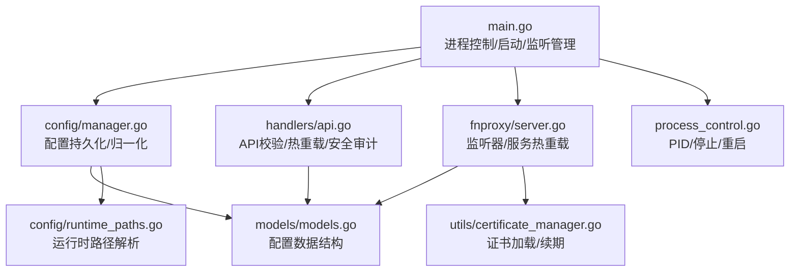
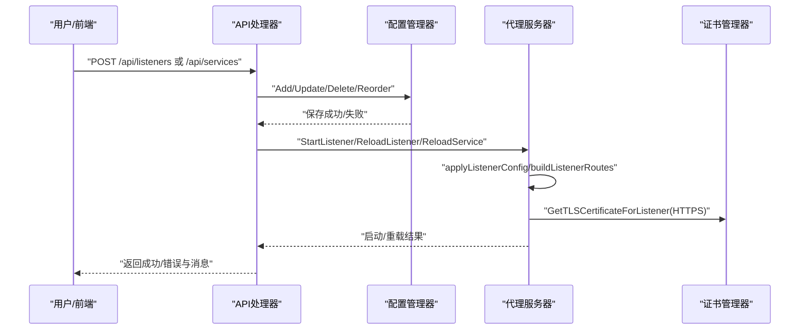
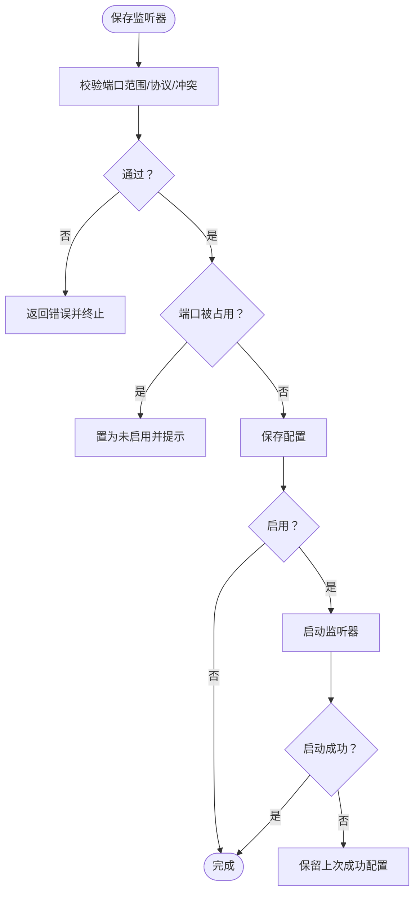
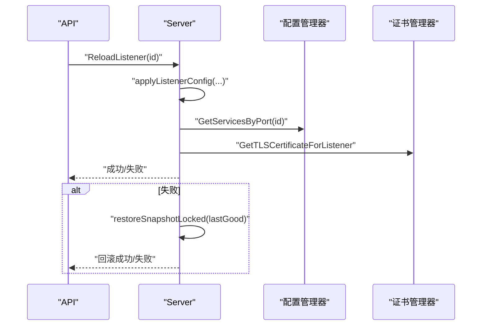
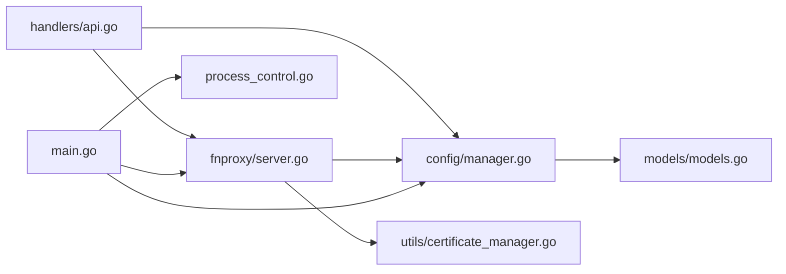

# 配置问题

<cite>
**本文引用的文件**
- [src/main.go](file://src/main.go)
- [src/config/manager.go](file://src/config/manager.go)
- [src/config/runtime_paths.go](file://src/config/runtime_paths.go)
- [src/models/models.go](file://src/models/models.go)
- [src/handlers/api.go](file://src/handlers/api.go)
- [src/fnproxy/server.go](file://src/fnproxy/server.go)
- [src/process_control.go](file://src/process_control.go)
- [src/utils/certificate_manager.go](file://src/utils/certificate_manager.go)
- [README.md](file://README.md)
- [documents/ui-listener-fixes-20260311.md](file://documents/ui-listener-fixes-20260311.md)
</cite>

## 目录
1. [简介](#简介)
2. [项目结构](#项目结构)
3. [核心组件](#核心组件)
4. [架构总览](#架构总览)
5. [详细组件分析](#详细组件分析)
6. [依赖分析](#依赖分析)
7. [性能考虑](#性能考虑)
8. [故障排除指南](#故障排除指南)
9. [结论](#结论)
10. [附录](#附录)

## 简介
本指南面向 Caddy Panel 的运维与开发人员，系统梳理配置文件格式、字段缺失、数值范围、监听器与服务规则、用户权限、证书与热重载等常见问题，提供验证方法、错误解读技巧、失败排查步骤与最佳实践（备份、恢复、迁移）。文档结合代码实现，给出可操作的定位与修复建议。

## 项目结构
- 配置与运行时路径：集中于 config 包，负责配置文件、PID/Socket、缓存、证书等路径解析与管理。
- 应用模型：models 定义全局配置、监听器、服务、证书、用户、防火墙等数据结构。
- API 层：handlers 提供 REST 接口，负责配置校验、持久化、热重载触发与安全审计。
- 代理与热重载：fnproxy/server 实现监听器与服务的动态加载、热更新与回滚。
- 进程控制：main 与 process_control 负责启动、停止、重启、单实例保护与 PID 文件管理。
- 证书管理：utils/certificate_manager 负责 ACME、文件同步、自动续期与运行时加载。

**图示来源**
- [src/main.go:24-110](file://src/main.go#L24-L110)
- [src/config/manager.go:35-107](file://src/config/manager.go#L35-L107)
- [src/handlers/api.go:156-218](file://src/handlers/api.go#L156-L218)
- [src/fnproxy/server.go:228-425](file://src/fnproxy/server.go#L228-L425)
- [src/process_control.go:17-139](file://src/process_control.go#L17-L139)
- [src/config/runtime_paths.go:31-160](file://src/config/runtime_paths.go#L31-L160)
- [src/utils/certificate_manager.go:140-166](file://src/utils/certificate_manager.go#L140-L166)

**章节来源**
- [src/main.go:24-110](file://src/main.go#L24-L110)
- [src/config/manager.go:35-107](file://src/config/manager.go#L35-L107)
- [src/config/runtime_paths.go:31-160](file://src/config/runtime_paths.go#L31-L160)
- [src/models/models.go:384-394](file://src/models/models.go#L384-L394)
- [src/handlers/api.go:156-218](file://src/handlers/api.go#L156-L218)
- [src/fnproxy/server.go:228-425](file://src/fnproxy/server.go#L228-L425)
- [src/process_control.go:17-139](file://src/process_control.go#L17-L139)
- [src/utils/certificate_manager.go:140-166](file://src/utils/certificate_manager.go#L140-L166)

## 核心组件
- 配置管理器：负责配置加载、保存、归一化（默认值填充）、监听器/服务/证书/用户/防火墙的增删改查与持久化。
- 运行时路径：统一解析配置文件、PID、Socket、缓存、证书等路径，支持 -config_path 指定根目录。
- API 校验与热重载：监听器/服务创建/更新/删除/切换/重载均有校验与热更新逻辑，失败时保留上次成功配置。
- 代理服务器：按监听器与服务规则构建路由，支持热重载与回滚。
- 进程控制：status/stop/restart，PID 文件单实例保护，优雅关闭。
- 证书管理：ACME、文件同步、自动续期、运行时加载与回退证书。

**章节来源**
- [src/config/manager.go:35-107](file://src/config/manager.go#L35-L107)
- [src/config/runtime_paths.go:31-160](file://src/config/runtime_paths.go#L31-L160)
- [src/handlers/api.go:64-93](file://src/handlers/api.go#L64-L93)
- [src/fnproxy/server.go:228-425](file://src/fnproxy/server.go#L228-L425)
- [src/process_control.go:17-139](file://src/process_control.go#L17-L139)
- [src/utils/certificate_manager.go:140-166](file://src/utils/certificate_manager.go#L140-L166)

## 架构总览
下图展示配置从持久化到运行时生效的关键流程，以及热重载与回滚机制。

**图示来源**
- [src/handlers/api.go:156-218](file://src/handlers/api.go#L156-L218)
- [src/handlers/api.go:359-375](file://src/handlers/api.go#L359-L375)
- [src/config/manager.go:262-304](file://src/config/manager.go#L262-L304)
- [src/fnproxy/server.go:228-425](file://src/fnproxy/server.go#L228-L425)
- [src/utils/certificate_manager.go:140-166](file://src/utils/certificate_manager.go#L140-L166)

## 详细组件分析

### 配置文件格式与字段校验
- 配置文件为 JSON，位于运行时根目录下的 fnproxy.json。首次启动若不存在会自动生成默认配置。
- 归一化逻辑：对全局配置与证书配置进行默认值填充，确保数值字段在合理范围内。
- 字段缺失与默认值：
  - 全局：AdminPort 默认 8080；LogLevel 默认 "info"；LogFile 默认 "fnproxy.log"；日志保留天数、最大日志条数、证书路径与同步间隔等均有默认值。
  - 证书：状态默认 pending；自动续期且续期提前天数<=0时默认 30 天；来源默认 imported。
- 监听器字段校验：
  - 端口范围 1-65535；协议仅支持 http/https；不能与管理后台端口冲突；同端口不可重复；占用时自动置为未启用并提示。
- 服务字段校验：
  - 服务类型枚举；域名支持 "*"；排序与默认规则处理；启用状态变化时触发热重载。
- 用户字段校验：
  - Token 唯一性；角色默认 user；密码加密存储；删除/禁用时保留至少一个启用用户。

**章节来源**
- [src/config/manager.go:74-137](file://src/config/manager.go#L74-L137)
- [src/config/manager.go:212-225](file://src/config/manager.go#L212-L225)
- [src/handlers/api.go:64-93](file://src/handlers/api.go#L64-L93)
- [src/handlers/api.go:531-730](file://src/handlers/api.go#L531-L730)
- [src/models/models.go:384-394](file://src/models/models.go#L384-L394)

### 监听器配置错误
- 端口冲突：同端口重复添加会被拒绝。
- 管理端口占用：监听器端口不得与管理后台端口相同。
- 端口占用：若被其他程序占用，保存为未启用状态并提示。
- 协议错误：仅支持 http/https。
- 启停与热重载：
  - 启动失败：保留上次成功配置；停止失败：尝试回滚。
  - 重载失败：回滚到上次成功配置；前端提示具体错误。

**图示来源**
- [src/handlers/api.go:64-93](file://src/handlers/api.go#L64-L93)
- [src/handlers/api.go:156-218](file://src/handlers/api.go#L156-L218)
- [src/handlers/api.go:220-276](file://src/handlers/api.go#L220-L276)
- [src/fnproxy/server.go:370-425](file://src/fnproxy/server.go#L370-L425)

**章节来源**
- [src/handlers/api.go:64-93](file://src/handlers/api.go#L64-L93)
- [src/handlers/api.go:156-218](file://src/handlers/api.go#L156-L218)
- [src/handlers/api.go:220-276](file://src/handlers/api.go#L220-L276)
- [src/fnproxy/server.go:370-425](file://src/fnproxy/server.go#L370-L425)

### 服务规则配置问题
- 服务类型与配置对象需匹配（反向代理、静态、重定向、URL跳转、文本输出）。
- 域名匹配：支持 "*" 通配；默认规则始终在末尾且不参与拖拽。
- 排序与重载：拖拽排序持久化；更新/删除/新增后按顺序重载。
- 启停与热重载：监听器禁用时不自动启动；重载失败保留上次成功配置。

**章节来源**
- [src/config/manager.go:158-210](file://src/config/manager.go#L158-L210)
- [src/handlers/api.go:377-494](file://src/handlers/api.go#L377-L494)
- [src/fnproxy/server.go:270-291](file://src/fnproxy/server.go#L270-L291)

### 用户权限配置异常
- Token 唯一性：同一 Token 不能分配给多个用户。
- 至少保留一个启用用户：禁用/删除时校验。
- 密码加密：存储前经安全参数派生的摘要。
- Header Token 鉴权：支持 Authorization: Bearer 或 Auth 请求头。

**章节来源**
- [src/handlers/api.go:39-50](file://src/handlers/api.go#L39-L50)
- [src/handlers/api.go:541-579](file://src/handlers/api.go#L541-L579)
- [src/handlers/api.go:581-642](file://src/handlers/api.go#L581-L642)
- [src/handlers/api.go:644-730](file://src/handlers/api.go#L644-L730)

### 证书与 HTTPS 配置
- 证书来源：ACME、导入、文件同步。
- 自动续期：按配置自动续期，支持提前天数。
- 运行时加载：HTTPS 监听按域名匹配证书，未命中使用内置回退证书。
- 同步与维护：定期同步外部证书配置，失败记录错误。

**章节来源**
- [src/utils/certificate_manager.go:140-166](file://src/utils/certificate_manager.go#L140-L166)
- [src/utils/certificate_manager.go:184-190](file://src/utils/certificate_manager.go#L184-L190)
- [src/utils/certificate_manager.go:192-200](file://src/utils/certificate_manager.go#L192-L200)
- [src/models/models.go:221-254](file://src/models/models.go#L221-L254)

### 配置热重载失败的原因与解决
- 常见原因：
  - 服务规则配置错误（类型/字段不匹配）。
  - 监听器启动失败（端口占用/协议错误/证书加载失败）。
  - 证书同步/续期失败导致运行时异常。
- 解决方案：
  - 重载失败自动回滚到上次成功配置。
  - 通过 /api/listeners/{id}/reload 或 /api/services/{id}/toggle 等接口触发重载。
  - 前端会提示具体错误信息，便于定位。

**图示来源**
- [src/handlers/api.go:359-375](file://src/handlers/api.go#L359-L375)
- [src/fnproxy/server.go:370-425](file://src/fnproxy/server.go#L370-L425)

**章节来源**
- [src/handlers/api.go:359-375](file://src/handlers/api.go#L359-L375)
- [src/fnproxy/server.go:370-425](file://src/fnproxy/server.go#L370-L425)

## 依赖分析
- 配置管理器依赖模型定义与安全模块，负责配置持久化与归一化。
- API 层依赖配置管理器与代理服务器，负责校验、持久化与热重载。
- 代理服务器依赖配置管理器与证书管理器，负责监听器与服务的动态加载。
- 进程控制依赖运行时路径与信号处理，负责单实例与优雅关闭。

**图示来源**
- [src/config/manager.go:35-107](file://src/config/manager.go#L35-L107)
- [src/models/models.go:384-394](file://src/models/models.go#L384-L394)
- [src/handlers/api.go:156-218](file://src/handlers/api.go#L156-L218)
- [src/fnproxy/server.go:228-425](file://src/fnproxy/server.go#L228-L425)
- [src/utils/certificate_manager.go:140-166](file://src/utils/certificate_manager.go#L140-L166)
- [src/main.go:24-110](file://src/main.go#L24-L110)
- [src/process_control.go:17-139](file://src/process_control.go#L17-L139)

**章节来源**
- [src/config/manager.go:35-107](file://src/config/manager.go#L35-L107)
- [src/models/models.go:384-394](file://src/models/models.go#L384-L394)
- [src/handlers/api.go:156-218](file://src/handlers/api.go#L156-L218)
- [src/fnproxy/server.go:228-425](file://src/fnproxy/server.go#L228-L425)
- [src/utils/certificate_manager.go:140-166](file://src/utils/certificate_manager.go#L140-L166)
- [src/main.go:24-110](file://src/main.go#L24-L110)
- [src/process_control.go:17-139](file://src/process_control.go#L17-L139)

## 性能考虑
- 热重载采用增量更新与回滚策略，避免重启带来的中断。
- 监控与日志采用缓存文件与内存窗口结合的方式，降低长期运行内存占用。
- 证书同步周期可配置，避免频繁 IO。

[本节为通用指导，无需特定文件来源]

## 故障排除指南

### 1. 配置文件格式错误
- 症状：启动时报 JSON 解析错误或字段缺失导致默认值填充异常。
- 排查步骤：
  - 检查运行时根目录下的 fnproxy.json 是否为合法 JSON。
  - 使用 JSON Schema 校验关键字段：global、listeners、services、certs、users、ssh、firewall。
  - 若文件缺失，程序会自动生成默认配置；若解析失败，需修正后重启。
- 相关实现：
  - 配置加载与保存：[src/config/manager.go:74-107](file://src/config/manager.go#L74-L107)
  - 默认值归一化：[src/config/manager.go:109-137](file://src/config/manager.go#L109-L137)

**章节来源**
- [src/config/manager.go:74-107](file://src/config/manager.go#L74-L107)
- [src/config/manager.go:109-137](file://src/config/manager.go#L109-L137)

### 2. 字段缺失与数值范围错误
- 症状：监听器端口超出范围、协议非法、管理端口冲突、服务排序异常。
- 排查步骤：
  - 监听器：端口 1-65535，协议 http/https；与管理端口不冲突；同端口不可重复。
  - 服务：类型枚举有效；域名支持 "*"；排序为正整数或按默认规则处理。
  - 全局：日志保留天数、最大日志条数、证书同步间隔等需为正数。
- 相关实现：
  - 监听器校验：[src/handlers/api.go:64-93](file://src/handlers/api.go#L64-L93)
  - 服务排序归一化：[src/config/manager.go:158-210](file://src/config/manager.go#L158-L210)
  - 全局默认值：[src/config/manager.go:109-137](file://src/config/manager.go#L109-L137)

**章节来源**
- [src/handlers/api.go:64-93](file://src/handlers/api.go#L64-L93)
- [src/config/manager.go:158-210](file://src/config/manager.go#L158-L210)
- [src/config/manager.go:109-137](file://src/config/manager.go#L109-L137)

### 3. 监听器配置错误
- 症状：端口被占用、管理端口冲突、协议错误、重复端口。
- 排查步骤：
  - 使用 status/stop/restart 控制进程，确认 PID 文件状态。
  - 查看控制台输出的端口占用与启动失败原因。
  - 若端口被占用，保存为未启用并提示；必要时更换端口。
- 相关实现：
  - 端口占用检测：[src/handlers/api.go:87-92](file://src/handlers/api.go#L87-L92)
  - 管理端口冲突：[src/handlers/api.go:71-74](file://src/handlers/api.go#L71-L74)
  - 启停与重载：[src/handlers/api.go:304-375](file://src/handlers/api.go#L304-L375)

**章节来源**
- [src/handlers/api.go:64-93](file://src/handlers/api.go#L64-L93)
- [src/handlers/api.go:304-375](file://src/handlers/api.go#L304-L375)

### 4. 服务规则配置问题
- 症状：服务类型与配置对象不匹配、域名通配符使用不当、排序混乱。
- 排查步骤：
  - 确认服务类型与配置对象一致（反向代理、静态、重定向、URL跳转、文本输出）。
  - 检查域名规则与排序；默认规则始终在末尾。
  - 通过 /api/services/reorder 或 /api/services/{id}/toggle 触发重载。
- 相关实现：
  - 服务排序与默认规则：[src/config/manager.go:158-210](file://src/config/manager.go#L158-L210)
  - 服务热重载：[src/handlers/api.go:377-494](file://src/handlers/api.go#L377-L494)

**章节来源**
- [src/config/manager.go:158-210](file://src/config/manager.go#L158-L210)
- [src/handlers/api.go:377-494](file://src/handlers/api.go#L377-L494)

### 5. 用户权限配置异常
- 症状：Token 冲突、删除/禁用后无启用用户、密码无法登录。
- 排查步骤：
  - 确认 Token 唯一性；修改后重新生成。
  - 确保至少保留一个启用用户。
  - 检查 Header Token 鉴权格式（Auth 或 Authorization: Bearer）。
- 相关实现：
  - Token 唯一性校验：[src/handlers/api.go:39-50](file://src/handlers/api.go#L39-L50)
  - 用户删除/禁用校验：[src/handlers/api.go:644-730](file://src/handlers/api.go#L644-L730)

**章节来源**
- [src/handlers/api.go:39-50](file://src/handlers/api.go#L39-L50)
- [src/handlers/api.go:644-730](file://src/handlers/api.go#L644-L730)

### 6. 证书与 HTTPS 配置问题
- 症状：HTTPS 监听失败、证书未匹配、续期失败。
- 排查步骤：
  - 检查证书来源与路径；ACME 需 DNS/HTTP 验证配置正确。
  - 查看证书状态与最后错误；必要时手动续期。
  - 未匹配到业务证书时使用内置回退证书。
- 相关实现：
  - 证书维护与同步：[src/utils/certificate_manager.go:162-166](file://src/utils/certificate_manager.go#L162-L166)
  - 证书来源默认值：[src/config/manager.go:212-225](file://src/config/manager.go#L212-L225)

**章节来源**
- [src/utils/certificate_manager.go:162-166](file://src/utils/certificate_manager.go#L162-L166)
- [src/config/manager.go:212-225](file://src/config/manager.go#L212-L225)

### 7. 配置热重载失败
- 症状：更新后服务未生效或出现 404/500。
- 排查步骤：
  - 通过 /api/listeners/{id}/reload 或 /api/services/{id}/toggle 重载。
  - 查看控制台输出与前端错误提示，定位具体服务规则错误。
  - 若失败，系统自动回滚到上次成功配置。
- 相关实现：
  - 重载与回滚：[src/fnproxy/server.go:370-425](file://src/fnproxy/server.go#L370-L425)
  - 重载接口：[src/handlers/api.go:359-375](file://src/handlers/api.go#L359-L375)

**章节来源**
- [src/fnproxy/server.go:370-425](file://src/fnproxy/server.go#L370-L425)
- [src/handlers/api.go:359-375](file://src/handlers/api.go#L359-L375)

### 8. 配置验证方法与错误解读
- 验证方法：
  - 使用 /api/config 获取当前有效配置与运行时路径。
  - 通过 /api/status 与 /api/metrics/* 获取运行状态与统计数据。
  - 通过 /api/logs/* 查看访问与安全日志。
- 错误解读：
  - 监听器端口占用：提示端口被占用并置为未启用。
  - 服务规则错误：返回具体服务名称与错误描述。
  - 证书错误：查看 last_error 与状态字段。

**章节来源**
- [src/handlers/api.go:732-775](file://src/handlers/api.go#L732-L775)
- [src/handlers/api.go:129-137](file://src/handlers/api.go#L129-L137)

### 9. 配置备份、恢复与迁移
- 备份：
  - 运行时根目录包含：fnproxy.json、cache/monitor-cache.db、security-logs.db、certs/managed、certs/accounts、PID 文件、Unix Socket 文件。
  - 建议定期复制整个运行时根目录。
- 恢复：
  - 停止服务后，将备份的 fnproxy.json 与证书目录拷贝回原位，启动后自动加载。
- 迁移：
  - 在新环境设置 -config_path 指向目标目录，复制运行时根目录内容，启动后验证端口与服务状态。

**章节来源**
- [README.md:156-166](file://README.md#L156-L166)
- [src/config/runtime_paths.go:85-115](file://src/config/runtime_paths.go#L85-L115)

### 10. 配置模板与示例
- 全局配置字段：AdminPort、DefaultAuth、LogLevel、LogFile、LogRetentionDays、MaxAccessLogEntries、MaxSecurityLogEntries、CertificateConfigPath、CertificateSyncIntervalSeconds。
- 监听器字段：ID、Port、Protocol、Enabled、CreatedAt、UpdatedAt。
- 服务字段：ID、PortID、Name、Type、Domain、SortOrder、CertificateID、Enabled、Config、RequireAuth、CreatedAt、UpdatedAt。
- 证书字段：ID、Name、Domains、Source、ChallengeType、DNSProvider、DNSConfig、AccountEmail、AutoRenew、RenewBeforeDays、CertPath、KeyPath、SourceConfigPath、AccountKeyPath、RegistrationURI、CertURL、CertStableURL、Issuer、Status、LastError、LastIssuedAt、LastRenewedAt、LastSyncedAt、CertFileUpdatedAt、KeyFileUpdatedAt、ExpiresAt、NextRenewAt、CreatedAt、UpdatedAt。
- 用户字段：ID、Username、Password、Token、Email、Enabled、Role、CreatedAt、UpdatedAt。
- 防火墙字段：Enabled、DefaultDeny、Rules（ID、Name、Type、IPs、Countries、Action、Enabled、Priority、Description、CreatedAt、UpdatedAt）。

**章节来源**
- [src/models/models.go:299-394](file://src/models/models.go#L299-L394)

## 结论
- 配置问题多源于字段缺失、数值范围错误、监听器端口冲突与服务规则不匹配。
- 系统提供完善的默认值填充、校验与热重载回滚机制，便于快速定位与恢复。
- 建议在生产环境显式设置 -secure 与 -config_path，定期备份运行时根目录，严格遵循字段约束与范围。

[本节为总结，无需特定文件来源]

## 附录

### A. 常用命令与参数
- -secure：安全参数，用于密码摘要与 OAuth 解密。
- -config_path：运行时根目录，统一存放配置、缓存、证书、PID、Socket。
- -port：TCP 端口或 sock（Unix Socket）。
- status/stop/restart：进程状态查询、停止与重启。

**章节来源**
- [README.md:105-129](file://README.md#L105-L129)
- [src/process_control.go:17-28](file://src/process_control.go#L17-L28)

### B. 运行时文件清单
- 主配置文件、监控缓存、安全日志缓存、证书目录、PID 文件、Unix Socket 文件。

**章节来源**
- [README.md:156-166](file://README.md#L156-L166)
- [src/config/runtime_paths.go:85-115](file://src/config/runtime_paths.go#L85-L115)