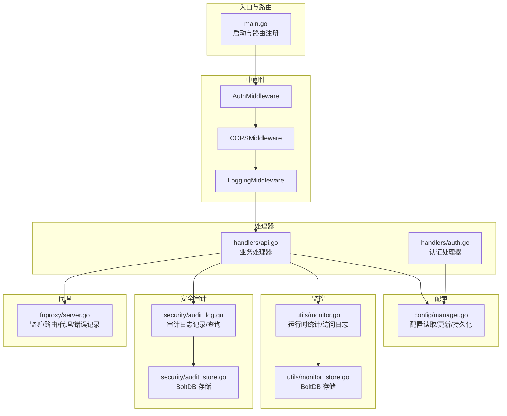
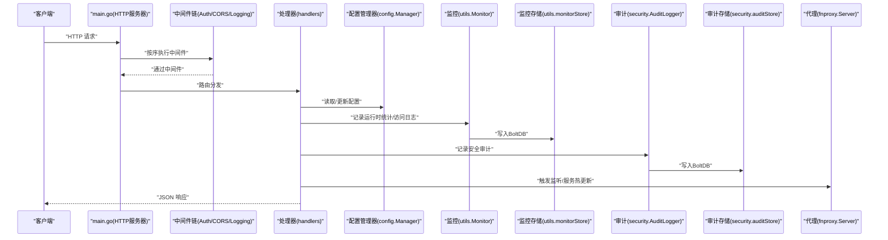
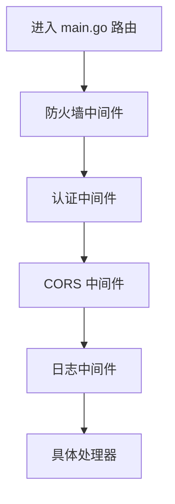
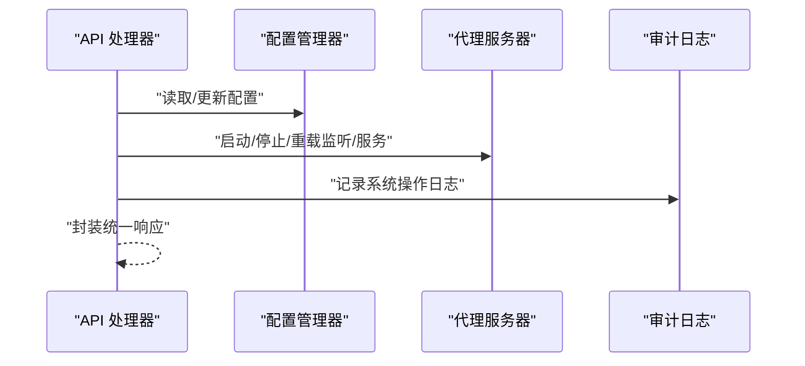
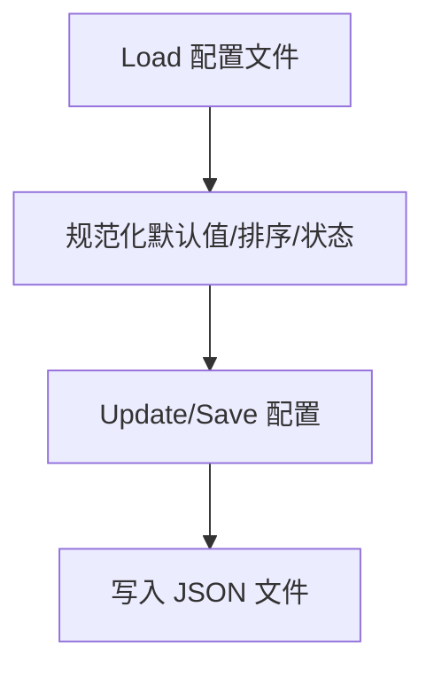
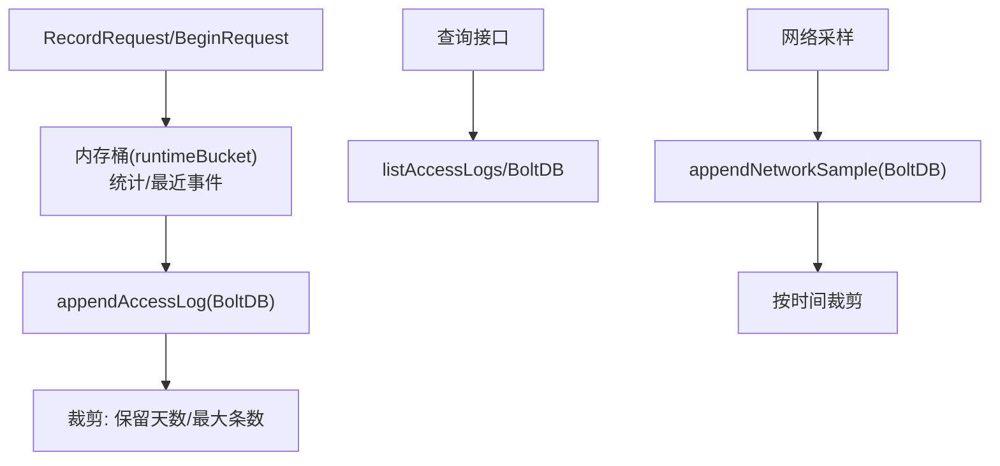
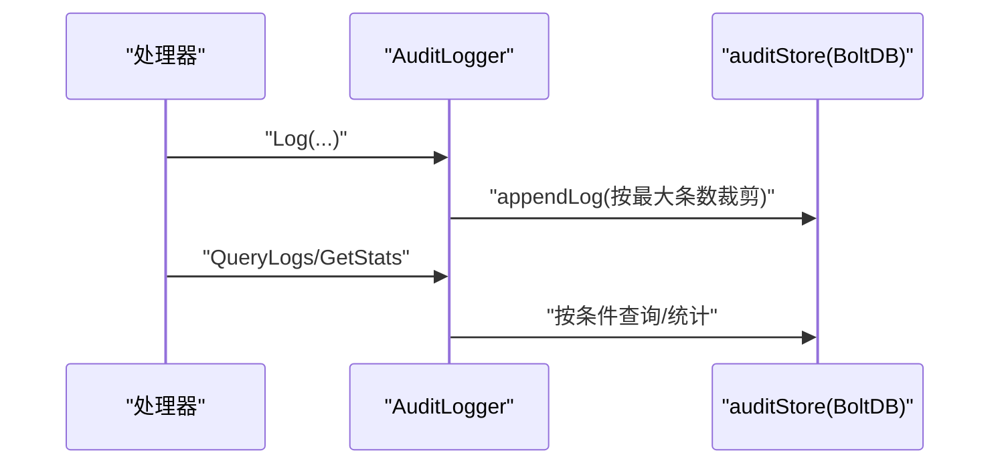
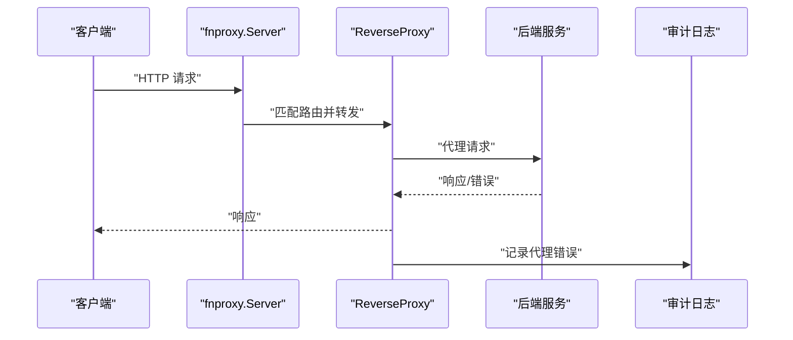
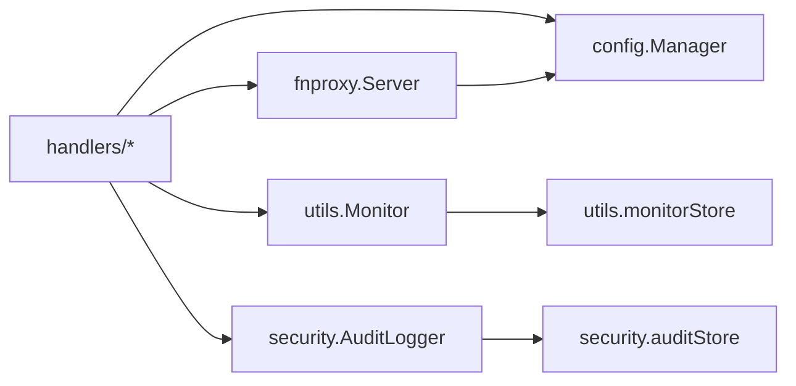

# 数据流设计

<cite>
**本文引用的文件**
- [src/main.go](file://src/main.go)
- [src/handlers/api.go](file://src/handlers/api.go)
- [src/handlers/auth.go](file://src/handlers/auth.go)
- [src/middleware/auth.go](file://src/middleware/auth.go)
- [src/config/manager.go](file://src/config/manager.go)
- [src/utils/monitor.go](file://src/utils/monitor.go)
- [src/utils/monitor_store.go](file://src/utils/monitor_store.go)
- [src/utils/system.go](file://src/utils/system.go)
- [src/security/audit_log.go](file://src/security/audit_log.go)
- [src/security/audit_store.go](file://src/security/audit_store.go)
- [src/fnproxy/server.go](file://src/fnproxy/server.go)
- [src/models/models.go](file://src/models/models.go)
</cite>

## 目录
1. [简介](#简介)
2. [项目结构](#项目结构)
3. [核心组件](#核心组件)
4. [架构总览](#架构总览)
5. [详细组件分析](#详细组件分析)
6. [依赖分析](#依赖分析)
7. [性能考量](#性能考量)
8. [故障排查指南](#故障排查指南)
9. [结论](#结论)

## 简介
本文件面向 Caddy Panel 的数据流设计，系统围绕“HTTP 请求—中间件—处理器—配置/监控/安全日志—持久化”的主干路径展开，覆盖请求处理链路、配置读取/验证/更新/持久化、监控数据采集/缓存/存储/查询、安全审计数据记录/存储/检索等关键流程，并提供数据流图与时序图帮助理解。

## 项目结构
- 入口与路由：main.go 负责初始化、注册路由、挂载中间件、启动 HTTP 服务器与代理服务器。
- 处理器层：handlers 包含 API 与认证处理器，负责业务逻辑与响应封装。
- 中间件层：middleware 提供认证、CORS、日志等横切能力。
- 配置层：config.Manager 提供应用配置的读取、规范化、增删改查与持久化。
- 监控层：utils.Monitor 负责运行时统计、访问日志与网络采样，配合 utils.monitorStore 以 BoltDB 存储。
- 安全审计层：security.AuditLogger 负责安全日志记录与查询，配合 security.auditStore 以 BoltDB 存储。
- 代理层：fnproxy.Server 负责监听器/服务的动态热加载、反向代理、WebSocket 代理、错误记录等。

图表来源
- [src/main.go:112-430](file://src/main.go#L112-L430)
- [src/middleware/auth.go:14-119](file://src/middleware/auth.go#L14-L119)
- [src/handlers/api.go:129-785](file://src/handlers/api.go#L129-L785)
- [src/handlers/auth.go:37-266](file://src/handlers/auth.go#L37-L266)
- [src/config/manager.go:35-791](file://src/config/manager.go#L35-L791)
- [src/utils/monitor.go:38-386](file://src/utils/monitor.go#L38-L386)
- [src/utils/monitor_store.go:26-208](file://src/utils/monitor_store.go#L26-L208)
- [src/security/audit_log.go:15-224](file://src/security/audit_log.go#L15-L224)
- [src/security/audit_store.go:22-222](file://src/security/audit_store.go#L22-L222)
- [src/fnproxy/server.go:37-800](file://src/fnproxy/server.go#L37-L800)

章节来源
- [src/main.go:112-430](file://src/main.go#L112-L430)

## 核心组件
- HTTP 服务器与路由：在 main.go 中注册 API 与静态资源路由，挂载中间件链，支持 TCP/Unix Socket 监听。
- 中间件链：认证、CORS、日志，按顺序包裹处理器。
- 处理器：API 与认证处理器，负责请求解析、业务处理、响应封装与安全日志记录。
- 配置管理器：提供全局配置、监听器、服务、证书、用户、SSH、防火墙等的读取/更新/持久化。
- 监控系统：运行时统计、访问日志、网络采样，采用 BoltDB 存储并提供查询接口。
- 安全审计：OAuth 登录、代理错误、SSH 连接、系统操作等日志记录与查询。
- 代理服务器：动态监听器/服务热加载、反向代理、WebSocket 代理、错误记录。

章节来源
- [src/main.go:112-430](file://src/main.go#L112-L430)
- [src/handlers/api.go:129-785](file://src/handlers/api.go#L129-L785)
- [src/config/manager.go:35-791](file://src/config/manager.go#L35-L791)
- [src/utils/monitor.go:38-386](file://src/utils/monitor.go#L38-L386)
- [src/security/audit_log.go:15-224](file://src/security/audit_log.go#L15-L224)
- [src/fnproxy/server.go:37-800](file://src/fnproxy/server.go#L37-L800)

## 架构总览
系统采用“入口路由—中间件—处理器—配置/监控/安全—持久化”的分层设计，请求在进入处理器前经过认证与日志中间件，处理器调用配置管理器进行数据读取/更新，同时产生监控与安全审计数据，二者分别写入 BoltDB 并由各自的查询接口提供服务。

图表来源
- [src/main.go:112-430](file://src/main.go#L112-L430)
- [src/middleware/auth.go:14-119](file://src/middleware/auth.go#L14-L119)
- [src/handlers/api.go:129-785](file://src/handlers/api.go#L129-L785)
- [src/config/manager.go:74-107](file://src/config/manager.go#L74-L107)
- [src/utils/monitor.go:132-189](file://src/utils/monitor.go#L132-L189)
- [src/utils/monitor_store.go:56-125](file://src/utils/monitor_store.go#L56-L125)
- [src/security/audit_log.go:62-80](file://src/security/audit_log.go#L62-L80)
- [src/security/audit_store.go:47-67](file://src/security/audit_store.go#L47-L67)
- [src/fnproxy/server.go:183-233](file://src/fnproxy/server.go#L183-L233)

## 详细组件分析

### 请求处理链路与中间件执行顺序
- 中间件顺序：防火墙中间件 → 认证中间件 → CORS 中间件 → 日志中间件。
- 认证中间件优先支持 Authorization Bearer 与用户 Token（Auth 头），否则返回 401。
- CORS 中间件设置跨域头并处理预检。
- 日志中间件记录请求方法、路径与耗时。

图表来源
- [src/main.go:421-427](file://src/main.go#L421-L427)
- [src/middleware/auth.go:14-119](file://src/middleware/auth.go#L14-L119)

章节来源
- [src/main.go:421-427](file://src/main.go#L421-L427)
- [src/middleware/auth.go:14-119](file://src/middleware/auth.go#L14-L119)

### 处理器调用关系与数据转换
- API 处理器负责解析 JSON 请求体、调用配置管理器进行增删改查、触发代理服务器热更新、记录安全审计日志，并封装统一响应结构。
- 认证处理器负责用户登录、生成 JWT、设置 Cookie、OAuth 登录页渲染与解密。
- 处理器内部对输入进行校验（如端口范围、协议、唯一性）、对敏感字段进行解密（如密码前缀 enc::）。

图表来源
- [src/handlers/api.go:129-785](file://src/handlers/api.go#L129-L785)
- [src/config/manager.go:227-451](file://src/config/manager.go#L227-L451)
- [src/fnproxy/server.go:228-253](file://src/fnproxy/server.go#L228-L253)
- [src/security/audit_log.go:149-166](file://src/security/audit_log.go#L149-L166)

章节来源
- [src/handlers/api.go:129-785](file://src/handlers/api.go#L129-L785)
- [src/handlers/auth.go:37-266](file://src/handlers/auth.go#L37-L266)

### 配置数据的读取、验证、更新与持久化
- 读取：首次启动时加载配置文件，若不存在则创建默认配置并保存。
- 验证：监听器端口范围校验、协议校验、管理员端口占用校验、唯一性校验（如用户 Token）。
- 更新：支持全局配置、监听器、服务、证书、用户、SSH、防火墙等的增删改查与持久化。
- 持久化：统一写入 JSON 文件，必要时进行规范化（如默认值、排序、证书状态）。

图表来源
- [src/config/manager.go:74-107](file://src/config/manager.go#L74-L107)
- [src/config/manager.go:109-137](file://src/config/manager.go#L109-L137)
- [src/config/manager.go:234-241](file://src/config/manager.go#L234-L241)

章节来源
- [src/config/manager.go:74-107](file://src/config/manager.go#L74-L107)
- [src/config/manager.go:109-137](file://src/config/manager.go#L109-L137)
- [src/config/manager.go:234-241](file://src/config/manager.go#L234-L241)

### 监控数据的采集、缓存、存储与查询
- 采集：运行时统计（请求数、活动连接、字节总量/速率、最近活跃时间）与访问日志（含用户、路径、状态码、耗时、字节数）。
- 缓存：内存中的运行时桶（runtimeBucket）维护最近事件与统计窗口。
- 存储：BoltDB 分桶存储网络采样与访问日志，按时间键排序，支持裁剪（按保留天数与最大条数）。
- 查询：提供按监听器/服务维度的日志查询与 24 小时网络历史聚合。

图表来源
- [src/utils/monitor.go:119-189](file://src/utils/monitor.go#L119-L189)
- [src/utils/monitor.go:253-321](file://src/utils/monitor.go#L253-L321)
- [src/utils/monitor_store.go:56-125](file://src/utils/monitor_store.go#L56-L125)
- [src/utils/monitor_store.go:127-155](file://src/utils/monitor_store.go#L127-L155)
- [src/utils/monitor_store.go:157-186](file://src/utils/monitor_store.go#L157-L186)

章节来源
- [src/utils/monitor.go:119-189](file://src/utils/monitor.go#L119-L189)
- [src/utils/monitor.go:253-321](file://src/utils/monitor.go#L253-L321)
- [src/utils/monitor_store.go:56-125](file://src/utils/monitor_store.go#L56-L125)
- [src/utils/monitor_store.go:127-155](file://src/utils/monitor_store.go#L127-L155)

### 安全审计数据的记录、存储与检索
- 记录：OAuth 登录、代理错误、SSH 连接/断开、系统操作等，支持成功/失败标记与额外信息。
- 存储：BoltDB 单桶存储，按时间+ID 复合键排序，按最大条数裁剪。
- 检索：支持按类型、级别、关键词过滤与分页查询，提供统计接口。

图表来源
- [src/security/audit_log.go:62-80](file://src/security/audit_log.go#L62-L80)
- [src/security/audit_log.go:168-183](file://src/security/audit_log.go#L168-L183)
- [src/security/audit_store.go:47-67](file://src/security/audit_store.go#L47-L67)
- [src/security/audit_store.go:69-129](file://src/security/audit_store.go#L69-L129)
- [src/security/audit_store.go:131-162](file://src/security/audit_store.go#L131-L162)

章节来源
- [src/security/audit_log.go:62-80](file://src/security/audit_log.go#L62-L80)
- [src/security/audit_log.go:168-183](file://src/security/audit_log.go#L168-L183)
- [src/security/audit_store.go:47-67](file://src/security/audit_store.go#L47-L67)
- [src/security/audit_store.go:69-129](file://src/security/audit_store.go#L69-L129)

### 代理服务器的请求处理与错误传播
- 动态监听器/服务热加载：按监听器 ID 维护路由表与代理实例，支持热更新与回滚。
- 反向代理：统一使用共享 Transport，支持路径前缀处理、隐藏/添加请求/响应头、真实 IP 转发头设置、WebSocket 升级代理。
- 错误传播：代理错误记录到安全审计日志，并返回标准错误响应。

图表来源
- [src/fnproxy/server.go:270-291](file://src/fnproxy/server.go#L270-L291)
- [src/fnproxy/server.go:460-584](file://src/fnproxy/server.go#L460-L584)
- [src/fnproxy/server.go:557-572](file://src/fnproxy/server.go#L557-L572)
- [src/security/audit_log.go:101-113](file://src/security/audit_log.go#L101-L113)

章节来源
- [src/fnproxy/server.go:270-291](file://src/fnproxy/server.go#L270-L291)
- [src/fnproxy/server.go:460-584](file://src/fnproxy/server.go#L460-L584)
- [src/fnproxy/server.go:557-572](file://src/fnproxy/server.go#L557-L572)

## 依赖分析
- 组件耦合：处理器依赖配置管理器、监控系统与安全审计模块；代理服务器依赖配置与证书管理器；监控与审计均依赖 BoltDB 存储。
- 外部依赖：BoltDB（etcd.io/bbolt）、gopsutil（系统指标）、gorilla/websocket（WebSocket）、RSA/OAuth（前端加密与登录）。
- 可能的循环依赖：当前文件组织清晰，未发现循环导入。

图表来源
- [src/handlers/api.go:129-785](file://src/handlers/api.go#L129-L785)
- [src/config/manager.go:35-791](file://src/config/manager.go#L35-L791)
- [src/utils/monitor.go:38-386](file://src/utils/monitor.go#L38-L386)
- [src/security/audit_log.go:15-224](file://src/security/audit_log.go#L15-L224)
- [src/fnproxy/server.go:37-800](file://src/fnproxy/server.go#L37-L800)

章节来源
- [src/handlers/api.go:129-785](file://src/handlers/api.go#L129-L785)
- [src/config/manager.go:35-791](file://src/config/manager.go#L35-L791)
- [src/utils/monitor.go:38-386](file://src/utils/monitor.go#L38-L386)
- [src/security/audit_log.go:15-224](file://src/security/audit_log.go#L15-L224)
- [src/fnproxy/server.go:37-800](file://src/fnproxy/server.go#L37-L800)

## 性能考量
- 连接复用：代理层使用共享 Transport，提升上游连接复用效率。
- 内存统计：监控系统使用内存桶与滑动窗口计算速率，避免高频磁盘 IO。
- 存储裁剪：BoltDB 存储按保留天数与最大条数裁剪，控制空间增长。
- 网络采样：定时采样与聚合，降低实时写入压力。

## 故障排查指南
- 认证失败：检查 Authorization 头格式、用户是否存在与启用状态、用户 Token 是否匹配。
- 监控日志为空：确认日志限制与保留天数配置，检查 BoltDB 文件权限与路径。
- 审计日志缺失：确认审计存储初始化与最大条数限制，检查查询参数（类型/级别/关键词/分页）。
- 代理错误：查看代理错误日志记录与后端可达性，检查路径前缀处理与隐藏头配置。
- 配置更新不生效：确认配置保存成功与代理热更新触发，检查监听器端口占用与协议合法性。

章节来源
- [src/handlers/auth.go:37-110](file://src/handlers/auth.go#L37-L110)
- [src/utils/monitor_store.go:157-186](file://src/utils/monitor_store.go#L157-L186)
- [src/security/audit_store.go:69-129](file://src/security/audit_store.go#L69-L129)
- [src/fnproxy/server.go:557-572](file://src/fnproxy/server.go#L557-L572)
- [src/config/manager.go:262-284](file://src/config/manager.go#L262-L284)

## 结论
Caddy Panel 的数据流设计以清晰的分层与中间件链为核心，结合配置、监控与安全审计三类持久化模块，实现了从请求进入、业务处理、数据持久化到查询检索的完整闭环。通过热更新与裁剪策略保证了运行时的稳定性与性能，同时为运维与审计提供了可靠的数据支撑。