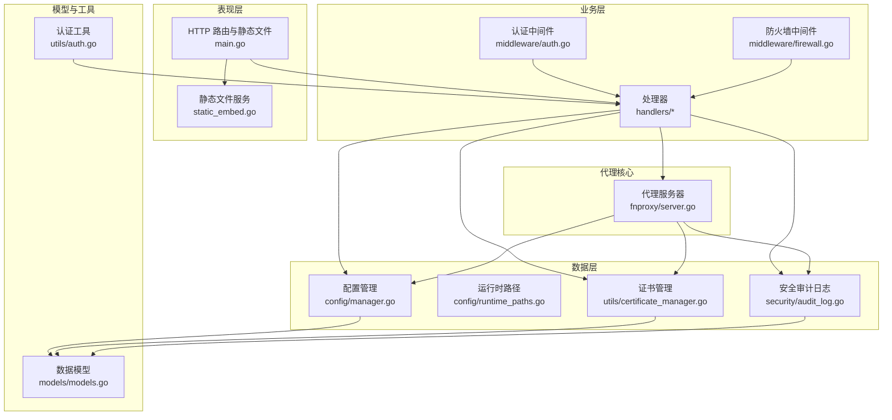
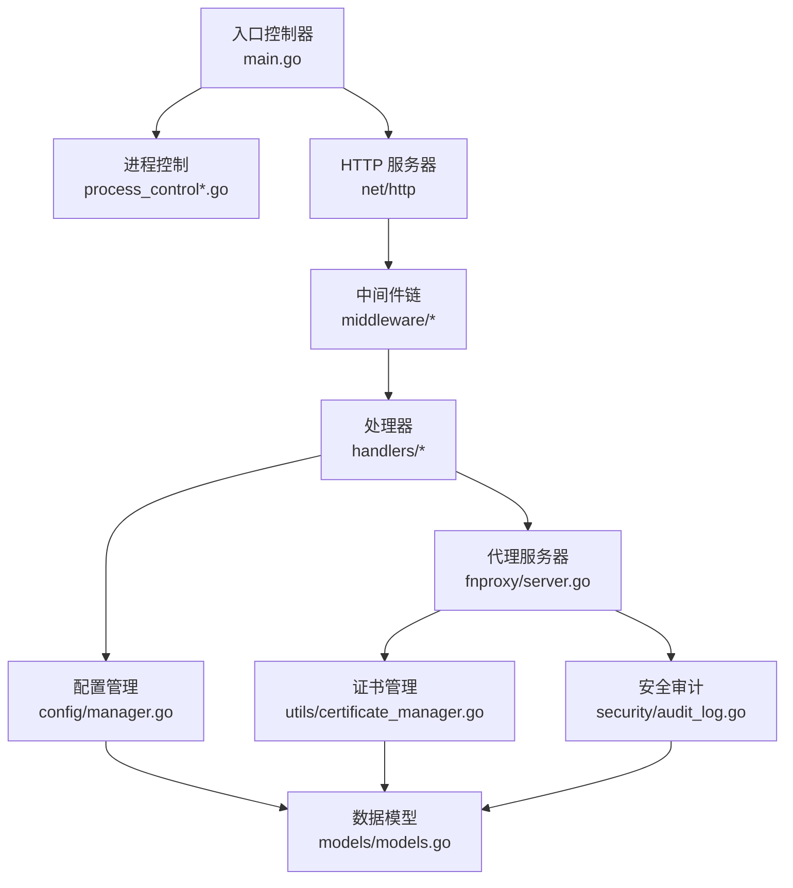
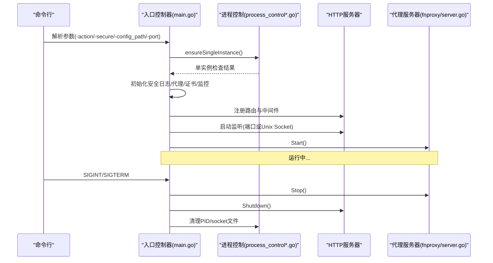
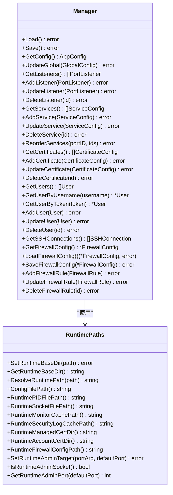
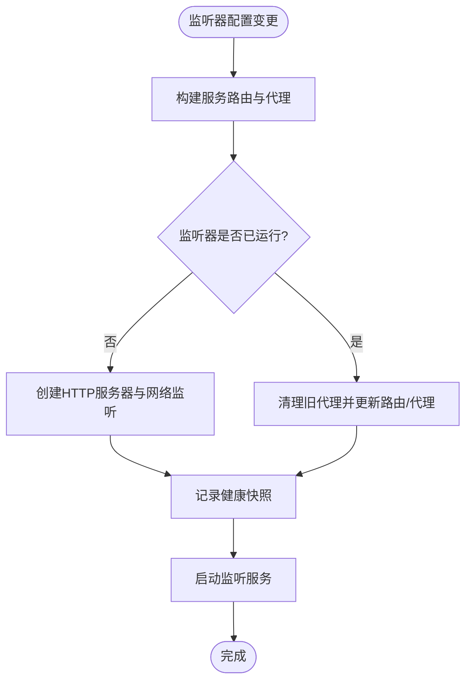
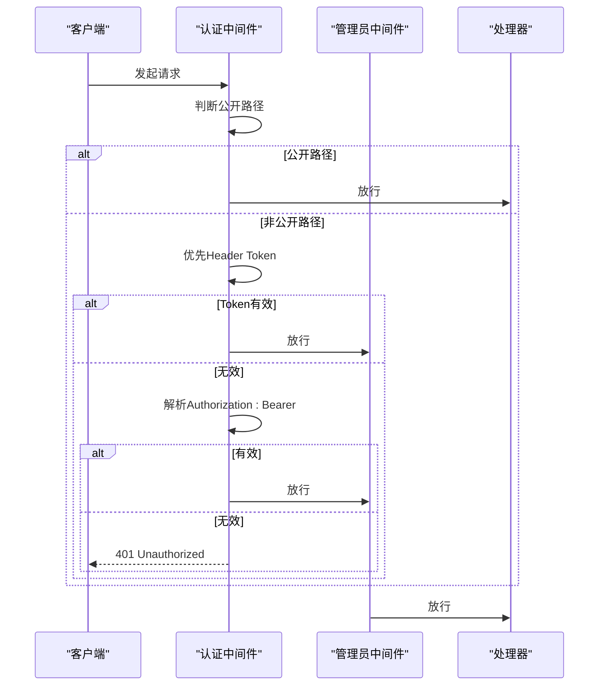
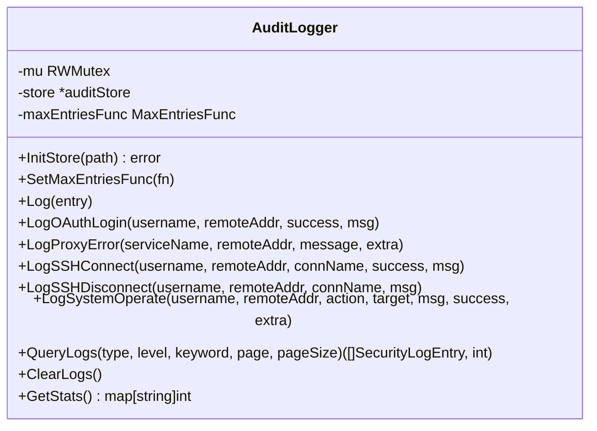
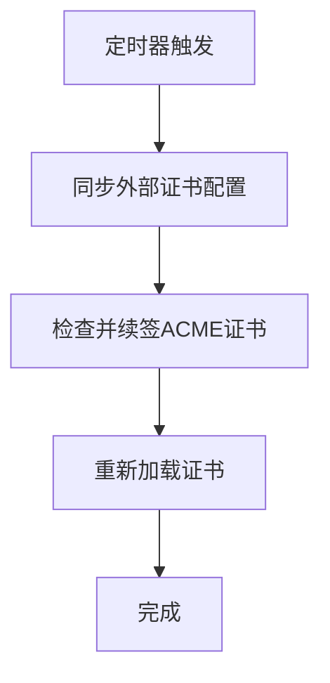
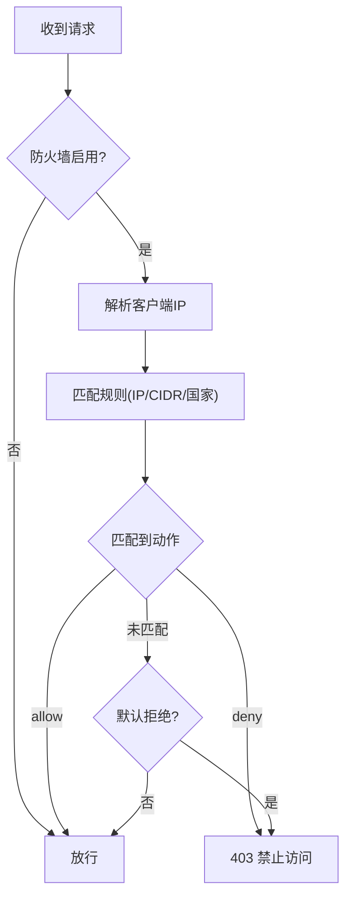
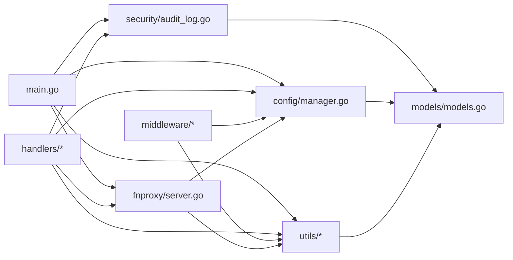

# 整体架构

<cite>
**本文引用的文件**
- [src/main.go](file://src/main.go)
- [src/go.mod](file://src/go.mod)
- [README.md](file://README.md)
- [src/process_control.go](file://src/process_control.go)
- [src/process_control_unix.go](file://src/process_control_unix.go)
- [src/process_control_windows.go](file://src/process_control_windows.go)
- [src/config/manager.go](file://src/config/manager.go)
- [src/config/runtime_paths.go](file://src/config/runtime_paths.go)
- [src/handlers/api.go](file://src/handlers/api.go)
- [src/handlers/auth.go](file://src/handlers/auth.go)
- [src/middleware/auth.go](file://src/middleware/auth.go)
- [src/middleware/firewall.go](file://src/middleware/firewall.go)
- [src/utils/auth.go](file://src/utils/auth.go)
- [src/utils/certificate_manager.go](file://src/utils/certificate_manager.go)
- [src/security/audit_log.go](file://src/security/audit_log.go)
- [src/fnproxy/server.go](file://src/fnproxy/server.go)
- [src/models/models.go](file://src/models/models.go)
</cite>

## 目录
1. [简介](#简介)
2. [项目结构](#项目结构)
3. [核心组件](#核心组件)
4. [架构总览](#架构总览)
5. [详细组件分析](#详细组件分析)
6. [依赖关系分析](#依赖关系分析)
7. [性能考虑](#性能考虑)
8. [故障排查指南](#故障排查指南)
9. [结论](#结论)
10. [附录](#附录)

## 简介
本项目是一个基于 Go 的轻量级服务管理面板，提供统一的网站管理、反向代理、静态站点、跳转规则、证书管理、OAuth 访问控制、用户管理、SSH/终端与运行状态监控能力。系统采用分层架构设计，围绕“表现层（HTTP API + 静态页面）—业务层（处理器与中间件）—数据层（配置与证书缓存）”展开，具备高可用性、单实例保护与进程控制策略，并通过动态路由与热更新实现配置变更的平滑生效。

## 项目结构
项目采用模块化组织，主要包与职责如下：
- config：应用配置与运行时路径管理，负责全局配置、监听器、服务、证书、用户、SSH、防火墙等的持久化与加载。
- handlers：HTTP 请求处理器，实现 API 与静态页面路由，负责业务逻辑入口与响应封装。
- middleware：HTTP 中间件，提供认证、CORS、日志与防火墙控制。
- utils：工具与基础设施，包括认证令牌、证书管理、监控与系统信息。
- security：安全审计日志，记录 OAuth 登录、代理错误、SSH 连接、系统操作等事件。
- fnproxy：代理服务器核心，负责监听端口、动态路由、反向代理、WebSocket 代理与热更新。
- models：数据模型与枚举，定义配置结构、运行时统计、日志与防火墙规则等。
- static：前端静态资源（内嵌至二进制），由 main.go 提供受保护的静态文件服务。

图表来源
- [src/main.go:112-430](file://src/main.go#L112-L430)
- [src/handlers/api.go:1-200](file://src/handlers/api.go#L1-L200)
- [src/middleware/auth.go:14-119](file://src/middleware/auth.go#L14-L119)
- [src/middleware/firewall.go:13-226](file://src/middleware/firewall.go#L13-L226)
- [src/config/manager.go:18-791](file://src/config/manager.go#L18-L791)
- [src/config/runtime_paths.go:12-160](file://src/config/runtime_paths.go#L12-L160)
- [src/utils/certificate_manager.go:126-200](file://src/utils/certificate_manager.go#L126-L200)
- [src/security/audit_log.go:15-224](file://src/security/audit_log.go#L15-L224)
- [src/fnproxy/server.go:37-800](file://src/fnproxy/server.go#L37-L800)
- [src/models/models.go:1-394](file://src/models/models.go#L1-L394)
- [src/utils/auth.go:13-139](file://src/utils/auth.go#L13-L139)

章节来源
- [src/main.go:24-516](file://src/main.go#L24-L516)
- [README.md:20-42](file://README.md#L20-L42)

## 核心组件
- 进程控制与单实例保护：通过 PID 文件与平台特定的进程查询/终止逻辑，确保同一时刻仅有一个实例运行。
- 配置管理：集中式配置管理器，支持监听器、服务、证书、用户、SSH、防火墙等的增删改查与持久化。
- 代理服务器：动态路由与热更新，支持 HTTP/HTTPS、反向代理、静态文件、重定向、URL 跳转、文本输出与 WebSocket。
- 安全审计：统一记录 OAuth 登录、代理错误、SSH 连接、系统操作等安全事件，支持分页查询与统计。
- 认证与授权：支持 Cookie/JWT 与 Header Token 两种鉴权方式，管理员中间件提供角色控制。
- 证书管理：支持导入、外部同步、ACME 自动申请与自动续期，内置默认回退证书。
- 防火墙：基于 IP/CIDR 与国家的访问控制，支持默认允许/拒绝策略。

章节来源
- [src/process_control.go:17-139](file://src/process_control.go#L17-L139)
- [src/process_control_unix.go:11-35](file://src/process_control_unix.go#L11-L35)
- [src/process_control_windows.go:14-49](file://src/process_control_windows.go#L14-L49)
- [src/config/manager.go:35-791](file://src/config/manager.go#L35-L791)
- [src/fnproxy/server.go:163-425](file://src/fnproxy/server.go#L163-L425)
- [src/security/audit_log.go:25-224](file://src/security/audit_log.go#L25-L224)
- [src/utils/auth.go:24-139](file://src/utils/auth.go#L24-L139)
- [src/utils/certificate_manager.go:140-200](file://src/utils/certificate_manager.go#L140-L200)
- [src/middleware/firewall.go:13-226](file://src/middleware/firewall.go#L13-L226)

## 架构总览
系统采用“入口控制器 + 中间件 + 处理器 + 核心代理 + 数据持久化”的分层设计。入口控制器负责进程控制、单实例保护、HTTP 服务器启动与优雅关闭；中间件提供横切关注点（认证、CORS、日志、防火墙）；处理器对接业务域，调用配置与代理核心；代理核心负责监听与路由，实现热更新与多协议支持；数据层负责配置与证书持久化与缓存。

图表来源
- [src/main.go:24-516](file://src/main.go#L24-L516)
- [src/process_control.go:17-139](file://src/process_control.go#L17-L139)
- [src/middleware/auth.go:14-119](file://src/middleware/auth.go#L14-L119)
- [src/middleware/firewall.go:13-226](file://src/middleware/firewall.go#L13-L226)
- [src/handlers/api.go:1-200](file://src/handlers/api.go#L1-L200)
- [src/config/manager.go:35-791](file://src/config/manager.go#L35-L791)
- [src/fnproxy/server.go:163-425](file://src/fnproxy/server.go#L163-L425)
- [src/utils/certificate_manager.go:140-200](file://src/utils/certificate_manager.go#L140-L200)
- [src/security/audit_log.go:25-224](file://src/security/audit_log.go#L25-L224)
- [src/models/models.go:1-394](file://src/models/models.go#L1-L394)

## 详细组件分析

### 入口控制器与进程控制
- 解析启动参数（action、secure、config_path、port），设置运行时根目录与管理端监听参数。
- 单实例保护：读取 PID 文件，若存在且进程运行则拒绝启动；支持 status/stop/restart 动作。
- 启动阶段：初始化安全日志、代理服务器、证书管理器、监控器；注册路由与中间件；启动 HTTP 服务器与代理服务器。
- 优雅关闭：捕获信号，停止终端会话、代理服务器，关闭 HTTP 服务器并清理 socket 与 PID 文件。

图表来源
- [src/main.go:24-516](file://src/main.go#L24-L516)
- [src/process_control.go:129-139](file://src/process_control.go#L129-L139)
- [src/process_control_unix.go:11-35](file://src/process_control_unix.go#L11-L35)
- [src/process_control_windows.go:14-49](file://src/process_control_windows.go#L14-L49)
- [src/fnproxy/server.go:201-218](file://src/fnproxy/server.go#L201-L218)

章节来源
- [src/main.go:24-120](file://src/main.go#L24-L120)
- [src/main.go:46-77](file://src/main.go#L46-L77)
- [src/main.go:111-121](file://src/main.go#L111-L121)
- [src/main.go:482-514](file://src/main.go#L482-L514)

### 配置管理与运行时路径
- 配置管理器：提供全局配置、监听器、服务、证书、用户、SSH、防火墙的读写与持久化；支持默认值规范化与排序。
- 运行时路径：统一管理配置文件、PID 文件、Socket 文件、监控缓存、安全日志缓存、证书目录等路径，支持相对路径解析与绝对路径保证。

图表来源
- [src/config/manager.go:18-791](file://src/config/manager.go#L18-L791)
- [src/config/runtime_paths.go:12-160](file://src/config/runtime_paths.go#L12-L160)

章节来源
- [src/config/manager.go:35-107](file://src/config/manager.go#L35-L107)
- [src/config/runtime_paths.go:31-160](file://src/config/runtime_paths.go#L31-L160)

### 代理服务器与动态路由
- 代理服务器：单例模式，维护监听器映射、路由表、反向代理实例与上次健康快照；支持启动、停止、重启与监听器热重载。
- 动态路由：按监听器 ID 分组维护服务路由，支持 HTTP/HTTPS、WebSocket、OAuth 登录拦截与 ACME HTTP-01 挑战处理。
- 热更新：监听器已运行时仅更新路由表与代理实例，无需重启服务器，保证业务连续性。

图表来源
- [src/fnproxy/server.go:370-425](file://src/fnproxy/server.go#L370-L425)
- [src/fnproxy/server.go:293-347](file://src/fnproxy/server.go#L293-L347)
- [src/fnproxy/server.go:427-433](file://src/fnproxy/server.go#L427-L433)

章节来源
- [src/fnproxy/server.go:163-218](file://src/fnproxy/server.go#L163-L218)
- [src/fnproxy/server.go:293-347](file://src/fnproxy/server.go#L293-L347)
- [src/fnproxy/server.go:427-433](file://src/fnproxy/server.go#L427-L433)

### 认证与授权中间件
- 认证中间件：支持 Header Token 与 JWT 两种方式，公开路径（登录、公钥、登出）无需认证；默认认证策略由全局配置控制。
- 管理员中间件：校验角色为 admin。
- CORS 中间件：设置跨域头；OPTIONS 预检直接返回 200。
- 日志中间件：简单输出请求方法、路径与耗时。

图表来源
- [src/middleware/auth.go:14-119](file://src/middleware/auth.go#L14-L119)
- [src/utils/auth.go:24-139](file://src/utils/auth.go#L24-L139)

章节来源
- [src/middleware/auth.go:14-119](file://src/middleware/auth.go#L14-L119)
- [src/utils/auth.go:24-139](file://src/utils/auth.go#L24-L139)

### 安全审计日志
- 审计日志管理器：单例，支持初始化存储、设置最大条目回调、记录多种类型日志（OAuth 登录、代理错误、SSH 连接、系统操作）、查询与统计。
- 存储：基于 bolt db 的持久化存储，支持分页查询与统计汇总。

图表来源
- [src/security/audit_log.go:15-224](file://src/security/audit_log.go#L15-L224)

章节来源
- [src/security/audit_log.go:25-224](file://src/security/audit_log.go#L25-L224)

### 证书管理
- 证书管理器：单例，支持自动续签、外部证书同步、ACME 申请与加载；内置 HTTP-01 挑战内存提供者；支持默认回退证书。
- 维护周期：根据全局配置周期性执行维护任务。

图表来源
- [src/utils/certificate_manager.go:153-190](file://src/utils/certificate_manager.go#L153-L190)
- [src/utils/certificate_manager.go:192-200](file://src/utils/certificate_manager.go#L192-L200)

章节来源
- [src/utils/certificate_manager.go:140-200](file://src/utils/certificate_manager.go#L140-L200)

### 防火墙中间件
- 防火墙中间件：根据配置启用/禁用；优先匹配规则，支持 IP/CIDR 与国家；默认动作可配置为允许或拒绝。
- IP 解析：优先 X-Forwarded-For，其次 X-Real-IP，最后 RemoteAddr；私有网段豁免国家查询。

图表来源
- [src/middleware/firewall.go:13-226](file://src/middleware/firewall.go#L13-L226)

章节来源
- [src/middleware/firewall.go:13-226](file://src/middleware/firewall.go#L13-L226)

## 依赖关系分析
- 模块依赖：Go 模块定义于 src/go.mod，使用标准库与第三方库（JWT、WebSocket、ACME、gopsutil、bbolt 等）。
- 包内依赖：入口控制器依赖配置、代理、安全与工具包；处理器依赖配置与代理；中间件依赖配置与工具；代理依赖配置与证书；安全审计依赖模型；证书管理依赖配置与模型。

图表来源
- [src/go.mod:1-48](file://src/go.mod#L1-L48)
- [src/main.go:16-22](file://src/main.go#L16-L22)
- [src/handlers/api.go:11-18](file://src/handlers/api.go#L11-L18)
- [src/middleware/auth.go:14-119](file://src/middleware/auth.go#L14-L119)
- [src/middleware/firewall.go:13-226](file://src/middleware/firewall.go#L13-L226)
- [src/fnproxy/server.go:37-800](file://src/fnproxy/server.go#L37-L800)
- [src/config/manager.go:18-791](file://src/config/manager.go#L18-L791)
- [src/utils/certificate_manager.go:126-200](file://src/utils/certificate_manager.go#L126-L200)
- [src/security/audit_log.go:15-224](file://src/security/audit_log.go#L15-L224)
- [src/models/models.go:1-394](file://src/models/models.go#L1-L394)

章节来源
- [src/go.mod:1-48](file://src/go.mod#L1-L48)
- [src/main.go:16-22](file://src/main.go#L16-L22)

## 性能考虑
- 连接复用：全局共享 HTTP Transport，启用 Keep-Alive、限制空闲连接数与每主机连接数，提升上游连接复用效率。
- 压缩策略：禁用自动压缩，交由客户端与上游协商，减少不必要的 CPU 开销。
- 超时与并发：合理设置 TLS 握手、响应头、ExpectContinue 等超时，避免资源长时间占用。
- 热更新：监听器热重载仅更新路由与代理实例，避免重启带来的连接中断与延迟。
- 监控与日志：访问日志与安全日志分级与容量控制，避免日志风暴影响性能。

## 故障排查指南
- 单实例冲突：检查 PID 文件是否存在且对应进程是否运行；使用 status 查看状态，使用 stop 停止旧进程后再启动。
- 端口占用：创建监听器时若端口被占用，系统会保存为未启用状态并提示；确认端口可用后再启用。
- 代理错误：代理错误会被记录到安全日志，可通过 API 查询日志与统计；检查上游地址、路径前缀与隐藏头配置。
- 证书问题：确认证书来源（导入/同步/ACME），检查 DNS 提供商配置与挑战类型；查看证书状态与错误信息。
- 防火墙阻断：检查规则优先级与匹配条件，确认默认动作与来源 IP/CIDR/国家是否符合预期。

章节来源
- [src/process_control.go:111-127](file://src/process_control.go#L111-L127)
- [src/handlers/api.go:64-93](file://src/handlers/api.go#L64-L93)
- [src/security/audit_log.go:168-183](file://src/security/audit_log.go#L168-L183)
- [src/utils/certificate_manager.go:192-200](file://src/utils/certificate_manager.go#L192-L200)
- [src/middleware/firewall.go:138-174](file://src/middleware/firewall.go#L138-L174)

## 结论
本系统通过清晰的分层架构与模块化设计，在保证易用性的同时兼顾了高可用、安全性与可扩展性。入口控制器提供稳健的进程控制与优雅关闭；中间件统一处理横切关注点；处理器聚焦业务逻辑；代理核心实现高性能与热更新；配置与证书管理提供持久化与自动化运维能力；安全审计贯穿全链路，形成闭环。整体架构适配多场景部署，具备良好的可维护性与演进空间。

## 附录
- 系统边界与外部集成
  - 外部证书：支持 ACME（HTTP-01/DNS-01）与外部证书同步；DNS 提供商包括腾讯云、阿里云、Cloudflare。
  - WebSocket：代理支持 WebSocket 升级与双向消息转发。
  - 终端：支持本机与 SSH 连接，提供会话心跳与清理。
  - 静态资源：前端资源内嵌至二进制，部署无需额外文件。

章节来源
- [README.md:198-221](file://README.md#L198-L221)
- [src/fnproxy/server.go:639-781](file://src/fnproxy/server.go#L639-L781)
- [src/utils/certificate_manager.go:126-200](file://src/utils/certificate_manager.go#L126-L200)