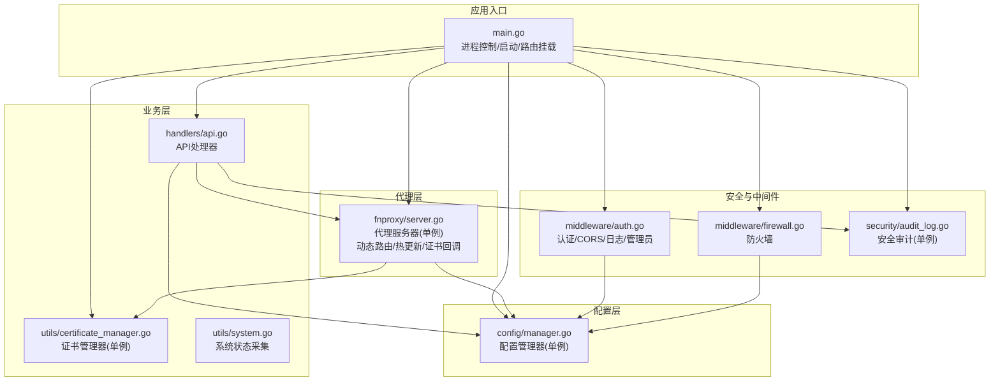
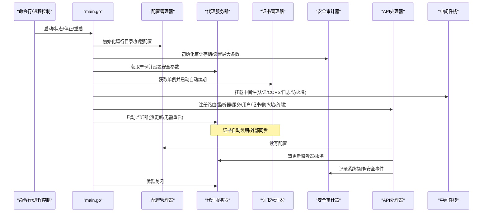
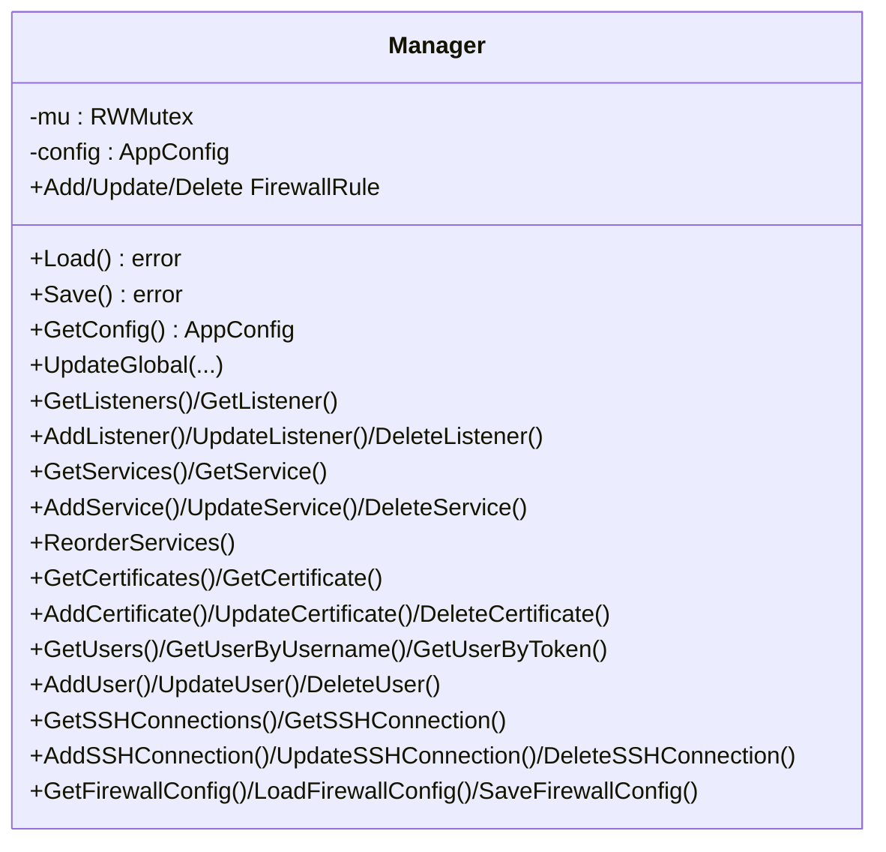
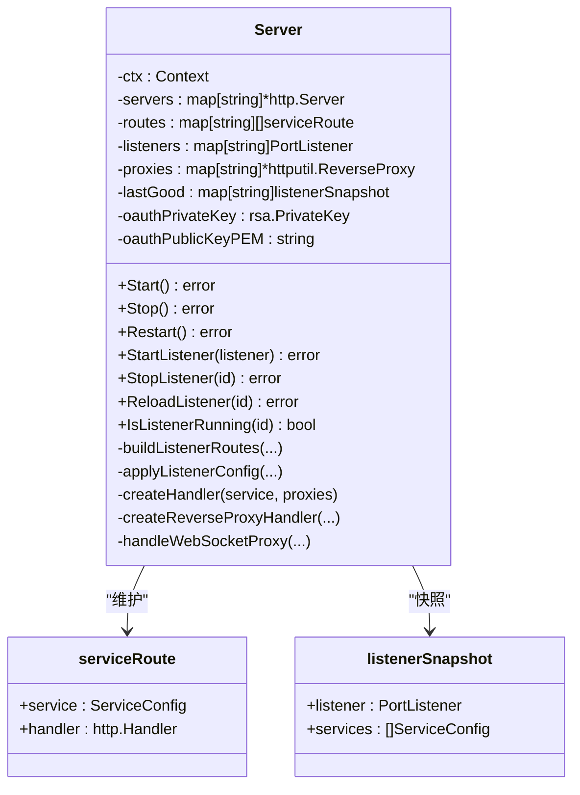
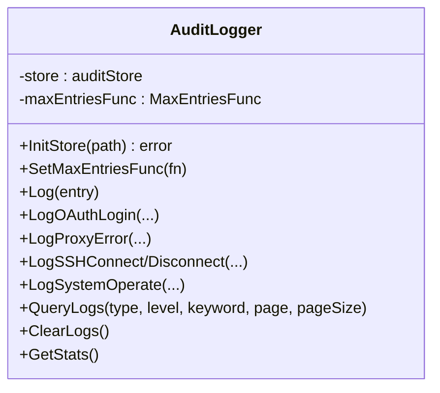
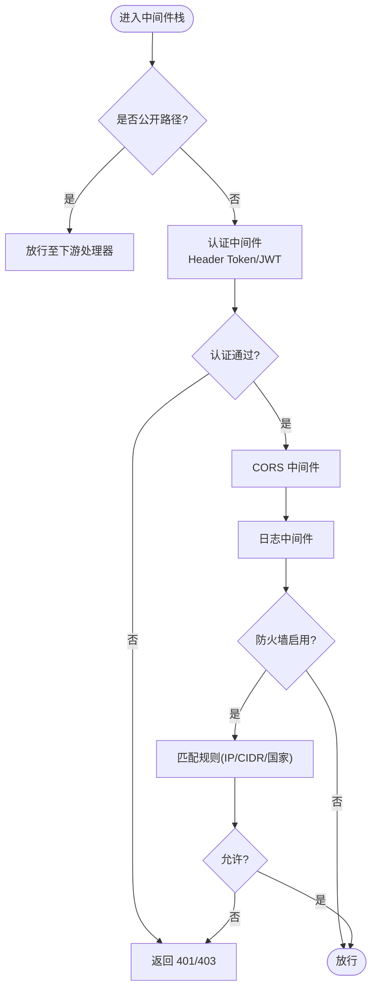
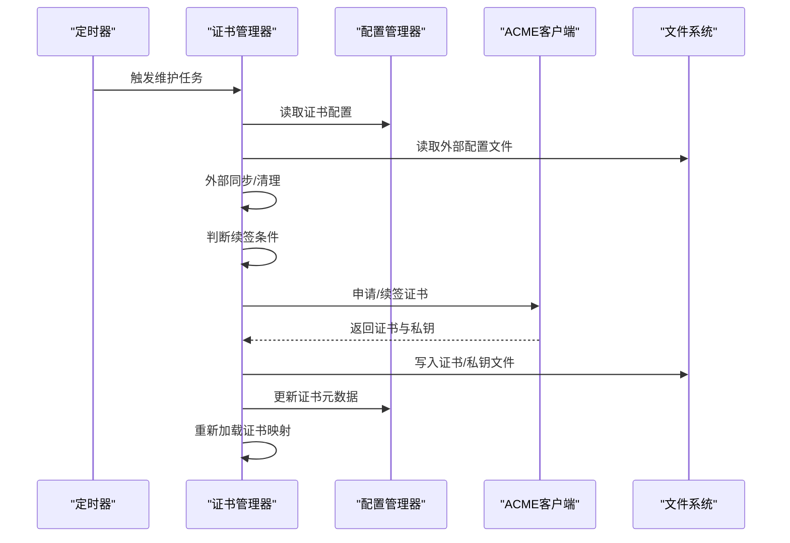
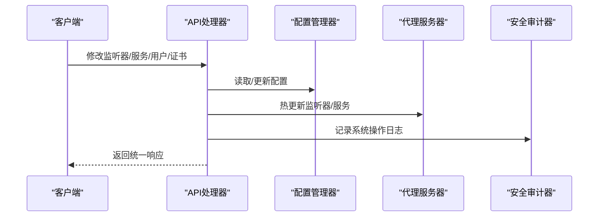
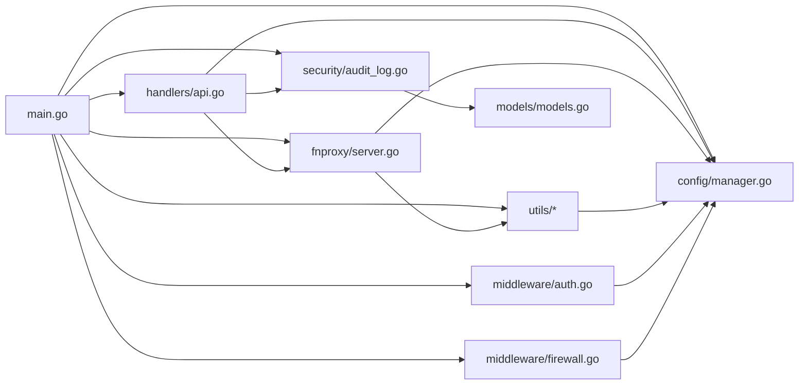

# 架构设计

<cite>
**本文引用的文件**
- [src/main.go](file://src/main.go)
- [src/go.mod](file://src/go.mod)
- [README.md](file://README.md)
- [src/config/manager.go](file://src/config/manager.go)
- [src/fnproxy/server.go](file://src/fnproxy/server.go)
- [src/handlers/api.go](file://src/handlers/api.go)
- [src/middleware/auth.go](file://src/middleware/auth.go)
- [src/middleware/firewall.go](file://src/middleware/firewall.go)
- [src/security/audit_log.go](file://src/security/audit_log.go)
- [src/utils/certificate_manager.go](file://src/utils/certificate_manager.go)
- [src/models/models.go](file://src/models/models.go)
- [src/utils/system.go](file://src/utils/system.go)
- [src/process_control.go](file://src/process_control.go)
</cite>

## 目录
1. [简介](#简介)
2. [项目结构](#项目结构)
3. [核心组件](#核心组件)
4. [架构总览](#架构总览)
5. [详细组件分析](#详细组件分析)
6. [依赖关系分析](#依赖关系分析)
7. [性能考量](#性能考量)
8. [故障排查指南](#故障排查指南)
9. [结论](#结论)
10. [附录](#附录)

## 简介
本项目是一个基于 Go 的轻量级服务管理面板，提供统一的网站管理、反向代理、静态站点、跳转规则、证书管理、OAuth 访问控制、用户管理、SSH 终端与运行状态监控能力。系统采用分层架构与模块化组织，核心围绕“配置管理器”“代理服务器”“安全审计器”三大组件展开，辅以中间件模式实现认证、授权、CORS、日志与防火墙等横切关注点。系统支持热更新、单实例保护、优雅关闭、证书自动续期与外部配置同步，满足生产环境对稳定性、安全性与可扩展性的要求。

## 项目结构
项目采用 Go Module 结构，主要模块如下：
- config：配置管理（单例，持久化 JSON）
- fnproxy：代理服务器（单例，动态路由与热更新）
- handlers：HTTP API 处理器（业务控制器）
- middleware：中间件（认证、CORS、日志、防火墙）
- security：安全审计（单例，内存+持久化存储）
- utils：工具集（证书管理、系统状态、监控等）
- models：数据模型与枚举
- static：前端静态资源（内嵌）

图表来源
- [src/main.go:24-516](file://src/main.go#L24-L516)
- [src/config/manager.go:32-72](file://src/config/manager.go#L32-L72)
- [src/fnproxy/server.go:163-181](file://src/fnproxy/server.go#L163-L181)
- [src/handlers/api.go:1-785](file://src/handlers/api.go#L1-L785)
- [src/middleware/auth.go:14-119](file://src/middleware/auth.go#L14-L119)
- [src/middleware/firewall.go:13-226](file://src/middleware/firewall.go#L13-L226)
- [src/security/audit_log.go:25-31](file://src/security/audit_log.go#L25-L31)
- [src/utils/certificate_manager.go:140-151](file://src/utils/certificate_manager.go#L140-L151)
- [src/utils/system.go:19-82](file://src/utils/system.go#L19-L82)

章节来源
- [src/main.go:24-516](file://src/main.go#L24-L516)
- [README.md:20-42](file://README.md#L20-L42)

## 核心组件
- 配置管理器（单例）：负责全局配置、监听器、服务、证书、用户、SSH、防火墙等的持久化与读取，提供并发安全的读写接口与规范化逻辑。
- 代理服务器（单例）：根据配置动态构建监听器与路由，支持热更新（无需重启），内置反向代理、静态文件、重定向、URL 跳转、文本输出等处理器，并提供 WebSocket 代理。
- 安全审计器（单例）：记录 OAuth 登录、代理错误、SSH 连接、系统操作等日志，支持查询、统计与清理。
- 中间件体系：认证（Header Token/JWT）、CORS、日志、防火墙，形成统一的横切层。
- 工具集：证书管理（ACME 申请/续签/外部同步）、系统状态采集、监控缓存等。

章节来源
- [src/config/manager.go:32-72](file://src/config/manager.go#L32-L72)
- [src/fnproxy/server.go:163-181](file://src/fnproxy/server.go#L163-L181)
- [src/security/audit_log.go:25-31](file://src/security/audit_log.go#L25-L31)
- [src/middleware/auth.go:14-119](file://src/middleware/auth.go#L14-L119)
- [src/middleware/firewall.go:13-226](file://src/middleware/firewall.go#L13-L226)
- [src/utils/certificate_manager.go:140-151](file://src/utils/certificate_manager.go#L140-L151)
- [src/utils/system.go:19-82](file://src/utils/system.go#L19-L82)

## 架构总览
系统采用“入口控制—配置驱动—代理执行—安全审计”的分层设计。入口负责进程控制、单实例保护、路由挂载与优雅关闭；配置驱动代理服务器的动态路由与热更新；代理服务器对外提供统一的 HTTP/HTTPS 服务；安全审计贯穿所有关键操作，提供可观测性与合规支持。

图表来源
- [src/main.go:74-516](file://src/main.go#L74-L516)
- [src/config/manager.go:74-107](file://src/config/manager.go#L74-L107)
- [src/fnproxy/server.go:183-425](file://src/fnproxy/server.go#L183-L425)
- [src/utils/certificate_manager.go:153-190](file://src/utils/certificate_manager.go#L153-L190)
- [src/security/audit_log.go:62-80](file://src/security/audit_log.go#L62-L80)

## 详细组件分析

### 配置管理器（单例）
- 设计要点
  - 单例模式：通过 once.Do 保证全局唯一实例。
  - 并发安全：读写锁保护配置读写，返回深拷贝副本防止外部修改。
  - 规范化：启动时对全局配置与服务排序进行归一化，确保一致性。
  - 持久化：JSON 文件存储，自动创建目录与默认值。
- 数据结构与复杂度
  - AppConfig：包含全局、监听器、服务、证书、用户、SSH、防火墙等集合。
  - 读写操作：O(1) 基本读取，写入 O(n)（序列化与落盘）。
- 关键流程
  - 加载：读取 JSON，反序列化并规范化。
  - 保存：序列化并写入文件，必要时创建目录。
  - 热更新：由代理服务器调用，触发监听器/服务热加载。

图表来源
- [src/config/manager.go:18-791](file://src/config/manager.go#L18-L791)

章节来源
- [src/config/manager.go:32-72](file://src/config/manager.go#L32-L72)
- [src/config/manager.go:74-107](file://src/config/manager.go#L74-L107)
- [src/config/manager.go:109-225](file://src/config/manager.go#L109-L225)

### 代理服务器（单例）
- 设计要点
  - 单例模式：全局共享，避免多实例冲突。
  - 动态路由：按监听器 ID 分组维护路由表，支持热更新。
  - 处理器工厂：根据服务类型创建反向代理、静态文件、重定向、URL 跳转、文本输出处理器。
  - TLS 证书回调：按监听器与 SNI 返回匹配证书，支持显式绑定与回退证书。
  - WebSocket：独立 Upgrader 与 Dialer，支持子协议与头部透传。
  - 共享 Transport：连接复用、超时与 KeepAlive 优化。
- 关键流程
  - 启动监听器：构建路由、创建 HTTP/TLS 监听器、启动服务。
  - 热更新：对比快照，清理旧代理，更新路由与监听器映射。
  - 请求处理：ACME 挑战优先、OAuth 处理、路由匹配、处理器执行。

图表来源
- [src/fnproxy/server.go:37-507](file://src/fnproxy/server.go#L37-L507)

章节来源
- [src/fnproxy/server.go:163-181](file://src/fnproxy/server.go#L163-L181)
- [src/fnproxy/server.go:183-425](file://src/fnproxy/server.go#L183-L425)
- [src/fnproxy/server.go:442-781](file://src/fnproxy/server.go#L442-L781)

### 安全审计器（单例）
- 设计要点
  - 单例模式：全局唯一实例，避免重复初始化。
  - 存储抽象：通过审计存储接口实现内存与持久化结合。
  - 回调注入：通过 MaxEntriesFunc 动态获取最大条数，适配配置变化。
  - 日志类型：OAuth 登录、代理错误、SSH 连接、系统操作等。
- 关键流程
  - 初始化：创建审计存储，设置最大条数回调。
  - 记录：线程安全追加，超过阈值按策略裁剪。
  - 查询与统计：支持分页、过滤与聚合统计。

图表来源
- [src/security/audit_log.go:15-224](file://src/security/audit_log.go#L15-L224)

章节来源
- [src/security/audit_log.go:25-31](file://src/security/audit_log.go#L25-L31)
- [src/security/audit_log.go:62-80](file://src/security/audit_log.go#L62-L80)
- [src/security/audit_log.go:168-223](file://src/security/audit_log.go#L168-L223)

### 中间件体系
- 认证中间件：支持 Header Token 与 JWT，公开路径白名单，支持管理员权限。
- CORS 中间件：统一跨域头与预检处理。
- 日志中间件：简单记录请求方法、路径与耗时。
- 防火墙中间件：基于 IP/CIDR 与国家代码（预留 GeoIP）匹配规则，默认允许或拒绝。

图表来源
- [src/middleware/auth.go:14-119](file://src/middleware/auth.go#L14-L119)
- [src/middleware/firewall.go:13-226](file://src/middleware/firewall.go#L13-L226)

章节来源
- [src/middleware/auth.go:14-119](file://src/middleware/auth.go#L14-L119)
- [src/middleware/firewall.go:13-226](file://src/middleware/firewall.go#L13-L226)

### 证书管理器（单例）
- 设计要点
  - 单例模式：全局唯一实例，避免重复初始化。
  - 自动续期：定时任务扫描到期证书并续签。
  - 外部同步：读取外部配置文件，自动导入/更新/清理证书。
  - ACME 申请：支持 HTTP-01/DNS-01，集成多家 DNS 服务商。
  - TLS 回调：按监听器与 SNI 返回证书，支持显式绑定与回退证书。
- 关键流程
  - 启动：确保回退证书，加载已配置证书。
  - 维护：周期性处理外部同步与自动续期。
  - 申请/续签：根据配置与 DNS 提供商完成挑战与签发。
  - HTTP-01：内存 Provider 响应挑战路径。

图表来源
- [src/utils/certificate_manager.go:153-251](file://src/utils/certificate_manager.go#L153-L251)
- [src/utils/certificate_manager.go:595-795](file://src/utils/certificate_manager.go#L595-L795)
- [src/utils/certificate_manager.go:797-800](file://src/utils/certificate_manager.go#L797-L800)

章节来源
- [src/utils/certificate_manager.go:140-151](file://src/utils/certificate_manager.go#L140-L151)
- [src/utils/certificate_manager.go:153-190](file://src/utils/certificate_manager.go#L153-L190)
- [src/utils/certificate_manager.go:218-251](file://src/utils/certificate_manager.go#L218-L251)
- [src/utils/certificate_manager.go:253-269](file://src/utils/certificate_manager.go#L253-L269)
- [src/utils/certificate_manager.go:595-795](file://src/utils/certificate_manager.go#L595-L795)

### API 处理器与数据流
- 设计要点
  - 统一响应结构：成功/失败、数据、错误消息。
  - 参数校验与规范化：监听器端口、协议、默认服务、用户 Token 唯一性等。
  - 安全审计：关键操作记录系统操作日志。
  - 热更新：监听器/服务更新后触发代理服务器热加载。
- 关键流程
  - 监听器：创建/更新/删除/启停/重载，联动代理服务器。
  - 服务：增删改查与排序，支持热更新。
  - 用户：密码加密存储、Token 唯一性校验、启停限制。
  - 证书：导入/更新/续签/删除，联动证书管理器。
  - 防火墙：配置读取/保存/规则增删改。
  - 终端：会话列表、创建、心跳、删除。

图表来源
- [src/handlers/api.go:129-785](file://src/handlers/api.go#L129-L785)
- [src/config/manager.go:227-637](file://src/config/manager.go#L227-L637)
- [src/fnproxy/server.go:427-433](file://src/fnproxy/server.go#L427-L433)
- [src/security/audit_log.go:149-166](file://src/security/audit_log.go#L149-L166)

章节来源
- [src/handlers/api.go:129-785](file://src/handlers/api.go#L129-L785)
- [src/config/manager.go:227-637](file://src/config/manager.go#L227-L637)
- [src/fnproxy/server.go:427-433](file://src/fnproxy/server.go#L427-L433)
- [src/security/audit_log.go:149-166](file://src/security/audit_log.go#L149-L166)

## 依赖关系分析
- 外部依赖
  - ACME 客户端：lego（HTTP-01/DNS-01）
  - WebSocket：gorilla/websocket
  - 加密：golang.org/x/crypto
  - 系统指标：github.com/shirou/gopsutil/v3
  - KV 存储：go.etcd.io/bbolt（审计日志存储）
- 内部模块依赖
  - main 依赖 config、fnproxy、handlers、middleware、security、utils
  - handlers 依赖 config、fnproxy、security、utils
  - fnproxy 依赖 config、models、utils、security
  - utils 依赖 config、models
  - security 依赖 models
  - middleware 依赖 config、utils

图表来源
- [src/go.mod:5-47](file://src/go.mod#L5-L47)
- [src/main.go:16-22](file://src/main.go#L16-L22)
- [src/handlers/api.go:11-18](file://src/handlers/api.go#L11-L18)
- [src/fnproxy/server.go:28-35](file://src/fnproxy/server.go#L28-L35)
- [src/utils/certificate_manager.go:3-37](file://src/utils/certificate_manager.go#L3-L37)
- [src/security/audit_log.go:7-10](file://src/security/audit_log.go#L7-L10)
- [src/middleware/auth.go:3-12](file://src/middleware/auth.go#L3-L12)
- [src/middleware/firewall.go:3-11](file://src/middleware/firewall.go#L3-L11)

章节来源
- [src/go.mod:5-47](file://src/go.mod#L5-L47)
- [src/main.go:16-22](file://src/main.go#L16-L22)

## 性能考量
- 连接复用与超时
  - 共享 Transport：最大空闲连接、每主机空闲连接、连接超时、TLS 握手超时、响应头超时等，减少连接建立开销。
- 代理性能
  - 反向代理 Director 中的路径与头部处理尽量避免不必要的字符串拼接与正则。
  - WebSocket 代理独立 Upgrader/Dialer，避免与 HTTP 流混用。
- 热更新
  - 仅更新路由表与代理映射，不重启监听器，降低中断风险与延迟。
- 证书管理
  - 定时任务间隔可配置，避免频繁 IO；外部同步仅在文件变更时更新。
- 日志与审计
  - 审计日志上限可配置，避免无限增长；查询支持分页与过滤。

[本节为通用性能讨论，不直接分析具体文件]

## 故障排查指南
- 进程控制
  - 使用 status/stop/restart 动作与 PID 文件进行进程状态检查与停止。
  - 单实例保护：若检测到运行中 PID，启动将失败。
- 代理启动失败
  - 检查监听端口占用与协议配置；热更新失败会回滚到上次正确配置。
- 证书问题
  - ACME 申请需启用 HTTP 80 监听器或正确配置 DNS 提供商；外部同步文件路径需可读。
- 安全日志
  - 审计存储初始化失败或条数超限；可通过清理接口清空或调整最大条数。
- 中间件
  - 认证失败：确认 Header Token/JWT 格式与签名；管理员权限仅对特定接口生效。
  - 防火墙：默认允许或拒绝取决于配置；国家规则需集成 GeoIP 库。

章节来源
- [src/process_control.go:17-139](file://src/process_control.go#L17-L139)
- [src/fnproxy/server.go:349-425](file://src/fnproxy/server.go#L349-L425)
- [src/utils/certificate_manager.go:459-461](file://src/utils/certificate_manager.go#L459-L461)
- [src/security/audit_log.go:34-44](file://src/security/audit_log.go#L34-L44)
- [src/middleware/auth.go:14-119](file://src/middleware/auth.go#L14-L119)
- [src/middleware/firewall.go:13-226](file://src/middleware/firewall.go#L13-L226)

## 结论
本系统通过“配置驱动 + 代理执行 + 安全审计”的架构实现了高内聚、低耦合的模块化设计。单例模式确保关键组件的全局一致性；中间件模式提供横切能力；热更新与证书自动续期提升运维效率；安全审计贯穿全链路保障合规与可观测性。整体设计兼顾性能、安全与可扩展性，适合在生产环境中稳定运行。

[本节为总结性内容，不直接分析具体文件]

## 附录
- 系统边界与集成接口
  - 管理后台：TCP/Unix Socket 监听，支持 JWT 与 Header Token 认证。
  - 代理服务：HTTP/HTTPS 监听，支持反向代理、静态文件、重定向、URL 跳转、文本输出、WebSocket。
  - 证书接口：ACME 申请/续签、外部配置同步、TLS 回调。
  - 审计接口：日志查询、统计、清理。
  - 进程控制：status/stop/restart，PID 文件与单实例保护。

章节来源
- [src/main.go:432-458](file://src/main.go#L432-L458)
- [src/models/models.go:384-394](file://src/models/models.go#L384-L394)
- [src/utils/certificate_manager.go:253-269](file://src/utils/certificate_manager.go#L253-L269)
- [src/security/audit_log.go:168-223](file://src/security/audit_log.go#L168-L223)
- [src/process_control.go:17-28](file://src/process_control.go#L17-L28)