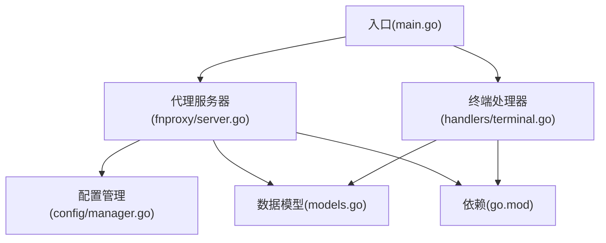
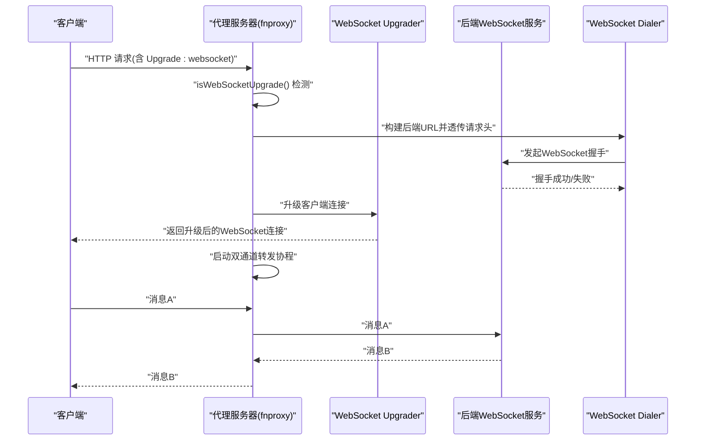
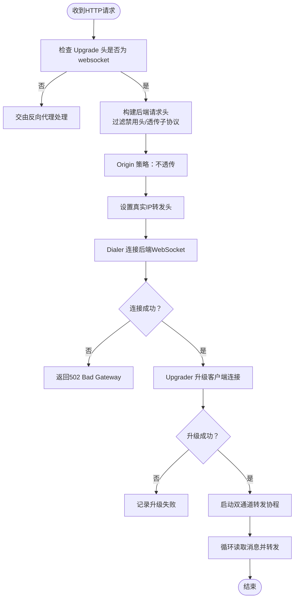
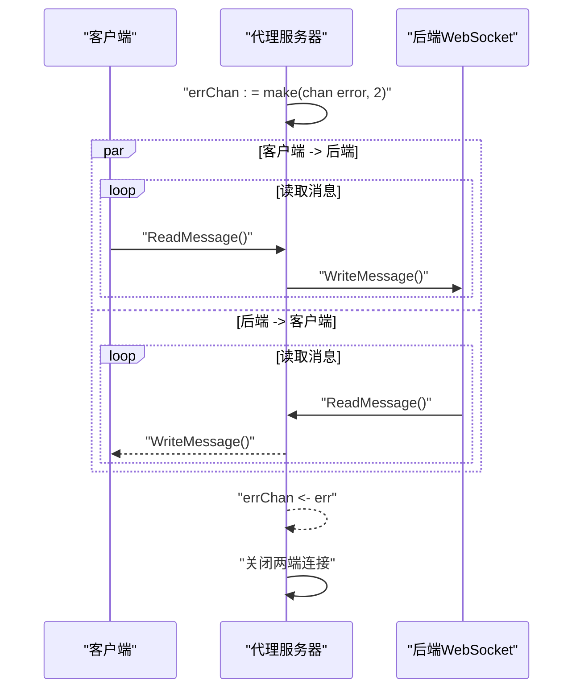
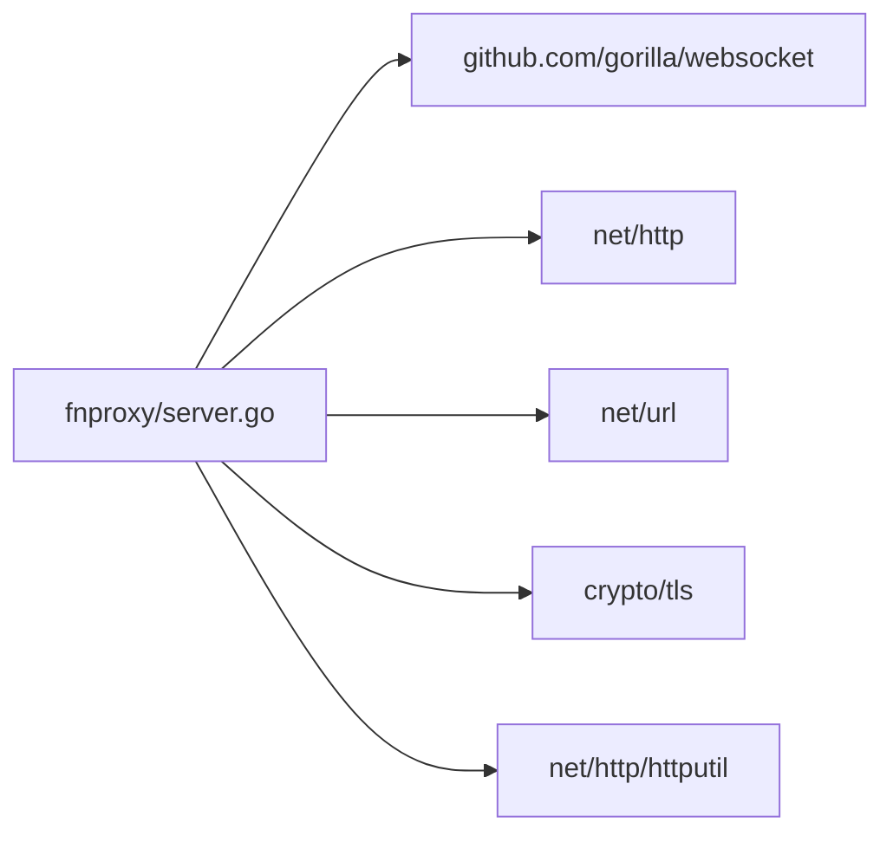

# WebSocket代理

<cite>
**本文引用的文件**
- [src/main.go](file://src/main.go)
- [src/fnproxy/server.go](file://src/fnproxy/server.go)
- [src/handlers/terminal.go](file://src/handlers/terminal.go)
- [src/models/models.go](file://src/models/models.go)
- [src/config/manager.go](file://src/config/manager.go)
- [src/go.mod](file://src/go.mod)
</cite>

## 目录
1. [简介](#简介)
2. [项目结构](#项目结构)
3. [核心组件](#核心组件)
4. [架构总览](#架构总览)
5. [详细组件分析](#详细组件分析)
6. [依赖关系分析](#依赖关系分析)
7. [性能考量](#性能考量)
8. [故障排除指南](#故障排除指南)
9. [结论](#结论)
10. [附录](#附录)

## 简介
本文件面向代理服务器的WebSocket代理能力，围绕以下目标展开：
- WebSocket连接检测机制与协议升级处理
- 双向消息转发系统与并发模型
- 子协议支持、特殊头部处理、真实IP转发、Origin策略与安全考虑
- gorilla/websocket库使用、缓冲区管理与并发连接处理
- 配置选项、性能调优与故障排除

## 项目结构
本项目采用模块化组织，WebSocket代理功能主要位于fnproxy包中，同时在主入口注册了WebSocket终端接口。关键文件如下：
- 代理服务器与WebSocket代理逻辑：src/fnproxy/server.go
- WebSocket终端处理器：src/handlers/terminal.go
- 应用配置与服务类型定义：src/models/models.go、src/config/manager.go
- 依赖声明：src/go.mod
- 入口与路由挂载：src/main.go

图表来源
- [src/main.go:418-420](file://src/main.go#L418-L420)
- [src/fnproxy/server.go:1-800](file://src/fnproxy/server.go#L1-L800)
- [src/handlers/terminal.go:1-858](file://src/handlers/terminal.go#L1-L858)
- [src/models/models.go:1-394](file://src/models/models.go#L1-L394)
- [src/config/manager.go:1-791](file://src/config/manager.go#L1-L791)
- [src/go.mod:1-48](file://src/go.mod#L1-L48)

章节来源
- [src/main.go:418-420](file://src/main.go#L418-L420)
- [src/fnproxy/server.go:1-800](file://src/fnproxy/server.go#L1-L800)
- [src/handlers/terminal.go:1-858](file://src/handlers/terminal.go#L1-L858)
- [src/models/models.go:1-394](file://src/models/models.go#L1-L394)
- [src/config/manager.go:1-791](file://src/config/manager.go#L1-L791)
- [src/go.mod:1-48](file://src/go.mod#L1-L48)

## 核心组件
- 代理服务器与WebSocket代理：负责监听端口、动态路由、反向代理与WebSocket代理
- WebSocket代理处理器：基于gorilla/websocket实现握手、子协议透传、双向消息转发
- WebSocket终端处理器：基于gorilla/websocket实现终端会话的WebSocket桥接
- 配置与模型：定义服务类型、反向代理配置、终端会话等

章节来源
- [src/fnproxy/server.go:37-800](file://src/fnproxy/server.go#L37-L800)
- [src/handlers/terminal.go:33-858](file://src/handlers/terminal.go#L33-L858)
- [src/models/models.go:93-130](file://src/models/models.go#L93-L130)

## 架构总览
WebSocket代理在反向代理链路中，当检测到Upgrade头为websocket时，拦截HTTP请求并进行协议升级，随后建立与后端的WebSocket连接，并在两端之间建立独立的读写协程进行消息转发。

图表来源
- [src/fnproxy/server.go:576-589](file://src/fnproxy/server.go#L576-L589)
- [src/fnproxy/server.go:639-781](file://src/fnproxy/server.go#L639-L781)

## 详细组件分析

### WebSocket代理检测与升级
- 检测机制：通过判断请求头Upgrade是否为websocket，决定是否进入WebSocket代理流程
- 协议升级：使用gorilla/websocket.Upgrader完成与客户端的协议升级
- 子协议支持：从客户端请求头提取Sec-Websocket-Protocol并透传至后端
- 特殊头部处理：过滤hop-by-hop与WebSocket握手相关头部，避免重复或冲突
- Origin策略：默认不透传Origin，以减少后端对来源校验的依赖
- 真实IP转发：设置X-Real-IP、X-Forwarded-For、X-Forwarded-Host、X-Forwarded-Proto等头

图表来源
- [src/fnproxy/server.go:586-589](file://src/fnproxy/server.go#L586-L589)
- [src/fnproxy/server.go:639-781](file://src/fnproxy/server.go#L639-L781)

章节来源
- [src/fnproxy/server.go:586-589](file://src/fnproxy/server.go#L586-L589)
- [src/fnproxy/server.go:639-781](file://src/fnproxy/server.go#L639-L781)

### 双向消息转发与并发模型
- 并发模型：为客户端到后端、后端到客户端分别启动独立协程，使用带缓冲的错误通道实现任一方向出错即终止
- 缓冲区管理：Upgrader与Dialer均配置了读写缓冲区大小，避免阻塞
- 错误处理：任一方向读取或写入失败，都会触发关闭并清理资源

图表来源
- [src/fnproxy/server.go:746-781](file://src/fnproxy/server.go#L746-L781)

章节来源
- [src/fnproxy/server.go:746-781](file://src/fnproxy/server.go#L746-L781)

### 子协议支持与Origin策略
- 子协议：若客户端请求包含Sec-Websocket-Protocol，则透传给后端
- Origin：默认不透传，以降低后端对来源校验的要求
- Host头：设置为后端目标Host，满足部分后端对Host的校验需求

章节来源
- [src/fnproxy/server.go:715-718](file://src/fnproxy/server.go#L715-L718)
- [src/fnproxy/server.go:689-706](file://src/fnproxy/server.go#L689-L706)

### 真实IP转发与代理头策略
- X-Real-IP：直接记录客户端IP
- X-Forwarded-For：追加到已有链路
- X-Forwarded-Host：记录原始Host
- X-Forwarded-Proto：根据TLS状态记录协议
- TrustProxyHeaders：反向代理配置中存在该字段，用于信任上游代理头

章节来源
- [src/fnproxy/server.go:601-628](file://src/fnproxy/server.go#L601-L628)
- [src/models/models.go:129](file://src/models/models.go#L129)

### gorilla/websocket库使用与缓冲区
- Upgrader配置：读写缓冲区均为4096字节，CheckOrigin返回true允许所有来源
- Dialer配置：握手超时10秒，TLS跳过证书校验，支持子协议透传

章节来源
- [src/fnproxy/server.go:630-637](file://src/fnproxy/server.go#L630-L637)
- [src/fnproxy/server.go:708-718](file://src/fnproxy/server.go#L708-L718)

### WebSocket终端处理器（对比参考）
- 终端处理器同样使用gorilla/websocket进行升级
- 与代理不同的是，终端处理器关注会话生命周期、心跳、窗口调整与输出缓冲
- 两者在升级与消息转发上的模式一致，但业务上下文不同

章节来源
- [src/handlers/terminal.go:33-37](file://src/handlers/terminal.go#L33-L37)
- [src/handlers/terminal.go:353-377](file://src/handlers/terminal.go#L353-L377)

## 依赖关系分析
- 依赖gorilla/websocket用于WebSocket协议升级与消息收发
- 依赖标准库net/http、net/url、crypto/tls等
- 代理服务器内部使用httputil.ReverseProxy作为通用反向代理基础

图表来源
- [src/fnproxy/server.go:34](file://src/fnproxy/server.go#L34)
- [src/go.mod:9](file://src/go.mod#L9)

章节来源
- [src/fnproxy/server.go:34](file://src/fnproxy/server.go#L34)
- [src/go.mod:9](file://src/go.mod#L9)

## 性能考量
- 连接复用：全局共享http.Transport，启用KeepAlive与连接池上限，提升后端连接复用效率
- 超时与缓冲：Dialer握手超时10秒，Upgrader/Dialer读写缓冲4096字节，平衡延迟与内存占用
- 并发模型：每条WebSocket连接启动两个协程，避免阻塞；错误通道容量为2，确保任一方向异常快速收敛
- TLS跳过校验：Dialer中InsecureSkipVerify=true，简化部署但带来安全风险，建议在生产中结合其他安全策略

章节来源
- [src/fnproxy/server.go:142-161](file://src/fnproxy/server.go#L142-L161)
- [src/fnproxy/server.go:708-718](file://src/fnproxy/server.go#L708-L718)
- [src/fnproxy/server.go:630-637](file://src/fnproxy/server.go#L630-L637)

## 故障排除指南
- 握手失败
  - 现象：返回502 Bad Gateway，日志包含后端URL与错误信息
  - 排查：确认后端WebSocket可达性、路径与查询参数、TLS配置
  - 参考：handleWebSocketProxy中的错误处理与日志打印
- 升级失败
  - 现象：客户端无法升级为WebSocket
  - 排查：检查Upgrader配置、Origin策略、浏览器兼容性
  - 参考：wsUpgrader配置与升级调用
- 子协议不匹配
  - 现象：后端拒绝连接或协议协商失败
  - 排查：确认客户端请求的Sec-Websocket-Protocol与后端支持列表一致
  - 参考：子协议透传逻辑
- 真实IP不可见
  - 现象：后端无法识别真实来源
  - 排查：确认是否启用了TrustProxyHeaders；检查X-Forwarded-*头是否被后端正确解析
  - 参考：setForwardedHeaders与ReverseProxyConfig.TrustProxyHeaders
- 并发连接异常
  - 现象：高并发下连接不稳定或消息丢失
  - 排查：检查errChan容量、缓冲区大小、后端负载与队列
  - 参考：双通道转发与错误通道

章节来源
- [src/fnproxy/server.go:720-728](file://src/fnproxy/server.go#L720-L728)
- [src/fnproxy/server.go:739-743](file://src/fnproxy/server.go#L739-L743)
- [src/fnproxy/server.go:715-718](file://src/fnproxy/server.go#L715-L718)
- [src/fnproxy/server.go:601-628](file://src/fnproxy/server.go#L601-L628)
- [src/fnproxy/server.go:746-781](file://src/fnproxy/server.go#L746-L781)

## 结论
本项目的WebSocket代理通过gorilla/websocket实现了对Upgrade请求的精准拦截与协议升级，配合子协议透传、Origin策略与真实IP转发，满足多数后端WebSocket服务的接入需求。并发模型简洁可靠，错误通道机制保证了连接的快速收敛。建议在生产环境中结合安全策略与监控，谨慎评估TLS跳过校验带来的风险。

## 附录

### 配置选项与行为对照
- 反向代理高级配置（ReverseProxyConfig）
  - PreserveHost：是否保留原始Host头
  - HostHeader：自定义发送给上游的Host头
  - StripPathPrefix/AddPathPrefix：路径前缀处理
  - HeaderUp/HeaderDown：请求/响应头增删改
  - HideHeaderUp/HideHeaderDown：隐藏发送给上游/客户端的头
  - BufferRequests：是否缓冲请求体（用于重试）
  - TrustProxyHeaders：是否信任上游代理头（X-Forwarded-*）

章节来源
- [src/models/models.go:109-130](file://src/models/models.go#L109-L130)

### WebSocket代理关键流程代码路径
- 检测与升级：[src/fnproxy/server.go:576-589](file://src/fnproxy/server.go#L576-L589)、[src/fnproxy/server.go:639-781](file://src/fnproxy/server.go#L639-L781)
- 真实IP转发：[src/fnproxy/server.go:601-628](file://src/fnproxy/server.go#L601-L628)
- 子协议透传：[src/fnproxy/server.go:715-718](file://src/fnproxy/server.go#L715-L718)
- 并发转发：[src/fnproxy/server.go:746-781](file://src/fnproxy/server.go#L746-L781)