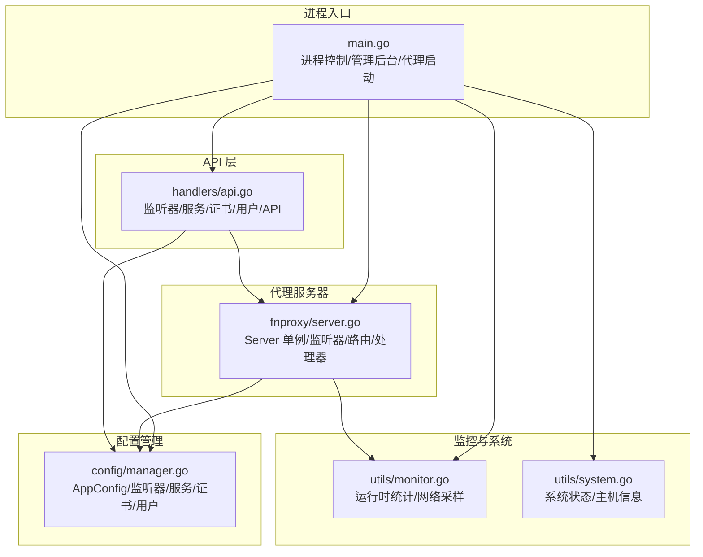
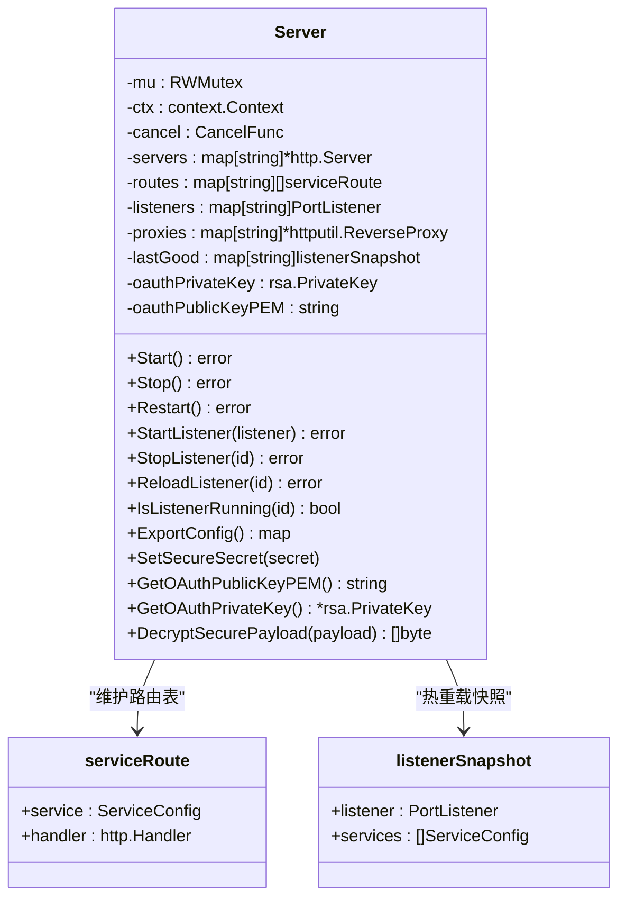
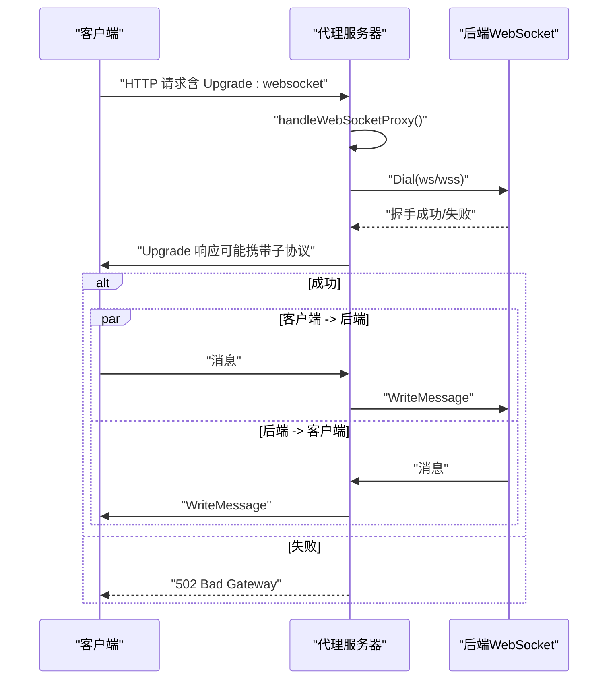
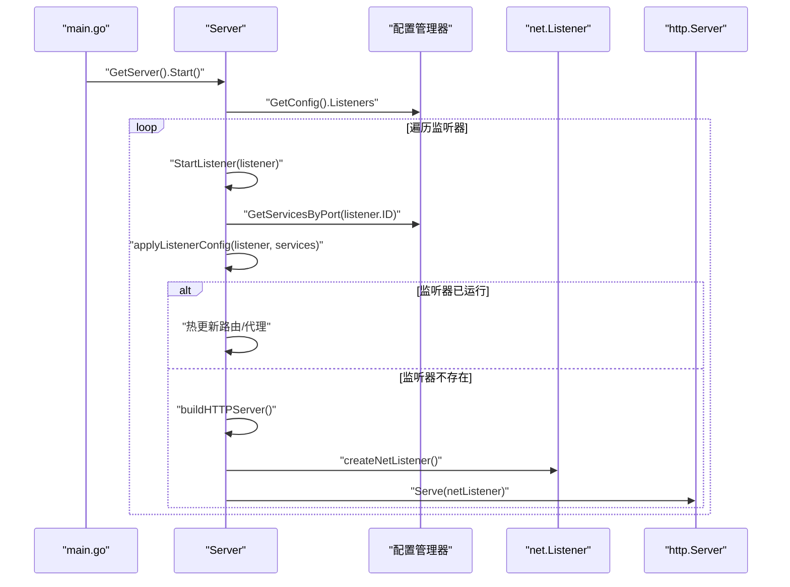
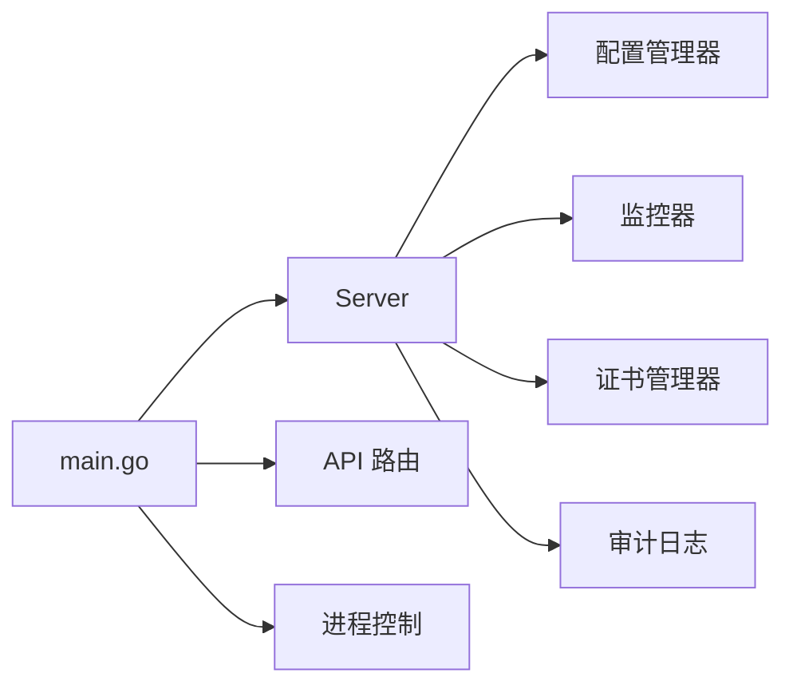

# 代理服务器

<cite>
**本文引用的文件**
- [src/fnproxy/server.go](file://src/fnproxy/server.go)
- [src/main.go](file://src/main.go)
- [src/models/models.go](file://src/models/models.go)
- [src/config/manager.go](file://src/config/manager.go)
- [src/process_control.go](file://src/process_control.go)
- [src/utils/monitor.go](file://src/utils/monitor.go)
- [src/utils/system.go](file://src/utils/system.go)
- [src/handlers/api.go](file://src/handlers/api.go)
</cite>

## 目录
1. [简介](#简介)
2. [项目结构](#项目结构)
3. [核心组件](#核心组件)
4. [架构总览](#架构总览)
5. [详细组件分析](#详细组件分析)
6. [依赖分析](#依赖分析)
7. [性能考量](#性能考量)
8. [故障排查指南](#故障排查指南)
9. [结论](#结论)
10. [附录](#附录)

## 简介
本文件面向 Caddy Panel 的代理服务器组件，系统性阐述 Server 结构体的设计理念与实现细节，覆盖单例模式、监听器管理、动态路由、热重载、启动流程、处理器工厂、反向代理与 WebSocket 代理、静态文件、重定向、URL 跳转、文本输出等服务类型，并给出生命周期管理、错误处理策略与性能优化建议。文档同时提供关键流程的时序图与类图，帮助读者快速理解代码结构与交互关系。

## 项目结构
代理服务器位于独立包中，配合主程序入口、配置管理、监控与系统工具模块协同工作：
- 代理服务器：fnproxy 包，负责监听器、路由、处理器与热重载
- 主程序入口：main.go，负责进程控制、管理后台 HTTP 服务、代理服务器启动与优雅关闭
- 配置管理：config 包，提供全局配置、监听器与服务的增删改查与持久化
- 监控与系统：utils 包，提供运行时统计、网络采样、系统状态查询
- API 层：handlers 包，提供管理后台 API，驱动配置变更与状态查询

图表来源
- [src/main.go:24-516](file://src/main.go#L24-L516)
- [src/fnproxy/server.go:37-181](file://src/fnproxy/server.go#L37-L181)
- [src/config/manager.go:18-72](file://src/config/manager.go#L18-L72)
- [src/utils/monitor.go:39-65](file://src/utils/monitor.go#L39-L65)
- [src/utils/system.go:19-82](file://src/utils/system.go#L19-L82)
- [src/handlers/api.go:129-200](file://src/handlers/api.go#L129-L200)

章节来源
- [src/main.go:24-516](file://src/main.go#L24-L516)
- [src/fnproxy/server.go:37-181](file://src/fnproxy/server.go#L37-L181)
- [src/config/manager.go:18-72](file://src/config/manager.go#L18-L72)
- [src/utils/monitor.go:39-65](file://src/utils/monitor.go#L39-L65)
- [src/utils/system.go:19-82](file://src/utils/system.go#L19-L82)
- [src/handlers/api.go:129-200](file://src/handlers/api.go#L129-L200)

## 核心组件
- Server 单例：提供监听器启停、动态路由构建、处理器工厂、热重载、OAuth 登录页渲染与登录处理、WebSocket 代理等能力
- 配置管理器：提供 AppConfig、监听器与服务的增删改查、排序、持久化
- 监控器：记录请求计数、活跃连接、进出字节、速率、访问日志与网络采样
- 主程序：进程控制、管理后台 HTTP 服务、代理服务器启动与优雅关闭

章节来源
- [src/fnproxy/server.go:37-181](file://src/fnproxy/server.go#L37-L181)
- [src/config/manager.go:18-72](file://src/config/manager.go#L18-L72)
- [src/utils/monitor.go:39-65](file://src/utils/monitor.go#L39-L65)
- [src/main.go:24-516](file://src/main.go#L24-L516)

## 架构总览
代理服务器采用“监听器-服务路由-处理器”的三层结构：
- 监听器层：每个 PortListener 对应一个 http.Server 实例，负责接收请求
- 路由层：按监听器 ID 分组维护 serviceRoute 列表，基于域名匹配选择具体服务
- 处理器层：根据服务类型创建对应处理器（反向代理/静态/重定向/URL跳转/文本输出），统一包装认证与统计

图表来源
- [src/fnproxy/server.go:37-181](file://src/fnproxy/server.go#L37-L181)
- [src/fnproxy/server.go:51-59](file://src/fnproxy/server.go#L51-L59)

章节来源
- [src/fnproxy/server.go:37-181](file://src/fnproxy/server.go#L37-L181)
- [src/fnproxy/server.go:51-59](file://src/fnproxy/server.go#L51-L59)

## 详细组件分析

### Server 结构体与单例模式
- 设计要点
  - 单例：通过 once.Do 保证全局唯一实例，初始化上下文、取消函数、各映射表与 OAuth 密钥对
  - 并发安全：使用 RWMutex 保护多处共享状态（服务器、路由、监听器、代理、快照）
  - 生命周期：通过 ctx/cancel 控制优雅关闭，Stop 时清空映射并调用 http.Server.Shutdown
- 关键字段
  - servers：监听器 ID 到 http.Server 的映射
  - routes：监听器 ID 到 serviceRoute 的映射
  - listeners：监听器配置缓存
  - proxies：服务 ID 到 ReverseProxy 的映射
  - lastGood：热重载快照，用于失败回滚
  - oauthPrivateKey/publicKeyPEM：OAuth 登录解密与公钥导出

章节来源
- [src/fnproxy/server.go:37-181](file://src/fnproxy/server.go#L37-L181)

### 监听器管理机制
- 启动流程
  - Start：遍历配置中的监听器，仅对 Enabled=true 的监听器调用 StartListener
  - StartListener：根据监听器 ID 获取其服务列表，调用 applyListenerConfig
- 停止与重启
  - Stop：取消上下文，逐个调用 http.Server.Shutdown，清空映射
  - Restart：Stop 后再 Start
- 监听器启停
  - StopListener：关闭对应 http.Server，清理旧代理，更新 lastGood 快照
- 热重载
  - applyListenerConfig：若监听器已运行，仅更新路由表与代理映射，避免重启
  - 若监听器不存在，创建 http.Server 与 net.Listener，注册路由并启动 Serve
  - 失败回滚：若创建失败且存在上次成功快照，则恢复快照并返回错误

章节来源
- [src/fnproxy/server.go:183-253](file://src/fnproxy/server.go#L183-L253)
- [src/fnproxy/server.go:370-425](file://src/fnproxy/server.go#L370-L425)
- [src/fnproxy/server.go:427-440](file://src/fnproxy/server.go#L427-L440)

### 动态路由系统
- 路由构建
  - buildListenerRoutes：遍历服务，创建处理器并包装认证与统计，生成 serviceRoute 列表
  - createHandler：根据服务类型分派到具体处理器工厂
- 路由匹配
  - matchServiceRoute：先精确匹配，再通配符匹配，最后默认匹配
  - normalizeHost：标准化 Host，支持 IPv4/IPv6 场景
- 包装器
  - wrapServiceHandler：统一处理 OAuth 认证、统计埋点、访问日志

章节来源
- [src/fnproxy/server.go:270-291](file://src/fnproxy/server.go#L270-L291)
- [src/fnproxy/server.go:442-458](file://src/fnproxy/server.go#L442-L458)
- [src/fnproxy/server.go:1119-1140](file://src/fnproxy/server.go#L1119-L1140)
- [src/fnproxy/server.go:1277-1321](file://src/fnproxy/server.go#L1277-L1321)

### 服务处理器工厂与实现
- 反向代理（reverse_proxy）
  - createReverseProxyHandler：基于 Upstream 构造 ReverseProxy，Director 修改 Host、路径前缀、隐藏/添加头，ModifyResponse 修改下游响应头，ErrorHandler 记录审计日志并返回 502
  - WebSocket 特殊处理：当 Upgrade=websocket 时，handleWebSocketProxy 使用 gorilla/websocket 进行握手与双向转发
  - 真实 IP 透传：setForwardedHeaders 在未信任上游代理头时设置 X-Real-IP/X-Forwarded-* 头
- 静态文件（static）
  - createStaticHandler：解析 Root/Index/Browse，支持目录浏览与索引文件
- 重定向（redirect）
  - createRedirectHandler：将请求重定向到配置的目标地址，默认 302
- URL 跳转（url_jump）
  - createURLJumpHandler：可选择保留路径，将请求重定向到目标 URL
- 文本输出（text_output）
  - createTextOutputHandler：设置 Content-Type、状态码与响应体

章节来源
- [src/fnproxy/server.go:460-584](file://src/fnproxy/server.go#L460-L584)
- [src/fnproxy/server.go:639-781](file://src/fnproxy/server.go#L639-L781)
- [src/fnproxy/server.go:804-852](file://src/fnproxy/server.go#L804-L852)
- [src/fnproxy/server.go:1043-1063](file://src/fnproxy/server.go#L1043-L1063)
- [src/fnproxy/server.go:1065-1089](file://src/fnproxy/server.go#L1065-L1089)
- [src/fnproxy/server.go:1091-1117](file://src/fnproxy/server.go#L1091-L1117)

### WebSocket 代理与双向转发
- 升级判断：isWebSocketUpgrade 检查 Upgrade 头
- 握手与连接：handleWebSocketProxy 构造后端 ws/wss URL，准备请求头（排除 hop-by-hop 与 Sec-Websocket*），设置 Host/X-Real-IP/X-Forwarded-*，使用 Dialer 连接后端
- 双向转发：两个 goroutine 分别从客户端与后端读取消息并写入对方，任一方向出错即结束
- 子协议：若客户端声明子协议，传递给后端；响应头设置 Sec-WebSocket-Protocol

图表来源
- [src/fnproxy/server.go:587-589](file://src/fnproxy/server.go#L587-L589)
- [src/fnproxy/server.go:639-781](file://src/fnproxy/server.go#L639-L781)

章节来源
- [src/fnproxy/server.go:587-589](file://src/fnproxy/server.go#L587-L589)
- [src/fnproxy/server.go:639-781](file://src/fnproxy/server.go#L639-L781)

### OAuth 登录与安全
- 登录页面渲染：renderOAuthLoginPage，提供公钥 PEM 供前端加密
- 登录处理：handleOAuthLogin，解析表单，解密 payload，校验用户与密码，生成访问令牌并写入 Cookie
- 解密流程：SetSecureSecret 初始化密钥对，DecryptSecurePayload 使用私钥解密 OAEP
- 审计日志：记录 OAuth 登录成功/失败事件

章节来源
- [src/fnproxy/server.go:1173-1251](file://src/fnproxy/server.go#L1173-L1251)
- [src/fnproxy/server.go:1380-1428](file://src/fnproxy/server.go#L1380-L1428)
- [src/fnproxy/server.go:1430-1458](file://src/fnproxy/server.go#L1430-L1458)

### 服务器启动流程与监听器配置应用
- 主程序启动
  - 初始化运行目录、安全参数、审计日志、代理服务器单例、监控器、证书管理器
  - 挂载管理后台路由与 API 路由，创建 http.Server 并启动监听
  - 启动代理服务器：proxyServer.Start()
  - 注册信号处理，优雅关闭：停止代理服务器、关闭管理后台、清理资源
- 监听器配置应用
  - 遍历配置中的监听器，调用 StartListener
  - applyListenerConfig：构建路由与代理，若监听器已运行则热更新，否则创建新服务器并启动

图表来源
- [src/main.go:105-109](file://src/main.go#L105-L109)
- [src/main.go:475-477](file://src/main.go#L475-L477)
- [src/fnproxy/server.go:183-253](file://src/fnproxy/server.go#L183-L253)
- [src/fnproxy/server.go:370-425](file://src/fnproxy/server.go#L370-L425)

章节来源
- [src/main.go:105-109](file://src/main.go#L105-L109)
- [src/main.go:475-477](file://src/main.go#L475-L477)
- [src/fnproxy/server.go:183-253](file://src/fnproxy/server.go#L183-L253)
- [src/fnproxy/server.go:370-425](file://src/fnproxy/server.go#L370-L425)

### 服务处理器创建机制
- createHandler：根据 ServiceConfig.Type 分派到具体工厂
- 各工厂负责：
  - 反向代理：解析 Upstream、HostHeader、路径前缀、隐藏/添加头、超时、健康检查等
  - 静态文件：Root/Index/Browse
  - 重定向：To
  - URL 跳转：TargetURL/PreservePath
  - 文本输出：ContentType/Body/StatusCode

章节来源
- [src/fnproxy/server.go:442-458](file://src/fnproxy/server.go#L442-L458)
- [src/fnproxy/server.go:460-584](file://src/fnproxy/server.go#L460-L584)
- [src/fnproxy/server.go:804-852](file://src/fnproxy/server.go#L804-L852)
- [src/fnproxy/server.go:1043-1063](file://src/fnproxy/server.go#L1043-L1063)
- [src/fnproxy/server.go:1065-1089](file://src/fnproxy/server.go#L1065-L1089)
- [src/fnproxy/server.go:1091-1117](file://src/fnproxy/server.go#L1091-L1117)

### 数据模型与配置参数
- 监听器 PortListener：ID/Port/Protocol/Enabled/时间戳
- 服务 ServiceConfig：ID/PortID/Name/Type/Domain/SortOrder/CertificateID/Enabled/Config/RequireAuth/时间戳
- 服务类型 ServiceType：reverse_proxy/static/redirect/url_jump/text_output
- 反向代理配置 ReverseProxyConfig：Upstream/Timeout/OAuth/AccessLog/PreserveHost/HostHeader/Strip/Add/HideHeaderUp/HideHeaderDown/BufferRequests/TrustProxyHeaders
- 静态配置 StaticConfig：Root/Index/Browse/OAuth/AccessLog
- 重定向配置 RedirectConfig：To/OAuth/AccessLog
- URL 跳转配置 URLJumpConfig：TargetURL/OAuth/AccessLog/PreservePath
- 文本输出配置 TextOutputConfig：ContentType/Body/StatusCode/OAuth/AccessLog

章节来源
- [src/models/models.go:72-107](file://src/models/models.go#L72-L107)
- [src/models/models.go:82-91](file://src/models/models.go#L82-L91)
- [src/models/models.go:109-130](file://src/models/models.go#L109-L130)
- [src/models/models.go:132-139](file://src/models/models.go#L132-L139)
- [src/models/models.go:141-146](file://src/models/models.go#L141-L146)
- [src/models/models.go:148-154](file://src/models/models.go#L148-L154)
- [src/models/models.go:156-163](file://src/models/models.go#L156-L163)

## 依赖分析
- Server 依赖
  - 配置管理器：读取 AppConfig、监听器与服务列表、用户信息
  - 监控器：记录请求统计、访问日志
  - 证书管理器：HTTPS 监听器证书获取
  - 审计日志：代理错误与 OAuth 登录记录
- 主程序依赖
  - Server 单例：启动代理服务器
  - API 路由：提供监听器/服务/证书/用户管理接口
  - 进程控制：单实例检查、停止、重启

图表来源
- [src/fnproxy/server.go:37-181](file://src/fnproxy/server.go#L37-L181)
- [src/main.go:105-109](file://src/main.go#L105-L109)
- [src/handlers/api.go:129-200](file://src/handlers/api.go#L129-L200)
- [src/process_control.go:17-28](file://src/process_control.go#L17-L28)

章节来源
- [src/fnproxy/server.go:37-181](file://src/fnproxy/server.go#L37-L181)
- [src/main.go:105-109](file://src/main.go#L105-L109)
- [src/handlers/api.go:129-200](file://src/handlers/api.go#L129-L200)
- [src/process_control.go:17-28](file://src/process_control.go#L17-L28)

## 性能考量
- 连接复用与传输优化
  - 全局共享 http.Transport，启用 KeepAlive、限制空闲连接数与每主机连接数，禁用自动压缩以减少额外开销
  - 反向代理使用该共享 Transport，提升上游连接复用效率
- 路由匹配与统计
  - 路由匹配采用精确/通配/默认三阶段，避免复杂正则
  - wrapServiceHandler 中使用 responseRecorder 记录状态码与字节数，便于统计
- 监控与日志
  - 监控器按端口与服务维度聚合请求计数、活跃连接、进出字节与速率
  - 访问日志按窗口期裁剪，避免无限增长
- WebSocket
  - 双向 goroutine 转发，注意异常通道关闭导致的快速退出
- TLS 与证书
  - HTTPS 监听器通过证书管理器按监听器 ID 获取证书，避免阻塞主流程

章节来源
- [src/fnproxy/server.go:142-161](file://src/fnproxy/server.go#L142-L161)
- [src/fnproxy/server.go:1119-1140](file://src/fnproxy/server.go#L1119-L1140)
- [src/utils/monitor.go:119-189](file://src/utils/monitor.go#L119-L189)
- [src/utils/monitor.go:220-251](file://src/utils/monitor.go#L220-L251)

## 故障排查指南
- 启动失败
  - 端口占用：validateListenerBeforeSave 检测端口冲突，必要时将监听器保存为未启用状态
  - 证书问题：HTTPS 监听器需有效证书，检查证书管理器返回
- 代理错误
  - 反向代理 ErrorHandler 记录审计日志并返回 502，检查上游地址、超时与健康检查
- OAuth 登录失败
  - 表单解析失败、解密失败、用户不存在、密码错误、令牌生成失败等均有明确日志
- 热重载失败
  - applyListenerConfig 若创建失败，尝试回滚到 lastGood 快照；检查服务配置有效性

章节来源
- [src/handlers/api.go:64-93](file://src/handlers/api.go#L64-L93)
- [src/fnproxy/server.go:557-572](file://src/fnproxy/server.go#L557-L572)
- [src/fnproxy/server.go:1178-1251](file://src/fnproxy/server.go#L1178-L1251)
- [src/fnproxy/server.go:404-411](file://src/fnproxy/server.go#L404-L411)

## 结论
Caddy Panel 的代理服务器通过单例 Server 提供高可用的监听器管理与动态路由能力，结合热重载与统一的处理器工厂，实现了对多种服务类型的灵活支持。配合监控与审计日志，能够满足生产环境的可观测性与安全性需求。WebSocket 代理采用双向转发机制，确保实时通信的稳定性。建议在生产环境中显式设置安全参数与证书策略，并合理配置连接池与日志上限以获得最佳性能与可靠性。

## 附录
- 进程控制命令
  - status：打印进程状态
  - stop：停止进程
  - restart：先停止再启动
- 管理后台
  - 管理端口可通过命令行参数设置，支持 TCP 与 Unix Socket
  - API 提供监听器/服务/证书/用户管理与状态查询

章节来源
- [src/process_control.go:17-28](file://src/process_control.go#L17-L28)
- [src/main.go:24-516](file://src/main.go#L24-L516)
- [src/handlers/api.go:129-200](file://src/handlers/api.go#L129-L200)