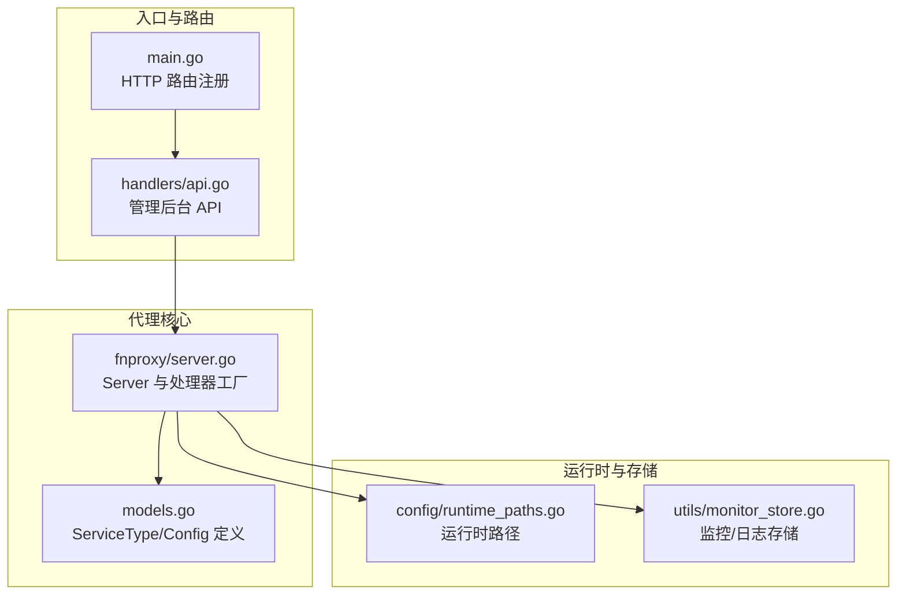
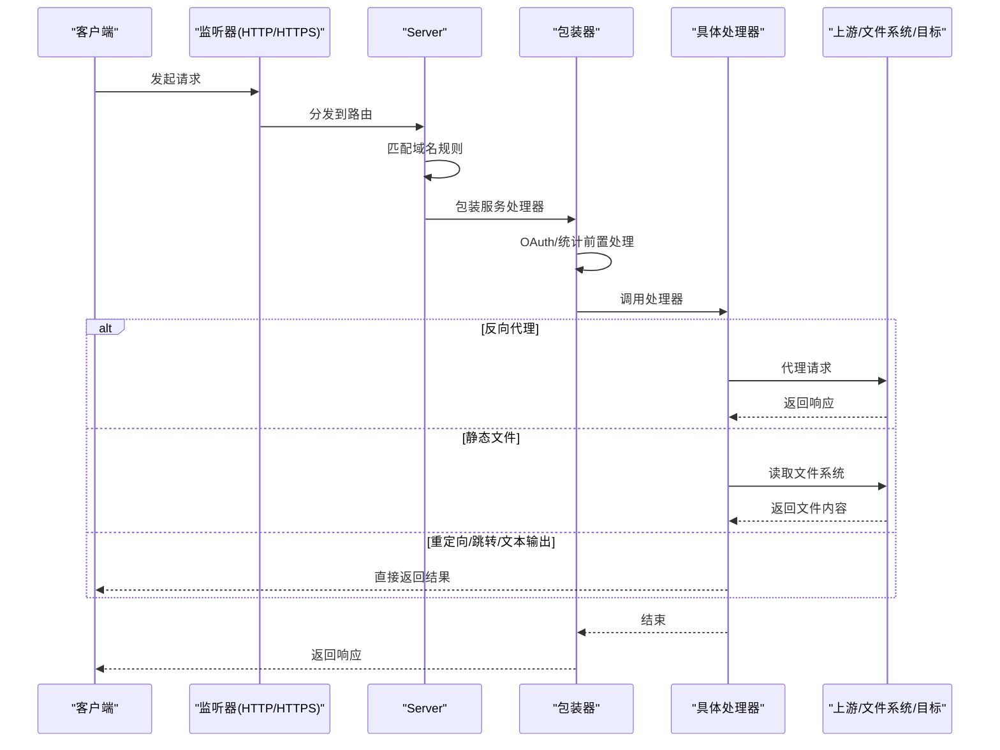
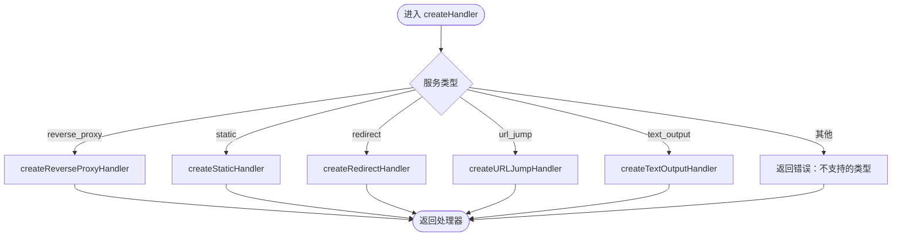
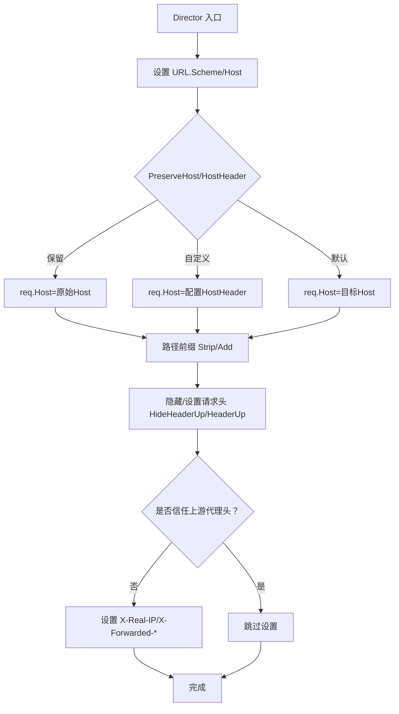
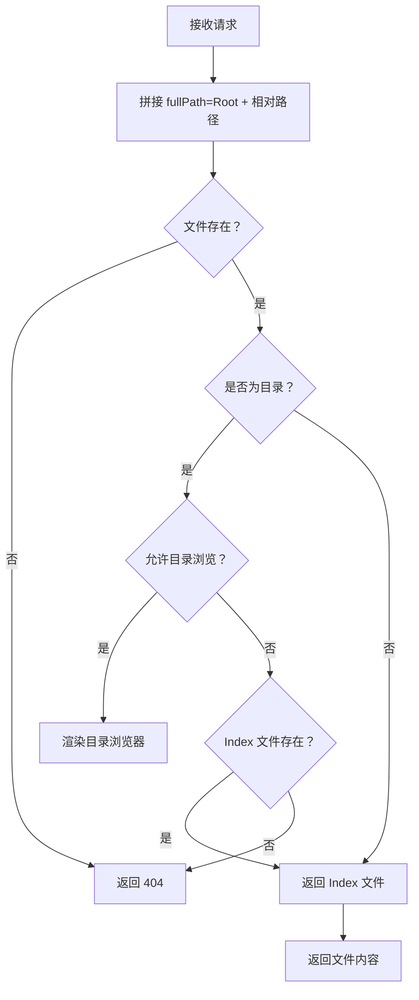
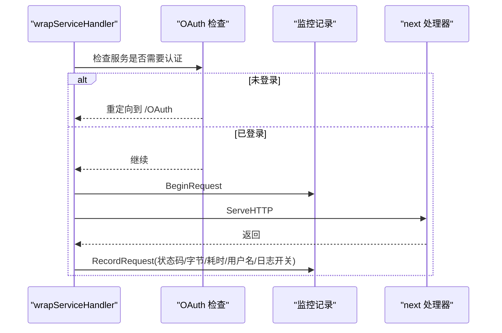
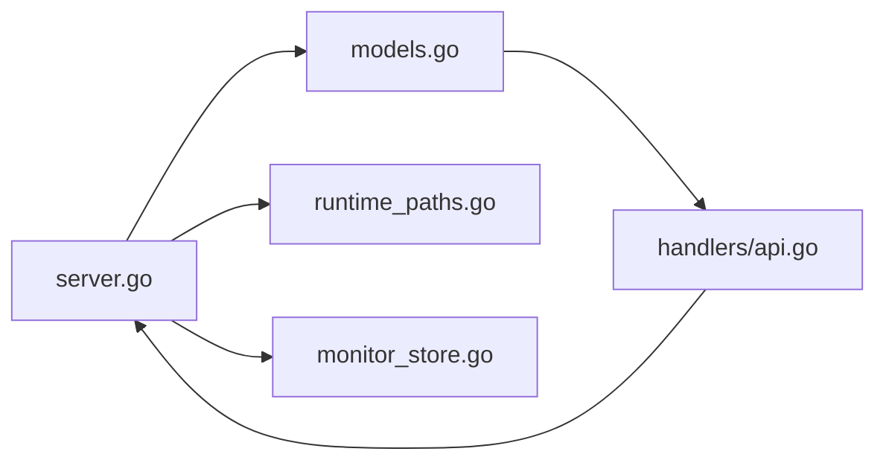

# 服务处理器

<cite>
**本文引用的文件**
- [main.go](file://src/main.go)
- [server.go](file://src/fnproxy/server.go)
- [models.go](file://src/models/models.go)
- [api.go](file://src/handlers/api.go)
- [runtime_paths.go](file://src/config/runtime_paths.go)
- [monitor_store.go](file://src/utils/monitor_store.go)
- [README.md](file://README.md)
</cite>

## 目录
1. [简介](#简介)
2. [项目结构](#项目结构)
3. [核心组件](#核心组件)
4. [架构总览](#架构总览)
5. [详细组件分析](#详细组件分析)
6. [依赖分析](#依赖分析)
7. [性能考虑](#性能考虑)
8. [故障排查指南](#故障排查指南)
9. [结论](#结论)
10. [附录](#附录)

## 简介
本文件面向代理服务器的服务处理器系统，系统性阐述不同服务类型的处理器创建机制、工厂模式实现、服务类型识别与实例化流程、以及各处理器的处理细节。重点覆盖：
- 反向代理处理器的 Director 函数、请求头处理、路径前缀操作与响应头修改机制
- 静态文件处理器的文件系统访问、目录浏览与安全限制
- 重定向、URL 跳转与文本输出处理器的配置与行为
- 处理器链式调用与错误处理策略
- 性能优化建议与最佳实践

## 项目结构
- 服务处理器位于代理子系统中，由监听器驱动，按服务规则动态构建路由与处理器链
- 管理后台通过 API 路由对监听器与服务进行增删改查与热重载
- 配置与运行时路径、监控存储等基础设施支撑服务运行与可观测性

图表来源
- [main.go:112-430](file://src/main.go#L112-L430)
- [server.go:442-458](file://src/fnproxy/server.go#L442-L458)
- [models.go:82-163](file://src/models/models.go#L82-L163)
- [runtime_paths.go:31-72](file://src/config/runtime_paths.go#L31-L72)
- [monitor_store.go:30-54](file://src/utils/monitor_store.go#L30-L54)

章节来源
- [main.go:112-430](file://src/main.go#L112-L430)
- [server.go:270-425](file://src/fnproxy/server.go#L270-L425)
- [models.go:82-163](file://src/models/models.go#L82-L163)

## 核心组件
- 服务类型枚举与配置模型：定义五种服务类型及各自配置字段
- 处理器工厂方法：根据服务类型创建对应处理器
- 包装器：为每个服务处理器注入 OAuth 认证与访问统计
- 监听器与路由：按监听器维度构建路由表，动态热更新

章节来源
- [models.go:82-163](file://src/models/models.go#L82-L163)
- [server.go:442-458](file://src/fnproxy/server.go#L442-L458)
- [server.go:1119-1140](file://src/fnproxy/server.go#L1119-L1140)

## 架构总览
代理服务器采用“监听器-服务-处理器”的三层结构：
- 监听器：按端口与协议启动 HTTP/HTTPS 服务器
- 服务：按域名规则匹配请求，选择对应处理器
- 处理器：具体业务逻辑（反向代理/静态/重定向/跳转/文本输出）

图表来源
- [server.go:298-324](file://src/fnproxy/server.go#L298-L324)
- [server.go:1119-1140](file://src/fnproxy/server.go#L1119-L1140)
- [server.go:460-584](file://src/fnproxy/server.go#L460-L584)
- [server.go:804-852](file://src/fnproxy/server.go#L804-L852)
- [server.go:1043-1089](file://src/fnproxy/server.go#L1043-L1089)
- [server.go:1091-1117](file://src/fnproxy/server.go#L1091-L1117)

## 详细组件分析

### 处理器工厂模式与服务类型识别
- 工厂方法 createHandler 根据服务类型分支创建处理器
- 支持五种服务类型：反向代理、静态文件、重定向、URL 跳转、文本输出
- 类型识别来自 ServiceType 枚举，配置来自 ServiceConfig.Config

图表来源
- [server.go:442-458](file://src/fnproxy/server.go#L442-L458)
- [models.go:82-91](file://src/models/models.go#L82-L91)

章节来源
- [server.go:442-458](file://src/fnproxy/server.go#L442-L458)
- [models.go:82-91](file://src/models/models.go#L82-L91)

### 反向代理处理器
- 配置解析：从 ServiceConfig.Config 解析 ReverseProxyConfig
- 目标地址规范化：支持 ws/wss 自动转换为 http/https
- Director 函数负责：
  - 设置请求 Scheme/Host
  - Host 头策略：保留原始、自定义或使用目标 Host
  - 路径前缀处理：Strip/Add Path Prefix
  - 请求头处理：HideHeaderUp、HeaderUp（含变量替换 {host}/{remote}/{scheme}）
  - 真实IP转发头：X-Real-IP、X-Forwarded-For、X-Forwarded-Host、X-Forwarded-Proto（受 TrustProxyHeaders 控制）
- 响应处理：ModifyResponse 修改 HideHeaderDown、HeaderDown
- 错误处理：ErrorHandler 记录审计日志并返回 502
- WebSocket：特殊升级处理，透传除 hop-by-hop 外的必要头

图表来源
- [server.go:482-539](file://src/fnproxy/server.go#L482-L539)
- [server.go:542-556](file://src/fnproxy/server.go#L542-L556)
- [server.go:557-572](file://src/fnproxy/server.go#L557-L572)
- [server.go:601-628](file://src/fnproxy/server.go#L601-L628)
- [server.go:783-802](file://src/fnproxy/server.go#L783-L802)

章节来源
- [server.go:460-584](file://src/fnproxy/server.go#L460-L584)
- [server.go:601-628](file://src/fnproxy/server.go#L601-L628)
- [server.go:783-802](file://src/fnproxy/server.go#L783-L802)

### 静态文件处理器
- 配置解析：从 ServiceConfig.Config 解析 StaticConfig
- 文件系统访问：相对路径拼接到 Root，使用 os.Stat/os.Open
- 目录浏览：当目录存在且允许浏览时，渲染 HTML 目录列表
- 默认索引：当目录无浏览权限时，尝试 Index 文件
- 安全限制：严格基于 Root 根目录，防止路径穿越；目录遍历排序与 HTML 转义
- 文件服务：使用 http.ServeContent 提供静态文件

图表来源
- [server.go:804-852](file://src/fnproxy/server.go#L804-L852)
- [server.go:862-1007](file://src/fnproxy/server.go#L862-L1007)
- [server.go:1026-1041](file://src/fnproxy/server.go#L1026-L1041)

章节来源
- [server.go:804-852](file://src/fnproxy/server.go#L804-L852)
- [server.go:862-1007](file://src/fnproxy/server.go#L862-L1007)
- [server.go:1026-1041](file://src/fnproxy/server.go#L1026-L1041)

### 重定向处理器
- 配置解析：RedirectConfig
- 行为：使用 302 临时重定向到配置的 to 地址

章节来源
- [server.go:1043-1063](file://src/fnproxy/server.go#L1043-L1063)
- [models.go:141-146](file://src/models/models.go#L141-L146)

### URL 跳转处理器
- 配置解析：URLJumpConfig
- 行为：将目标 URL 与请求路径组合，支持 PreservePath 保留原路径
- 使用 302 临时重定向

章节来源
- [server.go:1065-1089](file://src/fnproxy/server.go#L1065-L1089)
- [models.go:148-154](file://src/models/models.go#L148-L154)

### 文本输出处理器
- 配置解析：TextOutputConfig
- 行为：直接返回配置的 Body，设置 Content-Type 与状态码（默认 200）

章节来源
- [server.go:1091-1117](file://src/fnproxy/server.go#L1091-L1117)
- [models.go:156-163](file://src/models/models.go#L156-L163)

### 处理器链式调用与包装器
- wrapServiceHandler 将服务处理器包裹，实现：
  - OAuth 认证：当服务启用 oauth 或 require_auth 且未登录时，重定向到 /OAuth
  - 访问统计：记录请求耗时、字节数、状态码、用户名与是否记录访问日志
- responseRecorder 记录响应状态码与输出字节

图表来源
- [server.go:1119-1140](file://src/fnproxy/server.go#L1119-L1140)
- [server.go:1323-1329](file://src/fnproxy/server.go#L1323-L1329)

章节来源
- [server.go:1119-1140](file://src/fnproxy/server.go#L1119-L1140)
- [server.go:1323-1329](file://src/fnproxy/server.go#L1323-L1329)

### 监听器与路由匹配
- buildListenerRoutes 为监听器构建服务路由表
- buildHTTPServer 构建监听器 HTTP 服务器，处理 OAuth 登录页与动态路由
- matchServiceRoute 支持精确域名与通配符匹配（*），默认兜底规则

章节来源
- [server.go:270-291](file://src/fnproxy/server.go#L270-L291)
- [server.go:293-324](file://src/fnproxy/server.go#L293-L324)
- [server.go:1277-1303](file://src/fnproxy/server.go#L1277-L1303)
- [server.go:1305-1321](file://src/fnproxy/server.go#L1305-L1321)

## 依赖分析
- 服务处理器依赖配置模型与运行时路径
- 监控与日志存储提供访问日志与网络样本持久化
- 管理后台 API 负责服务与监听器的增删改查与热重载

图表来源
- [server.go:442-458](file://src/fnproxy/server.go#L442-L458)
- [models.go:82-163](file://src/models/models.go#L82-L163)
- [runtime_paths.go:31-72](file://src/config/runtime_paths.go#L31-L72)
- [monitor_store.go:30-54](file://src/utils/monitor_store.go#L30-L54)
- [api.go:156-200](file://src/handlers/api.go#L156-L200)

章节来源
- [server.go:442-458](file://src/fnproxy/server.go#L442-L458)
- [models.go:82-163](file://src/models/models.go#L82-L163)
- [runtime_paths.go:31-72](file://src/config/runtime_paths.go#L31-L72)
- [monitor_store.go:30-54](file://src/utils/monitor_store.go#L30-L54)
- [api.go:156-200](file://src/handlers/api.go#L156-L200)

## 性能考虑
- 连接复用：全局共享 Transport，启用 Keep-Alive、空闲连接池与超时控制
- 反向代理：合理设置超时、缓冲与上游头处理，避免阻塞
- 静态文件：使用 http.ServeContent，减少内存占用；目录浏览仅在需要时渲染
- 监控与日志：访问日志与网络样本采用键空间有序存储，定期裁剪，避免无限增长
- 热重载：监听器热更新不中断，仅替换路由表与代理实例，降低停机风险

章节来源
- [server.go:142-161](file://src/fnproxy/server.go#L142-L161)
- [server.go:1026-1041](file://src/fnproxy/server.go#L1026-L1041)
- [monitor_store.go:56-75](file://src/utils/monitor_store.go#L56-L75)
- [monitor_store.go:167-186](file://src/utils/monitor_store.go#L167-L186)

## 故障排查指南
- 反向代理错误：ErrorHandler 记录代理错误日志并返回 502，检查上游地址、证书与网络连通性
- OAuth 登录失败：检查登录表单解析、密钥解密、用户是否存在与密码正确性
- 静态文件 404：确认 Root 目录与相对路径拼接，确保未发生路径穿越
- 监控日志异常：确认监控存储初始化与裁剪逻辑，检查最大条数与保留天数配置

章节来源
- [server.go:557-572](file://src/fnproxy/server.go#L557-L572)
- [server.go:1178-1251](file://src/fnproxy/server.go#L1178-L1251)
- [server.go:819-826](file://src/fnproxy/server.go#L819-L826)
- [monitor_store.go:30-54](file://src/utils/monitor_store.go#L30-L54)

## 结论
本服务处理器系统通过清晰的工厂模式与包装器机制，实现了灵活、可扩展且高性能的代理能力。反向代理具备完善的头处理与路径前缀操作，静态文件处理器兼顾安全与易用，重定向与文本输出满足常见场景。配合热重载与可观测性，系统在生产环境中具备良好的稳定性与可维护性。

## 附录
- 启动参数与运行期文件位置参见项目说明
- 管理后台 API 支持服务与监听器的增删改查与热重载

章节来源
- [README.md:105-166](file://README.md#L105-L166)