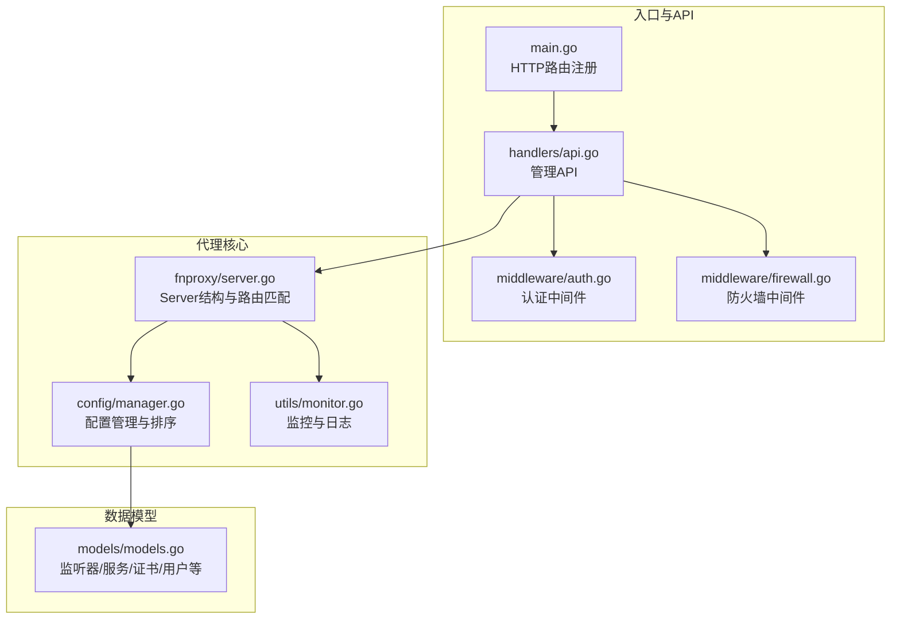
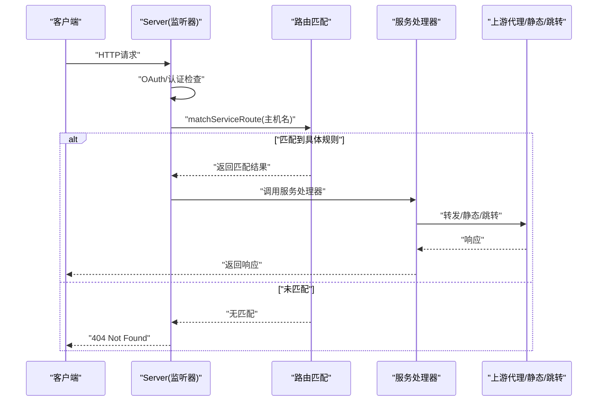
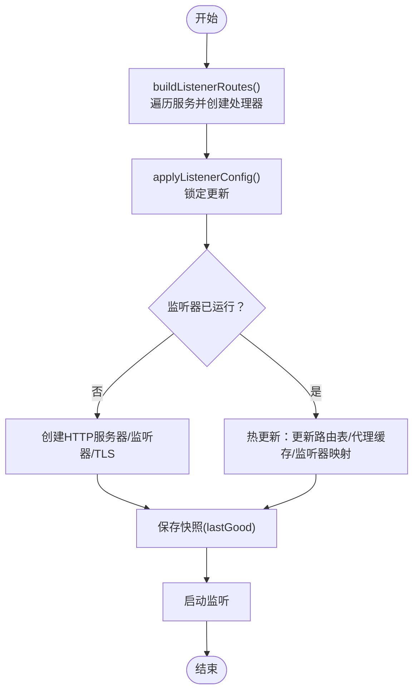
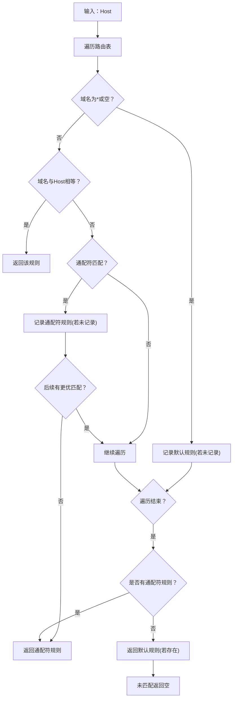
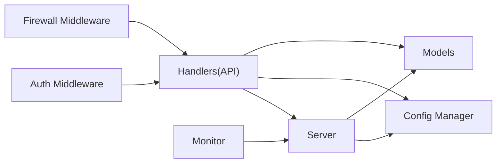

# 路由系统

<cite>
**本文引用的文件**
- [main.go](file://src/main.go)
- [server.go](file://src/fnproxy/server.go)
- [models.go](file://src/models/models.go)
- [manager.go](file://src/config/manager.go)
- [api.go](file://src/handlers/api.go)
- [auth.go](file://src/middleware/auth.go)
- [firewall.go](file://src/middleware/firewall.go)
- [monitor.go](file://src/utils/monitor.go)
- [system.go](file://src/utils/system.go)
</cite>

## 目录
1. [简介](#简介)
2. [项目结构](#项目结构)
3. [核心组件](#核心组件)
4. [架构总览](#架构总览)
5. [详细组件分析](#详细组件分析)
6. [依赖关系分析](#依赖关系分析)
7. [性能考量](#性能考量)
8. [故障排查指南](#故障排查指南)
9. [结论](#结论)
10. [附录](#附录)

## 简介
本文件面向代理服务器的动态路由系统，围绕以下目标展开：
- 路由表构建流程与服务路由匹配算法
- 动态更新机制与热重载策略
- 路由优先级排序、主机名匹配规则与路径匹配策略
- 路由缓存机制、内存管理优化与并发安全设计
- 路由快照功能、配置热重载时的路由更新与回滚机制
- 路由配置最佳实践、性能优化建议与调试方法
- 路由匹配算法实现与实际应用场景

## 项目结构
该系统以“监听器-服务”为核心模型，每个监听器维护一组服务规则，运行时通过动态路由表进行请求匹配与转发。核心模块包括：
- 代理服务器：负责监听端口、构建路由表、处理请求与转发
- 配置管理：负责持久化配置、服务排序与热更新
- 处理器与中间件：提供API、认证、防火墙等能力
- 监控与工具：记录访问日志、统计流量、系统状态

图表来源
- [main.go:112-431](file://src/main.go#L112-L431)
- [server.go:37-49](file://src/fnproxy/server.go#L37-L49)
- [manager.go:18-31](file://src/config/manager.go#L18-L31)
- [models.go:72-107](file://src/models/models.go#L72-L107)

章节来源
- [main.go:112-431](file://src/main.go#L112-L431)
- [server.go:37-49](file://src/fnproxy/server.go#L37-L49)
- [manager.go:18-31](file://src/config/manager.go#L18-L31)
- [models.go:72-107](file://src/models/models.go#L72-L107)

## 核心组件
- Server：代理服务器核心，维护监听器、路由表、处理器缓存与快照，提供启动、停止、重启与热重载能力
- 配置管理：负责监听器与服务的增删改查、排序与持久化，确保服务顺序与默认规则的规范化
- 路由匹配：基于主机名的精确匹配与通配符匹配，支持默认规则兜底
- 中间件：认证、防火墙、CORS、日志等横切能力
- 监控：记录访问日志、统计吞吐与活跃连接，支持快照导出

章节来源
- [server.go:37-49](file://src/fnproxy/server.go#L37-L49)
- [manager.go:18-31](file://src/config/manager.go#L18-L31)
- [models.go:72-107](file://src/models/models.go#L72-L107)

## 架构总览
代理服务器在每个监听器上构建动态路由表，请求到达时先进行OAuth与认证检查，随后按主机名匹配服务规则，匹配不到则返回404。热重载时，若监听器已运行则仅更新路由表与代理缓存，避免重启带来的中断；若监听器未运行则创建新服务器并启动。

图表来源
- [server.go:298-322](file://src/fnproxy/server.go#L298-L322)
- [server.go:1277-1303](file://src/fnproxy/server.go#L1277-L1303)

章节来源
- [server.go:298-322](file://src/fnproxy/server.go#L298-L322)
- [server.go:1277-1303](file://src/fnproxy/server.go#L1277-L1303)

## 详细组件分析

### 路由表构建与动态更新
- 路由表结构：按监听器ID分组，每组包含若干serviceRoute，每个包含服务配置与对应的处理器
- 构建流程：遍历监听器下的服务，创建对应处理器，包装认证与统计逻辑，最终形成路由表
- 热更新策略：若监听器已运行，仅更新路由表与代理缓存，并清理旧代理；若未运行则创建新服务器并启动
- 回滚机制：应用新配置失败时，尝试恢复上次正确的快照，保证可用性

图表来源
- [server.go:270-291](file://src/fnproxy/server.go#L270-L291)
- [server.go:370-425](file://src/fnproxy/server.go#L370-L425)
- [server.go:349-368](file://src/fnproxy/server.go#L349-L368)

章节来源
- [server.go:270-291](file://src/fnproxy/server.go#L270-L291)
- [server.go:370-425](file://src/fnproxy/server.go#L370-L425)
- [server.go:349-368](file://src/fnproxy/server.go#L349-L368)

### 路由匹配算法与优先级
- 主机名匹配：
  - 精确匹配：域名与请求Host完全一致
  - 通配符匹配：支持单层通配符，将模式转换为正则表达式进行匹配
  - 默认规则：空域或“*”作为兜底规则，优先级最低
- 服务排序：
  - 配置层：同端口下按SortOrder升序，0值或未设置的按创建时间升序
  - 规范化：启动时对每个端口的服务进行排序并填充SortOrder
- 匹配顺序：先精确匹配，再通配符匹配，最后默认规则

图表来源
- [server.go:1277-1303](file://src/fnproxy/server.go#L1277-L1303)
- [server.go:1305-1321](file://src/fnproxy/server.go#L1305-L1321)
- [manager.go:158-210](file://src/config/manager.go#L158-L210)

章节来源
- [server.go:1277-1303](file://src/fnproxy/server.go#L1277-L1303)
- [server.go:1305-1321](file://src/fnproxy/server.go#L1305-L1321)
- [manager.go:158-210](file://src/config/manager.go#L158-L210)

### 并发安全与内存管理
- 并发控制：使用读写锁保护路由表、监听器映射与代理缓存，读多写少场景下提升并发性能
- 内存管理：
  - 全局共享HTTP Transport，启用连接复用，限制空闲连接数与超时，降低连接开销
  - 代理缓存：按服务ID缓存ReverseProxy实例，避免重复创建
  - 快照缓存：lastGood记录上次成功配置，用于失败回滚
- 生命周期：Stop/Restart时清理路由表、监听器映射与代理缓存，释放资源

章节来源
- [server.go:37-49](file://src/fnproxy/server.go#L37-L49)
- [server.go:142-161](file://src/fnproxy/server.go#L142-L161)
- [server.go:201-218](file://src/fnproxy/server.go#L201-L218)

### 路由快照与热重载回滚
- 快照：每次成功应用配置后，保存当前监听器配置与服务列表到lastGood
- 热重载：监听器已运行时仅更新路由表与代理缓存，避免重启
- 回滚：应用新配置失败时，尝试恢复lastGood快照，若失败则返回错误信息

章节来源
- [server.go:393-396](file://src/fnproxy/server.go#L393-L396)
- [server.go:404-410](file://src/fnproxy/server.go#L404-L410)
- [server.go:349-368](file://src/fnproxy/server.go#L349-L368)

### OAuth与认证集成
- OAuth登录页与登录处理：在特定路径渲染登录页、解析表单、解密负载、校验用户并发放令牌
- 服务级OAuth：服务配置中可开启oauth或RequireAuth，未认证用户会被重定向至OAuth登录页
- 认证中间件：支持Authorization Bearer与内部Auth头，结合全局默认认证策略

章节来源
- [server.go:1142-1251](file://src/fnproxy/server.go#L1142-L1251)
- [server.go:1323-1329](file://src/fnproxy/server.go#L1323-L1329)
- [auth.go:14-55](file://src/middleware/auth.go#L14-L55)

### 防火墙与访问控制
- 防火墙中间件：根据配置的规则集，按优先级匹配IP/CIDR或国家代码，支持默认拒绝策略
- 客户端IP解析：优先X-Forwarded-For，其次X-Real-IP，最后RemoteAddr

章节来源
- [firewall.go:13-50](file://src/middleware/firewall.go#L13-L50)
- [firewall.go:52-76](file://src/middleware/firewall.go#L52-L76)

### 监控与日志
- 请求统计：记录请求计数、活跃连接、进出字节、最近窗口内的速率，支持按监听器与服务维度查询
- 访问日志：按服务粒度记录请求详情，支持过滤与限制数量
- 网络历史：聚合24小时每10分钟平均速率，便于趋势分析

章节来源
- [monitor.go:119-189](file://src/utils/monitor.go#L119-L189)
- [monitor.go:253-321](file://src/utils/monitor.go#L253-L321)
- [monitor.go:323-355](file://src/utils/monitor.go#L323-L355)

### 数据模型与配置
- 监听器：端口、协议、启用状态
- 服务：类型、域名、排序、认证要求、配置对象
- 服务类型：反向代理、静态文件、重定向、URL跳转、文本输出
- 配置管理：提供增删改查、排序、持久化与默认值规范化

章节来源
- [models.go:72-107](file://src/models/models.go#L72-L107)
- [models.go:109-163](file://src/models/models.go#L109-L163)
- [manager.go:227-341](file://src/config/manager.go#L227-L341)

## 依赖关系分析
- Server依赖配置管理器获取监听器与服务列表，依赖模型定义服务类型与配置结构
- API处理器通过Server暴露管理接口，支持监听器与服务的增删改查、热重载与重启
- 中间件在API层叠加认证、防火墙、CORS与日志能力
- 监控模块为Server与API提供统计与日志能力

图表来源
- [server.go:37-49](file://src/fnproxy/server.go#L37-L49)
- [manager.go:18-31](file://src/config/manager.go#L18-L31)
- [models.go:72-107](file://src/models/models.go#L72-L107)
- [api.go:139-375](file://src/handlers/api.go#L139-L375)

章节来源
- [server.go:37-49](file://src/fnproxy/server.go#L37-L49)
- [manager.go:18-31](file://src/config/manager.go#L18-L31)
- [models.go:72-107](file://src/models/models.go#L72-L107)
- [api.go:139-375](file://src/handlers/api.go#L139-L375)

## 性能考量
- 连接复用：全局共享Transport，限制空闲连接数与超时，减少TCP握手与连接建立开销
- 路由匹配：O(n)线性扫描，n为同一监听器下的服务数量；可通过减少服务数量与合理排序优化
- 代理缓存：按服务ID缓存ReverseProxy，避免重复创建与Director配置成本
- 监控开销：定期采样网络IO并聚合速率，避免高频写入；日志写入异步化，限制条数
- TLS：监听器按协议选择是否启用TLS，证书由证书管理器提供

章节来源
- [server.go:142-161](file://src/fnproxy/server.go#L142-L161)
- [server.go:270-291](file://src/fnproxy/server.go#L270-L291)
- [monitor.go:67-117](file://src/utils/monitor.go#L67-L117)

## 故障排查指南
- 启动失败：检查端口占用与协议合法性；查看启动错误信息与回滚日志
- 热重载失败：确认服务配置有效性；查看回滚是否成功；必要时恢复lastGood快照
- 认证问题：检查Authorization头格式、令牌有效性与全局默认认证设置
- 防火墙拦截：核对规则优先级与匹配条件，确认默认动作
- 监控异常：检查日志条数上限、存储路径与采样间隔

章节来源
- [server.go:370-425](file://src/fnproxy/server.go#L370-L425)
- [auth.go:14-55](file://src/middleware/auth.go#L14-L55)
- [firewall.go:13-50](file://src/middleware/firewall.go#L13-L50)
- [monitor.go:357-380](file://src/utils/monitor.go#L357-L380)

## 结论
该动态路由系统以“监听器-服务”模型为核心，通过严格的配置规范化、快照与回滚机制、并发安全设计与连接复用策略，实现了高可用、可扩展的代理路由能力。路由匹配算法简洁高效，支持精确与通配符匹配，并通过排序与默认规则保障稳定性。配合认证、防火墙与监控体系，满足生产环境的运维与安全需求。

## 附录

### 路由匹配算法实现要点
- 主机名标准化：去除端口并转小写
- 精确匹配优先于通配符匹配
- 通配符模式转换为正则表达式
- 默认规则作为兜底，优先级最低

章节来源
- [server.go:1270-1275](file://src/fnproxy/server.go#L1270-L1275)
- [server.go:1277-1303](file://src/fnproxy/server.go#L1277-L1303)
- [server.go:1305-1321](file://src/fnproxy/server.go#L1305-L1321)

### 实际应用场景
- 多域名站点：通过不同域名指向不同后端，支持通配符覆盖
- 静态资源：提供静态文件服务与目录浏览
- 重定向与跳转：快速实现URL跳转与临时/永久重定向
- 文本输出：用于健康检查或简单响应
- WebSocket代理：支持升级后的双向消息转发

章节来源
- [server.go:804-852](file://src/fnproxy/server.go#L804-L852)
- [server.go:1043-1063](file://src/fnproxy/server.go#L1043-L1063)
- [server.go:1065-1089](file://src/fnproxy/server.go#L1065-L1089)
- [server.go:1091-1117](file://src/fnproxy/server.go#L1091-L1117)
- [server.go:639-781](file://src/fnproxy/server.go#L639-L781)