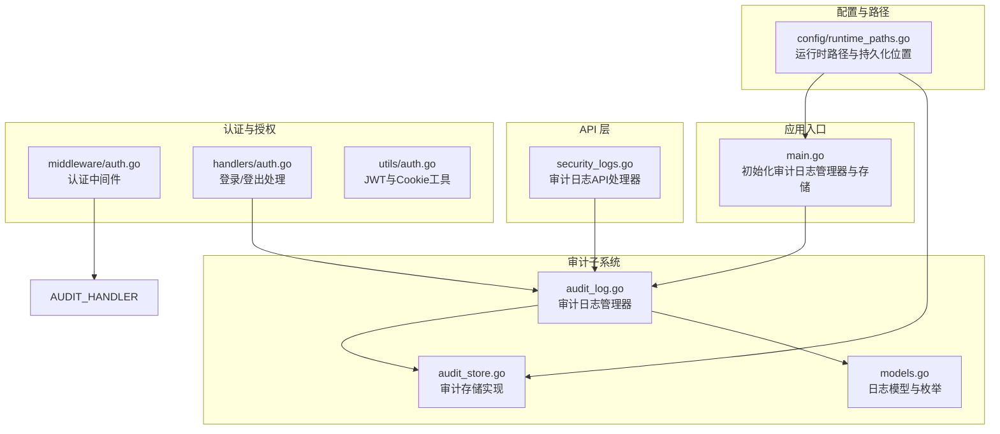
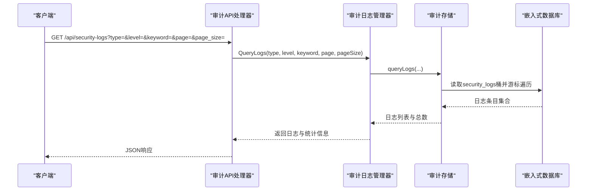
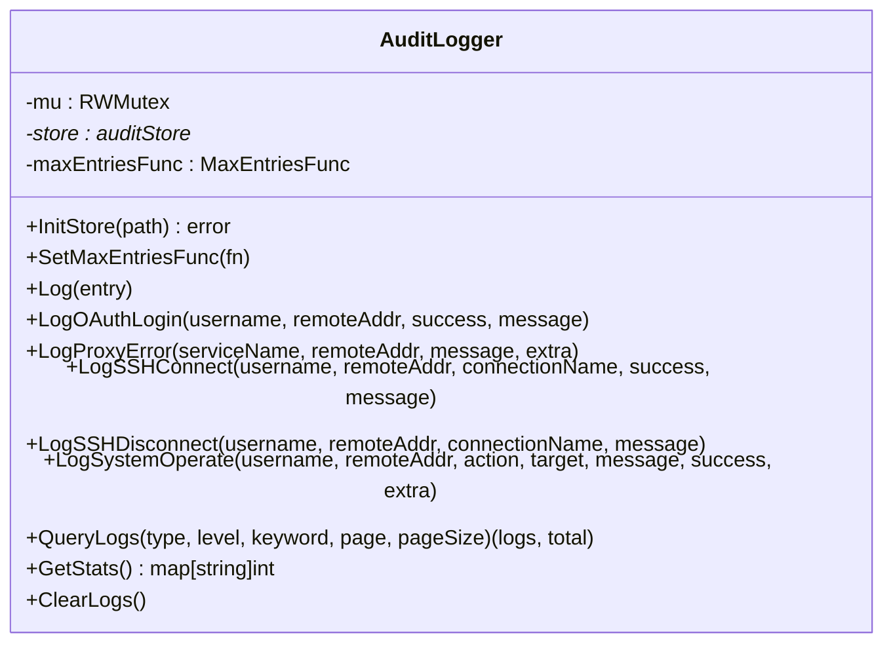
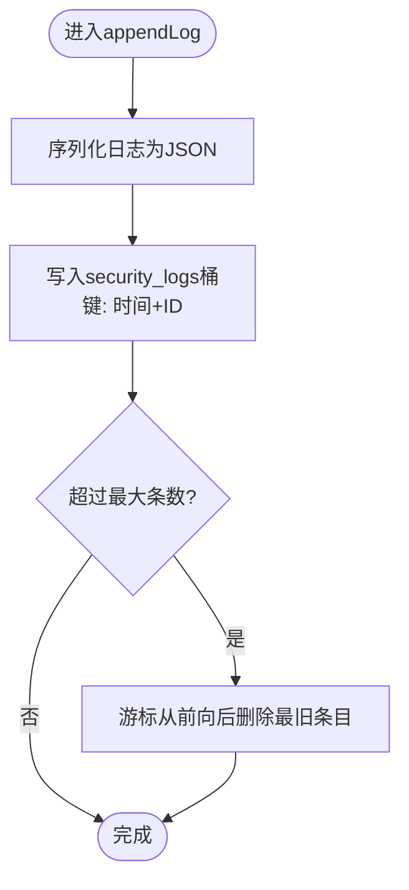
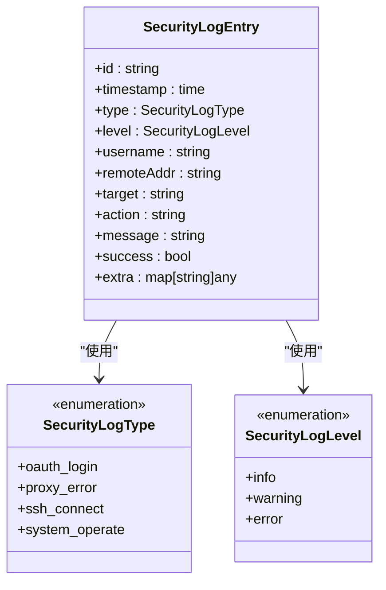
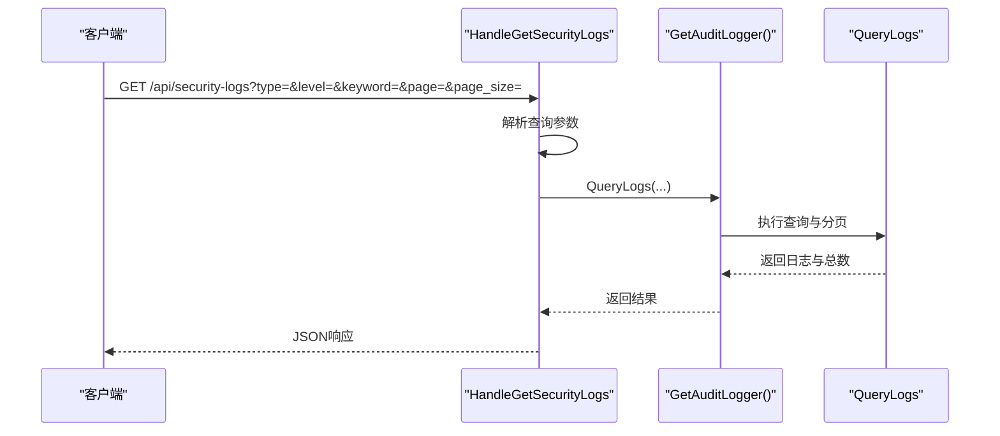
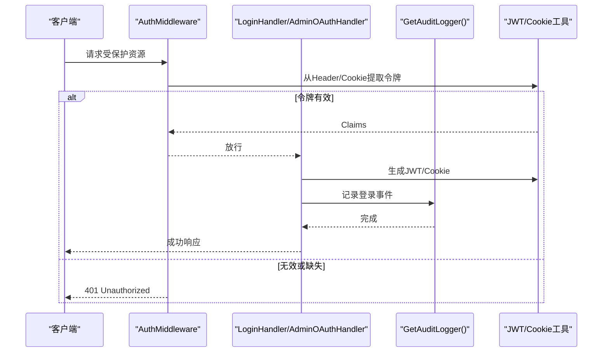
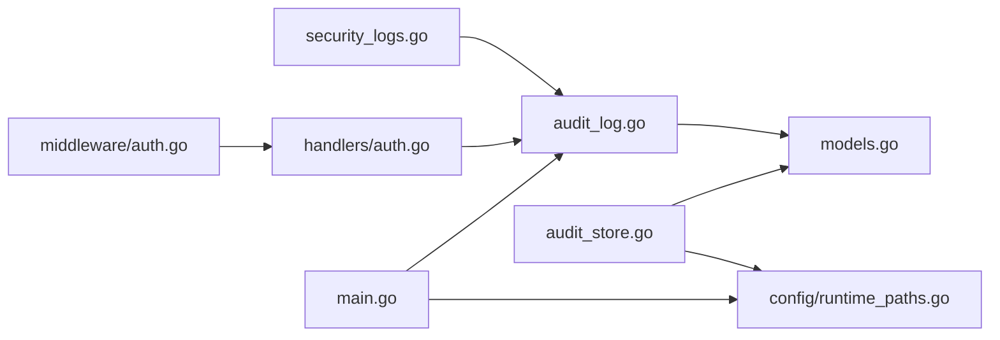

# 安全审计系统

<cite>
**本文引用的文件**
- [audit_log.go](file://src/security/audit_log.go)
- [audit_store.go](file://src/security/audit_store.go)
- [security_logs.go](file://src/handlers/security_logs.go)
- [models.go](file://src/models/models.go)
- [auth.go](file://src/middleware/auth.go)
- [main.go](file://src/main.go)
- [runtime_paths.go](file://src/config/runtime_paths.go)
- [auth_handler.go](file://src/handlers/auth.go)
- [auth_utils.go](file://src/utils/auth.go)
</cite>

## 目录
1. [简介](#简介)
2. [项目结构](#项目结构)
3. [核心组件](#核心组件)
4. [架构总览](#架构总览)
5. [详细组件分析](#详细组件分析)
6. [依赖关系分析](#依赖关系分析)
7. [性能考量](#性能考量)
8. [故障排查指南](#故障排查指南)
9. [结论](#结论)
10. [附录](#附录)

## 简介
本文件面向 Caddy Panel 的安全审计系统，系统性阐述审计日志的设计架构、存储机制、查询接口与持久化策略，并结合认证与授权流程，说明审计数据在访问控制、隐私保护与合规方面的设计要点。同时提供审计日志 API 的接口说明、查询参数与返回格式，以及与认证、授权系统的集成方式与数据流向。

## 项目结构
安全审计系统主要由以下模块组成：
- 审计日志管理器：负责日志记录、查询、统计与清理
- 审计存储层：基于嵌入式数据库实现高性能、低延迟的日志存储
- API 层：对外暴露审计日志查询、统计与清空接口
- 中间件与认证：在认证与授权流程中触发审计事件
- 配置与路径：运行时路径与持久化位置管理

图表来源
- [main.go:96-103](file://src/main.go#L96-L103)
- [audit_log.go:15-21](file://src/security/audit_log.go#L15-L21)
- [audit_store.go:22-24](file://src/security/audit_store.go#L22-L24)
- [models.go:312-344](file://src/models/models.go#L312-L344)
- [security_logs.go:10-40](file://src/handlers/security_logs.go#L10-L40)
- [auth.go:14-55](file://src/middleware/auth.go#L14-L55)
- [auth_handler.go:37-76](file://src/handlers/auth.go#L37-L76)
- [auth_utils.go:24-53](file://src/utils/auth.go#L24-L53)
- [runtime_paths.go:101-103](file://src/config/runtime_paths.go#L101-L103)

章节来源
- [main.go:96-103](file://src/main.go#L96-L103)
- [runtime_paths.go:101-103](file://src/config/runtime_paths.go#L101-L103)

## 核心组件
- 审计日志管理器：提供日志记录、查询、统计与清空能力，支持并发安全与最大条数限制回调
- 审计存储层：基于嵌入式数据库实现键值存储，使用复合键保证时间序与唯一性
- 审计日志模型：定义日志类型、级别、字段与序列化结构
- 审计日志 API：提供分页查询、关键词过滤、按类型/级别的筛选与统计接口
- 认证与授权集成：在登录、登出、OAuth 登录等关键路径记录审计事件

章节来源
- [audit_log.go:15-21](file://src/security/audit_log.go#L15-L21)
- [audit_store.go:22-24](file://src/security/audit_store.go#L22-L24)
- [models.go:312-344](file://src/models/models.go#L312-L344)
- [security_logs.go:10-40](file://src/handlers/security_logs.go#L10-L40)

## 架构总览
审计系统采用“管理器 + 存储”的分层设计，管理器负责业务逻辑与并发控制，存储层负责数据持久化与查询优化。API 层通过管理器暴露审计能力，认证与授权中间件在关键路径触发审计事件。

图表来源
- [security_logs.go:10-40](file://src/handlers/security_logs.go#L10-L40)
- [audit_log.go:168-183](file://src/security/audit_log.go#L168-L183)
- [audit_store.go:69-129](file://src/security/audit_store.go#L69-L129)

## 详细组件分析

### 审计日志管理器（AuditLogger）
- 单例模式：确保全局唯一实例，避免重复初始化
- 并发安全：读写锁保护存储指针与最大条数回调
- 日志记录：自动补全 ID 与时间戳，调用存储层追加并裁剪超限
- 专用记录方法：OAuth 登录、代理错误、SSH 连接/断开、系统操作
- 查询与统计：支持类型/级别/关键词过滤、分页、统计各类型数量
- 清空：重建桶以清空历史

图表来源
- [audit_log.go:15-21](file://src/security/audit_log.go#L15-L21)
- [audit_log.go:62-80](file://src/security/audit_log.go#L62-L80)
- [audit_log.go:82-166](file://src/security/audit_log.go#L82-L166)
- [audit_log.go:168-194](file://src/security/audit_log.go#L168-L194)
- [audit_log.go:196-223](file://src/security/audit_log.go#L196-L223)

章节来源
- [audit_log.go:25-31](file://src/security/audit_log.go#L25-L31)
- [audit_log.go:33-51](file://src/security/audit_log.go#L33-L51)
- [audit_log.go:62-80](file://src/security/audit_log.go#L62-L80)
- [audit_log.go:82-166](file://src/security/audit_log.go#L82-L166)
- [audit_log.go:168-194](file://src/security/audit_log.go#L168-L194)
- [audit_log.go:196-223](file://src/security/audit_log.go#L196-L223)

### 审计存储层（auditStore）
- 数据库初始化：创建安全日志桶，确保目录存在
- 追加日志：JSON 序列化后以复合键写入，自动裁剪至最大条数
- 查询日志：游标反向遍历，支持类型/级别/关键词过滤与分页
- 统计：遍历桶统计各类别数量
- 清空：删除并重建桶
- 关键算法：复合键排序、游标遍历、裁剪策略

图表来源
- [audit_store.go:47-67](file://src/security/audit_store.go#L47-L67)
- [audit_store.go:202-221](file://src/security/audit_store.go#L202-L221)
- [audit_store.go:198-200](file://src/security/audit_store.go#L198-L200)

章节来源
- [audit_store.go:26-45](file://src/security/audit_store.go#L26-L45)
- [audit_store.go:47-67](file://src/security/audit_store.go#L47-L67)
- [audit_store.go:69-129](file://src/security/audit_store.go#L69-L129)
- [audit_store.go:131-162](file://src/security/audit_store.go#L131-L162)
- [audit_store.go:164-176](file://src/security/audit_store.go#L164-L176)
- [audit_store.go:178-196](file://src/security/audit_store.go#L178-L196)
- [audit_store.go:198-200](file://src/security/audit_store.go#L198-L200)
- [audit_store.go:202-221](file://src/security/audit_store.go#L202-L221)

### 审计日志模型与事件分类
- 日志类型：OAuth 登录、代理错误、SSH 连接、系统操作
- 日志级别：信息、警告、错误
- 字段：ID、时间戳、类型、级别、用户名、来源IP、目标、动作、消息、成功标志、额外信息
- 事件记录：管理器提供专用方法，自动设置级别与动作描述

图表来源
- [models.go:312-344](file://src/models/models.go#L312-L344)
- [models.go:315-320](file://src/models/models.go#L315-L320)
- [models.go:325-329](file://src/models/models.go#L325-L329)

章节来源
- [models.go:312-344](file://src/models/models.go#L312-L344)
- [audit_log.go:82-166](file://src/security/audit_log.go#L82-L166)

### 审计日志 API 接口
- 查询日志
  - 方法与路径：GET /api/security-logs
  - 查询参数：
    - type：日志类型（oauth_login/proxy_error/ssh_connect/system_operate）
    - level：日志级别（info/warning/error）
    - keyword：关键词（在用户名、来源IP、目标、动作、消息中模糊匹配）
    - page：页码（>0，默认1）
    - page_size：每页大小（>0 且<=200，默认50）
  - 返回格式：
    - logs：日志数组
    - total：总数
    - page/page_size：当前页与大小
- 获取统计
  - 方法与路径：GET /api/security-logs/stats
  - 返回格式：
    - total：总条数
    - by_type：按类型统计
- 清空日志
  - 方法与路径：DELETE /api/security-logs
  - 返回：成功

图表来源
- [security_logs.go:10-40](file://src/handlers/security_logs.go#L10-L40)
- [audit_log.go:168-183](file://src/security/audit_log.go#L168-L183)

章节来源
- [security_logs.go:10-40](file://src/handlers/security_logs.go#L10-L40)
- [security_logs.go:42-54](file://src/handlers/security_logs.go#L42-L54)
- [security_logs.go:56-64](file://src/handlers/security_logs.go#L56-L64)

### 与认证、授权系统的集成
- 认证中间件：在请求进入 API 前进行认证，失败时返回未授权
- OAuth 登录：在管理后台 OAuth 登录页面处理登录流程，成功/失败均记录审计事件
- 登录/登出：标准登录与登出流程中生成/清除令牌，记录相应审计事件
- 管理后台页面：页面访问中间件检查 Cookie/JWT，未登录重定向到登录页

图表来源
- [auth.go:14-55](file://src/middleware/auth.go#L14-L55)
- [auth_handler.go:37-76](file://src/handlers/auth.go#L37-L76)
- [auth_handler.go:124-198](file://src/handlers/auth.go#L124-L198)
- [auth_utils.go:24-53](file://src/utils/auth.go#L24-L53)

章节来源
- [auth.go:14-55](file://src/middleware/auth.go#L14-L55)
- [auth_handler.go:37-76](file://src/handlers/auth.go#L37-L76)
- [auth_handler.go:124-198](file://src/handlers/auth.go#L124-L198)
- [auth_utils.go:24-53](file://src/utils/auth.go#L24-L53)

## 依赖关系分析
- 审计日志管理器依赖模型定义与 UUID 库
- 审计存储层依赖嵌入式数据库与 JSON 编解码
- API 层依赖审计日志管理器
- 认证中间件与处理器依赖 JWT/Cookie 工具与配置管理器
- 运行时路径提供安全日志数据库文件路径

图表来源
- [audit_log.go:7-10](file://src/security/audit_log.go#L7-L10)
- [audit_store.go:10-12](file://src/security/audit_store.go#L10-L12)
- [security_logs.go:7](file://src/handlers/security_logs.go#L7)
- [auth_handler.go:15-19](file://src/handlers/auth.go#L15-L19)
- [auth.go:10-12](file://src/middleware/auth.go#L10-L12)
- [main.go:96-103](file://src/main.go#L96-L103)
- [runtime_paths.go:101-103](file://src/config/runtime_paths.go#L101-L103)

章节来源
- [audit_log.go:7-10](file://src/security/audit_log.go#L7-L10)
- [audit_store.go:10-12](file://src/security/audit_store.go#L10-L12)
- [security_logs.go:7](file://src/handlers/security_logs.go#L7)
- [auth_handler.go:15-19](file://src/handlers/auth.go#L15-L19)
- [auth.go:10-12](file://src/middleware/auth.go#L10-L12)
- [main.go:96-103](file://src/main.go#L96-L103)
- [runtime_paths.go:101-103](file://src/config/runtime_paths.go#L101-L103)

## 性能考量
- 存储选择：嵌入式数据库具备低延迟与高吞吐特性，适合高频审计日志写入
- 键设计：复合键以纳秒时间戳与 ID 组合，保证严格的时间序与唯一性
- 查询策略：游标反向遍历，先全量过滤再分页，避免全表扫描
- 裁剪策略：按最大条数阈值从最早开始删除，保持容量稳定
- 并发控制：读写锁分离，读多写少场景下提升吞吐

章节来源
- [audit_store.go:47-67](file://src/security/audit_store.go#L47-L67)
- [audit_store.go:69-129](file://src/security/audit_store.go#L69-L129)
- [audit_store.go:202-221](file://src/security/audit_store.go#L202-L221)
- [audit_log.go:168-183](file://src/security/audit_log.go#L168-L183)

## 故障排查指南
- 初始化失败
  - 症状：初始化安全日志存储失败
  - 排查：确认运行时目录可写、路径正确
  - 参考：入口初始化与路径解析
- 查询异常
  - 症状：查询返回空或错误
  - 排查：检查查询参数范围、数据库桶是否存在
  - 参考：查询实现与桶存在性检查
- 清空无效
  - 症状：清空后仍可见历史
  - 排查：确认清空接口被调用、桶重建成功
  - 参考：清空实现
- 认证相关审计未记录
  - 症状：登录/登出未见审计事件
  - 排查：确认认证中间件与处理器路径、审计调用链
  - 参考：认证中间件与登录处理器

章节来源
- [main.go:96-103](file://src/main.go#L96-L103)
- [runtime_paths.go:101-103](file://src/config/runtime_paths.go#L101-L103)
- [audit_store.go:69-129](file://src/security/audit_store.go#L69-L129)
- [audit_store.go:164-176](file://src/security/audit_store.go#L164-L176)
- [auth.go:14-55](file://src/middleware/auth.go#L14-L55)
- [auth_handler.go:37-76](file://src/handlers/auth.go#L37-L76)

## 结论
Caddy Panel 的安全审计系统以简洁高效的架构实现了对关键安全事件的完整记录与查询。通过嵌入式数据库与复合键设计，系统在保证高吞吐的同时维持了良好的查询性能与可维护性。配合认证与授权中间件，审计事件覆盖了登录、登出与关键系统操作，满足安全审计与合规需求。未来可在日志轮转、分级存储与告警集成方面进一步扩展。

## 附录

### 审计日志持久化策略与清理规则
- 持久化位置：运行时目录下的安全日志数据库文件
- 最大条数：通过回调函数动态配置，超出阈值从最早开始删除
- 清理方式：重建桶以清空历史

章节来源
- [runtime_paths.go:101-103](file://src/config/runtime_paths.go#L101-L103)
- [audit_store.go:202-221](file://src/security/audit_store.go#L202-L221)
- [audit_store.go:164-176](file://src/security/audit_store.go#L164-L176)

### 审计数据访问控制、隐私保护与合规
- 访问控制：审计 API 通过认证中间件保护，管理员角色访问
- 隐私保护：日志不包含敏感明文，必要时可限制字段或脱敏
- 合规性：支持清空与统计，便于审计与合规检查

章节来源
- [auth.go:75-91](file://src/middleware/auth.go#L75-L91)
- [security_logs.go:56-64](file://src/handlers/security_logs.go#L56-L64)