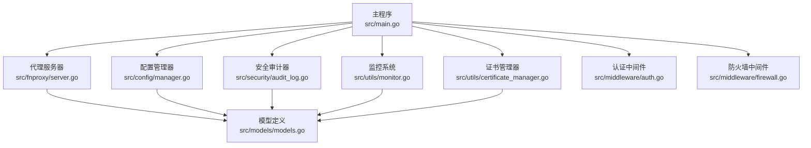
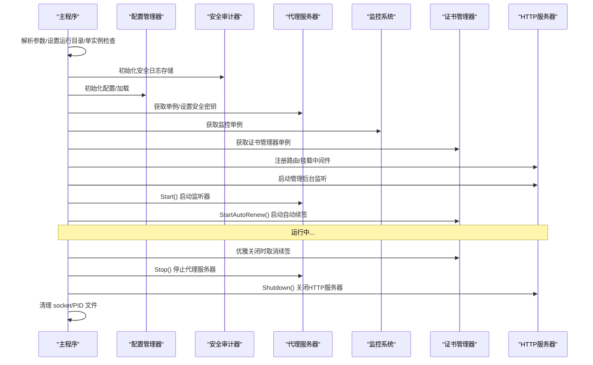
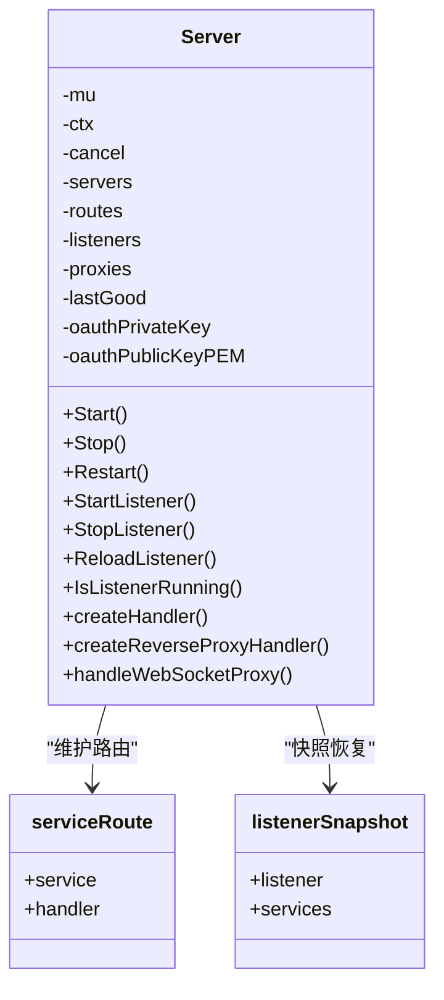
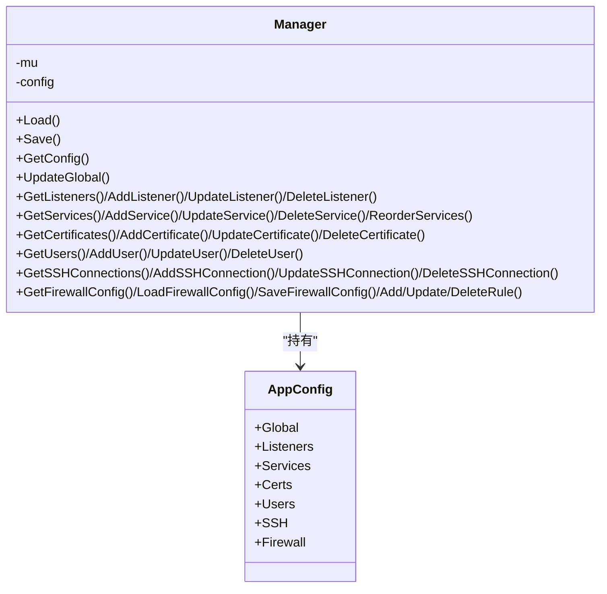
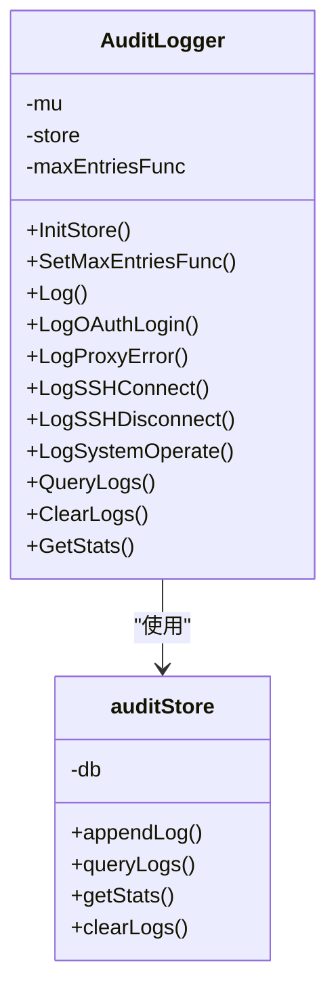
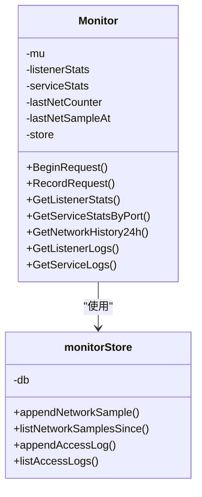
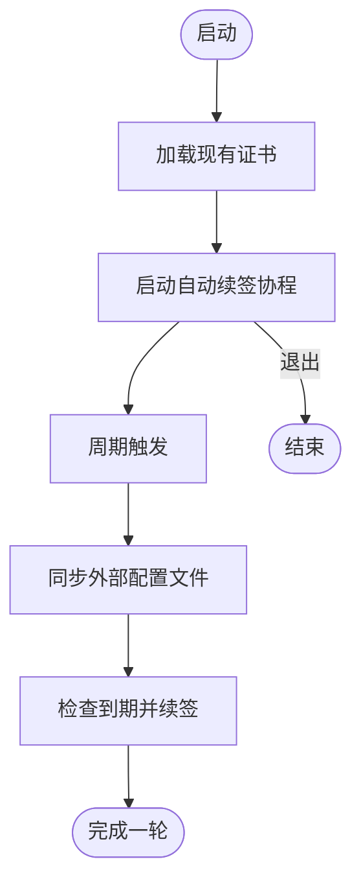
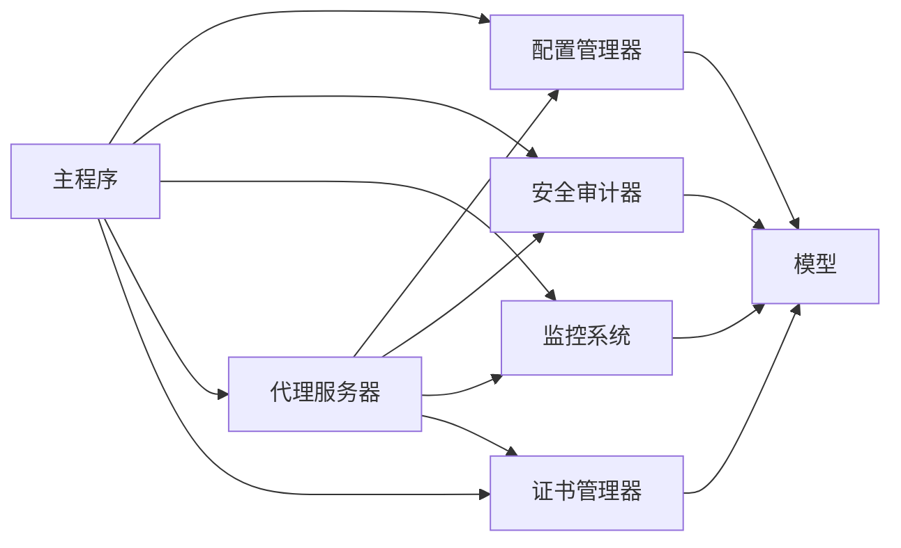

# 核心组件

<cite>
**本文引用的文件**
- [src/main.go](file://src/main.go)
- [src/fnproxy/server.go](file://src/fnproxy/server.go)
- [src/config/manager.go](file://src/config/manager.go)
- [src/security/audit_log.go](file://src/security/audit_log.go)
- [src/security/audit_store.go](file://src/security/audit_store.go)
- [src/utils/monitor.go](file://src/utils/monitor.go)
- [src/utils/monitor_store.go](file://src/utils/monitor_store.go)
- [src/utils/certificate_manager.go](file://src/utils/certificate_manager.go)
- [src/middleware/auth.go](file://src/middleware/auth.go)
- [src/middleware/firewall.go](file://src/middleware/firewall.go)
- [src/models/models.go](file://src/models/models.go)
- [src/process_control.go](file://src/process_control.go)
</cite>

## 目录
1. [简介](#简介)
2. [项目结构](#项目结构)
3. [核心组件](#核心组件)
4. [架构总览](#架构总览)
5. [详细组件分析](#详细组件分析)
6. [依赖关系分析](#依赖关系分析)
7. [性能考量](#性能考量)
8. [故障排查指南](#故障排查指南)
9. [结论](#结论)
10. [附录](#附录)

## 简介
本文件面向 Caddy Panel 的核心组件，系统性阐述代理服务器、配置管理器、安全审计器、监控系统等关键模块的设计思路、职责边界、接口定义、内部机制、组件协作与数据流、初始化顺序与生命周期管理、资源清理策略、扩展点与自定义接口，以及性能特性与优化策略。文档旨在帮助开发者与运维人员快速理解系统架构与实现细节，并提供实用的排障与优化建议。

## 项目结构
Caddy Panel 采用模块化设计，核心入口位于主程序，业务逻辑分布在各子包：
- 主入口负责进程控制、参数解析、组件初始化、HTTP 服务与代理服务启动、优雅关闭。
- 代理服务器负责动态监听、路由构建、反向代理、WebSocket 代理、证书加载与 TLS 握手。
- 配置管理器负责应用配置的持久化、加载、规范化与变更。
- 安全审计器负责安全日志的记录、查询与统计。
- 监控系统负责运行时统计、访问日志、网络采样与历史趋势。
- 中间件提供认证、管理员权限、CORS、日志与防火墙能力。
- 模型层定义配置、日志、统计数据等数据结构。

图表来源
- [src/main.go:24-516](file://src/main.go#L24-L516)
- [src/fnproxy/server.go:1-800](file://src/fnproxy/server.go#L1-L800)
- [src/config/manager.go:1-791](file://src/config/manager.go#L1-L791)
- [src/security/audit_log.go:1-224](file://src/security/audit_log.go#L1-L224)
- [src/utils/monitor.go:1-386](file://src/utils/monitor.go#L1-L386)
- [src/utils/certificate_manager.go:1-800](file://src/utils/certificate_manager.go#L1-L800)
- [src/middleware/auth.go:1-119](file://src/middleware/auth.go#L1-L119)
- [src/middleware/firewall.go:1-226](file://src/middleware/firewall.go#L1-L226)
- [src/models/models.go:1-394](file://src/models/models.go#L1-L394)

章节来源
- [src/main.go:24-516](file://src/main.go#L24-L516)

## 核心组件
- 代理服务器（fnproxy.Server）
  - 职责：动态监听端口、构建路由、反向代理、静态文件、重定向、文本输出、WebSocket 代理、TLS 证书加载、OAuth 密钥对生成与解密。
  - 接口：Start/Stop/Restart、StartListener/StopListener、ReloadListener、IsListenerRunning、GetServer 单例。
  - 内部机制：基于配置管理器的监听器与服务列表，构建 HTTP 服务器与路由表，热更新不中断。
- 配置管理器（config.Manager）
  - 职责：应用配置的加载/保存、全局参数规范化、监听器/服务/证书/用户/SSH/防火墙配置的增删改查与排序。
  - 接口：GetManager 单例、Load/Save、UpdateGlobal、GetListeners/AddListener/UpdateListener/DeleteListener、GetServices/GetService/AddService/UpdateService/DeleteService、ReorderServices、GetCertificates/AddCertificate/UpdateCertificate/DeleteCertificate、GetUsers/AddUser/UpdateUser/DeleteUser、GetSSHConnections/AddSSHConnection/UpdateSSHConnection/DeleteSSHConnection、GetFirewallConfig/LoadFirewallConfig/SaveFirewallConfig/AddFirewallRule/UpdateFirewallRule/DeleteFirewallRule。
- 安全审计器（security.AuditLogger）
  - 职责：安全日志记录、查询、统计、清空；支持 OAuth 登录、代理错误、SSH 连接、系统操作等类型。
  - 接口：GetAuditLogger 单例、InitStore/SetMaxEntriesFunc、Log/LogOAuthLogin/LogProxyError/LogSSHConnect/LogSSHDisconnect/LogSystemOperate、QueryLogs/ClearLogs/GetStats。
- 监控系统（utils.Monitor）
  - 职责：运行时统计（请求计数、活跃连接、字节总量/速率）、网络采样（每分钟采样）、访问日志持久化、历史趋势聚合。
  - 接口：GetMonitor 单例、BeginRequest/RecordRequest、GetListenerStats/GetListenerStatsByID、GetServiceStatsByPort/GetServiceStatsByID、GetNetworkHistory24h、GetListenerLogs/GetServiceLogs。
- 证书管理器（utils.CertificateManager）
  - 职责：证书导入、ACME 申请/续签、文件同步、HTTP-01 挑战响应、TLS 证书选择（按监听器与域名）、自动续签任务。
  - 接口：GetCertificateManager 单例、StartAutoRenew/RunMaintenanceNow、Reload、ServeHTTPChallenge、GetTLSCertificate/GetTLSCertificateForListener、ImportCertificate/IssueACMECertificate/RenewCertificate/DeleteCertificate。
- 中间件
  - 认证中间件：支持公开路径、Bearer Token、用户令牌登录，注入 Claims 到上下文。
  - 管理员中间件：校验角色为 admin。
  - CORS 中间件：设置跨域头与预检处理。
  - 日志中间件：简单请求耗时日志。
  - 防火墙中间件：基于 IP/CIDR/国家的规则匹配与默认动作。

章节来源
- [src/fnproxy/server.go:37-426](file://src/fnproxy/server.go#L37-L426)
- [src/config/manager.go:18-791](file://src/config/manager.go#L18-L791)
- [src/security/audit_log.go:15-224](file://src/security/audit_log.go#L15-L224)
- [src/utils/monitor.go:38-386](file://src/utils/monitor.go#L38-L386)
- [src/utils/certificate_manager.go:126-800](file://src/utils/certificate_manager.go#L126-L800)
- [src/middleware/auth.go:14-119](file://src/middleware/auth.go#L14-L119)
- [src/middleware/firewall.go:13-226](file://src/middleware/firewall.go#L13-L226)

## 架构总览
Caddy Panel 的启动流程与组件交互如下：
- 主程序解析参数、设置运行目录、单实例检查、加载安全密钥、初始化配置与安全日志存储、初始化代理服务器与监控、证书管理器。
- 注册 API 路由与静态资源路由，挂载中间件（防火墙、认证、CORS、日志），启动管理后台 HTTP 服务器。
- 启动代理服务器（逐监听器启动），启动证书自动续签协程。
- 优雅关闭：取消续签、关闭终端会话、停止代理服务器、关闭 HTTP 服务器、清理 socket 与 PID 文件。

图表来源
- [src/main.go:74-516](file://src/main.go#L74-L516)
- [src/fnproxy/server.go:183-227](file://src/fnproxy/server.go#L183-L227)
- [src/utils/certificate_manager.go:153-182](file://src/utils/certificate_manager.go#L153-L182)

章节来源
- [src/main.go:74-516](file://src/main.go#L74-L516)

## 详细组件分析

### 代理服务器（fnproxy.Server）
- 设计要点
  - 单例模式，全局共享 HTTP Transport，启用连接复用与超时控制，减少上游连接开销。
  - 动态路由：按监听器 ID 维护路由表，支持热更新，无需重启服务器。
  - 多服务类型：反向代理、静态文件、重定向、URL 跳转、文本输出。
  - TLS：基于证书管理器按监听器与 SNI 返回证书，支持 HTTP-01 挑战。
  - WebSocket：独立 upgrader，透传必要头部，转发消息。
- 关键接口
  - GetServer 单例、Start/Stop/Restart、StartListener/StopListener、ReloadListener、IsListenerRunning。
  - createHandler 根据服务类型创建处理器；createReverseProxyHandler 构建反向代理，Director 修改请求头、路径、真实 IP 头；ModifyResponse 修改响应头；ErrorHandler 记录代理错误并审计。
  - WebSocket 代理：handleWebSocketProxy，建立后端连接并双向转发消息。
- 数据结构
  - Server 结构体包含监听器映射、路由表、反向代理缓存、最近一次良好快照、OAuth 密钥对。
  - responseRecorder 记录状态码与输出字节数，供监控使用。
- 生命周期
  - 启动：遍历配置监听器，applyListenerConfig 构建路由与服务器，创建 TLS 监听器，启动 goroutine 监听。
  - 停止：Shutdown 并清理内存映射，释放资源。
  - 热更新：仅更新路由与代理，不重启服务器。
- 性能与优化
  - 共享 Transport：MaxIdleConns/MaxConnsPerHost/IdleConnTimeout 控制连接池。
  - 禁用自动压缩：避免重复压缩，由客户端与上游协商。
  - TLS 跳过校验：便于调试，生产环境建议调整。
- 扩展点
  - 新增服务类型：在 createHandler 中新增分支，返回自定义处理器。
  - 自定义请求/响应头：通过 ReverseProxyConfig 的 HeaderUp/HideHeaderUp/HeaderDown/HideHeaderDown。
  - 自定义真实 IP 透传：setForwardedHeaders。
- 安全与审计
  - 代理错误统一记录到安全审计器，包含客户端 IP、错误详情。

图表来源
- [src/fnproxy/server.go:37-426](file://src/fnproxy/server.go#L37-L426)

章节来源
- [src/fnproxy/server.go:163-426](file://src/fnproxy/server.go#L163-L426)

### 配置管理器（config.Manager）
- 设计要点
  - 单例，线程安全读写锁保护配置。
  - 加载/保存 JSON 文件，规范化全局参数与服务排序。
  - 支持监听器、服务、证书、用户、SSH、防火墙配置的 CRUD 与排序。
- 关键接口
  - GetManager 单例、Load/Save、UpdateGlobal、GetListeners/AddListener/UpdateListener/DeleteListener、GetServices/GetService/AddService/UpdateService/DeleteService、ReorderServices、GetCertificates/AddCertificate/UpdateCertificate/DeleteCertificate、GetUsers/AddUser/UpdateUser/DeleteUser、GetSSHConnections/AddSSHConnection/UpdateSSHConnection/DeleteSSHConnection、GetFirewallConfig/LoadFirewallConfig/SaveFirewallConfig/AddFirewallRule/UpdateFirewallRule/DeleteFirewallRule。
- 数据结构
  - AppConfig：包含 Global、Listeners、Services、Certs、Users、SSH、Firewall。
  - ServiceType：reverse_proxy/static/redirect/url_jump/text_output。
- 生命周期
  - 初始化时加载配置文件，若不存在则创建默认配置并保存。
  - 每次变更均调用 Save 写入磁盘。
- 性能与优化
  - 归一化排序：按端口维度稳定排序，保证匹配顺序一致性。
  - 证书规范化：自动补全状态、到期时间、续签时间等字段。
- 扩展点
  - 新增配置项：在 AppConfig 中添加字段并在 Load/Save 中处理。
  - 新增服务类型：在 ServiceType 中新增枚举并在代理服务器中支持。

图表来源
- [src/config/manager.go:18-791](file://src/config/manager.go#L18-L791)
- [src/models/models.go:384-394](file://src/models/models.go#L384-L394)

章节来源
- [src/config/manager.go:35-791](file://src/config/manager.go#L35-L791)

### 安全审计器（security.AuditLogger）
- 设计要点
  - 单例，支持回调设置最大日志条数。
  - 基于 BoltDB 存储，按时间复合键存储，支持清理上限。
  - 提供多种日志类型：OAuth 登录、代理错误、SSH 连接/断开、系统操作。
- 关键接口
  - GetAuditLogger 单例、InitStore/SetMaxEntriesFunc、Log/LogOAuthLogin/LogProxyError/LogSSHConnect/LogSSHDisconnect/LogSystemOperate、QueryLogs/ClearLogs/GetStats。
- 数据结构
  - SecurityLogEntry：包含类型、级别、用户名、来源 IP、目标、动作、消息、成功标志、额外信息。
- 生命周期
  - 初始化时创建存储，记录日志时按最大条数裁剪。
- 性能与优化
  - BoltDB 原生支持高效键范围扫描与裁剪。
  - 通过回调限制日志数量，避免无限增长。
- 扩展点
  - 新增日志类型：在 SecurityLogType 中新增枚举并在 LogXxx 方法中使用。
  - 自定义过滤与统计：QueryLogs 支持类型/级别/关键词过滤与分页。

图表来源
- [src/security/audit_log.go:15-224](file://src/security/audit_log.go#L15-L224)
- [src/security/audit_store.go:22-222](file://src/security/audit_store.go#L22-L222)

章节来源
- [src/security/audit_log.go:25-224](file://src/security/audit_log.go#L25-L224)
- [src/security/audit_store.go:26-222](file://src/security/audit_store.go#L26-L222)

### 监控系统（utils.Monitor）
- 设计要点
  - 单例，内置网络采样器，定时采集系统网卡 IO，计算每秒速率并持久化。
  - 运行时统计：按监听器与服务维度维护桶，记录请求计数、活跃连接、字节总量/速率、最近事件窗口。
  - 访问日志持久化：BoltDB 存储，支持按监听器/服务过滤与分页。
- 关键接口
  - GetMonitor 单例、BeginRequest/RecordRequest、GetListenerStats/GetListenerStatsByID、GetServiceStatsByPort/GetServiceStatsByID、GetNetworkHistory24h、GetListenerLogs/GetServiceLogs。
- 数据结构
  - RuntimeStats：请求计数、活跃连接、字节总量/速率、最后出现时间。
  - AccessLogEntry：包含监听器/服务信息、方法/路径、状态码、耗时、字节、远程地址、用户名。
  - NetworkSample：时间戳、入/出速率。
- 生命周期
  - 初始化时创建存储，启动网络采样 goroutine。
  - 记录请求时更新桶并持久化访问日志。
- 性能与优化
  - 事件窗口裁剪：仅保留最近 1 分钟内的事件，降低内存与 IO 压力。
  - BoltDB 限制最大条数与保留天数，避免无限增长。
- 扩展点
  - 新增统计维度：在 runtimeBucket 中增加字段并在 RecordRequest 中更新。
  - 自定义日志字段：在 AccessLogEntry 中扩展。

图表来源
- [src/utils/monitor.go:38-386](file://src/utils/monitor.go#L38-L386)
- [src/utils/monitor_store.go:26-208](file://src/utils/monitor_store.go#L26-L208)

章节来源
- [src/utils/monitor.go:53-386](file://src/utils/monitor.go#L53-L386)
- [src/utils/monitor_store.go:30-208](file://src/utils/monitor_store.go#L30-L208)

### 证书管理器（utils.CertificateManager）
- 设计要点
  - 单例，支持导入 PEM 证书、ACME 申请/续签、文件同步（外部配置文件）。
  - HTTP-01 挑战内存提供者，响应 /.well-known/acme-challenge/ 请求。
  - TLS 证书选择：优先服务显式绑定，其次按域名匹配，最后回退。
  - 自动续签：周期性任务，按配置间隔执行。
- 关键接口
  - GetCertificateManager 单例、StartAutoRenew/RunMaintenanceNow、Reload、ServeHTTPChallenge、GetTLSCertificate/GetTLSCertificateForListener、ImportCertificate/IssueACMECertificate/RenewCertificate/DeleteCertificate。
- 数据结构
  - CertificateConfig：包含来源、挑战类型、DNS 提供商、域名、证书/密钥路径、状态、到期时间、续签时间等。
- 生命周期
  - 启动时加载现有证书，启动自动续签协程。
  - 维护任务：读取外部配置文件，同步/清理证书，触发续签。
- 性能与优化
  - 仅在需要时加载证书文件，避免频繁 IO。
  - ACME 任务按配置周期执行，避免频繁轮询。
- 扩展点
  - 新增 DNS 提供商：在 DNS provider 列表中新增并在 IssueACMECertificate 中处理。
  - 新增证书来源：在 Source 枚举中新增并在维护任务中处理。

图表来源
- [src/utils/certificate_manager.go:153-182](file://src/utils/certificate_manager.go#L153-L182)
- [src/utils/certificate_manager.go:595-629](file://src/utils/certificate_manager.go#L595-L629)

章节来源
- [src/utils/certificate_manager.go:140-800](file://src/utils/certificate_manager.go#L140-L800)

### 中间件
- 认证中间件（AuthMiddleware）
  - 支持公开路径（登录、公钥、登出）与 Bearer Token，将 Claims 注入上下文。
- 管理员中间件（AdminMiddleware）
  - 校验角色为 admin。
- CORS 中间件（CORSMiddleware）
  - 设置跨域头与预检处理。
- 日志中间件（LoggingMiddleware）
  - 输出请求方法、路径与耗时。
- 防火墙中间件（FirewallMiddleware）
  - 基于 IP/CIDR/国家规则匹配，默认允许或拒绝。

章节来源
- [src/middleware/auth.go:14-119](file://src/middleware/auth.go#L14-L119)
- [src/middleware/firewall.go:13-226](file://src/middleware/firewall.go#L13-L226)

## 依赖关系分析
- 组件耦合
  - 主程序依赖配置管理器、安全审计器、监控系统、代理服务器、证书管理器、中间件。
  - 代理服务器依赖配置管理器、安全审计器、监控系统、证书管理器。
  - 配置管理器依赖模型层。
  - 安全审计器与监控系统依赖模型层与 BoltDB 存储。
  - 证书管理器依赖配置管理器与 ACME 库。
- 外部依赖
  - BoltDB：访问日志与安全日志持久化。
  - ACME lego：证书申请与续签。
  - gopsutil：网络采样。
  - gorilla/websocket：WebSocket 代理。
- 循环依赖
  - 未发现循环依赖，模块边界清晰。

图表来源
- [src/main.go:24-516](file://src/main.go#L24-L516)
- [src/fnproxy/server.go:1-800](file://src/fnproxy/server.go#L1-L800)
- [src/config/manager.go:1-791](file://src/config/manager.go#L1-L791)
- [src/security/audit_log.go:1-224](file://src/security/audit_log.go#L1-L224)
- [src/utils/monitor.go:1-386](file://src/utils/monitor.go#L1-L386)
- [src/utils/certificate_manager.go:1-800](file://src/utils/certificate_manager.go#L1-L800)
- [src/models/models.go:1-394](file://src/models/models.go#L1-L394)

章节来源
- [src/main.go:24-516](file://src/main.go#L24-L516)

## 性能考量
- 连接复用与超时
  - 代理服务器使用共享 Transport，合理设置 MaxIdleConns/MaxConnsPerHost/IdleConnTimeout，降低上游连接开销。
  - TLSHandshakeTimeout/ResponseHeaderTimeout/ExpectContinueTimeout 控制握手与响应等待时间。
- 网络采样与日志裁剪
  - 监控系统按 1 分钟窗口裁剪事件，避免内存膨胀。
  - BoltDB 按保留天数与最大条数裁剪，防止无限增长。
- 证书续签与 ACME
  - 自动续签按配置周期执行，避免频繁轮询；仅在到期前一定天数触发续签。
- WebSocket 代理
  - 双向 goroutine 转发消息，注意异常通道关闭与错误传播。
- 建议
  - 生产环境启用 TLS 校验，避免 InsecureSkipVerify。
  - 合理设置日志保留天数与最大条数，平衡可观测性与存储成本。
  - 对高并发场景，适当增大 MaxConnsPerHost 与 MaxIdleConns 并结合上游限流。

[本节为通用指导，无需特定文件引用]

## 故障排查指南
- 启动失败
  - 检查端口占用与管理端口冲突（管理端口与监听器端口冲突会被拒绝）。
  - 查看 PID 文件是否存在与进程是否运行。
- 代理错误
  - 代理错误会记录到安全审计器，查看代理错误日志定位上游问题。
  - 检查反向代理配置（Host 头、路径前缀、隐藏头、上游地址）。
- 证书问题
  - ACME 申请失败：检查挑战类型与监听器状态，确保 HTTP-01 需要启用 HTTP 80 监听。
  - 文件同步证书：检查外部配置文件路径与权限。
- 监控异常
  - 访问日志为空：确认是否开启访问日志与写入权限。
  - 网络采样缺失：检查系统权限与 gopsutil 可用性。
- 防火墙
  - 访问被拒：检查防火墙规则与默认动作，确认 IP/CIDR/国家匹配。

章节来源
- [src/handlers/api.go:64-93](file://src/handlers/api.go#L64-L93)
- [src/fnproxy/server.go:557-572](file://src/fnproxy/server.go#L557-L572)
- [src/utils/certificate_manager.go:459-461](file://src/utils/certificate_manager.go#L459-L461)
- [src/utils/monitor_store.go:102-125](file://src/utils/monitor_store.go#L102-L125)
- [src/middleware/firewall.go:138-174](file://src/middleware/firewall.go#L138-L174)

## 结论
Caddy Panel 的核心组件围绕“配置驱动、可观测、可扩展”的理念设计：配置管理器提供统一的数据源，代理服务器负责动态路由与转发，安全审计器与监控系统提供运行时洞察，证书管理器保障 TLS 安全，中间件提供认证与防护。通过合理的初始化顺序、生命周期管理与资源清理策略，系统实现了高可用与易维护。建议在生产环境中启用 TLS 校验、合理配置日志与监控阈值，并持续评估性能瓶颈与扩展需求。

[本节为总结性内容，无需特定文件引用]

## 附录
- 初始化顺序与生命周期
  - 主程序：参数解析 → 单实例检查 → 安全密钥 → 配置加载 → 安全日志存储初始化 → 代理服务器/监控/证书管理器 → 注册路由/挂载中间件 → 启动管理后台 → 启动代理 → 启动自动续签 → 优雅关闭。
- 资源清理策略
  - 优雅关闭：取消续签、关闭终端会话、停止代理服务器、关闭 HTTP 服务器、删除 socket 与 PID 文件。
- 扩展点
  - 新增服务类型：在代理服务器中扩展 createHandler。
  - 新增日志类型：在安全审计器中扩展类型与记录方法。
  - 新增证书来源：在证书管理器中扩展维护任务与选择逻辑。
  - 新增防火墙规则类型：在模型与中间件中扩展匹配逻辑。

章节来源
- [src/main.go:74-516](file://src/main.go#L74-L516)
- [src/process_control.go:84-139](file://src/process_control.go#L84-L139)