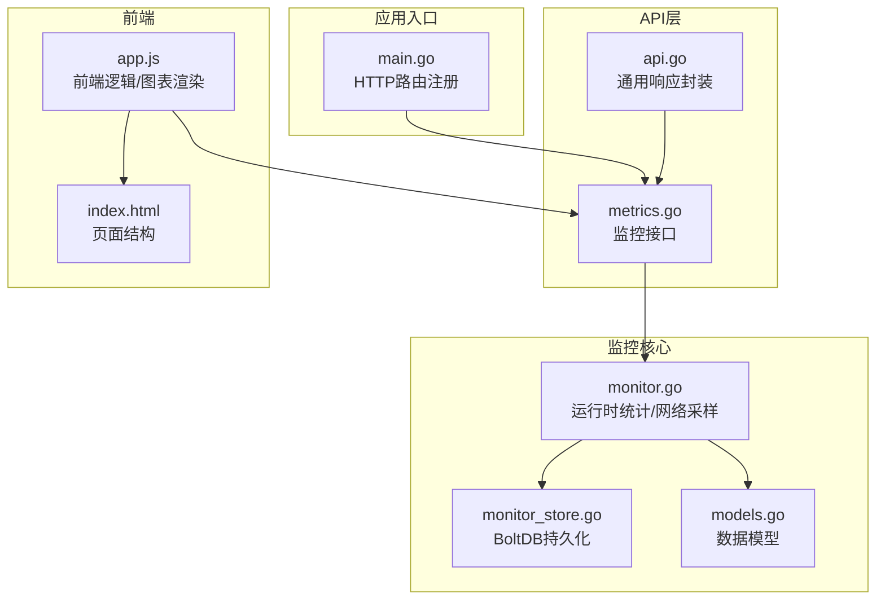
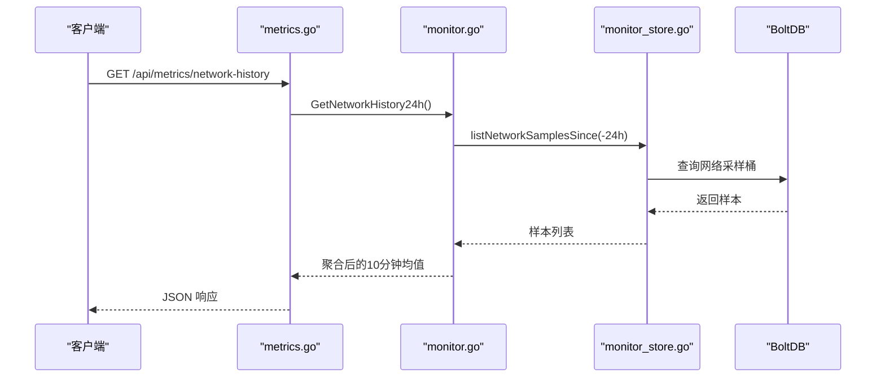
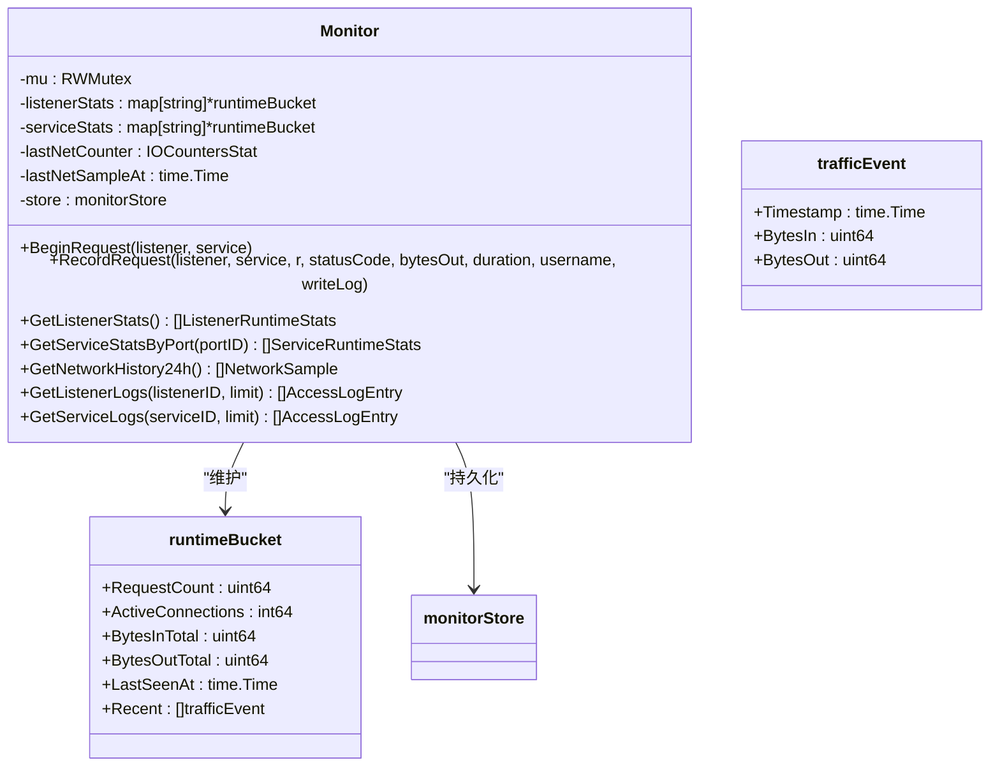
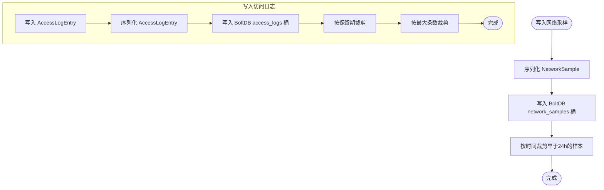
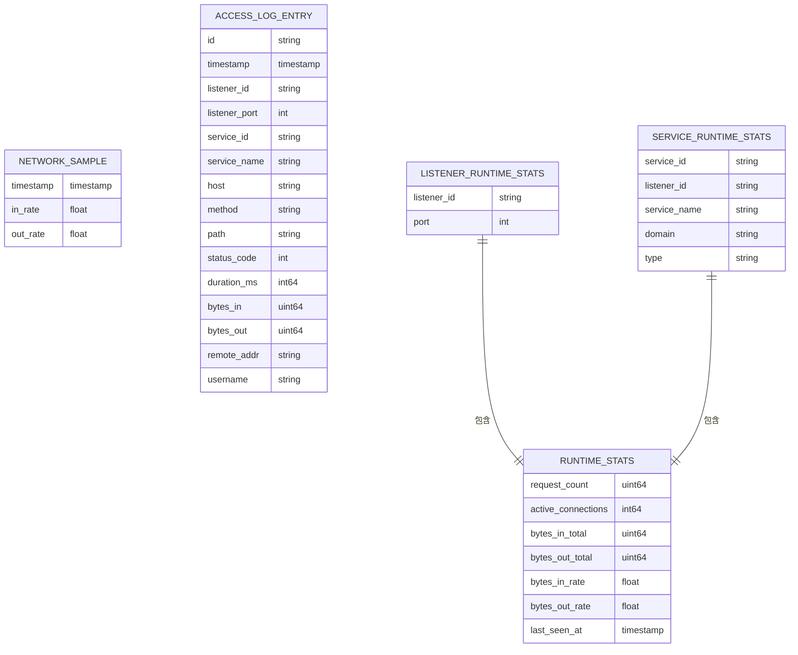
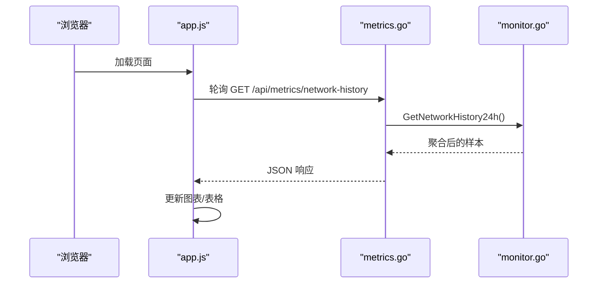
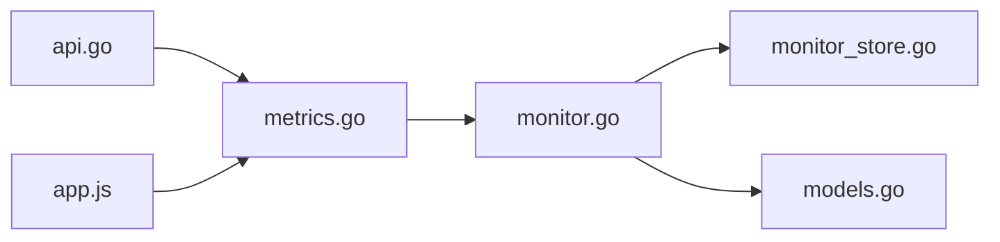

# 监控系统

<cite>
**本文引用的文件**
- [src/utils/monitor.go](file://src/utils/monitor.go)
- [src/utils/monitor_store.go](file://src/utils/monitor_store.go)
- [src/handlers/metrics.go](file://src/handlers/metrics.go)
- [src/models/models.go](file://src/models/models.go)
- [src/main.go](file://src/main.go)
- [src/utils/system.go](file://src/utils/system.go)
- [src/handlers/api.go](file://src/handlers/api.go)
- [src/static/app.js](file://src/static/app.js)
- [src/static/index.html](file://src/static/index.html)
</cite>

## 目录
1. [简介](#简介)
2. [项目结构](#项目结构)
3. [核心组件](#核心组件)
4. [架构总览](#架构总览)
5. [详细组件分析](#详细组件分析)
6. [依赖关系分析](#依赖关系分析)
7. [性能考量](#性能考量)
8. [故障排查指南](#故障排查指南)
9. [结论](#结论)
10. [附录](#附录)

## 简介
本文件面向 Caddy Panel 的监控系统，系统性阐述监控数据的采集机制、存储结构与实时更新策略，解释系统状态监控、网络流量统计、性能指标收集的实现原理，并深入分析监控数据的内存缓存、持久化存储与历史数据管理。同时给出监控 API 接口文档、查询参数与数据格式，说明监控指标的数据模型、计算方法与聚合策略，提供监控告警配置、阈值设置与通知机制的扩展建议，展示监控系统与前端界面的集成方式与实时数据推送思路，并解释监控系统的性能优化与资源消耗控制策略。

## 项目结构
监控系统主要由以下模块组成：
- 数据采集与缓存：内存中的运行时统计与网络采样
- 存储层：基于 BoltDB 的持久化存储，分别维护网络采样与访问日志
- API 层：提供监控相关接口，包括网络历史、监听统计、服务统计与访问日志
- 模型层：统一的数据结构定义，涵盖运行时统计、网络采样、访问日志等
- 前端集成：通过静态资源与图表库渲染监控数据，支持轮询或 WebSocket 实时推送

**图示来源**
- [src/main.go:112-139](file://src/main.go#L112-L139)
- [src/handlers/metrics.go:11-41](file://src/handlers/metrics.go#L11-L41)
- [src/utils/monitor.go:38-117](file://src/utils/monitor.go#L38-L117)
- [src/utils/monitor_store.go:26-54](file://src/utils/monitor_store.go#L26-L54)
- [src/models/models.go:18-70](file://src/models/models.go#L18-L70)
- [src/static/index.html:1-800](file://src/static/index.html#L1-L800)
- [src/static/app.js:1-800](file://src/static/app.js#L1-L800)

**章节来源**
- [src/main.go:112-139](file://src/main.go#L112-L139)
- [src/handlers/metrics.go:11-41](file://src/handlers/metrics.go#L11-L41)
- [src/utils/monitor.go:38-117](file://src/utils/monitor.go#L38-L117)
- [src/utils/monitor_store.go:26-54](file://src/utils/monitor_store.go#L26-L54)
- [src/models/models.go:18-70](file://src/models/models.go#L18-L70)
- [src/static/index.html:1-800](file://src/static/index.html#L1-L800)
- [src/static/app.js:1-800](file://src/static/app.js#L1-L800)

## 核心组件
- 监控器（Monitor）：负责运行时统计、网络采样、访问日志记录与查询，内部使用互斥锁保护并发安全，维护内存中的运行时桶与最近事件窗口，定时采样系统网络 IO 并持久化网络采样点。
- 存储器（monitorStore）：基于 BoltDB 的轻量级键值存储，分别维护网络采样桶与访问日志桶，提供追加、查询、裁剪（按时间与数量）能力。
- API 处理器：提供网络历史、监听统计、服务统计、访问日志等接口，统一返回 JSON 响应。
- 数据模型：定义运行时统计、网络采样、访问日志等结构，确保前后端一致的数据契约。
- 前端集成：通过 Chart.js 渲染网络历史曲线，支持分页与过滤的日志查看，具备响应式布局与交互体验。

**章节来源**
- [src/utils/monitor.go:38-117](file://src/utils/monitor.go#L38-L117)
- [src/utils/monitor_store.go:26-125](file://src/utils/monitor_store.go#L26-L125)
- [src/handlers/metrics.go:11-41](file://src/handlers/metrics.go#L11-L41)
- [src/models/models.go:18-70](file://src/models/models.go#L18-L70)
- [src/static/app.js:769-800](file://src/static/app.js#L769-L800)

## 架构总览
监控系统采用“内存缓存 + 持久化存储”的双层架构：
- 内存层：以运行时桶为单位维护每个监听器与服务的请求计数、活动连接数、累计字节数与最近事件窗口，用于快速统计与速率计算。
- 持久化层：网络采样点与访问日志分别写入 BoltDB，按时间窗口裁剪与最大条数限制，保证历史数据的可控增长。
- API 层：对外暴露监控接口，既可读取内存统计，也可查询持久化的历史数据。
- 前端层：通过图表渲染网络历史，通过表格展示访问日志，支持分页与过滤。

**图示来源**
- [src/handlers/metrics.go:11-14](file://src/handlers/metrics.go#L11-L14)
- [src/utils/monitor.go:323-355](file://src/utils/monitor.go#L323-L355)
- [src/utils/monitor_store.go:77-100](file://src/utils/monitor_store.go#L77-L100)

**章节来源**
- [src/handlers/metrics.go:11-14](file://src/handlers/metrics.go#L11-L14)
- [src/utils/monitor.go:323-355](file://src/utils/monitor.go#L323-L355)
- [src/utils/monitor_store.go:77-100](file://src/utils/monitor_store.go#L77-L100)

## 详细组件分析

### 监控器（Monitor）
- 运行时统计
  - 以监听器 ID 与服务 ID 为键，维护 runtimeBucket，包含请求计数、活动连接数、累计字节数、最近事件窗口与最后活跃时间。
  - 提供 BeginRequest/RecordRequest 两个入口，前者仅减少活动连接并更新最后活跃时间，后者完成完整的请求生命周期统计与日志记录。
  - 速率计算：基于 statsRateWindow（1 分钟）内的最近事件窗口，计算字节流入/流出速率。
- 网络采样
  - 启动时初始化网络采样器，每分钟采样一次系统网络 IO，计算每秒流入/流出速率，持久化到 BoltDB。
  - 采样间隔与保留策略：采样间隔为 1 分钟，网络采样保留时间为 24 小时。
- 访问日志
  - 在 RecordRequest 中根据配置决定是否写入访问日志，日志字段包含监听器/服务信息、请求方法、状态码、耗时、字节数、远程地址与用户名等。
  - 日志查询支持按监听器或服务过滤，支持 limit 参数限制返回条数。

**图示来源**
- [src/utils/monitor.go:38-117](file://src/utils/monitor.go#L38-L117)
- [src/utils/monitor.go:202-251](file://src/utils/monitor.go#L202-L251)
- [src/utils/monitor.go:220-229](file://src/utils/monitor.go#L220-L229)

**章节来源**
- [src/utils/monitor.go:38-117](file://src/utils/monitor.go#L38-L117)
- [src/utils/monitor.go:202-251](file://src/utils/monitor.go#L202-L251)
- [src/utils/monitor.go:220-229](file://src/utils/monitor.go#L220-L229)

### 存储器（monitorStore）
- 网络采样存储
  - 使用 BoltDB 的 network_samples 桶，键为时间戳（纳秒），值为序列化的 NetworkSample。
  - 写入时自动裁剪早于保留时间（24 小时）的样本，保证空间可控。
- 访问日志存储
  - 使用 BoltDB 的 access_logs 桶，键为“时间戳:ID”，值为序列化的 AccessLogEntry。
  - 写入时按全局配置裁剪早于保留期的日志，并限制最大条数，避免无限增长。
- 查询与裁剪
  - 支持按起始时间范围查询网络采样，支持按时间倒序遍历访问日志并限制返回条数。
  - 提供按时间裁剪与按最大条数裁剪的工具函数。

**图示来源**
- [src/utils/monitor_store.go:56-75](file://src/utils/monitor_store.go#L56-L75)
- [src/utils/monitor_store.go:102-125](file://src/utils/monitor_store.go#L102-L125)
- [src/utils/monitor_store.go:157-186](file://src/utils/monitor_store.go#L157-L186)

**章节来源**
- [src/utils/monitor_store.go:56-75](file://src/utils/monitor_store.go#L56-L75)
- [src/utils/monitor_store.go:102-125](file://src/utils/monitor_store.go#L102-L125)
- [src/utils/monitor_store.go:157-186](file://src/utils/monitor_store.go#L157-L186)

### API 接口与数据模型
- 监控接口
  - GET /api/metrics/network-history：返回 24 小时内每 10 分钟的网络流入/流出速率均值。
  - GET /api/metrics/listeners：返回所有监听器的运行时统计。
  - GET /api/metrics/services?port_id=：返回指定端口下所有服务的运行时统计。
  - GET /api/logs/listeners/{id}?limit=：返回监听器访问日志，支持 limit 参数。
  - GET /api/logs/services/{id}?limit=：返回服务访问日志，支持 limit 参数。
- 数据模型
  - NetworkSample：包含时间戳、流入/流出速率。
  - RuntimeStats：包含请求计数、活动连接数、累计字节与速率、最后活跃时间。
  - ListenerRuntimeStats/ServiceRuntimeStats：在 RuntimeStats 基础上附加标识字段。
  - AccessLogEntry：包含监听器/服务信息、请求详情、状态码、耗时、字节数、远程地址与用户名等。

**图示来源**
- [src/models/models.go:18-70](file://src/models/models.go#L18-L70)

**章节来源**
- [src/handlers/metrics.go:11-41](file://src/handlers/metrics.go#L11-L41)
- [src/models/models.go:18-70](file://src/models/models.go#L18-L70)

### 前端集成与实时数据推送
- 页面与样式：index.html 提供监控页面的基础结构与样式，支持响应式布局与交互元素。
- 图表渲染：app.js 通过 Chart.js 动态加载与渲染网络历史图表，支持错误回退与尺寸适配。
- 日志展示：支持监听器与服务访问日志的分页与过滤，limit 参数控制返回条数。
- 实时推送：当前实现为轮询模式，若需实时推送，可在现有基础上引入 WebSocket，将 Monitor 的持久化事件推送到前端，前端再更新图表与表格。

**图示来源**
- [src/static/index.html:1-800](file://src/static/index.html#L1-L800)
- [src/static/app.js:769-800](file://src/static/app.js#L769-L800)
- [src/handlers/metrics.go:11-14](file://src/handlers/metrics.go#L11-L14)
- [src/utils/monitor.go:323-355](file://src/utils/monitor.go#L323-L355)

**章节来源**
- [src/static/index.html:1-800](file://src/static/index.html#L1-L800)
- [src/static/app.js:769-800](file://src/static/app.js#L769-L800)
- [src/handlers/metrics.go:11-14](file://src/handlers/metrics.go#L11-L14)
- [src/utils/monitor.go:323-355](file://src/utils/monitor.go#L323-L355)

## 依赖关系分析
- 监控器依赖 BoltDB 存储与 gopsutil 网络采样库，内部使用互斥锁保证并发安全。
- API 层依赖监控器提供的查询方法，统一返回 JSON 响应。
- 前端通过静态资源与 Chart.js 渲染监控数据，与 API 层通过 HTTP 接口交互。

**图示来源**
- [src/utils/monitor.go:38-117](file://src/utils/monitor.go#L38-L117)
- [src/utils/monitor_store.go:26-54](file://src/utils/monitor_store.go#L26-L54)
- [src/handlers/metrics.go:11-41](file://src/handlers/metrics.go#L11-L41)
- [src/handlers/api.go:95-114](file://src/handlers/api.go#L95-L114)
- [src/static/app.js:769-800](file://src/static/app.js#L769-L800)

**章节来源**
- [src/utils/monitor.go:38-117](file://src/utils/monitor.go#L38-L117)
- [src/utils/monitor_store.go:26-54](file://src/utils/monitor_store.go#L26-L54)
- [src/handlers/metrics.go:11-41](file://src/handlers/metrics.go#L11-L41)
- [src/handlers/api.go:95-114](file://src/handlers/api.go#L95-L114)
- [src/static/app.js:769-800](file://src/static/app.js#L769-L800)

## 性能考量
- 内存缓存策略
  - 运行时桶仅维护最近 1 分钟的事件窗口，避免内存无限增长；速率计算基于滑动窗口，复杂度 O(n)。
  - 读写分离：统计读取使用读锁，写入使用写锁，降低锁竞争。
- 持久化存储
  - BoltDB 事务写入，批量裁剪减少磁盘扫描；网络采样按时间裁剪，访问日志按时间与条数裁剪，避免无限增长。
  - 键设计：网络采样仅时间戳，访问日志复合键（时间戳+ID），保证有序遍历与唯一性。
- API 查询
  - 网络历史聚合：按 10 分钟桶聚合，避免前端过多点位；日志查询限制最大返回条数，防止大结果集。
- 前端渲染
  - 图表按需加载，失败回退到文本提示；移动端自适应布局，减少不必要的重排。

[本节为通用性能指导，不直接分析具体文件]

## 故障排查指南
- 网络采样为空
  - 检查 gopsutil 是否正常获取系统网络 IO；确认采样器是否启动与定时器是否运行。
  - 查看 BoltDB network_samples 桶是否存在与键值是否正确。
- 访问日志缺失
  - 确认 RecordRequest 是否触发写入（writeLog 参数与服务配置）；检查裁剪逻辑是否过早删除。
  - 查看 BoltDB access_logs 桶与键值设计（时间戳:ID）。
- API 返回异常
  - 检查 handlers/metrics.go 的参数解析与错误处理；确认 monitor.go 的查询方法是否返回空结果。
- 前端图表不显示
  - 检查 Chart.js 加载状态与 Canvas 元素；确认 app.js 的轮询逻辑与数据格式。

**章节来源**
- [src/utils/monitor.go:67-117](file://src/utils/monitor.go#L67-L117)
- [src/utils/monitor_store.go:56-125](file://src/utils/monitor_store.go#L56-L125)
- [src/handlers/metrics.go:11-41](file://src/handlers/metrics.go#L11-L41)
- [src/static/app.js:769-800](file://src/static/app.js#L769-L800)

## 结论
Caddy Panel 的监控系统通过“内存缓存 + 持久化存储”的双层架构实现了高效、可扩展的监控能力。内存层提供低延迟的运行时统计与速率计算，持久化层保障历史数据的可追溯与可控增长。API 层与前端通过清晰的数据契约与图表渲染，为用户提供直观的监控视图。未来可在前端引入 WebSocket 实现实时推送，并结合全局配置扩展告警阈值与通知机制，进一步提升监控系统的实用性与可观测性。

[本节为总结性内容，不直接分析具体文件]

## 附录

### 监控 API 接口文档
- 网络历史
  - 方法：GET
  - 路径：/api/metrics/network-history
  - 响应：数组，元素为 NetworkSample，包含 timestamp、in_rate、out_rate
- 监听统计
  - 方法：GET
  - 路径：/api/metrics/listeners
  - 响应：数组，元素为 ListenerRuntimeStats，包含 listener_id、port、RuntimeStats
- 服务统计
  - 方法：GET
  - 路径：/api/metrics/services?port_id={port_id}
  - 响应：数组，元素为 ServiceRuntimeStats，包含 service_id、listener_id、service_name、domain、type、RuntimeStats
- 监听访问日志
  - 方法：GET
  - 路径：/api/logs/listeners/{id}?limit={limit}
  - 响应：数组，元素为 AccessLogEntry
- 服务访问日志
  - 方法：GET
  - 路径：/api/logs/services/{id}?limit={limit}
  - 响应：数组，元素为 AccessLogEntry

**章节来源**
- [src/handlers/metrics.go:11-41](file://src/handlers/metrics.go#L11-L41)
- [src/models/models.go:18-70](file://src/models/models.go#L18-L70)

### 监控指标数据模型与计算方法
- NetworkSample
  - 字段：timestamp、in_rate、out_rate
  - 计算：基于系统网络 IO 采样，每 1 分钟计算一次速率
- RuntimeStats
  - 字段：request_count、active_connections、bytes_in_total、bytes_out_total、bytes_in_rate、bytes_out_rate、last_seen_at
  - 计算：bytes_in_rate/bytes_out_rate 基于最近 1 分钟事件窗口求和后除以 60 秒
- AccessLogEntry
  - 字段：id、timestamp、listener_id、listener_port、service_id、service_name、host、method、path、status_code、duration_ms、bytes_in、bytes_out、remote_addr、username

**章节来源**
- [src/models/models.go:18-70](file://src/models/models.go#L18-L70)
- [src/utils/monitor.go:231-251](file://src/utils/monitor.go#L231-L251)

### 历史数据管理与聚合策略
- 网络采样
  - 保留期：24 小时
  - 聚合：按 10 分钟桶聚合，计算每桶的平均流入/流出速率
- 访问日志
  - 保留期：由全局配置决定
  - 最大条数：由全局配置决定
  - 查询：按时间倒序遍历，限制返回条数

**章节来源**
- [src/utils/monitor.go:323-355](file://src/utils/monitor.go#L323-L355)
- [src/utils/monitor_store.go:188-199](file://src/utils/monitor_store.go#L188-L199)
- [src/utils/monitor_store.go:157-186](file://src/utils/monitor_store.go#L157-L186)

### 告警配置、阈值设置与通知机制（扩展建议）
- 阈值设置
  - 可在全局配置中增加监控阈值字段，如网络流入/流出速率阈值、请求速率阈值、错误率阈值等。
- 告警触发
  - 在 Monitor 中增加阈值检查逻辑，当运行时统计超过阈值时触发告警事件。
- 通知机制
  - 可通过邮件、Webhook 或企业微信等方式发送告警通知，建议在配置中提供通知渠道与模板。
- 前端集成
  - 在前端页面增加告警面板，展示最近告警与历史告警趋势。

[本节为扩展建议，不直接分析具体文件]

### 前端界面集成与实时数据推送（扩展建议）
- WebSocket 实时推送
  - 在 main.go 中挂载 WebSocket 路由，将 Monitor 的持久化事件推送到前端。
  - 前端 app.js 增加连接与消息处理逻辑，实时更新图表与表格。
- 图表增强
  - 支持多维度筛选（监听器、服务、时间范围）、动态刷新与导出功能。
- 日志增强
  - 支持关键词搜索、状态码过滤、时间范围选择与导出 CSV。

[本节为扩展建议，不直接分析具体文件]