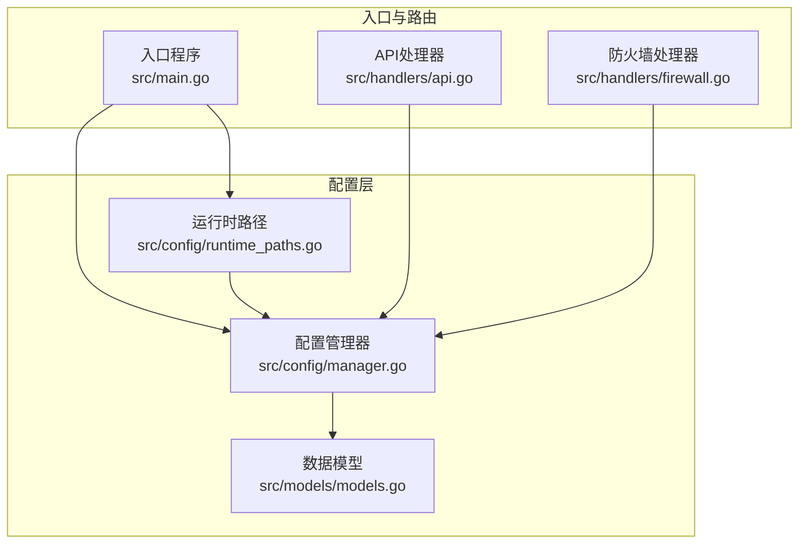
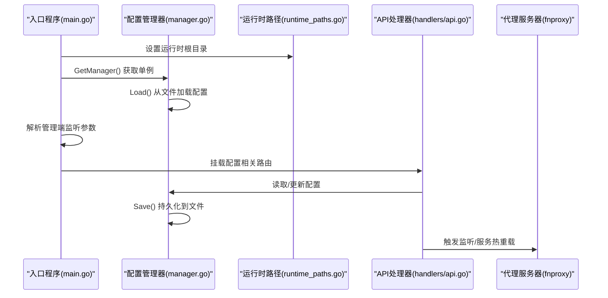
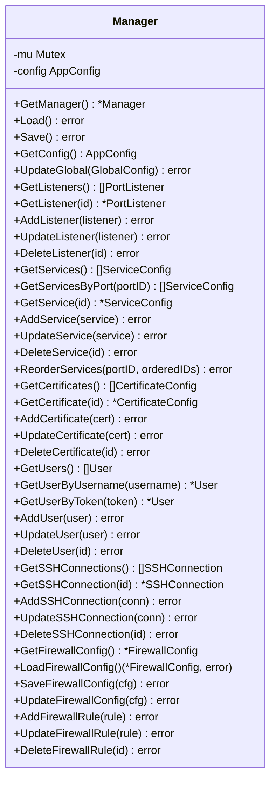
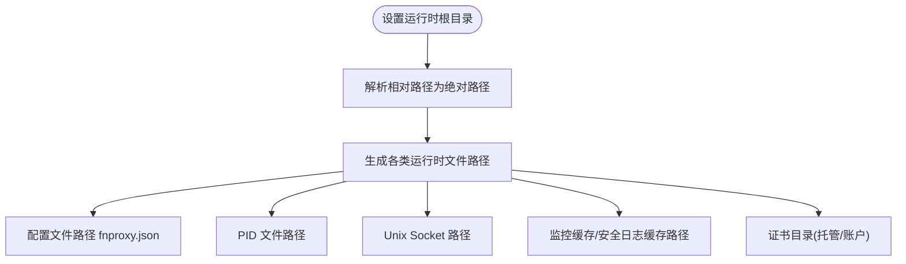
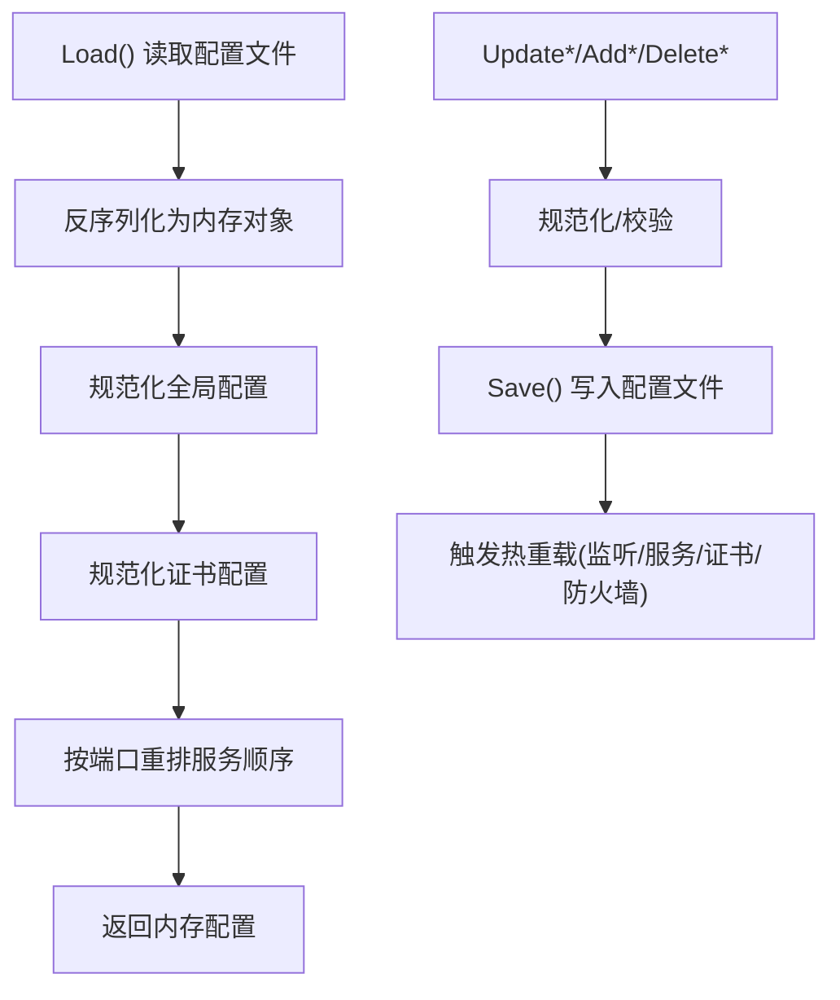
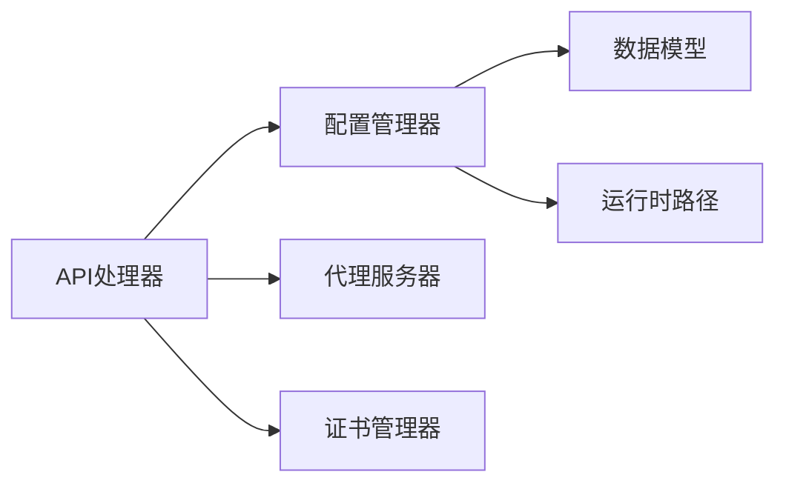

# 配置管理器

<cite>
**本文引用的文件**
- [src/config/manager.go](file://src/config/manager.go)
- [src/config/runtime_paths.go](file://src/config/runtime_paths.go)
- [src/models/models.go](file://src/models/models.go)
- [src/main.go](file://src/main.go)
- [src/handlers/api.go](file://src/handlers/api.go)
- [src/handlers/firewall.go](file://src/handlers/firewall.go)
- [README.md](file://README.md)
</cite>

## 目录
1. [简介](#简介)
2. [项目结构](#项目结构)
3. [核心组件](#核心组件)
4. [架构总览](#架构总览)
5. [详细组件分析](#详细组件分析)
6. [依赖分析](#依赖分析)
7. [性能考量](#性能考量)
8. [故障排查指南](#故障排查指南)
9. [结论](#结论)
10. [附录](#附录)

## 简介
本文件系统性阐述 Caddy Panel 的配置管理器，覆盖其单例设计、配置文件结构、运行时配置机制、加载/验证/持久化/热重载流程、数据模型与字段规则、默认值处理、变更传播与冲突解决策略、配置文件格式与参数详解、迁移与版本兼容、故障恢复机制，以及与各组件的集成接口。

## 项目结构
配置管理器位于 src/config 目录，核心文件包括：
- manager.go：配置管理器主体，负责单例、加载、保存、规范化、增删改查、热重载触发等
- runtime_paths.go：运行时路径解析与管理，统一配置、缓存、证书、PID、Socket 等文件位置
- models.go：应用配置数据模型与枚举常量
- main.go：入口程序，初始化配置管理器、设置运行时参数、挂载 API 路由
- handlers/api.go：配置相关 API 处理器，调用配置管理器进行读写
- handlers/firewall.go：防火墙配置的 API 处理器，调用配置管理器进行读写
- README.md：项目说明与运行参数

图表来源
- [src/config/manager.go:1-791](file://src/config/manager.go#L1-L791)
- [src/config/runtime_paths.go:1-160](file://src/config/runtime_paths.go#L1-L160)
- [src/models/models.go:1-394](file://src/models/models.go#L1-L394)
- [src/main.go:1-516](file://src/main.go#L1-L516)
- [src/handlers/api.go:1-785](file://src/handlers/api.go#L1-L785)
- [src/handlers/firewall.go:1-152](file://src/handlers/firewall.go#L1-L152)

章节来源
- [src/config/manager.go:1-791](file://src/config/manager.go#L1-L791)
- [src/config/runtime_paths.go:1-160](file://src/config/runtime_paths.go#L1-L160)
- [src/models/models.go:1-394](file://src/models/models.go#L1-L394)
- [src/main.go:1-516](file://src/main.go#L1-L516)
- [src/handlers/api.go:1-785](file://src/handlers/api.go#L1-L785)
- [src/handlers/firewall.go:1-152](file://src/handlers/firewall.go#L1-L152)
- [README.md:1-256](file://README.md#L1-L256)

## 核心组件
- 单例配置管理器：提供线程安全的配置读写、规范化、持久化与热重载触发
- 运行时路径管理：集中解析配置文件、PID、Socket、缓存、证书等路径
- 数据模型：定义全局配置、监听器、服务、证书、用户、SSH、防火墙等结构
- API 集成：通过 HTTP API 对配置进行增删改查与热重载

章节来源
- [src/config/manager.go:35-72](file://src/config/manager.go#L35-L72)
- [src/config/runtime_paths.go:85-115](file://src/config/runtime_paths.go#L85-L115)
- [src/models/models.go:384-394](file://src/models/models.go#L384-L394)
- [src/handlers/api.go:732-775](file://src/handlers/api.go#L732-L775)

## 架构总览
配置管理器采用“单例 + 读写锁”的线程安全设计，结合运行时路径解析，形成“配置文件 ↔ 内存对象 ↔ 热重载”的闭环。入口程序在启动时初始化运行时目录与管理端监听参数，随后将配置管理器暴露给 API 层，API 层调用配置管理器完成持久化与热重载。

图表来源
- [src/main.go:35-95](file://src/main.go#L35-L95)
- [src/config/manager.go:74-107](file://src/config/manager.go#L74-L107)
- [src/config/runtime_paths.go:31-59](file://src/config/runtime_paths.go#L31-L59)
- [src/handlers/api.go:732-775](file://src/handlers/api.go#L732-L775)

## 详细组件分析

### 单例设计与生命周期
- 单例：使用 once.Do 确保只初始化一次，内部包含默认配置与初始管理员用户
- 生命周期：入口程序启动时调用 GetManager()，随后根据运行参数设置管理端监听方式与端口

图表来源
- [src/config/manager.go:18-791](file://src/config/manager.go#L18-L791)

章节来源
- [src/config/manager.go:32-72](file://src/config/manager.go#L32-L72)
- [src/main.go:74-86](file://src/main.go#L74-L86)

### 配置文件结构与运行时路径
- 配置文件：fnproxy.json，默认位于运行时根目录
- 运行时路径：统一解析 PID、Socket、监控缓存、安全日志缓存、证书目录等
- 管理端监听：支持 TCP 端口或 Unix Socket

图表来源
- [src/config/runtime_paths.go:31-115](file://src/config/runtime_paths.go#L31-L115)

章节来源
- [src/config/runtime_paths.go:12-21](file://src/config/runtime_paths.go#L12-L21)
- [src/config/runtime_paths.go:85-115](file://src/config/runtime_paths.go#L85-L115)
- [src/main.go:433-458](file://src/main.go#L433-L458)

### 数据模型与字段验证规则
- 全局配置：包含管理端口、默认认证、日志级别、日志文件、日志保留天数、最大访问/安全日志条数、证书配置路径、证书同步周期等
- 监听器：端口、协议(http/https)、启用状态、时间戳
- 服务：端口ID、名称、类型、域名、排序、证书绑定、启用状态、配置对象、认证需求、时间戳
- 证书：来源(ACME/导入/文件同步)、挑战类型(HTTP-01/DNS-01)、DNS提供商、账户邮箱、自动续期、续期提前天数、证书/密钥路径、状态、错误、时间戳
- 用户：ID、用户名、密码(加密存储)、Token、邮箱、角色、启用状态、时间戳
- SSH：ID、名称、主机、端口、用户名、密码、工作目录、是否本地、时间戳
- 防火墙：开关、默认拒绝、规则列表(类型IP/国家、动作允许/拒绝、优先级、描述、启用状态、时间戳)

字段验证与默认值处理：
- 加载时对全局配置进行规范化，确保端口、日志级别、文件、保留天数、最大条数、证书路径、同步周期等字段有效
- 证书规范化：状态默认 pending、自动续期且续期提前天数<=0时设为30、来源默认 imported
- 服务排序：同端口下默认规则(*)优先级低于具体规则，排序值<=0时按创建时间回填

章节来源
- [src/models/models.go:299-310](file://src/models/models.go#L299-L310)
- [src/models/models.go:72-107](file://src/models/models.go#L72-L107)
- [src/models/models.go:93-130](file://src/models/models.go#L93-L130)
- [src/models/models.go:132-146](file://src/models/models.go#L132-L146)
- [src/models/models.go:148-163](file://src/models/models.go#L148-L163)
- [src/models/models.go:221-254](file://src/models/models.go#L221-L254)
- [src/models/models.go:256-281](file://src/models/models.go#L256-L281)
- [src/models/models.go:269-281](file://src/models/models.go#L269-L281)
- [src/models/models.go:377-382](file://src/models/models.go#L377-L382)
- [src/config/manager.go:109-137](file://src/config/manager.go#L109-L137)
- [src/config/manager.go:212-225](file://src/config/manager.go#L212-L225)
- [src/config/manager.go:158-210](file://src/config/manager.go#L158-L210)

### 加载、验证、持久化与热重载流程
- 加载：读取配置文件，反序列化为内存对象，规范化全局与证书字段，按端口归类并重排服务顺序
- 验证：监听器端口范围、协议、与管理端口冲突、端口占用；用户Token唯一性；密码解密与哈希
- 持久化：保存为缩进 JSON，确保目录存在，权限 0644
- 热重载：监听器启停/重载、服务启停/重载、证书同步/续期、防火墙规则变更

图表来源
- [src/config/manager.go:74-93](file://src/config/manager.go#L74-L93)
- [src/config/manager.go:96-107](file://src/config/manager.go#L96-L107)
- [src/config/manager.go:109-137](file://src/config/manager.go#L109-L137)
- [src/config/manager.go:212-225](file://src/config/manager.go#L212-L225)
- [src/config/manager.go:158-210](file://src/config/manager.go#L158-L210)

章节来源
- [src/config/manager.go:74-107](file://src/config/manager.go#L74-L107)
- [src/handlers/api.go:64-93](file://src/handlers/api.go#L64-L93)
- [src/handlers/api.go:732-775](file://src/handlers/api.go#L732-L775)

### 配置变更传播与冲突解决
- 监听器冲突：端口占用时保存为未启用；与管理端口冲突禁止占用
- 服务排序：同端口下默认规则优先级低于具体规则；排序值<=0时按创建时间回填
- 用户Token：全局唯一，禁用最后启用用户
- 防火墙规则：按优先级与动作匹配，支持默认拒绝策略

章节来源
- [src/handlers/api.go:64-93](file://src/handlers/api.go#L64-L93)
- [src/config/manager.go:158-210](file://src/config/manager.go#L158-L210)
- [src/handlers/api.go:644-691](file://src/handlers/api.go#L644-L691)
- [src/handlers/firewall.go:20-59](file://src/handlers/firewall.go#L20-L59)

### 配置文件格式与参数详解
- 主配置文件：fnproxy.json，包含全局配置、监听器、服务、证书、用户、SSH、防火墙
- 运行时路径：PID、Socket、监控缓存、安全日志缓存、证书目录
- 管理端监听：TCP 端口或 Unix Socket
- 证书同步：外部证书配置文件路径与同步周期

章节来源
- [src/config/runtime_paths.go:12-21](file://src/config/runtime_paths.go#L12-L21)
- [src/config/runtime_paths.go:85-115](file://src/config/runtime_paths.go#L85-L115)
- [src/main.go:433-458](file://src/main.go#L433-L458)
- [src/models/models.go:299-310](file://src/models/models.go#L299-L310)

### 迁移、版本兼容与故障恢复
- 版本兼容：加载时若配置文件不存在则创建默认配置并保存；证书来源/状态等字段缺失时按默认值补齐
- 故障恢复：监听器/服务热重载失败时返回友好消息；防火墙规则变更失败时仍保持持久化；用户删除时保证至少保留一个启用用户

章节来源
- [src/config/manager.go:79-89](file://src/config/manager.go#L79-L89)
- [src/config/manager.go:109-137](file://src/config/manager.go#L109-L137)
- [src/handlers/api.go:316-356](file://src/handlers/api.go#L316-L356)
- [src/handlers/api.go:406-443](file://src/handlers/api.go#L406-L443)
- [src/handlers/api.go:696-729](file://src/handlers/api.go#L696-L729)

### 与其他组件的集成与接口
- 入口程序：初始化运行时目录、管理端监听参数、安全日志存储、代理服务器、监控与证书管理器
- API 层：提供配置查询/更新、监听器/服务/用户/证书/SSH/防火墙等管理接口
- 代理服务器：接收配置变更后触发监听/服务热重载
- 证书管理器：按配置周期执行证书同步/续期

章节来源
- [src/main.go:35-95](file://src/main.go#L35-L95)
- [src/main.go:112-431](file://src/main.go#L112-L431)
- [src/handlers/api.go:732-775](file://src/handlers/api.go#L732-L775)

## 依赖分析
配置管理器主要依赖数据模型与运行时路径模块，API 层通过配置管理器间接依赖代理服务器与证书管理器。

图表来源
- [src/handlers/api.go:732-775](file://src/handlers/api.go#L732-L775)
- [src/config/manager.go:18-791](file://src/config/manager.go#L18-L791)
- [src/models/models.go:1-394](file://src/models/models.go#L1-L394)
- [src/config/runtime_paths.go:1-160](file://src/config/runtime_paths.go#L1-L160)

章节来源
- [src/handlers/api.go:1-785](file://src/handlers/api.go#L1-L785)
- [src/config/manager.go:1-791](file://src/config/manager.go#L1-L791)
- [src/models/models.go:1-394](file://src/models/models.go#L1-L394)
- [src/config/runtime_paths.go:1-160](file://src/config/runtime_paths.go#L1-L160)

## 性能考量
- 读写锁：读多写少场景下，读锁提升并发性能
- 归并排序：服务排序按端口分组稳定排序，避免频繁重排
- 文件 I/O：批量写入配置文件，减少磁盘压力
- 热重载：仅在必要时触发监听/服务重载，失败不影响持久化

## 故障排查指南
- 配置文件损坏：加载失败时返回错误，建议检查 JSON 格式与字段合法性
- 端口占用：监听器保存为未启用并提示占用，确认端口可用后再启用
- 管理端口冲突：与管理端口相同会被拒绝，需调整监听器端口
- 用户Token冲突：提示已被占用，更换唯一Token
- 热重载失败：返回友好错误信息，检查代理服务器状态与配置正确性

章节来源
- [src/config/manager.go:74-93](file://src/config/manager.go#L74-L93)
- [src/handlers/api.go:64-93](file://src/handlers/api.go#L64-L93)
- [src/handlers/api.go:316-356](file://src/handlers/api.go#L316-L356)
- [src/handlers/api.go:406-443](file://src/handlers/api.go#L406-L443)
- [src/handlers/api.go:696-729](file://src/handlers/api.go#L696-L729)

## 结论
配置管理器通过单例、规范化、持久化与热重载机制，实现了对应用配置的全生命周期管理。配合运行时路径统一与严格的字段验证，确保了配置的一致性与可靠性。API 层与代理/证书等组件的紧密集成，使得配置变更能够快速生效并具备良好的容错能力。

## 附录
- 启动参数与运行目录：详见 README 中的“启动参数”与“运行期文件”
- 服务类型与配置：反向代理、静态文件、重定向、URL跳转、文本输出
- 证书来源与挑战：ACME、导入、文件同步；HTTP-01/DNS-01；DNS 提供商

章节来源
- [README.md:105-166](file://README.md#L105-L166)
- [src/models/models.go:82-91](file://src/models/models.go#L82-L91)
- [src/models/models.go:109-130](file://src/models/models.go#L109-L130)
- [src/models/models.go:132-146](file://src/models/models.go#L132-L146)
- [src/models/models.go:148-163](file://src/models/models.go#L148-L163)