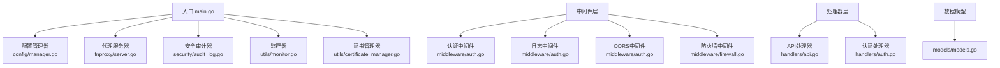
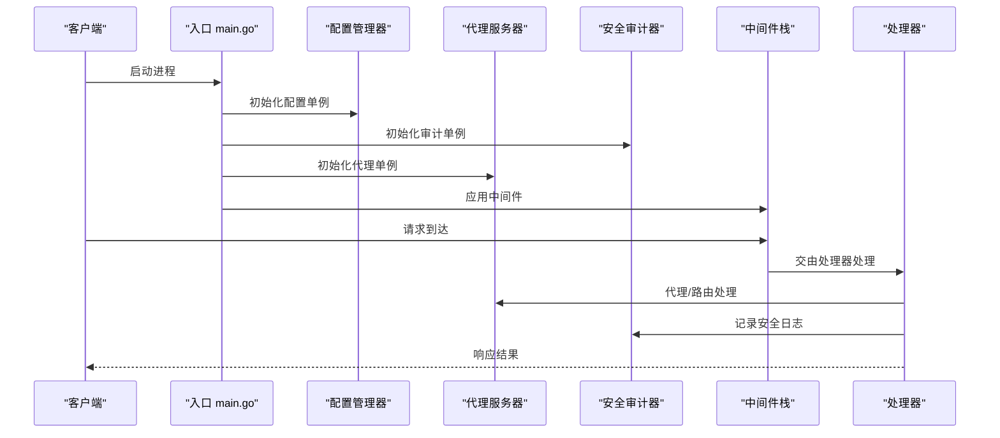
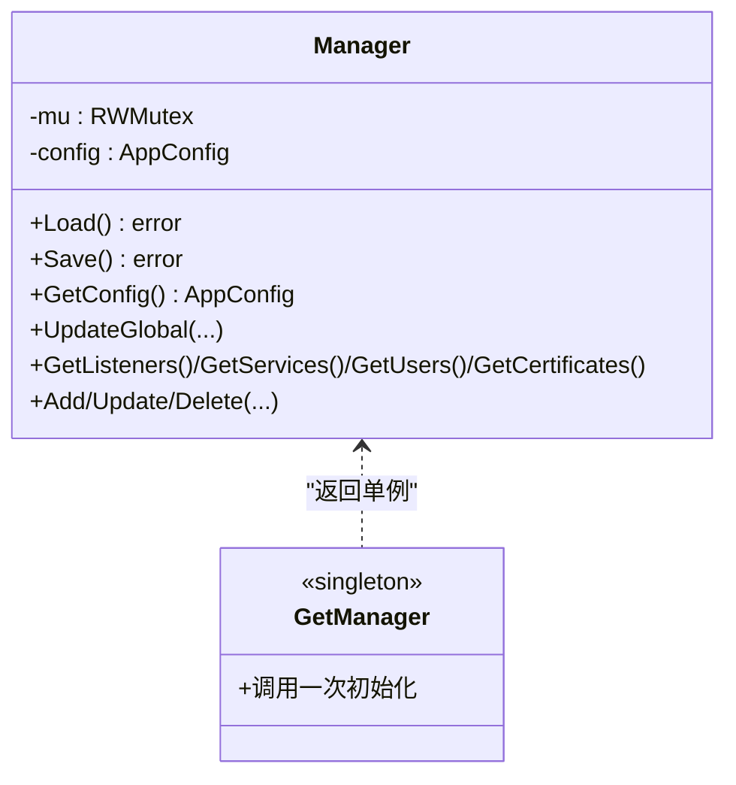
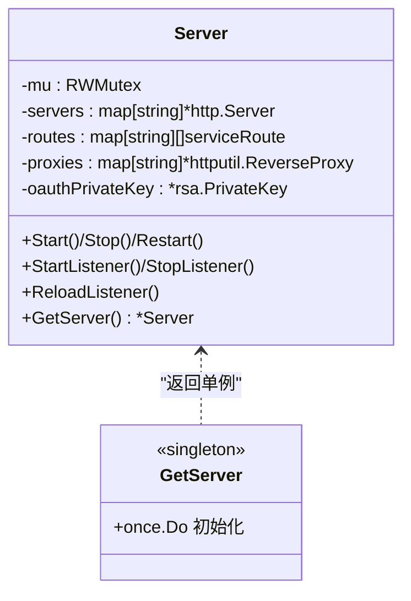
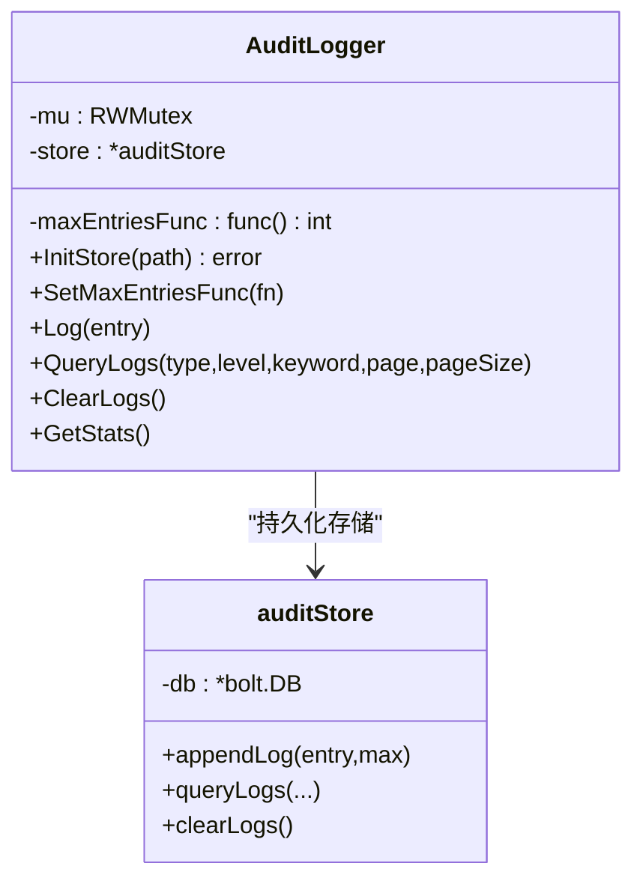
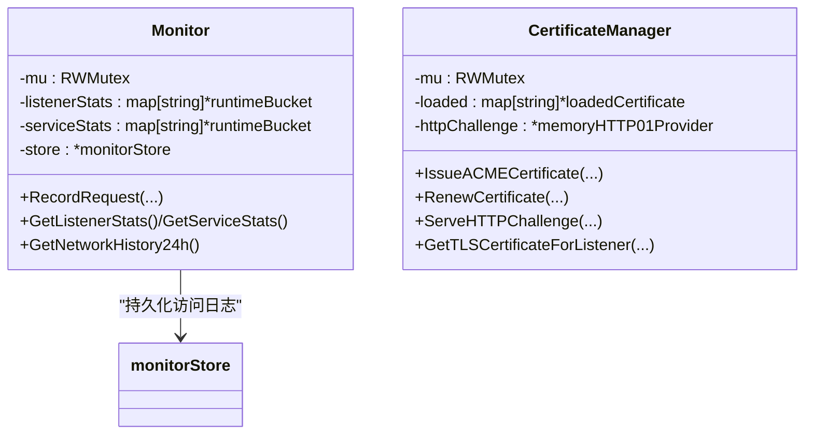
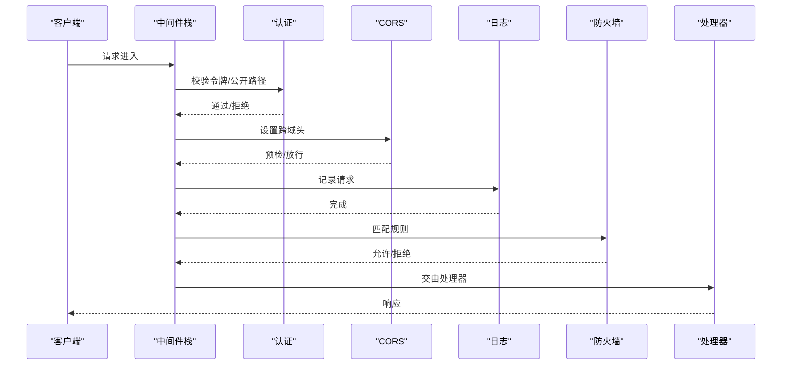
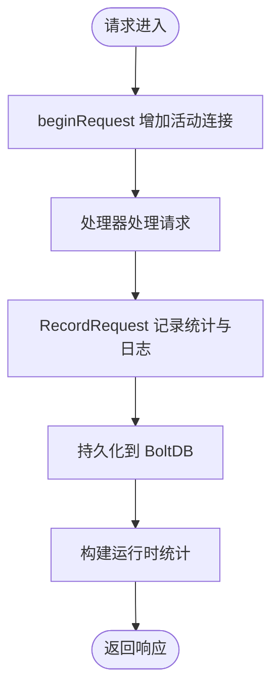
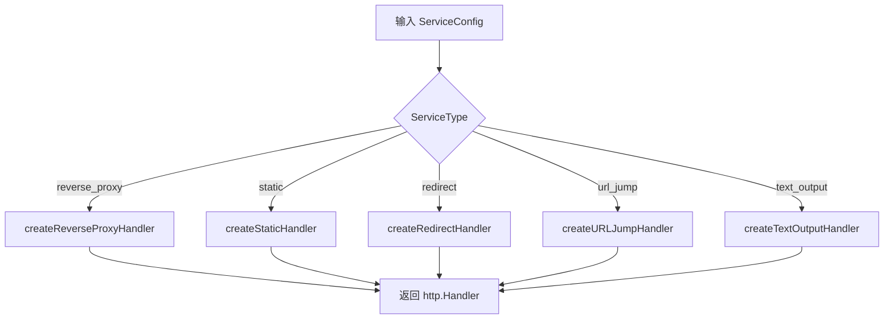
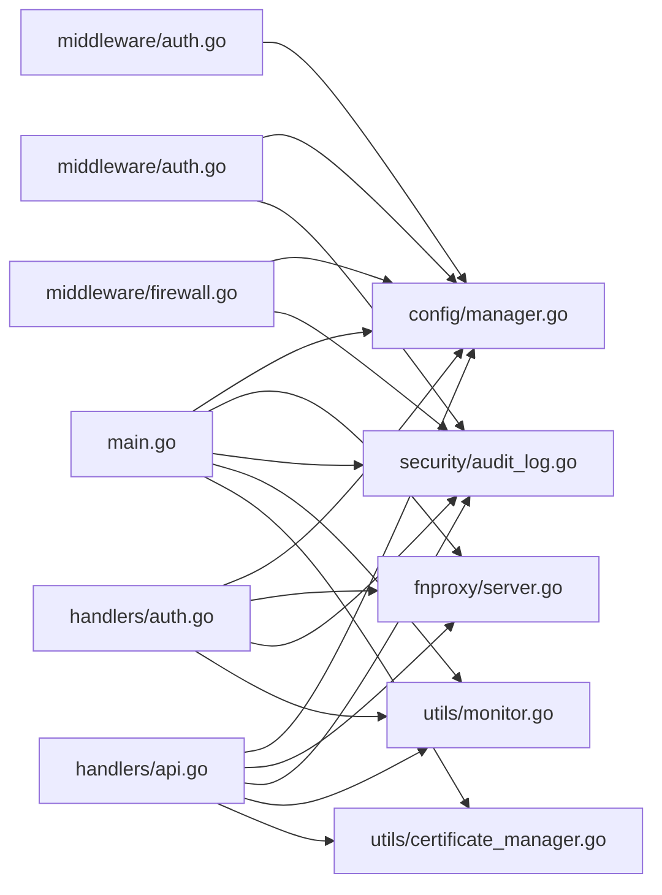

# 设计模式应用

<cite>
**本文档引用的文件**
- [src/main.go](file://src/main.go)
- [src/config/manager.go](file://src/config/manager.go)
- [src/fnproxy/server.go](file://src/fnproxy/server.go)
- [src/security/audit_log.go](file://src/security/audit_log.go)
- [src/security/audit_store.go](file://src/security/audit_store.go)
- [src/middleware/auth.go](file://src/middleware/auth.go)
- [src/middleware/firewall.go](file://src/middleware/firewall.go)
- [src/utils/monitor.go](file://src/utils/monitor.go)
- [src/utils/monitor_store.go](file://src/utils/monitor_store.go)
- [src/utils/certificate_manager.go](file://src/utils/certificate_manager.go)
- [src/handlers/api.go](file://src/handlers/api.go)
- [src/handlers/auth.go](file://src/handlers/auth.go)
- [src/models/models.go](file://src/models/models.go)
</cite>

## 目录
1. [简介](#简介)
2. [项目结构](#项目结构)
3. [核心组件](#核心组件)
4. [架构总览](#架构总览)
5. [详细组件分析](#详细组件分析)
6. [依赖关系分析](#依赖关系分析)
7. [性能考虑](#性能考虑)
8. [故障排查指南](#故障排查指南)
9. [结论](#结论)

## 简介
本文件聚焦于 Caddy Panel 项目中设计模式的应用与实践，围绕以下主题展开：
- 单例模式：在配置管理器、代理服务器、安全审计器中的实现与优势
- 中间件模式：横切关注点（认证、日志、CORS、防火墙）的实现
- 观察者模式：监控系统的事件驱动与数据持久化
- 工厂模式：服务处理器选择与动态路由构建
- 实践建议：如何通过这些模式提升代码的可维护性与扩展性

## 项目结构
项目采用模块化组织，主要模块如下：
- config：配置管理（单例）
- fnproxy：代理服务器（单例）
- security：安全审计（单例）
- middleware：HTTP 中间件（认证、日志、CORS、防火墙）
- utils：监控、证书管理等工具（单例）
- handlers：API 业务处理器
- models：数据模型与枚举

**图表来源**
- [src/main.go:1-516](file://src/main.go#L1-L516)
- [src/config/manager.go:1-791](file://src/config/manager.go#L1-L791)
- [src/fnproxy/server.go:1-800](file://src/fnproxy/server.go#L1-L800)
- [src/security/audit_log.go:1-224](file://src/security/audit_log.go#L1-L224)
- [src/utils/monitor.go:1-386](file://src/utils/monitor.go#L1-L386)
- [src/utils/certificate_manager.go:1-800](file://src/utils/certificate_manager.go#L1-L800)
- [src/middleware/auth.go:1-119](file://src/middleware/auth.go#L1-L119)
- [src/middleware/firewall.go:1-226](file://src/middleware/firewall.go#L1-L226)
- [src/handlers/api.go:1-785](file://src/handlers/api.go#L1-L785)
- [src/handlers/auth.go:1-266](file://src/handlers/auth.go#L1-L266)
- [src/models/models.go:1-394](file://src/models/models.go#L1-L394)

**章节来源**
- [src/main.go:1-516](file://src/main.go#L1-L516)

## 核心组件
- 配置管理器（单例）：集中管理应用配置，提供线程安全的读写接口，支持默认值与规范化逻辑。
- 代理服务器（单例）：统一管理监听器、服务路由与 TLS 证书加载，支持热更新与多协议处理。
- 安全审计器（单例）：集中记录 OAuth 登录、代理错误、SSH 连接、系统操作等安全日志。
- 监控器（单例）：采集网络与访问日志，提供运行时统计与历史趋势。
- 证书管理器（单例）：统一管理 ACME 申请、导入、续签与运行时加载。
- 中间件栈：认证、日志、CORS、防火墙等横切关注点以中间件形式串联。
- 数据模型：统一的数据结构与枚举，支撑各模块的数据交换。

**章节来源**
- [src/config/manager.go:18-72](file://src/config/manager.go#L18-L72)
- [src/fnproxy/server.go:37-181](file://src/fnproxy/server.go#L37-L181)
- [src/security/audit_log.go:15-31](file://src/security/audit_log.go#L15-L31)
- [src/utils/monitor.go:38-65](file://src/utils/monitor.go#L38-L65)
- [src/utils/certificate_manager.go:126-151](file://src/utils/certificate_manager.go#L126-L151)
- [src/middleware/auth.go:14-119](file://src/middleware/auth.go#L14-L119)
- [src/middleware/firewall.go:13-50](file://src/middleware/firewall.go#L13-L50)
- [src/models/models.go:72-394](file://src/models/models.go#L72-L394)

## 架构总览
整体架构采用“入口引导 + 单例服务 + 中间件栈 + 处理器”的分层设计。入口负责初始化单例、挂载中间件与路由，中间件负责横切关注点，处理器负责具体业务逻辑。

**图表来源**
- [src/main.go:74-110](file://src/main.go#L74-L110)
- [src/main.go:421-429](file://src/main.go#L421-L429)
- [src/security/audit_log.go:62-80](file://src/security/audit_log.go#L62-L80)
- [src/fnproxy/server.go:293-324](file://src/fnproxy/server.go#L293-L324)

**章节来源**
- [src/main.go:74-110](file://src/main.go#L74-L110)
- [src/main.go:421-429](file://src/main.go#L421-L429)

## 详细组件分析

### 单例模式：配置管理器
- 实现要点
  - 使用包级变量与 sync.Once 确保全局唯一实例与延迟初始化。
  - 读写分离的互斥锁保证并发安全。
  - 默认值与规范化逻辑集中在构造阶段，避免后续分支判断。
- 优势
  - 配置集中管理，避免分散读取导致的不一致。
  - 线程安全，支持热更新与跨模块共享。
  - 初始化成本低，首次访问时完成加载与校验。
- 代码示例路径
  - [GetManager 初始化与单例:35-72](file://src/config/manager.go#L35-L72)
  - [Load/Save 配置持久化:74-107](file://src/config/manager.go#L74-L107)
  - [GetConfig 读取配置:227-232](file://src/config/manager.go#L227-L232)

**图表来源**
- [src/config/manager.go:18-72](file://src/config/manager.go#L18-L72)
- [src/config/manager.go:74-107](file://src/config/manager.go#L74-L107)

**章节来源**
- [src/config/manager.go:35-72](file://src/config/manager.go#L35-L72)
- [src/config/manager.go:74-107](file://src/config/manager.go#L74-L107)

### 单例模式：代理服务器
- 实现要点
  - 全局共享 HTTP Transport，减少连接开销。
  - 监听器与服务路由缓存，支持热更新。
  - OAuth 私钥/公钥对在单例中生成并共享。
- 优势
  - 代理能力集中，便于统一管理与热更新。
  - 复用连接池，降低资源消耗。
  - 统一的 OAuth 加密能力，简化前端交互。
- 代码示例路径
  - [GetServer 单例与初始化:163-181](file://src/fnproxy/server.go#L163-L181)
  - [Start/Stop/Restart 生命周期:183-227](file://src/fnproxy/server.go#L183-L227)
  - [applyListenerConfig 热更新:370-425](file://src/fnproxy/server.go#L370-L425)

**图表来源**
- [src/fnproxy/server.go:37-181](file://src/fnproxy/server.go#L37-L181)
- [src/fnproxy/server.go:183-227](file://src/fnproxy/server.go#L183-L227)

**章节来源**
- [src/fnproxy/server.go:163-181](file://src/fnproxy/server.go#L163-L181)
- [src/fnproxy/server.go:370-425](file://src/fnproxy/server.go#L370-L425)

### 单例模式：安全审计器
- 实现要点
  - 审计日志存储独立于内存，使用 BoltDB 持久化。
  - 最大条目数通过回调函数动态获取，便于与配置联动。
  - 并发安全，支持多协程写入。
- 优势
  - 集中记录各类安全事件，便于审计与追踪。
  - 存储与内存解耦，避免内存膨胀。
  - 可配置的最大条目数，平衡存储与性能。
- 代码示例路径
  - [GetAuditLogger 单例:25-31](file://src/security/audit_log.go#L25-L31)
  - [InitStore/BoltDB 初始化:26-45](file://src/security/audit_store.go#L26-L45)
  - [Log/QueryLogs/ClearLogs:62-194](file://src/security/audit_log.go#L62-L194)

**图表来源**
- [src/security/audit_log.go:15-31](file://src/security/audit_log.go#L15-L31)
- [src/security/audit_store.go:22-45](file://src/security/audit_store.go#L22-L45)

**章节来源**
- [src/security/audit_log.go:25-31](file://src/security/audit_log.go#L25-L31)
- [src/security/audit_store.go:26-45](file://src/security/audit_store.go#L26-L45)

### 单例模式：监控器与证书管理器
- 监控器（单例）
  - 采集网络与访问日志，提供运行时统计与历史趋势。
  - 使用 BoltDB 存储访问日志与网络样本，支持分页与过滤。
- 证书管理器（单例）
  - 统一管理 ACME 申请、导入、续签与运行时加载。
  - 支持外部配置文件同步，自动清理与绑定检查。
- 代码示例路径
  - [GetMonitor 单例:53-65](file://src/utils/monitor.go#L53-L65)
  - [GetCertificateManager 单例:140-151](file://src/utils/certificate_manager.go#L140-L151)
  - [monitorStore/BoltDB 初始化:30-54](file://src/utils/monitor_store.go#L30-L54)

**图表来源**
- [src/utils/monitor.go:38-65](file://src/utils/monitor.go#L38-L65)
- [src/utils/certificate_manager.go:126-151](file://src/utils/certificate_manager.go#L126-L151)
- [src/utils/monitor_store.go:26-54](file://src/utils/monitor_store.go#L26-L54)

**章节来源**
- [src/utils/monitor.go:53-65](file://src/utils/monitor.go#L53-L65)
- [src/utils/certificate_manager.go:140-151](file://src/utils/certificate_manager.go#L140-L151)
- [src/utils/monitor_store.go:30-54](file://src/utils/monitor_store.go#L30-L54)

### 中间件模式：横切关注点
- 认证中间件
  - 支持 Authorization Bearer 与公开路径白名单。
  - 将用户声明注入请求上下文，供后续处理器使用。
- 日志中间件
  - 记录请求方法、路径与耗时，便于运维分析。
- CORS 中间件
  - 统一设置跨域头，支持预检请求。
- 防火墙中间件
  - 基于 IP/Country 的规则匹配，支持优先级与默认动作。
- 代码示例路径
  - [AuthMiddleware:14-55](file://src/middleware/auth.go#L14-L55)
  - [LoggingMiddleware:109-118](file://src/middleware/auth.go#L109-L118)
  - [CORSMiddleware:93-107](file://src/middleware/auth.go#L93-L107)
  - [FirewallMiddleware:13-50](file://src/middleware/firewall.go#L13-L50)

**图表来源**
- [src/middleware/auth.go:14-119](file://src/middleware/auth.go#L14-L119)
- [src/middleware/firewall.go:13-50](file://src/middleware/firewall.go#L13-L50)

**章节来源**
- [src/middleware/auth.go:14-119](file://src/middleware/auth.go#L14-L119)
- [src/middleware/firewall.go:13-50](file://src/middleware/firewall.go#L13-L50)

### 观察者模式：监控系统
- 观察者角色
  - 监控器作为观察者，订阅网络与访问事件。
  - 事件源：代理服务器在请求处理过程中触发记录。
- 实现机制
  - 监控器内部维护运行时桶（runtimeBucket），记录请求计数、连接数、字节速率等。
  - 使用 BoltDB 持久化访问日志与网络样本，支持分页查询与统计。
- 代码示例路径
  - [RecordRequest 触发记录:131-189](file://src/utils/monitor.go#L131-L189)
  - [GetNetworkHistory24h 历史聚合:323-355](file://src/utils/monitor.go#L323-L355)
  - [monitorStore.appendAccessLog:102-125](file://src/utils/monitor_store.go#L102-L125)

**图表来源**
- [src/utils/monitor.go:119-189](file://src/utils/monitor.go#L119-L189)
- [src/utils/monitor_store.go#L102-L125:102-125](file://src/utils/monitor_store.go#L102-L125)

**章节来源**
- [src/utils/monitor.go:131-189](file://src/utils/monitor.go#L131-L189)
- [src/utils/monitor_store.go#L102-L125:102-125](file://src/utils/monitor_store.go#L102-L125)

### 工厂模式：服务处理器选择
- 实现要点
  - 代理服务器根据服务配置类型动态选择处理器：反向代理、静态文件、重定向、URL 跳转、文本输出。
  - createHandler 根据 ServiceType 返回对应的处理器，实现“按需创建”与“按类型分发”。
- 优势
  - 降低耦合，新增服务类型只需扩展处理器创建逻辑。
  - 便于测试与替换具体实现。
- 代码示例路径
  - [createHandler 选择处理器:442-458](file://src/fnproxy/server.go#L442-L458)
  - [createReverseProxyHandler:460-584](file://src/fnproxy/server.go#L460-L584)
  - [createStaticHandler/createRedirectHandler 等:584-800](file://src/fnproxy/server.go#L584-L800)

**图表来源**
- [src/fnproxy/server.go:442-458](file://src/fnproxy/server.go#L442-L458)
- [src/fnproxy/server.go:460-584](file://src/fnproxy/server.go#L460-L584)

**章节来源**
- [src/fnproxy/server.go:442-458](file://src/fnproxy/server.go#L442-L458)
- [src/fnproxy/server.go:460-584](file://src/fnproxy/server.go#L460-L584)

### 安全审计：日志记录与持久化
- 记录场景
  - OAuth 登录（成功/失败）
  - 代理错误（上游不可达等）
  - SSH 连接/断开
  - 系统操作（增删改查等）
- 持久化策略
  - BoltDB 分桶存储，时间复合键保证有序与去重。
  - 支持按类型、级别、关键词过滤与分页查询。
- 代码示例路径
  - [LogOAuthLogin/LogProxyError/LogSSHConnect:82-147](file://src/security/audit_log.go#L82-L147)
  - [auditStore.appendLog/queryLogs:47-129](file://src/security/audit_store.go#L47-L129)

**章节来源**
- [src/security/audit_log.go:82-147](file://src/security/audit_log.go#L82-L147)
- [src/security/audit_store.go#L47-L129:47-129](file://src/security/audit_store.go#L47-L129)

## 依赖关系分析
- 入口依赖：main.go 依赖配置、代理、安全、监控、证书等单例，并挂载中间件与路由。
- 中间件依赖：认证、日志、CORS、防火墙中间件依赖配置管理器与安全审计器。
- 处理器依赖：API 与认证处理器依赖配置、代理、安全、监控、证书等服务。
- 数据模型：所有模块共享 models，确保类型一致性。

**图表来源**
- [src/main.go:74-110](file://src/main.go#L74-L110)
- [src/middleware/auth.go:14-119](file://src/middleware/auth.go#L14-L119)
- [src/middleware/firewall.go:13-50](file://src/middleware/firewall.go#L13-L50)
- [src/handlers/api.go:1-785](file://src/handlers/api.go#L1-L785)
- [src/handlers/auth.go:1-266](file://src/handlers/auth.go#L1-L266)

**章节来源**
- [src/main.go:74-110](file://src/main.go#L74-L110)
- [src/middleware/auth.go:14-119](file://src/middleware/auth.go#L14-L119)
- [src/middleware/firewall.go:13-50](file://src/middleware/firewall.go#L13-L50)
- [src/handlers/api.go:1-785](file://src/handlers/api.go#L1-L785)
- [src/handlers/auth.go:1-266](file://src/handlers/auth.go#L1-L266)

## 性能考虑
- 单例与连接复用
  - 代理服务器使用全局共享的 HTTP Transport，减少连接建立与 TLS 握手开销。
  - 监控器与证书管理器均采用单例，避免重复初始化。
- 并发安全
  - 配置管理器与监控器使用读写锁，读多写少场景下提升吞吐。
- 存储优化
  - BoltDB 使用时间复合键，支持高效范围扫描与裁剪。
  - 访问日志与网络样本按配置限制最大条目数，避免无限增长。
- 热更新
  - 代理服务器支持监听器与服务的热更新，无需重启主进程。

[本节为通用指导，无需特定文件引用]

## 故障排查指南
- 认证失败
  - 检查公开路径与 Bearer Token 格式。
  - 参考：[AuthMiddleware:14-55](file://src/middleware/auth.go#L14-L55)
- CORS 问题
  - 确认预检请求与允许的方法/头。
  - 参考：[CORSMiddleware:93-107](file://src/middleware/auth.go#L93-L107)
- 防火墙拦截
  - 检查规则优先级与默认动作。
  - 参考：[FirewallMiddleware:13-50](file://src/middleware/firewall.go#L13-L50)
- 代理错误
  - 查看安全审计日志中的代理错误条目。
  - 参考：[LogProxyError:101-113](file://src/security/audit_log.go#L101-L113)
- 监控日志异常
  - 检查 BoltDB 存储路径与权限，确认最大条目数配置。
  - 参考：[monitorStore.appendAccessLog:102-125](file://src/utils/monitor_store.go#L102-L125)

**章节来源**
- [src/middleware/auth.go:14-119](file://src/middleware/auth.go#L14-L119)
- [src/middleware/firewall.go:13-50](file://src/middleware/firewall.go#L13-L50)
- [src/security/audit_log.go:101-113](file://src/security/audit_log.go#L101-L113)
- [src/utils/monitor_store.go:102-125](file://src/utils/monitor_store.go#L102-L125)

## 结论
Caddy Panel 通过精心设计的单例、中间件、工厂与观察者模式，实现了高内聚、低耦合的架构。单例确保关键服务的全局一致性与资源复用；中间件将横切关注点模块化，提升可维护性；工厂模式使服务处理器选择灵活可扩展；观察者模式结合持久化存储，提供可观测性与可审计性。这些设计模式共同提升了系统的稳定性、可维护性与扩展性，为复杂代理与管理平台提供了坚实基础。