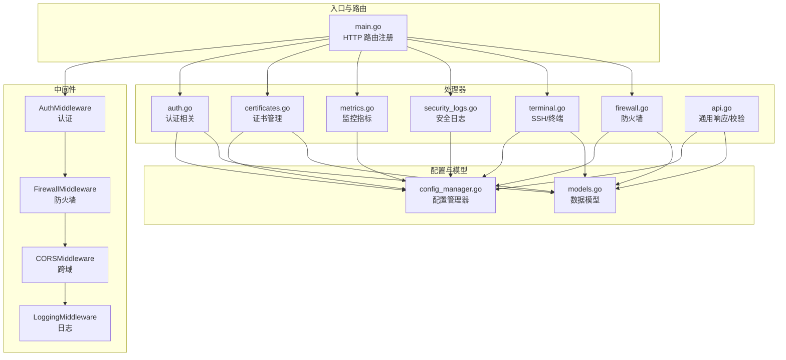
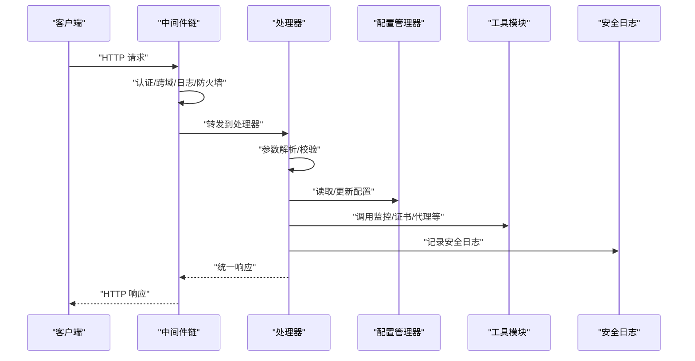
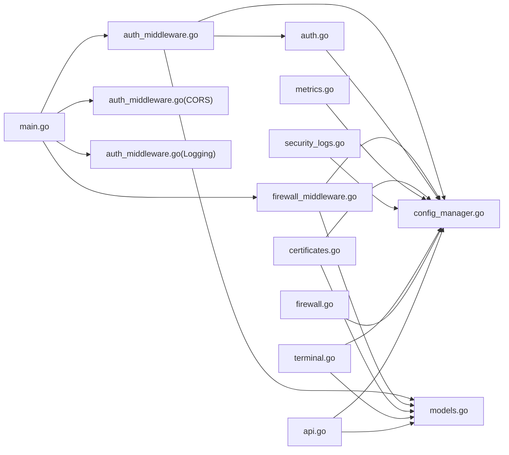

# API 处理器

<cite>
**本文引用的文件**
- [main.go](file://src/main.go)
- [api.go](file://src/handlers/api.go)
- [auth.go](file://src/handlers/auth.go)
- [certificates.go](file://src/handlers/certificates.go)
- [metrics.go](file://src/handlers/metrics.go)
- [security_logs.go](file://src/handlers/security_logs.go)
- [terminal.go](file://src/handlers/terminal.go)
- [firewall.go](file://src/handlers/firewall.go)
- [auth_middleware.go](file://src/middleware/auth.go)
- [firewall_middleware.go](file://src/middleware/firewall.go)
- [models.go](file://src/models/models.go)
- [config_manager.go](file://src/config/manager.go)
- [README.md](file://README.md)
</cite>

## 目录
1. [简介](#简介)
2. [项目结构](#项目结构)
3. [核心组件](#核心组件)
4. [架构总览](#架构总览)
5. [详细组件分析](#详细组件分析)
6. [依赖分析](#依赖分析)
7. [性能考虑](#性能考虑)
8. [故障排查指南](#故障排查指南)
9. [结论](#结论)
10. [附录](#附录)

## 简介
本项目是一个基于 Go 的轻量级服务管理面板，提供统一的管理后台与 RESTful API，涵盖认证管理、配置管理、证书管理、SSH 终端、监控指标与安全日志等模块。API 采用标准的 HTTP 方法与 JSON 响应格式，配合中间件实现认证、跨域、日志与防火墙控制。本文档面向开发者与运维人员，系统性梳理 API 设计原则、路由组织、请求处理流程、错误处理与状态码、以及各端点的规范与调用示例。

## 项目结构
项目采用分层与模块化组织：
- handlers：各业务模块的 HTTP 处理器
- middleware：认证、跨域、日志、防火墙等中间件
- models：数据模型与枚举
- config：配置管理器
- utils：工具与监控、证书管理等
- security：审计日志与安全相关
- static：前端静态资源（内嵌）

图表来源
- [main.go:111-430](file://src/main.go#L111-L430)
- [auth_middleware.go:14-119](file://src/middleware/auth.go#L14-L119)
- [firewall_middleware.go:13-226](file://src/middleware/firewall.go#L13-L226)
- [auth.go:37-110](file://src/handlers/auth.go#L37-L110)
- [certificates.go:32-149](file://src/handlers/certificates.go#L32-L149)
- [metrics.go:11-53](file://src/handlers/metrics.go#L11-L53)
- [security_logs.go:10-65](file://src/handlers/security_logs.go#L10-L65)
- [terminal.go:69-351](file://src/handlers/terminal.go#L69-L351)
- [firewall.go:20-168](file://src/handlers/firewall.go#L20-L168)
- [api.go:20-127](file://src/handlers/api.go#L20-L127)
- [config_manager.go:35-791](file://src/config/manager.go#L35-L791)
- [models.go:7-394](file://src/models/models.go#L7-L394)

章节来源
- [main.go:111-430](file://src/main.go#L111-L430)
- [README.md:1-256](file://README.md#L1-L256)

## 核心组件
- 通用响应与校验：统一的响应结构、错误/成功写入、请求上下文提取、监听器端口校验、密码解密等
- 认证与授权：JWT 登录、登出、当前用户、OAuth 公钥、管理后台页面认证中间件
- 配置管理：全局配置读取与更新
- 监控与日志：网络历史、监听器/服务统计、访问日志、安全日志查询与统计
- 证书管理：证书列表、增删改查、续期、导入/ACME、敏感字段掩码
- SSH 与终端：SSH 连接管理、连接测试、托管终端会话、WebSocket 终端、心跳与清理
- 防火墙：配置读取/更新、规则增删改、IP/Country 匹配与默认动作
- 中间件：认证、跨域、日志、防火墙

章节来源
- [api.go:20-127](file://src/handlers/api.go#L20-L127)
- [auth.go:37-110](file://src/handlers/auth.go#L37-L110)
- [metrics.go:11-53](file://src/handlers/metrics.go#L11-L53)
- [security_logs.go:10-65](file://src/handlers/security_logs.go#L10-L65)
- [certificates.go:32-149](file://src/handlers/certificates.go#L32-L149)
- [terminal.go:69-351](file://src/handlers/terminal.go#L69-L351)
- [firewall.go:20-168](file://src/handlers/firewall.go#L20-L168)
- [auth_middleware.go:14-119](file://src/middleware/auth.go#L14-L119)
- [firewall_middleware.go:13-226](file://src/middleware/firewall.go#L13-L226)

## 架构总览
API 通过 main.go 注册路由，挂载中间件链，然后交由处理器处理具体业务。中间件负责认证、跨域、日志与防火墙控制；处理器负责参数解析、业务校验、调用配置管理器与工具模块、记录安全日志并返回统一响应。

图表来源
- [main.go:421-427](file://src/main.go#L421-L427)
- [auth_middleware.go:14-119](file://src/middleware/auth.go#L14-L119)
- [firewall_middleware.go:13-226](file://src/middleware/firewall.go#L13-L226)
- [api.go:95-127](file://src/handlers/api.go#L95-L127)

## 详细组件分析

### 认证管理模块
- 登录：用户名密码校验，生成 JWT 并写入 Cookie
- 登出：返回成功消息（JWT 无状态，客户端删除 token 即可）
- 当前用户：从请求上下文获取用户信息
- OAuth 公钥：返回服务端公钥，用于前端加密登录负载
- 管理后台页面认证中间件：未登录重定向到 OAuth 登录页

章节来源
- [auth.go:37-110](file://src/handlers/auth.go#L37-L110)
- [auth.go:124-198](file://src/handlers/auth.go#L124-L198)
- [auth.go:253-266](file://src/handlers/auth.go#L253-L266)
- [auth_middleware.go:14-119](file://src/middleware/auth.go#L14-L119)

### 配置管理模块
- 全局配置读取：返回管理端口、日志级别、证书配置路径、运行时路径等
- 全局配置更新：更新后触发证书维护任务

章节来源
- [api.go:732-775](file://src/handlers/api.go#L732-L775)
- [config_manager.go:227-241](file://src/config/manager.go#L227-L241)

### 证书管理模块
- 列表：按更新时间倒序返回，敏感字段掩码
- 新增：支持导入 PEM 或 ACME 申请；保存后记录安全日志
- 更新：更新配置与证书文件，记录安全日志
- 删除：删除证书，记录安全日志
- 续期：对指定证书发起续期，记录安全日志
- 敏感字段掩码：对 DNS 凭据等进行掩码处理

章节来源
- [certificates.go:32-149](file://src/handlers/certificates.go#L32-L149)
- [certificates.go:151-172](file://src/handlers/certificates.go#L151-L172)
- [certificates.go:190-285](file://src/handlers/certificates.go#L190-L285)

### SSH 与终端模块
- SSH 连接管理：列表、新增、更新、删除、测试
- 托管终端会话：创建、列出、删除、心跳
- WebSocket 终端：升级连接、输入处理、输出流、心跳与清理
- 安全日志：记录 SSH 连接/断开、操作行为

章节来源
- [terminal.go:69-351](file://src/handlers/terminal.go#L69-L351)
- [terminal.go:353-510](file://src/handlers/terminal.go#L353-L510)
- [terminal.go:512-612](file://src/handlers/terminal.go#L512-L612)
- [terminal.go:614-796](file://src/handlers/terminal.go#L614-L796)

### 监控与日志模块
- 网络历史：过去 24 小时网络速率
- 监听统计：按监听器聚合运行时统计
- 服务统计：按端口聚合服务统计
- 访问日志：按监听器/服务查询日志，限制数量
- 安全日志：分页查询、统计、清空

章节来源
- [metrics.go:11-53](file://src/handlers/metrics.go#L11-L53)
- [security_logs.go:10-65](file://src/handlers/security_logs.go#L10-L65)

### 防火墙模块
- 配置读取/更新：JSON 请求体解析
- 规则增删改：自动生成 ID、默认类型/动作
- 匹配逻辑：IP/Country 规则按优先级匹配，默认动作

章节来源
- [firewall.go:20-168](file://src/handlers/firewall.go#L20-L168)
- [firewall_middleware.go:13-226](file://src/middleware/firewall.go#L13-L226)

### 通用响应与校验
- 统一响应结构：success/data/error/message
- 错误/成功写入：WriteError/WriteSuccess
- 请求上下文：从 JWT Claims 或 Header Token 获取用户与远端地址
- 监听器端口校验：端口范围、协议、冲突、占用检测
- 密码解密：支持 enc:: 前缀的加密值解密

章节来源
- [api.go:20-127](file://src/handlers/api.go#L20-L127)
- [api.go:64-93](file://src/handlers/api.go#L64-L93)
- [api.go:52-62](file://src/handlers/api.go#L52-L62)

## 依赖分析
- 路由与中间件：main.go 注册路由并挂载中间件链
- 处理器依赖：配置管理器、工具模块、安全日志、模型
- 中间件依赖：配置管理器（防火墙）、工具模块（认证）

图表来源
- [main.go:421-427](file://src/main.go#L421-L427)
- [auth_middleware.go:14-119](file://src/middleware/auth.go#L14-L119)
- [firewall_middleware.go:13-226](file://src/middleware/firewall.go#L13-L226)
- [auth.go:37-110](file://src/handlers/auth.go#L37-L110)
- [certificates.go:32-149](file://src/handlers/certificates.go#L32-L149)
- [metrics.go:11-53](file://src/handlers/metrics.go#L11-L53)
- [security_logs.go:10-65](file://src/handlers/security_logs.go#L10-L65)
- [terminal.go:69-351](file://src/handlers/terminal.go#L69-L351)
- [firewall.go:20-168](file://src/handlers/firewall.go#L20-L168)
- [api.go:20-127](file://src/handlers/api.go#L20-L127)
- [config_manager.go:35-791](file://src/config/manager.go#L35-L791)
- [models.go:7-394](file://src/models/models.go#L7-L394)

## 性能考虑
- 统一响应与中间件链减少重复代码，提升可维护性
- 监控与证书管理通过工具模块异步执行，避免阻塞请求
- 终端会话清理定时器降低内存占用
- 防火墙规则匹配按优先级排序，减少遍历成本

[本节为通用指导，无需特定文件来源]

## 故障排查指南
- 认证失败：检查 Authorization 头格式、JWT 有效性、Header Token 是否正确
- 端口占用：监听器创建/更新时若端口被占用，会自动禁用并提示
- 证书问题：导入/续期失败时查看错误信息与安全日志
- SSH 连接：测试失败时检查主机、端口、凭据与工作目录
- 防火墙拦截：确认规则匹配与默认动作设置

章节来源
- [auth_middleware.go:14-119](file://src/middleware/auth.go#L14-L119)
- [api.go:64-93](file://src/handlers/api.go#L64-L93)
- [certificates.go:84-87](file://src/handlers/certificates.go#L84-L87)
- [terminal.go:247-275](file://src/handlers/terminal.go#L247-L275)
- [firewall_middleware.go:13-226](file://src/middleware/firewall.go#L13-L226)

## 结论
本项目以清晰的模块划分与中间件链实现了高内聚、低耦合的 API 架构。通过统一响应、严格参数校验与安全日志记录，保障了系统的稳定性与安全性。建议在生产环境中启用认证、配置安全参数、合理设置防火墙规则，并定期检查监控与日志。

[本节为总结，无需特定文件来源]

## 附录

### API 设计原则与路由组织
- RESTful 设计：使用标准 HTTP 方法与资源命名
- 统一响应：success/data/error/message 字段
- 中间件链：认证、跨域、日志、防火墙
- 路由分组：认证、状态/监控、网站管理、服务配置、用户、配置、证书、SSH/终端、安全日志、防火墙、重启

章节来源
- [main.go:123-430](file://src/main.go#L123-L430)
- [api.go:20-127](file://src/handlers/api.go#L20-L127)

### API 端点规范与调用示例

- 认证相关
  - POST /api/login
    - 请求体：用户名、密码
    - 成功：返回 token 与用户角色
    - 失败：401/403
  - POST /api/logout
    - 成功：返回成功消息
  - GET /api/me
    - 成功：返回当前用户信息
  - GET /api/auth/public-key
    - 成功：返回服务端公钥

  章节来源
  - [auth.go:37-110](file://src/handlers/auth.go#L37-L110)

- 状态与监控
  - GET /api/status
    - 成功：返回服务器状态
  - GET /api/metrics/network-history
    - 成功：返回 24 小时网络历史
  - GET /api/metrics/listeners
    - 成功：返回监听统计
  - GET /api/metrics/services?port_id=...
    - 成功：返回服务统计
  - GET /api/logs/listeners/{id}?limit=...
    - 成功：返回监听访问日志
  - GET /api/logs/services/{id}?limit=...
    - 成功：返回服务访问日志

  章节来源
  - [api.go:129-137](file://src/handlers/api.go#L129-L137)
  - [metrics.go:11-53](file://src/handlers/metrics.go#L11-L53)

- 网站管理（监听器）
  - GET /api/listeners
    - 成功：返回监听器列表（含运行状态）
  - POST /api/listeners
    - 请求体：监听器配置与可选默认服务
    - 成功：返回新建监听器
  - GET /api/listeners/{id}
    - 成功：返回单个监听器
  - PUT /api/listeners/{id}
    - 成功：返回更新后的监听器
  - DELETE /api/listeners/{id}
    - 成功：返回空
  - POST /api/listeners/{id}/toggle
    - 成功：返回切换后的监听器
  - POST /api/listeners/{id}/reload
    - 成功：返回监听器

  章节来源
  - [main.go:140-184](file://src/main.go#L140-L184)
  - [api.go:139-375](file://src/handlers/api.go#L139-L375)

- 服务配置管理
  - GET /api/services
    - 成功：返回服务列表
  - POST /api/services
    - 成功：返回新建服务
  - GET /api/services/reorder
    - 请求体：port_id、ordered_ids
    - 成功：返回按新顺序的服务列表
  - GET /api/services/{id}
    - 成功：返回单个服务
  - PUT /api/services/{id}
    - 成功：返回更新后的服务
  - DELETE /api/services/{id}
    - 成功：返回空
  - POST /api/services/{id}/toggle
    - 成功：返回切换后的服务

  章节来源
  - [main.go:186-227](file://src/main.go#L186-L227)
  - [api.go:377-529](file://src/handlers/api.go#L377-L529)

- 用户管理
  - GET /api/users
    - 成功：返回用户列表（密码隐藏）
  - POST /api/users
    - 成功：返回新建用户（密码隐藏）
  - GET /api/users/{id}/toggle
    - 成功：返回切换后的用户
  - PUT /api/users/{id}
    - 成功：返回更新后的用户（密码隐藏）
  - DELETE /api/users/{id}
    - 成功：返回空

  章节来源
  - [main.go:229-260](file://src/main.go#L229-L260)
  - [api.go:531-730](file://src/handlers/api.go#L531-L730)

- 配置管理
  - GET /api/config
    - 成功：返回全局配置与运行时路径
  - PUT /api/config
    - 成功：返回更新后的全局配置

  章节来源
  - [main.go:262-272](file://src/main.go#L262-L272)
  - [api.go:732-775](file://src/handlers/api.go#L732-L775)

- 证书管理
  - GET /api/certificates
    - 成功：返回证书列表（敏感字段掩码）
  - POST /api/certificates
    - 请求体：证书来源、域名、DNS 配置、导入 PEM 或 ACME 配置
    - 成功：返回新建证书（敏感字段掩码）
  - GET /api/certificates/{id}
    - 成功：返回证书详情
  - PUT /api/certificates/{id}
    - 成功：返回更新后的证书（敏感字段掩码）
  - DELETE /api/certificates/{id}
    - 成功：返回空
  - POST /api/certificates/{id}/renew
    - 成功：返回续期后的证书（敏感字段掩码）

  章节来源
  - [main.go:274-307](file://src/main.go#L274-L307)
  - [certificates.go:32-149](file://src/handlers/certificates.go#L32-L149)

- SSH 连接与终端
  - GET /api/ssh-connections
    - 成功：返回 SSH 连接列表（密码隐藏）
  - POST /api/ssh-connections
    - 成功：返回新建连接（密码隐藏）
  - GET /api/ssh-connections/{id}
    - 成功：返回连接详情（密码隐藏）
  - PUT /api/ssh-connections/{id}
    - 成功：返回更新后的连接（密码隐藏）
  - DELETE /api/ssh-connections/{id}
    - 成功：返回空
  - POST /api/ssh-connections/{id}/test
    - 成功：返回测试结果
  - GET /api/terminal-sessions
    - 成功：返回当前用户会话
  - POST /api/terminal-sessions
    - 成功：返回新建托管会话
  - DELETE /api/terminal-sessions/{id}
    - 成功：返回空
  - POST /api/terminal-sessions/{id}/heartbeat
    - 成功：返回会话快照
  - GET /ws/terminal?session_id=...
    - 成功：升级为 WebSocket，传输终端数据

  章节来源
  - [main.go:309-371](file://src/main.go#L309-L371)
  - [terminal.go:69-351](file://src/handlers/terminal.go#L69-L351)
  - [terminal.go:353-510](file://src/handlers/terminal.go#L353-L510)

- 安全日志
  - GET /api/security-logs?type=&level=&keyword=&page=&page_size=
    - 成功：返回分页日志与总数
  - GET /api/security-logs/stats
    - 成功：返回各类日志统计
  - DELETE /api/security-logs
    - 成功：清空日志

  章节来源
  - [main.go:373-383](file://src/main.go#L373-L383)
  - [security_logs.go:10-65](file://src/handlers/security_logs.go#L10-L65)

- 防火墙
  - GET /api/firewall
    - 成功：返回防火墙配置
  - POST /api/firewall
    - 成功：返回更新后的配置
  - POST /api/firewall/rules
    - 成功：返回新增规则
  - PUT /api/firewall/rules/{id}
    - 成功：返回更新后的规则
  - DELETE /api/firewall/rules/{id}
    - 成功：返回空

  章节来源
  - [main.go:386-413](file://src/main.go#L386-L413)
  - [firewall.go:20-168](file://src/handlers/firewall.go#L20-L168)

- 服务器重启
  - POST /api/restart
    - 成功：返回重启成功消息

  章节来源
  - [main.go:415-416](file://src/main.go#L415-L416)
  - [api.go:777-784](file://src/handlers/api.go#L777-L784)

### 错误处理机制与状态码
- 统一响应结构：success、data、error、message
- 常见状态码：
  - 200：成功
  - 400：请求体无效、参数错误
  - 401：未认证
  - 403：禁止访问
  - 404：资源不存在
  - 405：方法不允许
  - 500：内部错误

章节来源
- [api.go:20-127](file://src/handlers/api.go#L20-L127)
- [main.go:148-183](file://src/main.go#L148-L183)
- [main.go:203-226](file://src/main.go#L203-L226)
- [main.go:248-259](file://src/main.go#L248-L259)
- [main.go:270-306](file://src/main.go#L270-L306)
- [main.go:318-341](file://src/main.go#L318-L341)
- [main.go:350-371](file://src/main.go#L350-L371)
- [main.go:381-413](file://src/main.go#L381-L413)

### 实际调用示例与集成指南
- 认证：使用 Authorization: Bearer {token} 或 Auth: {token} 头
- 管理后台登录：访问 /admin-oauth，提交用户名/密码，登录成功后写入 Cookie
- 证书导入：POST /api/certificates，上传 cert/key 文件或提供 PEM 字符串
- SSH 连接：POST /api/ssh-connections，填写主机、端口、凭据与工作目录
- 终端：POST /api/terminal-sessions 创建会话，GET /ws/terminal 接收数据
- 防火墙：POST /api/firewall 更新配置，POST /api/firewall/rules 添加规则

章节来源
- [README.md:168-256](file://README.md#L168-L256)
- [auth.go:124-198](file://src/handlers/auth.go#L124-L198)
- [certificates.go:190-235](file://src/handlers/certificates.go#L190-L235)
- [terminal.go:282-351](file://src/handlers/terminal.go#L282-L351)
- [firewall.go:32-106](file://src/handlers/firewall.go#L32-L106)