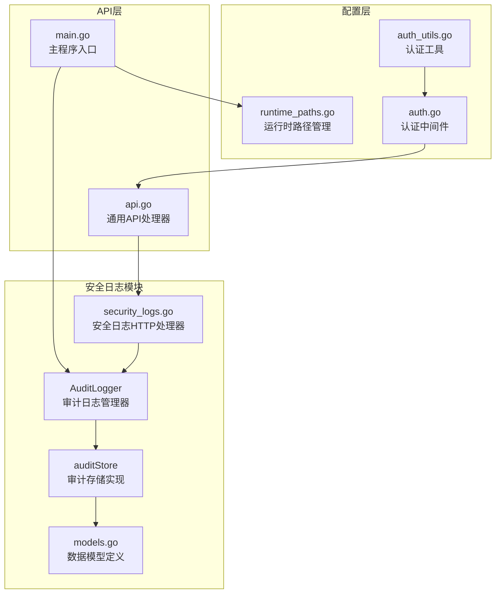
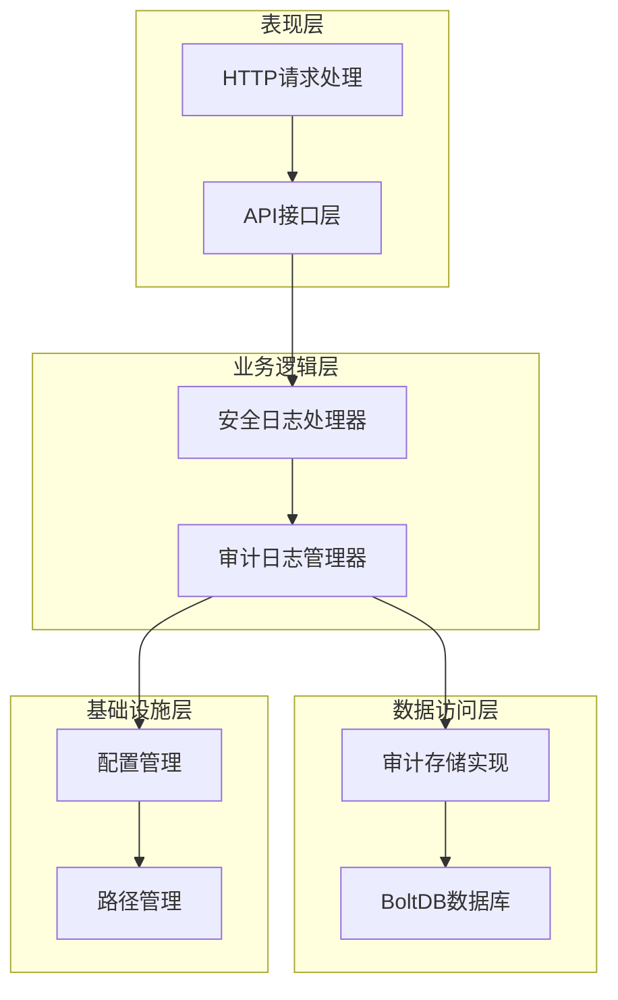
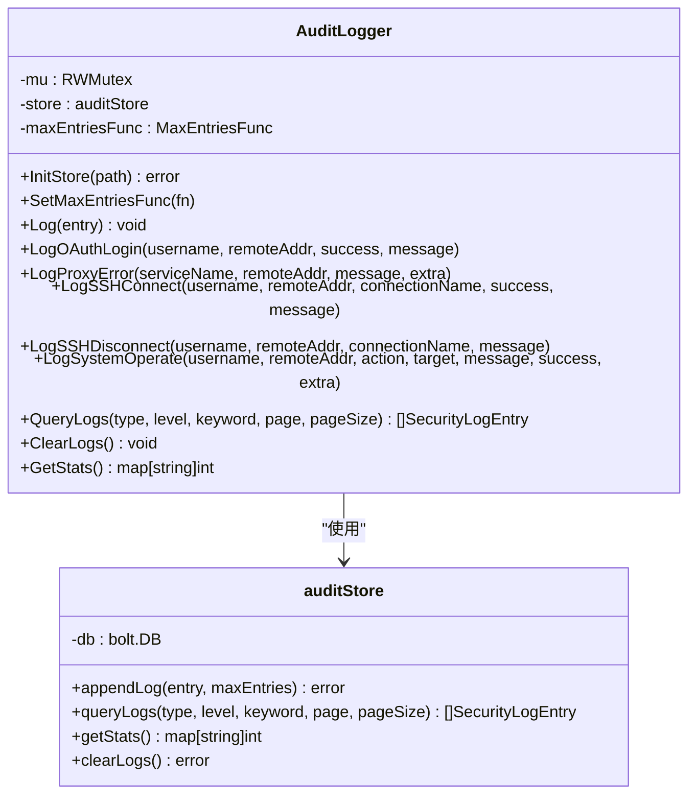
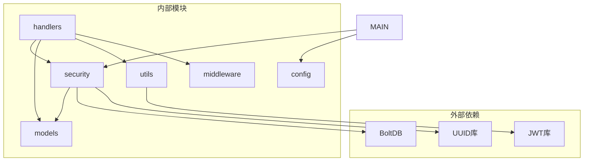

# 安全日志处理器

<cite>
**本文档引用的文件**
- [security_logs.go](file://src/handlers/security_logs.go)
- [audit_log.go](file://src/security/audit_log.go)
- [audit_store.go](file://src/security/audit_store.go)
- [models.go](file://src/models/models.go)
- [api.go](file://src/handlers/api.go)
- [main.go](file://src/main.go)
- [runtime_paths.go](file://src/config/runtime_paths.go)
- [auth.go](file://src/middleware/auth.go)
- [auth_utils.go](file://src/utils/auth.go)
</cite>

## 目录
1. [简介](#简介)
2. [项目结构](#项目结构)
3. [核心组件](#核心组件)
4. [架构概览](#架构概览)
5. [详细组件分析](#详细组件分析)
6. [依赖关系分析](#依赖关系分析)
7. [性能考虑](#性能考虑)
8. [故障排除指南](#故障排除指南)
9. [结论](#结论)
10. [附录](#附录)

## 简介

安全日志处理器是 Caddy Panel 系统中的核心安全组件，负责记录、管理和分析系统中的安全事件。该处理器实现了完整的安全审计日志管理机制，包括日志记录、分类、标签系统、查询过滤、存储归档等功能，并提供了丰富的 API 接口供前端应用调用。

系统采用基于 BoltDB 的嵌入式数据库存储，确保日志数据的持久化和高性能访问。通过统一的日志管理器模式，实现了线程安全的日志记录和查询功能。

## 项目结构

安全日志处理器位于系统的安全模块中，主要包含以下核心文件：



**图表来源**
- [security_logs.go:1-65](file://src/handlers/security_logs.go#L1-L65)
- [audit_log.go:1-224](file://src/security/audit_log.go#L1-L224)
- [audit_store.go:1-222](file://src/security/audit_store.go#L1-L222)
- [models.go:312-344](file://src/models/models.go#L312-L344)

**章节来源**
- [security_logs.go:1-65](file://src/handlers/security_logs.go#L1-L65)
- [audit_log.go:1-224](file://src/security/audit_log.go#L1-L224)
- [audit_store.go:1-222](file://src/security/audit_store.go#L1-L222)

## 核心组件

### 审计日志管理器 (AuditLogger)

AuditLogger 是安全日志处理器的核心组件，采用单例模式设计，提供统一的日志管理接口：

- **线程安全设计**：使用 RWMutex 确保并发访问的安全性
- **存储抽象**：通过 auditStore 接口实现存储层的抽象
- **动态配置**：支持运行时调整最大日志条数限制

### 审计存储 (auditStore)

auditStore 实现了基于 BoltDB 的高性能存储解决方案：

- **嵌入式数据库**：使用 BoltDB 提供 ACID 事务保证
- **复合键索引**：通过时间戳+ID组合键确保日志按时间顺序存储
- **自动清理**：实现智能的日志清理机制，防止无限增长

### 数据模型

系统定义了完整安全日志数据模型，支持多种日志类型和级别：

- **日志类型**：OAuth 登录、代理错误、SSH 连接、系统操作
- **日志级别**：信息、警告、错误
- **扩展字段**：支持额外的结构化数据存储

**章节来源**
- [audit_log.go:15-80](file://src/security/audit_log.go#L15-L80)
- [audit_store.go:22-45](file://src/security/audit_store.go#L22-L45)
- [models.go:312-344](file://src/models/models.go#L312-L344)

## 架构概览

安全日志处理器采用分层架构设计，各层职责明确：



**图表来源**
- [main.go:96-103](file://src/main.go#L96-L103)
- [security_logs.go:10-40](file://src/handlers/security_logs.go#L10-L40)
- [audit_log.go:34-51](file://src/security/audit_log.go#L34-L51)

系统架构的关键特点：

1. **分层清晰**：表现层、业务层、数据层职责分离
2. **可扩展性**：通过接口抽象支持存储层替换
3. **性能优化**：BoltDB 提供高效的键值存储
4. **安全性**：完整的认证授权机制

## 详细组件分析

### 安全日志HTTP处理器

安全日志HTTP处理器提供了完整的REST API接口：

#### 主要API端点

| 端点 | 方法 | 功能 | 参数 |
|------|------|------|------|
| `/api/security-logs` | GET | 获取安全日志列表 | type, level, keyword, page, page_size |
| `/api/security-logs` | DELETE | 清空安全日志 | 无 |
| `/api/security-logs/stats` | GET | 获取安全日志统计 | 无 |

#### 查询参数详解

- **type**：日志类型过滤（oauth_login, proxy_error, ssh_connect, system_operate）
- **level**：日志级别过滤（info, warning, error）
- **keyword**：关键词搜索（支持用户名、IP地址、目标、动作、消息）
- **page**：页码（默认1）
- **page_size**：每页大小（默认50，最大200）

**章节来源**
- [security_logs.go:10-64](file://src/handlers/security_logs.go#L10-L64)

### 审计日志管理器

AuditLogger 提供了丰富的日志记录方法：

#### 日志记录方法



**图表来源**
- [audit_log.go:15-200](file://src/security/audit_log.go#L15-L200)
- [audit_store.go:22-176](file://src/security/audit_store.go#L22-L176)

#### 日志类型分类

系统支持四种主要的日志类型：

1. **OAuth 登录日志**：记录用户认证过程
2. **代理错误日志**：记录反向代理相关的错误
3. **SSH 连接日志**：记录SSH连接的建立和断开
4. **系统操作日志**：记录管理员的重要操作

**章节来源**
- [audit_log.go:82-166](file://src/security/audit_log.go#L82-L166)
- [models.go:312-320](file://src/models/models.go#L312-L320)

### 审计存储实现

auditStore 实现了高性能的日志存储和查询功能：

#### 存储结构设计

```mermaid
erDiagram
SECURITY_LOGS {
composite_key PK
timestamp TIMESTAMP
log_entry JSON
}
LOG_ENTRY {
id STRING
timestamp TIMESTAMP
type STRING
level STRING
username STRING
remote_addr STRING
target STRING
action STRING
message STRING
success BOOLEAN
extra JSON
}
SECURITY_LOGS ||--|| LOG_ENTRY : "包含"
```

**图表来源**
- [audit_store.go:47-67](file://src/security/audit_store.go#L47-L67)
- [models.go:331-344](file://src/models/models.go#L331-L344)

#### 查询算法

存储层实现了高效的查询算法：

1. **时间顺序遍历**：使用 BoltDB 游标按时间倒序遍历
2. **多条件过滤**：支持类型、级别、关键词的组合过滤
3. **内存分页**：先加载到内存再进行分页处理

**章节来源**
- [audit_store.go:69-129](file://src/security/audit_store.go#L69-L129)
- [audit_store.go:178-196](file://src/security/audit_store.go#L178-L196)

### 数据模型定义

系统定义了完整的安全日志数据模型：

#### 安全日志条目结构

| 字段名 | 类型 | 描述 | 必填 |
|--------|------|------|------|
| id | string | 日志唯一标识符 | 否 |
| timestamp | time.Time | 日志时间戳 | 否 |
| type | SecurityLogType | 日志类型 | 是 |
| level | SecurityLogLevel | 日志级别 | 是 |
| username | string | 操作用户 | 否 |
| remote_addr | string | 来源IP地址 | 是 |
| target | string | 目标对象 | 否 |
| action | string | 操作动作 | 是 |
| message | string | 详细信息 | 是 |
| success | bool | 操作是否成功 | 是 |
| extra | map[string]any | 扩展信息 | 否 |

**章节来源**
- [models.go:331-344](file://src/models/models.go#L331-L344)

## 依赖关系分析

安全日志处理器的依赖关系清晰且层次分明：



**图表来源**
- [main.go:16-22](file://src/main.go#L16-L22)
- [audit_log.go:3-10](file://src/security/audit_log.go#L3-L10)
- [api.go:3-18](file://src/handlers/api.go#L3-L18)

### 关键依赖关系

1. **BoltDB 依赖**：提供高性能的嵌入式数据库存储
2. **JWT 依赖**：支持用户认证和授权
3. **UUID 依赖**：生成唯一的日志标识符
4. **配置依赖**：支持运行时配置管理

**章节来源**
- [main.go:96-103](file://src/main.go#L96-L103)
- [audit_log.go:34-44](file://src/security/audit_log.go#L34-L44)

## 性能考虑

安全日志处理器在设计时充分考虑了性能优化：

### 存储性能优化

1. **复合键索引**：使用时间戳+ID组合键确保高效的时间序列查询
2. **批量操作**：支持批量日志写入和清理操作
3. **内存管理**：合理控制内存使用，避免内存泄漏

### 查询性能优化

1. **游标遍历**：使用 BoltDB 游标实现高效的顺序遍历
2. **条件过滤**：在遍历过程中实时应用过滤条件
3. **分页处理**：先加载到内存再进行分页，减少数据库访问次数

### 并发性能优化

1. **读写锁分离**：读操作使用共享锁，写操作使用独占锁
2. **原子操作**：确保日志记录的原子性和一致性
3. **异步处理**：日志写入采用异步方式，避免阻塞主线程

## 故障排除指南

### 常见问题及解决方案

#### 日志存储初始化失败

**问题症状**：
- 启动时出现 "初始化安全日志存储失败" 错误
- 日志无法正常记录

**可能原因**：
1. 存储路径权限不足
2. BoltDB 文件损坏
3. 磁盘空间不足

**解决步骤**：
1. 检查运行时路径权限
2. 验证磁盘空间
3. 重新初始化存储

#### 日志查询性能问题

**问题症状**：
- 日志查询响应缓慢
- 大量日志导致内存占用过高

**解决方法**：
1. 适当调整 page_size 参数
2. 使用更精确的过滤条件
3. 清理历史日志

#### 并发访问冲突

**问题症状**：
- 日志记录时出现竞争条件
- 数据不一致

**解决方法**：
1. 确保使用单例模式访问 AuditLogger
2. 避免在高并发场景下频繁清空日志
3. 合理设置最大日志条数限制

**章节来源**
- [audit_store.go:26-44](file://src/security/audit_store.go#L26-L44)
- [audit_log.go:72-80](file://src/security/audit_log.go#L72-L80)

## 结论

安全日志处理器是一个设计精良、功能完整的安全审计系统。通过采用分层架构、嵌入式数据库存储和线程安全设计，系统能够高效地处理大量的安全日志数据。

主要优势包括：
- **高性能存储**：基于 BoltDB 的嵌入式数据库提供优异的性能
- **灵活查询**：支持多维度的过滤和搜索功能
- **线程安全**：完善的并发控制机制确保数据一致性
- **易于扩展**：清晰的接口设计支持功能扩展

该系统为 Caddy Panel 提供了强大的安全审计能力，能够满足企业级应用的安全监控需求。

## 附录

### API 调用示例

#### 获取安全日志列表
```
GET /api/security-logs?type=oauth_login&level=warning&page=1&page_size=50
Authorization: Bearer <token>
```

#### 获取日志统计
```
GET /api/security-logs/stats
Authorization: Bearer <token>
```

#### 清空安全日志
```
DELETE /api/security-logs
Authorization: Bearer <token>
```

### 配置选项

| 配置项 | 默认值 | 描述 |
|--------|--------|------|
| max_security_log_entries | 5000 | 最大安全日志条数 |
| log_retention_days | 30 | 日志保留天数 |
| admin_port | 8080 | 管理后台端口 |

### 合规性要求

系统设计符合以下安全标准：
- **数据完整性**：使用 BoltDB 确保数据持久化
- **访问控制**：完整的认证授权机制
- **审计追踪**：所有重要操作都有日志记录
- **数据最小化**：只存储必要的日志信息