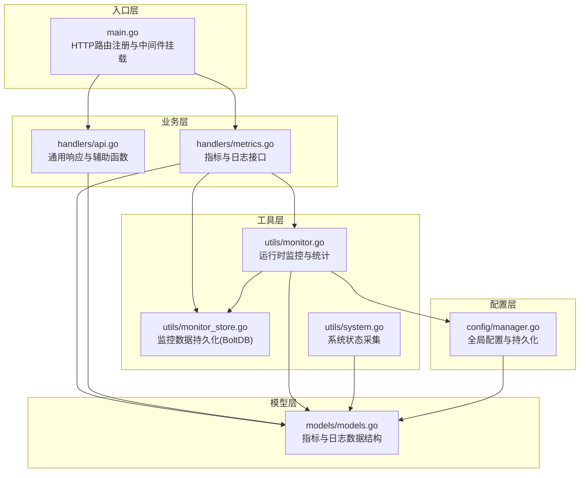
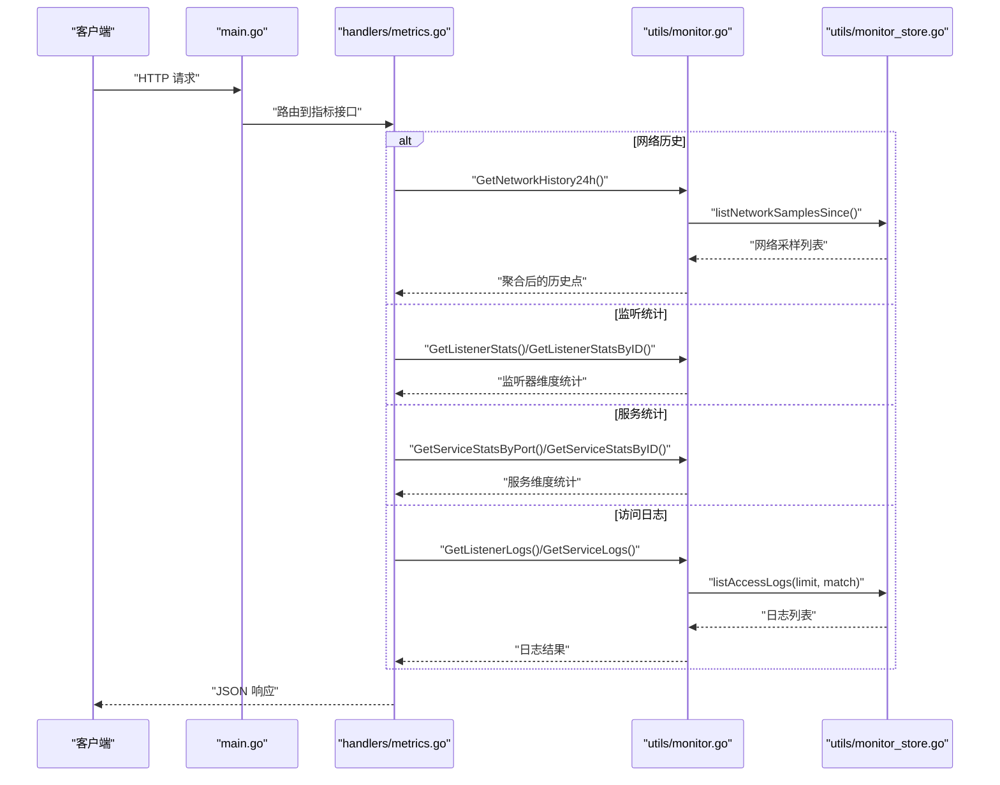
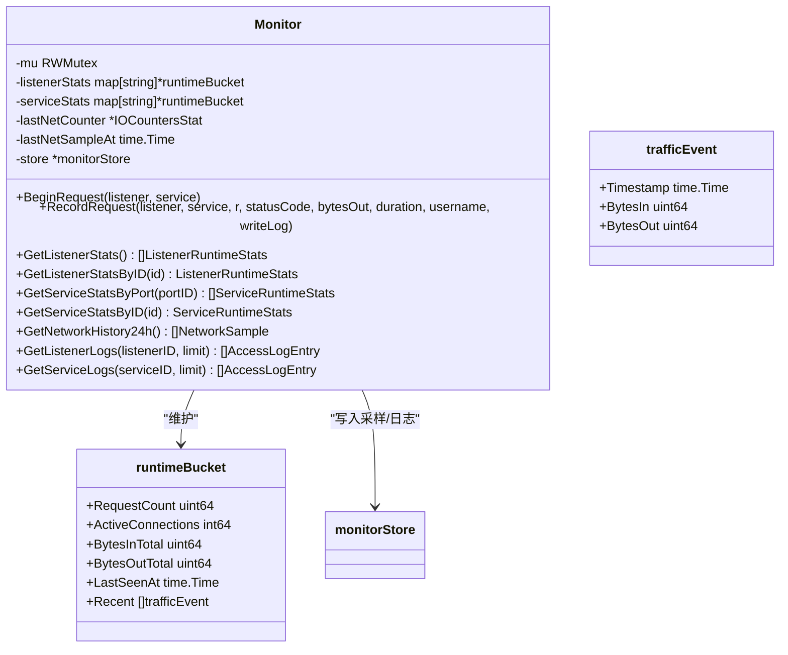
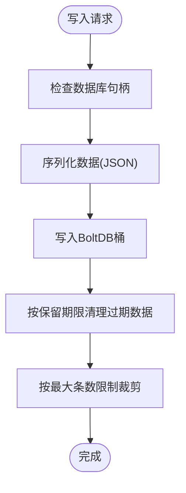
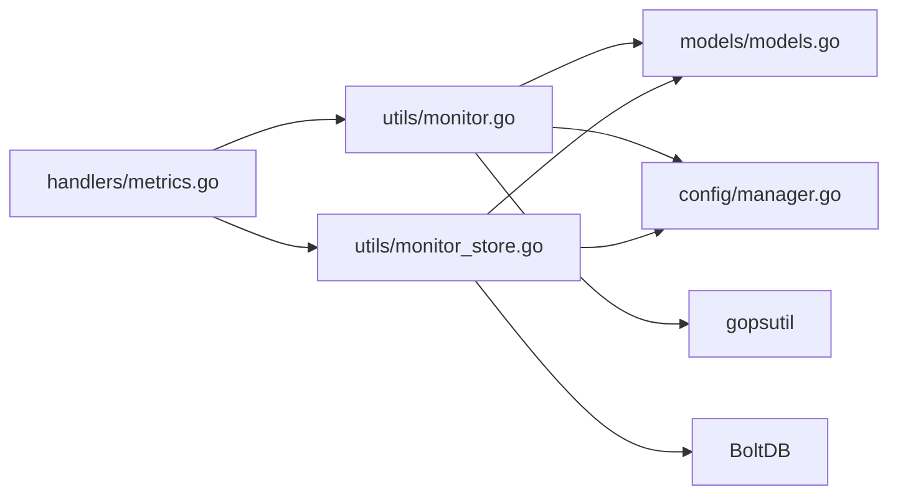

# 指标处理器

<cite>
**本文引用的文件**
- [src/main.go](file://src/main.go)
- [src/handlers/metrics.go](file://src/handlers/metrics.go)
- [src/handlers/api.go](file://src/handlers/api.go)
- [src/utils/monitor.go](file://src/utils/monitor.go)
- [src/utils/monitor_store.go](file://src/utils/monitor_store.go)
- [src/utils/system.go](file://src/utils/system.go)
- [src/models/models.go](file://src/models/models.go)
- [src/config/manager.go](file://src/config/manager.go)
</cite>

## 目录
1. [简介](#简介)
2. [项目结构](#项目结构)
3. [核心组件](#核心组件)
4. [架构总览](#架构总览)
5. [详细组件分析](#详细组件分析)
6. [依赖分析](#依赖分析)
7. [性能考量](#性能考量)
8. [故障排查指南](#故障排查指南)
9. [结论](#结论)
10. [附录](#附录)

## 简介
本文件面向“指标处理器”的全面技术文档，聚焦系统监控指标的采集、计算与聚合，实时性能数据的获取与缓存策略，监控数据的存储与查询接口，以及监控告警阈值的配置与触发机制。文档同时提供指标 API 的调用示例与数据分析指南，帮助读者快速理解并高效使用监控能力。

## 项目结构
系统采用分层架构：入口层负责路由与中间件，业务层提供指标与日志接口，工具层负责监控采集与持久化，模型层定义数据结构，配置层提供全局参数与持久化配置。

图表来源
- [src/main.go:112-429](file://src/main.go#L112-L429)
- [src/handlers/metrics.go:11-52](file://src/handlers/metrics.go#L11-L52)
- [src/utils/monitor.go:38-65](file://src/utils/monitor.go#L38-L65)
- [src/utils/monitor_store.go:26-54](file://src/utils/monitor_store.go#L26-L54)
- [src/utils/system.go:19-82](file://src/utils/system.go#L19-L82)
- [src/models/models.go:18-70](file://src/models/models.go#L18-L70)
- [src/config/manager.go:227-241](file://src/config/manager.go#L227-L241)

章节来源
- [src/main.go:112-429](file://src/main.go#L112-L429)
- [src/handlers/metrics.go:11-52](file://src/handlers/metrics.go#L11-L52)
- [src/utils/monitor.go:38-65](file://src/utils/monitor.go#L38-L65)
- [src/utils/monitor_store.go:26-54](file://src/utils/monitor_store.go#L26-L54)
- [src/utils/system.go:19-82](file://src/utils/system.go#L19-L82)
- [src/models/models.go:18-70](file://src/models/models.go#L18-L70)
- [src/config/manager.go:227-241](file://src/config/manager.go#L227-L241)

## 核心组件
- 指标采集与缓存：运行时监控器负责每分钟采样网络速率、维护监听器与服务的活跃连接、请求数、累计入/出字节与最近事件窗口，同时将网络采样写入 BoltDB。
- 指标聚合与统计：通过时间窗口滑动聚合，计算每分钟的入/出速率，支持按监听器与服务维度的聚合。
- 存储与查询：网络采样与访问日志分别存储在 BoltDB 的不同桶中，提供基于时间范围与限制数量的查询接口。
- API 接口：提供网络历史、监听器统计、服务统计、访问日志查询等接口，统一返回 JSON 响应。
- 配置与阈值：全局配置项包含日志保留天数与最大访问日志条数，用于控制存储上限与清理策略。

章节来源
- [src/utils/monitor.go:78-117](file://src/utils/monitor.go#L78-L117)
- [src/utils/monitor.go:231-251](file://src/utils/monitor.go#L231-L251)
- [src/utils/monitor_store.go:56-100](file://src/utils/monitor_store.go#L56-L100)
- [src/utils/monitor_store.go:102-155](file://src/utils/monitor_store.go#L102-L155)
- [src/handlers/metrics.go:11-52](file://src/handlers/metrics.go#L11-L52)
- [src/config/manager.go:288-299](file://src/config/manager.go#L288-L299)

## 架构总览
指标处理器由“采集-缓存-聚合-存储-查询-接口”构成闭环，核心流程如下：

图表来源
- [src/main.go:132-138](file://src/main.go#L132-L138)
- [src/handlers/metrics.go:11-52](file://src/handlers/metrics.go#L11-L52)
- [src/utils/monitor.go:323-355](file://src/utils/monitor.go#L323-L355)
- [src/utils/monitor.go:253-321](file://src/utils/monitor.go#L253-L321)
- [src/utils/monitor.go:357-380](file://src/utils/monitor.go#L357-L380)
- [src/utils/monitor_store.go:77-100](file://src/utils/monitor_store.go#L77-L100)
- [src/utils/monitor_store.go:127-155](file://src/utils/monitor_store.go#L127-L155)

## 详细组件分析

### 运行时监控器（Monitor）
- 职责
  - 每分钟采样系统网络 IO，计算入/出速率并写入 BoltDB。
  - 维护监听器与服务的运行时统计：请求计数、活跃连接、累计入/出字节、最近事件窗口。
  - 提供按监听器与服务维度的统计查询接口。
- 关键数据结构
  - 运行时桶：记录请求计数、活跃连接、累计字节、最后活跃时间与最近事件窗口。
  - 流量事件：包含时间戳与入/出字节。
- 时间窗口与聚合
  - 使用固定时间窗口（1 分钟）对最近事件进行求和，得到每分钟入/出速率。
- 并发与锁
  - 读写锁保护统计数据，确保并发安全。
- 网络采样
  - 采样间隔为 1 分钟，保留 24 小时，使用 BoltDB 按时间键存储。

图表来源
- [src/utils/monitor.go:38-65](file://src/utils/monitor.go#L38-L65)
- [src/utils/monitor.go:29-36](file://src/utils/monitor.go#L29-L36)
- [src/utils/monitor.go:23-27](file://src/utils/monitor.go#L23-L27)

章节来源
- [src/utils/monitor.go:38-65](file://src/utils/monitor.go#L38-L65)
- [src/utils/monitor.go:78-117](file://src/utils/monitor.go#L78-L117)
- [src/utils/monitor.go:119-189](file://src/utils/monitor.go#L119-L189)
- [src/utils/monitor.go:220-251](file://src/utils/monitor.go#L220-L251)
- [src/utils/monitor.go:253-321](file://src/utils/monitor.go#L253-L321)
- [src/utils/monitor.go:323-355](file://src/utils/monitor.go#L323-L355)
- [src/utils/monitor.go:357-380](file://src/utils/monitor.go#L357-L380)

### 监控存储（monitorStore）
- 职责
  - 使用 BoltDB 存储两类数据：网络采样与访问日志。
  - 提供追加与查询接口，支持按时间范围与限制数量查询。
  - 自动清理过期数据：按保留天数与最大条数限制。
- 键设计
  - 网络采样：仅时间戳键，保证单调递增。
  - 访问日志：时间戳+ID 复合键，确保唯一性与有序遍历。
- 清理策略
  - 按时间戳清理早于保留期限的数据。
  - 当超过最大条数时，从最早开始删除多余条目。

图表来源
- [src/utils/monitor_store.go:56-75](file://src/utils/monitor_store.go#L56-L75)
- [src/utils/monitor_store.go:102-125](file://src/utils/monitor_store.go#L102-L125)
- [src/utils/monitor_store.go:157-186](file://src/utils/monitor_store.go#L157-L186)

章节来源
- [src/utils/monitor_store.go:26-54](file://src/utils/monitor_store.go#L26-L54)
- [src/utils/monitor_store.go:56-100](file://src/utils/monitor_store.go#L56-L100)
- [src/utils/monitor_store.go:102-155](file://src/utils/monitor_store.go#L102-L155)
- [src/utils/monitor_store.go:157-186](file://src/utils/monitor_store.go#L157-L186)
- [src/utils/monitor_store.go:188-199](file://src/utils/monitor_store.go#L188-L199)
- [src/utils/monitor_store.go:201-207](file://src/utils/monitor_store.go#L201-L207)

### 指标 API 与日志接口
- 网络历史（24小时）
  - 方法：GET
  - 路径：/api/metrics/network-history
  - 查询：按 10 分钟为桶，计算每桶的入/出速率均值。
- 监听统计
  - 方法：GET
  - 路径：/api/metrics/listeners
  - 查询：返回所有监听器的运行时统计。
- 服务统计
  - 方法：GET
  - 路径：/api/metrics/services?port_id=...
  - 查询：按端口 ID 返回该端口下所有服务的运行时统计。
- 监听访问日志
  - 方法：GET
  - 路径：/api/logs/listeners/{listener_id}?limit=...
  - 查询：按监听器 ID 过滤，限制返回条数。
- 服务访问日志
  - 方法：GET
  - 路径：/api/logs/services/{service_id}?limit=...
  - 查询：按服务 ID 过滤，限制返回条数。
- 通用响应
  - 所有接口统一返回 JSON 结构，包含 success、data、error/message 字段。

章节来源
- [src/main.go:132-138](file://src/main.go#L132-L138)
- [src/handlers/metrics.go:11-52](file://src/handlers/metrics.go#L11-L52)
- [src/handlers/api.go:95-114](file://src/handlers/api.go#L95-L114)

### 数据模型与聚合
- 模型
  - NetworkSample：时间戳、入/出速率。
  - RuntimeStats：请求计数、活跃连接、累计入/出字节、最近时间、入/出速率。
  - ListenerRuntimeStats、ServiceRuntimeStats：在 RuntimeStats 基础上附加标识字段。
  - AccessLogEntry：访问日志条目，包含监听器/服务信息、请求元数据、耗时与字节数等。
- 聚合
  - 速率 = 窗口内字节增量 / 窗口时长（1 分钟）。
  - 历史聚合：按 10 分钟桶，计算桶内采样点的均值。

章节来源
- [src/models/models.go:18-70](file://src/models/models.go#L18-L70)
- [src/models/models.go:25-51](file://src/models/models.go#L25-L51)
- [src/utils/monitor.go:231-251](file://src/utils/monitor.go#L231-L251)
- [src/utils/monitor.go:323-355](file://src/utils/monitor.go#L323-L355)

## 依赖分析
- 组件耦合
  - handlers/metrics.go 依赖 utils/monitor.go 与 utils/monitor_store.go。
  - utils/monitor.go 依赖 config/manager.go 与 models/。
  - utils/monitor_store.go 依赖 config/manager.go 与 models/。
- 外部依赖
  - BoltDB：轻量级嵌入式数据库，用于持久化网络采样与访问日志。
  - gopsutil：系统信息与网络 IO 采样。
- 循环依赖
  - 未发现循环依赖，模块职责清晰。

图表来源
- [src/handlers/metrics.go:8](file://src/handlers/metrics.go#L8)
- [src/utils/monitor.go:9-13](file://src/utils/monitor.go#L9-L13)
- [src/utils/monitor_store.go:13](file://src/utils/monitor_store.go#L13)
- [src/config/manager.go:18](file://src/config/manager.go#L18)

章节来源
- [src/handlers/metrics.go:8](file://src/handlers/metrics.go#L8)
- [src/utils/monitor.go:9-13](file://src/utils/monitor.go#L9-L13)
- [src/utils/monitor_store.go:13](file://src/utils/monitor_store.go#L13)
- [src/config/manager.go:18](file://src/config/manager.go#L18)

## 性能考量
- 采样频率与窗口
  - 网络采样：1 分钟一次，保留 24 小时，适合短期趋势分析。
  - 速率计算：1 分钟窗口，兼顾实时性与稳定性。
- 存储与查询
  - BoltDB 读写键为时间戳，查询按时间范围扫描，性能稳定。
  - 访问日志按时间倒序遍历，限制返回条数，避免全表扫描。
- 内存与并发
  - 运行时统计使用滑动窗口，窗口长度固定，内存占用可控。
  - 读写锁保护共享状态，降低锁竞争。
- 建议
  - 对高频查询可考虑增加索引或缓存热点数据。
  - 控制日志保留天数与最大条数，平衡存储与查询成本。

[本节为通用性能讨论，不直接分析具体文件]

## 故障排查指南
- 网络采样为空
  - 检查 gopsutil 采样是否成功，确认系统权限与平台兼容性。
  - 查看 BoltDB 是否正常打开与写入。
- 日志查询为空
  - 确认 limit 参数是否过大或过小，注意默认限制。
  - 检查过滤条件（监听器/服务 ID）是否正确。
- 存储清理异常
  - 检查保留天数与最大条数配置，确认清理逻辑是否触发。
  - 核对 BoltDB 权限与磁盘空间。

章节来源
- [src/utils/monitor.go:78-117](file://src/utils/monitor.go#L78-L117)
- [src/utils/monitor_store.go:56-75](file://src/utils/monitor_store.go#L56-L75)
- [src/utils/monitor_store.go:102-125](file://src/utils/monitor_store.go#L102-L125)
- [src/utils/monitor_store.go:157-186](file://src/utils/monitor_store.go#L157-L186)

## 结论
指标处理器通过“定时采样-滑动窗口-聚合统计-持久化-查询接口”的完整链路，实现了对系统网络与服务运行状态的可观测性。其设计简洁、扩展性强，既满足短期趋势分析，又具备良好的存储与查询效率。结合全局配置项，可灵活控制日志保留与容量，满足不同规模场景的需求。

[本节为总结性内容，不直接分析具体文件]

## 附录

### 指标 API 调用示例
- 获取网络历史（24小时，按 10 分钟桶）
  - 方法：GET
  - 路径：/api/metrics/network-history
  - 返回：数组，元素包含时间戳与入/出速率
- 获取监听统计
  - 方法：GET
  - 路径：/api/metrics/listeners
  - 返回：数组，元素包含监听器 ID、端口与运行时统计
- 获取服务统计（按端口）
  - 方法：GET
  - 路径：/api/metrics/services?port_id=...
  - 返回：数组，元素包含服务 ID、监听器 ID、服务名称、域名、类型与运行时统计
- 获取监听访问日志
  - 方法：GET
  - 路径：/api/logs/listeners/{listener_id}?limit=...
  - 返回：数组，元素为访问日志条目
- 获取服务访问日志
  - 方法：GET
  - 路径：/api/logs/services/{service_id}?limit=...
  - 返回：数组，元素为访问日志条目

章节来源
- [src/main.go:132-138](file://src/main.go#L132-L138)
- [src/handlers/metrics.go:11-52](file://src/handlers/metrics.go#L11-L52)

### 监控告警阈值配置与触发机制
- 配置项
  - 日志保留天数：控制 BoltDB 中访问日志的保留期限。
  - 最大访问日志条数：控制 BoltDB 中访问日志的最大条数，超出时从最早开始删除。
- 触发机制
  - 通过查询接口返回的统计数据与阈值比较，可在应用层实现告警逻辑（例如：入/出速率超过阈值、活跃连接数异常升高、错误码占比上升等）。
- 建议
  - 将阈值配置化，支持动态调整。
  - 结合历史数据与趋势分析，减少误报。

章节来源
- [src/config/manager.go:288-299](file://src/config/manager.go#L288-L299)
- [src/utils/monitor_store.go:188-199](file://src/utils/monitor_store.go#L188-L199)

### 数据分析指南
- 网络速率分析
  - 使用网络历史接口获取 24 小时入/出速率，观察峰值与均值变化，识别异常波动。
- 连接与吞吐分析
  - 结合活跃连接与累计字节，评估服务负载与资源占用。
- 访问日志分析
  - 通过监听器与服务日志，定位错误、慢请求与异常访问模式。
- 趋势预测
  - 基于历史采样点的滑动平均与回归分析，预测未来趋势（需在应用层实现）。

[本节为通用分析指导，不直接分析具体文件]