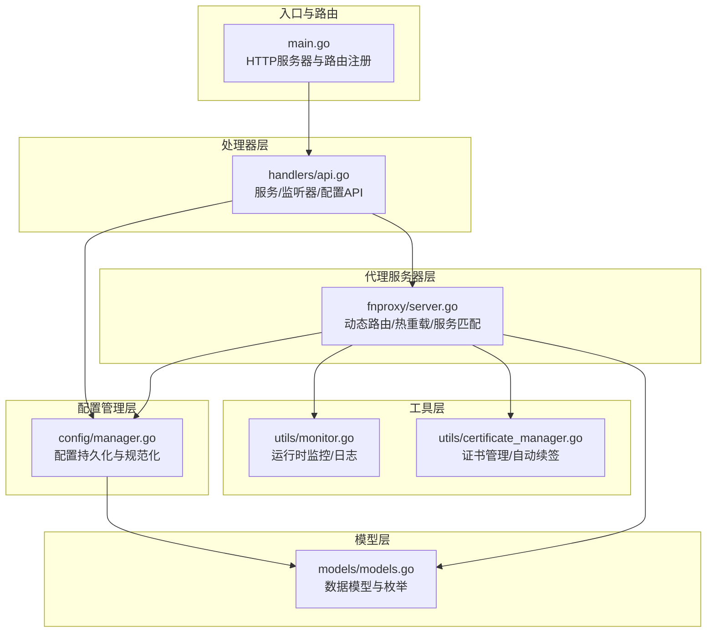
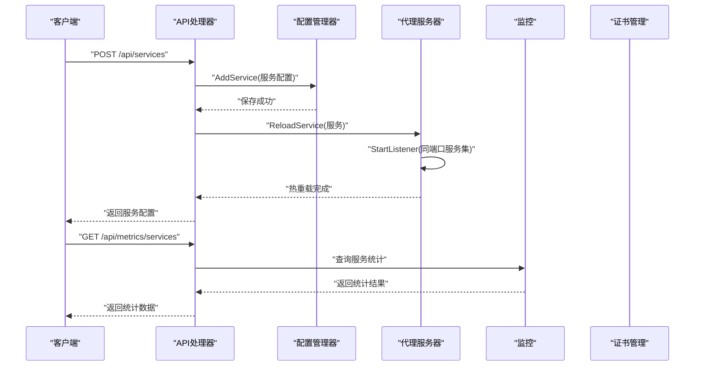
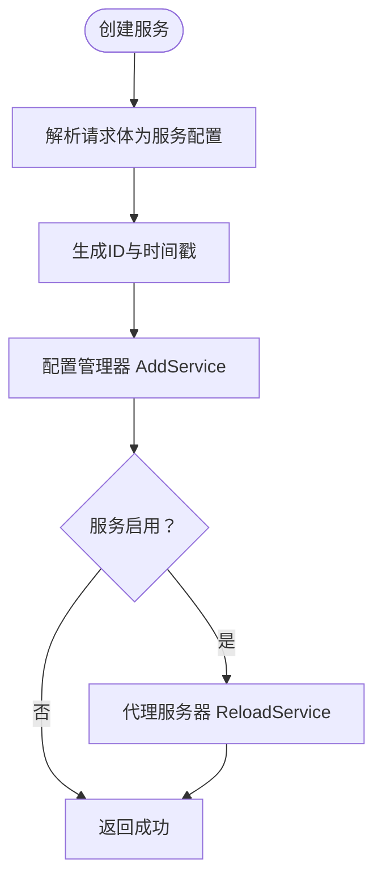
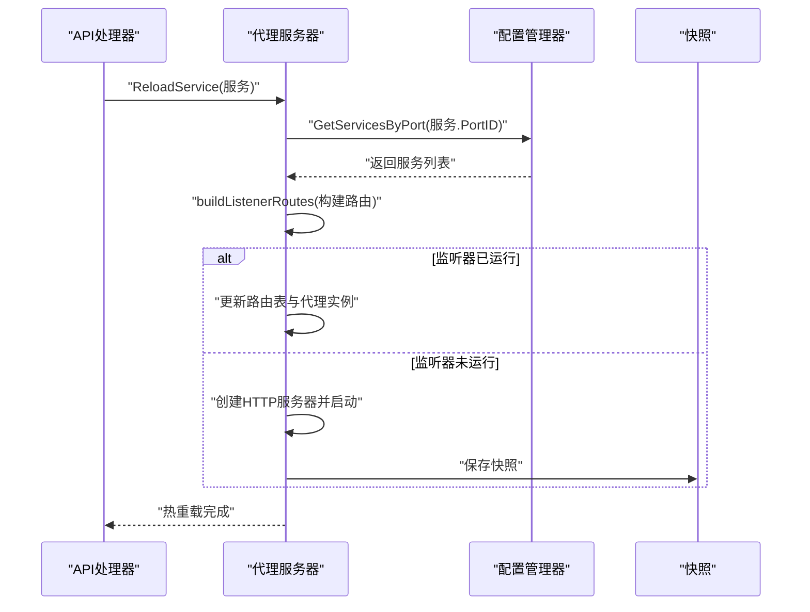
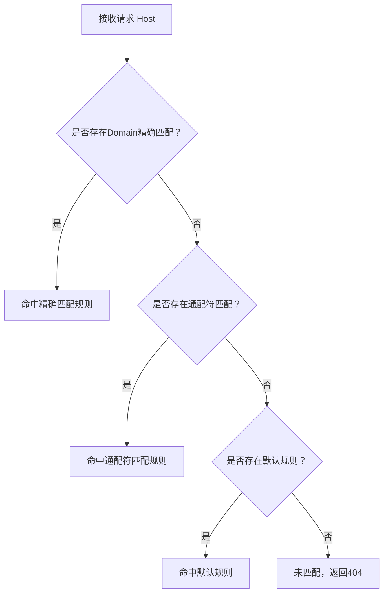
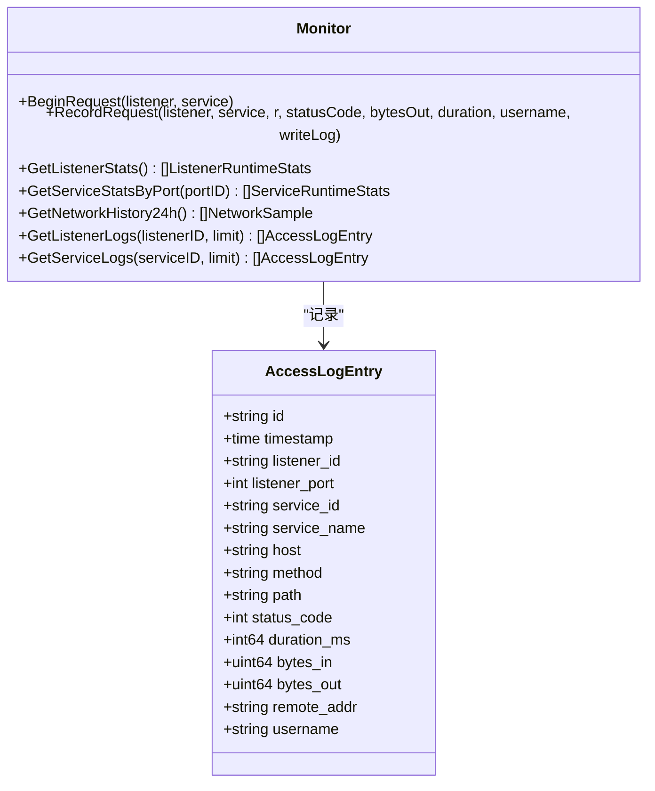
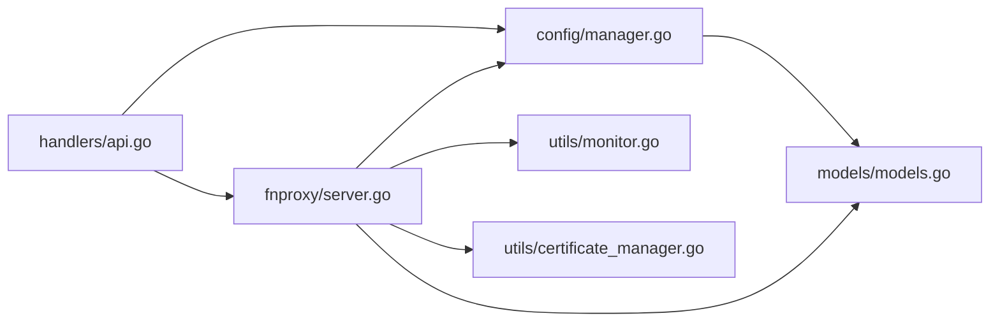

# 服务处理器

<cite>
**本文引用的文件**
- [src/main.go](file://src/main.go)
- [src/handlers/api.go](file://src/handlers/api.go)
- [src/config/manager.go](file://src/config/manager.go)
- [src/models/models.go](file://src/models/models.go)
- [src/fnproxy/server.go](file://src/fnproxy/server.go)
- [src/utils/monitor.go](file://src/utils/monitor.go)
- [src/utils/certificate_manager.go](file://src/utils/certificate_manager.go)
- [README.md](file://README.md)
</cite>

## 目录
1. [简介](#简介)
2. [项目结构](#项目结构)
3. [核心组件](#核心组件)
4. [架构总览](#架构总览)
5. [详细组件分析](#详细组件分析)
6. [依赖关系分析](#依赖关系分析)
7. [性能考量](#性能考量)
8. [故障排查指南](#故障排查指南)
9. [结论](#结论)
10. [附录](#附录)

## 简介
本文件面向服务处理器的技术文档，系统阐述服务规则的管理机制（创建、更新、删除、排序）、服务配置的验证规则与约束、服务热重载的实现原理与配置同步策略、服务优先级排序与匹配算法、性能监控与故障诊断方法，以及最佳实践与常见配置模式。读者可据此快速理解并高效运维基于 HTTP/HTTPS 的多域服务路由体系。

## 项目结构
项目采用分层架构：入口程序负责路由注册与生命周期管理；处理器层负责 API 请求解析与业务校验；配置管理层负责持久化与内存状态维护；代理服务器层负责动态路由、热重载与服务匹配；工具层提供监控、证书管理等支撑能力。

图示来源
- [src/main.go:112-430](file://src/main.go#L112-L430)
- [src/handlers/api.go:377-529](file://src/handlers/api.go#L377-L529)
- [src/config/manager.go:18-72](file://src/config/manager.go#L18-L72)
- [src/fnproxy/server.go:37-49](file://src/fnproxy/server.go#L37-L49)
- [src/utils/monitor.go:38-65](file://src/utils/monitor.go#L38-L65)
- [src/utils/certificate_manager.go:126-151](file://src/utils/certificate_manager.go#L126-L151)
- [src/models/models.go:72-107](file://src/models/models.go#L72-L107)

章节来源
- [src/main.go:112-430](file://src/main.go#L112-L430)
- [README.md:20-42](file://README.md#L20-L42)

## 核心组件
- 配置管理器：负责应用配置的加载、保存、规范化与并发安全访问，提供监听器、服务、证书、用户、防火墙等子配置的增删改查与排序。
- 代理服务器：负责监听器生命周期管理、动态路由构建、服务处理器创建、热重载与证书选择。
- 处理器：负责服务规则的 CRUD、排序、启停与重载，配合配置管理器与代理服务器完成配置落地与生效。
- 监控与日志：记录访问统计、网络流量、访问日志，支持查询与历史趋势。
- 证书管理：支持导入、外部配置同步、ACME 申请与自动续签，按域名动态选择证书。

章节来源
- [src/config/manager.go:18-72](file://src/config/manager.go#L18-L72)
- [src/fnproxy/server.go:37-49](file://src/fnproxy/server.go#L37-L49)
- [src/handlers/api.go:377-529](file://src/handlers/api.go#L377-L529)
- [src/utils/monitor.go:38-65](file://src/utils/monitor.go#L38-L65)
- [src/utils/certificate_manager.go:126-151](file://src/utils/certificate_manager.go#L126-L151)

## 架构总览
服务处理器围绕“配置—代理—监控—证书”四条主线协作：配置层提供持久化与规范化；代理层负责动态路由与热重载；监控层提供可观测性；证书层保障 HTTPS 正常运行。

图示来源
- [src/handlers/api.go:389-414](file://src/handlers/api.go#L389-L414)
- [src/fnproxy/server.go:1253-1256](file://src/fnproxy/server.go#L1253-L1256)
- [src/utils/monitor.go:253-321](file://src/utils/monitor.go#L253-L321)

## 详细组件分析

### 服务规则管理机制
- 创建服务
  - 接口：POST /api/services
  - 流程：解析请求体为服务配置；生成唯一ID与时间戳；调用配置管理器添加；若启用则触发对应监听器热重载。
  - 校验：服务配置字段合法性由代理服务器在创建处理器时进一步校验（如反代上游地址必填）。
- 更新服务
  - 接口：PUT /api/services/{id}
  - 流程：解析请求体；更新时间戳；调用配置管理器更新；若监听器启用则触发热重载。
- 删除服务
  - 接口：DELETE /api/services/{id}
  - 流程：调用配置管理器删除；若监听器启用则触发热重载。
- 启停服务
  - 接口：POST /api/services/{id}/toggle
  - 流程：切换 Enabled 状态；若监听器启用则触发热重载。
- 排序服务
  - 接口：POST /api/services/reorder
  - 请求体：port_id 与 ordered_ids 列表
  - 流程：配置管理器按 ID 列表重排排序；若监听器启用则触发热重载。

图示来源
- [src/handlers/api.go:389-414](file://src/handlers/api.go#L389-L414)
- [src/config/manager.go:355-373](file://src/config/manager.go#L355-L373)
- [src/fnproxy/server.go:1253-1256](file://src/fnproxy/server.go#L1253-L1256)

章节来源
- [src/handlers/api.go:389-469](file://src/handlers/api.go#L389-L469)
- [src/config/manager.go:355-407](file://src/config/manager.go#L355-L407)
- [src/fnproxy/server.go:1253-1256](file://src/fnproxy/server.go#L1253-L1256)

### 服务配置验证规则与约束
- 通用字段
  - ID、Name、Type、Domain、SortOrder、Enabled、RequireAuth、Config、CreatedAt、UpdatedAt
  - Domain 支持通配符“*”，表示默认规则
- 反向代理（reverse_proxy）
  - Config 中 Upstream 必须非空，且需为合法 URL（含 scheme/host）
  - 支持 HostHeader、StripPathPrefix、AddPathPrefix、HeaderUp/Down、HideHeaderUp/Down、BufferRequests、TrustProxyHeaders 等高级选项
- 静态文件（static）
  - Config 中 Root 必须非空；可选 Index、Browse、OAuth、AccessLog
- 重定向（redirect）
  - Config 中 To 必须非空
- URL 跳转（url_jump）
  - Config 中 TargetURL 必须非空；可选 PreservePath
- 文本输出（text_output）
  - Config 中 Body 必须非空；可选 ContentType、StatusCode、OAuth、AccessLog

章节来源
- [src/models/models.go:93-163](file://src/models/models.go#L93-L163)
- [src/fnproxy/server.go:460-584](file://src/fnproxy/server.go#L460-L584)
- [src/fnproxy/server.go:804-851](file://src/fnproxy/server.go#L804-L851)
- [src/fnproxy/server.go:1043-1063](file://src/fnproxy/server.go#L1043-L1063)
- [src/fnproxy/server.go:1065-1089](file://src/fnproxy/server.go#L1065-L1089)
- [src/fnproxy/server.go:1091-1117](file://src/fnproxy/server.go#L1091-L1117)

### 服务热重载实现原理与配置同步策略
- 热重载触发点
  - 服务创建/更新/删除：调用代理服务器 ReloadService，间接触发 StartListener
  - 监听器启停：调用 StartListener/StopListener
  - 监听器重载：调用 ReloadListener
- 实现细节
  - 若监听器已运行：仅更新路由表与代理实例，不重启底层 HTTP 服务器
  - 若监听器未运行：创建新 HTTP 服务器并启动
  - 发生错误时：尝试回滚到上次正确快照，保证稳定性
- 配置同步
  - 配置管理器负责持久化与规范化；代理服务器在热重载时从配置管理器读取最新配置
  - 证书管理器与证书配置联动，按域名动态选择证书

图示来源
- [src/handlers/api.go:406-411](file://src/handlers/api.go#L406-L411)
- [src/fnproxy/server.go:228-425](file://src/fnproxy/server.go#L228-L425)

章节来源
- [src/fnproxy/server.go:228-425](file://src/fnproxy/server.go#L228-L425)
- [src/handlers/api.go:406-411](file://src/handlers/api.go#L406-L411)

### 服务优先级排序与匹配算法
- 排序规则
  - 同端口下，优先级由 SortOrder 决定；未设置或为 0 的规则按创建时间升序排列
  - 默认规则（Domain 为空或为“*”）优先级最低，最后匹配
- 匹配算法
  - 精确匹配优先：Domain 与 Host 完全相等
  - 通配符匹配次之：支持单段通配符（如 *.example.com），转换为正则进行匹配
  - 默认规则兜底：若无精确或通配符匹配，使用默认规则
- 服务类型与认证
  - 服务启用 OAuth 或 RequireAuth 时，未登录用户会被重定向至 OAuth 登录页

图示来源
- [src/fnproxy/server.go:1277-1303](file://src/fnproxy/server.go#L1277-L1303)
- [src/fnproxy/server.go:1305-1321](file://src/fnproxy/server.go#L1305-L1321)

章节来源
- [src/fnproxy/server.go:1277-1321](file://src/fnproxy/server.go#L1277-L1321)
- [src/config/manager.go:313-341](file://src/config/manager.go#L313-L341)

### 性能监控与故障诊断
- 监控指标
  - 监听器与服务维度：请求总数、活跃连接数、入/出字节总量、入/出速率、最近活跃时间
  - 网络历史：24 小时内每 10 分钟平均入/出速率
  - 访问日志：支持按监听器或服务过滤
- 故障诊断
  - 代理错误：反向代理错误会记录安全日志，便于定位上游问题
  - OAuth 登录：登录失败原因会记录审计日志，便于排查认证问题
  - 证书问题：证书加载失败、续签失败会记录错误并更新状态

图示来源
- [src/utils/monitor.go:38-65](file://src/utils/monitor.go#L38-L65)
- [src/utils/monitor.go:131-189](file://src/utils/monitor.go#L131-L189)
- [src/utils/monitor.go:253-321](file://src/utils/monitor.go#L253-L321)
- [src/models/models.go:53-70](file://src/models/models.go#L53-L70)

章节来源
- [src/utils/monitor.go:131-189](file://src/utils/monitor.go#L131-L189)
- [src/utils/monitor.go:253-321](file://src/utils/monitor.go#L253-L321)
- [src/models/models.go:53-70](file://src/models/models.go#L53-L70)

### 证书管理与 HTTPS
- 支持三种证书来源：导入（imported）、外部配置同步（file_sync）、ACME（acme）
- 自动续签：按配置周期扫描到期证书并续签
- 动态选择：按 SNI 与服务显式绑定优先匹配证书，未匹配使用回退证书
- ACME 校验：内置 HTTP-01 校验响应，支持 DNS-01（阿里云、腾讯云、Cloudflare）

章节来源
- [src/utils/certificate_manager.go:126-151](file://src/utils/certificate_manager.go#L126-L151)
- [src/utils/certificate_manager.go:192-216](file://src/utils/certificate_manager.go#L192-L216)
- [src/utils/certificate_manager.go:253-269](file://src/utils/certificate_manager.go#L253-L269)
- [src/utils/certificate_manager.go:287-306](file://src/utils/certificate_manager.go#L287-L306)

## 依赖关系分析
- 处理器依赖配置管理器进行 CRUD 与排序，依赖代理服务器进行热重载
- 代理服务器依赖配置管理器获取最新配置，依赖监控与证书管理器提供观测与 TLS
- 配置管理器依赖模型层的数据结构与枚举

图示来源
- [src/handlers/api.go:377-529](file://src/handlers/api.go#L377-L529)
- [src/config/manager.go:18-72](file://src/config/manager.go#L18-L72)
- [src/fnproxy/server.go:37-49](file://src/fnproxy/server.go#L37-L49)
- [src/utils/monitor.go:38-65](file://src/utils/monitor.go#L38-L65)
- [src/utils/certificate_manager.go:126-151](file://src/utils/certificate_manager.go#L126-L151)
- [src/models/models.go:72-107](file://src/models/models.go#L72-L107)

章节来源
- [src/handlers/api.go:377-529](file://src/handlers/api.go#L377-L529)
- [src/config/manager.go:18-72](file://src/config/manager.go#L18-L72)
- [src/fnproxy/server.go:37-49](file://src/fnproxy/server.go#L37-L49)

## 性能考量
- 连接复用：反向代理使用共享 Transport，启用 Keep-Alive 与连接池，降低握手开销
- 路由匹配：O(n) 线性扫描，结合默认规则与通配符优化，满足中小规模规则集
- 监控窗口：最近 1 分钟窗口计算速率，兼顾实时性与平滑度
- 证书加载：内存缓存已加载证书，减少磁盘 IO 与解析成本

章节来源
- [src/fnproxy/server.go:142-161](file://src/fnproxy/server.go#L142-L161)
- [src/utils/monitor.go:220-251](file://src/utils/monitor.go#L220-L251)
- [src/utils/certificate_manager.go:218-251](file://src/utils/certificate_manager.go#L218-L251)

## 故障排查指南
- 服务创建失败
  - 检查 Config 字段是否符合服务类型要求（如反代 Upstream 必填）
  - 查看代理服务器错误日志与安全日志
- 热重载失败
  - 查看代理服务器错误日志，确认是否触发回滚到上次正确快照
  - 检查监听器端口占用与权限
- 匹配不到规则
  - 确认 Domain 是否与 Host 完全匹配或通配符匹配
  - 检查默认规则是否被意外覆盖
- OAuth 登录失败
  - 查看审计日志中的失败原因
  - 确认用户状态与密码哈希
- 证书问题
  - 查看证书状态与错误信息
  - 确认 ACME 校验路径与 DNS 提供商配置

章节来源
- [src/fnproxy/server.go:557-572](file://src/fnproxy/server.go#L557-L572)
- [src/utils/certificate_manager.go:192-216](file://src/utils/certificate_manager.go#L192-L216)
- [src/fnproxy/server.go:1178-1251](file://src/fnproxy/server.go#L1178-L1251)

## 结论
服务处理器通过清晰的分层设计与严格的配置校验，实现了服务规则的全生命周期管理与稳定热重载；结合完善的监控与证书管理能力，能够满足生产环境对可靠性与可观测性的要求。建议在生产环境中合理设置排序与默认规则，启用访问日志与审计日志，并定期检查证书状态与续签计划。

## 附录

### API 调用示例（路径与说明）
- 创建服务
  - 方法：POST
  - 路径：/api/services
  - 请求体：服务配置对象（含 Type、Domain、Config、Enabled 等）
  - 响应：服务配置对象
- 更新服务
  - 方法：PUT
  - 路径：/api/services/{id}
  - 请求体：服务配置对象（含 Type、Domain、Config、Enabled 等）
  - 响应：服务配置对象
- 删除服务
  - 方法：DELETE
  - 路径：/api/services/{id}
  - 响应：空
- 启停服务
  - 方法：POST
  - 路径：/api/services/{id}/toggle
  - 响应：服务配置对象
- 排序服务
  - 方法：POST
  - 路径：/api/services/reorder
  - 请求体：{ port_id, ordered_ids[] }
  - 响应：端口下服务列表
- 查询服务统计
  - 方法：GET
  - 路径：/api/metrics/services
  - 响应：服务统计数组

章节来源
- [src/handlers/api.go:389-469](file://src/handlers/api.go#L389-L469)
- [src/handlers/api.go:471-494](file://src/handlers/api.go#L471-L494)
- [src/utils/monitor.go:253-321](file://src/utils/monitor.go#L253-L321)

### 配置模板（字段说明）
- 通用字段
  - id: 服务唯一标识
  - port_id: 所属监听器 ID
  - name: 服务名称
  - type: 服务类型（reverse_proxy/static/redirect/url_jump/text_output）
  - domain: 域名，支持“*”默认规则
  - sort_order: 排序权重，数值越小优先级越高
  - certificate_id: 显式绑定证书 ID（可选）
  - enabled: 是否启用
  - require_auth: 是否需要认证
  - config: 服务类型对应的配置对象
  - created_at/updated_at: 时间戳
- 反向代理配置（reverse_proxy）
  - name: 服务名称
  - domain: 域名
  - upstream: 上游地址（必填）
  - timeout: 超时秒数
  - oauth/access_log: 是否启用 OAuth 与访问日志
  - health_check: 是否启用健康检查
  - preserve_host/host_header: 保留或自定义 Host
  - strip_path_prefix/add_path_prefix: 路径前缀处理
  - header_up/header_down: 请求/响应头增改
  - hide_header_up/hide_header_down: 隐藏请求/响应头
  - buffer_requests/trust_proxy_headers: 缓冲请求体与信任代理头
- 静态文件配置（static）
  - root: 根目录（必填）
  - index: 默认索引文件
  - browse: 是否允许目录浏览
  - oauth/access_log: 是否启用 OAuth 与访问日志
- 重定向配置（redirect）
  - to: 重定向目标（必填）
  - oauth/access_log: 是否启用 OAuth 与访问日志
- URL 跳转配置（url_jump）
  - target_url: 目标 URL（必填）
  - oauth/access_log: 是否启用 OAuth 与访问日志
  - preserve_path: 是否保留路径
- 文本输出配置（text_output）
  - content_type: Content-Type
  - body: 响应内容（必填）
  - status_code: HTTP 状态码
  - oauth/access_log: 是否启用 OAuth 与访问日志

章节来源
- [src/models/models.go:93-163](file://src/models/models.go#L93-L163)