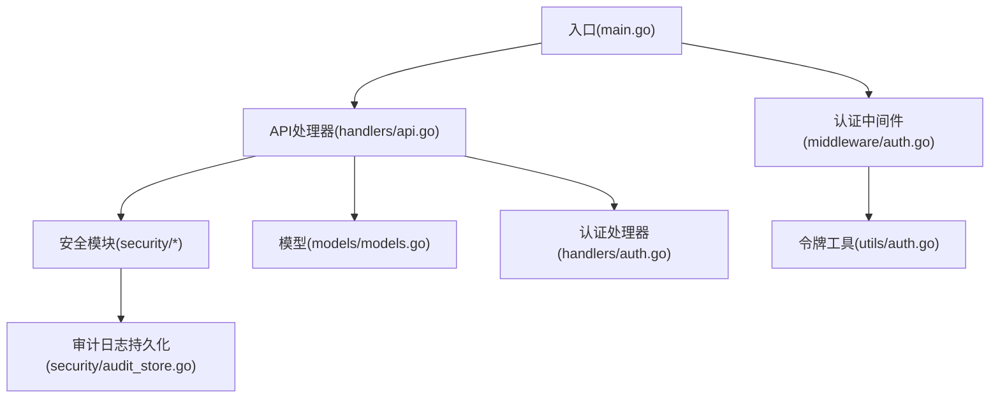
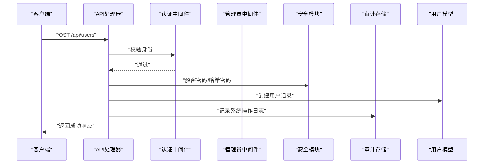
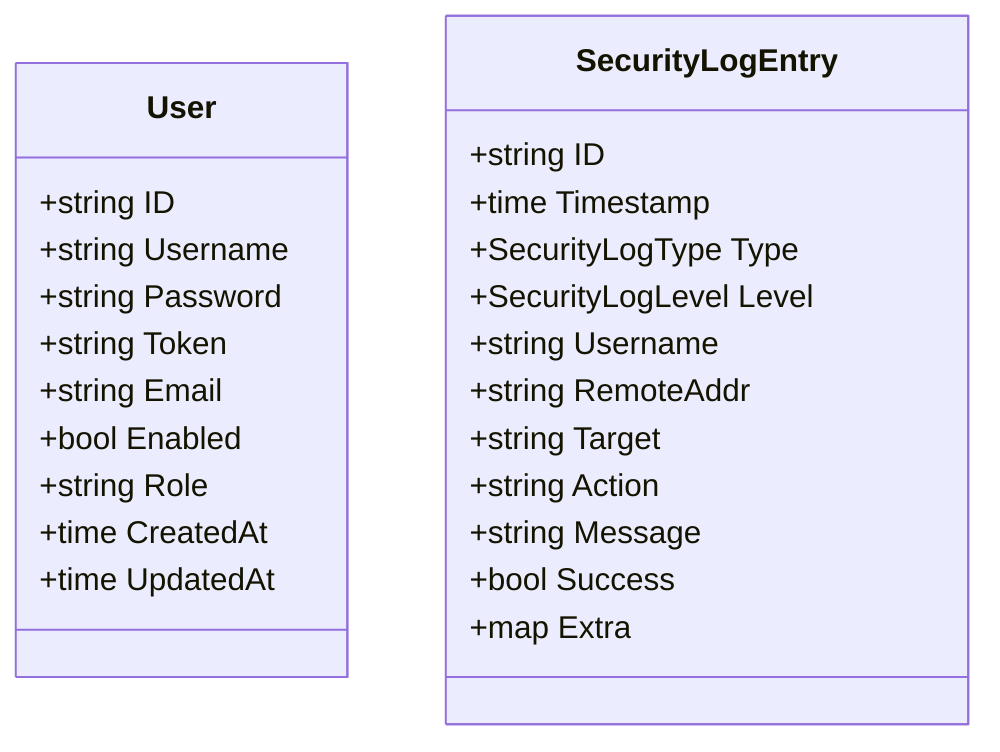
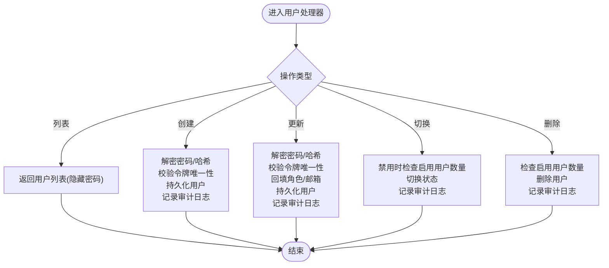
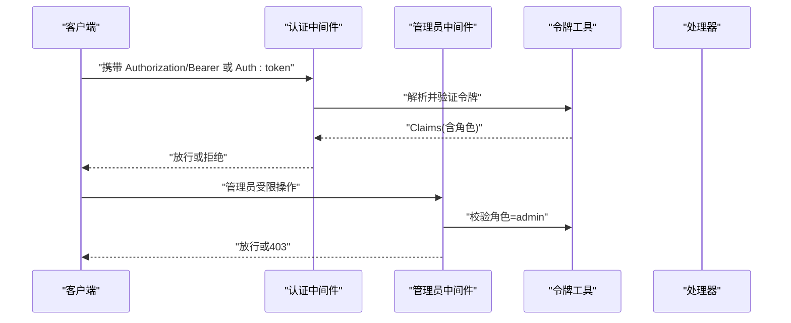
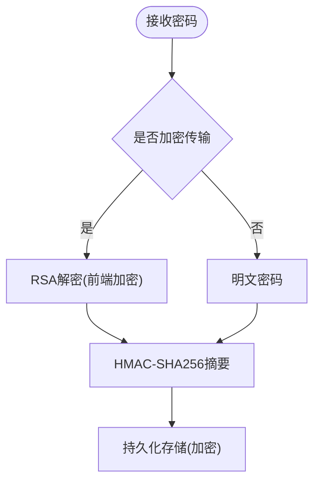
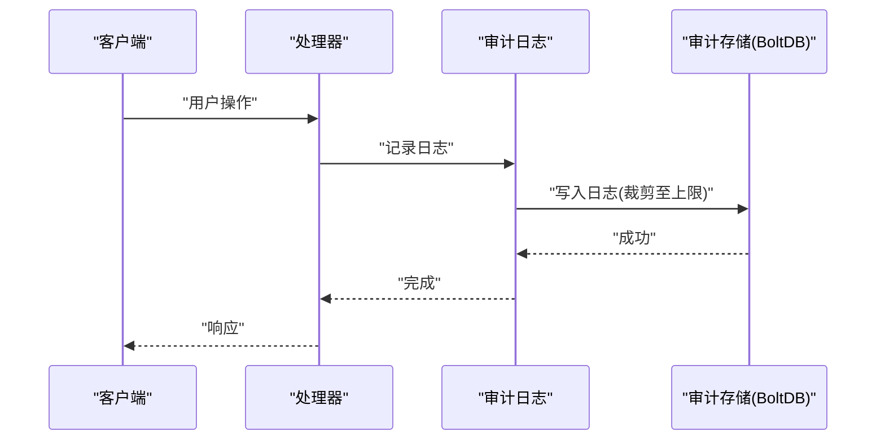
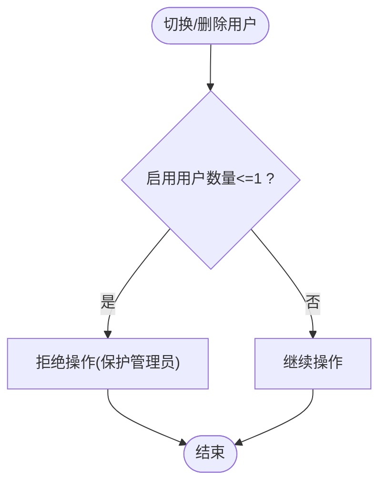
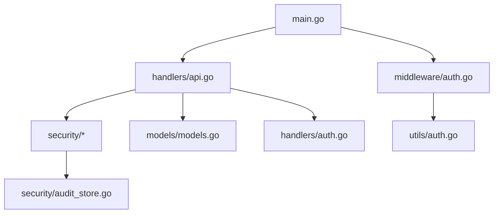

# 用户处理器

<cite>
**本文引用的文件**
- [src/main.go](file://src/main.go)
- [src/models/models.go](file://src/models/models.go)
- [src/handlers/api.go](file://src/handlers/api.go)
- [src/handlers/auth.go](file://src/handlers/auth.go)
- [src/middleware/auth.go](file://src/middleware/auth.go)
- [src/utils/auth.go](file://src/utils/auth.go)
- [src/security/password.go](file://src/security/password.go)
- [src/security/audit_log.go](file://src/security/audit_log.go)
- [src/security/audit_store.go](file://src/security/audit_store.go)
- [README.md](file://README.md)
</cite>

## 目录
1. [简介](#简介)
2. [项目结构](#项目结构)
3. [核心组件](#核心组件)
4. [架构总览](#架构总览)
5. [详细组件分析](#详细组件分析)
6. [依赖关系分析](#依赖关系分析)
7. [性能考量](#性能考量)
8. [故障排查指南](#故障排查指南)
9. [结论](#结论)
10. [附录](#附录)

## 简介
本文件面向“用户处理器”的技术文档，围绕用户管理的完整流程进行深入说明，包括用户创建、更新、删除与状态切换；权限控制与角色管理机制；密码加密与令牌管理的安全实现；会话管理与安全审计日志；用户数量限制与管理员保护策略；以及用户管理 API 的调用示例与安全最佳实践。同时补充批量用户操作与导入导出能力的现状说明与扩展建议。

## 项目结构
用户处理器位于后端服务的 API 层，配合认证中间件、安全模块与模型层共同完成用户生命周期管理。主要涉及以下模块：
- 入口与路由：主程序注册用户相关 API 路由并挂载中间件
- 处理器：用户增删改查、状态切换、令牌校验与安全日志记录
- 中间件：认证与权限控制（管理员）
- 安全：密码哈希、令牌签发与校验、OAuth 登录、审计日志持久化
- 模型：用户数据结构与安全日志结构

图表来源
- [src/main.go:229-260](file://src/main.go#L229-L260)
- [src/handlers/api.go:531-730](file://src/handlers/api.go#L531-L730)
- [src/middleware/auth.go:14-91](file://src/middleware/auth.go#L14-L91)
- [src/utils/auth.go:24-53](file://src/utils/auth.go#L24-L53)
- [src/security/audit_store.go:26-45](file://src/security/audit_store.go#L26-L45)

章节来源
- [src/main.go:229-260](file://src/main.go#L229-L260)
- [README.md:105-196](file://README.md#L105-L196)

## 核心组件
- 用户模型：包含用户标识、用户名、加密存储的密码、可选令牌、邮箱、启用状态、角色、创建/更新时间等字段
- 用户处理器：提供用户列表、创建、更新、删除、状态切换等接口
- 认证与权限：支持 JWT Cookie 登录、Header Token 登录、管理员权限校验
- 安全模块：密码哈希、令牌签发与校验、OAuth 登录、审计日志记录与持久化
- 审计日志：支持查询、统计、清理，具备容量上限与过期策略

章节来源
- [src/models/models.go:256-267](file://src/models/models.go#L256-L267)
- [src/handlers/api.go:531-730](file://src/handlers/api.go#L531-L730)
- [src/handlers/auth.go:37-115](file://src/handlers/auth.go#L37-L115)
- [src/middleware/auth.go:75-91](file://src/middleware/auth.go#L75-L91)
- [src/security/audit_log.go:15-224](file://src/security/audit_log.go#L15-L224)

## 架构总览
用户处理器的整体交互流程如下：
- 客户端通过 API 发起用户管理请求
- 认证中间件校验请求身份，必要时交由管理员中间件进一步校验
- 处理器对请求进行参数校验、令牌唯一性检查、密码解密与哈希、数据持久化
- 成功后记录系统操作审计日志
- 返回标准化响应

图表来源
- [src/handlers/api.go:541-579](file://src/handlers/api.go#L541-L579)
- [src/middleware/auth.go:14-55](file://src/middleware/auth.go#L14-L55)
- [src/security/password.go:44-70](file://src/security/password.go#L44-L70)
- [src/security/audit_log.go:62-80](file://src/security/audit_log.go#L62-L80)

## 详细组件分析

### 用户模型与数据结构
- 用户结构包含：标识、用户名、加密密码、可选令牌、邮箱、启用状态、角色、创建/更新时间
- 安全日志结构包含：类型、级别、用户名、来源 IP、目标、动作、消息、成功标志、额外信息等

图表来源
- [src/models/models.go:256-267](file://src/models/models.go#L256-L267)
- [src/models/models.go:332-344](file://src/models/models.go#L332-L344)

章节来源
- [src/models/models.go:256-267](file://src/models/models.go#L256-L267)
- [src/models/models.go:332-344](file://src/models/models.go#L332-L344)

### 用户管理 API 流程
- 列表：返回用户列表，隐藏密码字段
- 创建：校验令牌唯一性，解密并哈希密码，持久化用户，记录审计日志
- 更新：支持密码解密与哈希，令牌唯一性校验，角色与邮箱回填，记录审计日志
- 状态切换：禁用时确保至少保留一个启用用户，记录审计日志
- 删除：删除前确保至少保留一个启用用户，记录审计日志

图表来源
- [src/handlers/api.go:531-730](file://src/handlers/api.go#L531-L730)

章节来源
- [src/handlers/api.go:531-730](file://src/handlers/api.go#L531-L730)

### 权限控制与角色管理
- 角色：支持 admin 与 user 两类角色
- 管理员中间件：强制要求角色为 admin
- 认证中间件：支持 Authorization Bearer 与 Auth Header Token 两种方式
- Header Token：用户可配置独立 token，请求头携带后可直接视为已登录

图表来源
- [src/middleware/auth.go:14-91](file://src/middleware/auth.go#L14-L91)
- [src/utils/auth.go:24-53](file://src/utils/auth.go#L24-L53)
- [src/handlers/auth.go:37-115](file://src/handlers/auth.go#L37-L115)

章节来源
- [src/middleware/auth.go:75-91](file://src/middleware/auth.go#L75-L91)
- [src/utils/auth.go:86-139](file://src/utils/auth.go#L86-L139)
- [src/handlers/auth.go:37-115](file://src/handlers/auth.go#L37-L115)

### 密码加密与令牌管理
- 密码加密：使用 HMAC-SHA256 对明文密码进行摘要，前缀标识安全哈希
- 令牌签发：JWT，包含用户名、角色、签发/过期时间，支持 Cookie 存储
- OAuth 登录：前端加密提交，服务端 RSA 解密，生成 JWT 并记录审计日志

图表来源
- [src/security/password.go:44-70](file://src/security/password.go#L44-L70)
- [src/handlers/api.go:52-62](file://src/handlers/api.go#L52-L62)
- [src/handlers/auth.go:212-242](file://src/handlers/auth.go#L212-L242)

章节来源
- [src/security/password.go:44-70](file://src/security/password.go#L44-L70)
- [src/handlers/api.go:52-62](file://src/handlers/api.go#L52-L62)
- [src/handlers/auth.go:212-242](file://src/handlers/auth.go#L212-L242)

### 会话管理与安全审计
- 会话：JWT 无状态，客户端删除 token 即可登出
- 审计日志：记录 OAuth 登录、代理错误、SSH 连接、系统操作等，支持查询、统计、清理
- 存储：基于 BoltDB，按时间复合键存储，自动裁剪至最大条数

图表来源
- [src/handlers/api.go:573-578](file://src/handlers/api.go#L573-L578)
- [src/security/audit_log.go:62-80](file://src/security/audit_log.go#L62-L80)
- [src/security/audit_store.go:47-67](file://src/security/audit_store.go#L47-L67)

章节来源
- [src/handlers/auth.go:84-88](file://src/handlers/auth.go#L84-L88)
- [src/security/audit_log.go:62-80](file://src/security/audit_log.go#L62-L80)
- [src/security/audit_store.go:47-67](file://src/security/audit_store.go#L47-L67)

### 用户数量限制与管理员保护
- 禁用保护：切换用户状态为禁用时，若当前启用用户仅剩一个，则拒绝禁用
- 删除保护：删除用户时，若目标用户处于启用状态且启用用户仅剩一个，则拒绝删除
- 管理员保护：管理员中间件确保敏感操作仅管理员可执行

图表来源
- [src/handlers/api.go:660-672](file://src/handlers/api.go#L660-L672)
- [src/handlers/api.go:696-718](file://src/handlers/api.go#L696-L718)
- [src/middleware/auth.go:75-91](file://src/middleware/auth.go#L75-L91)

章节来源
- [src/handlers/api.go:660-672](file://src/handlers/api.go#L660-L672)
- [src/handlers/api.go:696-718](file://src/handlers/api.go#L696-L718)
- [src/middleware/auth.go:75-91](file://src/middleware/auth.go#L75-L91)

### 批量用户操作与导入导出
- 现状：代码库未提供批量用户操作与导入导出的专用 API
- 建议：可在现有用户处理器基础上扩展批量创建/更新/删除接口，并提供 CSV/JSON 导入导出能力，注意：
  - 导入时逐条校验令牌唯一性与密码解密
  - 导出时隐藏敏感字段（密码、令牌）
  - 批量操作需结合事务与错误回滚策略

章节来源
- [src/handlers/api.go:531-730](file://src/handlers/api.go#L531-L730)

## 依赖关系分析
- 入口路由依赖处理器与中间件
- 处理器依赖安全模块与模型
- 审计日志依赖持久化存储
- 认证中间件依赖令牌工具
- OAuth 登录依赖前端加密与服务端 RSA 解密

图表来源
- [src/main.go:229-260](file://src/main.go#L229-L260)
- [src/handlers/api.go:531-730](file://src/handlers/api.go#L531-L730)
- [src/middleware/auth.go:14-91](file://src/middleware/auth.go#L14-L91)
- [src/utils/auth.go:24-53](file://src/utils/auth.go#L24-L53)
- [src/security/audit_store.go:26-45](file://src/security/audit_store.go#L26-L45)

章节来源
- [src/main.go:229-260](file://src/main.go#L229-L260)
- [src/handlers/api.go:531-730](file://src/handlers/api.go#L531-L730)
- [src/middleware/auth.go:14-91](file://src/middleware/auth.go#L14-L91)
- [src/utils/auth.go:24-53](file://src/utils/auth.go#L24-L53)
- [src/security/audit_store.go:26-45](file://src/security/audit_store.go#L26-L45)

## 性能考量
- 密码哈希：HMAC-SHA256 计算开销低，适合高频登录场景
- 审计日志：BoltDB 写入采用时间复合键，查询按时间倒序，支持裁剪上限，避免无限增长
- 中间件链路：认证与权限检查在请求早期执行，减少后续处理成本
- 批量操作：建议引入分页与事务，避免一次性处理过多数据导致阻塞

## 故障排查指南
- 登录失败：检查用户名是否存在、账户是否启用、密码是否正确
- 令牌无效：确认 Authorization 头格式、JWT 密钥配置、Cookie Secure/SameSite 设置
- 禁用/删除失败：确认是否违反“至少保留一个启用用户”的保护策略
- 审计日志异常：检查日志存储路径权限、最大条数配置、数据库打开超时

章节来源
- [src/handlers/auth.go:37-115](file://src/handlers/auth.go#L37-L115)
- [src/utils/auth.go:86-139](file://src/utils/auth.go#L86-L139)
- [src/handlers/api.go:660-672](file://src/handlers/api.go#L660-L672)
- [src/handlers/api.go:696-718](file://src/handlers/api.go#L696-L718)
- [src/security/audit_store.go:31-44](file://src/security/audit_store.go#L31-L44)

## 结论
用户处理器在认证、权限、密码与令牌管理、审计日志等方面实现了完整的安全闭环。通过严格的管理员保护策略与审计日志记录，有效保障了用户管理的安全性与可追溯性。建议在未来扩展批量操作与导入导出能力，并持续优化日志存储与查询性能。

## 附录

### 用户管理 API 调用示例与最佳实践
- 创建用户
  - 方法：POST /api/users
  - 请求体：用户名、可选密码（前端加密）、可选令牌、邮箱、启用状态、角色
  - 最佳实践：密码使用前端加密传输；令牌需唯一；记录审计日志
- 更新用户
  - 方法：PUT /api/users/{id}
  - 请求体：可选密码（前端加密）、令牌、邮箱、启用状态、角色
  - 最佳实践：密码为空则保留原密码；令牌唯一性校验；记录审计日志
- 状态切换
  - 方法：POST /api/users/{id}/toggle
  - 最佳实践：禁用时确保至少保留一个启用用户；记录审计日志
- 删除用户
  - 方法：DELETE /api/users/{id}
  - 最佳实践：删除启用用户时确保至少保留一个启用用户；记录审计日志
- 管理后台登录
  - 方法：POST /api/login
  - 最佳实践：使用 HTTPS；Cookie 设置 Secure；支持记住登录
- Header Token 登录
  - 方法：Authorization: Bearer <32位token> 或 Auth: <token>
  - 最佳实践：区分用户 token 与 JWT；避免冲突

章节来源
- [src/handlers/api.go:531-730](file://src/handlers/api.go#L531-L730)
- [src/handlers/auth.go:37-115](file://src/handlers/auth.go#L37-L115)
- [README.md:180-196](file://README.md#L180-L196)