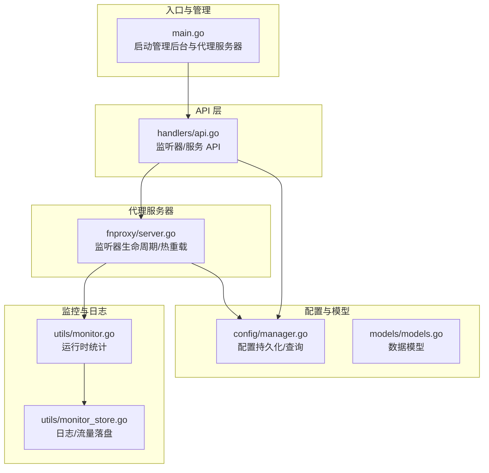
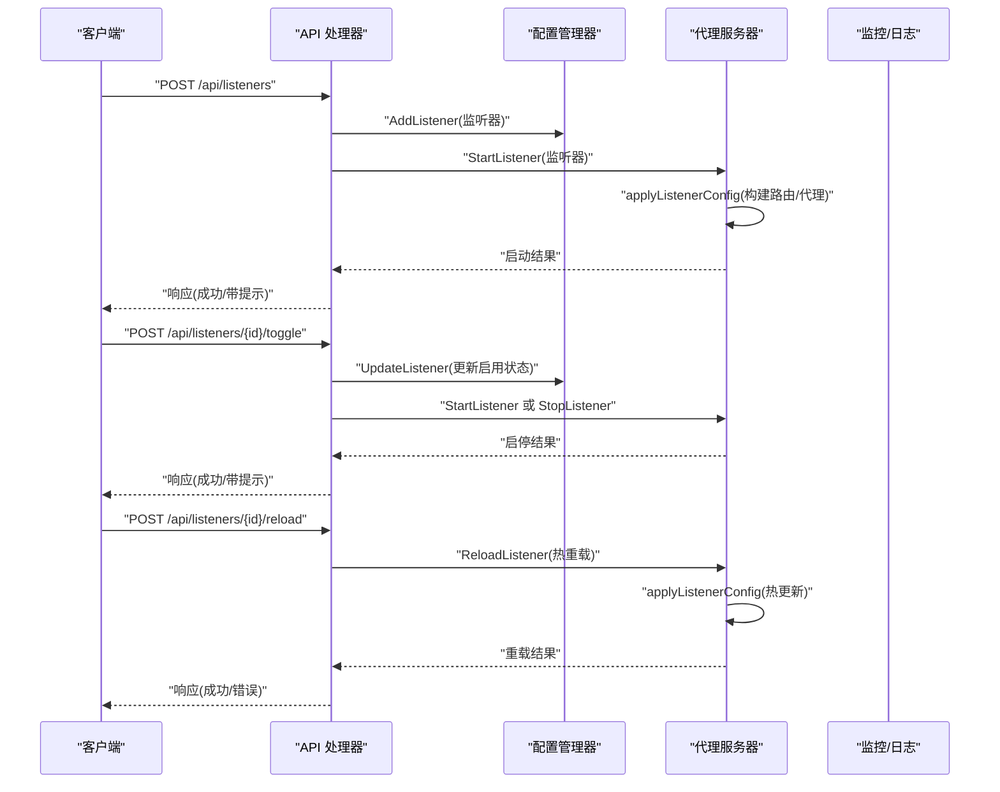
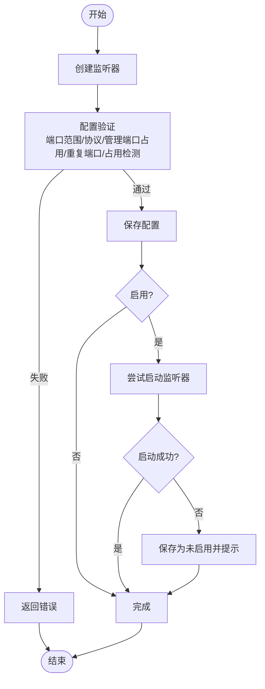
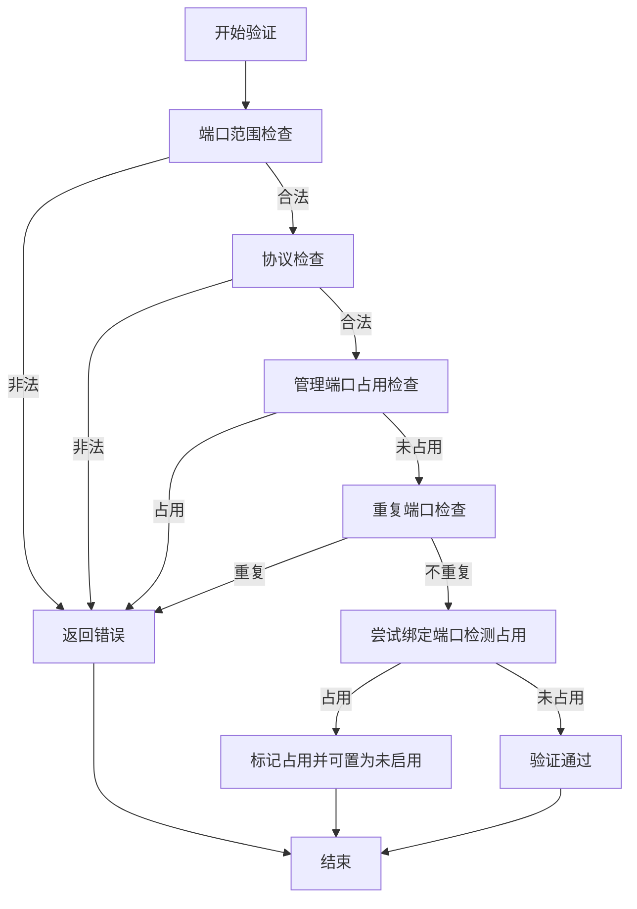
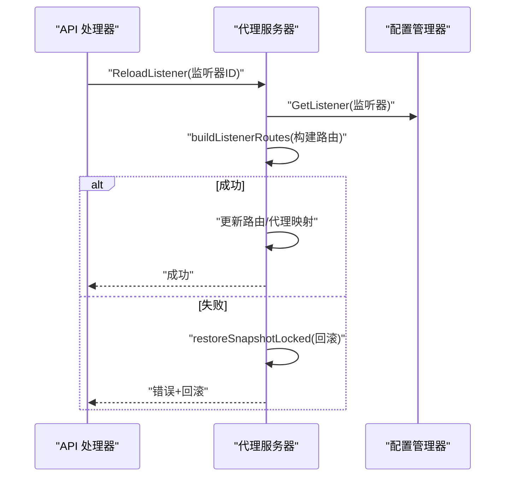
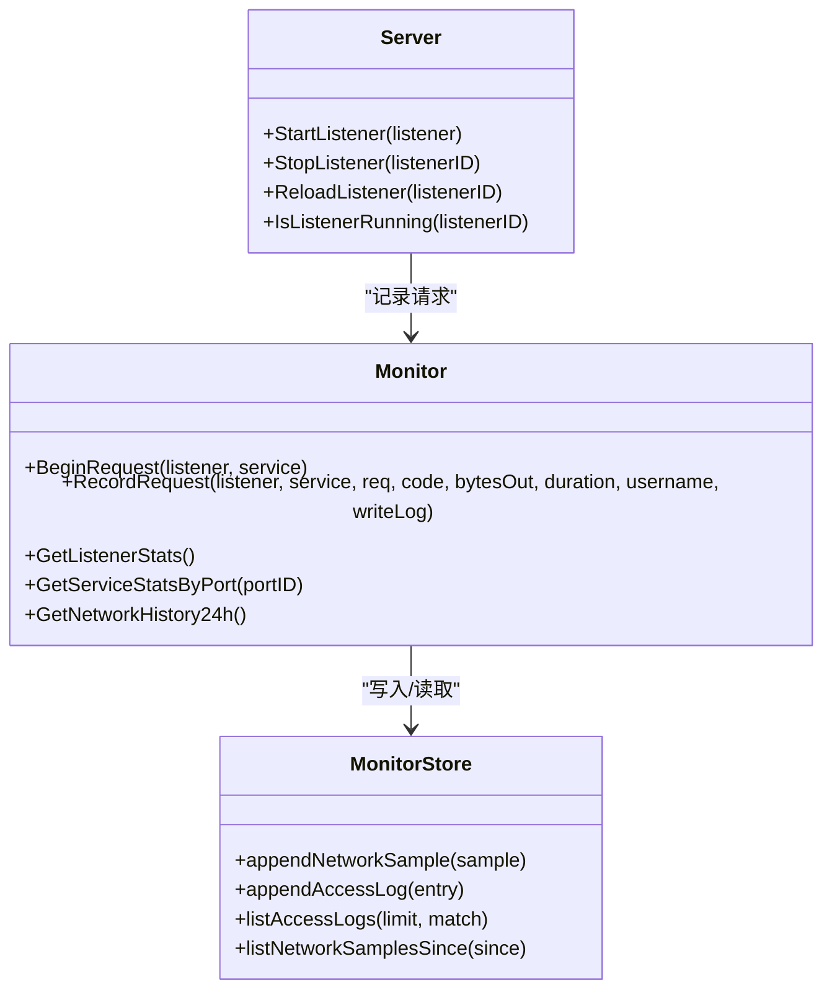
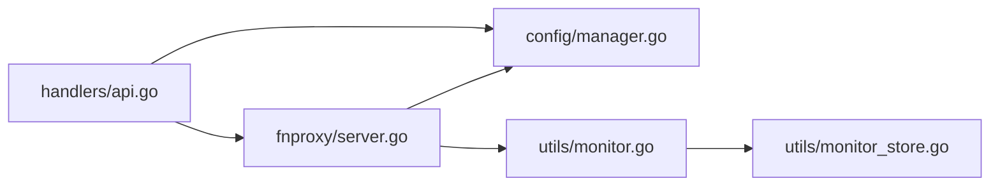

# 监听器处理器

<cite>
**本文引用的文件**
- [src/main.go](file://src/main.go)
- [src/handlers/api.go](file://src/handlers/api.go)
- [src/fnproxy/server.go](file://src/fnproxy/server.go)
- [src/config/manager.go](file://src/config/manager.go)
- [src/models/models.go](file://src/models/models.go)
- [src/utils/monitor.go](file://src/utils/monitor.go)
- [src/utils/monitor_store.go](file://src/utils/monitor_store.go)
- [documents/ui-listener-fixes-20260311.md](file://documents/ui-listener-fixes-20260311.md)
</cite>

## 目录
1. [简介](#简介)
2. [项目结构](#项目结构)
3. [核心组件](#核心组件)
4. [架构总览](#架构总览)
5. [详细组件分析](#详细组件分析)
6. [依赖分析](#依赖分析)
7. [性能考虑](#性能考虑)
8. [故障排查指南](#故障排查指南)
9. [结论](#结论)
10. [附录](#附录)

## 简介
本文件系统化梳理监听器处理器的技术实现，围绕端口监听器的生命周期管理（创建、更新、删除、启用/禁用）、配置验证机制（端口冲突检测、协议验证）、热重载与配置同步策略、状态监控与故障恢复、性能优化与资源管理，以及监听器 API 调用示例与常见问题解决方案展开。文档面向不同技术背景读者，既提供代码级细节，也给出可视化图示帮助理解。

## 项目结构
项目采用分层架构：入口程序负责启动管理后台与代理服务器；API 层提供监听器与服务的 CRUD、启停与重载接口；代理服务器层负责监听器生命周期与热重载；配置管理层负责持久化与一致性；监控层负责运行时统计与日志落盘。

**图表来源**
- [src/main.go:432-465](file://src/main.go#L432-L465)
- [src/handlers/api.go:140-375](file://src/handlers/api.go#L140-L375)
- [src/fnproxy/server.go:183-433](file://src/fnproxy/server.go#L183-L433)
- [src/config/manager.go:243-304](file://src/config/manager.go#L243-L304)
- [src/utils/monitor.go:119-189](file://src/utils/monitor.go#L119-L189)
- [src/utils/monitor_store.go:30-125](file://src/utils/monitor_store.go#L30-L125)

**章节来源**
- [src/main.go:432-465](file://src/main.go#L432-L465)
- [src/handlers/api.go:140-375](file://src/handlers/api.go#L140-L375)
- [src/fnproxy/server.go:183-433](file://src/fnproxy/server.go#L183-L433)
- [src/config/manager.go:243-304](file://src/config/manager.go#L243-L304)
- [src/utils/monitor.go:119-189](file://src/utils/monitor.go#L119-L189)
- [src/utils/monitor_store.go:30-125](file://src/utils/monitor_store.go#L30-L125)

## 核心组件
- 监听器模型：包含端口、协议、启用状态、创建/更新时间等字段，用于标识与持久化监听器配置。
- 配置管理器：提供监听器的增删改查、排序、持久化与全局配置管理。
- 监听器处理器：封装监听器生命周期方法（启动、停止、重载、状态查询），并实现热重载与回滚。
- API 处理器：提供监听器的 REST 接口，负责请求解析、权限校验、配置验证与调用监听器处理器。
- 监控与日志：记录请求量、连接数、字节速率、访问日志与网络流量历史，支持落盘与查询。

**章节来源**
- [src/models/models.go:72-80](file://src/models/models.go#L72-L80)
- [src/config/manager.go:243-304](file://src/config/manager.go#L243-L304)
- [src/fnproxy/server.go:228-433](file://src/fnproxy/server.go#L228-L433)
- [src/handlers/api.go:140-375](file://src/handlers/api.go#L140-L375)
- [src/utils/monitor.go:119-189](file://src/utils/monitor.go#L119-L189)

## 架构总览
监听器处理流程由 API 层发起，经配置校验后调用代理服务器层执行监听器生命周期操作；代理服务器层在运行时维护动态路由表与代理实例，支持热重载；监控层贯穿请求处理全程，记录统计数据与访问日志。

**图表来源**
- [src/handlers/api.go:156-218](file://src/handlers/api.go#L156-L218)
- [src/handlers/api.go:304-375](file://src/handlers/api.go#L304-L375)
- [src/fnproxy/server.go:228-433](file://src/fnproxy/server.go#L228-L433)
- [src/config/manager.go:262-284](file://src/config/manager.go#L262-L284)

## 详细组件分析

### 监听器生命周期管理
- 创建：API 层解析请求体，生成唯一 ID 与时间戳，调用配置管理器保存；若启用且端口被占用，自动置为未启用并返回提示；随后尝试启动监听器，失败不影响数据保存。
- 更新：API 层校验端口冲突与协议合法性；若启用状态变化，调用启动或停止；若配置错误，返回错误信息。
- 删除：API 层先停止监听器（若启用），再删除配置。
- 启用/禁用：API 层切换启用状态并持久化；若从启用切换到禁用，调用停止；若从禁用切换到启用，先保存再启动，失败回滚状态并提示。
- 状态查询：API 层返回监听器列表，包含运行状态标记。

**图表来源**
- [src/handlers/api.go:156-218](file://src/handlers/api.go#L156-L218)
- [src/handlers/api.go:220-276](file://src/handlers/api.go#L220-L276)
- [src/handlers/api.go:278-302](file://src/handlers/api.go#L278-L302)
- [src/handlers/api.go:64-93](file://src/handlers/api.go#L64-L93)

**章节来源**
- [src/handlers/api.go:156-218](file://src/handlers/api.go#L156-L218)
- [src/handlers/api.go:220-276](file://src/handlers/api.go#L220-L276)
- [src/handlers/api.go:278-302](file://src/handlers/api.go#L278-L302)
- [src/handlers/api.go:64-93](file://src/handlers/api.go#L64-L93)

### 监听器配置验证机制
- 端口范围：1-65535。
- 协议：仅支持 http/https。
- 管理端口冲突：禁止占用管理后台端口。
- 重复端口：同配置中不允许重复端口。
- 占用检测：尝试绑定端口以检测是否被其他程序占用。
- 管理后台端口占用：若端口被管理后台使用，禁止占用。

**图表来源**
- [src/handlers/api.go:64-93](file://src/handlers/api.go#L64-L93)

**章节来源**
- [src/handlers/api.go:64-93](file://src/handlers/api.go#L64-L93)

### 监听器热重载与配置同步策略
- 热重载触发：API 层调用代理服务器的重载方法，内部重新构建路由与代理实例，更新内存中的路由表与代理映射，无需重启监听器。
- 回滚机制：若重载失败，尝试回滚到上一次成功的快照，保证服务连续性。
- 同步策略：配置变更先持久化，再应用到运行时；若应用失败，保留上次成功配置。

**图表来源**
- [src/handlers/api.go:359-375](file://src/handlers/api.go#L359-L375)
- [src/fnproxy/server.go:427-433](file://src/fnproxy/server.go#L427-L433)
- [src/fnproxy/server.go:349-368](file://src/fnproxy/server.go#L349-L368)
- [src/fnproxy/server.go:370-425](file://src/fnproxy/server.go#L370-L425)

**章节来源**
- [src/handlers/api.go:359-375](file://src/handlers/api.go#L359-L375)
- [src/fnproxy/server.go:427-433](file://src/fnproxy/server.go#L427-L433)
- [src/fnproxy/server.go:349-368](file://src/fnproxy/server.go#L349-L368)
- [src/fnproxy/server.go:370-425](file://src/fnproxy/server.go#L370-L425)

### 监听器状态监控与故障恢复
- 运行时统计：进入请求时记录开始时间与活动连接数，请求完成后汇总字节总量、速率与最近事件，支持按监听器/服务维度查询。
- 访问日志：按服务配置决定是否记录，支持按监听器/服务过滤查询。
- 故障恢复：代理错误回调记录审计日志；热重载失败回滚至上一次成功配置；停止监听器时清理代理实例与路由映射。
- 网络流量：定时采样网络 IO，落盘并提供 24 小时每 10 分钟平均值。

**图表来源**
- [src/utils/monitor.go:119-189](file://src/utils/monitor.go#L119-L189)
- [src/utils/monitor_store.go:56-125](file://src/utils/monitor_store.go#L56-L125)
- [src/fnproxy/server.go:1119-1140](file://src/fnproxy/server.go#L1119-L1140)

**章节来源**
- [src/utils/monitor.go:119-189](file://src/utils/monitor.go#L119-L189)
- [src/utils/monitor_store.go:56-125](file://src/utils/monitor_store.go#L56-L125)
- [src/fnproxy/server.go:1119-1140](file://src/fnproxy/server.go#L1119-L1140)

### 监听器 API 调用示例
以下为典型监听器管理 API 的调用路径与行为说明（不包含具体请求体内容）：
- 列表与创建
  - GET /api/listeners：返回监听器列表，包含运行状态标记。
  - POST /api/listeners：创建监听器，若启用且端口被占用，保存为未启用并返回提示。
- 更新与删除
  - PUT /api/listeners/{id}：更新监听器，若启用状态变化，执行启动或停止。
  - DELETE /api/listeners/{id}：删除监听器，先停止再删除。
- 启停与重载
  - POST /api/listeners/{id}/toggle：切换启用状态，失败时保存状态并提示。
  - POST /api/listeners/{id}/reload：热重载当前监听器，失败回滚并返回错误。

**章节来源**
- [src/main.go:140-184](file://src/main.go#L140-L184)
- [src/handlers/api.go:140-375](file://src/handlers/api.go#L140-L375)

## 依赖分析
- API 层依赖配置管理器进行持久化与查询，依赖代理服务器执行启停与重载。
- 代理服务器依赖配置管理器获取监听器与服务配置，依赖监控模块记录运行时统计。
- 监控模块依赖配置管理器获取全局日志保留策略，依赖 bbolt 存储网络采样与访问日志。

**图表来源**
- [src/handlers/api.go:140-375](file://src/handlers/api.go#L140-L375)
- [src/fnproxy/server.go:228-433](file://src/fnproxy/server.go#L228-L433)
- [src/utils/monitor.go:119-189](file://src/utils/monitor.go#L119-L189)
- [src/utils/monitor_store.go:30-125](file://src/utils/monitor_store.go#L30-L125)

**章节来源**
- [src/handlers/api.go:140-375](file://src/handlers/api.go#L140-L375)
- [src/fnproxy/server.go:228-433](file://src/fnproxy/server.go#L228-L433)
- [src/utils/monitor.go:119-189](file://src/utils/monitor.go#L119-L189)
- [src/utils/monitor_store.go:30-125](file://src/utils/monitor_store.go#L30-L125)

## 性能考虑
- 连接复用与传输优化：全局共享的 HTTP Transport 启用连接复用、空闲连接超时与最大连接数限制，减少握手开销。
- 代理错误处理：统一错误回调记录审计日志并返回标准错误，避免长时间阻塞。
- 热重载零停机：仅更新路由表与代理映射，避免重启带来的连接中断。
- 监控落盘：网络采样与访问日志落盘至本地数据库，避免内存膨胀；提供 24 小时历史查询接口。
- 证书与 TLS：HTTPS 监听器按监听器 ID 动态获取证书，减少不必要的证书加载。

**章节来源**
- [src/fnproxy/server.go:141-161](file://src/fnproxy/server.go#L141-L161)
- [src/fnproxy/server.go:557-572](file://src/fnproxy/server.go#L557-L572)
- [src/utils/monitor_store.go:56-125](file://src/utils/monitor_store.go#L56-L125)
- [src/fnproxy/server.go:326-339](file://src/fnproxy/server.go#L326-L339)

## 故障排查指南
- 端口占用冲突
  - 现象：创建/更新监听器时提示端口被占用。
  - 处理：检查系统占用或管理端口占用；若允许，保存为未启用状态；否则更换端口。
- 管理端口冲突
  - 现象：监听器端口与管理后台端口相同。
  - 处理：修改监听器端口或管理后台端口。
- 重复端口
  - 现象：同一配置中存在重复端口。
  - 处理：删除重复监听器或修改端口。
- 启动失败
  - 现象：启用监听器后立即失败。
  - 处理：查看控制台错误；热重载失败会回滚至上一次成功配置。
- 重载失败
  - 现象：热重载后服务不可用。
  - 处理：检查服务配置有效性；重载失败会回滚并返回错误信息。
- OAuth 登录失败
  - 现象：服务启用 OAuth 后登录失败。
  - 处理：检查用户是否存在、是否启用、密码是否正确；查看审计日志定位失败原因。

**章节来源**
- [src/handlers/api.go:64-93](file://src/handlers/api.go#L64-L93)
- [src/fnproxy/server.go:404-411](file://src/fnproxy/server.go#L404-L411)
- [src/fnproxy/server.go:1178-1251](file://src/fnproxy/server.go#L1178-L1251)

## 结论
监听器处理器通过清晰的生命周期管理、严格的配置验证、可靠的热重载与回滚机制、完善的监控与日志体系，实现了高可用与可观测的监听器管理能力。结合连接复用与落盘策略，系统在性能与稳定性方面具备良好表现。建议在生产环境中严格遵循端口与协议规范，合理配置日志保留策略，并定期检查重载与启停日志以确保服务连续性。

## 附录
- 启动参数与行为参考：管理后台端口覆盖、Unix Socket、PID 文件、单实例保护、优雅关闭等。
- UI 与监听器修复要点：默认响应规则编辑、端口详情数据隔离、监听路由基于 Host 匹配、新增运行时监控与访问日志能力等。

**章节来源**
- [src/main.go:24-72](file://src/main.go#L24-L72)
- [src/main.go:475-515](file://src/main.go#L475-L515)
- [documents/ui-listener-fixes-20260311.md:73-93](file://documents/ui-listener-fixes-20260311.md#L73-L93)