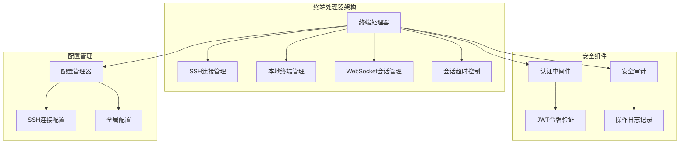
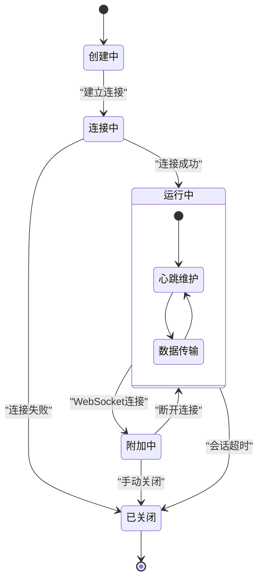
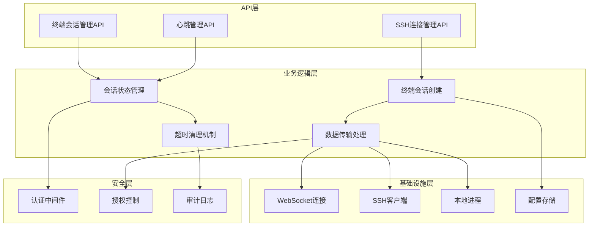
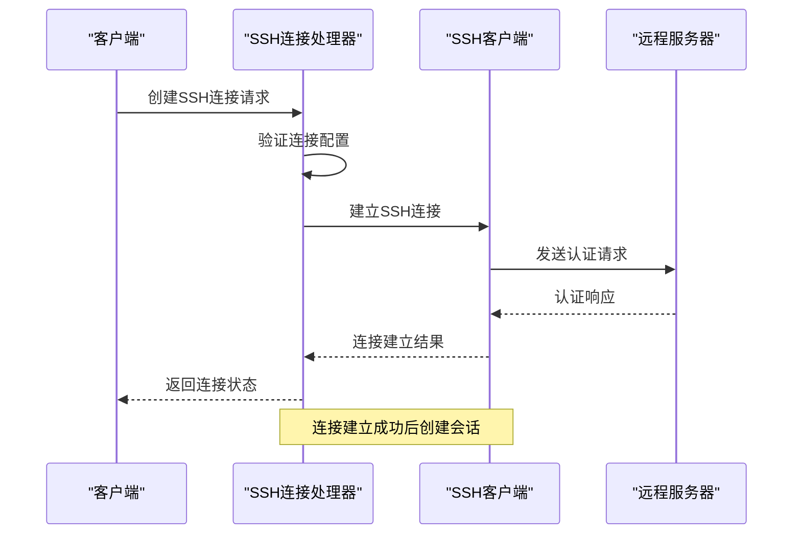
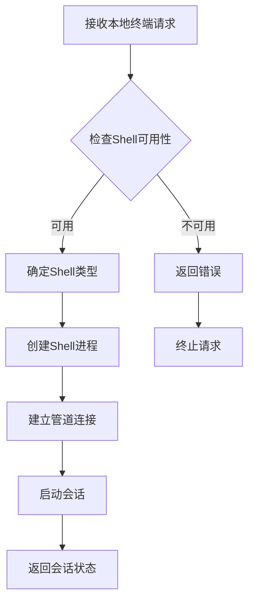
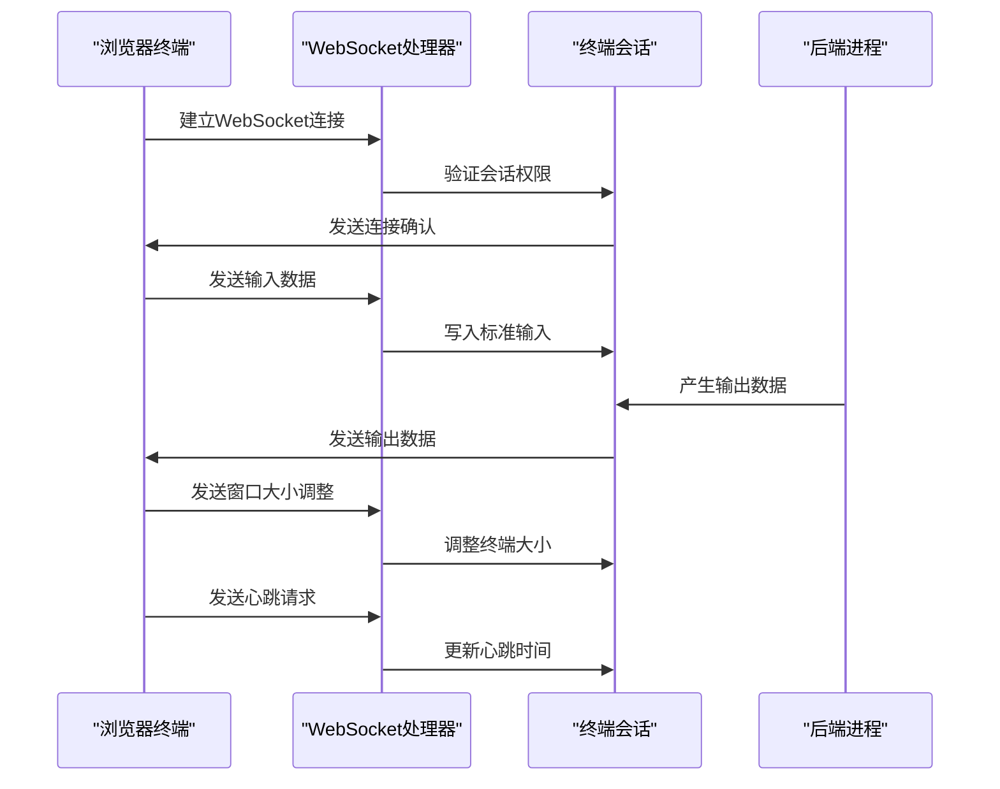
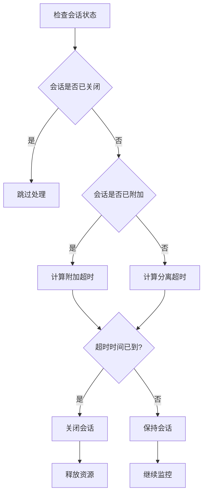
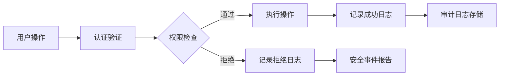
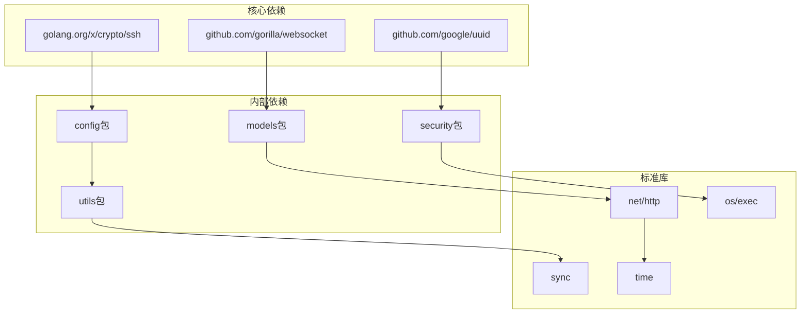

# 终端处理器

<cite>
**本文档引用的文件**
- [terminal.go](file://src/handlers/terminal.go)
- [main.go](file://src/main.go)
- [models.go](file://src/models/models.go)
- [audit_log.go](file://src/security/audit_log.go)
- [auth.go](file://src/utils/auth.go)
- [manager.go](file://src/config/manager.go)
- [auth.go](file://src/middleware/auth.go)
- [process_control.go](file://src/process_control.go)
</cite>

## 目录
1. [简介](#简介)
2. [项目结构](#项目结构)
3. [核心组件](#核心组件)
4. [架构概览](#架构概览)
5. [详细组件分析](#详细组件分析)
6. [依赖关系分析](#依赖关系分析)
7. [性能考虑](#性能考虑)
8. [故障排除指南](#故障排除指南)
9. [结论](#结论)

## 简介

终端处理器是 Caddy Panel 项目中的一个关键组件，负责管理本地终端和远程 SSH 终端连接。该系统提供了完整的 Web 终端解决方案，支持本地 Shell 访问和远程 SSH 连接，通过 WebSocket 实现实时双向通信。

系统的核心功能包括：
- SSH 连接管理和会话生命周期控制
- 本地终端和远程 SSH 终端的统一抽象
- WebSocket 终端会话的实时数据传输
- 终端会话的超时管理和自动清理
- 安全审计和访问控制

## 项目结构

终端处理器位于 `src/handlers/terminal.go` 文件中，采用模块化设计，与其他系统组件紧密集成：



**图表来源**
- [terminal.go:1-858](file://src/handlers/terminal.go#L1-L858)
- [main.go:310-420](file://src/main.go#L310-L420)

**章节来源**
- [terminal.go:1-858](file://src/handlers/terminal.go#L1-L858)
- [main.go:112-431](file://src/main.go#L112-L431)

## 核心组件

### 终端会话模型

TerminalSession 是终端处理器的核心数据结构，负责管理单个终端会话的完整生命周期：

```mermaid
classDiagram
class TerminalSession {
+string ID
+string Owner
+SSHConnection Connection
+io.WriteCloser Stdin
+io.Reader Stdout
+io.Reader Stderr
+Cmd LocalCmd
+Client SSHClient
+Session SSHSession
+time CreatedAt
+time LastHeartbeat
+time DetachedAt
+bool Attached
+string Status
-[]byte buffer
-chan struct{} done
-sync.Once closeOnce
-sync.Mutex mu
-sync.Mutex wsMu
-websocket.Conn attachedConn
+Attach(conn)
+Detach(conn)
+Close()
+Touch()
+snapshot() TerminalManagedSession
+isStale(now) bool
}
class SSHConnection {
+string ID
+string Name
+string Host
+int Port
+string Username
+string Password
+string WorkDir
+bool IsLocal
+time CreatedAt
+time UpdatedAt
}
TerminalSession --> SSHConnection : "使用"
```

**图表来源**
- [terminal.go:39-61](file://src/handlers/terminal.go#L39-L61)
- [models.go:269-281](file://src/models/models.go#L269-L281)

### 终端会话生命周期管理

系统实现了完整的会话生命周期管理，包括创建、连接、数据传输、心跳维护和自动清理：



**图表来源**
- [terminal.go:379-444](file://src/handlers/terminal.go#L379-L444)
- [terminal.go:688-698](file://src/handlers/terminal.go#L688-L698)

**章节来源**
- [terminal.go:39-61](file://src/handlers/terminal.go#L39-L61)
- [terminal.go:379-444](file://src/handlers/terminal.go#L379-L444)
- [terminal.go:688-698](file://src/handlers/terminal.go#L688-L698)

## 架构概览

终端处理器采用分层架构设计，各组件职责明确，耦合度低：



**图表来源**
- [main.go:309-419](file://src/main.go#L309-L419)
- [terminal.go:26-37](file://src/handlers/terminal.go#L26-L37)

**章节来源**
- [main.go:309-419](file://src/main.go#L309-L419)
- [terminal.go:26-37](file://src/handlers/terminal.go#L26-L37)

## 详细组件分析

### SSH 连接管理

SSH 连接管理是终端处理器的重要组成部分，负责建立和维护 SSH 连接：

#### SSH 连接建立流程



**图表来源**
- [terminal.go:446-510](file://src/handlers/terminal.go#L446-L510)
- [terminal.go:379-444](file://src/handlers/terminal.go#L379-L444)

#### SSH 连接配置管理

系统支持动态 SSH 连接配置管理，包括增删改查操作：

**章节来源**
- [terminal.go:79-223](file://src/handlers/terminal.go#L79-L223)
- [manager.go:583-637](file://src/config/manager.go#L583-L637)

### 本地终端管理

本地终端管理提供了对本机 Shell 的访问能力，支持不同操作系统的 Shell 选择：

#### 本地终端启动流程



**图表来源**
- [terminal.go:391-421](file://src/handlers/terminal.go#L391-L421)
- [terminal.go:813-811](file://src/handlers/terminal.go#L813-L811)

**章节来源**
- [terminal.go:391-421](file://src/handlers/terminal.go#L391-L421)
- [terminal.go:813-811](file://src/handlers/terminal.go#L813-L811)

### WebSocket 终端会话

WebSocket 终端会话是实现浏览器与服务器之间实时通信的关键组件：

#### WebSocket 会话处理流程



**图表来源**
- [terminal.go:353-377](file://src/handlers/terminal.go#L353-L377)
- [terminal.go:512-552](file://src/handlers/terminal.go#L512-L552)

#### WebSocket 消息处理

系统支持多种消息类型的处理：

**章节来源**
- [terminal.go:353-377](file://src/handlers/terminal.go#L353-L377)
- [terminal.go:512-552](file://src/handlers/terminal.go#L512-L552)

### 会话超时控制

系统实现了智能的会话超时控制机制，确保资源的有效利用：

#### 超时控制算法



**图表来源**
- [terminal.go:688-698](file://src/handlers/terminal.go#L688-L698)
- [terminal.go:738-759](file://src/handlers/terminal.go#L738-L759)

**章节来源**
- [terminal.go:688-698](file://src/handlers/terminal.go#L688-L698)
- [terminal.go:738-759](file://src/handlers/terminal.go#L738-L759)

### 安全审计和访问控制

系统集成了完善的安全审计和访问控制机制：

#### 安全审计流程



**图表来源**
- [audit_log.go:115-147](file://src/security/audit_log.go#L115-L147)
- [terminal.go:306-318](file://src/handlers/terminal.go#L306-L318)

**章节来源**
- [audit_log.go:115-147](file://src/security/audit_log.go#L115-L147)
- [terminal.go:306-318](file://src/handlers/terminal.go#L306-L318)

## 依赖关系分析

终端处理器的依赖关系相对简单，主要依赖于标准库和第三方库：



**图表来源**
- [terminal.go:3-24](file://src/handlers/terminal.go#L3-L24)

**章节来源**
- [terminal.go:3-24](file://src/handlers/terminal.go#L3-L24)

## 性能考虑

终端处理器在设计时充分考虑了性能优化：

### 内存管理
- 使用缓冲区限制防止内存无限增长
- 实现会话自动清理机制
- 采用并发安全的数据结构

### 网络优化
- WebSocket 连接复用
- 异步数据传输
- 连接池管理

### 资源控制
- 会话超时自动清理
- 进程资源及时释放
- 文件描述符管理

## 故障排除指南

### 常见问题诊断

#### SSH 连接问题
1. **连接超时**：检查网络连通性和防火墙设置
2. **认证失败**：验证用户名密码正确性
3. **会话创建失败**：查看系统日志获取详细错误信息

#### WebSocket 连接问题
1. **连接建立失败**：检查 WebSocket 服务器状态
2. **数据传输异常**：验证消息格式和编码
3. **会话超时断开**：检查客户端心跳机制

#### 性能问题
1. **内存泄漏**：监控会话数量和内存使用
2. **CPU 占用过高**：检查数据传输频率
3. **连接数过多**：调整会话超时参数

### 调试方法

#### 启用调试模式
```bash
# 启动时启用调试输出
./caddy-panel -debug
```

#### 查看系统日志
```bash
# 查看安全审计日志
tail -f security_audit.log

# 查看应用日志
tail -f app.log
```

**章节来源**
- [terminal.go:238-275](file://src/handlers/terminal.go#L238-L275)
- [audit_log.go:168-183](file://src/security/audit_log.go#L168-L183)

## 结论

终端处理器是一个设计精良的系统组件，具有以下特点：

### 技术优势
- **模块化设计**：清晰的组件分离和职责划分
- **安全性强**：完善的认证、授权和审计机制
- **可扩展性好**：支持本地和远程终端的统一抽象
- **性能优化**：智能的资源管理和超时控制

### 架构特色
- **统一抽象**：本地终端和远程 SSH 终端的无缝集成
- **实时通信**：基于 WebSocket 的高效数据传输
- **生命周期管理**：完整的会话创建、维护和清理流程
- **安全审计**：全面的操作日志记录和追踪

### 改进建议
1. **增强错误处理**：提供更详细的错误信息和恢复机制
2. **优化性能**：实现连接池和批量处理机制
3. **扩展功能**：支持多用户协作和会话共享
4. **监控告警**：集成更完善的监控和告警系统

该终端处理器为 Caddy Panel 提供了强大的终端访问能力，是现代 Web 管理系统的重要组成部分。