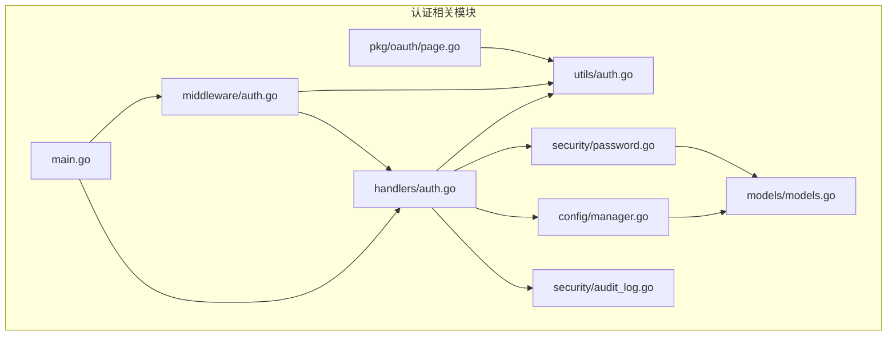
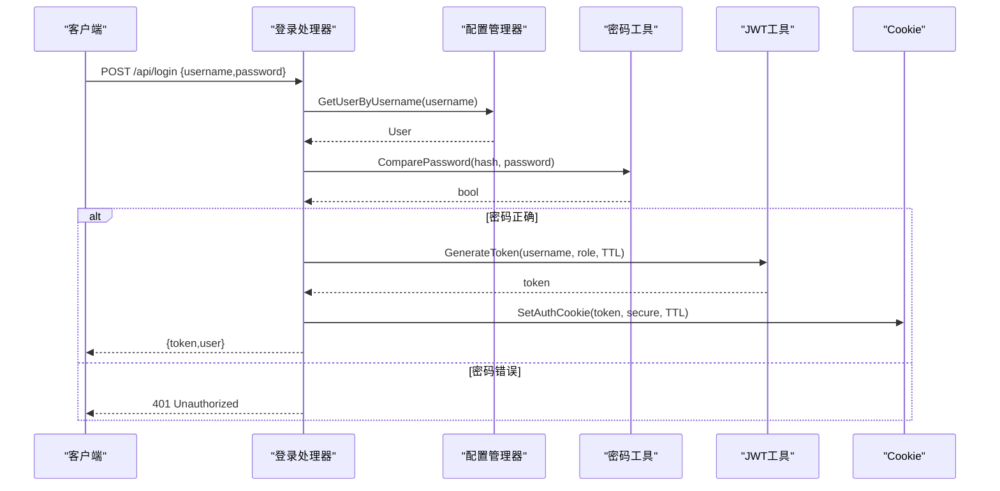
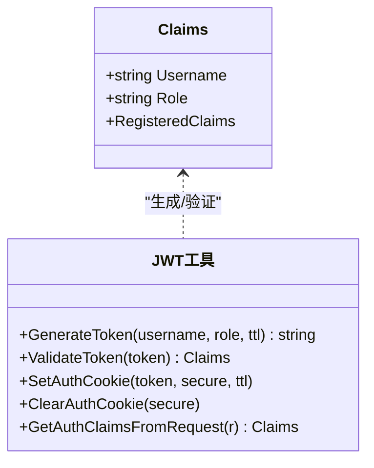
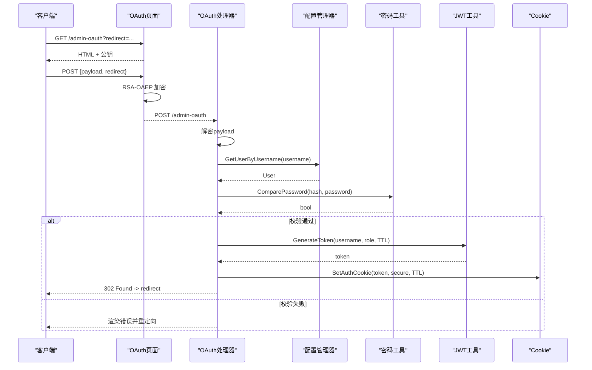
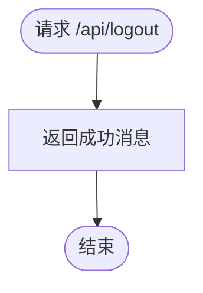
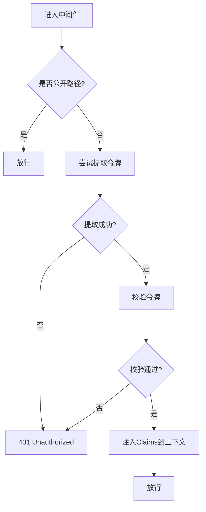
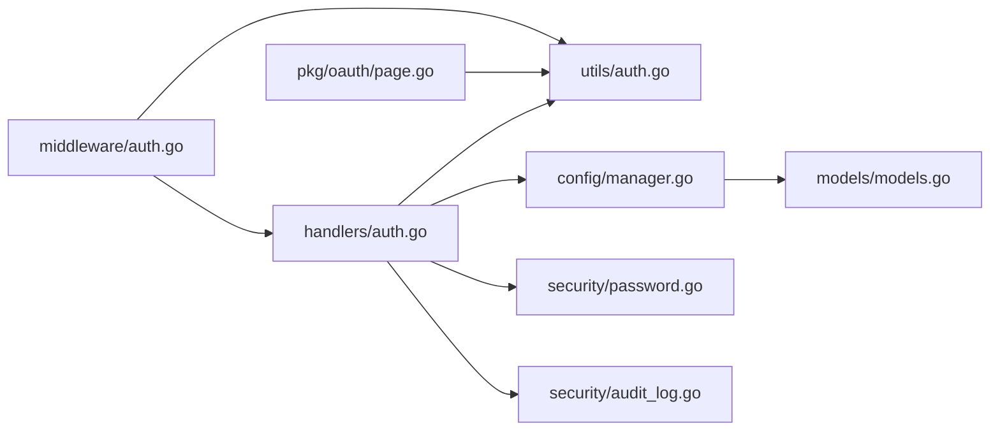

# 认证处理器

<cite>
**本文引用的文件**
- [src/handlers/auth.go](file://src/handlers/auth.go)
- [src/middleware/auth.go](file://src/middleware/auth.go)
- [src/utils/auth.go](file://src/utils/auth.go)
- [src/pkg/oauth/page.go](file://src/pkg/oauth/page.go)
- [src/models/models.go](file://src/models/models.go)
- [src/security/password.go](file://src/security/password.go)
- [src/security/audit_log.go](file://src/security/audit_log.go)
- [src/config/manager.go](file://src/config/manager.go)
- [src/main.go](file://src/main.go)
</cite>

## 目录
1. [简介](#简介)
2. [项目结构](#项目结构)
3. [核心组件](#核心组件)
4. [架构总览](#架构总览)
5. [详细组件分析](#详细组件分析)
6. [依赖分析](#依赖分析)
7. [性能考虑](#性能考虑)
8. [故障排除指南](#故障排除指南)
9. [结论](#结论)
10. [附录](#附录)

## 简介
本文件面向认证处理器的技术文档，系统性阐述 JWT 认证机制、OAuth 登录流程、用户登录/登出与会话管理、认证中间件工作原理、错误处理策略与安全考虑，并提供 API 调用示例与前端集成指南。读者无需深厚的后端背景即可理解并正确集成。

## 项目结构
认证相关的核心代码分布在以下模块：
- handlers：HTTP 处理器，负责登录、登出、获取当前用户、OAuth 登录页面渲染与处理
- middleware：认证中间件，负责拦截请求、提取与验证令牌、注入上下文
- utils：通用工具，负责 JWT 生成与验证、Cookie 读写、令牌规范化
- pkg/oauth：OAuth 登录页面模板与前端加密逻辑
- models：用户模型与安全日志模型
- security：密码哈希与安全审计日志
- config：配置管理器，提供用户查询与令牌映射
- main：路由注册与中间件装配

**图表来源**
- [src/main.go:112-130](file://src/main.go#L112-L130)
- [src/handlers/auth.go:37-198](file://src/handlers/auth.go#L37-L198)
- [src/middleware/auth.go:14-55](file://src/middleware/auth.go#L14-L55)
- [src/utils/auth.go:24-53](file://src/utils/auth.go#L24-L53)
- [src/pkg/oauth/page.go:15-197](file://src/pkg/oauth/page.go#L15-L197)
- [src/config/manager.go:511-544](file://src/config/manager.go#L511-L544)
- [src/security/password.go:44-70](file://src/security/password.go#L44-L70)
- [src/security/audit_log.go:82-99](file://src/security/audit_log.go#L82-L99)
- [src/models/models.go:256-267](file://src/models/models.go#L256-L267)

**章节来源**
- [src/main.go:112-130](file://src/main.go#L112-L130)
- [src/handlers/auth.go:37-198](file://src/handlers/auth.go#L37-L198)
- [src/middleware/auth.go:14-55](file://src/middleware/auth.go#L14-L55)
- [src/utils/auth.go:24-53](file://src/utils/auth.go#L24-L53)
- [src/pkg/oauth/page.go:15-197](file://src/pkg/oauth/page.go#L15-L197)
- [src/config/manager.go:511-544](file://src/config/manager.go#L511-L544)
- [src/security/password.go:44-70](file://src/security/password.go#L44-L70)
- [src/security/audit_log.go:82-99](file://src/security/audit_log.go#L82-L99)
- [src/models/models.go:256-267](file://src/models/models.go#L256-L267)

## 核心组件
- 登录处理器：接收用户名/密码，校验用户状态与密码，生成 JWT 并写入 Cookie
- 登出处理器：返回登出成功消息（JWT 无状态，客户端删除 Cookie 即可）
- 当前用户处理器：从请求上下文读取 JWT Claims，查询用户信息并返回
- OAuth 登录处理器：渲染登录页，接收加密负载，解密后校验并发放 JWT
- 认证中间件：拦截请求，优先尝试 Header Token，其次 JWT，最后 Cookie；将 Claims 注入上下文
- 管理员中间件：校验角色为 admin
- JWT 工具：生成/验证 JWT，写入/清理 Cookie，从请求中提取令牌
- 密码工具：HMAC-SHA256 密码哈希与常量时间比较
- 安全审计：记录 OAuth 登录日志
- 配置管理：提供用户查询与令牌映射

**章节来源**
- [src/handlers/auth.go:37-110](file://src/handlers/auth.go#L37-L110)
- [src/handlers/auth.go:124-198](file://src/handlers/auth.go#L124-L198)
- [src/middleware/auth.go:14-91](file://src/middleware/auth.go#L14-L91)
- [src/utils/auth.go:24-84](file://src/utils/auth.go#L24-L84)
- [src/security/password.go:44-70](file://src/security/password.go#L44-L70)
- [src/security/audit_log.go:82-99](file://src/security/audit_log.go#L82-L99)
- [src/config/manager.go:518-544](file://src/config/manager.go#L518-L544)

## 架构总览
认证系统采用“多入口令牌 + 中间件统一校验”的设计：
- 管理后台登录：用户名/密码 -> 生成 JWT -> 写入 Cookie -> 重定向
- OAuth 登录：渲染登录页 -> 前端 RSA-OAEP 加密 -> 服务端解密 -> 生成 JWT -> 写入 Cookie
- API 请求：中间件优先识别 Header Token，其次 Authorization Bearer，再次 Cookie；校验通过后注入 Claims
- 管理员权限：在已登录基础上校验角色

**图表来源**
- [src/handlers/auth.go:37-76](file://src/handlers/auth.go#L37-L76)
- [src/config/manager.go:518-528](file://src/config/manager.go#L518-L528)
- [src/security/password.go:54-70](file://src/security/password.go#L54-L70)
- [src/utils/auth.go:24-37](file://src/utils/auth.go#L24-L37)
- [src/utils/auth.go:55-70](file://src/utils/auth.go#L55-L70)

## 详细组件分析

### JWT 认证机制
- 令牌生成：使用 HS256 算法，Claims 包含用户名、角色、签发时间与过期时间
- 令牌验证：使用相同密钥进行签名验证，确保完整性与真实性
- 令牌存储：通过 HttpOnly Cookie 存储，支持 SameSite/Lax，Secure（HTTPS）时启用
- 令牌提取：支持三种来源（Header Token、Authorization Bearer、Cookie），优先级依次降低

**图表来源**
- [src/utils/auth.go:17-53](file://src/utils/auth.go#L17-L53)

**章节来源**
- [src/utils/auth.go:24-53](file://src/utils/auth.go#L24-L53)
- [src/utils/auth.go:86-99](file://src/utils/auth.go#L86-L99)

### OAuth 登录流程
- 登录页面渲染：返回包含公钥的 HTML 页面，前端使用 WebCrypto 或 Forge 执行 RSA-OAEP 加密
- 负载解密：服务端使用私钥解密，校验用户与密码，生成 JWT 并写入 Cookie
- 审计日志：记录登录成功/失败事件，包含来源 IP、用户名、结果与消息

**图表来源**
- [src/pkg/oauth/page.go:15-197](file://src/pkg/oauth/page.go#L15-L197)
- [src/handlers/auth.go:124-198](file://src/handlers/auth.go#L124-L198)
- [src/config/manager.go:518-528](file://src/config/manager.go#L518-L528)
- [src/security/password.go:54-70](file://src/security/password.go#L54-L70)
- [src/utils/auth.go:24-37](file://src/utils/auth.go#L24-L37)
- [src/utils/auth.go:55-70](file://src/utils/auth.go#L55-L70)

**章节来源**
- [src/pkg/oauth/page.go:15-197](file://src/pkg/oauth/page.go#L15-L197)
- [src/handlers/auth.go:124-198](file://src/handlers/auth.go#L124-L198)
- [src/security/audit_log.go:82-99](file://src/security/audit_log.go#L82-L99)

### 用户登录、登出与会话管理
- 登录：用户名/密码校验通过后生成 JWT 并写入 Cookie，同时返回 token
- 登出：JWT 无状态，服务端不维护会话；登出即删除 Cookie
- 会话：通过 Cookie 中的 JWT 实现会话持久化；支持“记住我”延长有效期

**图表来源**
- [src/handlers/auth.go:84-88](file://src/handlers/auth.go#L84-L88)

**章节来源**
- [src/handlers/auth.go:37-76](file://src/handlers/auth.go#L37-L76)
- [src/handlers/auth.go:84-88](file://src/handlers/auth.go#L84-L88)
- [src/utils/auth.go:72-84](file://src/utils/auth.go#L72-L84)

### 认证中间件与请求拦截
- 公开路径：/api/login、/api/auth/public-key、/api/logout
- 令牌提取：优先 Header Token，其次 Authorization Bearer，再次 Cookie
- 上下文注入：将 Claims 注入请求上下文，供后续处理器使用
- 管理员校验：角色必须为 admin

**图表来源**
- [src/middleware/auth.go:14-55](file://src/middleware/auth.go#L14-L55)
- [src/utils/auth.go:86-99](file://src/utils/auth.go#L86-L99)

**章节来源**
- [src/middleware/auth.go:14-91](file://src/middleware/auth.go#L14-L91)
- [src/utils/auth.go:86-99](file://src/utils/auth.go#L86-L99)

### 错误处理与安全考虑
- 错误处理：对无效请求体、无效凭据、禁用用户、令牌无效等情况返回相应状态码
- 审计日志：OAuth 登录成功/失败均记录，包含来源 IP、用户名、消息与结果
- 安全参数：默认安全参数仅用于开发，生产需显式设置
- 令牌来源：支持 Header Token 与 JWT，互不冲突；Header Token 优先

**章节来源**
- [src/handlers/auth.go:37-76](file://src/handlers/auth.go#L37-L76)
- [src/handlers/auth.go:124-198](file://src/handlers/auth.go#L124-L198)
- [src/security/audit_log.go:82-99](file://src/security/audit_log.go#L82-L99)
- [src/main.go:79-94](file://src/main.go#L79-L94)

## 依赖分析
- handlers.auth 依赖 utils.jwt、config.user、security.password、security.audit
- middleware.auth 依赖 utils.jwt、handlers.auth
- utils.auth 依赖 config.user
- pkg.oauth.page 依赖 utils.auth（公钥导出）
- config.manager 提供用户查询与令牌映射
- security.password 提供密码哈希与比较
- security.audit_log 提供审计日志能力

**图表来源**
- [src/handlers/auth.go:37-198](file://src/handlers/auth.go#L37-L198)
- [src/middleware/auth.go:14-55](file://src/middleware/auth.go#L14-L55)
- [src/utils/auth.go:24-53](file://src/utils/auth.go#L24-L53)
- [src/pkg/oauth/page.go:15-197](file://src/pkg/oauth/page.go#L15-L197)
- [src/config/manager.go:511-544](file://src/config/manager.go#L511-L544)
- [src/security/password.go:44-70](file://src/security/password.go#L44-L70)
- [src/security/audit_log.go:82-99](file://src/security/audit_log.go#L82-L99)
- [src/models/models.go:256-267](file://src/models/models.go#L256-L267)

**章节来源**
- [src/handlers/auth.go:37-198](file://src/handlers/auth.go#L37-L198)
- [src/middleware/auth.go:14-55](file://src/middleware/auth.go#L14-L55)
- [src/utils/auth.go:24-53](file://src/utils/auth.go#L24-L53)
- [src/pkg/oauth/page.go:15-197](file://src/pkg/oauth/page.go#L15-L197)
- [src/config/manager.go:511-544](file://src/config/manager.go#L511-L544)
- [src/security/password.go:44-70](file://src/security/password.go#L44-L70)
- [src/security/audit_log.go:82-99](file://src/security/audit_log.go#L82-L99)
- [src/models/models.go:256-267](file://src/models/models.go#L256-L267)

## 性能考虑
- JWT 无状态验证：每次请求仅做签名验证，避免数据库查询
- Cookie 传输：令牌体积小，网络开销低
- 中间件短路：公开路径快速放行，减少不必要的令牌解析
- 前端加密：OAuth 登录时在浏览器端完成加密，减轻服务端压力

[本节为通用指导，无需具体文件分析]

## 故障排除指南
- 401 未授权
  - 检查 Authorization 头格式是否为 Bearer
  - 检查 Cookie 是否被正确写入与携带
  - 检查令牌是否过期
- 403 禁止访问
  - 确认用户角色为 admin
- 登录失败
  - 检查用户名是否存在且启用
  - 检查密码是否正确
  - 查看安全审计日志
- OAuth 登录异常
  - 检查公钥是否正确导出
  - 检查前端加密是否成功
  - 检查服务端私钥是否配置

**章节来源**
- [src/middleware/auth.go:30-54](file://src/middleware/auth.go#L30-L54)
- [src/handlers/auth.go:45-59](file://src/handlers/auth.go#L45-L59)
- [src/security/audit_log.go:82-99](file://src/security/audit_log.go#L82-L99)

## 结论
本认证系统以 JWT 为核心，结合 Header Token 与 Cookie，实现了灵活、可扩展的认证方案。OAuth 登录通过前端加密与服务端解密，提升了传输安全性。中间件统一拦截与校验，简化了业务层逻辑。配合安全审计与明确的错误处理，整体具备良好的可运维性与安全性。

[本节为总结，无需具体文件分析]

## 附录

### API 调用示例与集成指南
- 登录
  - 方法：POST
  - 路径：/api/login
  - 请求体：{username, password}
  - 成功响应：{token, user:{username, role}}
  - 安全建议：HTTPS 下启用 Secure Cookie
- 获取当前用户
  - 方法：GET
  - 路径：/api/me
  - 认证：Authorization: Bearer <token> 或 Cookie
  - 成功响应：{username, email, enabled, role}
- OAuth 登录页面
  - 方法：GET
  - 路径：/admin-oauth?redirect=...
  - 前端：使用公钥进行 RSA-OAEP 加密，提交 payload
  - 成功后：重定向至 redirect 指定路径
- 登出
  - 方法：GET
  - 路径：/api/logout
  - 行为：返回成功消息，客户端删除 Cookie 即可

**章节来源**
- [src/main.go:127-130](file://src/main.go#L127-L130)
- [src/handlers/auth.go:37-110](file://src/handlers/auth.go#L37-L110)
- [src/handlers/auth.go:124-198](file://src/handlers/auth.go#L124-L198)
- [src/utils/auth.go:55-70](file://src/utils/auth.go#L55-L70)

### 令牌存储最佳实践
- 生产环境务必设置 -secure 参数，避免使用默认安全参数
- 使用 HTTPS 时启用 Cookie Secure 属性
- 对于长期会话，可勾选“记住我”，服务端将延长令牌有效期
- 前端应避免将敏感令牌写入 localStorage，优先使用 HttpOnly Cookie
- 定期轮换密钥与证书，确保系统安全

**章节来源**
- [src/main.go:79-94](file://src/main.go#L79-L94)
- [src/utils/auth.go:55-70](file://src/utils/auth.go#L55-L70)
- [src/handlers/auth.go:184-187](file://src/handlers/auth.go#L184-L187)