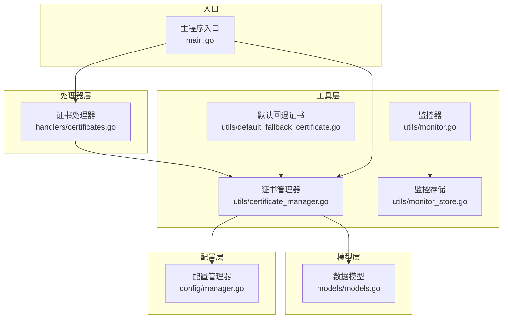
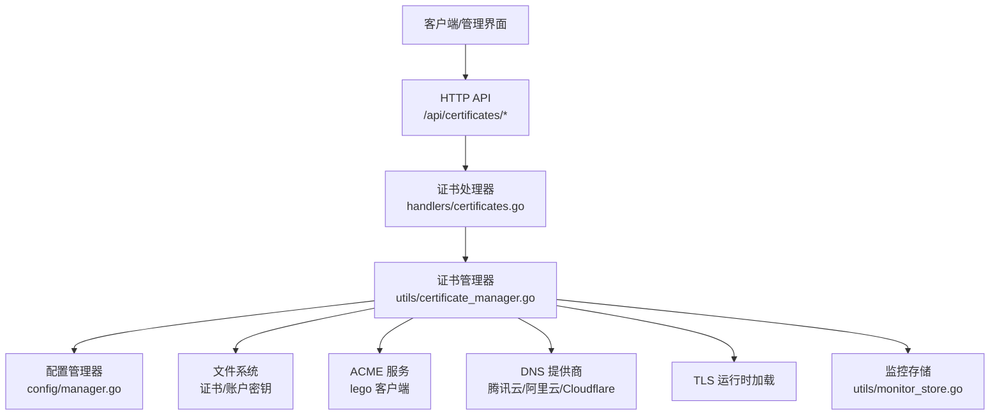
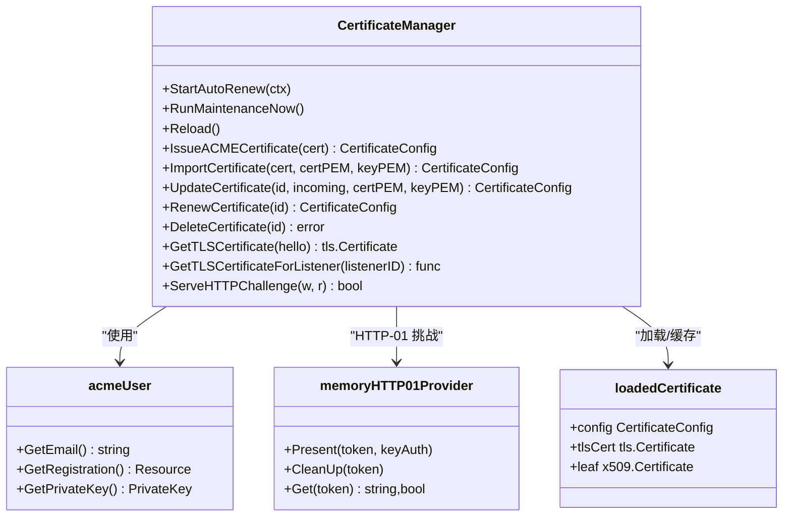
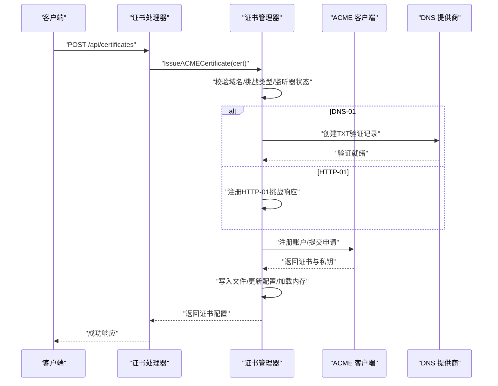
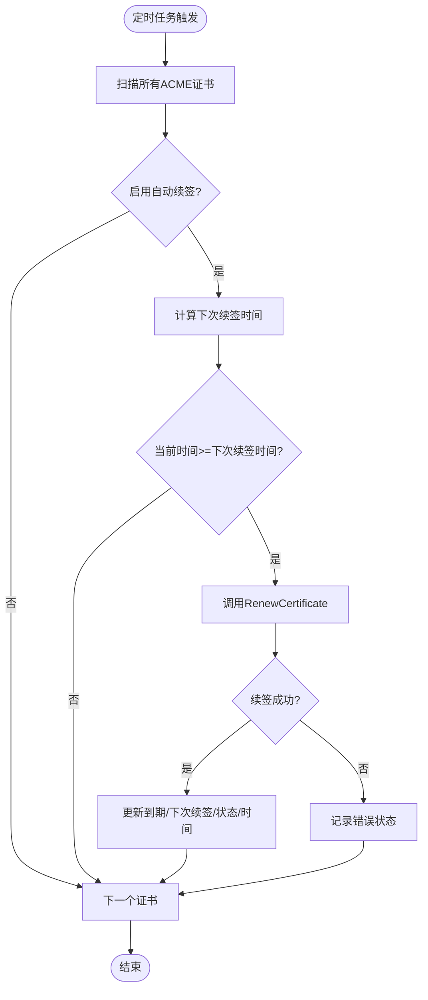
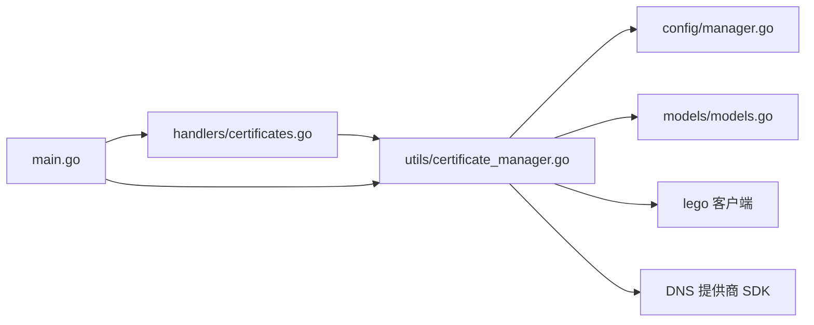

# 证书处理器

<cite>
**本文档引用的文件**
- [src/handlers/certificates.go](file://src/handlers/certificates.go)
- [src/utils/certificate_manager.go](file://src/utils/certificate_manager.go)
- [src/models/models.go](file://src/models/models.go)
- [src/config/manager.go](file://src/config/manager.go)
- [src/main.go](file://src/main.go)
- [src/utils/default_fallback_certificate.go](file://src/utils/default_fallback_certificate.go)
- [src/utils/certificate_manager_test.go](file://src/utils/certificate_manager_test.go)
- [src/utils/monitor.go](file://src/utils/monitor.go)
- [src/utils/monitor_store.go](file://src/utils/monitor_store.go)
</cite>

## 目录
1. [简介](#简介)
2. [项目结构](#项目结构)
3. [核心组件](#核心组件)
4. [架构总览](#架构总览)
5. [详细组件分析](#详细组件分析)
6. [依赖关系分析](#依赖关系分析)
7. [性能考虑](#性能考虑)
8. [故障排除指南](#故障排除指南)
9. [结论](#结论)
10. [附录](#附录)

## 简介
本文件面向“证书处理器”的全面技术文档，围绕 ACME 证书自动申请流程（域名验证与证书签发）、证书导入与管理、自动续期机制、证书同步与分发、存储与安全保护、监控与告警配置以及 API 调用示例进行系统化阐述。文档以代码为依据，结合架构图与流程图帮助读者快速理解与落地实施。

## 项目结构
证书处理器位于应用的工具层与处理器层，主要涉及以下模块：
- 处理器层：负责对外暴露证书相关的 HTTP API，解析请求、调用业务逻辑并返回统一响应。
- 工具层：封装证书管理器，实现 ACME 申请、导入、更新、删除、续期、运行时加载、同步等核心能力。
- 模型层：定义证书配置、状态、挑战类型、DNS 提供商等数据结构。
- 配置层：提供全局配置项（如证书同步路径、同步周期），驱动证书处理器行为。
- 监控层：提供运行时统计与日志存储，辅助证书状态监控与问题定位。

图表来源
- [src/handlers/certificates.go:1-285](file://src/handlers/certificates.go#L1-L285)
- [src/utils/certificate_manager.go:1-1288](file://src/utils/certificate_manager.go#L1-L1288)
- [src/models/models.go:1-394](file://src/models/models.go#L1-L394)
- [src/config/manager.go:1-200](file://src/config/manager.go#L1-L200)
- [src/main.go:1-200](file://src/main.go#L1-L200)

章节来源
- [src/handlers/certificates.go:1-285](file://src/handlers/certificates.go#L1-L285)
- [src/utils/certificate_manager.go:1-1288](file://src/utils/certificate_manager.go#L1-L1288)
- [src/models/models.go:1-394](file://src/models/models.go#L1-L394)
- [src/config/manager.go:1-200](file://src/config/manager.go#L1-L200)
- [src/main.go:1-200](file://src/main.go#L1-L200)

## 核心组件
- 证书处理器（HTTP API 层）
  - 对外提供证书列表查询、详情获取、创建（导入/ACME）、更新、删除、手动续签等接口。
  - 请求解析与参数校验、响应统一格式、敏感字段脱敏。
- 证书管理器（业务逻辑层）
  - 实现 ACME 申请、导入证书、更新配置、删除证书、自动续期、运行时证书加载、HTTP-01 挑战响应、文件同步证书等。
  - 支持多种 DNS 提供商（腾讯云、阿里云、Cloudflare）的 DNS-01 验证。
- 数据模型（证书配置、状态、挑战类型、DNS 配置）
  - 定义证书来源（ACME、导入、文件同步）、挑战类型（HTTP-01、DNS-01）、DNS 提供商、证书状态、证书配置结构等。
- 配置管理器（全局配置）
  - 提供证书同步路径、同步周期等全局参数，驱动证书处理器行为。
- 监控与存储（运行时统计与日志）
  - 提供网络流量采样、访问日志存储、历史统计等能力，辅助证书状态监控与问题排查。

章节来源
- [src/handlers/certificates.go:32-149](file://src/handlers/certificates.go#L32-L149)
- [src/utils/certificate_manager.go:127-533](file://src/utils/certificate_manager.go#L127-L533)
- [src/models/models.go:165-254](file://src/models/models.go#L165-L254)
- [src/config/manager.go:35-137](file://src/config/manager.go#L35-L137)
- [src/utils/monitor.go:38-386](file://src/utils/monitor.go#L38-L386)

## 架构总览
证书处理器采用“处理器 + 管理器 + 存储”的分层架构：
- 处理器层负责请求接入与响应输出；
- 管理器层负责业务编排与持久化；
- 存储层负责证书文件、账户密钥、监控日志等数据持久化。

图表来源
- [src/handlers/certificates.go:55-149](file://src/handlers/certificates.go#L55-L149)
- [src/utils/certificate_manager.go:441-838](file://src/utils/certificate_manager.go#L441-L838)
- [src/config/manager.go:74-107](file://src/config/manager.go#L74-L107)
- [src/utils/monitor_store.go:30-54](file://src/utils/monitor_store.go#L30-L54)

## 详细组件分析

### 证书处理器（HTTP API）
- 列表与详情
  - GET /api/certificates：按更新时间倒序返回证书列表，敏感字段脱敏。
  - GET /api/certificates/{id}：返回指定证书详情。
- 创建与更新
  - POST /api/certificates：支持导入证书（提供 PEM/Key）或 ACME 申请（配置挑战类型、DNS 提供商、DNS 凭据、自动续签等）。
  - PUT /api/certificates/{id}：更新证书配置，导入证书时可替换 PEM/Key。
- 删除与续签
  - DELETE /api/certificates/{id}：删除证书及对应文件（非外部同步证书）。
  - POST /api/certificates/{id}/renew：手动续签 ACME 证书。
- 请求解析与安全
  - 支持 JSON 与 multipart/form-data；域名字段支持数组或多行/逗号分隔；敏感字段（DNS 凭据）在响应中脱敏显示。
  - 操作记录审计日志，便于追踪。

章节来源
- [src/handlers/certificates.go:32-149](file://src/handlers/certificates.go#L32-L149)
- [src/handlers/certificates.go:151-172](file://src/handlers/certificates.go#L151-L172)
- [src/handlers/certificates.go:190-235](file://src/handlers/certificates.go#L190-L235)

### 证书管理器（业务逻辑）
- ACME 证书申请
  - 校验域名、挑战类型、HTTP-80 监听器状态（HTTP-01 必需）、DNS 提供商配置（DNS-01 必需）。
  - 使用 lego 客户端注册账户、配置挑战提供者、发起证书申请、写入证书与账户密钥文件、更新配置与内存缓存。
- 证书导入
  - 解析 PEM/Key，提取域名、颁发者、过期时间等元数据，写入托管目录，更新配置与内存缓存。
- 更新与删除
  - 更新导入证书时可替换 PEM/Key；更新 ACME 证书时根据变更决定是否重新签发。
  - 删除证书时解除服务绑定、清理文件（非外部同步），并更新内存缓存。
- 自动续期
  - 后台定时任务扫描所有 ACME 且启用自动续签的证书，基于到期时间与提前续签天数判断是否触发续签。
- 运行时加载与匹配
  - 根据 SNI 匹配服务显式绑定证书、通配符证书与默认证书，否则返回内置回退证书。
- 文件同步证书
  - 读取外部 JSON 配置文件，同步证书与私钥路径、最后修改时间、状态等，支持清理失效条目。

图表来源
- [src/utils/certificate_manager.go:127-133](file://src/utils/certificate_manager.go#L127-L133)
- [src/utils/certificate_manager.go:44-48](file://src/utils/certificate_manager.go#L44-L48)
- [src/utils/certificate_manager.go:94-124](file://src/utils/certificate_manager.go#L94-L124)
- [src/utils/certificate_manager.go:88-92](file://src/utils/certificate_manager.go#L88-L92)

章节来源
- [src/utils/certificate_manager.go:153-216](file://src/utils/certificate_manager.go#L153-L216)
- [src/utils/certificate_manager.go:218-251](file://src/utils/certificate_manager.go#L218-L251)
- [src/utils/certificate_manager.go:441-533](file://src/utils/certificate_manager.go#L441-L533)
- [src/utils/certificate_manager.go:309-373](file://src/utils/certificate_manager.go#L309-L373)
- [src/utils/certificate_manager.go:375-438](file://src/utils/certificate_manager.go#L375-L438)
- [src/utils/certificate_manager.go:535-559](file://src/utils/certificate_manager.go#L535-L559)
- [src/utils/certificate_manager.go:561-593](file://src/utils/certificate_manager.go#L561-L593)
- [src/utils/certificate_manager.go:253-269](file://src/utils/certificate_manager.go#L253-L269)
- [src/utils/certificate_manager.go:595-795](file://src/utils/certificate_manager.go#L595-L795)

### ACME 申请与域名验证流程
- HTTP-01 挑战
  - 需要启用 HTTP/80 监听器；管理器在内存中维护 token-key 映射，响应 /.well-known/acme-challenge/ 请求。
- DNS-01 挑战
  - 支持腾讯云、阿里云、Cloudflare 的 API 凭据配置，动态创建/删除 TXT 验证记录。
- 证书签发
  - 注册 ACME 账户、提交申请、下载证书与私钥、写入托管目录、更新配置与内存缓存。

图表来源
- [src/handlers/certificates.go:55-82](file://src/handlers/certificates.go#L55-L82)
- [src/utils/certificate_manager.go:441-533](file://src/utils/certificate_manager.go#L441-L533)
- [src/utils/certificate_manager.go:840-853](file://src/utils/certificate_manager.go#L840-L853)
- [src/utils/certificate_manager.go:855-882](file://src/utils/certificate_manager.go#L855-L882)

章节来源
- [src/utils/certificate_manager.go:441-533](file://src/utils/certificate_manager.go#L441-L533)
- [src/utils/certificate_manager.go:840-882](file://src/utils/certificate_manager.go#L840-L882)

### 证书导入与管理
- 导入流程
  - 解析 PEM/Key，提取域名、颁发者、过期时间等元数据；写入托管目录；更新配置与内存缓存。
- 更新流程
  - 导入证书：可替换 PEM/Key；ACME 证书：若域名/挑战类型/DNS 配置变化则重新签发。
- 删除流程
  - 解除服务绑定、删除文件（非外部同步）、更新配置与内存缓存。

章节来源
- [src/utils/certificate_manager.go:309-373](file://src/utils/certificate_manager.go#L309-L373)
- [src/utils/certificate_manager.go:375-438](file://src/utils/certificate_manager.go#L375-L438)
- [src/utils/certificate_manager.go:561-593](file://src/utils/certificate_manager.go#L561-L593)

### 自动续期机制
- 触发条件
  - 证书来源为 ACME 且启用自动续签；到期时间减去提前续签天数（默认 30 天，可配置）到达或超过当前时间。
- 执行策略
  - 后台定时任务（默认 10 秒检查一次，周期由全局配置控制）扫描证书列表，满足条件则调用续签流程。
  - 成功后更新到期时间、下次续签时间、状态与更新时间；失败记录错误状态。

图表来源
- [src/utils/certificate_manager.go:168-216](file://src/utils/certificate_manager.go#L168-L216)
- [src/utils/certificate_manager.go:535-559](file://src/utils/certificate_manager.go#L535-L559)

章节来源
- [src/utils/certificate_manager.go:168-216](file://src/utils/certificate_manager.go#L168-L216)
- [src/utils/certificate_manager.go:535-559](file://src/utils/certificate_manager.go#L535-L559)

### 证书同步与分发
- 外部配置文件同步
  - 读取 JSON 配置文件，逐项解析主机名、证书路径、私钥路径；比较文件修改时间与状态，必要时重新加载。
  - 清理不再存在的条目，解除服务绑定并删除内存缓存。
- 分发策略
  - 运行时按监听器 ID 优先匹配服务显式绑定证书，其次按域名精确匹配与通配符匹配，最后回落至内置回退证书。

章节来源
- [src/utils/certificate_manager.go:595-795](file://src/utils/certificate_manager.go#L595-L795)
- [src/utils/certificate_manager.go:288-306](file://src/utils/certificate_manager.go#L288-L306)
- [src/utils/certificate_manager.go:1022-1097](file://src/utils/certificate_manager.go#L1022-L1097)

### 存储与安全保护
- 证书与账户密钥存储
  - 证书与私钥写入托管目录（权限 0600），账户密钥写入账户目录（权限 0600）。
  - 文件路径通过运行时解析，确保隔离与可配置。
- 敏感信息保护
  - 响应中对 DNS 凭据进行脱敏显示；上传文件时仅接受文本文件字段。
- 回退证书
  - 内置回退证书与私钥，作为无匹配证书时的兜底。

章节来源
- [src/utils/certificate_manager.go:68-74](file://src/utils/certificate_manager.go#L68-L74)
- [src/utils/certificate_manager.go:309-373](file://src/utils/certificate_manager.go#L309-L373)
- [src/utils/certificate_manager.go:1245-1283](file://src/utils/certificate_manager.go#L1245-L1283)
- [src/utils/certificate_manager.go:151-172](file://src/utils/certificate_manager.go#L151-L172)

### 监控与告警配置
- 运行时监控
  - 提供网络采样、访问日志存储、历史统计等能力；支持按监听器与服务维度查询统计。
- 证书状态监控
  - 通过证书状态字段（valid/expired/error/renewing/pending）与到期时间、下次续签时间等指标辅助监控。
- 告警建议
  - 结合监控系统对证书状态异常、续签失败、到期时间过近等事件进行告警；可利用访问日志定位问题。

章节来源
- [src/utils/monitor.go:38-386](file://src/utils/monitor.go#L38-L386)
- [src/utils/monitor_store.go:30-208](file://src/utils/monitor_store.go#L30-L208)
- [src/models/models.go:191-200](file://src/models/models.go#L191-L200)

## 依赖关系分析
- 处理器依赖管理器与配置管理器，管理器依赖配置与模型，同时与 ACME 客户端、DNS 提供商、文件系统交互。
- 主程序入口初始化监控器与证书管理器，并挂载 API 路由。

图表来源
- [src/handlers/certificates.go:1-16](file://src/handlers/certificates.go#L1-L16)
- [src/utils/certificate_manager.go:30-37](file://src/utils/certificate_manager.go#L30-L37)
- [src/main.go:109-109](file://src/main.go#L109-L109)

章节来源
- [src/handlers/certificates.go:1-16](file://src/handlers/certificates.go#L1-L16)
- [src/utils/certificate_manager.go:30-37](file://src/utils/certificate_manager.go#L30-L37)
- [src/main.go:109-109](file://src/main.go#L109-L109)

## 性能考虑
- 定时任务间隔
  - 默认 10 秒检查一次，周期由全局配置控制；建议根据证书数量与续签频率调整，避免频繁 IO。
- 文件系统与并发
  - 证书与密钥文件写入采用原子化目录创建与写入；并发读写需注意锁保护。
- 内存缓存
  - 运行时加载证书缓存于内存，减少磁盘访问；更新与删除需同步更新内存映射。
- DNS-01 验证
  - DNS 提供商 API 调用可能受限速影响，建议合理配置重试与超时。

## 故障排除指南
- ACME 申请失败
  - 检查域名与挑战类型配置、HTTP-80 监听器状态（HTTP-01）、DNS 凭据完整性（DNS-01）。
  - 查看证书状态与错误信息字段，结合访问日志定位问题。
- 续签失败
  - 确认自动续签启用、到期时间与提前续签天数设置；查看定时任务日志与证书状态。
- 导入证书失败
  - 确认 PEM/Key 格式正确、域名解析成功；检查托管目录权限。
- 外部同步证书异常
  - 检查外部配置文件格式与路径、文件可读性、文件修改时间一致性；确认服务绑定已清理。

章节来源
- [src/utils/certificate_manager.go:441-533](file://src/utils/certificate_manager.go#L441-L533)
- [src/utils/certificate_manager.go:168-216](file://src/utils/certificate_manager.go#L168-L216)
- [src/utils/certificate_manager.go:595-795](file://src/utils/certificate_manager.go#L595-L795)

## 结论
证书处理器通过清晰的分层设计与完善的生命周期管理，实现了从证书申请、导入、更新、删除到自动续签与运行时加载的全链路能力。配合外部配置文件同步与内置监控体系，能够满足生产环境对证书自动化与可观测性的需求。建议在部署时关注 DNS 凭据安全、文件权限与定时任务配置，并结合监控告警体系保障证书健康。

## 附录

### 证书 API 调用示例（路径引用）
- 列出证书
  - 方法与路径：GET /api/certificates
  - 参考实现：[src/handlers/certificates.go:32-43](file://src/handlers/certificates.go#L32-L43)
- 获取证书详情
  - 方法与路径：GET /api/certificates/{id}
  - 参考实现：[src/handlers/certificates.go:45-53](file://src/handlers/certificates.go#L45-L53)
- 创建证书（导入）
  - 方法与路径：POST /api/certificates
  - 请求体字段：name、domains、source(imported)、cert_pem、key_pem、auto_renew、renew_before_days
  - 参考实现：[src/handlers/certificates.go:55-82](file://src/handlers/certificates.go#L55-L82)
- 创建证书（ACME）
  - 方法与路径：POST /api/certificates
  - 请求体字段：name、domains、source(acme)、challenge_type(http01/dns01)、dns_provider、dns_config、account_email、auto_renew、renew_before_days
  - 参考实现：[src/handlers/certificates.go:55-82](file://src/handlers/certificates.go#L55-L82)
- 更新证书
  - 方法与路径：PUT /api/certificates/{id}
  - 参考实现：[src/handlers/certificates.go:96-115](file://src/handlers/certificates.go#L96-L115)
- 删除证书
  - 方法与路径：DELETE /api/certificates/{id}
  - 参考实现：[src/handlers/certificates.go:117-134](file://src/handlers/certificates.go#L117-L134)
- 手动续签
  - 方法与路径：POST /api/certificates/{id}/renew
  - 参考实现：[src/handlers/certificates.go:136-149](file://src/handlers/certificates.go#L136-L149)

章节来源
- [src/handlers/certificates.go:32-149](file://src/handlers/certificates.go#L32-L149)

### 关键数据模型说明
- 证书来源
  - acme、imported、file_sync
  - 参考定义：[src/models/models.go:168-172](file://src/models/models.go#L168-L172)
- 挑战类型
  - http01、dns01
  - 参考定义：[src/models/models.go:178-180](file://src/models/models.go#L178-L180)
- DNS 提供商
  - tencentcloud、alidns、cloudflare
  - 参考定义：[src/models/models.go:186-189](file://src/models/models.go#L186-L189)
- 证书状态
  - pending、valid、renewing、error、expired
  - 参考定义：[src/models/models.go:195-200](file://src/models/models.go#L195-L200)

章节来源
- [src/models/models.go:165-200](file://src/models/models.go#L165-L200)

### 全局配置项（证书相关）
- certificate_config_path：外部证书配置文件路径
- certificate_sync_interval_seconds：证书同步周期（秒）
- 参考定义与默认值：[src/config/manager.go:40-50](file://src/config/manager.go#L40-L50)

章节来源
- [src/config/manager.go:40-50](file://src/config/manager.go#L40-L50)

### 测试与验证
- 单元测试覆盖
  - 域名匹配、证书解析、回退证书有效性
  - 参考测试：[src/utils/certificate_manager_test.go:16-75](file://src/utils/certificate_manager_test.go#L16-L75)

章节来源
- [src/utils/certificate_manager_test.go:16-75](file://src/utils/certificate_manager_test.go#L16-L75)