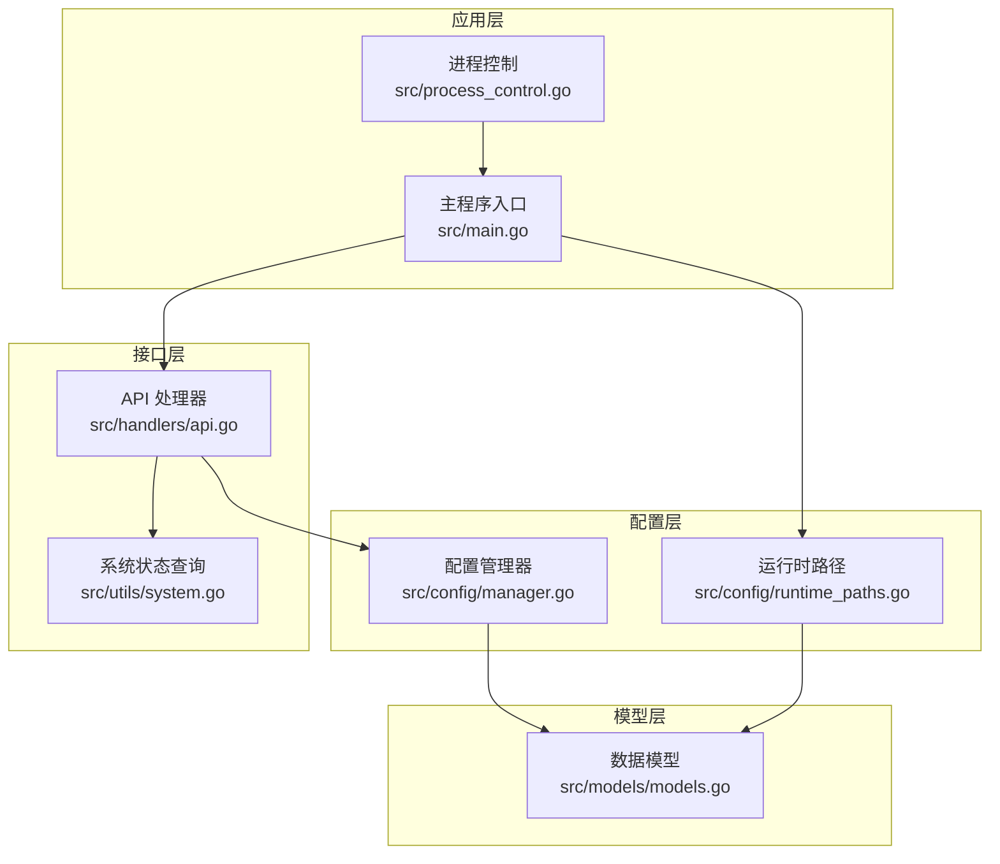
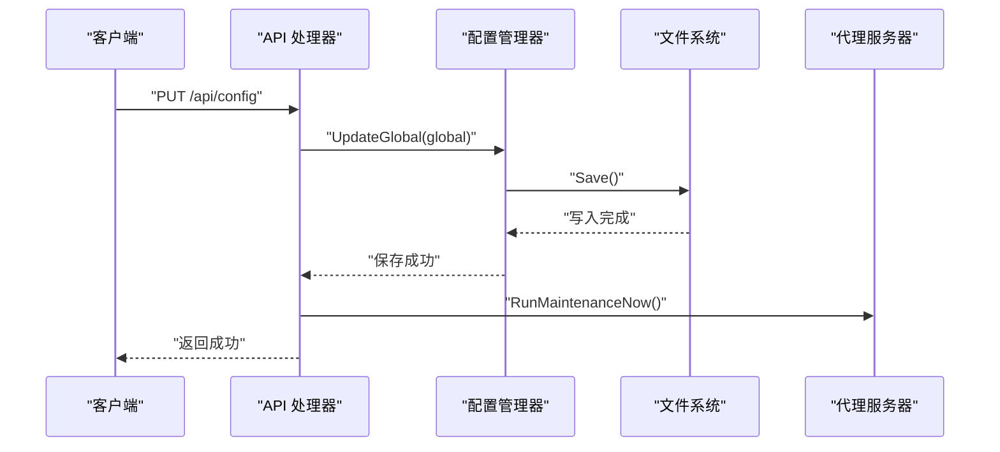
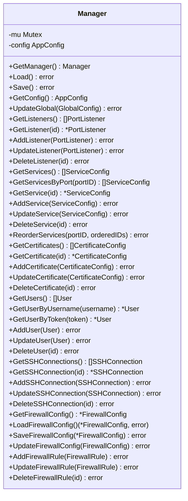
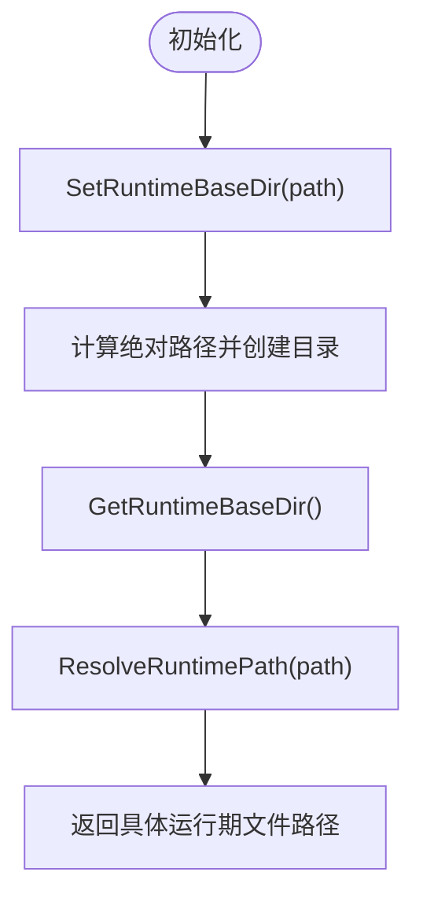
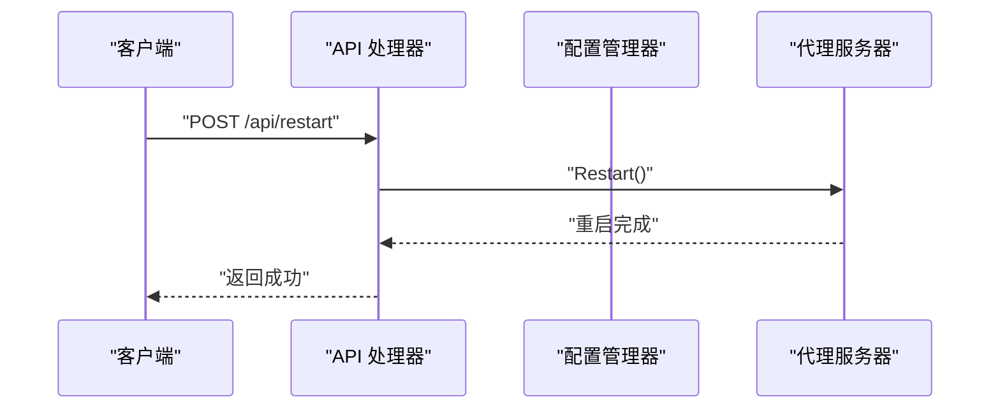
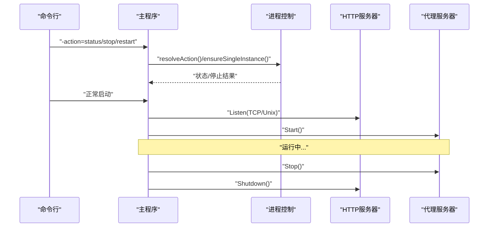
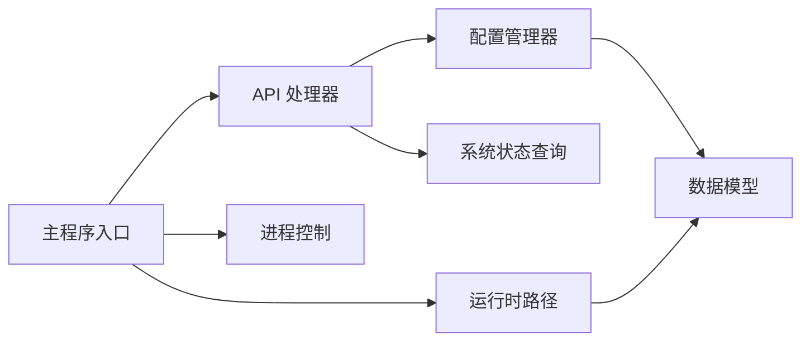

# 配置处理器

<cite>
**本文引用的文件**
- [src/config/manager.go](file://src/config/manager.go)
- [src/config/runtime_paths.go](file://src/config/runtime_paths.go)
- [src/handlers/api.go](file://src/handlers/api.go)
- [src/main.go](file://src/main.go)
- [src/models/models.go](file://src/models/models.go)
- [src/utils/system.go](file://src/utils/system.go)
- [src/process_control.go](file://src/process_control.go)
- [README.md](file://README.md)
</cite>

## 目录
1. [简介](#简介)
2. [项目结构](#项目结构)
3. [核心组件](#核心组件)
4. [架构总览](#架构总览)
5. [详细组件分析](#详细组件分析)
6. [依赖分析](#依赖分析)
7. [性能考虑](#性能考虑)
8. [故障排查指南](#故障排查指南)
9. [结论](#结论)
10. [附录](#附录)

## 简介
本文件面向“配置处理器”的全面技术文档，聚焦全局配置管理的实现机制，涵盖配置项的读取、更新与持久化；服务器状态查询与重启功能；配置热重载的触发机制与数据同步策略；配置验证规则与约束；配置备份与恢复流程；配置迁移与版本兼容性处理；以及配置相关的 API 调用示例与最佳实践。

## 项目结构
配置系统围绕“配置管理器”“运行时路径解析”“API 处理器”“主程序入口”“模型定义”“系统状态查询”“进程控制”展开，形成清晰的分层与职责边界。

图表来源
- [src/config/manager.go:1-791](file://src/config/manager.go#L1-L791)
- [src/config/runtime_paths.go:1-160](file://src/config/runtime_paths.go#L1-L160)
- [src/handlers/api.go:1-785](file://src/handlers/api.go#L1-L785)
- [src/main.go:1-516](file://src/main.go#L1-L516)
- [src/models/models.go:1-394](file://src/models/models.go#L1-L394)
- [src/utils/system.go:1-124](file://src/utils/system.go#L1-L124)
- [src/process_control.go:1-139](file://src/process_control.go#L1-L139)

章节来源
- [src/config/manager.go:1-791](file://src/config/manager.go#L1-L791)
- [src/config/runtime_paths.go:1-160](file://src/config/runtime_paths.go#L1-L160)
- [src/handlers/api.go:1-785](file://src/handlers/api.go#L1-L785)
- [src/main.go:1-516](file://src/main.go#L1-L516)
- [src/models/models.go:1-394](file://src/models/models.go#L1-L394)
- [src/utils/system.go:1-124](file://src/utils/system.go#L1-L124)
- [src/process_control.go:1-139](file://src/process_control.go#L1-L139)

## 核心组件
- 配置管理器：负责全局配置、监听器、服务、证书、用户、SSH、防火墙等配置的读取、更新、持久化与规范化。
- 运行时路径：集中解析配置文件、PID 文件、Socket 文件、缓存数据库、证书目录等运行期文件路径。
- API 处理器：提供配置查询与更新、监听器/服务/证书/用户/SSH/防火墙等管理接口，封装热重载与重启调用。
- 主程序入口：初始化运行目录、安全密钥、审计日志、代理服务器、HTTP 路由与监听，挂载 API 路由。
- 数据模型：定义全局配置、监听器、服务、证书、用户、SSH、防火墙等结构体及枚举。
- 系统状态查询：提供服务器运行时状态（CPU、内存、网络、主机信息）。
- 进程控制：提供 status/stop/restart 子命令与 PID 文件管理，确保单实例与优雅退出。

章节来源
- [src/config/manager.go:18-791](file://src/config/manager.go#L18-L791)
- [src/config/runtime_paths.go:12-160](file://src/config/runtime_paths.go#L12-L160)
- [src/handlers/api.go:20-785](file://src/handlers/api.go#L20-L785)
- [src/main.go:24-516](file://src/main.go#L24-L516)
- [src/models/models.go:72-394](file://src/models/models.go#L72-L394)
- [src/utils/system.go:19-124](file://src/utils/system.go#L19-L124)
- [src/process_control.go:17-139](file://src/process_control.go#L17-L139)

## 架构总览
配置处理器采用“单例配置管理器 + 运行时路径解析 + API 层封装 + 主程序驱动”的架构模式，保证配置的线程安全、一致性与可运维性。

图表来源
- [src/handlers/api.go:761-775](file://src/handlers/api.go#L761-L775)
- [src/config/manager.go:96-107](file://src/config/manager.go#L96-L107)

章节来源
- [src/handlers/api.go:732-785](file://src/handlers/api.go#L732-L785)
- [src/config/manager.go:74-107](file://src/config/manager.go#L74-L107)

## 详细组件分析

### 配置管理器（Manager）
- 单例模式：通过 once.Do 保证只初始化一次，内部持有 AppConfig 并使用 RWMutex 保证并发安全。
- 生命周期：
  - 初始化：设置默认全局配置、内置管理员用户，随后 Load() 尝试从磁盘加载配置。
  - 加载：读取配置文件，JSON 反序列化，规范化全局与服务排序，失败时自动创建默认配置并保存。
  - 保存：规范化全局配置，序列化为缩进 JSON，确保目录存在后写入文件。
- 规范化策略：
  - 全局配置：端口、日志级别、日志文件、日志保留天数、最大日志条数、证书路径与同步间隔等缺失或非法值进行默认填充。
  - 证书：状态、自动续期、续期提前天数、来源等进行默认填充。
  - 服务排序：同端口下默认规则优先级高于显式规则，排序值缺失时按创建时间补全。
- 配置项 CRUD：
  - 全局：UpdateGlobal() 直接替换并保存。
  - 监听器：AddListener/UpdateListener/DeleteListener，删除监听器同时清理关联服务。
  - 服务：AddService/UpdateService/DeleteService/ReorderServices，支持同端口内排序调整与默认规则处理。
  - 证书：AddCertificate/UpdateCertificate/DeleteCertificate，含证书来源与续期策略规范化。
  - 用户：AddUser/UpdateUser/DeleteUser，含 Token 唯一性校验与密码哈希。
  - SSH：AddSSHConnection/UpdateSSHConnection/DeleteSSHConnection。
  - 防火墙：LoadFirewallConfig/SaveFirewallConfig/AddFirewallRule/UpdateFirewallRule/DeleteFirewallRule，支持默认配置回退。
- 线程安全：所有读取与写入均通过互斥锁保护，返回值均为深拷贝副本，避免外部修改内部状态。

图表来源
- [src/config/manager.go:18-791](file://src/config/manager.go#L18-L791)
- [src/models/models.go:299-394](file://src/models/models.go#L299-L394)

章节来源
- [src/config/manager.go:18-791](file://src/config/manager.go#L18-L791)
- [src/models/models.go:72-394](file://src/models/models.go#L72-L394)

### 运行时路径解析（runtime_paths）
- 职责：集中解析配置文件、PID 文件、Socket 文件、监控缓存、安全日志缓存、证书目录等运行期文件路径。
- 能力：
  - 设置/获取运行时根目录，支持相对路径解析为绝对路径并确保目录存在。
  - 管理管理后台监听方式：TCP 端口或 Unix Socket。
  - 提供各类运行期文件路径常量与解析函数。

图表来源
- [src/config/runtime_paths.go:31-160](file://src/config/runtime_paths.go#L31-L160)

章节来源
- [src/config/runtime_paths.go:12-160](file://src/config/runtime_paths.go#L12-L160)

### API 处理器（handlers/api.go）
- 配置管理 API：
  - GET /api/config：返回全局配置与运行期路径映射，敏感字段（如用户密码）在响应中隐藏。
  - PUT /api/config：接收 GlobalConfig，调用配置管理器更新并保存，随后触发证书维护任务。
- 监听器管理 API：
  - 列表、创建、更新、删除、启用/禁用、热重载等，涉及端口占用检测、启用状态与代理服务器联动。
- 服务管理 API：
  - 列表、创建、更新、删除、启用/禁用、排序调整、热重载等，涉及端口启用状态与代理服务器联动。
- 用户/证书/SSH/防火墙等管理 API：提供增删改查与唯一性/有效性校验。
- 服务器状态与重启：
  - GET /api/status：调用系统状态查询工具返回运行时指标。
  - POST /api/restart：调用代理服务器重启。

图表来源
- [src/handlers/api.go:777-784](file://src/handlers/api.go#L777-L784)

章节来源
- [src/handlers/api.go:129-785](file://src/handlers/api.go#L129-L785)

### 主程序入口（main.go）
- 初始化：
  - 解析命令行参数（action、secure、config_path、port），设置运行时根目录与管理后台监听方式。
  - 单实例保护：通过 PID 文件检测与终止旧进程。
  - 初始化安全日志存储、代理服务器、监控与证书管理器。
  - 注册 HTTP 路由，挂载认证、CORS、日志等中间件。
- 启动与关闭：
  - 根据配置选择 TCP 或 Unix Socket 监听管理后台。
  - 写入 PID 文件，启动代理服务器。
  - 优雅关闭：取消证书续期、关闭代理与 HTTP 服务器、清理 Socket 与 PID 文件。

图表来源
- [src/main.go:24-516](file://src/main.go#L24-L516)
- [src/process_control.go:17-139](file://src/process_control.go#L17-L139)

章节来源
- [src/main.go:24-516](file://src/main.go#L24-L516)
- [src/process_control.go:17-139](file://src/process_control.go#L17-L139)

### 数据模型（models）
- 全局配置（GlobalConfig）：管理端口、默认认证、日志级别、日志文件、日志保留天数、最大日志条数、证书路径与同步间隔。
- 监听器（PortListener）：端口、协议（http/https）、启用状态、创建/更新时间。
- 服务（ServiceConfig）：端口 ID、名称、类型、域名、排序、证书绑定、启用状态、配置对象、认证需求、创建/更新时间。
- 证书（CertificateConfig）：名称、域名、来源、挑战类型、DNS 提供商与凭据、账户邮箱、自动续期、续期提前天数、证书/密钥路径、注册/证书 URL、状态与时间戳。
- 用户（User）：ID、用户名、密码（哈希）、Token、邮箱、启用状态、角色、创建/更新时间。
- SSH（SSHConnection）：名称、主机、端口、用户名、密码、工作目录、是否本地、创建/更新时间。
- 防火墙（FirewallConfig/Rule）：开关、默认拒绝、规则列表（类型、IP/CIDR、国家、动作、优先级、描述、创建/更新时间）。

章节来源
- [src/models/models.go:72-394](file://src/models/models.go#L72-L394)

### 系统状态查询（utils/system.go）
- 提供服务器运行时状态：运行时间、内存使用、CPU 使用率、网络收发字节与速率、主机信息。
- 用于 /api/status 接口的数据来源。

章节来源
- [src/utils/system.go:19-124](file://src/utils/system.go#L19-L124)

## 依赖分析
- 配置管理器依赖模型定义与安全模块（密码哈希等），负责配置持久化与规范化。
- API 处理器依赖配置管理器与代理服务器，负责对外暴露配置与资源管理接口。
- 主程序入口依赖配置管理器、运行时路径、代理服务器、中间件与进程控制，负责应用生命周期管理。
- 运行时路径为所有运行期文件提供统一解析能力，降低耦合度。
- 系统状态查询为 API 提供运行时指标，便于运维监控。

图表来源
- [src/handlers/api.go:1-785](file://src/handlers/api.go#L1-L785)
- [src/config/manager.go:1-791](file://src/config/manager.go#L1-L791)
- [src/main.go:1-516](file://src/main.go#L1-L516)
- [src/config/runtime_paths.go:1-160](file://src/config/runtime_paths.go#L1-L160)
- [src/utils/system.go:1-124](file://src/utils/system.go#L1-L124)
- [src/process_control.go:1-139](file://src/process_control.go#L1-L139)
- [src/models/models.go:1-394](file://src/models/models.go#L1-L394)

章节来源
- [src/handlers/api.go:1-785](file://src/handlers/api.go#L1-L785)
- [src/config/manager.go:1-791](file://src/config/manager.go#L1-L791)
- [src/main.go:1-516](file://src/main.go#L1-L516)
- [src/config/runtime_paths.go:1-160](file://src/config/runtime_paths.go#L1-L160)
- [src/utils/system.go:1-124](file://src/utils/system.go#L1-L124)
- [src/process_control.go:1-139](file://src/process_control.go#L1-L139)
- [src/models/models.go:1-394](file://src/models/models.go#L1-L394)

## 性能考虑
- 并发安全：配置管理器使用读写锁，读多写少场景下读锁提升吞吐。
- 序列化开销：保存配置采用缩进 JSON，便于人工阅读；如需极致性能可考虑二进制格式或增量写入。
- 规范化成本：加载时一次性规范化全局与服务排序，避免后续频繁校验。
- 热重载策略：API 层在更新配置后触发证书维护任务，避免阻塞配置保存流程。
- 进程控制：停止进程采用轮询与超时控制，确保单实例保护与优雅退出。

[本节为通用性能讨论，不直接分析具体文件]

## 故障排查指南
- 配置文件损坏：
  - 现象：加载配置失败或返回默认配置。
  - 处理：检查配置文件格式与权限，必要时删除配置文件让系统自动生成默认配置。
- 端口冲突：
  - 现象：创建/更新监听器时提示端口被占用。
  - 处理：更换端口或释放占用端口；系统会自动将启用状态降为未启用以避免启动失败。
- 管理后台不可用：
  - 现象：无法访问管理后台。
  - 处理：检查管理端口或 Unix Socket 文件路径，确认进程状态与 PID 文件。
- 重启失败：
  - 现象：POST /api/restart 返回错误。
  - 处理：查看代理服务器日志，确认重启流程是否被中断；必要时使用 -action=stop/-action=restart 控制进程。
- 防火墙规则异常：
  - 现象：规则未生效或冲突。
  - 处理：检查规则优先级与默认拒绝策略，确保规则类型与目标正确。

章节来源
- [src/handlers/api.go:64-93](file://src/handlers/api.go#L64-L93)
- [src/handlers/api.go:777-784](file://src/handlers/api.go#L777-L784)
- [src/process_control.go:17-139](file://src/process_control.go#L17-L139)

## 结论
配置处理器通过“单例配置管理器 + 运行时路径解析 + API 层封装 + 主程序驱动”的架构，实现了配置的读取、更新、持久化、规范化与热重载；结合进程控制与系统状态查询，提供了完整的运维能力。遵循本文的最佳实践与故障排查建议，可在生产环境中稳定地管理配置与服务。

[本节为总结性内容，不直接分析具体文件]

## 附录

### 配置验证规则与约束
- 监听器：
  - 端口范围：1-65535。
  - 协议：仅支持 http/https。
  - 管理端口：禁止占用管理后台端口。
  - 唯一性：同一端口不可重复添加。
  - 占用检测：若端口被占用，启用状态将被降为未启用。
- 全局配置：
  - 端口、日志级别、日志文件、日志保留天数、最大日志条数、证书路径与同步间隔等缺失或非法值将被规范化为默认值。
- 服务排序：
  - 默认规则优先级高于显式规则；排序值缺失时按创建时间补全。
- 用户：
  - Token 唯一性校验；至少保留一个启用用户。
- 证书：
  - 状态、自动续期、续期提前天数、来源等规范化；来源为空时默认 imported。

章节来源
- [src/handlers/api.go:64-93](file://src/handlers/api.go#L64-L93)
- [src/config/manager.go:109-137](file://src/config/manager.go#L109-L137)
- [src/config/manager.go:169-225](file://src/config/manager.go#L169-L225)
- [src/handlers/api.go:644-691](file://src/handlers/api.go#L644-L691)

### 配置热重载与数据同步
- 触发机制：
  - 监听器：启用/禁用、热重载接口调用后，联动代理服务器启动/停止/重载。
  - 服务：启用/禁用、排序调整、删除后，按端口联动代理服务器重载。
  - 全局：更新后触发证书维护任务，确保证书同步策略生效。
- 数据同步策略：
  - 所有更新先写入磁盘，再调用代理服务器进行热重载；失败不影响数据保存。
  - 防火墙配置独立文件，更新后立即写入运行期文件。

章节来源
- [src/handlers/api.go:200-208](file://src/handlers/api.go#L200-L208)
- [src/handlers/api.go:254-266](file://src/handlers/api.go#L254-L266)
- [src/handlers/api.go:405-411](file://src/handlers/api.go#L405-L411)
- [src/handlers/api.go:437-443](file://src/handlers/api.go#L437-L443)
- [src/handlers/api.go:487-492](file://src/handlers/api.go#L487-L492)
- [src/handlers/api.go:772](file://src/handlers/api.go#L772)
- [src/config/manager.go:682-698](file://src/config/manager.go#L682-L698)

### 配置备份与恢复
- 备份：
  - 备份运行时根目录下的配置文件、缓存数据库、证书目录、PID 文件与 Socket 文件。
  - 可通过 -config_path 指定统一目录，便于打包备份。
- 恢复：
  - 将备份文件还原至相同目录结构，确保权限正确。
  - 如需恢复配置，直接覆盖配置文件即可；系统启动时会自动加载。

章节来源
- [README.md:156-166](file://README.md#L156-L166)
- [src/config/runtime_paths.go:85-115](file://src/config/runtime_paths.go#L85-L115)

### 配置迁移与版本兼容
- 迁移策略：
  - 新增字段：加载时通过规范化函数填充默认值，保证向后兼容。
  - 字段变更：保持 JSON 字段名不变，必要时在规范化阶段做兼容转换。
  - 证书来源与状态：新增枚举值时，通过规范化函数映射默认值。
- 版本兼容：
  - 低版本配置升级到高版本时，系统会自动规范化缺失字段，避免因字段缺失导致的异常。

章节来源
- [src/config/manager.go:109-137](file://src/config/manager.go#L109-L137)
- [src/config/manager.go:212-225](file://src/config/manager.go#L212-L225)

### 配置 API 调用示例与最佳实践
- 查询全局配置：
  - 方法：GET /api/config
  - 返回：全局配置与运行期路径映射，敏感字段已隐藏。
- 更新全局配置：
  - 方法：PUT /api/config
  - 请求体：GlobalConfig
  - 行为：更新并保存，随后触发证书维护任务。
- 监听器管理：
  - 创建：POST /api/listeners，请求体包含 PortListener 与可选默认服务。
  - 更新：PUT /api/listeners/{id}
  - 删除：DELETE /api/listeners/{id}
  - 启用/禁用：POST /api/listeners/{id}/toggle
  - 热重载：POST /api/listeners/{id}/reload
- 服务管理：
  - 创建/更新/删除/启用/禁用/排序调整/热重载：对应 /api/services 与 /api/services/reorder。
- 服务器状态与重启：
  - 状态：GET /api/status
  - 重启：POST /api/restart

最佳实践：
- 在更新全局配置后，及时检查证书同步是否按预期执行。
- 修改监听器配置时，先验证端口占用情况，避免启用失败。
- 服务排序调整后，确认端口处于启用状态以便热重载生效。
- 用户管理中，确保 Token 唯一性，避免认证冲突。
- 生产环境务必显式指定 -secure 参数，避免使用默认密钥。

章节来源
- [src/handlers/api.go:139-785](file://src/handlers/api.go#L139-L785)
- [README.md:105-154](file://README.md#L105-L154)