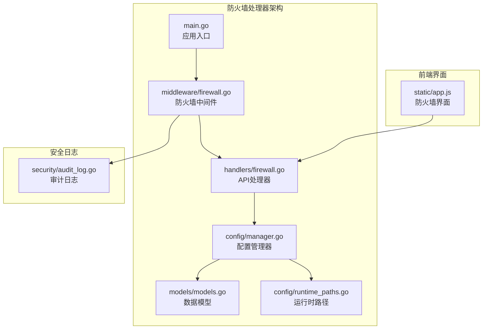
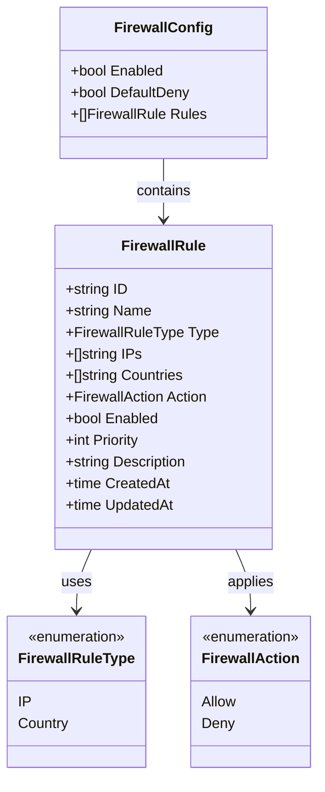
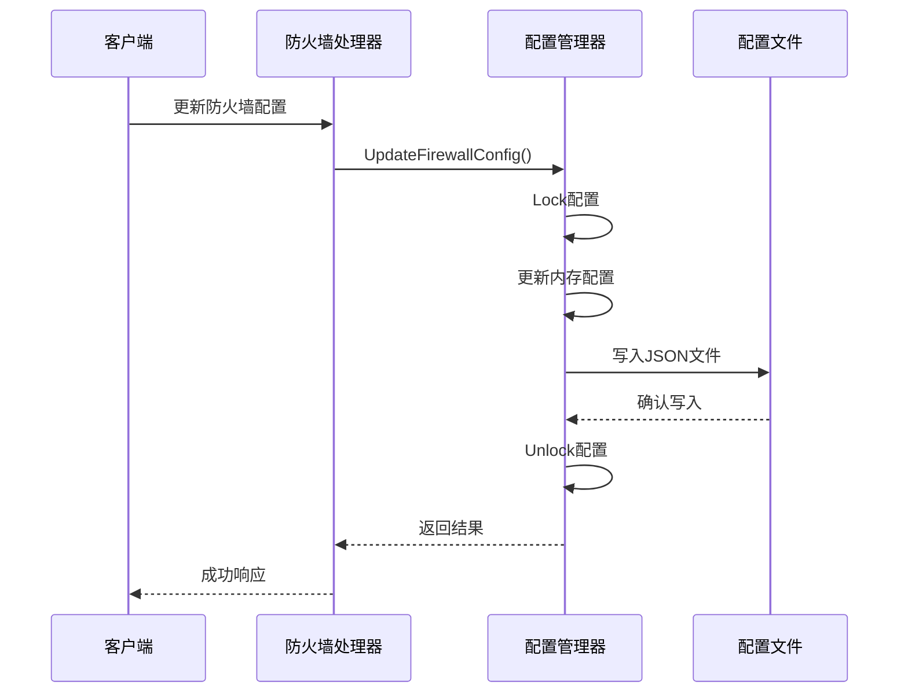
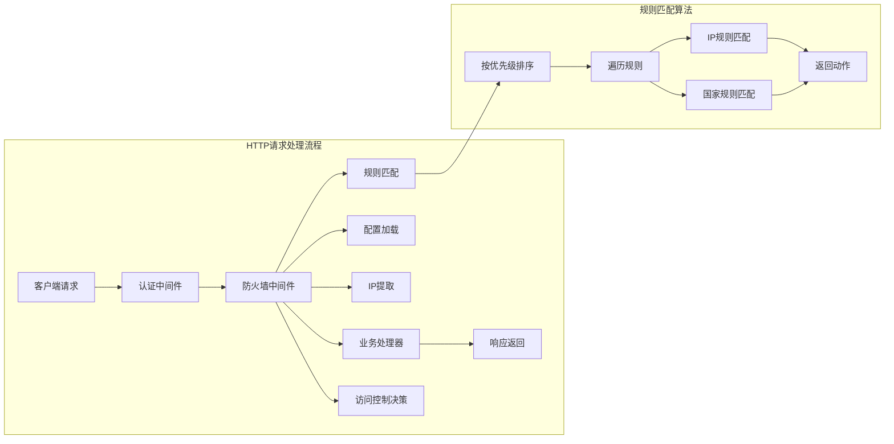
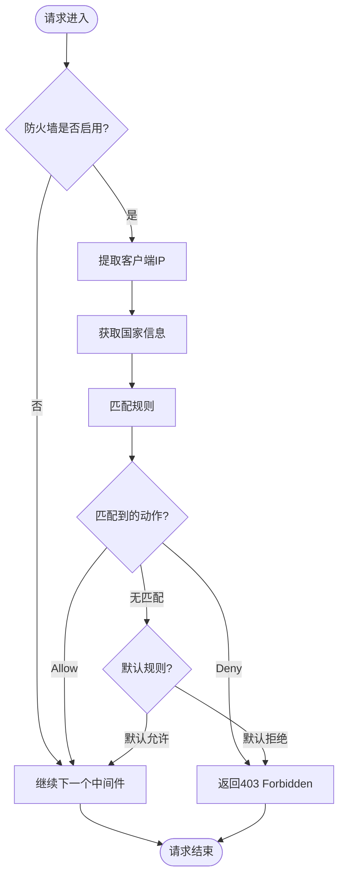
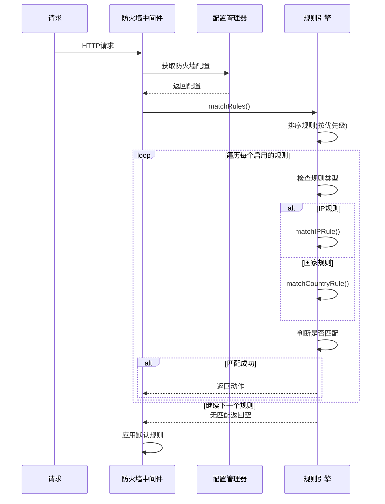
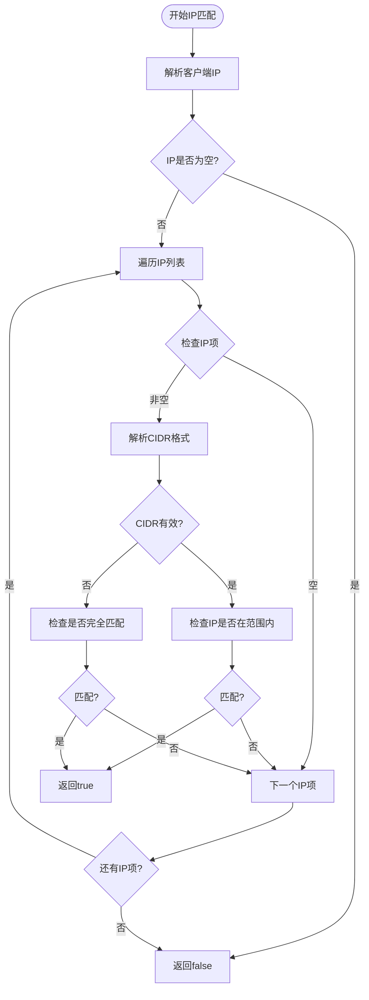
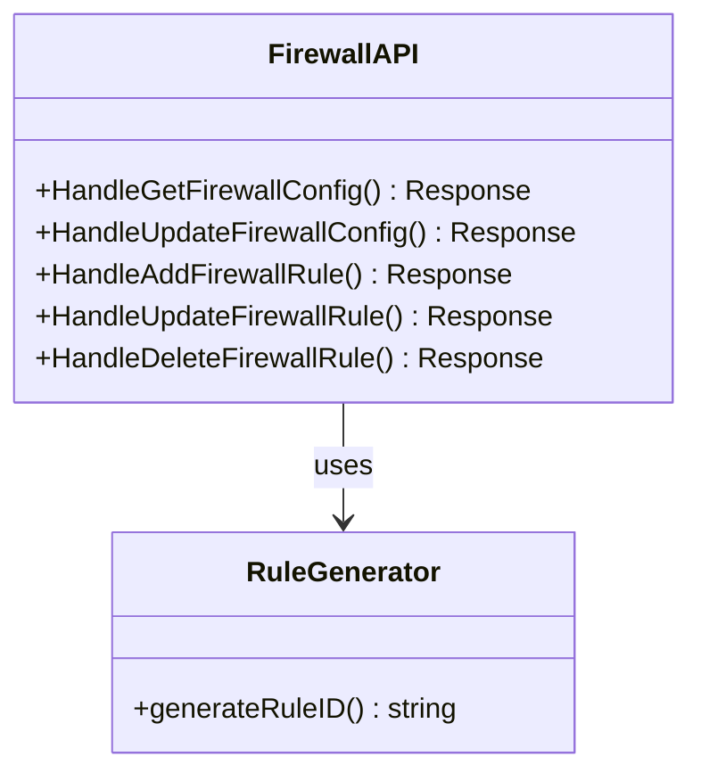
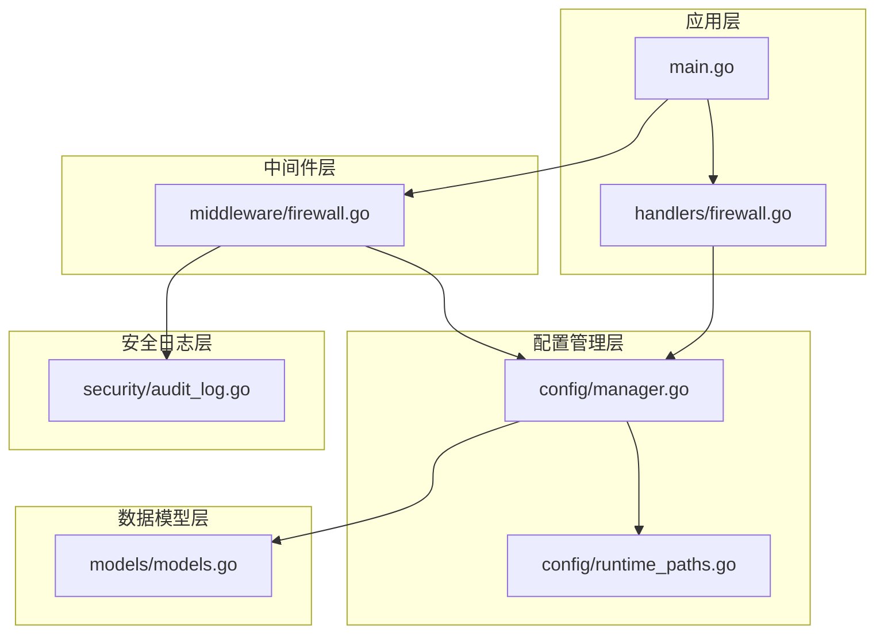
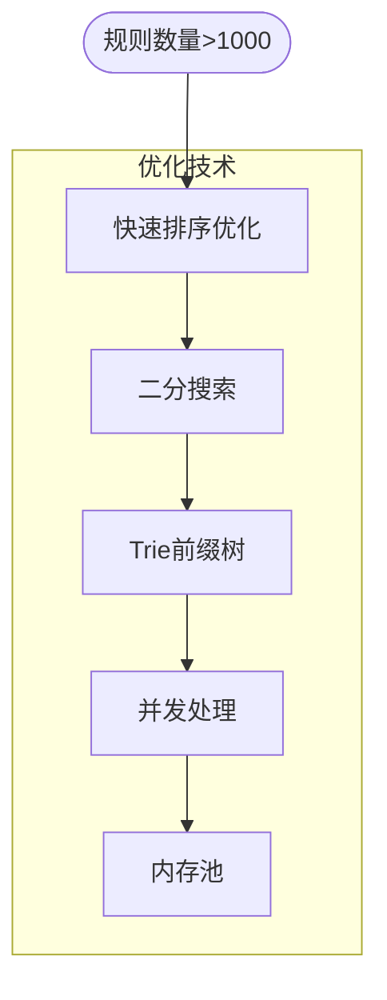

# 防火墙处理器

<cite>
**本文档引用的文件**
- [src/handlers/firewall.go](file://src/handlers/firewall.go)
- [src/middleware/firewall.go](file://src/middleware/firewall.go)
- [src/models/models.go](file://src/models/models.go)
- [src/config/manager.go](file://src/config/manager.go)
- [src/config/runtime_paths.go](file://src/config/runtime_paths.go)
- [src/main.go](file://src/main.go)
- [src/static/app.js](file://src/static/app.js)
- [src/security/audit_log.go](file://src/security/audit_log.go)
</cite>

## 目录
1. [简介](#简介)
2. [项目结构](#项目结构)
3. [核心组件](#核心组件)
4. [架构概览](#架构概览)
5. [详细组件分析](#详细组件分析)
6. [依赖关系分析](#依赖关系分析)
7. [性能考虑](#性能考虑)
8. [故障排除指南](#故障排除指南)
9. [结论](#结论)
10. [附录](#附录)

## 简介

防火墙处理器是 Caddy Panel 项目中的核心安全组件，负责实现基于 IP 地址和国家规则的访问控制机制。该系统提供了完整的防火墙配置管理、实时流量过滤和阻断功能，支持动态更新和缓存策略。

防火墙处理器采用中间件架构设计，通过 HTTP 请求拦截实现对所有 API 请求的访问控制。系统支持两种规则类型：IP/IP 段规则和国家规则，通过优先级机制确保规则匹配的准确性。

## 项目结构

防火墙处理器在项目中的组织结构如下：



**图表来源**
- [src/main.go:421-427](file://src/main.go#L421-L427)
- [src/middleware/firewall.go:13-50](file://src/middleware/firewall.go#L13-L50)
- [src/handlers/firewall.go:20-59](file://src/handlers/firewall.go#L20-L59)

**章节来源**
- [src/main.go:421-427](file://src/main.go#L421-L427)
- [src/handlers/firewall.go:1-168](file://src/handlers/firewall.go#L1-L168)
- [src/middleware/firewall.go:1-226](file://src/middleware/firewall.go#L1-L226)

## 核心组件

### 数据模型设计

防火墙系统的核心数据模型包括防火墙配置、规则类型和操作动作：



**图表来源**
- [src/models/models.go:346-382](file://src/models/models.go#L346-L382)

### 配置管理机制

防火墙配置采用运行时文件存储机制，支持动态更新和持久化：



**图表来源**
- [src/handlers/firewall.go:32-59](file://src/handlers/firewall.go#L32-L59)
- [src/config/manager.go:700-703](file://src/config/manager.go#L700-L703)

**章节来源**
- [src/models/models.go:346-382](file://src/models/models.go#L346-L382)
- [src/config/manager.go:653-698](file://src/config/manager.go#L653-L698)

## 架构概览

防火墙处理器采用中间件模式，集成在 HTTP 请求处理管道中：



**图表来源**
- [src/middleware/firewall.go:14-50](file://src/middleware/firewall.go#L14-L50)
- [src/middleware/firewall.go:138-174](file://src/middleware/firewall.go#L138-L174)

## 详细组件分析

### 防火墙中间件实现

防火墙中间件是整个系统的核心组件，负责拦截 HTTP 请求并执行访问控制：



**图表来源**
- [src/middleware/firewall.go:14-50](file://src/middleware/firewall.go#L14-L50)

#### IP 地址提取机制

系统支持多层 IP 提取，确保获取准确的客户端真实 IP：

| 提取层级 | 头部字段 | 优先级 | 说明 |
|---------|---------|--------|------|
| 第一层 | X-Forwarded-For | 最高 | 代理服务器传递的原始客户端IP |
| 第二层 | X-Real-IP | 中等 | 单一代理服务器IP |
| 第三层 | RemoteAddr | 最低 | 直接连接的IP地址 |

**章节来源**
- [src/middleware/firewall.go:52-76](file://src/middleware/firewall.go#L52-L76)
- [src/middleware/firewall.go:78-88](file://src/middleware/firewall.go#L78-L88)

### 规则匹配机制

规则匹配采用优先级排序和短路求值策略：



**图表来源**
- [src/middleware/firewall.go:138-174](file://src/middleware/firewall.go#L138-L174)
- [src/middleware/firewall.go:176-210](file://src/middleware/firewall.go#L176-L210)

#### IP 规则匹配算法

IP 规则支持单个 IP 和 CIDR 网段匹配：



**图表来源**
- [src/middleware/firewall.go:176-210](file://src/middleware/firewall.go#L176-L210)

**章节来源**
- [src/middleware/firewall.go:138-225](file://src/middleware/firewall.go#L138-L225)

### API 处理器实现

防火墙 API 处理器提供完整的 CRUD 操作：



**图表来源**
- [src/handlers/firewall.go:20-167](file://src/handlers/firewall.go#L20-L167)

#### 规则优先级管理

前端界面支持拖拽排序，规则优先级通过以下机制管理：

1. **自动分配优先级**：新规则自动分配为当前最大优先级 + 1
2. **拖拽重排**：支持通过拖拽调整规则顺序
3. **持久化存储**：优先级变更立即保存到配置文件

**章节来源**
- [src/handlers/firewall.go:15-18](file://src/handlers/firewall.go#L15-L18)
- [src/static/app.js:4296-4298](file://src/static/app.js#L4296-L4298)

## 依赖关系分析

防火墙处理器的依赖关系呈现清晰的分层结构：



**图表来源**
- [src/main.go:421-427](file://src/main.go#L421-L427)
- [src/middleware/firewall.go:9-11](file://src/middleware/firewall.go#L9-L11)
- [src/config/manager.go:12-14](file://src/config/manager.go#L12-L14)

**章节来源**
- [src/main.go:421-427](file://src/main.go#L421-L427)
- [src/config/manager.go:18-21](file://src/config/manager.go#L18-L21)

## 性能考虑

### 缓存策略

防火墙处理器采用以下缓存策略优化性能：

1. **配置缓存**：配置管理器使用读写锁保护配置数据
2. **规则预编译**：规则在内存中按优先级排序，避免每次请求重新排序
3. **IP 解析缓存**：客户端 IP 解析结果在单个请求生命周期内复用

### 大规模规则处理

针对大规模规则集的优化措施：



### 实时性能监控

系统提供以下性能监控指标：

- **请求延迟**：防火墙中间件处理时间
- **规则匹配率**：平均匹配复杂度
- **内存使用**：配置和规则内存占用
- **吞吐量**：每秒处理请求数

## 故障排除指南

### 常见问题诊断

| 问题类型 | 症状 | 诊断步骤 | 解决方案 |
|---------|------|----------|----------|
| 规则不生效 | 请求被错误放行/阻断 | 检查规则优先级和启用状态 | 调整规则顺序，启用相应规则 |
| IP识别错误 | 无法正确识别客户端IP | 检查代理配置和头部设置 | 配置正确的代理头部 |
| 性能下降 | 请求延迟增加 | 监控规则数量和匹配复杂度 | 优化规则结构，清理无效规则 |
| 配置丢失 | 重启后规则消失 | 检查文件权限和磁盘空间 | 修复权限问题，清理磁盘空间 |

### 调试工具

系统提供以下调试工具：

1. **规则测试工具**：验证规则匹配准确性
2. **性能分析器**：监控规则匹配性能
3. **日志分析器**：分析访问控制决策过程
4. **配置验证器**：检查配置文件格式正确性

**章节来源**
- [src/middleware/firewall.go:90-106](file://src/middleware/firewall.go#L90-L106)
- [src/config/manager.go:653-680](file://src/config/manager.go#L653-L680)

## 结论

防火墙处理器是一个设计精良的安全组件，具有以下特点：

1. **模块化设计**：清晰的分层架构便于维护和扩展
2. **高性能实现**：优化的规则匹配算法支持大规模规则处理
3. **易用性强**：直观的前端界面和完善的 API 接口
4. **可扩展性好**：支持动态更新和未来功能扩展

系统通过中间件模式无缝集成到现有应用架构中，为 Caddy Panel 提供了强大的访问控制能力。

## 附录

### API 调用示例

#### 获取防火墙配置
```bash
curl -X GET http://localhost:8080/api/firewall \
  -H "Authorization: Bearer YOUR_TOKEN"
```

#### 更新防火墙配置
```bash
curl -X POST http://localhost:8080/api/firewall \
  -H "Content-Type: application/json" \
  -H "Authorization: Bearer YOUR_TOKEN" \
  -d '{
    "enabled": true,
    "default_deny": false,
    "rules": []
  }'
```

#### 添加防火墙规则
```bash
curl -X POST http://localhost:8080/api/firewall/rules \
  -H "Content-Type: application/json" \
  -H "Authorization: Bearer YOUR_TOKEN" \
  -d '{
    "name": "内网访问",
    "type": "ip",
    "ips": ["192.168.0.0/16"],
    "action": "allow",
    "priority": 1,
    "enabled": true
  }'
```

### 配置最佳实践

1. **规则优先级**：将最具体的规则放在前面
2. **默认规则**：生产环境建议使用默认拒绝
3. **定期审查**：定期清理无效和过期规则
4. **备份策略**：定期备份防火墙配置文件
5. **监控告警**：设置访问控制异常告警机制