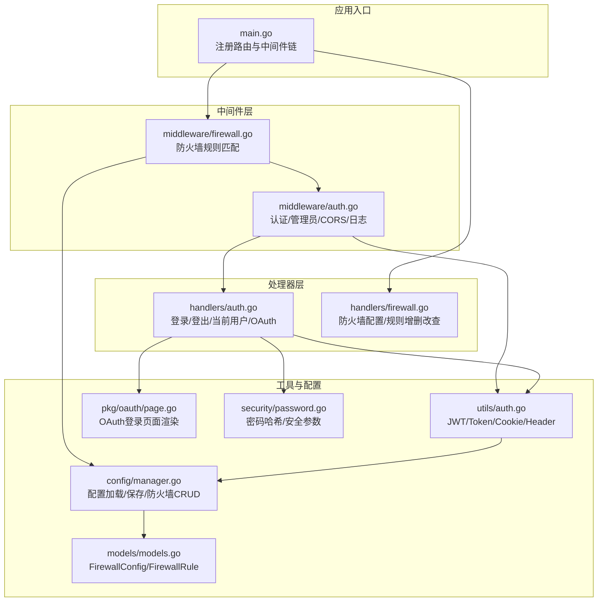
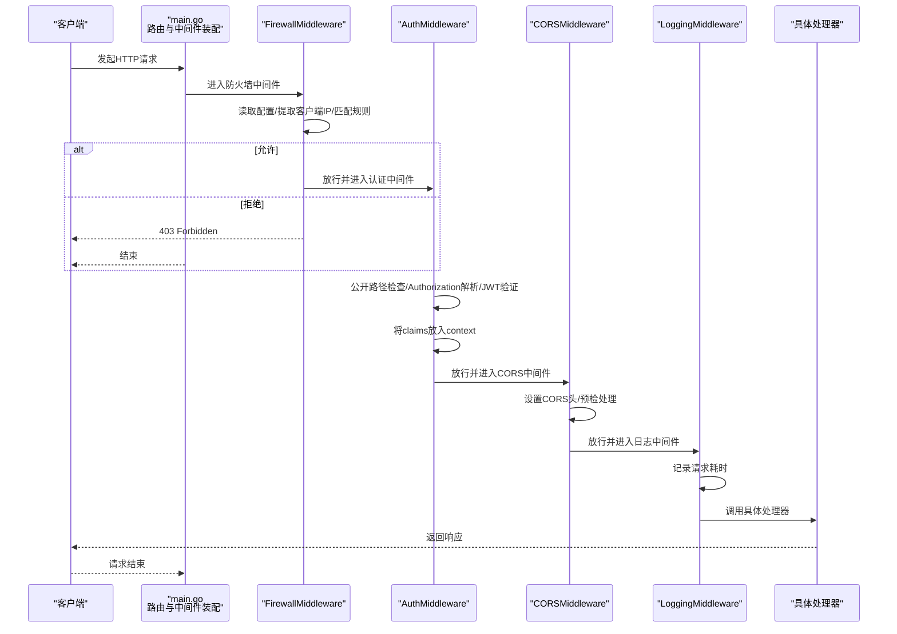
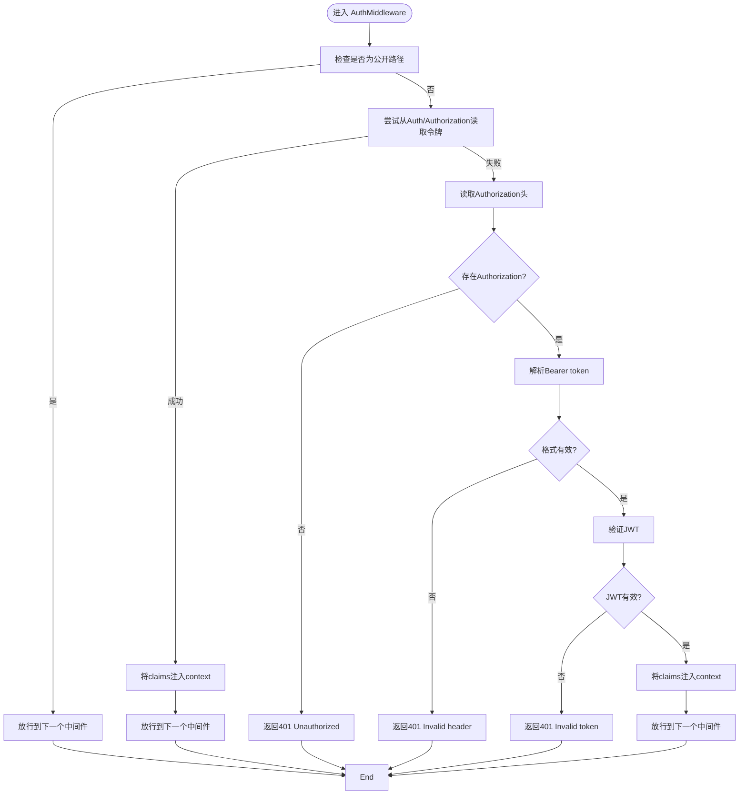
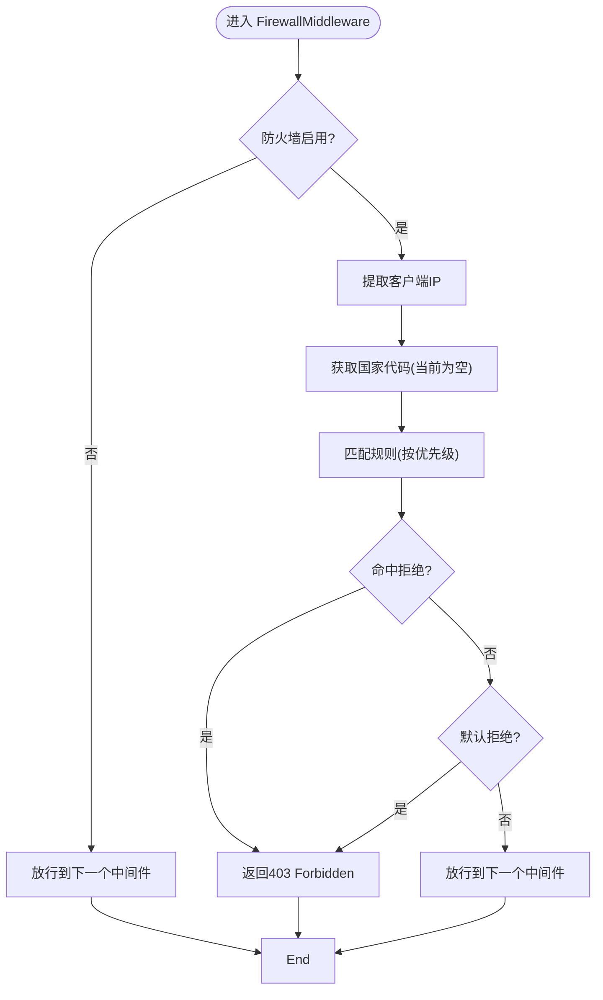
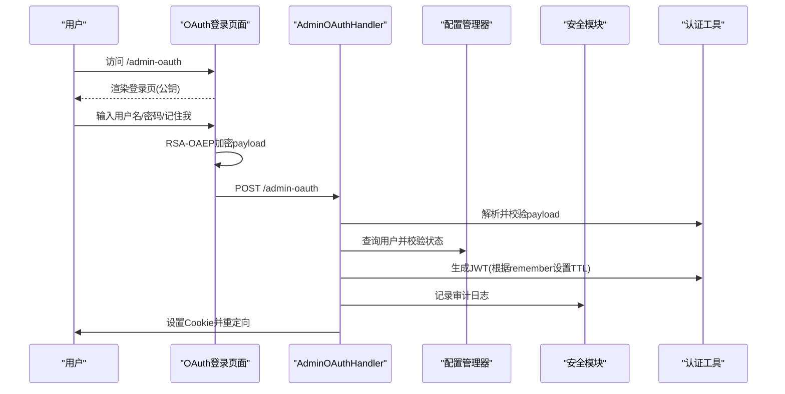
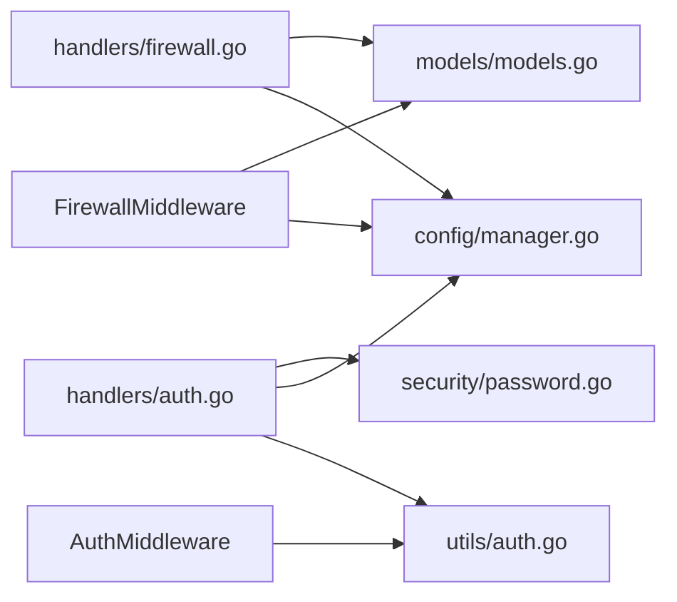

# 中间件系统

<cite>
**本文引用的文件**
- [src/middleware/auth.go](file://src/middleware/auth.go)
- [src/middleware/firewall.go](file://src/middleware/firewall.go)
- [src/handlers/auth.go](file://src/handlers/auth.go)
- [src/handlers/firewall.go](file://src/handlers/firewall.go)
- [src/main.go](file://src/main.go)
- [src/models/models.go](file://src/models/models.go)
- [src/utils/auth.go](file://src/utils/auth.go)
- [src/config/manager.go](file://src/config/manager.go)
- [src/pkg/oauth/page.go](file://src/pkg/oauth/page.go)
- [src/security/password.go](file://src/security/password.go)
- [README.md](file://README.md)
</cite>

## 目录
1. [简介](#简介)
2. [项目结构](#项目结构)
3. [核心组件](#核心组件)
4. [架构总览](#架构总览)
5. [详细组件分析](#详细组件分析)
6. [依赖分析](#依赖分析)
7. [性能考虑](#性能考虑)
8. [故障排查指南](#故障排查指南)
9. [结论](#结论)
10. [附录](#附录)

## 简介
本文件系统性阐述中间件系统的架构设计与执行顺序，重点覆盖认证中间件与防火墙中间件的实现原理，以及它们如何通过链式调用与上下文传递协同工作。文档还解释了 JWT 验证流程、OAuth 集成、权限检查逻辑、IP 规则匹配、国家过滤与访问控制实现，并提供扩展机制、自定义开发指南、性能影响分析与优化建议，以及配置示例与常见使用场景。

## 项目结构
中间件系统位于 src/middleware 目录，配合 src/handlers 提供 API 与页面处理，src/utils 提供认证工具（JWT、Cookie、Header Token），src/config 提供配置管理（含防火墙配置持久化），src/models 定义防火墙规则与配置的数据模型，src/pkg/oauth 提供 OAuth 登录页面渲染与前端加密逻辑，src/security 提供密码哈希与安全参数管理。

图表来源
- [src/main.go:421-427](file://src/main.go#L421-L427)
- [src/middleware/auth.go:14-119](file://src/middleware/auth.go#L14-L119)
- [src/middleware/firewall.go:13-50](file://src/middleware/firewall.go#L13-L50)
- [src/handlers/auth.go:37-266](file://src/handlers/auth.go#L37-L266)
- [src/handlers/firewall.go:20-168](file://src/handlers/firewall.go#L20-L168)
- [src/utils/auth.go:24-139](file://src/utils/auth.go#L24-L139)
- [src/config/manager.go:639-791](file://src/config/manager.go#L639-L791)
- [src/models/models.go:377-382](file://src/models/models.go#L377-L382)
- [src/pkg/oauth/page.go:15-197](file://src/pkg/oauth/page.go#L15-L197)
- [src/security/password.go:44-71](file://src/security/password.go#L44-L71)

章节来源
- [src/main.go:112-431](file://src/main.go#L112-L431)

## 核心组件
- 认证中间件链
  - FirewallMiddleware：前置防火墙拦截
  - AuthMiddleware：认证拦截与上下文注入
  - CORSMiddleware：跨域处理
  - LoggingMiddleware：日志记录
- 防火墙中间件：基于配置的 IP/国家规则匹配与默认拒绝策略
- 认证工具：JWT 生成与验证、Cookie 设置、Header Token 解析
- 配置管理：防火墙配置的加载、保存与规则 CRUD

章节来源
- [src/middleware/auth.go:14-119](file://src/middleware/auth.go#L14-L119)
- [src/middleware/firewall.go:13-50](file://src/middleware/firewall.go#L13-L50)
- [src/utils/auth.go:24-139](file://src/utils/auth.go#L24-L139)
- [src/config/manager.go:639-791](file://src/config/manager.go#L639-L791)

## 架构总览
中间件链在 main.go 中装配，形成“防火墙 -> 认证 -> CORS -> 日志”的执行顺序。请求进入后，依次经过各中间件处理，最终到达具体处理器；响应沿相反方向回流。

图表来源
- [src/main.go:421-427](file://src/main.go#L421-L427)
- [src/middleware/firewall.go:13-50](file://src/middleware/firewall.go#L13-L50)
- [src/middleware/auth.go:14-119](file://src/middleware/auth.go#L14-L119)

## 详细组件分析

### 认证中间件（AuthMiddleware）
- 公开路径豁免：对登录、公钥查询、登出等路径直接放行
- 多通道认证：
  - Header Token：支持 Auth、Authorization: Bearer、Authorization: Token 三种形式
  - Cookie：从认证 Cookie 读取并验证 JWT
  - 用户 Token：若请求头携带的 token 与某用户 Token 匹配且用户启用，则直接注入 claims
- 上下文传递：将 claims 注入到请求上下文，后续处理器可读取
- 管理员中间件：从上下文中读取 claims 并校验角色
- CORS 中间件：统一设置跨域头，预检请求快速返回
- 日志中间件：记录请求方法、路径与耗时

图表来源
- [src/middleware/auth.go:14-55](file://src/middleware/auth.go#L14-L55)
- [src/middleware/auth.go:75-91](file://src/middleware/auth.go#L75-L91)
- [src/middleware/auth.go:93-119](file://src/middleware/auth.go#L93-L119)

章节来源
- [src/middleware/auth.go:14-119](file://src/middleware/auth.go#L14-L119)
- [src/utils/auth.go:86-139](file://src/utils/auth.go#L86-L139)
- [src/handlers/auth.go:37-115](file://src/handlers/auth.go#L37-L115)

### 防火墙中间件（FirewallMiddleware）
- 配置来源：从配置管理器读取防火墙配置
- 执行条件：未启用时直接放行
- 客户端IP解析：优先 X-Forwarded-For，其次 X-Real-IP，最后 RemoteAddr
- 国家识别：当前返回空（预留 GeoIP 集成位置）
- 规则匹配：按优先级排序，逐条匹配 IP/Country 规则，命中即返回对应动作
- 默认策略：未匹配时根据 DefaultDeny 决定放行或拒绝

图表来源
- [src/middleware/firewall.go:13-50](file://src/middleware/firewall.go#L13-L50)
- [src/middleware/firewall.go:52-88](file://src/middleware/firewall.go#L52-L88)
- [src/middleware/firewall.go:90-136](file://src/middleware/firewall.go#L90-L136)
- [src/middleware/firewall.go:138-174](file://src/middleware/firewall.go#L138-L174)
- [src/middleware/firewall.go:176-210](file://src/middleware/firewall.go#L176-L210)
- [src/middleware/firewall.go:212-225](file://src/middleware/firewall.go#L212-L225)

章节来源
- [src/middleware/firewall.go:13-226](file://src/middleware/firewall.go#L13-L226)
- [src/config/manager.go:639-791](file://src/config/manager.go#L639-L791)
- [src/models/models.go:346-382](file://src/models/models.go#L346-L382)

### 数据模型（FirewallConfig 与 FirewallRule）
- FirewallConfig：包含 Enabled、DefaultDeny、Rules 列表
- FirewallRule：包含 ID、Name、Type(IP/Country)、IPs、Countries、Action(Allow/Deny)、Enabled、Priority、Description、时间戳
- 优先级：数值越小优先级越高

章节来源
- [src/models/models.go:346-382](file://src/models/models.go#L346-L382)

### 认证工具与流程
- JWT 生成：包含用户名、角色、签发时间、过期时间，使用 HS256 签名
- JWT 验证：解析并校验签名与有效期
- Cookie 管理：设置/清除认证 Cookie，支持 HttpOnly、SameSite、Secure
- Header Token：支持 Auth、Bearer、Token 三种形式，兼容用户 Token 与 JWT
- OAuth 页面：前端使用 RSA-OAEP 加密凭据，后端使用服务端私钥解密

图表来源
- [src/pkg/oauth/page.go:15-197](file://src/pkg/oauth/page.go#L15-L197)
- [src/handlers/auth.go:124-198](file://src/handlers/auth.go#L124-L198)
- [src/utils/auth.go:24-84](file://src/utils/auth.go#L24-L84)
- [src/security/password.go:44-71](file://src/security/password.go#L44-L71)

章节来源
- [src/utils/auth.go:24-139](file://src/utils/auth.go#L24-L139)
- [src/handlers/auth.go:124-266](file://src/handlers/auth.go#L124-L266)
- [src/pkg/oauth/page.go:15-197](file://src/pkg/oauth/page.go#L15-L197)
- [src/security/password.go:44-71](file://src/security/password.go#L44-L71)

### 防火墙配置与规则管理
- 配置读取：GET /api/firewall
- 配置更新：POST /api/firewall
- 规则增删改查：POST /api/firewall/rules、PUT /api/firewall/rules/{id}、DELETE /api/firewall/rules/{id}
- 规则持久化：配置管理器负责保存到运行时文件

章节来源
- [src/handlers/firewall.go:20-168](file://src/handlers/firewall.go#L20-L168)
- [src/config/manager.go:639-791](file://src/config/manager.go#L639-L791)

## 依赖分析
- 中间件依赖关系
  - FirewallMiddleware 依赖配置管理器与模型定义
  - AuthMiddleware 依赖认证工具与处理器的错误输出
  - CORS/Logging 为纯中间件逻辑
- 处理器依赖关系
  - 认证处理器依赖配置管理器、安全模块、认证工具、OAuth 页面
  - 防火墙处理器依赖配置管理器与模型定义
- 数据模型
  - FirewallConfig/FirewallRule 定义了防火墙规则的数据结构

图表来源
- [src/middleware/firewall.go:13-50](file://src/middleware/firewall.go#L13-L50)
- [src/middleware/auth.go:14-119](file://src/middleware/auth.go#L14-L119)
- [src/handlers/auth.go:37-266](file://src/handlers/auth.go#L37-L266)
- [src/handlers/firewall.go:20-168](file://src/handlers/firewall.go#L20-L168)
- [src/utils/auth.go:24-139](file://src/utils/auth.go#L24-L139)
- [src/config/manager.go:639-791](file://src/config/manager.go#L639-L791)
- [src/models/models.go:346-382](file://src/models/models.go#L346-L382)
- [src/security/password.go:44-71](file://src/security/password.go#L44-L71)

## 性能考虑
- 中间件链顺序
  - 防火墙前置可尽早拒绝非法请求，减少后续处理开销
  - 认证中间件需解析与验证 JWT/Token，建议在高并发场景下：
    - 使用短 TTL 的 JWT，结合 Cookie SameSite/HttpOnly 提升安全性
    - 对频繁访问的公开接口（如公钥查询）采用更宽松的策略
- 规则匹配复杂度
  - 规则数量较多时，排序与遍历成本上升；建议：
    - 合理设置优先级，将高频命中规则排在前面
    - 限制规则总数，定期清理无效规则
- GeoIP 集成
  - 国家识别当前为空，集成 GeoIP 库会引入外部查询成本；建议：
    - 使用本地数据库缓存或异步查询
    - 在高并发场景下增加缓存层
- 日志与审计
  - LoggingMiddleware 仅记录耗时，成本较低；安全日志建议异步落盘并限流

[本节为通用性能指导，不直接分析具体文件]

## 故障排查指南
- 认证相关
  - 401 未授权：检查 Authorization 头格式、Bearer token 是否有效；确认用户 Token 是否启用
  - 403 禁止访问：确认管理员中间件是否生效；检查用户角色
  - Cookie 问题：确认 SameSite/Secure 设置与 HTTPS 环境匹配
- 防火墙相关
  - 403 拒绝：检查防火墙配置是否启用；核对客户端 IP 是否命中拒绝规则；确认 DefaultDeny 策略
  - 国家过滤：当前国家识别为空，需集成 GeoIP 库后方可生效
- OAuth 登录
  - 前端加密失败：确认公钥正确下发；检查浏览器 Web Crypto API 或备用库加载
  - 解密失败：确认服务端私钥配置；检查 payload 编码与长度
- 配置持久化
  - 防火墙配置未生效：确认配置文件路径与权限；检查保存流程是否成功

章节来源
- [src/middleware/auth.go:14-119](file://src/middleware/auth.go#L14-L119)
- [src/middleware/firewall.go:13-50](file://src/middleware/firewall.go#L13-L50)
- [src/handlers/auth.go:124-198](file://src/handlers/auth.go#L124-L198)
- [src/handlers/firewall.go:20-168](file://src/handlers/firewall.go#L20-L168)
- [src/pkg/oauth/page.go:15-197](file://src/pkg/oauth/page.go#L15-L197)

## 结论
该中间件系统通过清晰的链式调用与上下文传递，实现了认证与访问控制的分层治理。认证中间件支持多种令牌来源与角色校验，防火墙中间件提供灵活的规则匹配与默认策略。结合配置管理与数据模型，系统具备良好的扩展性与可维护性。建议在生产环境中启用 HTTPS、合理设置 JWT TTL、集成 GeoIP 以提升安全与可观测性。

[本节为总结性内容，不直接分析具体文件]

## 附录

### 中间件链式调用与上下文传递机制
- main.go 中将中间件按“防火墙 -> 认证 -> CORS -> 日志”顺序包裹处理器
- 认证中间件将 claims 注入到请求上下文，后续处理器通过 r.Context().Value("claims") 读取
- CORS 与 Logging 为纯中间件逻辑，不改变请求上下文

章节来源
- [src/main.go:421-427](file://src/main.go#L421-L427)
- [src/middleware/auth.go:24-27](file://src/middleware/auth.go#L24-L27)
- [src/handlers/auth.go:91-110](file://src/handlers/auth.go#L91-L110)

### 认证中间件的 JWT 验证流程
- 生成：包含用户名、角色、签发/过期时间，使用 HS256 签名
- 验证：解析 token 并校验签名与有效期
- Cookie：设置 HttpOnly/SameSite/Lax，支持 Secure（HTTPS）
- Header Token：支持 Auth、Bearer、Token 三种形式，兼容用户 Token 与 JWT

章节来源
- [src/utils/auth.go:24-84](file://src/utils/auth.go#L24-L84)
- [src/utils/auth.go:86-139](file://src/utils/auth.go#L86-L139)

### 防火墙中间件的 IP 规则匹配与国家过滤
- IP 匹配：支持 CIDR 与单 IP；遍历规则按优先级排序
- 国家过滤：当前返回空，预留 GeoIP 集成点
- 默认策略：DefaultDeny=true 时未匹配规则一律拒绝

章节来源
- [src/middleware/firewall.go:138-225](file://src/middleware/firewall.go#L138-L225)
- [src/middleware/firewall.go:90-106](file://src/middleware/firewall.go#L90-L106)

### 扩展机制与自定义开发指南
- 新增中间件
  - 实现 http.Handler 包装函数，按需在 next.ServeHTTP 前后插入逻辑
  - 在 main.go 中将其加入中间件链，注意顺序
- 自定义认证
  - 在 AuthMiddleware 中扩展令牌来源（如自定义 Header）
  - 在 utils/auth.go 中调整 JWT 签名算法或密钥管理
- 自定义防火墙规则
  - 在 models 中扩展规则类型或动作
  - 在 middleware/firewall.go 中扩展匹配逻辑
  - 在 handlers/firewall.go 中扩展 API 接口

章节来源
- [src/middleware/auth.go:14-119](file://src/middleware/auth.go#L14-L119)
- [src/middleware/firewall.go:13-50](file://src/middleware/firewall.go#L13-L50)
- [src/models/models.go:346-382](file://src/models/models.go#L346-L382)
- [src/main.go:421-427](file://src/main.go#L421-L427)

### 配置示例与常见使用场景
- 启动参数
  - -secure：设置安全参数（密码哈希、OAuth 解密）
  - -config_path：设置运行时根目录（配置、缓存、证书、PID、Socket）
  - -port：设置管理端监听（TCP 端口或 Unix Socket）
- 常见场景
  - 管理后台登录：使用用户名/密码登录，成功后写入 JWT Cookie
  - Header Token 鉴权：在 Authorization: Bearer 或 Auth 中携带用户 Token
  - 防火墙策略：启用 DefaultDeny，仅允许白名单 IP/Country
  - OAuth 登录页面：前端 RSA-OAEP 加密，后端服务端私钥解密

章节来源
- [README.md:105-156](file://README.md#L105-L156)
- [src/handlers/auth.go:37-115](file://src/handlers/auth.go#L37-L115)
- [src/utils/auth.go:55-84](file://src/utils/auth.go#L55-L84)
- [src/middleware/firewall.go:13-50](file://src/middleware/firewall.go#L13-L50)