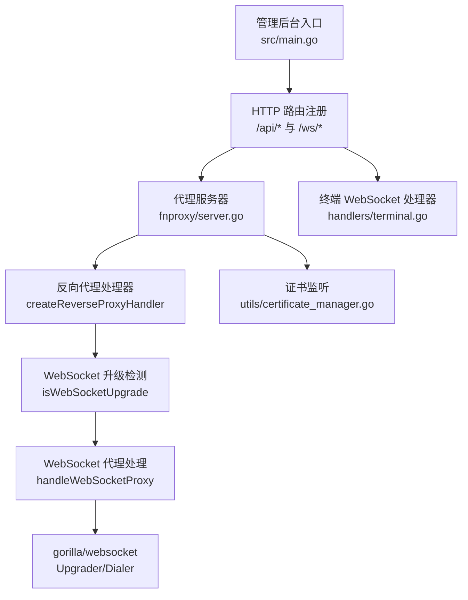
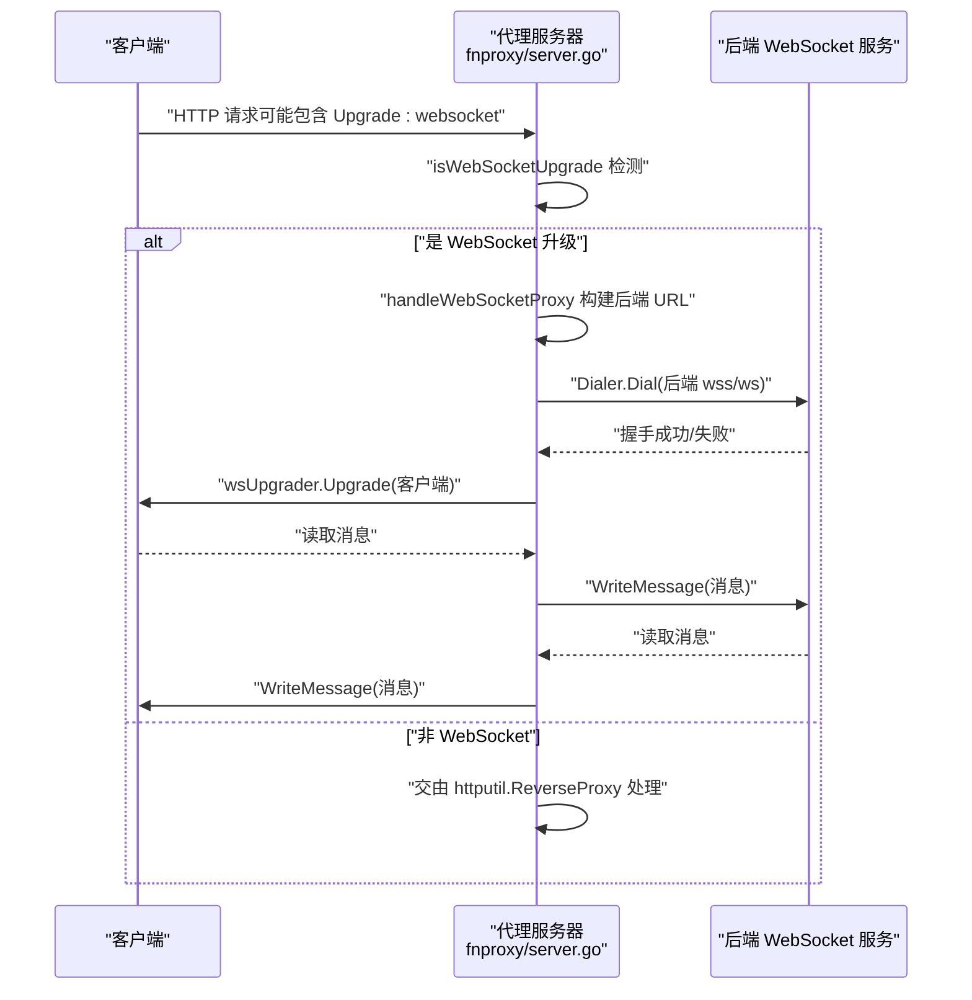
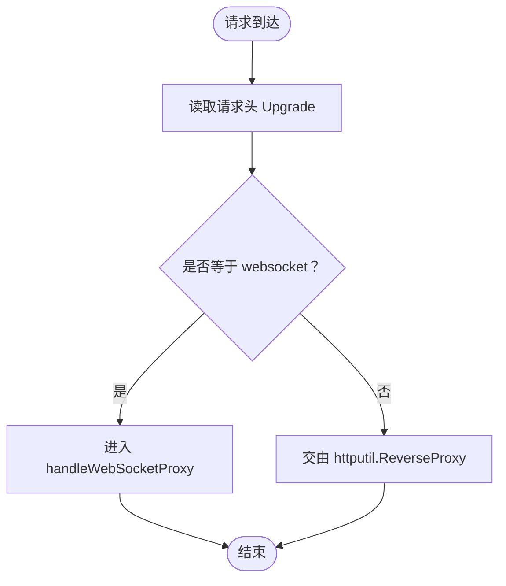
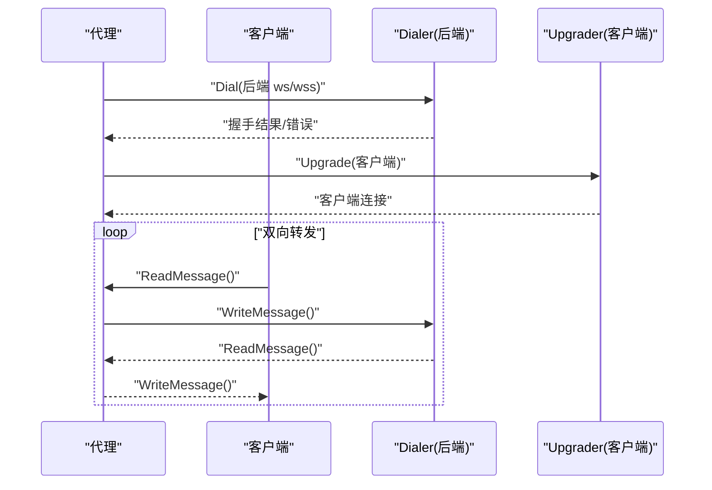
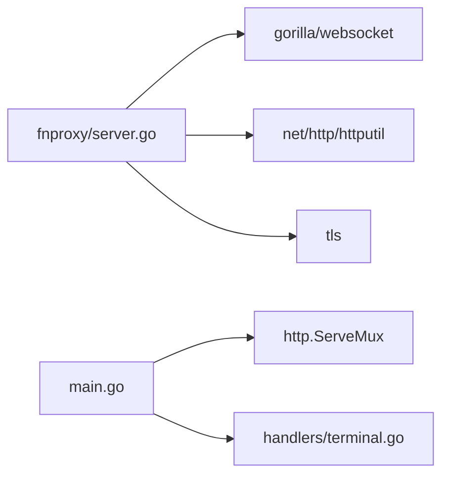

# WebSocket 代理

<cite>
**本文引用的文件**
- [src/main.go](file://src/main.go)
- [src/fnproxy/server.go](file://src/fnproxy/server.go)
- [src/handlers/terminal.go](file://src/handlers/terminal.go)
- [src/models/models.go](file://src/models/models.go)
- [src/utils/certificate_manager.go](file://src/utils/certificate_manager.go)
- [README.md](file://README.md)
</cite>

## 目录
1. [简介](#简介)
2. [项目结构](#项目结构)
3. [核心组件](#核心组件)
4. [架构总览](#架构总览)
5. [详细组件分析](#详细组件分析)
6. [依赖分析](#依赖分析)
7. [性能考量](#性能考量)
8. [故障排查指南](#故障排查指南)
9. [结论](#结论)

## 简介
本文件聚焦于项目中的 WebSocket 代理能力，系统性阐述 WebSocket 升级检测机制、代理实现原理、连接建立流程、头部处理策略（含 hop-by-hop 过滤与关键头部保留/修改）、子协议支持与安全考虑（Origin 处理与 TLS 配置），并提供性能优化建议与常见问题排查方法。读者可据此理解如何在本项目中实现稳定高效的 WebSocket 代理。

## 项目结构
项目采用模块化组织，WebSocket 代理主要涉及以下模块：
- 代理服务器与路由：fnproxy/server.go
- 管理后台与 API 路由：src/main.go
- 终端 WebSocket（非上游代理）：handlers/terminal.go
- 配置模型：models/models.go
- 证书管理（HTTPS/TLS 监听）：utils/certificate_manager.go
- 项目说明：README.md

图表来源
- [src/main.go:418-430](file://src/main.go#L418-L430)
- [src/fnproxy/server.go:442-584](file://src/fnproxy/server.go#L442-L584)
- [src/fnproxy/server.go:586-781](file://src/fnproxy/server.go#L586-L781)
- [src/handlers/terminal.go:353-377](file://src/handlers/terminal.go#L353-L377)
- [src/utils/certificate_manager.go:126-151](file://src/utils/certificate_manager.go#L126-L151)

章节来源
- [src/main.go:418-430](file://src/main.go#L418-L430)
- [src/fnproxy/server.go:442-584](file://src/fnproxy/server.go#L442-L584)
- [src/fnproxy/server.go:586-781](file://src/fnproxy/server.go#L586-L781)
- [src/handlers/terminal.go:353-377](file://src/handlers/terminal.go#L353-L377)
- [src/utils/certificate_manager.go:126-151](file://src/utils/certificate_manager.go#L126-L151)

## 核心组件
- 代理服务器与路由：负责监听端口、动态路由、反向代理与 WebSocket 升级分流。
- 反向代理处理器：封装 httputil.ReverseProxy，支持路径前缀处理、头部隐藏/添加、上游 TLS 传输复用。
- WebSocket 升级检测：通过请求头 Upgrade 字段识别 WebSocket 请求。
- WebSocket 代理处理：使用 gorilla/websocket 完成客户端与后端的双向消息转发。
- 证书管理：为 HTTPS 监听提供证书加载与自动续期能力。

章节来源
- [src/fnproxy/server.go:37-49](file://src/fnproxy/server.go#L37-L49)
- [src/fnproxy/server.go:442-584](file://src/fnproxy/server.go#L442-L584)
- [src/fnproxy/server.go:586-781](file://src/fnproxy/server.go#L586-L781)
- [src/utils/certificate_manager.go:126-151](file://src/utils/certificate_manager.go#L126-L151)

## 架构总览
WebSocket 代理在反向代理链路中被识别并分流至专用处理函数，完成握手、头部清洗与双向转发。

图表来源
- [src/fnproxy/server.go:576-583](file://src/fnproxy/server.go#L576-L583)
- [src/fnproxy/server.go:586-589](file://src/fnproxy/server.go#L586-L589)
- [src/fnproxy/server.go:640-781](file://src/fnproxy/server.go#L640-L781)

## 详细组件分析

### WebSocket 升级检测机制（isWebSocketUpgrade）
- 作用：识别 HTTP 请求是否为 WebSocket 升级请求。
- 实现要点：
  - 读取请求头 Upgrade 并与 "websocket" 比较（忽略大小写）。
  - 若匹配，则进入 WebSocket 代理处理流程；否则走常规反向代理。

图表来源
- [src/fnproxy/server.go:576-583](file://src/fnproxy/server.go#L576-L583)
- [src/fnproxy/server.go:586-589](file://src/fnproxy/server.go#L586-L589)

章节来源
- [src/fnproxy/server.go:576-583](file://src/fnproxy/server.go#L576-L583)
- [src/fnproxy/server.go:586-589](file://src/fnproxy/server.go#L586-L589)

### WebSocket 代理实现原理与连接建立
- 后端 URL 构建：根据上游目标 URL Scheme 决定后端 ws/wss。
- 头部处理：
  - 排除 hop-by-hop 头与 WebSocket 握手相关头（如 Connection、Upgrade、Sec-WebSocket-* 等）。
  - 保留关键头部：Host、X-Real-IP、X-Forwarded-For、X-Forwarded-Host、X-Forwarded-Proto。
  - Origin 特殊处理：默认不转发，避免后端基于 Origin 的限制导致握手失败。
- TLS 客户端配置：握手超时与跳过证书校验（InsecureSkipVerify）。
- 子协议支持：透传 Sec-WebSocket-Protocol。
- 客户端升级与双向转发：使用 gorilla/websocket 的 Upgrader/Dialer，分别升级客户端与连接后端，随后在两个 goroutine 中进行双向消息转发，任一方向出错即终止。

图表来源
- [src/fnproxy/server.go:640-781](file://src/fnproxy/server.go#L640-L781)

章节来源
- [src/fnproxy/server.go:640-781](file://src/fnproxy/server.go#L640-L781)

### 头部处理策略（hop-by-hop 过滤与关键头部）
- hop-by-hop 头过滤：明确排除 Connection、Keep-Alive、Proxy-Authenticate、Proxy-Authorization、Te、Trailer、Transfer-Encoding、Upgrade、Sec-Websocket-Key、Sec-Websocket-Version、Sec-Websocket-Extensions、Sec-Websocket-Protocol 等。
- 关键头部保留/设置：
  - Host：设置为上游 Host。
  - X-Real-IP：记录真实客户端 IP。
  - X-Forwarded-For：追加到已有链。
  - X-Forwarded-Host：原始 Host。
  - X-Forwarded-Proto：根据 TLS 状态设置 http/https。
- Origin：默认不转发，避免后端基于 Origin 的限制导致握手失败。

章节来源
- [src/fnproxy/server.go:654-706](file://src/fnproxy/server.go#L654-L706)

### 子协议支持与安全考虑
- 子协议支持：若客户端请求包含 Sec-WebSocket-Protocol，则透传给后端 Dialer。
- 安全考虑：
  - Origin 处理：默认不转发，降低后端基于 Origin 的访问控制对代理场景的影响。
  - TLS 配置：后端握手使用 InsecureSkipVerify，便于代理场景快速连通；生产建议结合上游证书策略与鉴权控制。

章节来源
- [src/fnproxy/server.go:715-718](file://src/fnproxy/server.go#L715-L718)
- [src/fnproxy/server.go:689-692](file://src/fnproxy/server.go#L689-L692)
- [src/fnproxy/server.go:711-713](file://src/fnproxy/server.go#L711-L713)

### 与 HTTPS/TLS 的集成
- 代理服务器支持 HTTPS 监听，通过证书管理器按监听器 ID 提供证书。
- 管理后台与代理监听均可能启用 TLS，确保代理链路与管理端通信安全。

章节来源
- [src/fnproxy/server.go:335-338](file://src/fnproxy/server.go#L335-L338)
- [src/utils/certificate_manager.go:126-151](file://src/utils/certificate_manager.go#L126-L151)

### 与管理后台路由的关系
- 管理后台将 /ws/ 前缀路由挂载到应用中间件，从而将 WebSocket 终端会话与代理服务器解耦。
- 代理服务器内部的 WebSocket 代理与 /ws/ 终端会话互不影响。

章节来源
- [src/main.go:418-430](file://src/main.go#L418-L430)
- [src/handlers/terminal.go:353-377](file://src/handlers/terminal.go#L353-L377)

## 依赖分析
- gorilla/websocket：用于 WebSocket 握手与消息收发。
- net/http/httputil：反向代理核心组件，配合共享 Transport 实现连接复用。
- tls：代理与证书管理的 TLS 支持。
- gorilla/mux：路由注册（在主入口中使用 ServeMux）。

图表来源
- [src/fnproxy/server.go:34](file://src/fnproxy/server.go#L34)
- [src/fnproxy/server.go:142-161](file://src/fnproxy/server.go#L142-L161)
- [src/main.go:112-430](file://src/main.go#L112-L430)
- [src/handlers/terminal.go:33](file://src/handlers/terminal.go#L33)

章节来源
- [src/fnproxy/server.go:34](file://src/fnproxy/server.go#L34)
- [src/fnproxy/server.go:142-161](file://src/fnproxy/server.go#L142-L161)
- [src/main.go:112-430](file://src/main.go#L112-L430)
- [src/handlers/terminal.go:33](file://src/handlers/terminal.go#L33)

## 性能考量
- 连接复用与池化
  - 共享 Transport：全局 http.Transport 已启用连接复用、空闲连接上限与超时配置，减少握手开销。
  - MaxIdleConns/MaxIdleConnsPerHost/MaxConnsPerHost：限制空闲与每主机连接数量，平衡资源占用与延迟。
  - IdleConnTimeout：空闲连接回收，避免长期占用。
- 缓冲区配置
  - WebSocket Upgrader/ Dialer 的读写缓冲区大小为 4096 字节，可根据实际消息大小与吞吐需求调整。
- 超时与错误处理
  - Dialer 握手超时与反向代理错误回调，有助于快速失败与可观测性。
- 路由与热更新
  - 监听器热重载时仅更新路由表与代理映射，避免重启带来的中断。

章节来源
- [src/fnproxy/server.go:142-161](file://src/fnproxy/server.go#L142-L161)
- [src/fnproxy/server.go:631-637](file://src/fnproxy/server.go#L631-L637)
- [src/fnproxy/server.go:540-572](file://src/fnproxy/server.go#L540-L572)

## 故障排查指南
- 连接失败
  - 后端握手失败：检查后端 ws/wss 地址、网络连通性与 TLS 配置；确认上游证书策略与代理的 InsecureSkipVerify 设置。
  - 代理错误回调：查看代理错误日志，定位上游地址、客户端 IP 与具体错误信息。
- 消息丢失
  - 双向转发依赖 goroutine，任一方向出错会触发通道关闭；检查客户端/后端断开原因与异常日志。
- Origin 限制
  - 若后端严格校验 Origin，建议在上游服务侧放宽或允许代理来源；当前代理默认不转发 Origin。
- 超时与资源耗尽
  - 调整 Dialer 握手超时、Transport 超时与连接池参数；监控空闲连接与并发连接数。

章节来源
- [src/fnproxy/server.go:720-728](file://src/fnproxy/server.go#L720-L728)
- [src/fnproxy/server.go:557-571](file://src/fnproxy/server.go#L557-L571)
- [src/fnproxy/server.go:689-692](file://src/fnproxy/server.go#L689-L692)
- [src/fnproxy/server.go:710-713](file://src/fnproxy/server.go#L710-L713)

## 结论
本项目在反向代理框架之上实现了稳定的 WebSocket 代理能力：通过 isWebSocketUpgrade 精准识别升级请求，借助 gorilla/websocket 完成握手与双向转发，并对头部进行合理过滤与关键信息保留。结合共享 Transport 的连接复用与热重载能力，可在保证性能的同时提升可用性。针对不同后端的 Origin 与 TLS 策略，建议在上游服务侧进行适配，或在代理层通过配置与安全策略进行约束。